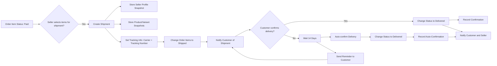

# E-Commerce Shopping Mall Platform Requirements Specification

## Service Vision

The shoppingMall platform is designed as a comprehensive e-commerce marketplace that empowers individual sellers to establish professional online shops while providing customers with a secure, feature-rich shopping experience grounded in transparency, accountability, and trust. Unlike traditional platforms that prioritize volume over integrity, shoppingMall is built around irreversible data records and immutable snapshots to ensure every financial transaction, product modification, and user interaction leaves a verifiable historical trail. This commitment to forensic-level data preservation creates a marketplace where disputes can be resolved objectively, product authenticity is guaranteed, and business relationships are maintained with mathematical certainty.

The platform's core philosophy is that e-commerce platforms handling monetary exchanges must be fundamentally different from social media or content platforms. In shoppingMall, every edit to a product, every change to a seller's profile, every cancellation request, and every review modification is permanently captured as an immutable snapshot. This isn't merely logging—it's creating a legally defensible audit trail that protects consumers, sellers, and the platform itself from fraud, misrepresentation, and API abuse. The platform doesn't just track changes—it preserves the entire business context of every transaction in its original state, creating a marketplace where facts cannot be altered after the fact.

## Core Value Proposition

shoppingMall delivers unique value to three distinct stakeholders through its snapshot-based architecture:

### For Customers

- **Trust through Transparency**: Every product detail, price, and seller profile at the exact moment of purchase is permanently preserved in a snapshot. This means customers can prove exactly what was promised when they made a purchase, creating an unassailable record for dispute resolution.
- **Marketplace Integrity**: Since sellers can't retroactively alter product descriptions or images after a sale, customers can shop with confidence that the product they receive matches what was advertised at the time of purchase.
- **Fair Dispute Resolution**: If a product doesn't match its description, the customer has access to the exact snapshot of the product as it appeared during the purchase, enabling clear evidence in refund or cancellation claims.

### For Sellers

- **Proof of Performance**: Sellers are protected by snapshots that prove the exact product state, pricing, and descriptions when orders were placed. This prevents dishonest customers from claiming "I didn't get what I ordered" when the snapshot proves otherwise.
- **Reputation Stability**: A seller's shop name, description, and logo are preserved at the time of every sale. Buyers reviewing orders later will always see the seller's profile as it existed during their purchase, preventing reputation manipulation after the fact.
- **Transaction Security**: Every inventory adjustment, product edit, and seller profile change is permanently tied to an actor and timestamp. This reduces disputes and supports legal compliance.

### For Administrators

- **Audit Trail Integrity**: Every action taken by an administrator is captured in a snapshot, ensuring accountability for any intervention (e.g., banning, canceling, overriding)
- **Dispute Resolution Enforcement**: Administrators can instantly reconstruct any past state of any product, order, review, or request to resolve disputes objectively
- **Compliance Assurance**: All financial records and transaction histories are preserved indefinitely in their exact form, meeting global regulatory standards (GDPR, CCPA, PCI-DSS)

## User Actors & Authentication

### Customer Actor

Customers are registered users who interact with the platform to browse, purchase, and manage their shopping experience.

#### Authentication Requirements

WHEN a customer registers, THE system SHALL require email and password.

WHEN a customer logs in, THE system SHALL validate email and password credentials.

WHEN a customer logs in, THE system SHALL issue a JWT access token with a 30-minute expiration and a refresh token with a 30-day expiration.

WHEN a customer changes their password, THE system SHALL require current password confirmation and generate a new JWT.

WHEN a customer deletes their account, THE system SHALL immediately invalidate all active sessions and delete all profile data (name, phone number, addresses).

WHERE a customer's account is deleted, THE system SHALL preserve all order history, review content, and seller profile names for legal and historical purposes, but display as "deleted user".

#### Profile Management

WHEN a customer edits their display name, THE system SHALL update the display name in their profile and reflect the change in all future reviews and order histories.

WHEN a customer edits their phone number, THE system SHALL validate format and update the value in the profile.

WHERE a customer modifies their profile, THE system SHALL NOT create a snapshot, as profile data is not part of the immutable snapshot principle.

#### Address Management

WHEN a customer adds a new shipping address, THE system SHALL require recipient name, phone number, street address, city, state/province, postal code, and country.

WHEN a customer edits an existing address, THE system SHALL preserve the original data in an address snapshot.

WHEN a customer deletes an address, THE system SHALL mark it as inactive but preserve it in snapshot history.

WHEN a customer sets an address as default, THE system SHALL update the default flag and invalidate the previous default.

WHEN a customer places an order, THE system SHALL use the selected default address unless overridden.

WHERE a customer's default address is deleted, THE system SHALL automatically reset the default to the first active address in their list.

#### Wishlist Management

WHEN a customer adds a product to their wishlist, THE system SHALL record the product ID and timestamp.

WHEN a customer removes a product from their wishlist, THE system SHALL delete the relationship.

WHERE a product is deleted by a seller, THE system SHALL automatically remove it from all customers' wishlists.

WHEN a customer views their wishlist, THE system SHALL display all products as available unless they are deleted.

#### Shopping Cart Management

WHEN a customer adds a product variant to their cart, THE system SHALL require selection of a specific variant with unique SKU.

WHEN a customer adds a variant already in their cart, THE system SHALL increment the quantity, not add a duplicate.

WHEN a customer changes the quantity of an item in cart, THE system SHALL validate sufficient stock.

WHEN a customer removes an item from cart, THE system SHALL delete the cart entry.

WHEN a customer proceeds to checkout, THE system SHALL validate all items have sufficient stock and are not deleted.

WHERE a product variant's stock drops below cart quantity, THE system SHALL show warning and disable checkout.

#### Checkout Process

WHEN a customer proceeds to checkout, THE system SHALL require selection of a shipping address.

WHEN a customer confirms checkout, THE system SHALL lock the selected shipping address and cart state.

WHEN a customer completes checkout, THE system SHALL create an order and remove all items from cart.

WHERE payment fails, THE system SHALL preserve cart state and allow retry.

WHERE payment succeeds, THE system SHALL initiate order creation process.

#### Review and Rating Management

WHEN a customer writes a review, THE system SHALL require rating (1-5) and allow optional text.

WHEN a customer writes a review, THE system SHALL validate that the item has status "delivered".

WHEN a customer edits a review, THE system SHALL create a review snapshot preserving the prior version.

WHEN a customer deletes a review, THE system SHALL mark it as deleted but preserve snapshot history.

WHERE a review is deleted, THE system SHALL recalculate the product's average rating without the deleted review.

### Seller Actor

Sellers are business entities that list products, manage inventory, fulfill orders, and interact with customer inquiries.

#### Authentication Requirements

WHEN a seller registers, THE system SHALL require email and password.

WHEN a seller logs in, THE system SHALL validate email and password credentials.

WHEN a seller logs in, THE system SHALL issue a JWT access token with a 30-minute expiration and a refresh token with a 30-day expiration.

WHEN a seller changes their password, THE system SHALL require current password confirmation and generate a new JWT.

WHEN a seller deletes their account, THE system SHALL immediately invalidate all active sessions and delete their shop profile (name, description, logo).

WHERE a seller's account is deleted, THE system SHALL preserve all order history, snapshots, and product snapshots for legal and historical purposes.

WHERE a seller's registration is rejected, THE system SHALL store rejection reason and allow resubmission.

WHERE a seller is suspended, THE system SHALL hide their products from search and category listings.

#### Profile Management

WHEN a seller updates their shop name, THE system SHALL create a seller profile snapshot.

WHEN a seller updates their shop description, THE system SHALL create a seller profile snapshot.

WHEN a seller updates their logo image, THE system SHALL create a seller profile snapshot.

WHEN a customer views a seller profile, THE system SHALL display the current profile and allow viewing of snapshot history.

WHERE a seller edits their profile, THE system SHALL preserve all previous versions in immutable snapshots for dispute resolution.

#### Product Management

WHEN a seller creates a product, THE system SHALL require name, description, category, and base price.

WHEN a seller edits a product, THE system SHALL create a product snapshot capturing the state before change.

WHEN a seller deletes a product, THE system SHALL validate that no pending order items exist for any variant.

WHEN a seller deletes a product, THE system SHALL remove it from all category listings and search results.

WHEN a seller deletes a product, THE system SHALL preserve all product snapshots.

WHEN a seller uploads a product image, THE system SHALL allow multiple uploads and reorder.

WHEN a seller deletes a product image, THE system SHALL update the image list and include in product snapshot.

#### Variant Management

WHEN a seller adds a variant to a product, THE system SHALL require SKU code, option values, and stock quantity.

WHEN a seller edits a variant, THE system SHALL create a variant snapshot preserving the previous state.

WHEN a seller deletes a variant, THE system SHALL validate that no pending order items exist.

WHERE a product has no variants, THE system SHALL display "unavailable".

WHILE a variant has stock quantity of 0, THE system SHALL show "out of stock".

#### Inventory Management

WHEN a seller restocks a variant, THE system SHALL create an inventory record with positive quantity change and reason.

WHEN a seller adjusts inventory downward, THE system SHALL create an inventory record with negative quantity change and reason.

WHEN an order is placed, THE system SHALL create a negative inventory record for each purchased variant.

WHEN a cancellation or refund is approved, THE system SHALL create a positive inventory record for the variant.

WHEN a seller views inventory history, THE system SHALL display all records chronologically.

#### Order Fulfillment

WHEN a seller ships one or more order items, THE system SHALL create a shipment record.

WHEN a shipment is created, THE system SHALL update status of all included items to "shipped".

WHEN a seller enters tracking information, THE system SHALL store it with the shipment.

WHEN a seller processes a cancellation request, THE system SHALL create a cancellation request snapshot.

WHEN a seller processes a refund request, THE system SHALL create a refund request snapshot.

### Admin Actor

Admins are authorized personnel with elevated privileges to manage the integrity and compliance of the platform.

#### Authentication Requirements

WHEN an admin logs in, THE system SHALL require email and password, with JWT token as for regular actors.

WHEN a user is promoted to admin, THE system SHALL assign elevated permissions and notify the user.

WHERE an admin's account is banned, THE system SHALL disable all access.

#### Seller Management

WHEN an admin reviews a seller registration, THE system SHALL allow approval, rejection, or pending.

WHEN an admin rejects a seller registration, THE system SHALL require a reason and store it.

WHEN an admin suspends a seller, THE system SHALL hide all products from public view.

WHEN an admin unsuspends a seller, THE system SHALL make products visible again.

WHEN an admin permanently bans a seller, THE system SHALL prevent login and preserve order history.

WHERE a seller is banned or suspended, THE system SHALL allow fulfillment of existing orders only.

#### Category Management

WHEN an admin creates a category, THE system SHALL require name and description, with optional parent category for nesting.

WHEN an admin edits a category, THE system SHALL update name and description.

WHEN an admin deletes a category, THE system SHALL mark all associated products as "uncategorized".

#### Product Oversight

WHEN an admin views products, THE system SHALL display all products on the platform, regardless of seller status.

WHEN an admin views a product, THE system SHALL display all snapshots and edit history.

WHEN an admin deletes a product, THE system SHALL delete it from listings, preserve snapshots for audit.

#### Order Oversight

WHEN an admin views orders, THE system SHALL display all orders and order items across all users.

WHEN an admin forces cancellation of an order item, THE system SHALL update status to "cancelled", restore stock, issue refund, and create snapshot.

WHEN an admin forces refund of an order item, THE system SHALL update status to "refunded", restore stock, issue refund, and create snapshot.

WHEN an admin forces cancellation of entire order, THE system SHALL cancel all items.

WHEN an admin forces refund of entire order, THE system SHALL refund all items.

#### User Management

WHEN an admin views customer accounts, THE system SHALL display all customer details.

WHEN an admin bans a customer, THE system SHALL prevent login, preserve order history.

WHEN an admin unbans a customer, THE system SHALL restore login access.

WHEN an admin views seller accounts, THE system SHALL display all sellers with approval status.

WHEN an admin bans a seller, THE system SHALL prevent login, preserve order history.

#### Admin Role Management

WHEN a user requests admin access, THE system SHALL record reason and create pending request.

WHEN a super admin approves an admin request, THE system SHALL assign "regular admin" role.

WHEN a super admin promotes a regular admin, THE system SHALL change role to "super admin".

WHEN a super admin demotes a super admin, THE system SHALL change role to "regular admin".

WHERE a super admin attempts to demote themselves, THE system SHALL reject the action.

## Business Model

### Why This Service Exists

This e-commerce shopping mall platform exists to solve a critical market gap: the lack of a trustworthy, transparent, and accountability-driven marketplace for buyers and sellers in high-value transactions. Current platforms prioritize volume over reliability, enabling fraud through opaque seller behavior, unverified seller identities, and non-existent product history. Buyers face risk when purchasing from unknown vendors; sellers struggle to build reputation due to platform policies that erase historical data, making it impossible to prove consistency or integrity.

This service differentiates by enforcing immutable record-keeping through snapshot technology. Every change to a product, variant, seller profile, order item, review, or request is permanently recorded and preserved. This provides: 
- Buyers with verifiable product authenticity and pricing history
- Sellers with proof of fair business conduct and dispute resolution evidence
- Administrators with audit trails for regulatory compliance and fraud investigation

The platform is not designed to be a high-volume discount marketplace; rather, it positions itself as a premium, accountability-first e-commerce environment for consumers who value transparency and trust. It serves niche markets—such as artisanal goods, collectibles, electronics, and fashion—where product provenance and seller credibility directly affect purchase decisions.

Competitors like Amazon or Etsy operate on a permissions-based model where trust is inferred from ratings and reviews, but these are easily manipulated, deleted, or mass-generated. This platform makes trust explicit and unalterable. No data is expunged. No edits are erased. All history is preserved. This creates a self-reinforcing ecosystem where sellers with consistent, honest behavior are rewarded through reputation and repeat customers.

### Revenue Strategy

The platform monetizes through a combination of transaction fees, premium seller features, and administrative service tiers.

#### Transaction Fee
- THE system SHALL charge a 7.5% commission on the total order value for every successful transaction (payment confirmed).
- THE commission SHALL be calculated after all discounts, promotions, or coupon reductions are applied.
- THE system SHALL withhold the commission from the seller’s payout and not from the buyer’s payment.
- THE commission SHALL be applied to all seller-generated sales but not to admin-initiated refunds or cancellations.

#### Premium Seller Subscription
- WHEN a seller has more than 100 successful order items in the last 90 days, THE system SHALL offer access to a Premium Seller plan.
- THE Premium Seller plan SHALL be priced at $49 per month.
- THE plan SHALL include:
  - Priority listing position in category and search results
  - Ability to display up to 15 product images (vs. standard 8)
  - Access to advanced analytics dashboard (conversion rate, traffic sources, top variants)
  - Faster response time for approval requests from administrators
  - Priority placement in customer-facing "Trusted Seller" badges

#### Transaction-Based Value-Added Services
- WHEN a seller requests an expedited approval for new product listing (within 2 hours), THE system SHALL charge a $5 service fee.
- WHEN a seller requests to reactivate a previously suspended account, THE system SHALL require a $20 reinstatement fee.
- WHEN a customer requests to expedite a refund review (from 3–5 business days to 24 hours), THE system SHALL charge a $3 service fee.

#### Admin Service Tiers
- WHERE a user requests to become an administrator, THE system SHALL charge a one-time verification fee of $100.
- THE fee SHALL be refunded if the super administrator rejects the application.
- THE fee SHALL be non-refundable if the application is approved.

#### Advertising
- THE system SHALL offer optional ad placement in category listing pages for sellers.
- Ad slots SHALL be auction-based, with sellers bidding a maximum daily budget.
- Ad placements SHALL display "Sponsored" label.
- THE system SHALL NOT interfere with organic search results.
- Ad revenue SHALL be limited to no more than 20% of total platform revenue.

### Growth Plan

#### User Acquisition
- WHEN a customer registers, THE system SHALL offer a $10 welcome credit (non-transferable, valid for 30 days) to encourage first purchase.
- THE system SHALL partner with 5–10 micro-influencers in niche markets (e.g., vintage collectibles, sustainable fashion) to run creator-led campaigns.
- WHEN a customer invites a friend who registers AND makes a purchase over $100, THE system SHALL credit both users with $15 store credit.

#### Seller Acquisition
- WHEN an individual or business registers as a seller, THE system SHALL conduct manual review of submitted documents for legitimacy (business license, ID, bank details).
- THE system SHALL shortlist and invite 30 high-potential sellers from existing e-commerce platforms (e.g., Etsy, eBay) using public product listings as bait.
- THE system SHALL offer waived commission for first 5 transactions to early-adopting sellers.

#### Retention & Engagement
- WHILE a customer has items in their cart for more than 72 hours, THE system SHALL send a reminder email with a 5% discount code for the cart contents.
- WHEN a seller has any order item in ‘paid’ status for more than 48 hours without shipping, THE system SHALL send an automated reminder to the seller.
- WHEN a customer’s last purchase was more than 120 days ago, THE system SHALL trigger a "We miss you" email with personalized product recommendations.
- WHEN a customer leaves a review and the seller responds, THE system SHALL notify the customer with a thank-you badge visible on their profile.

#### Tiered Platform Expansion
- After reaching 5,000 active sellers, THE system SHALL launch ‘Military & First Responder’ seller verification program with waived fees.
- After reaching 25,000 sales per month, THE system SHALL introduce ‘Wholesale Marketplace’ for bulk sellers with tiered pricing.
- After reaching 100,000 registered users, THE system SHALL integrate local pickup points with geo-location-based delivery discounts.

### Success Metrics

#### Core Performance Indicators
- Monthly Active Users (MAU): 50,000 within 12 months
- Monthly Transaction Volume (MTV): $2.5M within 12 months
- Average Order Value (AOV): $85
- Seller Retention Rate: 85% after 90 days
- Customer Repeat Purchase Rate: 45% within 180 days
- Seller Approval Conversion Rate: 60% of applicants become approved
- Product Edit Snapshot Retention Rate: 100% (no snapshot ever deleted)
- Review Eligibility Enforcement: 100% of reviews written only after delivery

#### Quality of Trust Metrics
- Dispute Resolution Rate (within 7 days): 90%
- Seller Response Time to Cancellation/Refund Requests: < 12 hours (80% of cases)
- Time to Delivery (from shipping to confirmation): 9.7 days (median)
- Cart Abandonment Rate (due to out-of-stock): < 8%
- Admin Intervention Rate (on reviews): < 0.3%

#### Financial Sustainability
- Gross Profit Margin: 50% after payment processing fees
- Customer Acquisition Cost (CAC): < $12
- Customer Lifetime Value (LTV): > $320
- LTV:CAC Ratio: > 26:1
- Operational Cost to Revenue Ratio: < 28%
- Platform Breakeven: Month 14
- Contribution Margin per Product: > $7.20

The model does not rely on vanity metrics (likes, followers, traffic). Instead, it measures trust, permanence, and financial sustainability — ensuring the business survives not by scaling blindly, but by building a system so reliable that users return not because they have to, but because they know they can trust it.

## Product Management

### Product Creation

WHEN a seller attempts to create a new product, THE system SHALL require the following mandatory fields:
- Product name (minimum 3 characters, maximum 200 characters)
- Product description (minimum 10 characters, maximum 5,000 characters)
- Category (must be an existing category or subcategory)
- Base price (must be a positive number greater than 0, with maximum 2 decimal places)

WHEN a seller submits a product creation request, THE system SHALL:
- Validate all required fields are present and meet length constraints
- Verify the selected category exists and is active
- Confirm the price is a positive number with at most two decimal places
- Check that the seller has no outstanding violations or suspensions

IF the product creation request contains invalid data, THEN THE system SHALL:
- Return an appropriate error message indicating which field(s) failed validation
- Include specific error codes for each validation failure
- Not create any product record
- Preserve the seller's attempt history for audit purposes

WHERE a seller has reached their maximum allowed product count (1,000 products per seller), THEN THE system SHALL deny product creation and display an appropriate message

WHILE a product is being created, THE system SHALL:
- Generate a unique product ID (UUID format)
- Assign the current timestamp as the creation date
- Set the "active" status to true
- Associate the product with the seller's account
- Initialize the "product snapshots" history with the initial product state

### Product Editing & Snapshots

WHEN a seller edits any field of an existing product (name, description, category, or base price), THE system SHALL:
- Create a product snapshot before applying the changes
- Preserve all previous values in the snapshot
- Record the exact timestamp of the edit
- Record the identity of the seller who made the change
- Update the product with the new values

THE product snapshot SHALL include all of the following fields with their values at the time of the edit:
- Product name
- Product description
- Category (with full hierarchy path)
- Base price
- Product status (active/inactive)
- Creation timestamp
- Last modified timestamp
- All product images (with their order and metadata)
- All variants with their current values at the time of edit (SKU code, option values, prices, stock quantities)

WHILE a product is being edited, THE system SHALL:
- Lock the product from being modified by other processes during the editing transaction
- Apply the snapshot creation before any field changes are committed
- Use atomic database operations to ensure data integrity
- Maintain consistent referential integrity between the product and its associated variants

IF a seller attempts to edit a product that has been deleted (logically or completely), THEN THE system SHALL deny the edit request and return appropriate error

WHERE a product has no active variants, THE system SHALL allow edit operations but display a warning that the product cannot be purchased

WHEN a product edit creates a snapshot, THE system SHALL:
- Generate a unique snapshot ID (UUID format)
- Generate a version number (incremented integer based on previous snapshots)
- Store the snapshot data in immutable storage
- Maintain a reference link from the live product to the new snapshot
- Preserve the snapshot for the lifetime of the platform, even if the product is later deleted

### Product Deletion

WHEN a seller attempts to delete a product, THE system SHALL:
- Validate that no order items exist for any variant of this product in "paid" or "shipped" status
- Validate that no pending cancellation requests exist for any variant of this product
- Validate that no pending refund requests exist for any variant of this product

IF any order items exist for this product with status "paid" or "shipped" THEN THE system SHALL deny deletion and return: "Cannot delete product because variants have paid or shipped order items"

IF any pending cancellation requests exist for this product's variants THEN THE system SHALL deny deletion and return: "Cannot delete product because variants have pending cancellation requests"

IF any pending refund requests exist for this product's variants THEN THE system SHALL deny deletion and return: "Cannot delete product because variants have pending refund requests"

WHEN a product is successfully deleted, THE system SHALL:
- Perform logical deletion (soft delete) by setting "deleted" flag to true
- Remove the product from search and category listings
- Prevent all new purchases of any variant of this product
- Preserve the product record for reporting and audit purposes
- Preserve all snapshots of the product for the lifetime of the platform
- Preserve the connection between product and all associated order items

WHILE the product is being deleted, THE system SHALL:
- Disable all endpoints that would allow viewing or purchasing the product
- Lock the product from further edits or deletions
- Apply the deletion process as a single transaction

IF a product is deleted while it has active inventory records, THE system SHALL:
- Preserve the inventory history for financial audit purposes
- Prevent further inventory adjustments to the deleted product's variants
- Maintain the relationship between inventory records and the deleted product
- Allow calculation of historical stock levels for reporting

WHERE a seller deletes a product, THEN THE system SHALL send a notification to all customers who have the product on their wishlist

### Product Images

WHEN a seller uploads an image for a product, THE system SHALL:
- Accept only image file types (JPEG, PNG, WebP)
- Validate file size is not larger than 10MB
- Generate a unique file name using UUID for security
- Store the image in an immutable storage system
- Preserve original file metadata (dimensions, creation date)
- Create a record for the image with the following fields:
  - Image ID (UUID)
  - Product ID
  - Image URL path
  - File size
  - File type
  - Width (pixels)
  - Height (pixels)
  - Creation timestamp
  - Sort order (initially 0)

WHEN a seller changes the order of product images, THE system SHALL:
- Update the sort order of each image according to the new arrangement
- Record this change as part of the product's editing history
- Create a product snapshot with the new image sequence

WHEN a seller deletes an image from a product, THE system SHALL:
- Remove the image's reference from the product's image list
- Create a product snapshot with the updated image list
- Preserve the deleted image file in the storage system (to maintain historical accuracy of snapshots)
- Prevent the image from appearing in any new product views

IF a product has no images, THE system SHALL display a default placeholder image on product listings and detail pages

WHILE a product's images are being edited (added, reordered, or deleted), THE system SHALL:
- Lock the product editing process during the image manipulation transaction
- Apply changes atomically to ensure data consistency
- Immediately update the product's thumbnail (first image) if affected

### Product Variants (SKU)

WHEN a seller creates a new product variant, THE system SHALL:
- Validate that the product has at least one active variant
- Require a unique SKU code (must be alphanumeric, 3-20 characters)
- Require option values (name-value pairs for each attribute)
- Validate that option values are non-empty strings
- Validate that stock quantity is zero or greater
- Accept optional price override (must be zero or greater)
- Require at least one variant per product

WHEN a seller creates a new product variant, THE system SHALL:
- Generate a unique variant ID (UUID format)
- Set the create timestamp to now
- Set the last modified timestamp to now
- Associate the variant with the product
- Initialize inventory history with zero entries
- Apply the variant to the live product list

WHEN a seller edits an existing variant's SKU code, option values, or price, THE system SHALL:
- Create a product-snapshot-SKV record (variant snapshot) with current values
- Apply the edits to the live variant
- Update the variant's last modified timestamp
- Preserve the previous values in the snapshot
- Ensure SKU code uniqueness across all variants of all products

WHEN a seller deletes a variant, THE system SHALL:
- Validate that no order items exist for this variant in "paid" or "shipped" status
- Validate that no pending cancellation requests exist for this variant
- Validate that no pending refund requests exist for this variant
- Create a product-snapshot-SKV snapshot with the variant's values at the time of deletion
- Remove the variant from product offerings
- Preserve the variant data for historical reporting

IF any order items exist for a variant with status "paid" or "shipped" AND a seller attempts to delete the variant, THEN THE system SHALL deny deletion and return: "Cannot delete variant because it has paid or shipped order items"

IF any pending cancellation requests exist for a variant AND a seller attempts to delete it, THEN THE system SHALL deny deletion and return: "Cannot delete variant because it has pending cancellation requests"

IF any pending refund requests exist for a variant AND a seller attempts to delete it, THEN THE system SHALL deny deletion and return: "Cannot delete variant because it has pending refund requests"

WHILE a variant is being edited or deleted, THE system SHALL:
- Lock the variant from concurrent modifications
- Apply changes using atomic database operations
- Maintain consistent state between the variant and its inventory history
- Preserve the variant's association with past order items

WHERE a product has no variants, THE system SHALL display the product as "Unavailable" and prevent purchase

## Inventory & Stock Handling

### Inventory Updates

WHEN a seller adds inventory to a product variant, THE system SHALL create a new inventory history record with a positive quantity change and the provided reason.

WHEN a seller subtracts inventory from a product variant for any reason other than order placement, THE system SHALL create a new inventory history record with a negative quantity change and the provided reason.

WHEN an order is successfully placed, THE system SHALL create a negative inventory history record for each variant in the order with the quantity purchased and "order purchase" as the reason.

WHEN a cancellation request for an order item is approved, THE system SHALL create a positive inventory history record for that variant with the canceled quantity and "cancellation refund" as the reason.

WHEN a refund request for an order item is approved, THE system SHALL create a positive inventory history record for that variant with the refunded quantity and "refund release" as the reason.

WHEN a seller edits a product variant's stock quantity directly, THE system SHALL calculate the difference from the current stock and create a single inventory history record representing that adjustment with a reason provided by the seller.

WHILE a product variant's inventory history is being modified, THE system SHALL maintain an atomic lock on the variant to prevent concurrent inventory updates.

### Stock Level Management

THE system SHALL calculate the current stock quantity for each product variant by summing all inventory history records associated with that variant.

WHEN a product variant's calculated stock quantity reaches 0, THE system SHALL set the variant's status to "out of stock".

WHEN a product variant's calculated stock quantity increases from 0 to any positive value, THE system SHALL set the variant's status to "in stock".

WHEN a product variant has zero or negative total stock from all inventory records, THE system SHALL prevent the variant from being added to any shopping cart.

THE system SHALL ensure that current stock levels are updated in real time after any inventory modification, with no caching delays.

WHILE a customer attempts to add a variant to their cart, THE system SHALL validate the variant's current stock level and reject the addition if the stock is 0 or below.

### Inventory History

EVERY inventory change SHALL be recorded as an immutable history record containing:
- The unique variant identifier
- The timestamp of the change
- The quantity change (positive for restock, negative for depletion)
- The reason for the change (e.g., "order purchase", "cancellation refund", "seller adjustment")
- The seller identifier responsible for the change
- The order identifier (if applicable)

THE system SHALL store all inventory history records permanently and never delete them.

WHEN a seller views the inventory history for a variant, THE system SHALL display all records chronologically with the most recent first.

WHEN an administrator views the inventory history for any variant on the platform, THE system SHALL provide the same level of visibility as the seller.

WHILE retrieving inventory history, THE system SHALL automatically calculate and display the running total of inventory changes.

WHEN a product is deleted, THE system SHALL preserve all inventory history records for all variants of that product.

### Out-of-Stock Behavior

WHEN a product variant has a stock quantity of 0, THE system SHALL display the variant as "out of stock" on the product detail page.

WHEN a product variant is "out of stock", THE system SHALL prevent customers from adding the variant to their shopping cart.

WHEN a product variant is "out of stock", THE system SHALL display a message to customers attempting to add it: "This item is currently out of stock. Please check back later."

WHEN a customer has a variant in their cart with zero stock (due to concurrent purchase), THE system SHALL mark that cart item as "unavailable" with the message: "This item is no longer in stock. It has been removed from your cart."

WHEN a variant's stock changes from 0 to a positive number, THE system SHALL automatically remove the "out of stock" status and make the variant available for purchase.

WHEN the marketing team or seller runs a promotion, THE system SHALL update the variant's stock level through the inventory history system and trigger real-time availability updates to all customer interfaces.

## Shopping Cart & Checkout

### Cart Addition

#### Product Selection
WHEN a customer selects a product variant to add to cart, THE system SHALL validate that:
- The variant exists and is active
- The variant's stock quantity is greater than zero
- The variant's product has not been deleted
- The variant belongs to an approved seller

#### Cart Entry Creation
WHEN a customer adds a variant to cart, THE system SHALL:
- Create a cart entry with the variant's current snapshot data
- Store product name, description, variant options, price, and images at the time of addition
- Store seller shop name and logo at the time of addition
- Record timestamp of addition
- Set initial quantity to 1 if no existing entry for this variant

#### Duplicate Variant Handling
WHEN a customer adds a variant that already exists in their cart, THE system SHALL:
- Increase the quantity of the existing cart entry by the requested amount
- NOT create a duplicate cart entry
- Preserve the original snapshot data (product, variant, seller) from the first addition
- Update the total cart value with the new quantity

#### Cart Capacity
WHILE a customer's cart contains more than 50 unique variants, THE system SHALL:
- Show a warning notification
- Allow addition of additional variants
- Prevent checkout until cart is reduced to 50 or fewer variants

### Cart Quantity Management

#### Quantity Adjustment
WHEN a customer changes the quantity of an item in cart, THE system SHALL:
- Validate that the new quantity is between 1 and the variant's current stock
- Update the cart entry with the new quantity
- Recalculate the subtotal for that item
- Update the total cart value

#### Quantity Validation
IF the requested quantity exceeds the variant's current stock, THEN THE system SHALL:
- Reject the quantity change
- Display an error message: "Only {stock} items available"
- Keep the original quantity unchanged
- Highlight the affected item in red

#### Quantity Reduction Below 1
IF a customer attempts to reduce a cart item's quantity to 0 or less, THEN THE system SHALL:
- Remove the cart entry entirely
- Not allow negative quantities
- Recalculate total cart value

#### Batch Quantity Updates
WHEN multiple cart items are updated simultaneously via bulk edit, THE system SHALL:
- Process each item individually with the same validation rules
- Return aggregate validation results
- Apply all valid changes, reject invalid ones
- Preserve state of unaffected items

### Cart Removal

#### Item Removal
WHEN a customer removes a cart item, THE system SHALL:
- Delete the cart entry immediately
- Recalculate total cart value
- Preserve the snapshot data from the removed item
- Log the removal action with timestamp

#### Complete Cart Clearing
WHEN a customer chooses to clear entire cart, THE system SHALL:
- Remove all cart entries for that customer
- Preserve snapshot data from all removed items for audit purposes
- Reset cart total to 0
- Trigger cart clearance event for analytics

#### Product Deletion Impact
IF a product associated with a cart item is deleted by the seller, THEN THE system SHALL:
- Mark the cart item as "Unavailable - Product deleted"
- Preserve the snapshot data of the product and variant
- Prevent further quantity changes
- Allow removal from cart but not checkout

#### Variant Deletion Impact
IF a variant associated with a cart item is deleted by the seller, THEN THE system SHALL:
- Mark the cart item as "Unavailable - Variant deleted"
- Preserve the snapshot data of the variant
- Prevent further quantity changes
- Allow removal from cart but not checkout

### Cart Validation

#### Stock Validation
WHEN a customer attempts to checkout, THE system SHALL validate for each cart item that:
- The variant's current stock quantity is greater than or equal to the cart quantity
- The variant's product has not been deleted
- The variant's seller account is not suspended
- The seller's shop status is approved

#### Price Validation
WHEN a customer attempts to checkout, THE system SHALL compare each cart item's:
- Stored price (from snapshot at addition time)
- Current variant price
IF current price differs from stored price, THEN THE system SHALL:
- Show warning: "Price has changed since added to cart"
- Allow continuation with original price (customer's protection)
- Log the price discrepancy for seller review

#### Seller Consistency
IF cart contains items from sellers with suspended accounts, THEN THE system SHALL:
- Block checkout entirely
- Show message: "Items from suspended sellers cannot be checked out"
- Highlight affected items and seller names
- Allow removal of affected items only

#### Cart State Transition
WHEN cart items are modified (added, quantity changed, removed), THE system SHALL:
- Update the cart's "last modified" timestamp
- Recalculate total quantity and total value
- Maintain snapshot integrity of all items
- Allow partial checkout only if all items validate

### Cart Checkout Process

#### Checkout Eligibility
WHEN a customer initiates checkout, THE system SHALL validate that:
- Cart is not empty
- All cart items are available (not deleted or suspended)
- All cart items have sufficient stock
- Cart contains at least one item
- Customer has at least one shipping address

#### Cart Locking
WHEN checkout is initiated, THE system SHALL:
- Lock cart for modification
- Prevent any additions, removals, or quantity changes
- Display checkout summary as frozen snapshot
- Show "Checkout in progress" banner

#### Order Preparation
WHEN checkout is confirmed, THE system SHALL:
- Transfer cart items to order
- Store complete snapshot of each cart item (product, variant, seller)
- Create inventory reduction records for each item
- Empty the shopping cart
- Generate order record with status "paid"
- Remove cart items from the cart in a single transaction

#### Failed Checkout Flow
IF checkout fails due to stock changes, price changes, or other validations, THEN THE system SHALL:
- Unlock cart for modification
- Show detailed error messages for each failed item
- Preserve cart state with current quantities
- Highlight items that prevented checkout
- Allow retry after addressing issues

#### Partial Checkout
IF only some items in cart pass validation, THEN THE system SHALL:
- Allow checkout of only valid items
- Move valid items to order record
- Remove valid items from cart
- Keep invalid items in cart with error indicators
- Show message: "Partially completed checkout"

#### Snapshot Integrity
WHEN checkout is completed, THE system SHALL create a checkout snapshot that:
- Records the exact state of the cart before processing
- Includes all cart entry snapshot data
- Contains timestamp and customer ID
- Is immutable and preserved for audit
- Is accessible to administrator and customer for dispute resolution

#### Checkout Confirmation
WHEN checkout is successful, THE system SHALL:
- Present confirmation screen with order number
- Show summary of items, shipping address, total
- Display expected delivery timeframe
- Provide order tracking link
- Redirect to order history page

#### Cart Recovery
AFTER checkout failure or cancellation, THE system SHALL:
- Restore cart items to their state before checkout attempt
- Re-validate stock quantities
- Preserve any price discrepancy warnings
- Maintain item snapshots
- Allow new checkout attempt

## Order Management

### Order Generation Trigger

WHEN a customer completes successful payment, THE system SHALL create a new order.

### Order Composition Requirements

WHEN an order is created, THE system SHALL:

- Generate a unique order number in format "ORD-YYYYMMDD-NNNN" where NNNN is a sequential number within the same day
- Set the order creation timestamp to the exact moment of payment confirmation
- Set the primary order status to "paid"
- Set the shipping address to the one selected by the customer at checkout
- Link each item in the customer's cart to a corresponding order item

### Order Item Creation Requirements

WHEN an order is created, THE system SHALL create one order item per unique product variant in the cart.

WHEN creating an order item, THE system SHALL:

- Set the product ID to the variant's parent product identifier
- Set the variant ID to the specific product variant identifier
- Set the quantity to the quantity selected by the customer
- Set the unit price to the exact price of the variant at the time of cart addition
- Set the seller ID to the seller who created the product
- Set order item status to "paid"

### Order Item Snapshot Requirements

WHEN an order item is created, THE system SHALL create and attach a snapshot of:

- The complete product state at time of purchase (name, description, category, base price, images)
- The complete variant state at time of purchase (SKU code, option values, price, stock quantity)
- The seller profile state at time of purchase (shop name, description, logo)

WHILE an order exists, THE system SHALL preserve all order item snapshots in their exact state at time of creation.

WHERE an order item snapshot is created, THE system SHALL:

- Timestamp the snapshot creation at the same moment as order creation
- Preserve all metadata including formatting, image URLs, and option names as they appeared at purchase time
- Store snapshots in immutable storage that cannot be modified or deleted

### Cart-to-Order Transaction Requirements

WHEN an order is successfully created from a cart, THE system SHALL:

- Remove all items from the customer's active cart
- Clear any cart warnings or validation errors
- Ensure no residual cart items remain tied to the now-processed order

### Payment Status Synchronization

IF payment processing fails, THEN THE system SHALL NOT create any order or order items.

IF payment processing fails, THEN THE system SHALL maintain the customer's cart in its pre-purchase state.

### Order Item Data Model Requirements

THE order item SHALL contain these immutable fields:

- order_id: UUID reference to parent order
- variant_id: UUID reference to product variant at time of purchase
- product_id: UUID reference to parent product at time of purchase
- seller_id: UUID reference to seller profile at time of purchase
- quantity: Integer value ≥1 indicating number of units purchased
- unit_price: Decimal value representing the exact price of variant at purchase time
- item_total: Calculated value (quantity × unit_price)
- status: One of: "paid", "shipped", "delivered", "cancelled", "refunded"
- created_at: ISO 8601 datetime when order item was created
- updated_at: ISO 8601 datetime when status was last changed
- snapshot_hash: SHA-256 cryptographic hash of the complete snapshot data

### Product Snapshot Integrity Requirements

WHERE an order item exists, THE system SHALL store all product-level snapshot data:

- product_name: Exact product name as it appeared at time of purchase
- product_description: Exact product description as it appeared at time of purchase
- category_id: The category identifier at time of purchase
- category_name: The category name at time of purchase
- base_price: The base price as it appeared at time of purchase
- thumbnail_image: The URL of the first image as it appeared at time of purchase
- all_product_images: Array of all image URLs as they existed at time of purchase

### Variant Snapshot Integrity Requirements

WHERE an order item exists, THE system SHALL store all variant-level snapshot data:

- variant_sku: The exact SKU code as it existed at time of purchase
- option_values: JSON object containing all option-name:option-value pairs as they existed at time of purchase
- variant_price: The price override value that was active at time of purchase
- stock_at_time_of_purchase: The stock quantity as it existed at time of purchase

### Seller Profile Snapshot Requirements

WHERE an order item exists, THE system SHALL store all seller profile snapshot data:

- shop_name: The exact shop name as it existed at time of purchase
- shop_description: The exact shop description as it existed at time of purchase
- logo_url: The exact logo URL as it existed at time of purchase

### Multiple-Seller Order Requirements

WHEN an order contains items from multiple sellers, THE system SHALL create a separate order item for each seller's product.

WHERE an order contains items from multiple sellers, THE system SHALL:

- Preserve each seller's profile snapshot independently
- Calculate order totals as the sum of all individual order items
- Maintain independent status tracking per order item

### Order Item Status Evolution Requirements

WHILE an order item has status "paid", THE system SHALL:

- Prevent the customer from modifying quantity, variant, or seller
- Prevent the customer from deleting the order item
- Enable seller fulfillment workflows
- Allow customer to initiate cancellation requests

WHILE an order item has status "shipped", THE system SHALL:

- Prevent the customer from modifying the item
- Prevent cancellation requests (except via administrator override)
- Enable tracking confirmation by customer
- Allow refund requests after 14 days if delivery is unconfirmed

WHILE an order item has status "delivered", THE system SHALL:

- Allow the customer to write a review
- Allow the customer to initiate refund requests
- Prevent cancellation requests
- Lock all snapshot data from further modification

WHILE an order item has status "cancelled", THE system SHALL:

- Restore inventory for the affected variant via positive inventory record
- Prevent any further status changes
- Lock all snapshot data from further modification

WHILE an order item has status "refunded", THE system SHALL:

- Restore inventory for the affected variant via positive inventory record
- Prevent any further status changes
- Lock all snapshot data from further modification

### Order-Level Status Derivation Requirements

THE overall order status SHALL be derived from its constituent order items as follows:

WHEN all order items in an order have status "paid", THEN THE order SHALL have status "paid".

WHEN any order item in an order has status "shipped" AND no items have status "delivered", THEN THE order SHALL have status "shipped".

WHEN all order items in an order have status "delivered", THEN THE order SHALL have status "delivered".

WHEN all order items in an order have status "cancelled", THEN THE order SHALL have status "cancelled".

WHEN all order items in an order have status "refunded", THEN THE order SHALL have status "refunded".

IF an order has at least one item with status "paid" AND at least one item with status "refunded", THEN THE order SHALL have status "partially completed".

IF an order has at least one item with status "shipped" AND at least one item with status "cancelled", THEN THE order SHALL have status "partially completed".

IF an order has at least one item with status "delivered" AND at least one item with status "refunded", THEN THE order SHALL have status "partially completed".

WHILE an order has status "partially completed", THE system SHALL:

- Clearly indicate in the UI that the order contains mixed statuses
- Allow customers to view individual item statuses
- Enable separate cancellation or refund actions on remaining items

### Status Change Auditing Requirements

WHEN any order item status changes, THE system SHALL:

- Record the previous status value
- Record the new status value
- Record the timestamp of change
- Store this change event in an immutable audit log accessible to administrators
- Preserve all metadata necessary to reconstruct the order's historical state

### Customer Order History Requirements

WHEN a customer views their order history, THE system SHALL:

- Display orders sorted by creation date in descending order (newest first)
- Show a paginated list with 10 orders per page
- Display for each order: order number, date created, total price, and overall status
- Link each entry to a full order detail view

### Order Detail View Requirements

WHEN a customer views full order details, THE system SHALL display:

- Order number and creation timestamp
- Shipping address as it existed at time of purchase
- List of all order items with:
  - Product name (as it was at purchase time)
  - Variant option values (as they were at purchase time)
  - Unit price (as it was at purchase time)
  - Quantity
  - Item subtotal
  - Individual item status
- Total order price
- All shipments with:
  - Shipment identifier
  - Carrier name
  - Tracking number
  - List of order items included
  - Shipment creation timestamp
  - Status (shipped, delivered)
  - Customer delivery confirmation timestamp

### Seller Order Item View Requirements

WHEN a seller views their order items, THE system SHALL:

- Allow viewing of all order items for their products
- Display only their relevant order items (not items from other sellers)
- Enable filtering by:
  - Order item status (paid, shipped, delivered, cancelled, refunded)
  - Date range (creation date)
  - Product name
  - Customer identifier
- Show for each order item:
  - Order number
  - Customer name (or "deleted user" if account deleted)
  - Quantity
  - Unit price
  - Item status
  - Order creation timestamp
- Allow access to product and variant snapshots associated with the order item

### Administrator Order Oversight Requirements

WHEN an administrator views any order on the platform, THE system SHALL:

- Have access to view ALL orders regardless of seller or customer
- Be able to search orders by:
  - Order number
  - Customer email or ID
  - Seller shop name
  - Date range
  - Order status
- Be able to force-cancel an order item (changing status to "cancelled" and restoring inventory)
- Be able to force-refund an order item (changing status to "refunded" and restoring inventory)
- Be able to override shipping/delivery status if necessary
- Always be able to view complete order item snapshots with full historical data
- Have access to immutable audit logs of all status changes

### Deleted User Handling Requirements

WHERE a customer has deleted their account, THE system SHALL:

- Maintain all order history created by that user
- Display "deleted user" instead of the original customer name in all order views
- Preserve all order items, snapshots, and transaction data associated with the user's orders
- Not delete any order-related records that would compromise legal or financial records

### Performance Requirements

THE order history page SHALL load in under 1.5 seconds for customers viewing their own order history with up to 100 orders.

THE order detail page SHALL load in under 2 seconds even with multiple shipments and complex snapshot data.

THE administrator order search functionality SHALL respond to queries within 1 second when searching across all platform orders.

### Error Handling Requirements

IF a customer attempts to access an order that does not exist, THEN THE system SHALL display "Order not found" with appropriate link to order history.

IF an administrator attempts to force cancel/refund an order item that is already "cancelled" or "refunded", THEN THE system SHALL show "Order item is already in final state" and block the action.

IF system fails to create order snapshots during order creation, THEN THE system SHALL rollback the order creation and return "Order creation failed due to internal error - please retry" to the customer.

IF a seller attempts to view order items for a product that has been deleted, THEN THE system SHALL still display the order items with the preserved snapshot data and indicate "Product has been deleted" for the product name.

### Legal and Compliance Requirements

THE system SHALL preserve order records and all associated snapshots for a minimum of 7 years from the date of order creation to comply with financial and consumer protection regulations.

THE system SHALL prevent deletion of any order, order item, or snapshot even by administrators, except in cases of confirmed data corruption with explicit audit trail.

### Snapshot Relevance Statement

All order item snapshots MUST preserve the exact state of products, variants, and seller profiles at the precise moment of purchase to resolve any potential disputes regarding pricing, product specification, or seller identity.

WHERE a dispute arises concerning an order item, THE system SHALL retrieve the corresponding snapshot to establish the definitive state of the transaction.

IF a dispute arises regarding product description accuracy, THE system SHALL use the product snapshot from the order item as the authoritative record, not the current product listing.

IF a dispute arises regarding pricing, THE system SHALL use the unit price stored in the variant snapshot from the order item as the authoritative record, not the current price.

IF a dispute arises regarding seller identity or reputation, THE system SHALL use the seller profile snapshot from the order item as the authoritative record, not the current seller profile.

### Data Immutability Requirement

WHEN an order item snapshot is created, THE system SHALL:

- Store it in write-once storage
- Never alter it under any circumstances
- Never provide an API endpoint for modification
- Not allow deletion even by administrators
- Provide read-only access only

WHERE a snapshot is needed for dispute resolution, THE system SHALL provide a signed, timestamped PDF or JSON dump of the exact snapshot data with cryptographic hash verification.

### Data Export Requirements

THE system SHALL provide administrators with the ability to export order data including all snapshots in JSON or CSV format for audit or legal compliance purposes.

THE exported data SHALL include:

- All order and order item metadata
- Complete product snapshots
- Complete variant snapshots
- Complete seller profile snapshots
- All status change audit logs
- Timestamps in ISO 8601 format
- Cryptographic hash of each snapshot for integrity verification

### Audit Trail Requirements

THE system SHALL maintain an immutable audit trail of:

- All order creations
- All order item status changes
- All administrator interventions (force-cancel, force-refund)
- All snapshot retrievals
- All data exports

THE audit trail SHALL include:

- Timestamp of action
- Actor responsible (user ID or system)
- Type of action
- Before and after states (where applicable)
- IP address
- User agent
- Session ID

### Internationalization Requirements

WHEN displaying order information that contains user-entered text (product names, descriptions, review content, seller shop names), THE system SHALL preserve and display the exact content as it existed at time of purchase, including special characters, non-Latin scripts, and emoji.

WHEN ordering has been made by customers whose native language differs from the platform's default language, THE system SHALL:

- Preserve all product/seller content in its original language
- Not translate snapshot data
- Display content exactly as it was presented at purchase

### Summary of Critical Requirements

THE system SHALL:

- Preserve ALL historical states of products, variants, and seller profiles through snapshots attached to order items
- Calculate order status based on the sum of its item statuses
- Support multi-seller orders with independent item statuses
- Restore inventory appropriately upon cancellation and refund
- Allow administrators full oversight and control
- Provide comprehensive audit trails
- Maintain data immutability for legal compliance
- Handle deleted customer accounts by preserving their transaction data
- Ensure all display of order information reflects the state at time of purchase, not current state

For integration with other systems:

- This document completely defines all business requirements for order management
- All technical implementation decisions regarding APIs, database schema, caching mechanisms, and data storage formats are at the discretion of the development team
- All snapshot data must be fully recoverable and verifiable for dispute resolution
- All status transitions must be auditable and immutable
- No order record should ever be deleted from the system

> *Developer Note: This document defines **business requirements only**. All technical implementations (architecture, APIs, database design, etc.) are at the discretion of the development team.*

## Shipping and Tracking

### Shipment Creation

WHEN a seller selects one or more order items with status "paid" for shipment, THE system SHALL create a new shipment record.

THE system SHALL allow sellers to bundle multiple order items from the same order into a single shipment, provided all items belong to the same seller.

THE system SHALL NOT allow sellers to create shipments containing items from different sellers.

WHILE an order item has status "paid", THE system SHALL permit it to be included in a shipment.

WHEN a shipment is created, THE system SHALL automatically change the status of all included order items to "shipped".

THE system SHALL associate each shipment with exactly one shipping seller and the customer's shipping address.

WHEN a shipment is created, THE system SHALL require the seller to provide:
- Carrier name (text, required)
- Tracking number (text, required)
- Estimated delivery date (ISO 8601 date, optional)

THE system SHALL store the exact state of the seller's profile (shop name, logo, description) at the time of shipment creation as a snapshot.

THE system SHALL store the exact state of each product and variant in the shipment as a snapshot, matching the snapshot principle requirements.

### Tracking Information

WHEN a shipment is created, THE system SHALL store and expose the following tracking information:
- Carrier name (text, required)
- Tracking number (text, required)
- Shipment creation timestamp (ISO 8601 datetime, required)
- Estimated delivery date (ISO 8601 date, optional)
- Items included in shipment (list of order item IDs, required)

WHEN a customer views an order, THE system SHALL display tracking information for each shipment associated with that order.

THE system SHALL allow customers to view tracking details per shipment, not per individual item.

WHEN a seller updates the tracking information for a shipment, THE system SHALL NOT modify existing tracking data but SHALL create a new tracking record with the updated values.

### Delivery Confirmation

WHEN a customer confirms delivery of a shipment, THE system SHALL change the status of all order items in that shipment to "delivered".

WHEN a customer confirms delivery of a shipment, THE system SHALL record:
- Confirmation timestamp (ISO 8601 datetime)
- Customer device signature (if available)
- Customer IP address (if available)
- Confirmation method (app, web, mobile)

THE system SHALL allow only the customer who placed the order to confirm delivery of shipments.

THE system SHALL NOT allow customers to confirm delivery for shipments that are not associated with their account.

### Automatic Delivery

WHILE a shipment has status "shipped" and has not been confirmed as delivered by the customer, THE system SHALL automatically change the status of all order items in the shipment to "delivered" after 14 days from the shipment creation date.

THE system SHALL calculate the 14-day period from the shipment creation timestamp, not from the estimated delivery date.

WHEN automatic delivery occurs, THE system SHALL record:
- Automatic delivery timestamp (ISO 8601 datetime)
- Reason: "System auto-confirmed delivery after 14-day period"
- Order item status change: "shipped" → "delivered"

THE system SHALL NOT allow sellers to override the automatic delivery timeline.

THE system SHALL NOT permit customers to reverse automatic delivery confirmation.

WHEN automatic delivery occurs, THE system SHALL send notification to the customer indicating their order has been automatically marked as delivered.

WHEN automatic delivery occurs, THE system SHALL send notification to the seller indicating items in shipment were automatically marked as delivered.

THE system SHALL preserve a snapshot of the shipment status change event for audit purposes, as described in the snapshot principle document.

### Cross-Document Requirements

- All shipment creation events require snapshot creation per 12-snapshot-principle.md, including seller profile, product, and variant states at time of shipment
- Order item status transitions must be consistent with 07-order-management.md
- Inventory restoration is handled via cancellation/refund workflows per 09-cancellation-refund.md, not via shipment processes
- Seller responsibilities and shop ownership must be validated against 02-user-actors.md

### Business Logic Summary

- Each shipment belongs to exactly one seller and one customer
- Items cannot be shipped across seller boundaries
- Status change from paid → shipped is triggered exclusively by shipment creation
- Delivery confirmation is per shipment, not per item
- Automatic delivery is mandatory after 14 days for unconfirmed shipments
- All status changes and tracking updates are permanently recorded with snapshots

### Error Handling

IF a seller attempts to create a shipment with no items selected, THEN THE system SHALL return error code "SHIPMENT_EMPTY_ITEMS" with message "No order items selected for shipment."

IF a seller attempts to create a shipment containing items from multiple sellers, THEN THE system SHALL return error code "SHIPMENT_MULTI_SELLER" with message "Shipment cannot contain items from different sellers."

IF a seller attempts to create a shipment for order items that are not in "paid" status, THEN THE system SHALL return error code "SHIPMENT_INVALID_STATUS" with message "Only items with status \"paid\" can be shipped."

IF a customer attempts to confirm delivery for a shipment not associated with their account, THEN THE system SHALL return error code "DELIVERY_ACCESS_DENIED" with message "You cannot confirm delivery for orders that do not belong to your account."

IF the tracking number provided is invalid format (alphanumeric, length 8-32), THEN THE system SHALL return error code "TRACKING_INVALID_FORMAT" with message "Tracking number must be alphanumeric and 8-32 characters long."

IF the carrier name is empty or longer than 100 characters, THEN THE system SHALL return error code "CARRIER_INVALID_LENGTH" with message "Carrier name must be between 1 and 100 characters."

### Flow Diagram

> *Developer Note: This document defines **business requirements only**. All technical implementations (architecture, APIs, database design, etc.) are at the discretion of the development team.*

## Cancellation and Refund

### Cancellation Requests

Cancellations are processed per order item, not per entire order. Customers may submit cancellation requests only for order items with status "paid" (i.e., payment has completed but shipment has not yet been initiated). Cancellation is not permitted once any item in the order has been marked as "shipped".

A customer must provide a text reason for cancellation, with a minimum of 10 characters and a maximum of 500 characters. The system must validate that the reason is not empty and does not exceed the character limit. The cancellation request is initially created in a "pending" state and remains in that state until the seller responds.

When a customer submits a cancellation request for an order item:
- THE system SHALL capture the exact state of the order item at time of request: product name, variant options, price, quantity, and seller ID.
- THE system SHALL create a snapshot of the cancellation request with timestamp, reason, requester ID, item ID, and status="pending".
- THE system SHALL prevent the seller from shipping the item while the cancellation is pending.
- THE system SHALL temporarily reserve the stock quantity associated with the item to prevent overselling.

Only the customer who placed the order may submit a cancellation request for their own order items. No duplicate cancellation requests are permitted for the same order item.

### Refund Requests

Refunds are processed per order item, not per entire order. Customers may submit refund requests only for order items with status "delivered" and only within 7 days (168 hours) after the delivery confirmation timestamp. After 7 days, the refund request window closes permanently.

A customer must provide a text reason for refund, with a minimum of 10 characters and a maximum of 500 characters. The system must validate that the reason is not empty and does not exceed the character limit. The refund request is initially created in a "pending" state and remains in that state until the seller responds.

When a customer submits a refund request for an order item:
- THE system SHALL capture the exact state of the order item at time of request: product name, variant options, price, quantity, seller ID, delivery timestamp, and item status.
- THE system SHALL create a snapshot of the refund request with timestamp, reason, requester ID, item ID, and status="pending".
- THE system SHALL prevent the seller from editing or deleting the product associated with this item, to preserve transaction integrity.
- THE system SHALL prevent the creation of another refund request for the same item.

Only the customer who received the item may submit a refund request for their own order item. If the item was part of a multi-item order, the refund request applies only to that specific item.

### Seller Response

Sellers may respond to pending cancellation or refund requests for their own products. Sellers are notified via platform messages when a request is submitted for their order items.

When a seller responds to a request:
-- THE system SHALL allow the seller to select either "approve" or "reject" as valid response actions.
-- THE system SHALL require the seller to provide a text reason for rejection if they choose "reject", with a minimum of 10 characters and maximum of 500 characters.
-- THE system SHALL require the seller to provide a text reason for approval, even if optional, to maintain transparency.
-- THE system SHALL prevent sellers from changing their decision after submission.
-- THE system SHALL create a snapshot of the response containing: response timestamp, decision, reason, responder ID, and the original request ID.

If a seller does not respond to a cancellation request within 48 hours, THE system SHALL automatically approve the cancellation.

If a seller does not respond to a refund request within 72 hours, THE system SHALL automatically approve the refund.

The seller's response is final. Customers cannot override or re-request after the seller’s response has been recorded. If a seller responds with "reject", the order item status remains unchanged, and the customer may not request another cancellation or refund for that item.

### Inventory Restoration

When a cancellation or refund is approved:
- THE system SHALL increase the stock quantity of the associated product variant by the exact quantity that was ordered.
