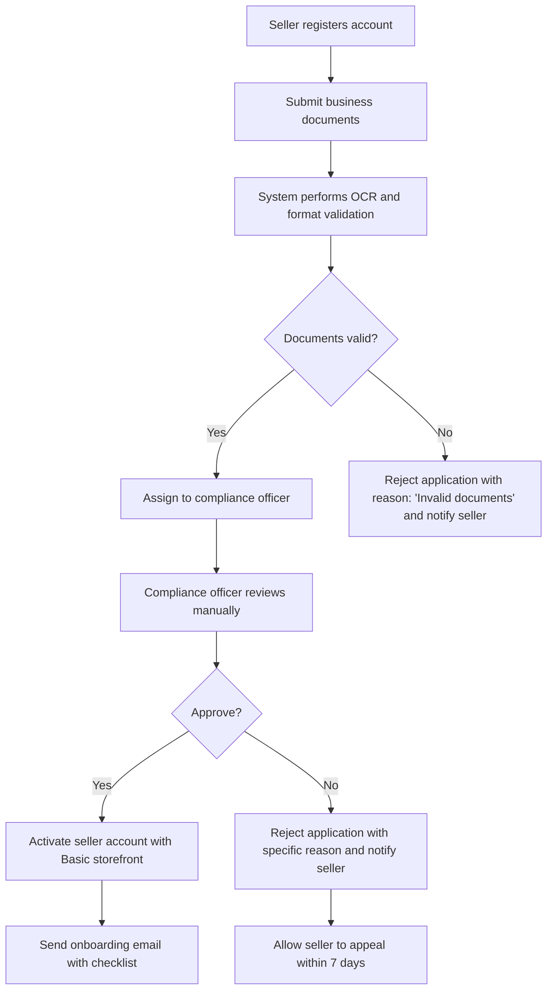
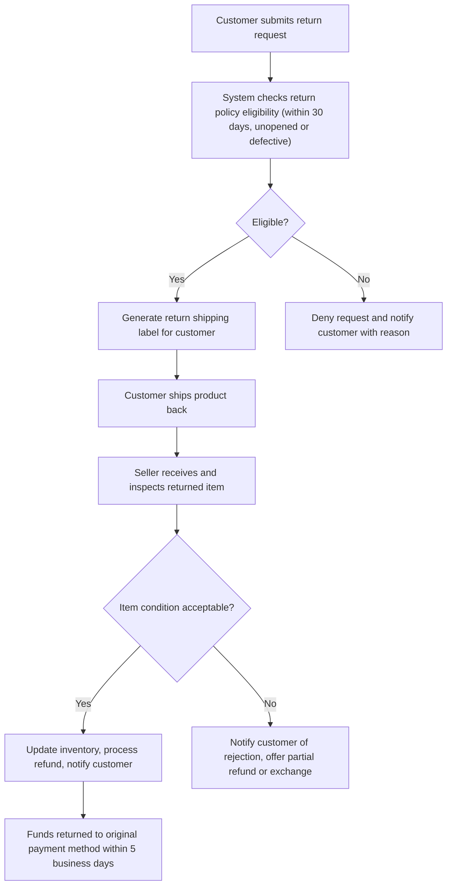

# Mall Platform - Business Requirements Specification

## Service Overview

The Mall platform is a multi-vendor e-commerce marketplace connecting individual consumers with small and enterprise sellers. It enables sellers to list and sell physical products while providing customers with a unified shopping experience featuring diverse product selections, secure payments, and trusted seller verification. The platform operates on a commission-based revenue model with premium subscription tiers for sellers, and delivers value through network effects, trust infrastructure, and scalable operational tools.

## Business Model and Revenue Streams

The Mall platform generates income through multiple, interdependent revenue streams designed to maximize profitability while maintaining value for all actors:

- **Transaction Commission**: WHEN a customer completes an order with a seller, THE system SHALL automatically deduct a 15% commission from the seller's payout. The commission is calculated based on the total order value excluding shipping fees and taxes, and is applied uniformly across all seller categories.
- **Premium Storefront Listings**: WHERE a seller elects to upgrade to a premium store tier, THE system SHALL charge a recurring monthly subscription fee of $49.99. This tier grants enhanced visibility in search results, priority placement on category landing pages, and access to detailed analytics dashboards.
- **Featured Product Placement**: WHERE a seller purchases a promotional slot, THE system SHALL display the product in a dedicated "Featured Products" carousel on the homepage for 7 consecutive days. This service costs $99.99 per promotion cycle and is subject to approval based on product quality and compliance standards.
- **Advertising Revenue**: THE system SHALL serve third-party banner advertisements on public-facing pages including the homepage, category listings, and search results. Ads are targeted using anonymized user behavior data and are billed under a CPM (cost per thousand impressions) pricing model.
- **Data Insights Package**: WHERE an enterprise seller requests aggregated market analytics, THE system SHALL deliver a monthly data report containing category performance trends, competitor pricing benchmarks, and customer demographic insights. This premium service costs $199 per report and requires a signed data usage agreement.

All revenue streams are processed through the platform's integrated payment gateway and reconciled daily. Revenue data is made available to sellers in their financial dashboards with full transaction-level breakdowns.

## User Actors and Access Control

The system supports three distinct actor roles, each with defined capabilities and permission boundaries:

- **Customer**: A registered consumer who browses products, places orders, leaves reviews, and manages their account settings. Customers cannot access seller dashboards, modify product listings, or view financial operations.
- **Seller**: A registered business entity that lists products, manages inventory, fulfills orders, responds to customer inquiries, and accesses financial reports. Sellers cannot access customer personal data beyond what is necessary for order fulfillment, nor can they view other sellers' data.
- **Admin**: An authorized platform operator responsible for verifying sellers, moderating content, resolving disputes, managing system configuration, and performing financial audits. Admins have unrestricted read access to all data but cannot initiate transactions on behalf of users.

### Permission Matrix

| Action | Customer | Seller | Admin |
|--------|----------|--------|-------|
| Browse products | ✅ | ✅ | ✅ |
| Search products | ✅ | ✅ | ✅ |
| View product details | ✅ | ✅ | ✅ |
| Add to cart | ✅ | ❌ | ❌ |
| Place order | ✅ | ❌ | ❌ |
| Checkout | ✅ | ❌ | ❌ |
| Pay via credit card | ✅ | ❌ | ❌ |
| Pay via digital wallet | ✅ | ❌ | ❌ |
| View order status | ✅ | ✅ | ✅ |
| Update shipping address | ✅ | ❌ | ❌ |
| Request refund | ✅ | ❌ | ✅ |
| Track package delivery | ✅ | ✅ | ✅ |
| List new product | ❌ | ✅ | ❌ |
| Edit product listing | ❌ | ✅ | ✅ |
| Delete product listing | ❌ | ✅ | ✅ |
| Set product price | ❌ | ✅ | ✅ |
| Update inventory quantity | ❌ | ✅ | ✅ |
| Process order shipment | ❌ | ✅ | ✅ |
| View order history | ❌ | ✅ | ✅ |
| View customer contact info | ❌ | ✅ | ✅ |
| View seller financials | ❌ | ✅ | ✅ |
| Approve new seller | ❌ | ❌ | ✅ |
| Reject seller application | ❌ | ❌ | ✅ |
| Disable seller account | ❌ | ❌ | ✅ |
| Ban customer account | ❌ | ❌ | ✅ |
| Moderate product review | ❌ | ❌ | ✅ |
| View system logs | ❌ | ❌ | ✅ |
| Manage advertisements | ❌ | ❌ | ✅ |
| Export financial data | ❌ | ❌ | ✅ |
| Access API keys | ❌ | ❌ | ✅ |
| Send broadcast notifications | ❌ | ❌ | ✅ |

## Authentication and Session Management

All actors must authenticate before performing any action requiring persistent state. Authentication is performed using JSON Web Tokens (JWT) with the following specifications:

- **JWT Issuer**: "mall-platform"
- **JWT Audience**: "mall-users"
- **Token Expiry**: 24 hours for active sessions
- **Refresh Token**: 7 days, stored securely with rotation on use
- **Secure Flag**: All tokens transmitted over HTTPS only
- **HttpOnly**: Refresh tokens stored in HttpOnly, SameSite=Strict cookies
- **JWT Signing Algorithm**: RS256 using a platform-managed key pair
- **Claims Structure**:
  - `sub`: User ID (UUID)
  - `role`: "customer", "seller", or "admin"
  - `permissions`: Array of granular permissions (e.g., "VIEW_ORDERS", "APPROVE_SELLER")
  - `iat`: Issued at timestamp
  - `exp`: Expiration timestamp

Upon successful login, the system responds with:

- A JSON response containing the access token and refresh token
- The `Set-Cookie` header for the refresh token (HttpOnly, Secure, SameSite=Strict)
- The access token returned in the response body for client-side use in Authorization headers

Session validity is checked on every protected endpoint. If a token is expired or invalid, the system responds with HTTP 401 status and includes a `WWW-Authenticate` header with value "Bearer error=invalid_token".

Sessions are automatically invalidated upon:

- Password change
- Account disabling by admin
- Multiple failed login attempts (5 within 15 minutes)
- Detected suspicious activity (e.g., login from new country, unusual device pattern)

Users must re-authenticate for sensitive operations:

- Changing email address
- Changing password
- Disabling two-factor authentication
- Withdrawing funds
- Deactivating account

## Functional Requirements

### Product Management

- WHEN a seller submits a new product for listing, THE system SHALL require at least one image (minimum resolution: 800×800 pixels), a title (5–100 characters), a description (50–2,000 characters), a price (minimum $1.00, maximum $9,999.99), a stock quantity (minimum 1, maximum 10,000), and a category selection from a predefined taxonomy.
- WHEN a product is submitted, THE system SHALL initiate a moderation workflow requiring manual approval by an admin before the product becomes visible to customers.
- WHEN a product receives three or more flagged reviews, THE system SHALL auto-pause the listing and notify an admin for review.
- WHEN a product’s stock quantity reaches zero, THE system SHALL automatically mark it as "Out of Stock" until inventory is replenished.
- WHEN a seller changes the price of a product, THE system SHALL retain the previous price history and notify customers who have added the item to their wishlist.

### Shopping Cart and Order Processing

- WHEN a customer adds a product to their cart, THE system SHALL store the product ID, selected variation (if applicable), quantity, and price at the time of addition.
- WHEN a customer attempts to checkout, THE system SHALL verify that every item in the cart is:
  1. Active (not disabled or removed by admin)
  2. In stock (quantity ≥ requested quantity)
  3. Priced at current market value (not outdated)
- IF any product fails validation, THE system SHALL remove it from the cart with an actionable notification (e.g., "This item is no longer available. Reason: Out of stock.") and recalculate the total.
- WHEN a customer selects shipping method, THE system SHALL display real-time delivery estimates and costs based on postal code and selected carrier.
- WHEN the customer confirms payment, THE system SHALL:
  1. Create an order record with status "Pending"
  2. Reserve inventory for the ordered quantities
  3. Generate a unique order ID in format "ORD-{YYYYMMDD}-{6-digit-sequence}"
  4. Trigger a payment request to the integrated payment gateway
  5. Send a confirmation email and in-app notification
- IF payment fails, THE system SHALL:
  1. Set order status to "Payment Failed"
  2. Release reserved inventory
  3. Notify customer via email with retry options
  4. Log payment error code and gateway response for fraud analysis
- IF payment succeeds, THE system SHALL:
  1. Set order status to "Confirmed"
  2. Update seller's pending balance
  3. Deduct commission from seller’s total
  4. Notify seller of new order with customer details
  5. Trigger logistics system to generate shipping label

### Seller Onboarding

- WHEN a new seller registers, THE system SHALL collect:
  - Legal business name
  - Tax identification number or national ID
  - Business registration document (PDF or image)
  - Bank account details for payout
  - Business category selection
- WHEN the registration is submitted, THE system SHALL:
  1. Perform automated verification of business document format and validity
  2. Initiate manual review by a compliance officer
  3. Schedule review completion within 48 business hours
- WHEN the seller is approved, THE system SHALL:
  1. Send welcome notification with onboarding checklist
  2. Grant access to seller dashboard
  3. Automatically enable "Basic Storefront" mode
- WHEN the seller is rejected, THE system SHALL:
  1. Send rejection email with specific reason (e.g., "Document not legible", "Business category not eligible")
  2. Offer one-time opportunity to appeal within 7 days
  3. Retain application data for audit purposes for 2 years

### Search and Discovery

- WHEN a customer initiates a search query, THE system SHALL return results ranked by:
  1. Relevance (title and description match)
  2. Sales velocity (units sold in past 30 days)
  3. Seller rating (average star score)
  4. Shipping speed (estimated delivery time)
  5. Product review count
- WHEN filtering is applied (e.g., price range, category, brand), THE system SHALL retain the search query and apply filters without resetting sort order.
- WHEN sorting is changed (e.g., "Price: Low to High"), THE system SHALL update results and preserve all other filters.
- WHEN sorting by "Newest", THE system SHALL use the product creation date (not publish date).
- WHEN no results are found, THE system SHALL suggest related terms and display top-selling products in the selected category.

### Review and Rating System

- WHEN a customer completes an order, THE system SHALL automatically unlock the ability to review the product 24 hours after confirmed delivery.
- WHEN a review is submitted, THE system SHALL:
  1. Validate that the customer has purchased that exact product variation
  2. Verify the review contains at least 10 characters of text
  3. Detect and block reviews containing prohibited language (e.g., profanity, threats)
  4. Assign a rating from 1 to 5 stars
- WHEN a review is flagged by another user ("Report" button), THE system SHALL:
  1. Hide the review from public view
  2. Notify an admin for human review
  3. Notify the reviewer of the report
  4. If upheld, delete the review and issue a warning to the reviewer
- WHEN a seller responds to a review, THE response SHALL be marked "Seller Response" and appear directly below the original review.

### Notification System

- WHEN an order state changes (e.g., Shipped, Delivered, Refunded), THE system SHALL send an in-app notification and email to the customer.
- WHEN an order is received by a seller, THE system SHALL send a push notification (if enabled) and an email to the seller.
- WHEN a review is posted on a seller’s product, THE system SHALL notify the seller via email and in-app alert.
- WHEN a seller’s payout is processed, THE system SHALL send a notification with amount, date, and destination bank.
- WHEN an admin takes action on a seller or customer account, THE system SHALL notify the affected user with reason and next steps.
- WHEN a customer's email changes, THE system SHALL send a confirmation email requiring link click to validate.

### Payment Processing Requirements

- THE system SHALL support three payment methods at checkout:
  1. Credit/Debit Card (Visa, Mastercard, American Express)
  2. Digital Wallet (Apple Pay, Google Pay)
  3. Bank Transfer (ACH, SEPA — processed as delayed payment with order on hold)
- WHEN a card payment is submitted, THE system SHALL:
  1. Send tokenized card data to payment gateway (Stripe)
  2. Verify AVS and CVV responses
  3. Authorize amount immediately
  4. Capture funds only if order is approved by system
- WHEN a digital wallet payment is selected, THE system SHALL:
  1. Authenticate user identity via native wallet provider
  2. Obtain secure payment token
  3. Submit token to gateway for instant authorization
- WHEN bank transfer payment is chosen, THE system SHALL:
  1. Display bank details (account name, number, routing)
  2. Set order as "Pending Payment (Bank Transfer)"
  3. Allow 3 business days for payment verification
  4. Auto-approve order if deposit is confirmed
  5. Cancel order if no payment received after 72 hours
- ALL payments SHALL be logged with:
  - Transaction ID from payment provider
  - Payment method used
  - Amount authorized and captured
  - Currency conversion rate (if applicable)
  - Fraud risk score (0–100)

## Business Workflows and Processes

### Order Fulfillment Workflow

```mermaid
graph TD
    A["Customer places order"] --> B["System verifies cart validity"]
    B --> C["Reserve inventory"]
    C --> D["Initiate payment processing"]
    D --> E{"Payment successful?"}
    E -- Yes --> F["Update order status to \"Confirmed\""]
    E -- No --> G["Set status to \"Payment Failed\" and restore inventory"]
    F --> H["Generate shipping label via logistics API"]
    H --> I["Notify seller to prepare shipment"]
    I --> J["Notify customer of shipping confirmation with tracking link"]
    J --> K["Customer receives product"]
    K --> L["System auto-validates delivery after 7 days"]
    L --> M["Release seller payout minus commission"]
```

### Seller Onboarding Workflow



### Customer Returns and Refunds Workflow



## Error Handling and Edge Cases

### Invalid Payment Scenarios

- WHEN payment gateway returns "insufficient_funds", THE system SHALL:
  1. Set order status to "Payment Failed"
  2. Notify customer with advice: "Your card has insufficient funds. Please try another payment method."
  3. Allow retry with new card or payment method

- WHEN payment gateway returns "card_expired", THE system SHALL:
  1. Set order status to "Payment Failed"
  2. Notify customer: "Your card has expired. Please add a valid card to complete this order."
  3. Recommend card update through profile settings

- WHEN payment gateway returns "fraud_detected", THE system SHALL:
  1. Set order status to "Fraud Suspicious (Pending Review)"
  2. Lock the account from future purchases
  3. Notify admin for manual investigation
  4. Send automated email to customer: "There are security concerns with this transaction. Contact support to verify your identity."

### Duplicate Order Submission

- WHEN a customer submits identical order twice within 10 seconds, THE system SHALL:
  1. Detect duplicate based on cart ID, items, totals, and timestamps
  2. Block second submission
  3. Show notification: "Your order has already been placed. Please wait for confirmation."
  4. Redirect to order status page

### Inventory Overcommitment
- WHEN multiple customers attempt to purchase the last unit of a product simultaneously, THE system SHALL:
  1. Use database-level atomic locking on stock quantity
  2. Grant purchase to the first validated transaction
  3. Immediately reject subsequent attempts with message: "This item has sold out. We're sorry!"
  4. Queue the product for restock notification if enabled

### Seller Account Suspension

- WHEN an admin suspends a seller account:
  - Order fulfillment for active orders continues uninterrupted
  - New order submissions are blocked
  - Product listings are hidden from public search
  - Seller dashboards display: "Your account is currently suspended. Contact support for details."
  - All payments are held in escrow

### Customer Account Deletion

- WHEN a customer requests account deletion:
  - All personal data except order history and review metadata is purged within 7 days
  - Review and rating data remains attached to products for transparency
  - Past orders retain customer name and contact details for dispute resolution
  - No future purchases are permitted
  - Account email is marked as "deleted_user_{UUID}@mall-platform" and cannot be reused

## Performance and Compliance Requirements

- **Search Response Time**: 95% of search queries SHALL return results within 800 milliseconds.
- **Checkout Page Load**: THE system SHALL load checkout page completely within 1.2 seconds under standard network conditions (4G).
- **Notification Delivery**: All in-app and email notifications SHALL be delivered within 2 minutes of triggering event.
- **Order Processing Latency**: THE system SHALL complete full order validation and confirmation within 3.5 seconds.
- **Daily Uptime Target**: THE system SHALL maintain 99.9% uptime during business hours (7:00–23:00 Korea Standard Time).
- **Data Retention**: Personal data SHALL be retained for 7 years after account deletion to comply with financial audit standards; transaction records SHALL be archived indefinitely.
- **Compliance**: THE system SHALL comply with GDPR, CCPA, PCI-DSS Level 1, and Korean Personal Information Protection Act (PIPA) standards.
- **Audit Logging**: ALL privileged operations (e.g., admin actions, payout modifications) SHALL be logged with actor ID, timestamp, IP address, and changed fields.

> *Developer Note: This document defines **business requirements only**. All technical implementations (architecture, APIs, database design, etc.) are at the discretion of the development team.