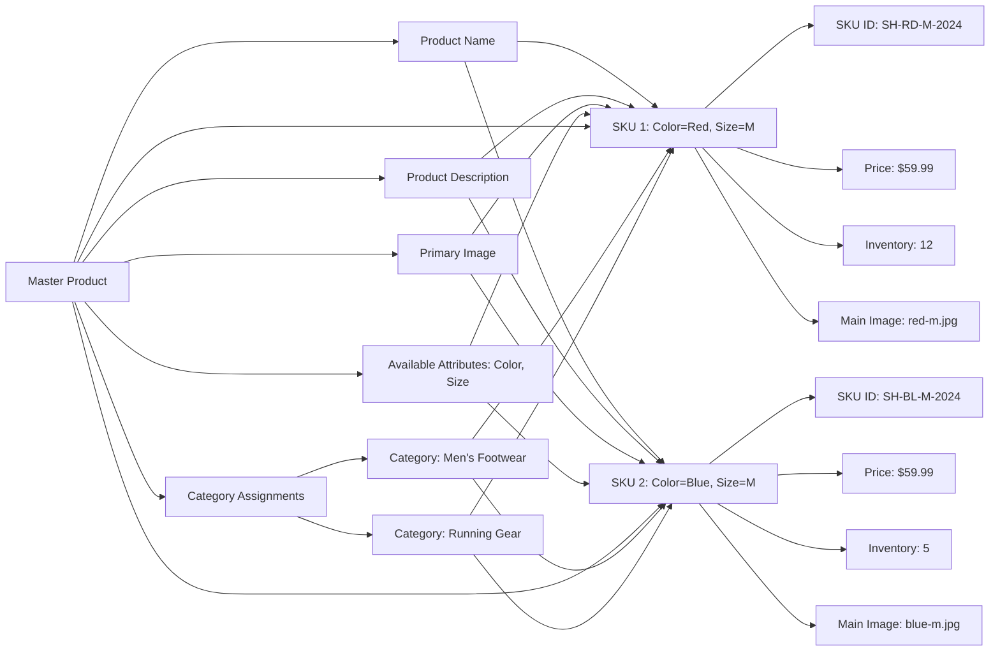

## Product Catalog Structure

THE shoppingMall platform SHALL organize products into a hierarchical catalog structure to enable efficient discovery and browsing by customers. Each product SHALL be represented as a distinct entity with a unique identifier, a primary name, a detailed description, and associated media.

## Category and Subcategory Hierarchy

WHEN a customer navigates the product catalog, THE system SHALL display categories and subcategories in a nested, hierarchical tree structure with up to three levels: Primary Category > Subcategory > Sub-subcategory. Each category SHALL have a unique identifier, a display name, and an optional description.

THE system SHALL support the assignment of one or more categories to a single product to allow cross-category visibility (e.g., a product can belong to both "Men's Shoes" and "Running Gear").

WHILE browsing a category, THE system SHALL display only products assigned to that category and its directly nested subcategories. Products shall not be displayed in sibling or parent categories unless explicitly assigned.

## Search and Filtering Capabilities

WHEN a customer enters a search query in the global search bar, THE system SHALL return matching products based on:
- Product name (substring match)
- Product description (keyword match)
- Product brand (exact or partial match)

THE system SHALL return results in real-time as the user types for common queries, with a maximum latency of 1.5 seconds from query submission to result display.

WHEN a customer selects a category, THE system SHALL provide dynamic filtering options based on the products within that category and its subcategories. Filters SHALL include:
- Price range (slider with min/max values derived from visible products)
- Brand (unique brand names from visible products)
- Customer rating (rating thresholds: 4 stars and above, 3 stars and above)
- Availability (In Stock / Out of Stock toggle)

THE system SHALL support multi-select filtering. When multiple filters are applied, THE system SHALL return products that meet ALL selected criteria simultaneously.

IF a search returns zero results, THE system SHALL display a friendly message prompting the customer to adjust search terms or browse categories, and SHALL suggest popular or related categories.

## Product Variant (SKU) Management

WHEN a product has multiple variations (e.g., color, size, style), THE system SHALL represent each variation as a unique Stock Keeping Unit (SKU).

THE product SHALL have a master product entity that defines:
- The core product name and description
- The set of configurable attributes (e.g., "Color", "Size", "Material")
- Common media (images, videos)

EACH SKU SHALL have:
- A unique, system-generated SKU code (e.g., "SH-RED-M-2024")
- Values for each configurable attribute (e.g., "Color: Red", "Size: M")
- A distinct, independent inventory level
- A distinct price (which may differ from the base price)
- Unique images if the difference is visual (such as color variants)

THE system SHALL display the product's master information and list all available SKUs as selectable options (e.g., color swatches, size buttons).

THE system SHALL prohibit selection of SKUs that have zero available inventory, unless the product has been marked as "Backorderable" by the seller.

## Inventory and Availability Rules

THE inventory level SHALL be tracked per SKU, not per master product. EACH SKU SHALL maintain its own stock count.

WHEN a product's SKU inventory level reaches zero, THE system SHALL:
- Display the SKU as "Out of Stock" and disable selection
- Prevent addition to cart or wishlist
- Display a clear "Out of Stock" badge on the product page
- Allow the SKU to remain visible for informational purposes (e.g., to show past availability)

WHEN a seller adds new inventory to an out-of-stock SKU, THE system SHALL immediately update the availability status and re-enable the SKU for selection and purchase.

WHERE a seller has set a minimum inventory threshold (e.g., "Show when below 5 units"), THE system SHALL display a "Low Stock" warning (e.g., "Only 3 left!") when inventory falls below that threshold.

## Product Media Requirements

THE system SHALL require each product to have at least one primary image.

EACH product SHALL support:
- A minimum of one main product image
- An optional gallery of up to 10 supplementary images
- Up to 2 product videos (maximum 2 minutes each)

THE system SHALL display all images and videos within a scrollable carousel on the product detail page.

WHERE a SKU has a unique visual appearance (e.g., color variation), THE system SHALL provide a dedicated image for that SKU to reflect its specific appearance.

WHEN a customer selects a SKU variant, THE system SHALL update the displayed product image in real-time to match the selected variant's appearance.

THE system SHALL maintain responsive image rendering across device types (mobile, tablet, desktop) and SHALL use appropriate image formats (WebP preferred) for performance optimization.

### Business Rule: SKU Attribute Consistency

WHILE a product is published with defined attribute names (e.g., "Color", "Size"), THE system SHALL prevent sellers from changing the names of those attributes once a SKU has been created with that name. New variants may be added, but existing attribute names are locked to ensure data integrity.

### Business Rule: Media Association

WHEN a product's primary image is changed, THE system SHALL not change the media associated with existing SKUs unless explicitly requested by the seller. Each SKU retains its own images even if overridden by the master product.

### Business Rule: Cross-Category Visibility

THE system SHALL maintain consistent product visibility based on category assignment, regardless of SKU selection. If a product is assigned to multiple categories, selecting a SKU does not restrict the product to a single category.

### Mermaid Diagram: Product Catalog and SKU Relationship



### Mermaid Diagram: Product Search and Filtering Workflow

```mermaid
graph LR
  A["Customer Enters Search Query"] --> B{"Query Length > 3?"}
  B -->|Yes| C["Search Name, Description, Brand"]
  B -->|No| D["Show Recent Searches or Popular Products"]
  C --> E["Filter Results by Category, if selected"]
  E --> F["Apply Price Filter"]
  F --> G["Apply Brand Filter"]
  G --> H["Apply Rating Filter"]
  H --> I["Apply Availability Filter"]
  I --> J["Return & Display Ordered Results"]
  J --> K["Display "Low Stock" indicator if applicable"]
  J --> L["Display "Out of Stock" indicator for unavailable SKUs"]
```

### Mermaid Diagram: SKU Inventory and Availability Flow

```mermaid
graph LR
  A["Customer Selects SKU Variant"] --> B{"Inventory > 0?"}
  B -->|Yes| C["Enable Add to Cart" and "Add to Wishlist"]
  B -->|No| D["Disable Add to Cart" and "Add to Wishlist"]
  D --> E["Display 'Out of Stock' badge"]
  C --> F["Customer Adds to Cart or Wishlist"]
  F --> G["System Checks Inventory Again Before Final Purchase"]
  G --> H{"Inventory Still Available?"}
  H -->|Yes| I["Process Order"]
  H -->|No| J["Show Error: \"Item out of stock. Selected variation is no longer available.\" and remove from cart"]
```

### Business Rule: Out-of-Stock Behavior

WHEN a customer attempts to purchase a product whose SKU inventory has been depleted since the item was added to cart or wishlist, THE system SHALL:
- Immediately remove that SKU from the cart and wishlist
- Display an error message: "The selected item (Color: Red, Size: M) is no longer available. Please update your cart."
- Provide a link back to the product page to allow selection of another variant
- Log the event as an inventory conflict for seller analytics

### Business Rule: Category-Specific Filters

WHEN a customer navigates to the "Electronics" category, THE system SHALL display filters that are relevant to electronics products, such as: "Brand", "Warranty Period", "Connectivity Type".

WHEN a customer navigates to the "Clothing" category, THE system SHALL display filters such as: "Fabric Type", "Season", "Fit (Slim, Regular, Loose)".

THE system SHALL auto-generate available filters based on the pattern of attribute values used by sellers in products within that category and its subcategories.

### Business Rule: Real-Time Inventory Integrity

WHILE multiple customers are browsing or adding items to cart, THE system SHALL maintain real-time inventory accuracy. Inventory levels MUST reflect actual counts as they are modified, even under concurrent access.

IF a customer partially completes checkout and leaves the process (e.g., closes browser), THE system SHALL not decrease inventory until the order is confirmed and payment is authorized. Inventory is reserved only after successful payment processing.