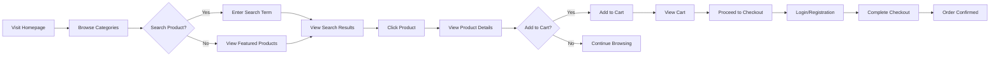
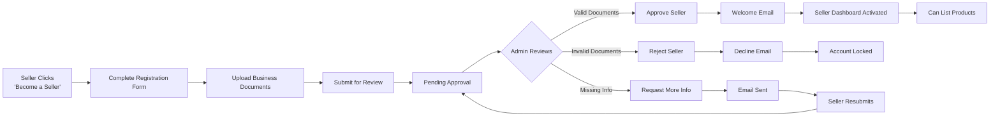
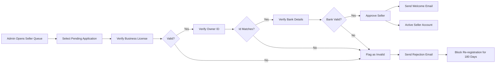

# Shopping Mall Platform Functional Requirements

## Product Management Requirements

### Product Listing

WHEN a seller submits a product listing, THE system SHALL require:
- Product title (required, max 200 characters)
- Description (required, min 20 characters)
- Price (required, must be > 0 and ≤ 9999.99)
- Category (required, must select from predefined category tree)
- Images (required: at least 1, max 10; must be JPG, PNG, or WEBP)
- Quantity in stock (required, integer ≥ 1)
- Shipping weight (optional, decimal)
- Tax category (required)

WHEN a seller attempts to submit a product with a title that duplicates an existing product from the same seller, THE system SHALL display: "A product with this title already exists."

WHEN a seller attempts to submit a product with invalid images (file type or size), THE system SHALL prevent submission and display: "Images must be JPG, PNG, or WEBP format and under 10MB each."

THE system SHALL validate all numeric fields accept only valid numeric inputs and reject alphabetic characters.

### Product Review

WHEN a customer views a product detail page, THE system SHALL display:
- Product title, price, and up to 5 high-resolution images
- Complete description and specifications
- Average rating (rounded to one decimal) and total number of reviews
- Seller name and average seller rating
- Available quantity in stock
- Shipping options and estimated delivery time

WHEN a product has zero reviews, THE system SHALL display: "Be the first to review this product."

WHEN a product's available quantity is zero, THE system SHALL hide the "Add to Cart" button and display: "Out of stock. We'll notify you when back in stock."

THE system SHALL display only products with status "Published" to customers.

### Product Search

WHEN a customer enters a search term in the search bar, THE system SHALL:
- Return products matching the search term in title, description, or category
- Sort results by relevance (title match > description match > category match)
- Apply default filtering for products with inventory > 0
- Display search results within 1.5 seconds of submission

WHEN there are no matching products, THE system SHALL display: "No products found for \"{searchTerm}\". Try adjusting your search terms."

THE search function SHALL support partial word matching (e.g., "phone" matches "smartphone").

### Product Categorization

WHEN a product is assigned to a category, THE system SHALL cascade category permissions to all subcategories.

WHEN a top-level category is disabled, THE system SHALL hide all subcategories and their products from customer views.

THE system SHALL maintain a hierarchical category structure with up to three levels of nesting.

## Shopping Cart and Order Processing

### Cart Creation

WHEN a customer adds an item to their cart, THE system SHALL:
- Immediately update the cart summary in the header navigation (within 1 second)
- Display the updated item count in the cart icon
- Store cart state in browser localStorage for anonymous users
- Create a session-bound cart record in the database for logged-in users

WHEN a customer attempts to add more items than available in stock, THE system SHALL:
- Highlight the quantity selector in red
- Display: "Only {availableQuantity} items available."
- Prevent submission of quantities exceeding stock
- Auto-adjust the quantity to available stock if the customer navigates away and returns

### Cart Modification

WHEN a customer updates the quantity of an item in their cart, THE system SHALL:
- Recalculate the item subtotal and total cart value immediately
- Validate that the new quantity does not exceed available stock
- Remove the item from the cart if quantity is set to zero
- Preserve cart state until checkout completion

WHEN a customer removes an item from their cart, THE system SHALL:
- Immediately update the cart summary
- Reduce the cart item count in the header navigation
- If cart becomes empty, display: "Your cart is empty. Start shopping!"

### Inventory Management

WHEN an order is placed and payment is successful, THE system SHALL:
- Deduct purchased quantities from seller inventory immediately
- Lock inventory for 15 minutes during checkout process to prevent overselling
- Release locked inventory if payment fails or checkout is abandoned
- Send inventory depletion notification to seller

WHEN seller inventory falls below 5 units, THE system SHALL:
- Display warning message: "Low stock - only {remainingQuantity} left!"
- Optionally enable "Notify when available" option for customers

WHEN seller inventory reaches zero, THE system SHALL:
- Auto-disable product from search results and categorization
- Show "Out of stock" message to customers

### Order Validation

WHEN a customer proceeds to checkout, THE system SHALL:
- Validate that all items in cart still have sufficient inventory
- Recalculate final price including taxes and shipping
- Verify payment method is supported and correctly configured
- Confirm customer email is verified before proceeding

IF any item in cart is no longer available (inventory = 0), THE system SHALL:
- Remove the unavailable item from cart
- Display warning: "One or more items are no longer available. Your order has been adjusted."
- Allow customer to continue with revised order
- Save removed items in "Recently out of stock" section for potential re-addition

IF customer attempts to checkout with an empty cart, THE system SHALL redirect to homepage with message: "Your cart is empty. Add products to continue."

### Checkout Process

WHEN a customer clicks "Proceed to Checkout", THE system SHALL require the customer to be logged in.

IF the customer is not logged in, THE system SHALL display: "Sign in to complete your purchase" and provide:
- Login form
- Registration option
- Social login buttons (Google, Apple)

WHEN a customer is logged in, THE system SHALL:
- Pre-fill their default shipping address
- Allow editing shipping address
- Allow use of saved addresses
- Allow addition of new shipping address

THE system SHALL display all available payment methods:
- Credit/Debit card (with card validation)
- PayPal
- Apple Pay (if device supports it)
- Google Pay (if device supports it)

WHEN a customer selects a payment method, THE system SHALL validate:
- Card number format (Luhn algorithm)
- Expiration date is not past
- CVC matches expected format
- PayPal account is valid

IF payment details are invalid, THE system SHALL:
- Highlight the invalid field in red
- Display specific error: "Invalid {field} format. Please correct and try again."
- Prevent order submission until corrected

### Order Submission

WHEN a customer clicks "Place Order", THE system SHALL:
- Validate order total matches calculated sum
- Lock inventory for 15 minutes
- Create order record with status "Pending Payment"
- Generate unique order number (format: ORD-{YYYYMMDD}-{6-digit random})
- Initiate payment processing through selected payment gateway
- Send order confirmation email to customer
- Send order notification to seller

IF payment processing fails, THE system SHALL:
- Set order status to "Payment Failed"
- Release locked inventory immediately
- Send email notification to customer: "Payment was not successful. Please check your payment details and try again."
- Allow customer to retry payment with same or different method
- Log failure reason (insufficient funds, invalid card, declined, etc.)

WHEN payment succeeds, THE system SHALL:
- Set order status to "Confirmed"
- Deduct inventory from seller's stock permanently
- Send confirmation email to customer and seller
- Generate shipping label for seller
- Navigate to Order Confirmation page

### Order Confirmation

WHEN an order is confirmed, THE system SHALL display:
- Order number
- Order summary with items, quantities, prices, and totals
- Shipping address and billing address
- Selected payment method
- Estimated delivery date
- Contact support link
- Return policy summary

WHILE order status is "Confirmed", THE customer SHALL be able to:
- View order details
- Track shipment
- Request return
- Leave product review (after delivery)

## User Authentication and Account Management

### Customer Registration

WHEN a customer begins registration, THE system SHALL display a form requesting:
- Full name
- Email address
- Password (minimum 8 characters with at least one number and one letter)
- Confirm password

THE system SHALL validate:
- Email format (must contain @ and .)
- Password matches confirm password field
- Password meets complexity requirements
- Email is not already registered to customer or seller

IF email is already registered, THE system SHALL display: "An account with this email already exists. Did you mean to sign in?"

WHEN all form fields pass validation, THE system SHALL:
- Create an unverified customer account
- Generate a unique 256-bit verification token
- Send an email with verification link ({service-prefix}.com/verify/{token})
- Redirect to "Verify Your Email" page
- Store temporary session with guest permissions (can browse products but not order)

### Email Verification

WHEN a customer clicks the verification link in their email, THE system SHALL:
- Validate the verification token against database
- Mark the account as "Verified"
- Clear temporary guest permissions
- Log the customer in automatically
- Redirect to homepage
- Set "welcome" cookie indicating first-time verified user

IF the verification token is expired (older than 24 hours), THE system SHALL:
- Display: "This verification link has expired or is invalid."
- Provide "Resend Verification Email" button
- Redirect to login page

WHEN user clicks "Resend Verification Email", THE system SHALL:
- Generate new verification token
- Send new verification email
- Set "verification email sent" message
- Allow resend only once per hour

### Post-Verification Onboarding

WHEN first-time verified customer logs in, THE system SHALL:
- Show "Welcome! Complete your profile" banner with prominent "Update Profile" button
- Prompt for optional shipping address registration
- Recommend following sellers based on browsing history
- Suggest adding payment method

WHEN customer completes profile setup, THE system SHALL remove the onboarding banner.

### Account Login

WHEN a customer enters email and password, THE system SHALL:
- Verify email exists and is verified
- Verify password matches stored hash
- Return JWT token with claims: {sub: "customer:{id}", role: "customer", exp: 72h}
- Set JWT token in HTTP-only cookie
- Redirect to homepage

WHEN login fails due to incorrect password, THE system SHALL:
- Display: "Invalid email or password. Please try again."
- Increment failed login counter for account
- Block account after 5 consecutive failures for 15 minutes

WHEN login succeeds, THE system SHALL:
- Record login timestamp and IP address in audit log
- Send security notification email if login is from new device/location

### Session and Token Management

THE system SHALL issue JWT tokens with 72-hour expiration for customers and sellers.

THE system SHALL refresh JWT tokens automatically when accessed within 24 hours of expiration.

THE system SHALL invalidate all tokens upon password change.

WHEN a user logs out, THE system SHALL:
- Clear HTTP-only cookie
- Invalidate JWT token on server
- Remove session data
- Redirect to homepage

## Search and Product Discovery

### Product Indexing

THE system SHALL index all published products for search with the following fields:
- Product title (weighted: 5)
- Product description (weighted: 3)
- Category path (weighted: 2)
- Seller name (weighted: 1)
- Product tags (weighted: 1)

THE system SHALL update product index within 30 seconds of product publication or modification.

THE search index SHALL be accessible for full-text search queries.

### Search Algorithm

WHEN a search query is submitted, THE system SHALL:
- Break query into individual terms
- Match terms against indexed fields using fuzzy matching
- Calculate relevance score based on weighting and match position
- Sort products by relevance score descending
- Return maximum 50 results per page

WHEN a user searches for a phrase in quotes, THE system SHALL match exact phrase rather than individual terms.

WHEN there are no results, THE system SHALL suggest: "Did you mean: {suggestedSearchTerm}?"

### Filtering and Faceting

WHEN displaying search results, THE system SHALL provide filter options based on product data:
- Category (hierarchical)
- Price range (dynamic based on search results: min - max)
- Seller rating (≥ 3 stars, ≥ 4 stars, 5 stars)
- Shipping options (Free shipping, Express shipping)
- Availability (In stock, Pre-order only)

WHEN a filter is applied, THE system SHALL:
- Update results immediately
- Maintain other applied filters
- Update price range dynamically
- Show applied filters as badges with "X" to remove each

FILTERS SHALL support multi-select except for price range and category (single selection).

### Sorting Options

WHEN displaying search results, THE system SHALL offer the following sorting options:
- Relevance (default)
- Price: Low to High
- Price: High to Low
- New Arrivals (by publish date)
- Top Rated (by average rating)
- Most Popular (by sales volume)

THE system SHALL default to "Relevance" for all searches.

WHEN a sorting option is selected, THE system SHALL update results immediately and persist preference in user settings.

### Recommendation Logic

WHEN a customer views a product, THE system SHALL recommend up to 5 related products:
- Products in same category (70% weight)
- Products with similar price range (20% weight)
- Products frequently bought together (10% weight)

WHEN a customer has browsing history, THE system SHALL recommend products:
- Similar category to previously viewed items
- Recently viewed products from same seller
- Products bought by similar customers

WHEN a customer has purchase history, THE system SHALL recommend:
- Complementary products to purchased items
- Higher-end alternatives to previously purchased items
- New products from favorite sellers

## Review and Rating System

### Review Submission

WHEN a customer has received an order with status "Completed", THE system SHALL enable review submission for each product in that order.

WHEN a customer clicks "Write a Review", THE system SHALL display:
- Star rating selector (1-5 stars)
- Review title field (max 100 characters)
- Detailed review field (min 10 characters, max 1000 characters)
- Option to upload up to 3 photos
- Option to write anonymous review

THE system SHALL validate:
- Rating is selected
- Title is not empty
- Description is at least 10 characters

WHEN a customer submits a review, THE system SHALL:
- Associate review with product and order
- Set review status to "Pending Moderation"
- Send notification to admin review queue
- Display: "Thank you for your review! It will be published after moderation."

### Review Moderation

WHEN a review is submitted, THE system SHALL:
- Auto-flag reviews containing banned words (profanity, personal information)
- Auto-flag reviews from unverified accounts
- Auto-flag reviews with excessive capitalization

WHEN an admin reviews a flagged review, THE system SHALL allow:
- "Approve" - publish review immediately
- "Reject" - delete review and send notification: "Your review was not published because it violated our guidelines."
- "Request Changes" - send notification: "Please edit your review to remove inappropriate content."

WHEN an admin approves a review, THE system SHALL:
- Change status to "Published"
- Update product average rating
- Notify customer: "Your review has been published. Thank you!"

### Rating Calculation

THE system SHALL calculate product average rating by:
- Summing all published review ratings
- Dividing by number of published reviews
- Rounding to one decimal place

THE system SHALL exclude pending, rejected, and deleted reviews from average calculation.

WHEN all reviews for a product are deleted, THE system SHALL display "No ratings yet."

## Notification System

### Notification Types

THE system SHALL send automated notifications for the following events:

Customer notifications:
- Order confirmation
- Payment failure
- Order shipment
- Delivery estimated
- Return approval
- Review published
- Account verified
- Password changed
- Important platform updates

Seller notifications:
- New order received
- Order confirmed
- Order shipped
- Product published
- Product rejected
- Account approved
- Account rejected
- Payment processed
- Inventory low
- Account suspension alert

Admin notifications:
- Suspicious login attempt
- New seller application
- Pending review item
- High fraud activity
- System performance alert

### Notification Delivery

WHEN a notification event occurs, THE system SHALL:
- Persist notification record in database
- Send in-app notification (bell icon badge update)
- Deliver email notification within 10 minutes
- Push notification for mobile app users (if installed)

WHEN a notification is delivered, THE system SHALL:
- Mark notification as "Delivered"
- Store delivery method and timestamp
- Log delivery attempts

WHEN an email notification fails, THE system SHALL:
- Retry delivery after 1 hour (max 3 retries)
- If persistent failure, log error and notify admin

### Notification Preferences

WHEN a customer or seller registers, THE system SHALL set default notification preferences:
- Email: Enabled for all notifications
- In-app: Enabled for order status, shipping, payment
- Push: Enabled only if app installed

THE system SHALL allow users to customize: 
- Disable specific notification types
- Set time windows for notifications
- Choose preferred delivery method per notification type

WHEN a user disables a notification type, THE system SHALL:
- Stop sending notifications of that type via preferred method
- Retain notification record for audit purposes

## Payment Processing Requirements

### Supported Payment Methods

THE system SHALL support the following payment methods:
- Credit/Debit cards (Visa, Mastercard, American Express, Discover)
- PayPal
- Apple Pay (iOS only)
- Google Pay (Android only)

WHEN a customer selects payment method, THE system SHALL:
- Display appropriate input fields for each method
- Encrypt sensitive payment data client-side using PCI-compliant encryption
- Never store raw payment details on server

### Payment Validation

WHEN a payment request is initiated, THE system SHALL validate:
- Card number (Luhn algorithm)
- Expiration date (not expired)
- CVV format (3-4 digits)
- Billing address format
- PayPal email format

IF validation fails, THE system SHALL:
- Prevent order submission
- Highlight invalid fields
- Display specific error message
- Log validation failure

### Payment Gateway Integration

THE system SHALL connect to payment gateway via HTTPS with mutual TLS.

THE system SHALL:
- Send payment request with encrypted card details
- Receive response within 5 seconds
- Log all transaction attempts with transaction ID
- Retry failed transactions once after 30 seconds

WHEN payment is successful, THE system SHALL:
- Receive approval code
- Record transaction details
- Release locked inventory
- Update order status to "Confirmed"

WHEN payment is declined, THE system SHALL:
- Receive decline code and reason
- Display appropriate message to customer
- Log declined transaction
- Allow retry

### Fraud Detection

THE system SHALL monitor for suspicious payment patterns:
- Multiple payment attempts from same IP in 5 minutes
- Different card details used for same account
- High-value order from new customer
- Geolocation mismatch between billing and shipping
- Unusual payment method combinations

WHEN suspicious activity is detected, THE system SHALL:
- Temporarily pause payment processing
- Notify admin via security dashboard
- Require manual admin approval for order completion
- Send warning to customer: "We detected unusual activity on your account. Please verify your identity."

### Refund and Chargeback Handling

WHEN a customer requests refund for completed order, THE system SHALL:
- Verify return status is "Return Completed" for physical goods
- Verify item condition
- Initiate refund to original payment method
- Update order status to "Refunded"
- Adjust seller payout balance

WHEN a chargeback is initiated by customer's bank, THE system SHALL:
- Freeze seller payout for that order
- Send investigation request to seller
- Collect shipping proof and communication records
- Notify customer of investigation

IF seller successfully defends chargeback, THE system SHALL:
- Release frozen payout
- Update order status to "Chargeback Resolved"
- Apply fee to seller

IF seller loses chargeback, THE system SHALL:
- Complete refund
- Apply fee to seller
- Update order status to "Chargeback Lost"
- Issue final warning to seller

## Report Generation Requirements

### Report Types

THE system SHALL generate the following reports:
- Daily Sales Summary
- Monthly Seller Performance
- Customer Acquisition Analytics
- Payment Success Rate
- User Retention Metrics
- Product Popularity Rankings
- Category Revenue Breakdown
- Geographic Sales Distribution

### Data Export

WHEN an admin selects "Generate Report", THE system SHALL allow:
- Date range selection (last 7, 30, 90, 180, 365 days)
- Report type selection
- Export format selection: CSV, PDF, Excel

THE system SHALL generate report containing:
- Charts and summary statistics
- Trend lines with comparisons
- Export timestamp and admin identifier
- Data source disclaimer
- Data privacy notice

### Schedule Automated Reports

THE system SHALL allow admins to schedule:
- Daily summary reports (sent 2AM KST)
- Weekly performance reports to sellers (sent Monday 8AM KST)
- Monthly financial reports (sent 1st of month 9AM KST)

WHEN a scheduled report is generated, THE system SHALL:
- Send email to designated recipients
- Archive copy in report history
- Log generation time and recipient list
- Notify admin if email delivery fails

## Mermaid Diagram: Customer Product Discovery Journey

## Mermaid Diagram: Seller Onboarding Workflow

## Mermaid Diagram: Admin Seller Approval Process

## Customer Authentication Workflow

WHEN a customer visits the platform without authentication:

THE system SHALL:

- Allow browsing product catalog
- Allow product search
- Allow product view

WHEN a customer attempts to:

- Add item to cart → THE system SHALL create anonymous cart
- Proceed to checkout → THE system SHALL redirect to login/registration

WHEN a customer successfully logs in:

THE system SHALL:

- Replace anonymous cart with authenticated cart
- Activate full customer permissions
- Maintain session across devices (if same browser)

WHEN a customer logs out: 

THE system SHALL:

- Clear authentication token
- Preserve cart if items added
- Retain search history and preferences

## Seller Authentication Workflow

WHEN a seller has pending approval:

THE system SHALL:

- Allow access to seller dashboard
- Allow document upload
- Do NOT allow product listing
- Do NOT allow order fulfillment

WHEN a seller is approved:

THE system SHALL:

- Allow full access to seller dashboard
- Allow product listing
- Allow order processing
- Allow payout management 

WHEN a seller is rejected:

THE system SHALL:

- Lock seller account
- Prevent re-registration for 180 days
- Archive all uploaded documents
- Send final rejection email

## Admin Authentication Workflow

WHEN an admin logs in:

THE system SHALL:

- Validate admin credentials against admin user table
- Issue JWT token with role: "admin" and 24-hour expiration
- Allow access to all administrative dashboards
- Record login in audit log

WHEN an admin accesses sensitive reports:

THE system SHALL:

- Require re-authentication with password
- Display warning: "Accessing sensitive data. Re-authentication required."

WHEN an admin makes configuration changes:

THE system SHALL:

- Log all changes with timestamp, admin ID, IP address, and before/after values
- Send confirmation email to all admins
- Require secondary admin approval for revenue model changes

## Permission Matrix

### Customer Permissions

- Browse product catalog → ✓
- Perform product search → ✓
- View product details → ✓
- Add products to cart → ✓
- Modify cart quantities → ✓
- Remove items from cart → ✓
- Proceed to checkout → ✓
- Place orders → ✓
- View order history → ✓
- Track shipments → ✓
- Request returns → ✓
- Leave product reviews → ✓ (after order completed)
- Message sellers → ✓ (via product page)
- Edit profile → ✓
- Change password → ✓
- Verify email → ✓
- Manage notifications → ✓

### Seller Permissions

- Register as seller → ✓
- Upload business documents → ✓
- Submit seller application → ✓
- View seller dashboard → ✓ (after approval)
- List products → ✓ (after approval)
- Edit product listings → ✓
- Manage inventory → ✓
- View orders → ✓
- Process orders → ✓
- Shipment tracking → ✓
- View payout details → ✓
- Withdraw funds → ✓
- Edit store profile → ✓
- View sales reports → ✓
- Manage notifications → ✓
- Apply for premium seller status → ✓

### Admin Permissions

- Approve/reject seller applications → ✓
- Moderate user content → ✓
- Ban users → ✓
- Manage system settings → ✓
- Reset passwords → ✓
- Export data → ✓
- Run reports → ✓
- View audit logs → ✓
- Configure payment methods → ✓
- Adjust platform commission → ✓
- Update category structure → ✓
- Manage notification templates → ✓
- Access all user data → ✓
- Disable features → ✓
- View system health dashboard → ✓
- Trigger system maintenance → ✓

> *Developer Note: This document defines **business requirements only**. All technical implementations (architecture, APIs, database design, etc.) are at the discretion of the development team.*
