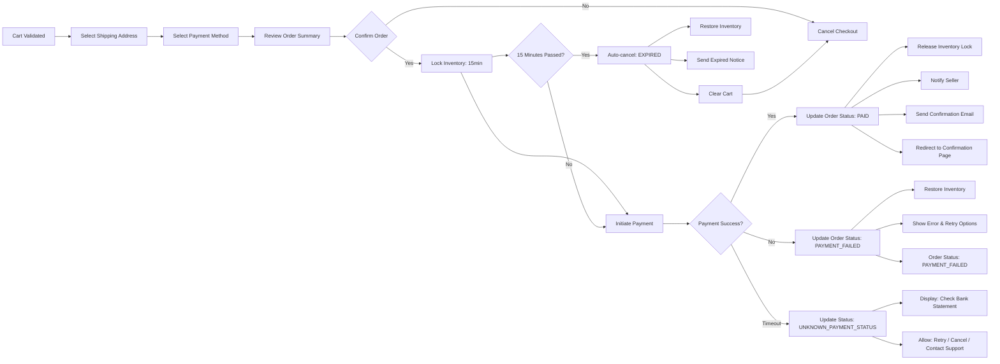

## Order Placement and Payment Processing Workflow

### Core Order Lifecycle Overview

The order placement process transforms a customer's finalized shopping cart into a confirmed purchase through authentication, payment authorization, and system state updates. This workflow spans from cart review to payment confirmation and must preserve data integrity despite network interruptions, payment failures, or inventory changes.

The entire flow must occur within a single continuous session unless explicitly interrupted by user action or system error. All intermediate states must be preserved so the user can resume or cancel at any point before final payment authorization.

### Customer Journey and Key Interaction Points

A customer initiates checkout after selecting items in their cart. The process begins with the "Review Cart" action and proceeds through mandatory, sequential steps: shipping selection, payment method choice, order summary confirmation, and final payment action. Each step must validate dependencies from previous steps and enforce business rules before proceeding.

### Shipping Address Selection

WHEN a customer initiates checkout, THE system SHALL display all registered shipping addresses associated with their account.

WHERE a customer has no registered addresses, THE system SHALL prompt them to add a new address before continuing.

THE system SHALL allow customers to select one address as primary for delivery.

THE system SHALL allow customers to create or edit an address during checkout without leaving the flow.

WHEN an address is modified during checkout, THE system SHALL temporarily store the edited version for this order only (without saving to the user's address book).

IF the selected shipping address is outside the seller's delivery region, THEN THE system SHALL disable the "Proceed to Payment" button and display: "This seller does not ship to the selected location. Please choose another address or contact seller for special arrangements."

### Payment Method Selection

WHEN a customer reaches the payment step, THE system SHALL display all payment methods linked to their account.

THE system SHALL permit customers to add a new payment method (credit/debit card or digital wallet) during checkout.

WHEN a customer adds a new payment method, THE system SHALL validate the payment details in real-time (format, card number checksum, expiry date) without processing an actual charge.

THE system SHALL allow customers to override account defaults and select any valid payment method for this order.

WHERE a customer has no active payment methods, THE system SHALL require them to add at least one before proceeding.

### Order Summary Review

WHEN a customer selects a shipping address and payment method, THE system SHALL display a detailed order summary.

THE order summary SHALL include:
- List of products with item name, selected SKU variant, and quantity
- Price per unit and total for each item
- Shipping cost based on address and seller policy
- Estimated delivery date range (based on seller fulfillment time and shipping carrier)
- Tax amount calculated by region
- Order subtotal
- Order total (subtotal + shipping + tax)

THE system SHALL highlight any products in the cart that have been updated since the cart was created:
- Stock level changed (e.g., now out-of-stock)
- Price changed
- Product discontinued

WHEN a product has changed, THE system SHALL display a warning: "[Product Name] has changed. The item may be unavailable or priced differently."

WHEN customer reviews the summary, THE system SHALL require explicit confirmation before allowing payment to proceed.

THE system SHALL display a single button labeled "Place Order and Pay Now" — no other payment buttons are allowed.

### Payment Processing Flow

WHEN the customer clicks "Place Order and Pay Now", THE system SHALL:

1. Lock inventory for all items in the order for 15 minutes
2. Reserve the payment amount in the selected payment method
3. Generate a unique order ID with format "ORD-YYYYMMDD-XXXXX" where XXXXX is a 5-digit sequential identifier
4. Create an order record in system with status "PENDING_PAYMENT"
5. Prompt the external payment gateway with the total amount and payment method details
6. Display a loading state with message: "Processing payment..."

THE system SHALL NOT declare the order complete until it receives an approved response from the payment gateway.

IF multiple payment gateways are supported, THE system SHALL:
- Attempt payment through the selected gateway first
- If gateway connection fails or returns timeout, show: "Payment provider is temporarily unavailable. Please try another method or contact support."
- Do not automatically retry with alternative gateway unless requested by customer

The payment gateway shall not be named or specified — the system must support infrastructure-agnostic gateway integration.

### Order Confirmation

WHEN payment is successfully authorized by the gateway, THE system SHALL:

1. Change order status to "PAID"
2. Release the inventory lock and decrement inventory per SKU
3. Notify the selected seller(s) with new order notification
4. Send order confirmation email to customer
5. Clear the cooperative cart
6. Redirect customer to "Order Confirmation" page

THE confirmation page SHALL display:
- Order ID
- Order date and time (in Asia/Seoul timezone)
- Estimated delivery window
- Shipping address
- Payment method used (e.g., "Visa ending in 4242")
- List of items with final prices and quantities
- Total amount charged
- Link to "View Order Details"

THE system SHALL persist the order in database immediately after confirmation.

### Payment Failure Handling

WHEN payment is declined by the gateway (insufficient funds, expired card, fraud block, etc.), THE system SHALL:

1. Immediately release the inventory lock and return stock levels to prior state
2. Set order status to "PAYMENT_FAILED"
3. Display: "Payment was not completed. Please review your payment details and try again."
4. Keep the order record in system with error code and message from gateway
5. Do not delete the cart — allow customer to return to cart and retry
6. Allow customer to select a different payment method without restarting the entire checkout flow

IF the customer returns to checkout after a failure, THE system SHALL pre-fill all previously selected shipping address and payment method with error indication:

- Shipping address: normal display
- Payment method: displayed with yellow warning icon and text: "Payment was declined for this method. Try another."

WHEN gateway returns timeout error after 10 seconds of no response, THE system SHALL:

- Display: "We couldn't confirm the payment status. Please check your bank statement. You may have been charged."
- Set order status to "UNKNOWN_PAYMENT_STATUS"
- Allow customer to:
    - Retry payment (creates new transaction attempt)
    - Cancel order (cancels request and releases inventory)
    - Contact support

THE system SHALL monitor for late payment confirmations up to 2 hours after timeout. If a payment is later confirmed externally, THE system SHALL auto-update order to "PAID" and notify user via email.

### Pending Payment State

WHILE an order is in "PENDING_PAYMENT" state, THE system SHALL:

- Keep inventory locked for 15 minutes
- Prevent modification to cart, address, or method by customer
- Display countdown timer: "Your order will be canceled in 14:30 if payment is not completed."
- Allow customer to cancel the order manually at any time (e.g., "Cancel Order" button)
- If customer cancels, release inventory and set status to "CANCELLED_BY_USER"

AFTER 15 minutes, IF no payment confirmation is received, THE system SHALL:

1. Automatically release inventory lock
2. Update order status to "EXPIRED"
3. Send notification to customer: "Your order expired due to uncompleted payment. Items may have been sold to someone else."
4. Empty the cart

THE system SHALL log all payment state transitions, gateway responses, and inventory locks for audit and reconciliation purposes.

### Order Success and Failure Scenarios

#### Normal Success Path:
Cart → Address Selected → Payment Method Selected → Confirmation → Payment Authorized → PAID → Inventory Updated → Seller Notified → User Redirected

#### Failure Path 1 (Card Declined):
Cart → Address Selected → Payment Method Selected → Confirmation → Payment Declined → PAYMENT_FAILED → Inventory Restored → User Notified → Can Retry

#### Failure Path 2 (Time Out):
Cart → Address Selected → Payment Method Selected → Confirmation → Payment Timeout → UNKNOWN_PAYMENT_STATUS → User Options: Retry / Cancel / Contact Support → If 2h later payment confirmed → Auto-update to PAID

#### Failure Path 3 (Inventory Changed):
Cart → Address Selected → Payment Method Selected → Confirmation → One Item Discontinued → Warning Shown → User Can Remove Item or Cancel → If Proceed —> Update Total → Payment → PAID → Adjusted Inventory Only

#### Failure Path 4 (Fraud Flag):
Cart → Address Selected → Payment Method Selected → Confirmation → Payment Gateway Flags as High Risk → PAYMENT_FAILED → User Notified → Requires Customer Verification → Can Try Alternative Method

### Business Rules Summary

- **Inventory must be locked before payment initiation** — NOT before cart review
- **An order is only confirmed after successful payment authorization** — not when "Place Order" is clicked
- **Every payment failure must restore inventory** — no exceptions
- **User must explicitly confirm final order and price before payment** — no auto-payment
- **Payment handling must be gateway-agnostic** — no provider names hardcoded
- **Shipping address validation is mandatory** — cannot proceed if seller does not ship there
- **All status changes are permanent entries in order history** — no soft deletes
- **Users may always cancel a PENDING_PAYMENT order** — even after 14 minutes remaining
- **Payment retries must preserve original order context** — address, items, quantities, tax
- **Customers must be notified if an item in their cart changes price or availability**
- **Customer-facing messages must always be clear, non-technical, and action-oriented**
- **The system must handle concurrent transactions** — if two users buy last item simultaneously, second user must be notified inventory is gone before payment tries to complete

### Mermaid: Order Placement Workflow

