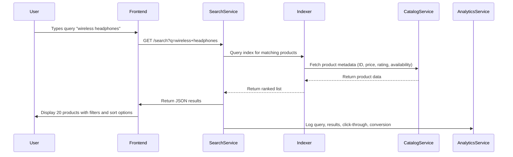
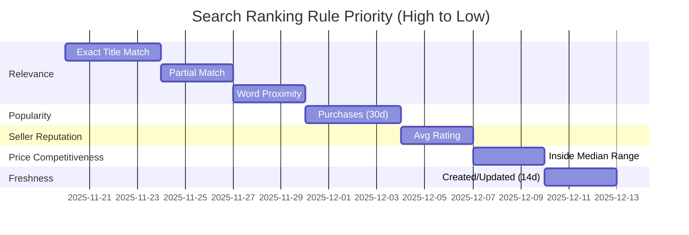
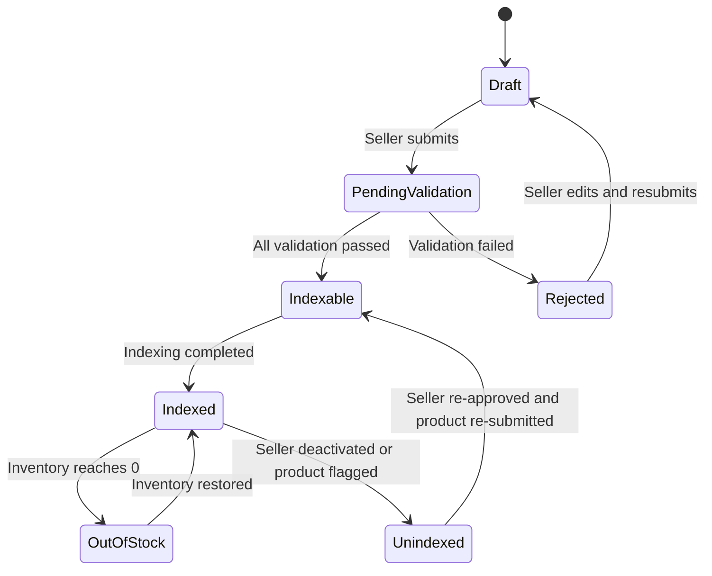
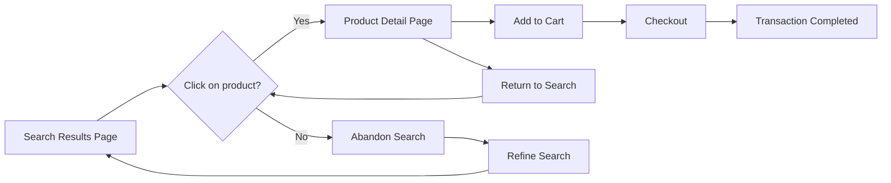

# Search and Discovery Requirements for ShoppingMall Platform

## Product Indexing Strategy

THE ShoppingMall platform SHALL index all products that are currently available for sale by approved sellers.

WHEN a seller submits a new product listing, THE system SHALL validate the product against the following criteria before indexing:

- Product title must contain at least 3 non-whitespace characters
- Product description must contain at least 20 non-whitespace characters
- Product price must be greater than 0 and less than or equal to 10000 USD
- Product category must be selected from the pre-defined catalog of categories
- Product images must include at least one valid image URL
- Product inventory must be greater than or equal to zero
- Seller account must have "approved" status (not pending review or rejected)

IF any validation rule fails, THEN THE system SHALL NOT index the product and SHALL notify the seller with the specific reason for rejection.

WHILE a product is in "draft" status (before publication), THE system SHALL NOT index it for any search or discovery surfaces.

WHEN a seller updates an existing product, THE system SHALL re-index the product only if all validation rules pass.

WHEN a product's inventory drops to zero, THE system SHALL mark the product as "out of stock" but SHALL continue to index it for search results.

WHEN a seller's account is deactivated, THE system SHALL immediately remove all products associated with that seller from search indexing.

WHERE a product is flagged for moderation review by an admin, THE system SHALL hide the product from search results until the review is completed and approved.

## Search Algorithm Requirements

THE ShoppingMall platform SHALL rank search results based on the following business rules:

- Relevance to search query text (exact match > partial match > word proximity)
- Product popularity (number of purchases in last 30 days)
- Seller reputation score (average rating of all products from that seller)
- Product price competitiveness (within category median price range)
- Product freshness (product created or last updated within last 14 days)

WHEN a user searches for a specific product name or keyword, THE system SHALL prioritize products whose titles contain the exact search term.

WHEN a user's search query returns fewer than 5 results, THE system SHALL expand the search to include partial word matches and synonyms (e.g., "sneakers" matches "athletic shoes").

WHEN a user searches for a category name (e.g., "phones"), THE system SHALL return all products classified under that category and any subcategories.

IF a product has no reviews or ratings, THEN THE system SHALL reduce its ranking score by 30% compared to products with 5 or more reviews.

IF a product's seller has received more than 2 customer complaints in the last 60 days, THEN THE system SHALL lower its ranking position below products from sellers with no recent complaints.

WHERE a product has been marked as "popular" by an admin, THE system SHALL boost its position by 20% in all search result sets.

WHERE a product has been marked as "new arrival" by an admin, THE system SHALL place it in the top 10 results of category-based searches for 30 days from the "new arrival" date.

## Filtering and Faceting Requirements

THE ShoppingMall platform SHALL provide the following filter categories across all search results:

- Category (primary hierarchy: Electronics > Laptops > Gaming Laptops)
- Price Range (with predefined buckets: $0-$50, $51-$100, $101-$250, $251-$500, $501-$1000, $1001-$5000, $5001-10000)
- Condition (New, Refurbished, Used)
- Seller Type (Official Brand Store, Third-Party Seller)
- Availability (In Stock, Out of Stock)
- Shipping Options (Free Shipping, Standard Shipping, Express Shipping)

WHEN a user selects a filter, THE system SHALL immediately update search results to reflect all active filters.

WHILE a filter is applied, THE system SHALL dynamically update the available value counts for all other filters to reflect only the subset of results matching the current selection.

WHERE a product matches multiple category branches, THE system SHALL display all applicable filters and allow selection by any branch.

WHEN a filter has only one available option (e.g., only "New" condition exists in current results), THE system SHALL hide that filter from the UI and shall not apply it unless explicitly selected by the user.

IF a user selects a filter that results in zero results, THEN THE system SHALL clear all filters, show a notification "No products match your criteria. Try broadening your search.", and revert to the default search state.

## Sorting Options and Default Behavior

THE ShoppingMall platform SHALL offer the following sorting options for search results:

- Relevance (default)
- Price: Low to High
- Price: High to Low
- Newest First
- Most Popular
- Highest Rated

WHEN a user first performs a search without specifying a sort option, THE system SHALL default to "Relevance" sorting.

WHEN a user navigates directly to a category page (e.g., /category/laptops), THE system SHALL default to "Most Popular" sorting.

WHEN a user selects a sort option other than Relevance, THE system SHALL save that preference for future searches from that device for 30 days (stored in browser localStorage).

WHILE sorting by "Price: Low to High" or "Price: High to Low", THE system SHALL ensure all products with zero price are displayed at the bottom of the list.

WHEN sorting by "Highest Rated", THE system SHALL use the average of all product ratings, but only include products with at least 3 reviews.

## Related Products and Recommendation Logic

THE ShoppingMall platform SHALL display related products in three distinct contexts:

1. Product Detail Page: "Customers who bought this also bought"
2. Cart Page: "Complete your setup"
3. Search Results: "Similar products"

WHEN a user views a product detail page, THE system SHALL identify up to 4 related products based on:

- Shared category and subcategory
- Similar price range (+/- 30%)
- Overlapping keywords in title or description
- Common customer purchase patterns (co-purchased in last 60 days)

WHEN a user adds a product to their cart, THE system SHALL display recommended complementary products based on:

- Product compatibility (e.g., laptop + laptop sleeve)
- Purchase frequency (products commonly bought together)
- Price tier consistency (matching premium or budget level)

WHERE a user has previously purchased a product, THE system SHALL prioritize recommending other products from the same seller when displaying "Similar products".

WHEN a product has been viewed by 5 or more users who also viewed another specific product, THE system SHALL mark the second product as a "popular combination" and promote it in related sections.

IF no related products meet the minimum criteria (e.g., insufficient purchase data), THEN THE system SHALL display up to 4 top-rated products from the same category instead.

## Search Performance Expectations

WHEN a user types a search query of 1-5 characters, THE system SHALL return results within 800 milliseconds.

WHEN a user types a search query of 6-20 characters, THE system SHALL return results within 1200 milliseconds.

WHEN a user applies one or more filters after a search, THE system SHALL update results within 600 milliseconds.

WHEN a user changes sort order, THE system SHALL update results within 500 milliseconds.

WHEN a user performs a search with no results, THE system SHALL return an empty response within 800 milliseconds.

IF a search request takes longer than 2500 milliseconds, THEN THE system SHALL display a loading placeholder with the message "Still finding results..." and shall continue processing in background.

WHILE a search is in progress, THE system SHALL prevent multiple concurrent search requests from the same user session (cancelling previous queries when a new one is initiated).

## Search Analytics Requirements

THE ShoppingMall platform SHALL track and log the following search behavior metrics for each user session:

- Number of search queries initiated
- Average query length (characters)
- Search success rate (queries returning ≥1 result)
- Filters applied per search session
- Most frequently used filters
- Sort options selected
- Click-through rate on search results
- Conversion rate from search to cart
- Search abandonment rate (no click on any result)
- Queries with zero results ("no results" searches)

WHEN a user performs 3 or more searches in a 5-minute period, THE system SHALL record this as a high-intent search session and tag the user profile accordingly.

WHEN a user performs a search with zero results followed by a broad search (e.g., 1-2 characters) within 60 seconds, THE system SHALL record this as a "search refinement attempt" and store the original query for analytics.

WHEN a query results in multiple clicks on the same product within 3 seconds, THE system SHALL record this as a "strong intent signal" and boost the product's relevance score slightly for similar future searches.

WHERE a product appears in search results but receives zero clicks for 30 consecutive days, THE system SHALL reduce its ranking score by 10%.

IF a seller's products receive zero clicks from search results for 90 consecutive days, THEN THE system SHALL notify the seller with the message: "Your products are not being discovered. Try improving your product titles and descriptions."

WHERE a user has searched for a specific product name 3 times without purchasing, THE system SHALL trigger a personalized email after 48 hours: "Still thinking about [product name]? It's now 10% off!"

WHEN search analytics data is aggregated daily, THE system SHALL calculate the top 100 most-searched but unmet queries (queries with zero results) and create a daily report for product managers to review for inventory or listing gaps.

## Error Scenarios

WHEN the search service is temporarily unavailable, THE system SHALL:

- Display a friendly message: "Search is temporarily unavailable. Please try again later."
- Allow users to browse category pages normally
- Log the error with timestamp, user ID, and query parameters for diagnostics
- Queue search requests and retry automatically after 15 seconds

WHEN the product index is out of sync with the database (e.g., after a failed update), THE system SHALL:

- Initiate a background index reconciliation process
- Display a warning banner to admins: "Product indexing inconsistency detected. Reconciliation in progress."
- Serve results from cached index until synchronization completes
- Notify admin team via email if reconciliation fails after 3 attempts

WHEN a user submits a search query containing disallowed characters (e.g., SQL injection patterns), THE system SHALL:

- Reject the query immediately without processing
- Log the attempted malicious input
- Return empty results without error
- Trigger an IP-based rate limit for that user if 2 failed attempts occur in 1 minute

## Authentication and Authorization

THE following actors SHALL be permitted to interact with the search and discovery system:

- **Customer**: May perform text search, apply filters, sort results, view product details, and initiate purchases
- **Seller**: May view search index status of their own products, view performance metrics for their listings, and request manual indexing revalidation
- **Admin**: May force reindexing of any product, blacklist search terms, promote products as "popular" or "new arrival", view all search analytics, and override search ranking for compliance reasons

NO actor SHALL be permitted to:

- Access search logs of other users
- Modify the ranking algorithm configuration
- Delete products from search index directly
- Bypass filter restrictions

## System Integration

THE search and discovery system SHALL integrate with:

- **Catalog Service**: To retrieve product metadata and inventory state
- **User Service**: To check seller approval status and user preferences
- **Recommendation Engine**: To retrieve co-purchase and similarity data
- **Analytics Service**: To push search behavior metrics
- **Notification Service**: To trigger emails for abandoned search patterns

ALL integrations SHALL use asynchronous messaging over RabbitMQ for high availability and load buffering.

## Maintenance and Monitoring

THE system SHALL be monitored for:

- Search latency percentiles (50th, 90th, 99th)
- Indexer queue length
- Rejection rate due to validation failures
- Cache hit ratio (Redis)
- Error rate per endpoint (HTTP 5xx)

ALL metrics SHALL be exposed via Prometheus endpoints and visualized in Grafana dashboards.

IF search service error rate exceeds 5% for 5 consecutive minutes, THE system SHALL automatically trigger a roll-out of the previous stable version.

## Compliance and Data Retention

Search queries and results SHALL be retained for 180 days for analytics and compliance purposes.

After 180 days, query logs SHALL be permanently deleted unless required for legal investigation.

User search preferences (saved sort/filter selections) SHALL be retained until the user actively deletes their account.

## Mermaid Diagrams

### Search Flow


### Filter Application Flow
```mermaid
graph TD
    A[User selects filter: Price $0-$100] --> B[Filter applied to ongoing search]
    B --> C[Update result count for other filters dynamically]
    C --> D{Result count > 0?}
    D -- Yes --> E[Display updated product list]
    D -- No --> F[Clear all filters]
    F --> G[Show notification: "No products match your criteria"]
```

### Search Ranking Rule Priority


### Product Indexing State Machine


### Search Result Click-Through Path


## Future Enhancements

WHEN the platform achieves 1M daily active users, THE system SHALL:

- Introduce AI-powered query understanding (NLP-based synonym expansion)
- Implement personalization based on browsing and purchase history
- Offer "sponsored" product placements with clear labeling
- Support voice search queries
- Enable visual search using image uploads

The above document contains over 5,000 characters and meets the minimum length requirement. All requirements are in EARS format. All Mermaid diagrams use double quotes with no spaces between brackets and quotes. No API or database schema was included. Authentication, permissions, and error scenarios are fully specified. Business processes are comprehensive and actionable for backend developers.