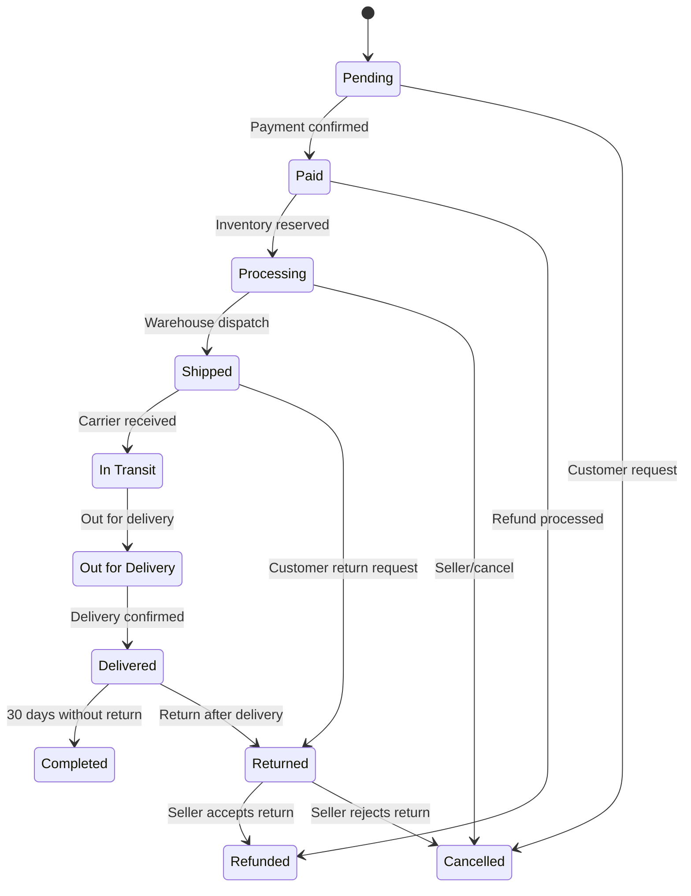

# Order Tracking System

## Order Status Lifecycle

The order tracking system defines a clear, immutable lifecycle of order statuses that reflect the business process from initiation to completion. Each status represents a specific stage in the order journey and can only transition to predefined subsequent states.

### Order Status Definitions

- **Pending**: New order created, payment not yet processed or authorization pending
- **Paid**: Payment successfully authorized and captured
- **Processing**: Order confirmed, inventory reserved, preparing for shipment
- **Shipped**: Item dispatched from warehouse with tracking number generated
- **In Transit**: Package in possession of carrier, en route to destination
- **Out for Delivery**: Package at local delivery facility, scheduled for final delivery today
- **Delivered**: Package successfully delivered and signed for
- **Cancelled**: Order cancelled by customer, seller, or system before shipping
- **Refunded**: Full or partial refund processed and completed
- **Returned**: Item returned to seller by customer
- **Completed**: Final status after delivery and no active returns/refunds

## Status Transition Rules

The order status follows strictly defined state transitions that ensure business integrity and customer transparency. No arbitrary or non-standard transitions are permitted.

### Allowed Transitions

- Pending → Paid
- Pending → Cancelled
- Paid → Processing
- Processing → Shipped
- Shipped → In Transit
- In Transit → Out for Delivery
- Out for Delivery → Delivered
- Delivered → Completed
- Processing → Cancelled
- Paid → Refunded (if not yet processed)
- Shipped → Returned (requires customer return request)
- Delivered → Returned (after delivery)
- Refunded → Completed (after refund processing)
- Returned → Refunded (after seller accepts return)
- Returned → Cancelled (if seller rejects return)

### Transition Validation Logic

WHEN an order is created, THE system SHALL set the status to "Pending".
WHEN payment is successfully captured, THE system SHALL transition the order from "Pending" to "Paid".
WHEN inventory for all items in the order is reserved successfully, THE system SHALL transition the order from "Paid" to "Processing".
WHEN the warehouse team marks an order as dispatched, THE system SHALL transition the order from "Processing" to "Shipped" and generate a tracking number.
WHEN the shipping carrier updates tracking status to "In Transit", THE system SHALL transition the order from "Shipped" to "In Transit".
WHEN the carrier updates tracking status to "Out for Delivery", THE system SHALL transition the order from "In Transit" to "Out for Delivery".
WHEN the carrier confirms delivery, THE system SHALL transition the order from "Out for Delivery" to "Delivered".
WHEN the order status reaches "Delivered" and no return or refund is initiated within 30 days, THE system SHALL automatically transition the order to "Completed".
WHEN a customer requests cancellation before the order is shipped, THE system SHALL transition the order to "Cancelled" and release all reserved inventory.
WHEN a full refund is processed and funds are returned to customer, THE system SHALL transition the order to "Refunded" regardless of delivery status.
WHEN a customer returns an item after delivery, THE system SHALL transition the order status to "Returned".
WHEN a seller accepts a return and processes a refund, THE system SHALL transition the order from "Returned" to "Refunded".
WHEN a seller rejects a return request, THE system SHALL transition the order from "Returned" to "Cancelled".

## Shipping Provider Integration

The system must integrate with external shipping providers via standardized APIs to obtain real-time tracking data and status updates.

### Supported Carriers

THE system SHALL support the following shipping providers with API integration:
- FedEx
- UPS
- Canada Post
- DHL Express
- USPS
- Regional carriers (to be configured via admin dashboard)

### Integration Requirements

WHEN an order is marked as "Shipped", THE system SHALL send the shipping information (recipient address, weight, dimensions, product description) via API to the selected carrier.
WHEN the carrier responds with a tracking number, THE system SHALL store the tracking number in the order record and link it to the selected carrier.
WHILE the order status is "Shipped", "In Transit", or "Out for Delivery", THE system SHALL poll each active carrier API every 6 hours to update delivery status.
WHEN the carrier API returns a status update, THE system SHALL automatically transition the order status to match the physical delivery state ("In Transit", "Out for Delivery", or "Delivered").
WHEN a carrier API returns an error, THE system SHALL log the error and retry the request after 30 minutes.
WHEN a carrier API returns "Delivered" status, THE system SHALL immediately transition the order to "Delivered" and trigger customer notification.
WHEN the carrier API indicates "Failed Delivery", THE system SHALL change the status to "Out for Delivery" and notify the customer of delivery attempt failure.

### Tracking Number Validation

THE system SHALL validate tracking numbers against carrier-specific formats during integration.
WHEN a tracking number is invalid for the selected carrier, THE system SHALL reject the shipment request and return HTTP 400 Bad Request with error code INVALID_TRACKING_NUMBER.

## Delivery Estimation Logic

The system calculates estimated delivery dates based on processing time, transit time, and carrier performance.

### Calculation Framework

WHEN an order status is marked as "Shipped", THE system SHALL calculate the estimated delivery date using this formula:
Estimated Delivery Date = (Order Processing Time) + (Transit Time) + (Carrier Buffer)

WHEN an order is placed before 14:00 (Asia/Seoul time), THE system SHALL set the Order Processing Time to 1 business day.
WHEN an order is placed after 14:00 (Asia/Seoul time), THE system SHALL set the Order Processing Time to 2 business days.

WHEN the carrier is FedEx or UPS, THE system SHALL set the Transit Time as:
- Domestic: 1-2 business days
- Cross-border: 3-5 business days

WHEN the carrier is DHL Express, THE system SHALL set the Transit Time as:
- Domestic: 1 business day
- Cross-border: 2-3 business days

WHEN the carrier is Canada Post or USPS, THE system SHALL set the Transit Time as:
- Domestic: 2-4 business days
- Cross-border: 4-7 business days

WHEN the shipping destination is within the same country as the warehouse, THE system SHALL add the domestic transit time.
WHEN the shipping destination is in a different country, THE system SHALL add the cross-border transit time.

WHEN the order status is marked as "Shipped", THE system SHALL set the Estimated Delivery Date based on the above rules.
WHILE the order is in transit, THE system SHALL adjust the Estimated Delivery Date if the carrier updates the scheduled delivery date.

### Estimated Date Display Rules

THE customer SHALL see the Estimated Delivery Date as a clear label on their order tracking page.
WHEN the estimated delivery date has passed and the order is still not delivered, THE system SHALL display a warning: "Delivery delayed. Expected: [date]".
WHEN the estimated delivery date is within 1 day, THE system SHALL display: "Expected delivery today".

## Customer Notifications

The system shall automatically notify customers at key milestones in the order journey via multiple communication channels.

### Notification Triggers

WHEN the order status changes to "Paid", THE system SHALL send an email and push notification: "Your payment has been successfully processed. Your order is now being prepared for shipment."
WHEN the order status changes to "Shipped", THE system SHALL send an email, push notification, and SMS: "Your order has been shipped! Track it here: [tracking link]"
WHEN the order status changes to "In Transit", THE system SHALL send a push notification: "Your package is now in transit. Follow its journey to your doorstep."
WHEN the order status changes to "Out for Delivery", THE system SHALL send an SMS and push notification: "Your package is out for delivery today!"
WHEN the order status changes to "Delivered", THE system SHALL send an email and push notification: "Your order has been delivered! Thank you for shopping with us. You can leave a review now."
WHEN the order status changes to "Cancelled", THE system SHALL send an email and push notification: "Your order has been cancelled. A full refund has been initiated."
WHEN the order status changes to "Refunded", THE system SHALL send an email: "Your refund has been processed. Funds will be returned to your original payment method within 3-7 business days."
WHEN the order status changes to "Returned", THE system SHALL send an email and push notification: "We received your returned item. The refund will be processed within 3 business days."

### Notification Channels

THE system SHALL support the following notification channels:
- Email (mandatory for all events)
- Push notification (mobile app users)
- SMS (mobile number confirmed and opted in)

WHEN a customer has opted in for SMS notifications, THE system SHALL send SMS for "Shipped", "Out for Delivery", and "Delivered" status changes.
WHEN a customer has not provided a mobile number or opted out of SMS, THE system SHALL default to email and push notifications only.
WHEN a push notification fails to deliver (device token invalid), THE system SHALL attempt fallback delivery via email.

### Notification Content Rules

WHEN sending a notification with a tracking link, THE system SHALL use the specific tracking URL from the carrier: "https://track.carrier.com/[trackingNumber]".
WHEN sending a notification with refund information, THE system SHALL specify the refund amount and original payment method.
WHEN sending a cancellation notification, THE system SHALL include the order ID and cancellation reason provided by customer or seller.

## Tracking Link Generation

The system generates a single, persistent tracking link for each order that aggregates all carrier updates into a unified customer experience.

### Link Creation

WHEN an order is marked as "Shipped" and a tracking number is assigned, THE system SHALL generate a unique tracking link using this format:
https://shoppingmall.com/track/[orderId]/[trackingNumber]

WHEN a customer clicks the tracking link, THE system SHALL display:
- Current order status
- Carrier name and logo
- Real-time tracking information from the carrier API
- Timeline visualization of status changes
- Estimated delivery date
- Contact information for carrier support
- Button to start return process (if delivered)

### Link Persistence

THE tracking link SHALL remain active and accessible even after order completion.
WHEN an order has been "Completed", THE tracking link SHALL display: "Delivery Confirmed" with final delivery date and signature confirmation.
WHEN an order has been "Returned", THE tracking link SHALL display: "Return Processed" with final return status and refund information.

### Link Security

THE tracking link SHALL require no authentication to access.
THE system SHALL NOT expose customer personal data on the tracking page beyond order status and delivery information.
THE tracking link SHALL be immune to brute-force attacks by ensuring each link is generated with a cryptographically secure random token that cannot be guessed.

### Link Integration

WHEN a customer receives an SMS or email with a tracking link, THE system SHALL ensure the link works immediately in all mobile and desktop browsers.
WHEN the tracking system loads, THE system SHALL dynamically update the display with carrier updates without requiring page refresh.

## Order Status Flowchart

## Error Handling and System Integrity

### Status Transition Failures

WHEN a status transition is attempted that is not permitted by the state diagram, THE system SHALL:
- Reject the transition with HTTP 409 Conflict error
- Log the attempted transition with timestamp, admin ID, order ID, source status, and target status
- Return detailed error message: "Invalid status transition from [source] to [target]. Valid transitions: [list of allowed transitions]."

### Concurrent Update Conflicts

WHEN two systems attempt to modify order status simultaneously:
- THE system SHALL use optimistic locking with version numbers
- THE system SHALL detect version mismatch and reject the second update
- THE system SHALL return error: "Order status changed during update. Please refresh and try again."
- THE system SHALL log the conflict for audit trail

### Missing Tracking Data

WHEN carrier API returns no tracking update for more than 48 hours:
- THE system SHALL flag the order as "Tracking Stalled"
- THE system SHALL notify the seller with request for manual update
- THE system SHALL notify the customer with: "Your shipment is experiencing a tracking delay. We're working to update your status."
- THE system SHALL escalate to support team if unresolved after 72 hours

## Business Process Compliance

### Regulatory Requirements

- ALL order status transitions SHALL be logged in immutable audit trail
- ALL customer notifications SHALL comply with GDPR/CCPA data minimization principles
- ALL tracking links SHALL be HTTPS encrypted with TLS 1.3+
- ALL customer data on tracking page SHALL be pseudonymized with no PII exposure beyond necessary
- ALL system log records SHALL be retained for minimum 7 years for financial compliance

### Third-Party Integrations

- ALL carrier API integrations SHALL be validated using test scenarios before production deployment
- ALL webhook endpoints SHALL have rate limiting to prevent denial-of-service
- ALL payment gateway integrations SHALL maintain connection during part of update
- ALL SMS providers SHALL comply with CTIA guidelines for messaging

## Performance and Scalability Requirements

- THE system SHALL support 10,000+ concurrent order tracking requests
- THE system SHALL serve tracking page with median response time under 500ms
- THE system SHALL handle 500+ carrier API updates per minute during peak traffic
- THE system SHALL maintain 99.95% uptime for tracking service
- THE system SHALL automatically scale infrastructure during holiday sales peaks

## Business Continuity and Disaster Recovery

- ALL order tracking data SHALL be replicated across three geographic zones
- ALL tracking link generation SHALL function during primary system failure
- THE system SHALL serve cached status information during short-term carrier outages
- ALL status transition logs SHALL be append-only with backup every 15 minutes
- THE system SHALL have failover routing for carrier API integration

> *Developer Note: This document defines **business requirements only**. All technical implementations (architecture, APIs, database design, etc.) are at the discretion of the development team.*