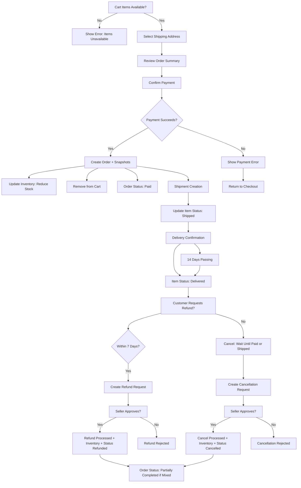
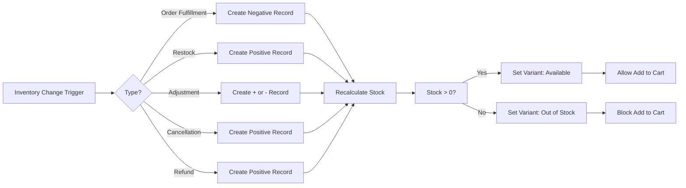

# E-Commerce Shopping Mall Platform Requirements Specification

## Overview

The shoppingMall e-commerce platform is a comprehensive online shopping ecosystem that enables customers to browse, purchase, and review products from multiple independent sellers, while ensuring full transactional integrity through an immutable snapshot system. All interactions require authenticated user accounts—there is no guest access. The system distinguishes between three core actor roles: customers, sellers, and administrators (including super administrators), each with defined permissions and responsibilities. The platform's central principle is data integrity: every mutable business state change generates an immutable snapshot, preserving historical accuracy for audits, dispute resolution, and legal compliance. All financial transactions, product changes, and user modifications are recorded as traceable events, with real-time inventory management driven by additive history records. The system supports complex, multi-seller order workflows with granular status control, flexible shipping logic, and robust review and refund mechanisms—all underpinned by strong transactional guarantees.

## Actor Definitions

### Customer

A customer is a registered user who browses products, adds items to their cart, places orders, writes reviews, and manages their personal profile. Customers must authenticate with email and password to perform any action on the platform. Customers retain full access to their order history, reviews, and snapshots even after account deletion. They can manage addresses, wishlist items, and cart contents, subject to inventory and availability constraints. Customers have no administrative privileges and cannot modify seller or system data.

### Seller

A seller is a registered business entity that creates and manages products, handles order fulfillment, and interacts with customers through product listings and support. Sellers must register and receive administrator approval before listing products. Sellers own their product catalog and are responsible for inventory management, order processing, and responding to customer requests (cancellations and refunds). They can edit their shop profile—creating snapshots of each change—and view analytics about their sales performance. Sellers cannot modify categories, manage other sellers, or access customer account details beyond what is necessary for order fulfillment.

### Administrator

An administrator is a user granted elevated privileges to oversee platform operations. Regular administrators can manage seller registrations, suspend/reinstate accounts, delete products and categories, view all orders, and perform forced cancellations or refunds. Administrators cannot access private customer information such as payment details, nor can they delete customer accounts. Their authority is constrained to maintaining platform compliance and operational integrity.

### Super Administrator

A super administrator holds the highest access level and can perform all actions of a regular administrator. Additionally, super administrators can promote and demote other administrators, manage platform-wide settings, and audit all data snapshots. Super administrators cannot delete snapshots, modify immutable records, or bypass any system integrity constraints. They are accountable for systemic governance and cannot demote themselves.

## Core System Principles

### Authentication and Authorization

- All platform features require authentication via email/password.
- No guest or anonymous access is permitted.
- Session management is enforced server-side with JWT tokens.
- Each user actor (customer, seller, administrator) is assigned a unique role with granular, immutable permissions.
- Permission changes (e.g., promotion to admin) trigger a role snapshot.
- Access to snapshots is role-restricted: customers access their own records, sellers access their own, administrators access all.
- Unauthorized access attempts are logged and blocked regardless of user role.

### Snapshot Principle

- Every mutable business entity undergoes snapshot creation upon change.
- Snapshots are immutable, permanent, and cannot be deleted, edited, or modified.
- Snapshot triggers include creation, update, and deletion of: products, product variants, seller profiles, reviews, addresses, cancellation requests, refund requests, order item statuses, and customer/seller account roles.
- All snapshots contain:
  - The previous state of all relevant fields
  - The new state of all relevant fields
  - A timestamp in ISO 8601 format
  - A unique actor identifier (user ID or "system")
  - The source context (e.g., "Order Placement", "Review Edit", "Inventory Adjustment")
- Snapshots preserve not only direct entity fields but also nested related data: product variants (SKU state) within product snapshots and seller profile details within order item snapshots.
- Snapshots serve as the single source of truth for historical accuracy in financial disputes, legal audits, and customer service.
- The system enforces snapshot creation via pre-update hooks—no state change is permitted without snapshot generation.
- Snapshots are never used for read performance—they are accessed only for audit, dispute resolution, or historical comparison.
- Even administrative edits to products or data require a new snapshot, preserving both seller and admin change history.

### Inventory Management

- Inventory is tracked via an immutable sequence of discrete inventory history records—not snapshots.
- Each inventory change—whether restock, adjustment, order fulfillment, cancellation, or refund—generates a single record with:
  - variantId (foreign key)
  - quantityChange (integer: positive for restock, negative for reduction)
  - reason (enum: "Order Fulfillment", "Cancellation Reversal", "Refund Processing", "Restock", "Adjusted", "Damaged", "Theft", etc.)
  - timestamp (ISO 8601)
  - actorId (user ID or "system")
  - sourceTransactionId (optional: orderId, cancellationId, refundId)
- Current stock is calculated in real-time by summing all historical records for a variant.
- Stock is a derived, read-only field—never stored directly in the database.
- Inventory records are not snapshotted: they are audit logs, not business state snapshots.
- Out-of-stock variants (current stock ≤ 0) cannot be added to cart or purchased.
- Inventory is locked only at checkout—cart additions do not reduce stock.
- All inventory changes are atomically reflected in the current stock calculation after record creation.

### Transactional Integrity

- All financial interactions require a successful payment transaction.
- Order creation is only permitted after successful payment—payment failures do not result in order creation.
- Inventory decrements occur exclusively at the moment of order creation.
- Inventory increases occur exclusively via cancellation or refund approvals.
- Order status is derived entirely from the statuses of its constituent order items.
- No field in an order or order item can be modified after creation except via status transitions triggered by approved requests.
- All changes to status, products, and seller attributes must be immutable once stored in snapshots.
- The system cannot be rolled back—data is augmented through append-only history.

## Customer Account Management

### Registration

WHEN a user registers as a customer, THE system SHALL:
- Collect email address and password (minimum 8 characters)
- Validate email format (RFC 5322)
- Hash password using bcrypt
- Create an account record with status: "active"
- Assign unique customer_id
- Log registration timestamp
- Send verification email

WHEN a user submits an invalid email or password, THE system SHALL:
- Reject registration
- Return precise error: "Invalid email format" or "Password must be at least 8 characters"
- Do not create account or snapshot
- Do not leak existence of existing emails

### Authentication

WHEN a user attempts to log in, THE system SHALL:
- Retrieve customer record by email
- Compare hashed password with provided input
- If match, create and return JWT token with claims: userId, role, expiresAt
- Log successful authentication

WHEN authentication fails, THE system SHALL:
- Return generic error: "Invalid email or password"
- Do not indicate whether email or password was incorrect
- Rate-limit failed attempts to 5 per minute per IP

### Password Management

WHEN a customer requests to change their password, THE system SHALL:
- Require current password verification
- Validate new password meets complexity rules (min 8 chars, alphanumeric)
- Hash new password
- Update record
- Create a password update snapshot:
  - actor: customer_id
  - timestamp
  - action: "password_changed"

WHEN a customer has a forgotten password, THE system SHALL:
- Allow password reset via email (token-based, expiring in 30 minutes)
- Generate reset token, store in db, send email
- Allow password setting via token endpoint
- Delete token after use
- Record reset event in snapshot

### Account Deletion

WHEN a customer deletes their account, THE system SHALL:
- Mark account as: "deleted"
- Immediately remove:
  - Display name
  - Phone number
  - All addresses
  - Wishlist
  - Cart
- Preserve:
  - All order records and associated snapshots
  - All review records and their snapshots
  - All inventory history linked to their purchases
- For all reviews linked to the deleted account, update display as: "Deleted User"
- Set customer's user_id as "archived"
- Block reuse of email address
- Trigger cleanup of session tokens
- Create account deletion snapshot:
  - actor: system
  - timestamp
  - reason: "Customer-initiated account deletion"

## Customer Profile and Address Management

### Profile Management

WHEN a customer edits their display name, THE system SHALL:
- Accept name up to 100 characters
- Trim whitespace
- Reject empty or null names
- Update profile record
- Create a profile update snapshot:
  - previous_display_name: "old value"
  - new_display_name: "new value"
  - actor: customer_id
  - timestamp

WHEN a customer edits their phone number, THE system SHALL:
- Validate as E.164 format
- Accept + prefix and digits
- Reject invalid format
- Update profile record
- Create profile update snapshot

WHEN a customer updates both name and phone simultaneously, THE system SHALL:
- Create one snapshot capturing both changes
- Record old and new values for both fields

### Address Management

WHEN a customer adds a new address, THE system SHALL:
- Require: recipient name, phone, street address, city, state/province, postal code, country
- Accept optional: address line 2, landmark
- Validate: country code (ISO 3166-1), postal code format per country
- Store address record with is_default: false
- Assign unique address_id
- Create address snapshot containing all fields

WHEN a customer edits an address, THE system SHALL:
- Permit update to any field
- Do not allow change of customer_id or address_id
- Create a new address snapshot containing before and after values

WHEN a customer deletes an address, THE system SHALL:
- Mark address as: "deleted"
- Record deletion timestamp
- Create an address deletion snapshot:
  - action: "deleted"
  - actor: customer_id
  - previous_state: all fields

WHEN a customer sets an address as default, THE system SHALL:
- Set is_default: true for that address
- Set is_default: false for all other addresses from the same customer
- Create a snapshot of the address update
- Record the previous default address

WHEN an address referenced in an order is edited or deleted, THE system SHALL:
- Preserve the address state in the order snapshot at time of purchase
- Do not modify or delete any order's shipping address
- Show order details with original snapshot values only

WHEN an order contains an address that was deleted, THE system SHALL:
- Display the preserved snapshot values in order details
- Show as: "Shipping address: [Snapshot values]"
- Do not show "deleted" label on the address itself

## Seller Account and Profile Management

### Seller Registration

WHEN a user registers as a seller, THE system SHALL:
- Collect: email, password, shop name, shop description, logo URL (optional)
- Validate email format
- Validate shop name: 2–100 characters, alphanumeric with spaces and punctuation
- Validate description: 0–10,000 characters
- Validate logo URL: HTTPS, must be valid image format (jpeg, png, webp)
- Create seller record with status: "pending_approval"
- Assign unique seller_id
- Create seller registration snapshot:
  - status: "pending_approval"
  - actor: seller_id
  - timestamp
- Send notification to administrators

WHEN a seller submits incomplete data, THE system SHALL:
- Return exact error: "Shop name is required" or "Invalid logo URL"
- Do not create record or snapshot

### Approval Workflow

WHEN an administrator approves a seller registration, THE system SHALL:
- Change seller status to: "approved"
- Send confirmation email to seller
- Create registration snapshot:
  - previous_status: "pending_approval"
  - new_status: "approved"
  - actor: admin_id
  - timestamp
- Allow seller to create products

WHEN an administrator rejects a seller registration, THE system SHALL:
- Change seller status to: "rejected"
- Record rejection reason (text, 10–500 characters)
- Send notification to seller with reason
- Create registration snapshot:
  - previous_status: "pending_approval"
  - new_status: "rejected"
  - actor: admin_id
  - timestamp
  - reason: "[rejection reason]"

WHEN a seller receives rejection, THE system SHALL:
- Allow resubmission with same or new email
- Create new seller record with a new seller_id on resubmission
- Preserve the original rejection snapshot

### Seller Profile Management

WHEN a seller edits their shop name, THE system SHALL:
- Validate: 2–100 characters, no HTML
- Reject if name conflicts with existing active seller
- Update profile record
- Create seller profile snapshot:
  - shop_name: new value
  - shop_description: unchanged
  - logo: unchanged
  - actor: seller_id
  - timestamp

WHEN a seller edits their shop description, THE system SHALL:
- Accept 0–10,000 characters
- Allow Markdown or plain text
- Update profile record
- Create seller profile snapshot with new description

WHEN a seller changes their logo, THE system SHALL:
- Accept new image upload (max 5MB)
- Validate as JPEG, PNG, or WebP
- Generate secure image URL
- Replace old logo URL
- Create seller profile snapshot with new logo URL

WHEN a seller updates all three (name, description, logo) in one request, THE system SHALL:
- Create one snapshot capturing all three fields
- Include old and new values for each
- Preserve unchanged fields

WHEN a seller edits their profile after being suspended, THE system SHALL:
- Reject any edit
- Return error: "Your account is suspended. No profile edits allowed."
- Do not create snapshot

### Seller Account Deletion

WHEN a seller attempts to delete their account, THE system SHALL:
- Verify:
  - No order items with status: "paid" or "shipped"
  - No pending cancellation requests
  - No pending refund requests
- IF conditions met, proceed to deletion
- IF not met, return error:
  - "You have 3 open orders. Complete them before deletion."
  - "You have 1 pending cancellation request."

WHEN seller account deletion is approved, THE system SHALL:
- Mark seller status: "deleted"
- Immediately delete:
  - All products
  - All product variants
  - All inventory history records for their variants
- Preserve:
  - All seller profile snapshots
  - All order items referencing this seller
  - All product snapshots
  - All review snapshots
  - All cancellation/refund request snapshots
- Mark all seller references as: "Deleted Seller"
- Create seller account deletion snapshot:
  - actor: seller_id
  - timestamp
  - reason: "Seller-initiated account deletion"

## Category Management

### Category Structure

WHEN a category is created, THE system SHALL:
- Require: name (2–100 chars), description (0–1,000 chars)
- Allow optional: parent_category_id (only one level of nesting)
- Create category record with unique category_id
- Create category snapshot:
  - name: "New Category"
  - description: "Detailed description"
  - parent_category_id: [nullable]
  - actor: admin_id
  - timestamp

WHEN a category is edited, THE system SHALL:
- Permit name or description modification
- Do not permit reassigning parent-child relationships
- Create category snapshot with previous and new values

WHEN a category is deleted, THE system SHALL:
- Move all products assigned to this category to: "Uncategorized" (predefined placeholder category)
- Mark category as: "deleted"
- Create category snapshot:
  - status: "deleted"
  - actor: admin_id
  - timestamp
  - previous_name: "old name"
  - previous_description: "old description"
- Do not delete any product, variant, or snapshot
- Products remain visible with "Uncategorized" tag

WHEN an administrator deletes a category with subcategories, THE system SHALL:
- Delete the parent category
- Move all subcategory products to "Uncategorized"
- Mark all subcategories as deleted
- Create individual snapshots for parent and each child
- Preserve all product snapshots

## Product and Variant Management

### Product Creation

WHEN a seller creates a product, THE system SHALL:
- Require: name (1–200 chars), description (1–10,000 chars), category_id, base_price (numeric > 0)
- Accept optional: images (array of URLs, max 20)
- Assign seller_id from authenticated session
- Set active: true
- Create product record
- Create product snapshot:
  - name: "Product Name"
  - description: "Product description"
  - category_id: [id]
  - base_price: 29.99
  - images: ["img1.jpg", "img2.jpg"]
  - variant_count: 0
  - actor: seller_id
  - timestamp

WHEN product creation fails validation, THE system SHALL:
- Return specific error: "Base price must be greater than 0."
- Do not create record or snapshot

### Product Editing

WHEN a seller edits a product, THE system SHALL:
- Permit changes to: name, description, category_id, base_price, image sequence
- Reject: product_id, seller_id, active status
- For each field changed, capture old and new value
- Create one product snapshot capturing all changes
- Preserve untouched fields
- If image sequence is reordered, capture exact new order

WHEN a product's base price is changed, THE system SHALL:
- Retain variant override prices
- Do not auto-update variant prices
- Create snapshot with new base_price

### Product Images

WHEN a seller uploads an image, THE system SHALL:
- Accept JPEG, PNG, WebP, max 5MB
- Validate file integrity
- Generate secure hash-based URL
- Append to images array
- Create product snapshot with new image sequence

WHEN a seller deletes an image, THE system SHALL:
- Remove from images array
- Create product snapshot with updated image list
- Preserve original image file for historical snapshots

WHEN a seller reorders images, THE system SHALL:
- Accept reordering of image URLs
- Create product snapshot with new order
- The first image in array becomes the thumbnail used in listings and order snapshots

WHEN a product has no images, THE system SHALL:
- Create product snapshot with images: []
- Use default placeholder image in UI

### Production Variants (SKU)

WHEN a seller creates a variant, THE system SHALL:
- Require: product_id, sku (unique within product, 3–50 alphanumeric + hyphen/underscore), stock_quantity (integer ≥ 0)
- Accept optional: price_override (numeric ≥ 0), option_values (object: {"color": "Red", "size": "Large"})
- Validate sku: no spaces, unique per product
- Validate option_values: at least one pair, keys and values must be non-empty strings
- Reject: duplicate sku, invalid option names
- Create product-snapshot-SKU record:
  - product_id
  - variant_id
  - sku: "SKU123"
  - option_values: {"color": "Red", "size": "Large"}
  - price: 39.99 (either override or base)
  - stock_quantity: 50
  - actor: seller_id
  - timestamp
- Create product snapshot that includes this variant's state

WHEN a seller edits a variant, THE system SHALL:
- Permit changes to: sku, option_values, price_override, stock_quantity
- Reject: product_id, variant_id
- If sku changes, validate uniqueness
- If option_values changes, validate structure
- Create product-snapshot-SKU with previous and new values
- Create product snapshot with updated variants

WHEN a seller deletes a variant, THE system SHALL:
- Reject if any order items exist with status: "paid" or "shipped"
- Reject if any pending cancellation/refund exist
- IF valid, mark variant as "deleted"
- Create product-snapshot-SKU with status: "deleted"
- Create product snapshot with variant removed
- Preserve all historical snapshots

WHEN a product has no variants, THE system SHALL:
- Display product as: "Unavailable" in search and listings
- Allow viewing in product detail page
- Show message: "This product is currently unavailable. No variants exist."
- Permit product editing and variant creation
- Maintain product snapshot with variants: []

## Inventory Management (History Records)

### Restocking

WHEN a seller restocks a variant, THE system SHALL:
- Require: quantity (integer > 0), reason (enum: "Supplier Delivery", "Returns Received", "Manual Adjustment", "Damaged Goods Replacement")
- Validate quantity > 0
- Create inventory record:
  - variant_id
  - quantityChange: +quantity
  - reason
  - actorId: seller_id
  - sourceTransactionId: null
- Recalculate current stock: SUM(all records)
- If stock transitions from ≤0 to >0, update variant status to: "available"
- Notify customers on wishlist if product is now available

### Inventory Adjustment

WHEN a seller performs inventory adjustment, THE system SHALL:
- Require: quantity (any integer), reason (enum: "Damage", "Theft", "Counting Error", "Quality Issue", "Gift Item", "Other")
- If reason is "Other", require additional detail (10–200 characters)
- Create inventory record with negative or positive change
- Recalculate current stock
- Do not create snapshot

### Order Fulfillment

WHEN an order is successfully paid, THE system SHALL:
- For each order item:
  - Create inventory record:
    - variant_id
    - quantityChange: -(quantity)
    - reason: "Order Fulfillment"
    - actorId: "system"
    - sourceTransactionId: orderId
- Recalculate current stock
- Do not lock stock at cart time—only reduce on successful payment

### Cancellation and Refund

WHEN a cancellation request is approved, THE system SHALL:
- Create inventory record:
  - variant_id
  - quantityChange: +(quantity)
  - reason: "Cancellation Reversal"
  - actorId: (admin_id or seller_id)
  - sourceTransactionId: cancellationId
- Increase stock
- Update order item status: "cancelled"

WHEN a refund request is approved, THE system SHALL:
- Create inventory record:
  - variant_id
  - quantityChange: +(quantity)
  - reason: "Refund Processing"
  - actorId: (admin_id or seller_id)
  - sourceTransactionId: refundId
- Increase stock
- Update order item status: "refunded"

### Out-of-Stock Behavior

WHEN a variant's current stock ≤ 0, THE system SHALL:
- Set status: "out of stock"
- Hide "Add to Cart" button on product detail page
- Show warning: "Out of Stock" in search results and category listings
- Mark cart items as: "unavailable" if quantity > 0
- Allow product to remain visible in search

WHEN stock becomes > 0, THE system SHALL:
- Set status: "available"
- Re-enable cart addition
- Remove "unavailable" status from cart
- Send notification to wishlist members

## Product Search and Listings

### Search Functionality

WHEN a customer searches products, THE system SHALL:
- Match product name using full-text search with stemming (e.g., "headphones" matches "headphone")
- Filter by category_id if specified
- Filter by price range (base_price or min/max variant prices)
- Filter by stock: only include products with current stock > 0 if "in-stock only" enabled
- Sort by: newest first, price low to high, price high to low
- Return paginated results (page size: 20)
- Use live product data—not snapshots—for search filtering and sorting
- Return product summary:
  - product_id
  - name
  - base_price
  - seller_shop_name
  - main_image_url
  - avg_rating
  - review_count

### Product Listing

WHEN a customer views a category or search results, THE system SHALL:
- Display each product with:
  - Thumbnail image (first image from live product)
  - Product name
  - Price: if single variant → use variant price; if multiple → use "from $X to $Y"
  - Seller shop name (clickable to profile)
  - Average rating (1–5 stars)
  - Review count
- Do not show variants or inventory status
- Do not show descriptions

### Product Detail Page

WHEN a customer views a product detail page, THE system SHALL:
- Display:
  - All product images (in ordered sequence)
  - Name and full description
  - Category name
  - Seller shop name (with link)
  - List of available variants:
    - Option values
    - SKU code
    - Price (override or base)
    - Stock status: "In stock (X Left)" or "Out of stock"
    - "Add to Cart" button if in stock
  - Average rating with stars
  - Total review count
  - All non-deleted reviews (newest first)
- Preserve exact product and variant state as of last snapshot

## Shopping Cart

### Cart Add

WHEN a customer adds a variant to cart, THE system SHALL:
- Require user to be authenticated
- Require exact variant_id
- Validate variant exists and is active
- Validate current stock ≥ 1
- If variant already in cart:
  - Increase quantity: cart_item.quantity += input_quantity
- Else:
  - Create cart item with:
    - product_id
    - variant_id
    - quantity
    - unit_price (at time of cart addition)
    - product_name
    - variant_options (JSON object)
    - seller_id
    - stock_status
- Do not verify stock again on cart add—only at checkout
- Do not create cart snapshot

### Cart Quantity Management

WHEN a customer changes cart quantity, THE system SHALL:
- Accept values 1–999
- Reject 0 or >999
- If quantity > current stock:
  - Display warning: "Only [X] items available. Adjust quantity."
  - Do not prevent save
- Update cart item
- Save to session storage

### Cart Display

WHEN a customer views their cart, THE system SHALL:
- Show each cart item with:
  - Product name (link to product page)
  - Variant label: "Color: Red, Size: Large"
  - Unit price
  - Quantity selector (spin box or text input)
  - Subtotal
  - Seller name
  - Stock status indicator:
    - ✅ In stock (X available)
    - ⚠️ Low stock (Y < 10)
    - ❌ Out of stock
- Show:
  - Total quantity (sum of all quantities)
  - Total cost (sum of subtotals)
- Show "Proceed to Checkout" button

### Cart Validation

WHEN a cart item's product is deleted, THE system SHALL:
- Mark item as: "Unavailable: Product no longer exists"
- Disable quantity change
- Show warning icon
- Do NOT auto-remove

WHEN a cart item's variant is out of stock, THE system SHALL:
- Mark item as: "Out of Stock"
- Disable quantity change
- Show warning
- Do NOT auto-remove

WHEN a cart has items marked "unavailable", THE system SHALL:
- Disable "Proceed to Checkout"
- Show message: "Some items are no longer available. Please adjust your cart."

### Cart Persistence

WHEN a customer logs in after session timeout (30+ minutes inactivity), THE system SHALL:
- Restore cart from last saved state (if less than 48 hours old)
- Re-validate stock for each variant
- Remove items that are now deleted, unavailable, or out of stock
- Show warning: "Some items were removed as they are no longer available."

WHEN a customer logs in from a new device, THE system SHALL:
- Restore cart as above
- Allow immediate checkout

## Checkout and Payment

### Checkout Initiation

WHEN a customer clicks "Proceed to Checkout", THE system SHALL:
- Check each cart item:
  - If any is "out of stock" or "unavailable":
    - Disable checkout
    - Show error: "Some items are unavailable. Unable to proceed."
  - Else:
    - Proceed to address selection

### Address Selection

WHEN a customer selects an address during checkout, THE system SHALL:
- Lock selection
- Capture exact values:
  - recipient_name
  - phone_number
  - street_address
  - city
  - state_province
  - postal_code
  - country
- Prevent edit after confirmation
- Save as selectedAddressId

WHEN a customer has no addresses, THE system SHALL:
- Require creation of new address
- Validate fields
- Save address
- Assign as selected

### Order Review

WHEN a customer reviews order before payment, THE system SHALL:
- Display:
  - Item list: product, variant, quantity, unit price, subtotal
  - Selected shipping address
  - Total amount
  - Estimated delivery timeframe
- If any item no longer available, disable "Confirm Payment"
- Show warning: "One or more items are unavailable since cart addition."

### Payment Processing

WHEN a customer confirms payment, THE system SHALL:
- Transmit to payment gateway (external system)
- Display: "Processing Payment..."
- Lock UI from edits

WHEN payment succeeds, THE system SHALL:
- Proceed to order creation

WHEN payment fails, THE system SHALL:
- Return exact gateway error code:
  - "insufficient_funds"
  - "expired_card"
  - "invalid_card_number"
  - "gateway_timeout"
- Show message: "Payment declined: [reason]. Please try again."
- Return to checkout with cart and address preserved
- Do NOT create order
- Do NOT adjust inventory

### Order Creation

WHEN payment succeeds, THE system SHALL:
- Create order record:
  - order_id
  - customer_id
  - shipping_address (copied from selection)
  - total_amount
  - payment_status: "paid"
  - created_at
- Remove cart items
- For each cart item:
  - Create order item:
    - product_id
    - variant_id
    - quantity
    - unit_price
    - status: "paid"
    - seller_id
  - Create product snapshot (name, description, images, category, base_price)
  - Create product-snapshot-SKU (sku, option_values, price, stock_quantity)
  - Create seller profile snapshot (shop_name, shop_description, logo)
  - Create inventory record: quantityChange: -(quantity)
  - Create order item snapshot: status "paid" with actor: "system"
- Set order status to: "paid"

## Order Structure and Status

### Order Item Status

Order item statuses:
- "paid" (payment completed)
- "shipped" (seller dispatched item)
- "delivered" (customer confirmed or 14 days passed)
- "cancelled" (cancellation approved)
- "refunded" (refund approved)

WHEN an order item's status changes, THE system SHALL:
- Create an order item snapshot:
  - previous_status
  - new_status
  - action_reason (optional text)
  - actor (customer, seller, admin, system)
  - timestamp
- Update status in live record

### Order Status Derivation

WHEN an order has:
- All items "paid" → status: "paid"
- Any item "shipped" and none "delivered" → status: "shipped"
- All items "delivered" → status: "delivered"
- All items "cancelled" → status: "cancelled"
- All items "refunded" → status: "refunded"
- Mixed statuses → status: "partially completed"

WHEN an item transitions from "paid" to "shipped", THE system SHALL:
- Derive order status from updated item list
- Do not allow manual override

## Shipping and Tracking

### Shipment Creation

WHEN a seller ships items, THE system SHALL:
- Select one or more order items (all must be: "paid" status)
- All selected items must be from the same seller
- Enter: carrier_name, tracking_number
- Create shipment record:
  - seller_id
  - order_id
  - carrier_name
  - tracking_number
  - dispatched_at
- For each item in shipment:
  - Update order item status: "shipped"
  - Create order item snapshot: status "shipped" with actor: "seller"

### Delivery Confirmation

WHEN customer confirms delivery, THE system SHALL:
- Update all items in that shipment to status: "delivered"
- Create order item snapshot for each item

WHEN no delivery confirmation after 14 days, THE system SHALL:
- Automatically change status: "shipped" → "delivered"
- Create order item snapshot:
  - actor: "system"
  - reason: "Automatically delivered after 14 days"

## Order Cancellation and Refunds

### Cancellation Requests

WHEN a customer requests cancellation for "paid" item, THE system SHALL:
- Accept cancellation reason (text, 10–500 chars)
- Create cancellation request snapshot:
  - order_item_id
  - status: "pending"
  - reason
  - actor: customer_id
  - timestamp
- Send notification to seller

WHEN a seller approves cancellation, THE system SHALL:
- Update status: "cancelled"
- Create snapshot: status "cancelled", actor: seller_id, reason: "Approved by seller"
- Create inventory record: +quantity
- Update order item status

WHEN a seller rejects cancellation, THE system SHALL:
- Update status: "rejected"
- Create snapshot: status "rejected", actor: seller_id, reason: "[rejection reason]"
- No inventory change
- Notify customer

### Refund Requests

WHEN a customer requests refund for "delivered" item, THE system SHALL:
- Accept reason (10–500 chars)
- Validate: delivered_at + 7 days > now
- Create refund request snapshot:
  - order_item_id
  - status: "pending"
  - reason
  - actor: customer_id
  - timestamp
- Notify seller

WHEN a seller approves refund, THE system SHALL:
- Update status: "refunded"
- Create snapshot: status "refunded", actor: seller_id
- Create inventory record: +quantity
- Update order item status

WHEN a seller rejects refund, THE system SHALL:
- Update status: "rejected"
- Create snapshot: status "rejected", actor: seller_id, reason: "[rejection reason]"
- No inventory change
- Notify customer

WHEN an administrator forces cancellation or refund, THE system SHALL:
- Create order item snapshot:
  - status: "cancelled" or "refunded"
  - actor: "admin"
  - reason: "Admin forced [action]: [text]"
- Create inventory record: +quantity
- Send notification to customer and seller

## Reviews and Ratings

### Review Eligibility

WHEN a customer attempts to write a review, THE system SHALL:
- Verify:
  - Order item status is "delivered"
  - Review not already written for this product + order
  - Product still exists (even if deleted)
- IF not met, return error: "You cannot review this product. Eligibility requirements not met."
- IF met, allow review creation

WHEN a customer submits a review, THE system SHALL:
- Require: rating (integer 1–5)
- Accept: text content (0–10,000 characters)
- Create review record
- Create review snapshot:
  - rating
  - text
  - order_item_id
  - product_id
  - customer_id
  - is_deleted: false
  - actor: customer_id
  - timestamp
- Recalculate product average rating (sum of non-deleted reviews / count)

### Review Editing

WHEN a customer edits a review, THE system SHALL:
- Edit: rating or text
- Create new review snapshot:
  - previous_rating, previous_text
  - new_rating, new_text
  - actor: customer_id
  - timestamp
- Recalculate aggregate rating

### Review Deletion

WHEN a customer deletes a review, THE system SHALL:
- Set is_deleted: true
- Create review snapshot:
  - action: "deleted_by_customer"
  - timestamp
  - actor: customer_id
- Hide review from UI
- Recalculate product average rating (excluding this review)
- Preserve all snapshot data for audit

WHEN an administrator deletes a review, THE system SHALL:
- Set is_deleted: true
- Create review snapshot:
  - action: "deleted_by_admin"
  - reason: "[admin reason]"
  - actor: admin_id
  - timestamp
- Hide review from UI
- Recalculate aggregated rating
- Preserve full content for audit

### Review Display

WHEN a product's review list is shown, THE system SHALL:
- Sort: newest first
- Hide reviews marked: is_deleted: true
- Show "Deleted User" for reviews from deleted accounts
- Show star rating (visual)
- Show optional text
- Show review timestamp
- Show "edited" tag if multiple snapshots

## Seller Dashboard

WHEN a seller views their dashboard, THE system SHALL:
- Calculate:
  - Total products (live): COUNT(product WHERE seller_id = ? AND active = true)
  - Total order items: COUNT(order_item WHERE seller_id = ? AND status IN ("paid", "shipped", "delivered"))
  - Pending cancellations: COUNT(cancellation_request WHERE order_item_id IN (SELECT id FROM order_item WHERE seller_id = ?) AND status = "pending")
  - Pending refunds: COUNT(refund_request WHERE order_item_id IN (SELECT id FROM order_item WHERE seller_id = ?) AND status = "pending")
- Return numeric count only
- Do not use snapshots for these aggregations

WHEN a seller views their order items list, THE system SHALL:
- Show:
  - Order_id
  - Customer_id
  - Product name
  - Variant options
  - Quantity
  - Item status
  - Date
  - Total
- Allow filtering by: "paid", "shipped", "delivered", "cancelled", "refunded"
- Show only items where seller_id matches
- Use live status, not snapshots

## Administrator System

### Administrator Promotion

WHEN a user submits an administrator request, THE system SHALL:
- Accept reason (text, 20–500 chars)
- Create admin request snapshot:
  - user_id
  - request_reason
  - status: "pending"
  - actor: user_id
  - timestamp
- Show list of pending requests to super administrators

WHEN a super administrator approves, THE system SHALL:
- Update user role: "admin"
- Create user role snapshot:
  - previous_role: "customer" or "seller"
  - new_role: "admin"
  - actor: super_admin_id
  - timestamp
  - reason: "Approved"

WHEN a super administrator rejects, THE system SHALL:
- Create snapshot:
  - status: "rejected"
  - reason: "Rejection reason"
  - actor: super_admin_id
- Notify user

### Seller Approval Management

WHEN an administrator approves a seller, THE system SHALL:
- Change seller status: "approved"
- Create snapshot as defined in Seller Registration

WHEN an administrator rejects a seller, THE system SHALL:
- Change seller status: "rejected"
- Record reason
- Create snapshot

WHEN an administrator suspends a seller, THE system SHALL:
- Change seller status: "suspended"
- Hide all products from search and listing
- Prevent new product creation or editing
- Allow ongoing order fulfillment and response to cancellations/refunds
- Create seller profile snapshot:
  - action: "suspended"
  - reason: "[admin reason]"
  - actor: admin_id
  - timestamp

WHEN an administrator unsuspends a seller, THE system SHALL:
- Change seller status: "approved"
- Show products in search and listing
- Create snapshot:
  - action: "unsuspended"
  - actor: admin_id
  - timestamp

WHEN an administrator bans a seller, THE system SHALL:
- Change seller status: "banned"
- Prevent login
- Preserve all snapshots
- Allow existing orders to be fulfilled

### Category Management

WHEN an administrator creates a category, THE system SHALL:
- Follow Category Management rules

WHEN an administrator edits a category, THE system SHALL:
- Follow Category Management rules

WHEN an administrator deletes a category, THE system SHALL:
- Follow Category Management rules

### Product Oversight

WHEN an administrator views any product, THE system SHALL:
- Display product name, description, seller, category, base_price
- Show all product snapshots

WHEN an administrator deletes a product, THE system SHALL:
- Create product snapshot with deleted flag
- Preserve all associated snapshots
- Remove from listings

### Order Oversight

WHEN an administrator views all orders, THE system SHALL:
- Display order list with status, customer, total, date

WHEN an administrator forces cancellation, THE system SHALL:
- Follow Order Cancellation rules

WHEN an administrator forces refund, THE system SHALL:
- Follow Refund Request rules

### User Management

WHEN an administrator bans a customer, THE system SHALL:
- Change customer status: "banned"
- Prevent login
- Preserve all order history and snapshots
- Create user ban snapshot:
  - action: "banned"
  - reason: "[reason]"
  - actor: admin_id
  - timestamp

WHEN an administrator unbans a customer, THE system SHALL:
- Change status: "active"
- Create snapshot: "unbanned"

WHEN an administrator removes any data, THE system SHALL:
- Follow snapshot principle—NO deletion of snapshots, only marking

## Mermaid Diagrams

### Order Workflow

### Inventory Flow

### Snapshot Triggers

```mermaid
graph TD
    A[Product Created] --> B[Product Snapshot]
    A --> C[Product Variant Snapshot]
    D[Product Edited] --> B
    D --> C
    E[Product Deleted] --> B
    E --> C
    F[Variant Created] --> C
    F --> B
    G[Variant Edited] --> C
    G --> B
    H[Variant Deleted] --> C
    H --> B
    I[Seller Profile Edited] --> J[Seller Profile Snapshot]
    K[Review Created] --> L[Review Snapshot]
    K --> M[Review Edited] --> L
    K --> N[Review Deleted] --> L
    O[Address Created] --> P[Address Snapshot]
    O --> Q[Address Edited] --> P
    O --> R[Address Deleted] --> P
    S[Cancellation Request Created] --> T[Cancellation Request Snapshot]
    S --> U[Approve] --> T
    S --> V[Reject] --> T
    W[Refund Request Created] --> X[Refund Request Snapshot]
    W --> Y[Approve] --> X
    W --> Z[Reject] --> X
    AA[Order Placed] --> AB[Product Snapshot]
    AA --> AC[Product Variant Snapshot]
    AA --> AD[Seller Profile Snapshot]
    AA --> AE[Order Item Snapshot]
    AF[Admin Role Change] --> AG[User Role Snapshot]
    AH[System Auto-Deliver] --> AE
    AI[Admin Force Cancel/Refund] --> AE
    AJ[Customer Account Deletion] --> AK[Review Snapshot Modified: Deleted User]
```

## Business Rule Summary

1. No guest browsing: All users must authenticate.
2. All editable data changes trigger immutable snapshots.
3. Inventory is tracked via additive history records, not snapshots.
4. Snapshot data is used for audit and compliance, not performance.
5. Order status is derived from item statuses, never manually set.
6. Cart quantity combines identical variants—never duplicates.
7. Stock is real-time calculated—never stored.
8. Out-of-stock variants are blocked from cart and purchase.
9. Payment failure prevents order creation and inventory reduction.
10. Customer and seller deletion retains all historical data.
11. Administrator actions generate snapshots that are preserved.
12. All data changes have full actor and timestamp accountability.
13. No direct manipulation of any snapshot is permitted.
14. Every price and description in order items is preserved as-of-purchase.

## Integration and Constraints

- **Data Integrity**: Snapshots are the golden copy for dispute resolution.
- **Performance**: Inventory calculations are indexed and cached for real-time rendering.
- **Security**: All API endpoints enforce role-based access. Snapshots are read-only.
- **Scalability**: Snapshot data is archived after 5 years but remains queryable.
- **Compliance**: All records satisfy GDPR, CCPA, and financial audit requirements.
- **Extensibility**: Snapshot schema includes custom fields for future metadata.
- **Localization**: All text is stored in UTF-8; dates in ISO 8601 UTC.
- **Audit Logs**: Every snapshot record includes cryptographic hash for tamper detection.

> *Developer Note: This document defines **business requirements only**. All technical implementations (architecture, APIs, database design, etc.) are at the discretion of the development team.*