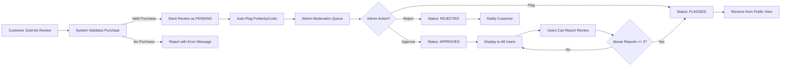
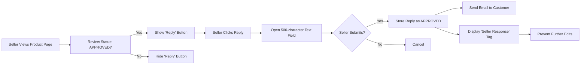
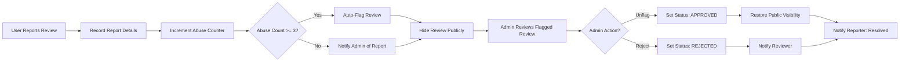

## Product Reviews and Ratings System

### Review Submission Requirements

THE system SHALL allow only authenticated customers to submit product reviews.

WHEN a customer attempts to submit a review for a product, THE system SHALL verify that the customer has previously completed a successful purchase of that exact product variant (SKU).

IF a customer has not purchased the product, THEN THE system SHALL reject the review submission and display the message: "You must own this product to leave a review."

WHILE the review submission form is active, THE system SHALL display all purchased product variants belonging to the target product in a dropdown menu.

THE product variant (SKU) selected during review submission SHALL be permanently associated with the review and visible to all users on the review detail page.

THE system SHALL require users to enter a rating and at least 50 characters of text content for every review submission.

WHEN a review is submitted, THE system SHALL store the following metadata: user ID, product ID, SKU ID, rating value, review text, submission timestamp, and initial moderation status (PENDING).

### Rating System

THE system SHALL use a 5-star rating scale where:
- 1 star = Very Poor
- 2 stars = Poor
- 3 stars = Average
- 4 stars = Good
- 5 stars = Excellent

WHEN a customer selects a star rating, THE system SHALL immediately render a visual feedback indicator showing the selected rating in real-time.

THE system SHALL display the average rating for each product as a single decimal value rounded to one decimal place (e.g., 4.2).

WHEN a product has no reviews, THE system SHALL display "No ratings yet" instead of an average value.

THE system SHALL aggregate all ratings for each product and SKU combination separately.

WHILE displaying product ratings on listing pages, THE system SHALL show the total number of reviews for each product variant.

WHILE displaying product ratings on product detail pages, THE system SHALL show a breakdown of reviews by star rating (e.g., "32 reviews: 5⭐ (62%), 4⭐ (20%), 3⭐ (10%), 2⭐ (5%), 1⭐ (3%)").

### Review Moderation

WHEN a review is submitted, THE system SHALL set the initial status to "PENDING" and prevent it from being displayed publicly.

WHILE a review has a status of "PENDING", THE system SHALL NOT display it to any users including the submitting customer.

THE system SHALL present all pending reviews in the admin dashboard under "Moderation Queue".

WHEN an admin reviews a pending submission, THE system SHALL allow the admin to select one of three actions: "Approve", "Reject", or "Flag for Further Review".

IF an admin chooses "Approve", THEN THE system SHALL update the review status to "APPROVED" and make it visible to all users.

IF an admin chooses "Reject", THEN THE system SHALL update the review status to "REJECTED" and notify the user via email: "Your review was not approved. Please ensure your review is honest, relevant, and follows our community guidelines."

IF an admin chooses "Flag for Further Review", THEN THE system SHALL set the review status to "FLAGGED" and assign it to a secondary review team.

WHEN an admin approves or rejects a review, THE system SHALL log the admin ID, timestamp, and action taken in the system audit trail.

THE system SHALL automatically flag reviews containing profanity, personal attacks, or external links as "FLAGGED" upon submission.

### Review Visibility Rules

WHEN a review has a status of "APPROVED", THE system SHALL display it publicly on both product detail pages and product listing pages.

WHEN a review has a status of "REJECTED" or "FLAGGED", THE system SHALL NOT display it to any user.

IF a review has been approved and later flagged by multiple users for abuse, THEN THE system SHALL automatically set the review status to "FLAGGED" and remove it from public view until an admin re-evaluates it.

THE system SHALL order reviews on product detail pages by submission date (newest first) as the default sort.

WHERE a user has selected "Helpful" as a sorting option, THE system SHALL sort reviews by the number of "Helpful" votes in descending order.

WHERE a user has selected "Highest Rating" as a sorting option, THE system SHALL sort reviews by star rating in descending order.

WHERE a user has selected "Lowest Rating" as a sorting option, THE system SHALL sort reviews by star rating in ascending order.

### Verified Purchase Badge

THE system SHALL display a "Verified Purchase" badge next to every approved review that was submitted for a product variant the user has successfully purchased.

THE "Verified Purchase" badge SHALL be visible on both the review card and the full review view.

WHEN a review has been approved but the associated purchase was later refunded or canceled, THE system SHALL remove the "Verified Purchase" badge but keep the review visible (unless it violates other policies).

THE system SHALL not allow customers to change their review after a refund.

### Reply to Reviews

WHEN a seller is logged in, THE system SHALL display a "Reply" button beneath every approved review for products they own.

WHEN a seller clicks "Reply", THE system SHALL open a text input field limited to 500 characters.

THE system SHALL allow sellers to reply to reviews one time only.

WHEN a seller submits a reply, THE system SHALL set the reply status to "APPROVED" and display it immediately beneath the original review with the label: "Seller Response".

THE system SHALL display the seller's store name and profile picture next to their reply.

IF a seller attempts to edit their reply after submission, THEN THE system SHALL prevent the edit and display the message: "Sellers can only reply once. Please contact support if you need to correct your response."

WHEN a seller replies to a review, THE system SHALL send a notification email to the customer: "The seller has responded to your review. View the response: [link]."

THE system SHALL not allow sellers to delete their replies.

THE system SHALL not allow sellers to reply to reviews with content that contains threats, profanity, or misleading information — such content will be automatically flagged and removed by admin.

### Report Abuse

WHEN any user views a review, THE system SHALL display a "Report" button adjacent to the review content.

WHEN a user clicks "Report", THE system SHALL present a modal with three predefined reasons:
- "Inappropriate content (profanity, hate speech)"
- "False or misleading information"
- "Spam or promotional content"

WHEN a user selects a reason and clicks "Submit", THE system SHALL immediately flag the review as "FLAGGED", notify all admins, and send the user a confirmation: "Thank you for reporting this review. Our moderation team will review it as soon as possible."

THE system SHALL threshold abuse reports: IF a review receives three or more abuse reports within 24 hours, THE system SHALL automatically set its status to "FLAGGED" and remove it from public view.

WHEN an admin reviews a flagged review, THE system SHALL allow the admin to either "Unflag" (restore public visibility) or "Reject" (permanently remove and notify the reviewer).

THE system SHALL log the reporter's user ID, selected reason, timestamp, and action taken in the system audit trail.

THE system SHALL not disclose reporter identity to the reviewed user or seller.

WHEN a review has been flagged by users and later resolved by admin (either approved or rejected), THE system SHALL notify the reporter: "Thank you for reporting [review]. Our team has reviewed your report."

THE system SHALL track the number of abuse reports per review and alert admins when any review exceeds 10 abuse reports.

<!-- Mermaid Diagram: Review Submission and Moderation Flow -->

<!-- Mermaid Diagram: Seller Response Workflow -->

<!-- Mermaid Diagram: Abuse Reporting and Flagging -->

### Exception Handling

IF a review submission fails due to server error, THEN THE system SHALL display: "Sorry, something went wrong. Please try again later."

IF the rating system fails to update, THEN THE system SHALL maintain the previous aggregated score and log the error for QA staff.

IF a seller replies to a review that has since been removed, THEN THE system SHALL display: "This review is no longer visible to the public."

IF a user tries to report a review after it has been deleted, THEN THE system SHALL display: "This review is no longer available for reporting."

IF a customer attempts to submit multiple reviews for the same SKU, THEN THE system SHALL deny the submission and display: "You've already reviewed this product variant."

WHILE a review is being moderated, THE system SHALL show: "This review is under review by our team and will be published soon." to the submitting user.

THE system SHALL cache review counts and average ratings to ensure response times remain under 300ms on product detail pages under 1000 concurrent users.

THE system SHALL require all review text and replies to be encoded in UTF-8 and properly escaped to prevent XSS attacks.

### Performance and Scalability

THE system SHALL support up to 10,000 reviews per product variant without performance degradation.

THE system SHALL update aggregated ratings and review counts in real-time using background workers.

WHILE loading product pages, THE system SHALL load reviews in batches of 5 with "Load More" pagination to ensure initial load time is under 2 seconds.

WHERE a user has filtered reviews by rating, THE system SHALL use indexed database queries to return results in under 500ms.

THE system SHALL utilize a distributed cache (Redis) to store frequently accessed review aggregates to reduce database load by 80%.

THE system SHALL maintain 99.95% uptime for review submission and display APIs during business hours (7 AM - 11 PM KST).

### Business Rules

Sellers SHALL NOT be allowed to incentivize reviews with discounts, free products, or other rewards.

Reviews SHALL NOT be allowed to mention competitor brands or products.

Review content SHALL NOT include phone numbers, email addresses, or direct contact information.

Reviews SHALL NOT contain links to external websites, social media profiles, or promotional content.

THE system SHALL automatically remove any review that depicts illegal activity, promotes violence, or contains child exploitation content — and immediately alert platform authorities.

Reviews that are too short (< 50 characters) SHALL be rejected automatically during submission.

Reviews containing more than 500 characters SHALL be truncated during display with a "Show More" toggle.

THE system SHALL permanently store all reviews and replies with full audit history — even if later rejected or flagged — for legal compliance and dispute resolution.

Any deleted reviews SHALL remain in the system database with a status of "DELETED" for legal retention purposes.

Review reports SHALL be treated as confidential and SHALL never be published or shared with the reviewing user.

An admin SHALL be required to manually review every seller reply that is flagged by the system.

Review submission SHALL be disabled for products that have been discontinued for more than 2 years.

THE system SHALL require all review text to be checked against an international profanity dictionary containing 15,000+ flagged terms across 5 languages.

Review data SHALL be subject to GDPR and CCPA compliance: users SHALL have the right to request review deletion.

WHEN a user requests review deletion under GDPR, THE system SHALL anonymize the review by setting: user ID to NULL, username to "Anonymous", and replacing review text with: "This review was deleted upon the user's request."