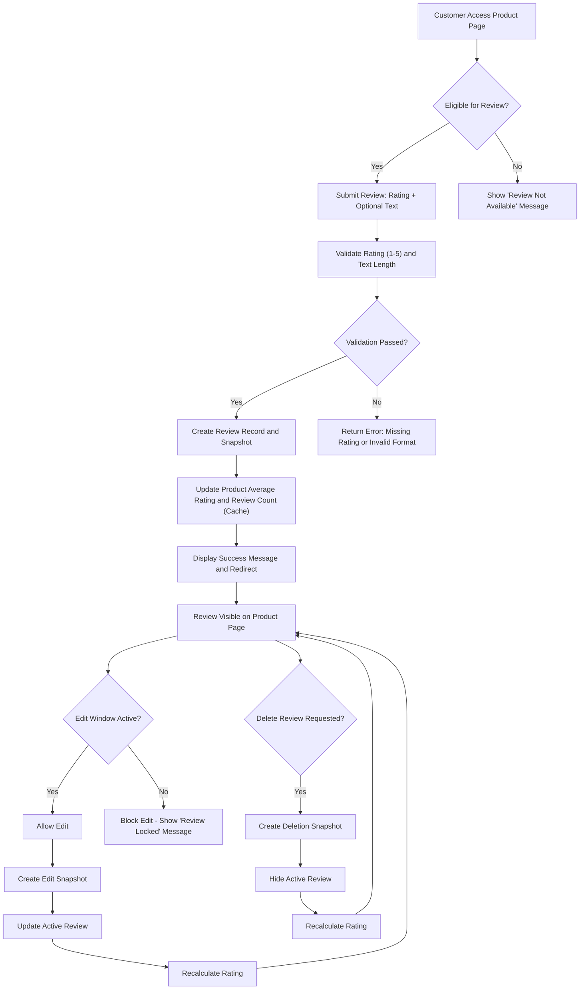

# Reviews and Ratings

## Review Eligibility

THE system SHALL allow customers to write reviews only for products they have purchased.

WHEN a customer has received a product (order item status is "delivered"), THE system SHALL enable review creation for that product.

WHERE a customer has already written a review for a specific product in a previous order, THE system SHALL prevent creation of a second review for the same product.

WHILE an order item status is "paid" or "shipped" or "cancelled" or "refunded", THE system SHALL prevent review creation for the associated product.

IF a product has been deleted by the seller, THEN THE system SHALL prevent review creation for that product.

IF a customer attempts to write a review for a product they did not purchase, THEN THE system SHALL return HTTP 403 with error code REVIEW_INVALID_PURCHASE.

## Review Creation

WHEN a customer submits a review for an eligible product, THE system SHALL create a review record with the following fields:
- rating (required, integer from 1 to 5)
- text (optional, up to 1,000 characters)
- createdAt (timestamp of submission)
- customerId (reference to the customer who wrote it)
- productId (reference to the product being reviewed)
- orderId (reference to the order containing the purchased item)

WHEN a review is created, THE system SHALL immediately update the product's average rating and total review count.

WHEN a customer submits a review without a rating, THEN THE system SHALL return HTTP 400 with error code REVIEW_MISSING_RATING.

WHEN a customer submits a rating that is not an integer between 1 and 5, THEN THE system SHALL return HTTP 400 with error code REVIEW_INVALID_RATING.

WHEN a customer submits a review text exceeding 1,000 characters, THEN THE system SHALL truncate the text to 1,000 characters and proceed with review creation.

WHEN a customer successfully creates a review, THE system SHALL display a success message and redirect to the product detail page.

## Review Editing

WHEN a customer submits an edit to their own review, THE system SHALL create a snapshot of the original review.

WHEN a review is edited, THE system SHALL preserve the original review's snapshot with timestamp, original rating, and original text.

WHEN a review is edited, THE system SHALL update the active review with new content and update the product's average rating.

THE system SHALL allow review editing for up to 7 days after review creation.

WHILE a review is older than 7 days, THE system SHALL prevent editing of the review.

IF a customer attempts to edit a review belonging to another customer, THEN THE system SHALL return HTTP 403 with error code REVIEW_UNAUTHORIZED_EDIT.

IF a customer attempts to edit a review after 7 days, THEN THE system SHALL return HTTP 403 with error code REVIEW_EDIT_WINDOW_EXPIRED.

WHEN a review is edited, THE system SHALL preserve the original timestamp and add an editedAt timestamp.

## Review Deletion

WHEN a customer requests to delete their own review, THE system SHALL create a snapshot of the review prior to deletion.

WHEN a review is deleted, THE system SHALL:
- Hide the active review from public product detail pages
- Preserve the snapshot of the review for audit and dispute resolution
- Recalculate the product's average rating based on remaining reviews
- Retain the review's contribution to historical rating calculations

THE system SHALL NOT allow deletion of a review if it was created as part of a dispute resolution process.

IF a customer attempts to delete a review belonging to another customer, THEN THE system SHALL return HTTP 403 with error code REVIEW_UNAUTHORIZED_DELETE.

IF a product is deleted, THE system SHALL preserve all snapshots of reviews for that product.

## Rating Calculation

WHEN any review is created, edited, or deleted (but snapshot preserved), THE system SHALL recalculate the product's average rating.

THE system SHALL calculate average rating as the mean of all non-deleted, non-hidden review ratings.

WHILE a product has no reviews, THE system SHALL display "No ratings yet".

THE system SHALL display average rating with one decimal place (e.g., 4.2 stars).

THE system SHALL display total review count as the number of non-deleted, non-hidden reviews.

IF a review's rating is changed from 5 to 3 during editing, THEN THE system SHALL adjust the product's average rating by subtracting 2/totalReviews from the previous average.

WHEN a review is deleted, THE system SHALL recalculate the average rating as the new mean of the remaining reviews.

THE system SHALL store the product's average rating and review count as cached values for performance optimization.

WHEN the cache is updated, THE system SHALL timestamp the cache update and log it for debugging purposes.

WHEN the system calculates a new average rating, it SHALL round to one decimal place using standard mathematical rounding rules.

THE system SHALL NOT include any deleted reviews (even snapshots) in active average ratings.

WHERE a product has 0 reviews, THE system SHALL display "No ratings yet" instead of 0.0 stars.

## Snapshot Integration

Every review creation, edit, and deletion triggers an immutable snapshot record that captures:
- The review ID
- The exact state of rating and text at time of change
- Timestamp of change
- Actor ID (customer) who performed the action
- System context (e.g., product ID, order ID)

These snapshots are stored in the `review_snapshots` table and are accessible to:
- The reviewing customer
- The seller of the product
- Administrators

Snapshots are used for:
- Dispute resolution between customers and sellers
- Audit trails for regulatory compliance
- Historical rating analysis
- Fraud detection when patterns of review manipulation occur

Snapshot integrity is enforced by immutable database constraints and cryptographic hashing of snapshot content.

## Business Rules

### Access Control

- Only authenticated customers can create, edit, or delete reviews
- Customers may only interact with their own reviews
- Sellers may view reviews for their own products but cannot edit or delete them
- Administrators may view any review but cannot edit or delete them

### Performance Requirements

- Review creation must complete within 1,000 milliseconds (1 second)
- Rating recalculation must occur within 500 milliseconds of review modification
- Review listing for product detail page must load in under 800 milliseconds
- Cache invalidation must be immediate upon review change

### Error Handling

- All validation errors must return standardized HTTP status codes and error codes
- Error responses must include human-readable messages for UI display
- System-level errors (e.g., database connection failure) must not expose internal implementation details
- The client SHALL be informed whether a review was successfully created, edited, or deleted

### Data Consistency

- Review ratings and counts must remain consistent across all UI surfaces (product listing, product detail, seller dashboard)
- If a review is deleted, its influence on historical average ratings must be preserved for reporting purposes
- Ratings must be recalculated atomically — no partial updates must occur

### Security Requirements

- All review data must be encrypted at rest
- Review submission endpoints must implement rate limiting to prevent spam
- Review text must be sanitized against XSS and injection attacks
- Customer identities must not be exposed in review data unless the review is active

## Workflow Diagram

## Audit and Compliance

- All review modifications are logged with timestamp, user ID, IP address, and action type
- Review snapshots are retained indefinitely for legal compliance
- Product rating history is archived quarterly for financial auditing
- Reviews suspected of manipulation are flagged for administrator review

## Integration with Shopping Experience

- Product display in search results and listing pages must show calculated rating and count
- Review section on product detail page must show all non-deleted reviews sorted by newest first
- Customers cannot leave a new review while a previous review is pending approval for edit or deletion
- A "Write a Review" button is only visible if:
  - The customer has purchased the product
  - The product has not been deleted
  - The customer has not already reviewed it
  - All items in the purchase have been delivered

## Business Metrics

- Average review score per product category
- Review response rate (percentage of delivered items with reviews)
- Average review text length
- Edit-to-create ratio
- Deletion-to-create ratio

These metrics inform product quality trends, seller performance, and customer satisfaction.

## Implementation Notes

- The review system must support atomic rating recalculations to prevent race conditions
- Cache invalidation must use event streaming (e.g., Kafka or RabbitMQ) to ensure immediate consistency across microservices
- Review snapshots must be stored in a separate table with foreign keys to review, customer, product, and order
- The database must enforce referential integrity even for deleted records via soft-delete design
- UI components must handle review count and rating with loading states and fallback values (e.g., "No ratings yet")

## Exception Scenarios

1. **Customer tries to review product deleted by seller**
   - Response: HTTP 403 with REVIEW_INVALID_PURCHASE
   - Product is not visible in any context
   - User receives message: "This product is no longer available for review."

2. **Seller tries to edit customer review**
   - Response: HTTP 403 with REVIEW_UNAUTHORIZED_EDIT
   - System logs attempted access
   - Administrator notification triggered

3. **Multiple concurrent edits to same review**
   - First edit succeeds and creates snapshot
   - Subsequent edits fail with REVIEW_ALREADY_CHANGED
   - User prompted to refresh page and edit latest version

4. **Database timeout during rating update**
   - Review is saved
   - Rating is marked "pending recalculation"
   - Background job retries update every 10 seconds for up to 1 minute
   - UI shows "Calculating rating..."

5. **Customer deletes review then immediately creates new one**
   - System allows this
   - Review history shows both snapshot and new active review
   - Rating is recalculated correctly based on last state

6. **Admin deletes review via moderation**
   - Review is hidden from public view
   - Snapshot is preserved
   - Rating is recalculated
   - Customer receives notification: "Your review was removed by an administrator for violating community guidelines."

## User Interface Guidance

- Review form should always show word count for text input
- Star rating should be visually interactive with hover feedback
- "Edit" button should only appear for 7 days and only for owner's reviews
- "Delete" button should trigger confirm dialog with warning: "This will hide your review from public view. You can still create a new one."
- After deletion, show: "Your review has been hidden. We appreciate your feedback."
- "No reviews yet" should be styled prominently as a neutral state, not an error

## Performance and Scalability

- Rating calculations must use incremental updates (delta-based), not full recalculation, for performance
- Review listing queries must be indexed by productId and deleted flag
- Snapshot queries must be ordered by timestamp with index
- Cache entries must be invalidated by event, not by timeout
- All database operations must use connection pooling and connection retry logic

## Internationalization

- Review text must support full UTF-8 character set
- Star ratings are universally understood; no localization needed
- Error codes and system messages MUST be returned in English
- UI should present all user-facing messages in the customer's language preference

## Legal and Compliance

- Reviews fall under user-generated content regulations
- Customers must be informed of how their data is used in review system
- Review data may be subject to data subject access requests (DSAR)
- Snapshots are archived for 7 years to comply with consumer protection laws
- Review deletion requests from customers must be honored within 30 days

## Cross-System Dependencies

- **Order Service**: Must signal when order items change status to "delivered" for review eligibility
- **Product Service**: Must notify review system when products are deleted
- **Authentication Service**: Must provide customer identity and validate sessions
- **Storage Service**: Must store review images (if future feature added)
- **Analytics Service**: Must consume review data for dashboard metrics

## Conclusion

The review and rating system is a mission-critical component of the e-commerce platform, directly influencing customer purchasing decisions and seller reputation. The system must be robust, reliable, and transparent. Every change to a review must be traceable. Every rating must be accurate. Every user must feel their feedback is respected — preserved when deleted, recorded when edited, faithfully calculated, and securely protected.