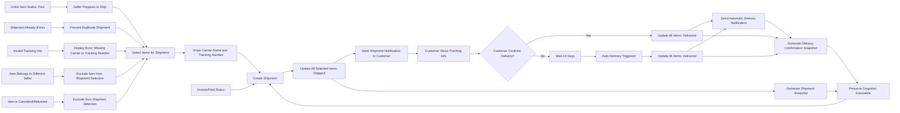

# Shipping and Tracking

## Shipment Creation

### Shipment Definition
WHEN a seller processes one or more order items with "paid" status, THE system SHALL create a shipment.

### Seller-Specific Shipment
WHILE an order contains items from multiple sellers, THE system SHALL create separate shipments for each seller.

### Item Bundling
WHEN a seller selects order items to ship, THE system SHALL allow bundling of multiple items into one shipment.

### Single Shipment per Batch
WHILE a seller is creating a shipment, THE system SHALL require all selected items to belong to the same seller.

## Tracking Information

### Tracking Data Requirements
WHEN a shipment is created, THE system SHALL require the seller to provide:
- Carrier name (required)
- Tracking number (required)

### Tracking Information Assignment
WHEN a shipment is created, THE system SHALL assign the same tracking information to ALL items within that shipment.

### Tracking Information Preservation
WHILE a shipment exists, THE system SHALL preserve the tracking information as an immutable snapshot.

### Tracking Information Modification
IF a seller attempts to modify tracking information for a shipment that has already been created, THEN THE system SHALL disallow modification and require creation of a new shipment.

## Delivery Confirmation

### Manual Delivery Confirmation
WHEN a customer receives a shipment, THE system SHALL allow the customer to confirm delivery for that shipment.

### Delivery Confirmation Scope
WHILE a shipment contains multiple order items, THE system SHALL treat delivery confirmation as applying to ALL items within the shipment.

### Delivery Confirmation Process
WHEN a customer confirms delivery of a shipment, THE system SHALL:
- Update the status of ALL items in that shipment to "delivered"
- Record a timestamp of the customer's confirmation
- Preserve a snapshot of the delivery confirmation event

## Auto-Delivery Rule

### Automatic Delivery Trigger
WHILE a shipment has been marked as "shipped" for 14 consecutive days AND no customer delivery confirmation has been recorded, THEN THE system SHALL automatically update the status of ALL items in that shipment to "delivered".

### Notification Requirement
WHEN the auto-delivery rule triggers, THE system SHALL:
- Log the automatic status change in the order history
- Preserve a snapshot of the automatic delivery event
- Send a notification to the customer informing them that delivery was automatically confirmed

### Delivery Status Override
IF a customer confirms delivery after the auto-delivery has triggered, THEN THE system SHALL preserve both the auto-delivery and manual confirmation events in immutable snapshots.

## Shipment-Item Relationship

### One-to-Many Shipment-Item Link
WHEN a shipment is created, THE system SHALL create a direct relationship where one shipment can contain multiple order items, but each order item belongs to exactly one shipment.

### Shipment-Item Association Integrity
WHILE a delivery status of an order item is being updated, THE system SHALL ensure the update applies ONLY to items within the associated shipment.

### Shipment Uniqueness
WHERE an order item is already associated with a shipment, THE system SHALL prevent it from being assigned to another shipment.

### Shipment Deletion Constraint
IF an order item is part of an existing shipment, THEN THE system SHALL prevent deletion of that shipment.

### Shipment Queryability
THE system SHALL enable queries to retrieve all order items associated with a specific shipment ID.

## Snapshot Principle Application

### Shipment Snapshot Trigger
WHEN shipping details are added to a shipment, THE system SHALL create a snapshot of:
- The carrier name
- The tracking number
- The timestamp of shipment creation
- The list of order items included
- The seller ID

### Shipment Snapshot Immutability
WHILE any shipment snapshot exists, THE system SHALL prevent deletion, modification, or alteration of its content.

### Shipment Snapshot Access
WHERE a customer, seller, or administrator needs to verify shipping details, THE system SHALL allow viewing of shipment snapshots.

### Shipment Snapshot Preservation
THE system SHALL preserve all shipment snapshots for as long as the associated order exists, regardless of subsequent transactions or account deletions.

## Constraints Summary

### Seller-Centric Shipment Creation
THE system SHALL ensure that shipments are created only by sellers and only contain items from that seller's order items.

### Tracking Information Uniformity
THE system SHALL enforce that all order items within a single shipment share identical tracking information.

### Delivery Confirmation Per Shipment
THE system SHALL treat delivery confirmation as applicable to an entire shipment, not individual items.

### Auto-Delivery Timeframe
THE system SHALL implement a fixed 14-day window before triggering automatic delivery confirmation.

### Shipment-Item Association Durability
THE system SHALL maintain immutable associations between shipments and order items, even after order completion or account deletions.

## Integration with Other Systems

### Connection with Order Structure
THE system SHALL reference order items from the "10-order-structure.md" documentation, ensuring alignment with order item statuses and multi-seller order composition.

### Interaction with Checkout and Payment
THE system SHALL trigger shipment creation only after successful payment processing as defined in "09-checkout-and-payment.md".

### Dependency on Inventory Management
THE system SHALL ensure shipment creation only occurs for items that have been successfully reserved from inventory and are no longer available for other transactions.

### Support for Cancellation and Refunds
THE system SHALL prevent shipment creation for items that have been cancelled or refunded, per the exclusion criteria in "12-cancellation-and-refunds.md".

## User Experience Considerations

### Seller Shipment Interface
THE system SHALL display a clear interface requiring sellers to select items, enter tracking details, and confirm shipment creation before finalizing.

### Customer Tracking Visibility
THE system SHALL provide customers with an easy-to-view tracking status for each shipment in their order history, displaying carrier name and tracking number.

### Delivery Notification
THE system SHALL send clear notifications to customers when a shipment has been marked as "shipped" and when delivery is automatically confirmed after 14 days.

### Admin Oversight
THE system SHALL allow administrators to view all shipment records and tracking histories for dispute resolution and compliance purposes.

## Error Handling

### Missing Tracking Information
IF a seller attempts to create a shipment without providing carrier name or tracking number, THEN THE system SHALL display an error message and prevent shipment creation.

### Invalid Item Selection
IF a seller attempts to add order items to a shipment that belong to a different seller, THEN THE system SHALL exclude those items and display a warning message.

### Shipment Already Created
IF a seller attempts to create a shipment for order items that are already part of an existing shipment, THEN THE system SHALL display a notification that items are already shipped.

### Delivery Confirmation Timing
IF a customer attempts to confirm delivery of a shipment with an unknown status, THEN THE system SHALL disallow the action and display an error code SHIPMENT_INVALID_STATUS.

### Auto-Delivery Override Failure
IF the system fails to automatically update delivery status after 14 days, THEN THE system SHALL:
- Log the error with timestamp and shipment ID
- Notify system administrators
- Allow manual intervention by administrators to correct the status

## Business Rule Summary

1. Shipments are created by sellers, not customers
2. Each shipment contains only items from a single seller
3. All items in a shipment share one tracking number
4. Delivery is confirmed per shipment, not per item
5. Auto-delivery triggers after 14 days of shipping
6. Shipment data is preserved in immutable snapshots
7. Shipment status updates affect all items in the shipment simultaneously
8. Shipment creation is dependent on successful payment and inventory allocation
9. Shipment tracking information cannot be modified after creation
10. Shipment data remains accessible for audit and dispute resolution indefinitely

## Mermaid Diagram: Shipment and Tracking Flow

## Business Requirement Justification for Snapshot Preservation

WHEN a shipment is created with tracking information, THE system SHALL preserve an immutable snapshot of this information because:

- Shipment details are critical for dispute resolution between customers and sellers
- Tracking information may change during transit, but the original data must be preserved for legal and accounting purposes
- Refunds and chargebacks require verification of original shipping records
- Regulatory compliance mandates preservation of transactional evidence for audit trails
- Customer trust depends on reliable, unalterable shipping records
- Administrators require access to historical shipment data for oversight and platform integrity

THE system SHALL maintain these snapshots even if:
- The seller account is deleted
- The customer account is deleted
- The product is deleted
- The order is completed

WHERE a dispute arises regarding delivery status or shipping details, THE system SHALL provide access to the original shipment snapshot to all authorized parties.

## Shipment Status Matrix

| Status | Description | Triggered By | Immutable? | Affecting Items |
|--------|-------------|--------------|------------|----------------|
| Paid | Payment processed, awaiting shipment | Payment success | ✅ | Order items |
| Shipped | Shipment created and tracking provided | Seller creates shipment | ✅ | All items in shipment |
| Delivered | Customer confirmed delivery or auto-delivery triggered | Customer confirmation or 14-day timer | ✅ | All items in shipment |
| Canceled | Order item canceled before shipping | Seller approves cancellation | ✅ | Individual item |
| Refunded | Item refunded after delivery | Seller approves refund | ✅ | Individual item |

## Critical Action Boundaries

### Seller Action: Shipment Creation
WHEN a seller initiates shipment creation, THE system SHALL only permit selection of items with status "paid" and NOT associated with any existing shipment.

### Customer Action: Delivery Confirmation
WHERE an order item has status "shipped", THE system SHALL only allow delivery confirmation if the item is part of a shipment with valid tracking information.

### Auto-Delivery Trigger
WHILE a shipment has status "shipped" for 14 consecutive days without delivery confirmation, THE system SHALL automatically trigger delivery status update only for items that have not been refunded or canceled.

## Future-Proofing for Additional Features

WHEN additional shipping features are introduced (e.g., international shipping, customs documentation, signature requirements), THE system SHALL:

- Extend snapshot records to preserve additional metadata
- Maintain backward compatibility with existing Shipment and Tracking workflows
- Ensure that core principles of seller-specific shipments and immutable tracking snapshots are preserved

THE system SHALL not alter the fundamental relationship that one shipment = one seller = one tracking number = multiple items.

> *Developer Note: This document defines **business requirements only**. All technical implementations (architecture, APIs, database design, etc.) are at the discretion of the development team.*
