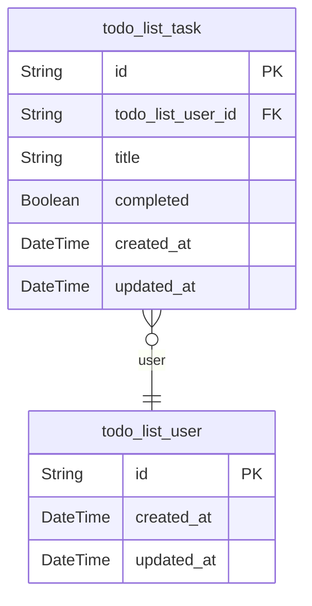

# Prisma Markdown

> Generated by [`prisma-markdown`](https://github.com/samchon/prisma-markdown)

- [Systematic](#systematic)

## Systematic

### `todo_list_user`

Primary user entity that owns all todo list tasks. This is a single-user
system where each user has a unique identifier but no authentication is
required. The system assumes the user is the person accessing the
application from their device.

Properties as follows:

- `id`: Primary Key.
- `created_at`: Timestamp when the user account was created.
- `updated_at`: Timestamp when the user account was last updated.

### `todo_list_task`

Task entity representing individual items in the todo list. Each task
belongs to a single user and has a title, completion status, and creation
timestamp.

Properties as follows:

- `id`: Primary Key.
- `todo_list_user_id`: Belongs to the user who owns this task. [todo_list_user.id](#todo_list_user).
- `title`: The text content of the task. Limited to 500 characters.
- `completed`: Whether the task has been marked as completed. Default value is false.
- `created_at`: Timestamp when the task was created.
- `updated_at`: Timestamp when the task was last updated.
