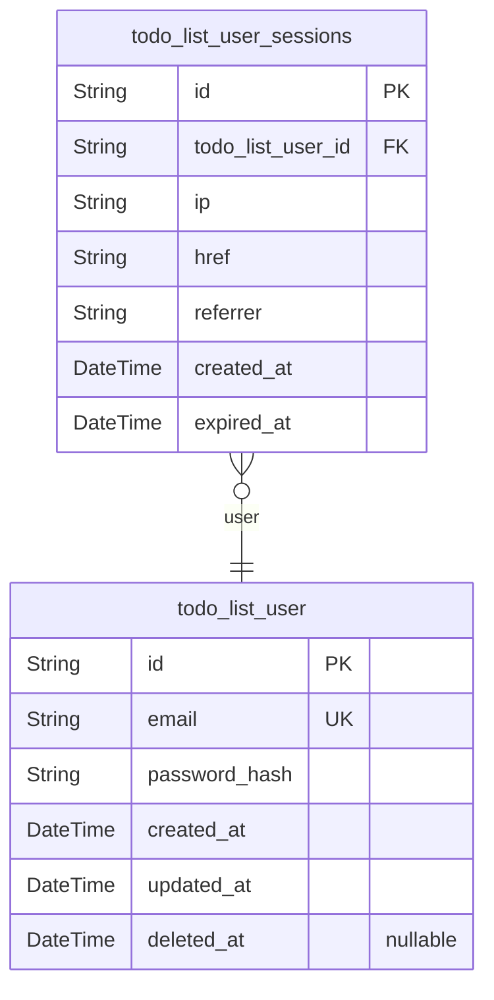
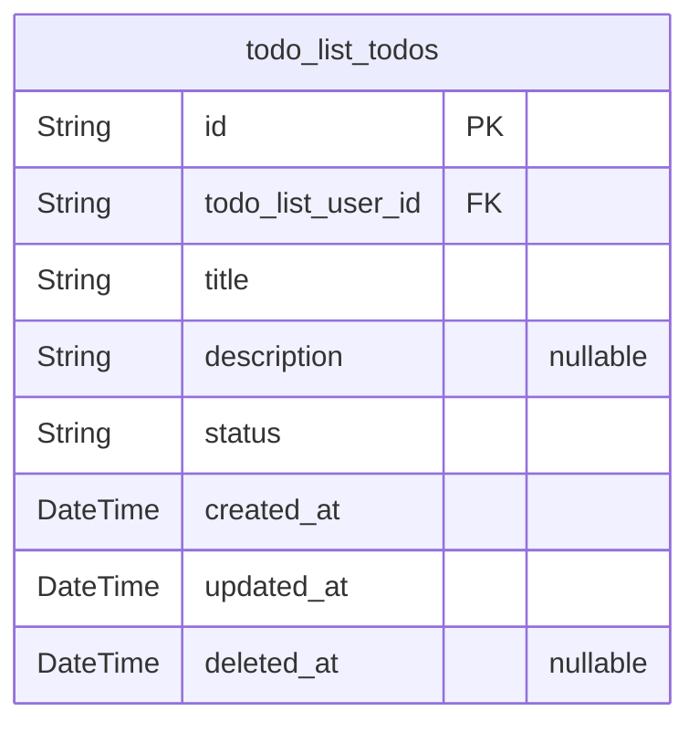

# Prisma Markdown

> Generated by [`prisma-markdown`](https://github.com/samchon/prisma-markdown)

- [Actors](#actors)
- [Todos](#todos)

## Actors

```mermaid
erDiagram
"todo_list_user" {
  String id PK
  String email UK
  String password_hash
  DateTime created_at
  DateTime updated_at
  DateTime deleted_at "nullable"
}
"todo_list_user_sessions" {
  String id PK
  String todo_list_user_id FK
  String ip
  String href
  String referrer
  DateTime created_at
  DateTime expired_at
}
"todo_list_user_sessions" }o--|| "todo_list_user" : user
```

### `todo_list_user`

Stores identity and authentication credentials for individual users who
create and manage their own todo items.

This table contains the foundational authentication data for users of the
Todo List application. Each record represents a unique authenticated user
who can create, view, update, and delete their own todo items. The table
stores essential authentication information including email address and
securely hashed password, along with standard temporal tracking for audit
and account management purposes.

Email addresses must be unique to prevent duplicate account creation.
Passwords are never stored in plain text - only their cryptographic hash
is persisted. Soft delete functionality allows for account deactivation
while preserving audit trails.

Properties as follows:

- `id`: Primary Key.
- `email`
  > User's unique email address used for authentication and communication.
  > Must be unique across all users.
- `password_hash`
  > Cryptographic hash of the user's password. Never stores plain text
  > passwords for security reasons.
- `created_at`: Timestamp when the user account was created.
- `updated_at`: Timestamp of the last update to the user account's information.
- `deleted_at`
  > Timestamp when the user account was logically deleted (soft delete). If
  > null, the account is active.

### `todo_list_user_sessions`

Manages authentication sessions for todo_list_user accounts, tracking
active login states with JWT token metadata.

Each session represents a user's authenticated connection to the system,
identified by an IP address and connection context. Sessions are tightly
associated with a specific user account and are automatically managed by
the authentication system.

Sessions automatically expire after a set time period for security
purposes. They are used for audit trails, identifying active user
sessions, and ensuring no unauthorized concurrent access.

This table does not store actual tokens or sensitive credential data -
only connection metadata and temporal information.

Properties as follows:

- `id`: Primary Key.
- `todo_list_user_id`: User account's [todo_list_user.id](#todo_list_user).
- `ip`: IP address from which the session was initiated.
- `href`: URL to which the user connected to initiate this session.
- `referrer`: Referrer URL indicating where the user came from before connecting.
- `created_at`: Timestamp when the session was created.
- `expired_at`
  > Timestamp when this session expires. Sessions must have expiration for
  > security. Default state is NOT NULL.

## Todos

```mermaid
erDiagram
"todo_list_todos" {
  String id PK
  String todo_list_user_id FK
  String title
  String description "nullable"
  String status
  DateTime created_at
  DateTime updated_at
  DateTime deleted_at "nullable"
}
```

### `todo_list_todos`

Individual task items for personal task management.

Stores user-specific to-do items with titles, descriptions, and status
tracking. Each todo item is owned by exactly one authenticated user and
represents a discrete task to be completed. Users can create, read,
update, and delete their own todo items independently.

The status field tracks the workflow state of each task (todo,
in-progress, done). Soft deletion is supported to maintain audit trails
while allowing content moderation. The system supports full-text search
on titles and descriptions for efficient task discovery.

Properties as follows:

- `id`: Primary Key.
- `todo_list_user_id`: Owner of this todo item. [todo_list_user.id](#todo_list_user).
- `title`
  > Brief title of the todo item. Must contain meaningful content describing
  > the task to be performed.
- `description`
  > Detailed description of the todo item. Provides context, instructions, or
  > additional details about the task. May be left empty for simple tasks.
- `status`
  > Current workflow status of the todo item. Valid values: 'todo',
  > 'in-progress', 'done'. Status transitions follow business workflow rules.
- `created_at`
  > Timestamp when this todo item was originally created. Records when the
  > user first added the task to their list.
- `updated_at`
  > Timestamp when this todo item was last modified. Updated whenever the
  > title, description, or status changes.
- `deleted_at`
  > Timestamp when this todo item was soft-deleted. If null, the item is
  > active. If set, the item is considered deleted but preserved for audit
  > purposes.
