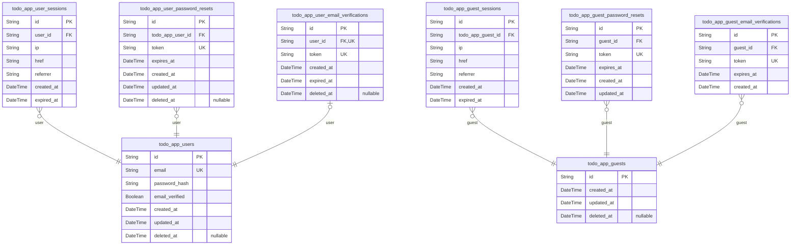
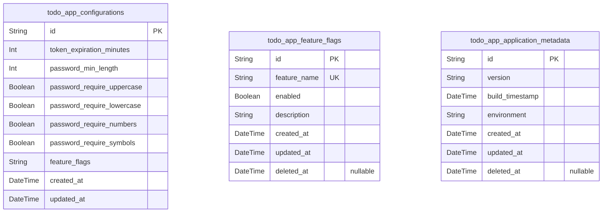
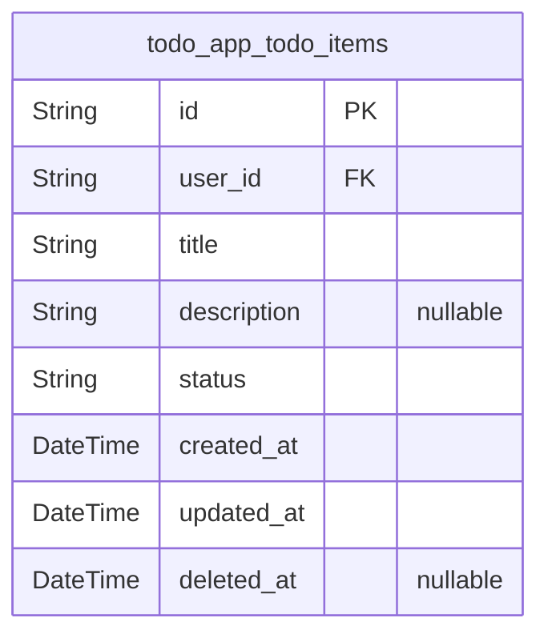

# Prisma Markdown

> Generated by [`prisma-markdown`](https://github.com/samchon/prisma-markdown)

- [Actors](#actors)
- [Systematic](#systematic)
- [Todo](#todo)

## Actors

```mermaid
erDiagram
"todo_app_users" {
  String id PK
  String email UK
  String password_hash
  Boolean email_verified
  DateTime created_at
  DateTime updated_at
  DateTime deleted_at "nullable"
}
"todo_app_user_sessions" {
  String id PK
  String user_id FK
  String ip
  String href
  String referrer
  DateTime created_at
  DateTime expired_at
}
"todo_app_user_password_resets" {
  String id PK
  String todo_app_user_id FK
  String token UK
  DateTime expires_at
  DateTime created_at
  DateTime updated_at
  DateTime deleted_at "nullable"
}
"todo_app_user_email_verifications" {
  String id PK
  String user_id FK,UK
  String token UK
  DateTime created_at
  DateTime expired_at
  DateTime deleted_at "nullable"
}
"todo_app_guests" {
  String id PK
  DateTime created_at
  DateTime updated_at
  DateTime deleted_at "nullable"
}
"todo_app_guest_sessions" {
  String id PK
  String todo_app_guest_id FK
  String ip
  String href
  String referrer
  DateTime created_at
  DateTime expired_at
}
"todo_app_guest_password_resets" {
  String id PK
  String guest_id FK
  String token UK
  DateTime expires_at
  DateTime created_at
  DateTime updated_at
}
"todo_app_guest_email_verifications" {
  String id PK
  String guest_id FK
  String token UK
  DateTime expires_at
  DateTime created_at
}
"todo_app_user_sessions" }o--|| "todo_app_users" : user
"todo_app_user_password_resets" }o--|| "todo_app_users" : user
"todo_app_user_email_verifications" |o--|| "todo_app_users" : user
"todo_app_guest_sessions" }o--|| "todo_app_guests" : guest
"todo_app_guest_password_resets" }o--|| "todo_app_guests" : guest
"todo_app_guest_email_verifications" }o--|| "todo_app_guests" : guest
```

### `todo_app_users`

Registered user accounts with email/password authentication credentials,
email verification status, and account security settings.

Stores identity information for authenticated individual users who can
create, read, update, and delete their own todo items. Each user has
exclusive ownership of their data with no access to other users'
information.

This actor table serves as the canonical identity record for the user
type in the system, with related session, password reset, and email
verification tables managing authentication workflows. The primary key is
a UUID for distributed system compatibility and security.

Users must verify their email address before their account becomes fully
active, and they can reset their password through a secure time-limited
email link.

Properties as follows:

- `id`: Primary Key.
- `email`
  > User's unique email address used for authentication and communication.
  > Must be unique across all users and follow standard email format.
- `password_hash`
  > Securely hashed password for authentication. Never stored in plain text.
  > Generated using bcrypt or equivalent secure algorithm.
- `email_verified`
  > Indicates whether the user has verified their email address. Initially
  > false upon registration; set to true after successful email verification
  > through the token system.
- `created_at`
  > Timestamp when the user account was created. Cannot be modified after
  > account creation.
- `updated_at`
  > Timestamp of the last update to the user account. Updated whenever the
  > user modifies any account details.
- `deleted_at`
  > Timestamp when the user account was soft-deleted. If null, the account is
  > active. Used to preserve data integrity while allowing account removal.

### `todo_app_user_sessions`

JWT session tokens for user authentication stored in httpOnly cookies,
with access token expiration set to 15 minutes.

Tracks the login sessions for authenticated users. Each session
represents a single device/browser login with precise connection context.

Sessions are append-only audit records - never modified or deleted. The
system automatically expires sessions after 15 minutes of inactivity (as
specified).

This table is managed exclusively by the authentication system during
login/logout flows, not through direct user interaction.

Does not store token contents, password hashes, or user credentials -
only connection metadata and lifecycle timestamps.

Properties as follows:

- `id`: Primary Key.
- `user_id`: The user's [todo_app_users.id](#todo_app_users) who owns this session.
- `ip`: Client's IP address from which the session was established.
- `href`: The URL from which the user initiated the login session.
- `referrer`: The previous web page from which the user navigated to this application.
- `created_at`: Timestamp when this session was created and authenticated.
- `expired_at`
  > Timestamp when this session will expire automatically. Fixed at 15
  > minutes after created_at as per specification. Sessions are invalidated
  > upon expiration and cannot be refreshed.

### `todo_app_user_password_resets`

Password reset tokens with 1-hour expiration for secure password recovery
workflow, invalidated after use.

Each password reset request generates a unique token that the user
receives via email. The token is valid for exactly 60 minutes and can
only be used once. After successful password reset, the token is
immediately and permanently deleted from the system. The system
automatically purges expired tokens during maintenance windows.

Tokens provide a secure alternative to password transmission, ensuring
that only users with access to the registered email can reset their
passwords. This mechanism complies with security best practices for
authentication workflows.

Properties as follows:

- `id`: Primary Key.
- `todo_app_user_id`: The user who requested the password reset. [todo_app_users.id](#todo_app_users).
- `token`
  > Unique random string token generated for password reset. This token is
  > sent to the user via email and must be presented to complete the reset
  > process. Tokens are 64-character alphanumeric strings.
- `expires_at`
  > Expiration timestamp for this password reset token. Tokens are valid for
  > exactly 60 minutes from creation time. After expiration, the token cannot
  > be used for password reset.
- `created_at`
  > Timestamp when this password reset request was generated. This is used
  > for expiration calculations and audit trail.
- `updated_at`
  > Timestamp when this record was last updated. Usually when the token was
  > used and before deletion.
- `deleted_at`
  > Soft delete timestamp to maintain audit trail while allowing temporary
  > data purging. Set to the timestamp when the token is successfully used
  > and deleted from the system.

### `todo_app_user_email_verifications`

Temporary email verification tokens issued to newly registered users
requiring confirmation of their email address.

System-generated records that enable users to complete account
registration by verifying their email ownership through a secure,
time-limited token link. Each token is uniquely associated with one user
account and becomes invalid after expiration or successful verification.

The system automatically generates these tokens during user registration
and sends them via email. After successful verification, the token is
marked as deleted. Tokens have a fixed 2-hour expiration period for
security.

These records are managed entirely by the authentication system - users
cannot create, update, or delete them directly. They are automatically
purged after expiration or verification.

Properties as follows:

- `id`: Primary Key.
- `user_id`: The user account this verification belongs to. [todo_app_users.id](#todo_app_users).
- `token`
  > Unique random token generated for email verification. This is the key
  > component of the verification URL sent to the user's email address.
- `created_at`
  > Timestamp when this verification record was created. This marks the
  > beginning of the 2-hour expiration window.
- `expired_at`
  > Timestamp when this verification token expires. After this time, the
  > token is no longer valid for verification. Fixed 2-hour expiration period
  > as required by security policy.
- `deleted_at`
  > Timestamp when this verification record was deleted (invalidated). This
  > occurs when the verification is successfully completed, or when the
  > record is manually cleared. NULL indicates the record is still active.

### `todo_app_guests`

Temporary guest accounts for unauthenticated users identified by device
or browser fingerprint.

Represents transient users who interact with the system without
authentication. Each guest is uniquely identified by a device or browser
fingerprint, allowing the system to maintain session continuity during a
single browsing session.

Guest accounts are temporary, automatically expire after a configurable
period of inactivity, and have no access to personal data. They cannot
create, read, or modify any business data like todo items. Their primary
purpose is to enable anonymous interaction with public-facing features
before account registration.

The system uses these tables to track guest usage patterns, monitor
system load from anonymous users, and facilitate seamless transitions to
authenticated user accounts.

Properties as follows:

- `id`: Primary Key.
- `created_at`
  > Timestamp when this guest account was first created based on device
  > fingerprint detection.
- `updated_at`
  > Timestamp of the most recent activity from this guest. Updated with each
  > interaction.
- `deleted_at`
  > Timestamp when this guest account was removed from the system. NULL
  > indicates active guest account.

### `todo_app_guest_sessions`

Temporary session tokens for guest access with limited lifetime that
expire after 60 minutes.

Tracks authentication sessions for unauthenticated users identified by
device or browser fingerprint. Each session is uniquely tied to a guest
account and terminates automatically after 60 minutes.

Stores connection metadata including IP address, connection URL, and
referrer URL for security auditing and abuse detection. Sessions are
append-only records that cannot be modified once created.

The expiration time is hardcoded to 60 minutes by system policy -
sessions cannot be extended or remain active indefinitely for security
reasons.

Properties as follows:

- `id`: Primary Key.
- `todo_app_guest_id`: The guest account this session belongs to. [todo_app_guests.id](#todo_app_guests).
- `ip`: Client IP address from which the session was established.
- `href`: The URL of the page that initiated the session.
- `referrer`: The referrer URL that led to this session initiation.
- `created_at`: Timestamp when the session was created.
- `expired_at`
  > Timestamp when the session expires. Sessions are automatically terminated
  > after 60 minutes per security policy.

### `todo_app_guest_password_resets`

Password reset tokens for guest users to recover forgotten passwords.

Provides secure, time-limited password recovery mechanism for
unauthenticated guests. Each token is a unique cryptographic string that
allows a guest to reset their password after a successful email-based
verification flow.

Tokens are single-use and automatically invalidated upon successful
password reset. The system creates a new token for each reset request,
and expired tokens are purged automatically.

Each reset token is linked to a specific guest account via guest_id. The
password reset workflow requires the guest to be redirected through an
email verification link containing this token.

This table does not track password history or provide recovery options
beyond the token-based reset mechanism.

Properties as follows:

- `id`: Primary Key.
- `guest_id`
  > The guest account this password reset belongs to. {@link
  > todo_app_guests.id}.
- `token`
  > Unique cryptographic token for password reset validation. Must be a
  > 64-character random string generated by secure random algorithm.
- `expires_at`
  > Expiration timestamp for the password reset token. Must be set to 30-60
  > minutes after creation time as per system requirements for security.
- `created_at`
  > Timestamp when this password reset token was created and issued to the
  > guest.
- `updated_at`
  > Timestamp of the last update to this record. Updated when token is
  > consumed or invalidated.

### `todo_app_guest_email_verifications`

Email verification tokens for guest account activation during registration.

Stores temporary verification tokens sent to guest emails during
registration. Each token is unique and expires within 24 hours as
required by security policy. Used to confirm that the guest provided a
valid email address during account creation.

Tokens are single-use and automatically invalidated after use or
expiration. The system does not store the actual email address in this
table for security reasons, instead linking the token to the guest
account via the guest_id foreign key. Verification is completed through a
secure token-based workflow, and no manual updates or deletions are
performed on this table.

Properties as follows:

- `id`: Primary Key.
- `guest_id`
  > Reference to the guest account requiring email verification. {@link
  > todo_app_guests.id}.
- `token`
  > Cryptographically secure random token used for verification. Must be
  > unique. Generated at time of ticket creation and sent to guest email.
- `expires_at`
  > Expiration timestamp for the verification token. Set to 24 hours after
  > creation as required by security policy. Tokens are automatically
  > invalidated after this time.
- `created_at`
  > Timestamp when the email verification token was created. Mandatory for
  > audit trail and tracking token lifecycle.

## Systematic

```mermaid
erDiagram
"todo_app_configurations" {
  String id PK
  Int token_expiration_minutes
  Int password_min_length
  Boolean password_require_uppercase
  Boolean password_require_lowercase
  Boolean password_require_numbers
  Boolean password_require_symbols
  String feature_flags
  DateTime created_at
  DateTime updated_at
}
"todo_app_feature_flags" {
  String id PK
  String feature_name UK
  Boolean enabled
  String description
  DateTime created_at
  DateTime updated_at
  DateTime deleted_at "nullable"
}
"todo_app_application_metadata" {
  String id PK
  String version
  DateTime build_timestamp
  String environment
  DateTime created_at
  DateTime updated_at
  DateTime deleted_at "nullable"
}
```

### `todo_app_configurations`

Global system configuration settings such as token expiration duration,
password complexity rules, and feature flags.

Stores application-wide configuration parameters that control system
behavior without requiring code deployment. These settings are loaded at
application startup and may be dynamically updated via administrative
interfaces. All configuration values are stored as strings for maximum
flexibility in handling different data types (numbers, booleans, JSON
objects) via serialization.

Properties as follows:

- `id`: Primary Key.
- `token_expiration_minutes`
  > Duration in minutes that JWT access tokens remain valid before requiring
  > refresh. Default value is typically 15 minutes for security.
- `password_min_length`
  > Minimum number of characters required for user passwords. Enforces basic
  > password strength requirements to improve account security.
- `password_require_uppercase`
  > Whether passwords must contain at least one uppercase letter. Part of the
  > password complexity policy to enhance security.
- `password_require_lowercase`
  > Whether passwords must contain at least one lowercase letter. Part of the
  > password complexity policy to enhance security.
- `password_require_numbers`
  > Whether passwords must contain at least one numeric digit. Part of the
  > password complexity policy to enhance security.
- `password_require_symbols`
  > Whether passwords must contain at least one special symbol. Part of the
  > password complexity policy to enhance security.
- `feature_flags`
  > JSON-encoded string containing key-value pairs for toggleable application
  > features. Each key represents a feature name and value is a boolean
  > indicating enabled/disabled status.
- `created_at`
  > Timestamp when this configuration record was created. Used for auditing
  > and change tracking of system settings.
- `updated_at`
  > Timestamp when this configuration record was last modified. Used to
  > identify when system settings changed and for cache invalidation.

### `todo_app_feature_flags`

Toggleable application features that can be enabled or disabled at
runtime without deployment.

Provides system-wide control over application functionality by allowing
administrators to activate or deactivate features dynamically. Each
feature is uniquely identified by name and can be toggled between enabled
and disabled states. This enables safe experimentation, staged rollouts,
and emergency feature disabling without code deployments.

The description field provides context about the feature's purpose and
impact, helping administrators make informed decisions. Feature flags are
critical for continuous delivery practices and risk mitigation in
production environments.

Properties as follows:

- `id`: Primary Key.
- `feature_name`
  > Unique identifier for the feature flag. Should be descriptive and follow
  > naming convention (e.g., "new_checkout_flow", "dark_mode").
- `enabled`
  > Current state of the feature flag. True indicates the feature is active
  > and available. False indicates the feature is disabled.
- `description`
  > Detailed description of the feature's purpose, expected impact, and any
  > known considerations. Used by administrators to understand the feature
  > before enabling.
- `created_at`: Timestamp when the feature flag was created in the system.
- `updated_at`
  > Timestamp when the feature flag was last modified (enabled/disabled
  > status changed or description updated).
- `deleted_at`
  > Timestamp when the feature flag was logically deleted. NULL indicates the
  > flag is still active. Used for audit trail and potential recovery.

### `todo_app_application_metadata`

Application metadata containing version, build timestamp, and environment
information for the todo_app system.

Tracks critical system configuration data including the current
application version, build timestamp when deployed, and runtime
environment (development, staging, production). This metadata is used for
system diagnostics, version validation, and environment-specific
configuration.

The table records immutable system state information that is updated
during deployment processes. It is not directly user-managed but is
essential for system integrity and monitoring.

Properties as follows:

- `id`: Primary Key.
- `version`
  > Current application semantic version number in format MAJOR.MINOR.PATCH
  > (e.g., 1.2.3).
- `build_timestamp`
  > Timestamp of when this version of the application was built and deployed
  > to the current environment.
- `environment`
  > Current runtime environment of the application. Valid values:
  > development, staging, production.
- `created_at`: Timestamp when this metadata record was initially created in the database.
- `updated_at`: Timestamp when this metadata record was last updated.
- `deleted_at`
  > Timestamp when this metadata record was soft-deleted. Null indicates
  > active record.

## Todo

```mermaid
erDiagram
"todo_app_todo_items" {
  String id PK
  String user_id FK
  String title
  String description "nullable"
  String status
  DateTime created_at
  DateTime updated_at
  DateTime deleted_at "nullable"
}
```

### `todo_app_todo_items`

Personal task items owned exclusively by a single user. Each todo
represents a discrete unit of work that can be tracked to completion.

Stores individual todo items with strict ownership by a single user. Each
item has a unique ID, title, description, status
(pending/completed/archived), and timestamps for creation and updates.
The userId field links to the authentication agent's user table, ensuring
complete data isolation. Todo items are not shared between users and can
only be accessed, modified, or deleted by their owner.

This is the primary business entity of the Todo application, supporting
full CRUD operations with independent filtering and searching
capabilities.

Properties as follows:

- `id`: Primary Key.
- `user_id`: Owner of this todo item. [todo_app_users.id](#todo_app_users).
- `title`: Brief title for the todo item, maximum 255 characters.
- `description`
  > Detailed description of the todo item, maximum 10,000 characters.
  > Optional field for additional context.
- `status`
  > Current status of the todo item. Valid values: pending, completed,
  > archived.
- `created_at`: Timestamp when this todo item was created.
- `updated_at`: Timestamp of the last modification to this todo item.
- `deleted_at`
  > Timestamp when this todo item was logically deleted (soft delete). NULL
  > indicates active item.
