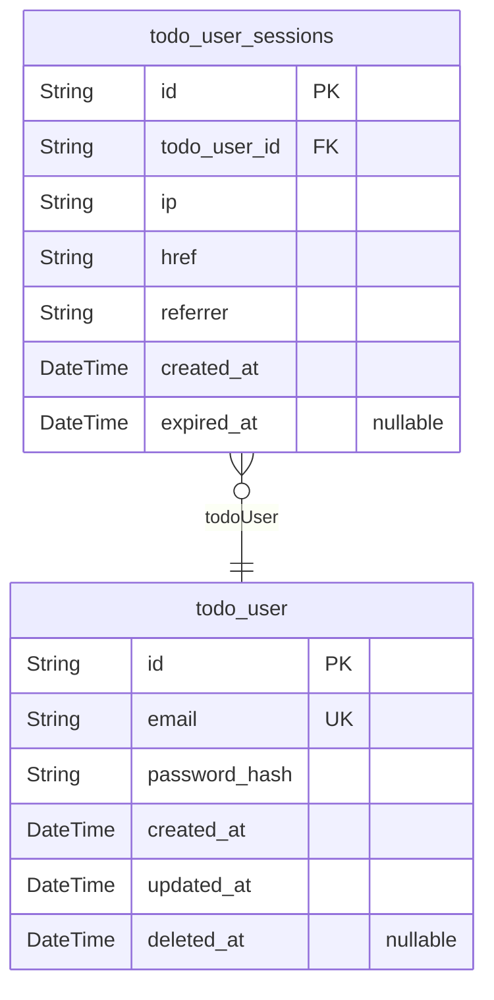
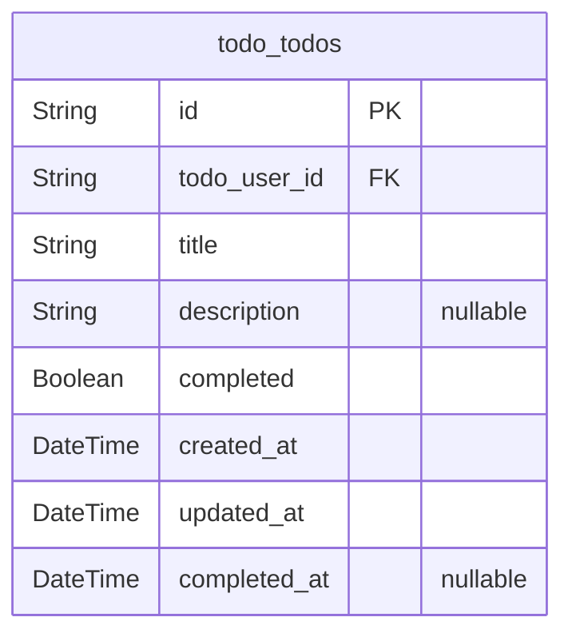

# Prisma Markdown

> Generated by [`prisma-markdown`](https://github.com/samchon/prisma-markdown)

- [Actors](#actors)
- [Todos](#todos)

## Actors

```mermaid
erDiagram
"todo_user" {
  String id PK
  String email UK
  String password_hash
  DateTime created_at
  DateTime updated_at
  DateTime deleted_at "nullable"
}
"todo_user_sessions" {
  String id PK
  String todo_user_id FK
  String ip
  String href
  String referrer
  DateTime created_at
  DateTime expired_at "nullable"
}
"todo_user_sessions" }o--|| "todo_user" : todoUser
```

### `todo_user`

User accounts for the Todo List Application.

Each record represents a registered individual who can authenticate with
the system and manage their own personal todos. Users are identified by a
unique email address and secure password hash. All authentication,
ownership, and permission enforcement is anchored to this identity. This
table supports soft deletion for right-to-be-forgotten compliance,
ensuring accounts may be flagged for removal before permanent erasure.

No additional roles, profiles, or social features are present. The model
is designed for maximum data privacy, security, and strict one-to-one
association with todos. All business rules for user isolation and account
uniqueness are enforced here.

Properties as follows:

- `id`: Primary key.
- `email`
  > Unique email address for authentication and account recovery. Must be
  > unique across all users and adhere to standard email formatting.
- `password_hash`
  > Secure hash of the user's password. Stored using strong cryptographic
  > practices. Never stores raw passwords.
- `created_at`: Timestamp when the account was created. Immutable.
- `updated_at`
  > Timestamp of the last modification to the user record, including password
  > or email changes.
- `deleted_at`
  > Timestamp marking the account as soft-deleted, used to comply with GDPR
  > and right-to-be-forgotten policies. Null if active.

### `todo_user_sessions`

Authentication sessions for each user account.

Each record logs an authenticated session—such as a login—created by a
specific todo_user. Sessions are used to issue JWT tokens and trace
account activity for audit and security. The table supports tracking
granular user activity over time, including login context. A session is
always related to one user, and is never shared.

Includes required context fields for tracing connection origin and
temporal window. Soft session expiry is managed via the expired_at field.
Sessions are subsidiary—business operations always flow through accounts.

Properties as follows:

- `id`: Primary key.
- `todo_user_id`: Reference to the owning user account. [todo_user.id](#todo_user).
- `ip`: IP address from which the session was established, for audit logging.
- `href`
  > Connection URL at the moment the session was established. Used for
  > security context.
- `referrer`
  > Referrer URL when initiating the session. Provides context for session
  > tracking and security.
- `created_at`: Time the session was created. Marks session start.
- `expired_at`
  > Time when the session expired or was invalidated. Null if session remains
  > active.

## Todos

```mermaid
erDiagram
"todo_todos" {
  String id PK
  String todo_user_id FK
  String title
  String description "nullable"
  Boolean completed
  DateTime created_at
  DateTime updated_at
  DateTime completed_at "nullable"
}
```

### `todo_todos`

Core business entity representing a single todo task owned and managed by
a registered user.

Each record is a discrete, user-owned personal task, containing the
minimum information required for the application's essential workflow.
The table links each task to its owning user, guaranteeing strict
single-user isolation and data privacy. Every todo includes a required
title, optional description, a boolean state representing completion, and
associated timestamps for creation, updates, and completion actions.
Titles are unique per user, preventing accidental duplicate todo entries.
Updates and state changes are fully captured by timestamps; deletion is
permanent, with no soft-delete or archiving—fully aligned to privacy and
GDPR requirements. No sharing, group collaboration, or tags/categories
are permitted. Ownership, access, and data lifecycle enforcement are
managed exclusively through this model's relation to the user table,
ensuring all business and security rules are implemented at the
persistence level.

Properties as follows:

- `id`: Primary Key. Unique identifier for each todo item.
- `todo_user_id`
  > Reference to the owning user of this todo. Enforces strict single-user
  > data partition and access. [todo_user.id](#todo_user).
- `title`
  > Short, descriptive title for the todo item. Required on creation; must
  > not be blank or exceed 255 characters. Must be unique for the user.
  > Business rules prohibit empty, duplicate, or whitespace-only values.
- `description`
  > Detailed notes or additional context for the todo item. Optional; can be
  > null. Maximum length 1000 characters. Not shown in lists by default.
- `completed`
  > Boolean status indicating whether the task is complete. Defaults to false
  > on create. Can be toggled by user at any time.
- `created_at`
  > Timestamp indicating when the todo was created. Immutable after
  > insertion. Set automatically.
- `updated_at`
  > Timestamp when the todo was last updated. Modified on every edit or
  > status change.
- `completed_at`
  > Timestamp of completion. Set when a todo is marked as completed, cleared
  > on revert to incomplete. Null if the task is not completed.
