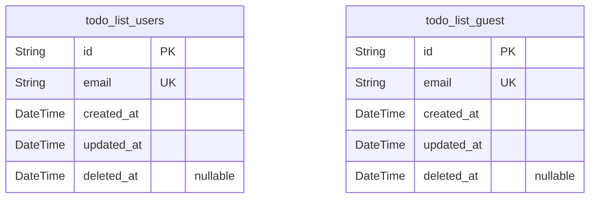
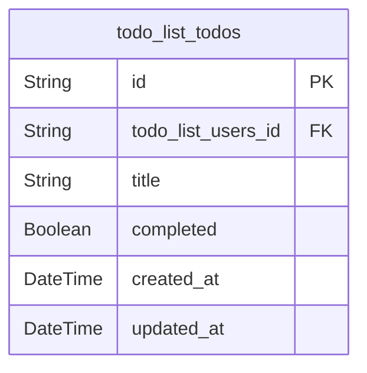

# Prisma Markdown

> Generated by [`prisma-markdown`](https://github.com/samchon/prisma-markdown)

- [Systematic](#systematic)
- [TodoList](#todolist)

## Systematic

```mermaid
erDiagram
"todo_list_users" {
  String id PK
  String email UK
  DateTime created_at
  DateTime updated_at
  DateTime deleted_at "nullable"
}
"todo_list_guest" {
  String id PK
  String email UK
  DateTime created_at
  DateTime updated_at
  DateTime deleted_at "nullable"
}
```

### `todo_list_users`

Represents an authenticated member who can manage personal todo items.

This model defines the identity of users who have completed registration
and authentication. It stores the necessary attributes to uniquely
identify and authenticate a member, enabling them to create, view,
update, and delete their own todo items. This table is distinct from
todo_list_guest and represents the primary actor with full access to the
todo system.

Relationships: Each todo_list_users is the owner of zero or more
todo_list_todos via the userId foreign key.

Properties as follows:

- `id`: Primary Key.
- `email`
  > The unique email address used for authentication and identification. Must
  > be unique across all users.
- `created_at`: The timestamp when the user account was created.
- `updated_at`: The timestamp when the user account was last updated.
- `deleted_at`
  > The timestamp when the user account was logically deleted, marking it as
  > inactive. Null if account is still active.

### `todo_list_guest`

Represents an unauthenticated visitor who is initiating registration.

This model captures the identity of guests attempting to register for the
application. It ensures each registration attempt is tracked and prevents
duplicate registration by email. This table is essential for securely
capturing registration data before user account activation and is
distinct from todo_list_users, which represents fully authenticated
members.

Relationships: A todo_list_guest may later become a todo_list_users after
email verification. It may also be referenced by audit systems logging
registration attempts.

Properties as follows:

- `id`: Primary Key.
- `email`
  > The email address provided during guest registration. Used to send
  > verification email and prevent duplicate registrations.
- `created_at`: The timestamp when the guest registration attempt was initiated.
- `updated_at`
  > The timestamp when the guest record was last updated (e.g., verification
  > link resent).
- `deleted_at`
  > The timestamp when the guest registration attempt was canceled or
  > expired. Null if still active.

## TodoList

```mermaid
erDiagram
"todo_list_todos" {
  String id PK
  String todo_list_users_id FK
  String title
  Boolean completed
  DateTime created_at
  DateTime updated_at
}
```

### `todo_list_todos`

Personal task items owned by authenticated users.

Stores individual to-do items that users create to manage their personal
tasks. Each item is owned by exactly one user and has a lifecycle
independent of other entities. Items can be marked as completed or remain
pending, with timestamps tracking creation and modification. This table
enforces strict data ownership - no user can access, modify, or delete
another user's todos.

Properties as follows:

- `id`: Primary Key.
- `todo_list_users_id`: Owner of this todo item. [todo_list_users.id](#todo_list_users).
- `title`
  > The title or description of the task. Must contain at least one
  > non-whitespace character and cannot exceed 200 characters.
- `completed`: Whether the task has been marked as completed. Default value is false.
- `created_at`
  > The timestamp when the todo item was created. Set to current server time
  > at creation and never modified.
- `updated_at`
  > The timestamp when the todo item was last updated (title changed or
  > status toggled). Updated on every modification.
