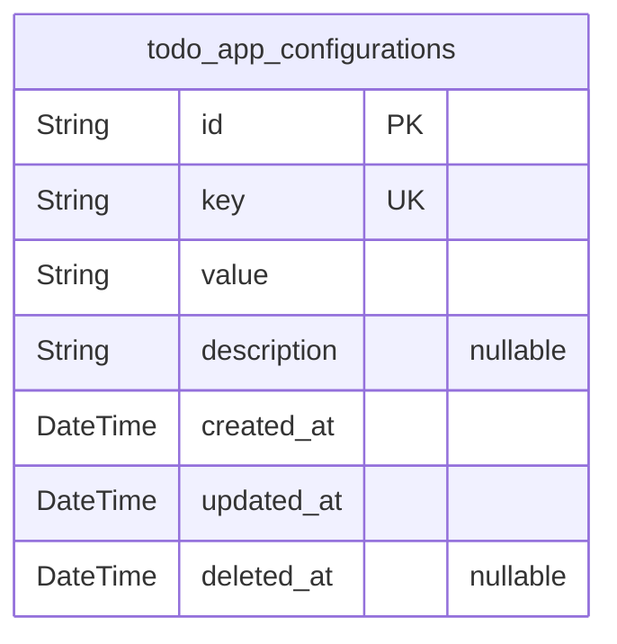
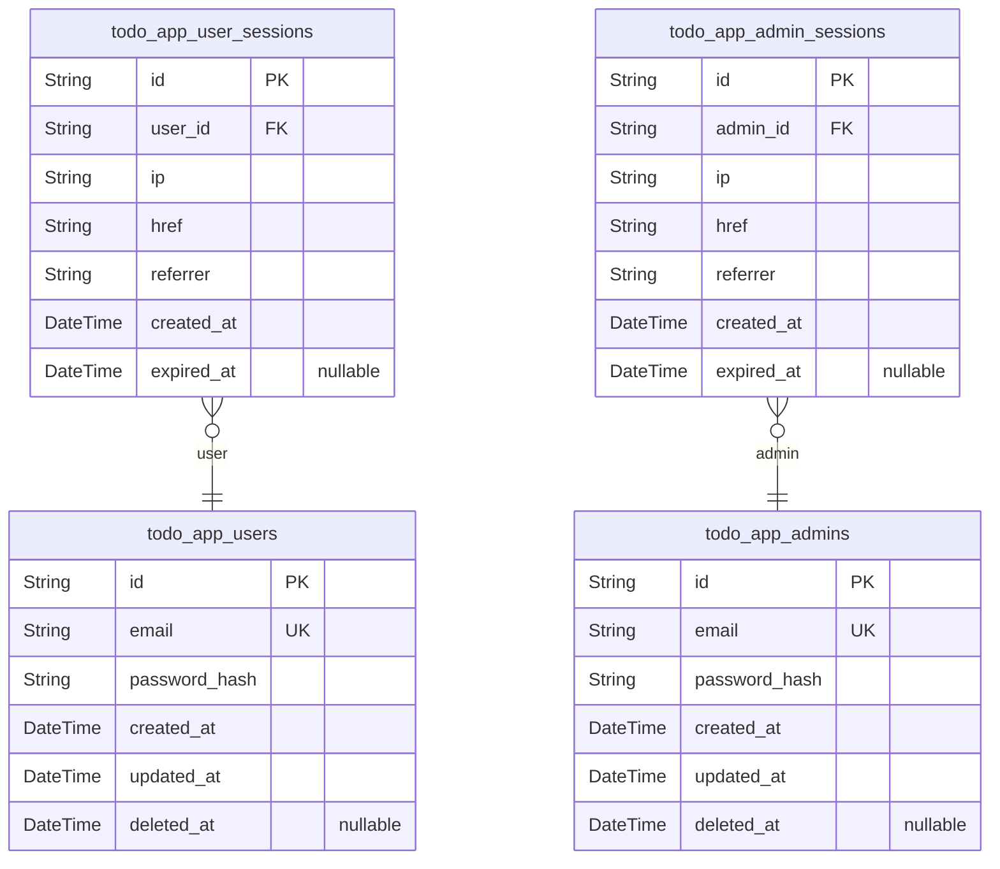
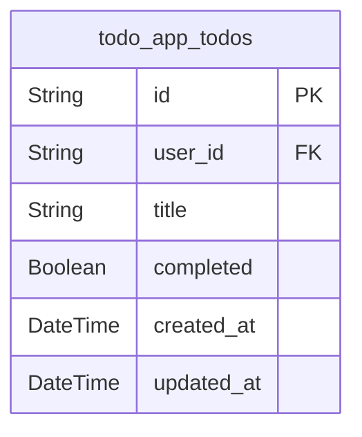
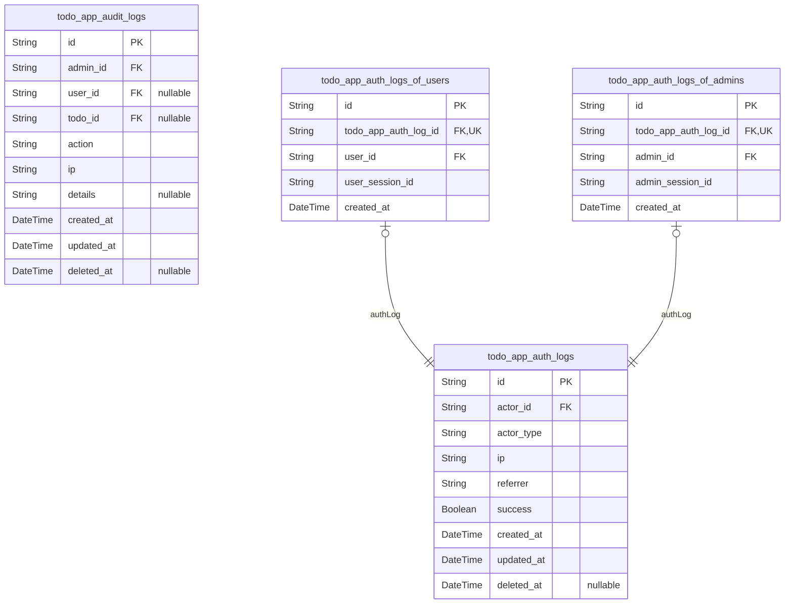
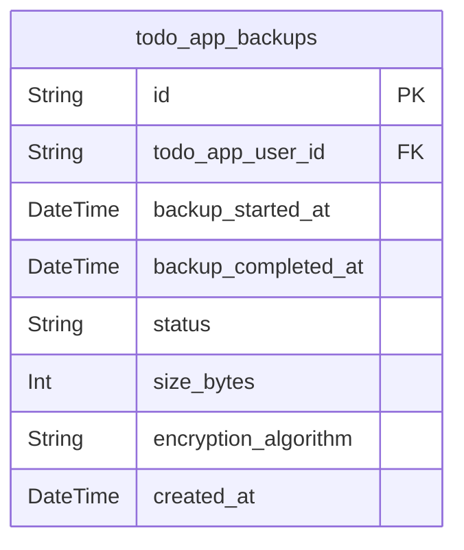

# Prisma Markdown

> Generated by [`prisma-markdown`](https://github.com/samchon/prisma-markdown)

- [Systematic](#systematic)
- [Actors](#actors)
- [Todo](#todo)
- [Audit](#audit)
- [Backup](#backup)

## Systematic

```mermaid
erDiagram
"todo_app_configurations" {
  String id PK
  String key UK
  String value
  String description "nullable"
  DateTime created_at
  DateTime updated_at
  DateTime deleted_at "nullable"
}
```

### `todo_app_configurations`

System-wide configuration settings that control operational behavior such
as session timeouts, encryption parameters, and feature flags. This table
is referenced by other components to retrieve runtime settings. Each
configuration is identified by a unique key and may include an optional
description for context. This is a subsidiary table managed through
system administration tools, not user-facing interfaces.

Properties as follows:

- `id`: Primary Key.
- `key`
  > Unique identifier for the configuration setting (e.g.,
  > 'session_timeout_minutes', 'encrypt_data_at_rest'). Required for lookup.
- `value`
  > The actual configuration value. Serialized as string (JSON, text, number
  > as string) to support any data type. Example: "30" for 30 minutes,
  > "{\"algorithm\": \"aes-256\"}" for complex settings.
- `description`
  > Human-readable description explaining the purpose, acceptable values, or
  > implications of this configuration. Used for documentation and support.
- `created_at`
  > Timestamp of when this configuration was first created. Required for
  > audit trails.
- `updated_at`
  > Timestamp of the last modification to this configuration. Required for
  > audit trails.
- `deleted_at`
  > Optional timestamp indicating when this configuration was logically
  > deleted. Used for soft delete capability if needed in the future. If
  > null, the configuration is active.

## Actors

```mermaid
erDiagram
"todo_app_users" {
  String id PK
  String email UK
  String password_hash
  DateTime created_at
  DateTime updated_at
  DateTime deleted_at "nullable"
}
"todo_app_user_sessions" {
  String id PK
  String user_id FK
  String ip
  String href
  String referrer
  DateTime created_at
  DateTime expired_at "nullable"
}
"todo_app_admins" {
  String id PK
  String email UK
  String password_hash
  DateTime created_at
  DateTime updated_at
  DateTime deleted_at "nullable"
}
"todo_app_admin_sessions" {
  String id PK
  String admin_id FK
  String ip
  String href
  String referrer
  DateTime created_at
  DateTime expired_at "nullable"
}
"todo_app_user_sessions" }o--|| "todo_app_users" : user
"todo_app_admin_sessions" }o--|| "todo_app_admins" : admin
```

### `todo_app_users`

Core user entity for authenticated individuals who create and manage
their own todo items. This table contains only authentication and
identity data. User accounts must be verified before accessing todo data.
All other user data is stored in todo_app_todos, connected via user_id.
This table is not joined with any table in otherTables outside this
component.

Primary role: authentication endpoint subject. Follows strict write-once
security model for passwords.

Referenced by: todo_app_user_sessions (via user_id).

Properties as follows:

- `id`: Primary Key.
- `email`
  > Unique email address for user registration and authentication. Must be
  > unique across all users.
- `password_hash`
  > Bcrypt-hashed password. Never stores plain text password. Generated
  > during registration.
- `created_at`: Timestamp when the user account was created. UTC time.
- `updated_at`
  > Timestamp of the last update to user account details. Updated on password
  > change or profile modification.
- `deleted_at`
  > Soft delete timestamp. If null, account is active. If set, account is
  > deleted and all associated data is eligible for purging after 72 hours as
  > per privacy policy.

### `todo_app_user_sessions`

Records user authentication sessions. Each session is tied to a single
user and represents an active login from a specific device or browser.
Session tokens are issued upon successful authentication and consumed for
API access. Sessions are managed entirely by the authentication system
and do not require direct user interaction. This table is strictly
subsidiary since users do not create, fetch, or manage sessions directly.

Developed per requirements: session management requires specific fields
(ip, href, referrer) and follow exact spec. Never store tokens, device
info, or user agent.

Referenced by: none. Only referenced from authentication layer.

Follows session table pattern exactly.

Note: This is a subsidiary table: sessions are created and managed by the
authentication system based on login events, not directly
user-controlled.

Properties as follows:

- `id`: Primary Key.
- `user_id`: Reference to the authenticating user. [todo_app_users.id](#todo_app_users)
- `ip`: IP address of the device from which the session was initiated.
- `href`: Full URL of the connection endpoint used for login.
- `referrer`: Referrer URL indicating where the user came from when logging in.
- `created_at`
  > The moment the session was created and the access token was issued. UTC
  > time.
- `expired_at`
  > The expiration time of this session. Null indicates an active (not
  > expired) session. Session is invalidated once expired.

### `todo_app_admins`

Core admin entity with elevated privileges to access and manage all user
accounts and todo items. This table contains only authentication and
identity data for system administrators. Admin accounts are strictly
controlled and should only be created via out-of-band mechanisms. Admins
can access all user data but their own identity is isolated from users.
This table is not joined with any table in otherTables outside this
component.

Primary role: administrative system endpoint subject. Follows strict
write-once security model for passwords.

Referenced by: todo_app_admin_sessions (via admin_id).

Properties as follows:

- `id`: Primary Key.
- `email`
  > Unique email address for admin registration and authentication. Must be
  > unique across all admins.
- `password_hash`
  > Bcrypt-hashed password. Never stores plain text password. Generated
  > during registration.
- `created_at`: Timestamp when the admin account was created. UTC time.
- `updated_at`
  > Timestamp of the last update to admin account details. Updated on
  > password change or profile modification.
- `deleted_at`
  > Soft delete timestamp. If null, account is active. If set, account is
  > deleted. Admin deletion is irreversible and triggers full audit trail.

### `todo_app_admin_sessions`

Records admin authentication sessions. Each session is tied to a single
admin and represents an active login session from an administrative
console. This is critical for audit trails. Session tokens are issued
upon successful admin login and consumed for administrative API access.
Sessions are managed entirely by the authentication system and do not
require direct admin interaction. This table is strictly subsidiary since
admins do not create, fetch, or manage sessions directly.

Developed per requirements: session management requires specific fields
(ip, href, referrer) and follow exact spec. Never store tokens, device
info, or user agent.

Referenced by: none. Only referenced from authentication layer.

Follows session table pattern exactly.

Note: This is a subsidiary table: sessions are created and managed by the
authentication system based on admin login events, not directly
user-controlled.

Properties as follows:

- `id`: Primary Key.
- `admin_id`: Reference to the authenticating admin. [todo_app_admins.id](#todo_app_admins)
- `ip`: IP address of the device from which the session was initiated.
- `href`: Full URL of the connection endpoint used for login.
- `referrer`: Referrer URL indicating where the admin came from when logging in.
- `created_at`
  > The moment the session was created and the access token was issued. UTC
  > time.
- `expired_at`
  > The expiration time of this session. Null indicates an active (not
  > expired) session. Session is invalidated once expired.

## Todo

```mermaid
erDiagram
"todo_app_todos" {
  String id PK
  String user_id FK
  String title
  Boolean completed
  DateTime created_at
  DateTime updated_at
}
```

### `todo_app_todos`

Individual task items created by authenticated users. Each todo is owned
exclusively by one user and contains an actionable item represented by a
text title. Completion status is binary: either true (completed) or false
(incomplete). The system does not track historical versions, priorities,
categories, or tags. This model satisfies 3NF as all fields depend solely
on the primary key and there are no transitive dependencies. Reference
user via [todo_app_users.id](#todo_app_users).

Properties as follows:

- `id`: Primary Key.
- `user_id`
  > The authenticated user who created this todo item. {@link
  > todo_app_users.id}.
- `title`
  > The text content of the todo item. Must be between 1 and 255 characters.
  > Whitespace-only strings are not allowed. This is the only user-editable
  > field besides completion status. Field must be non-null per business
  > requirement.
- `completed`
  > Binary flag indicating if the todo item has been completed. Default is
  > false when created. Users may toggle this status any number of times.
  > This represents state, not progress.
- `created_at`
  > Timestamp when the todo item was created. Set automatically by system
  > upon creation and immutable thereafter.
- `updated_at`
  > Timestamp when the todo item was last updated (title or completion status
  > changed). Updated automatically by system.

## Audit

```mermaid
erDiagram
"todo_app_auth_logs" {
  String id PK
  String actor_id FK
  String actor_type
  String ip
  String referrer
  Boolean success
  DateTime created_at
  DateTime updated_at
  DateTime deleted_at "nullable"
}
"todo_app_audit_logs" {
  String id PK
  String admin_id FK
  String user_id FK "nullable"
  String todo_id FK "nullable"
  String action
  String ip
  String details "nullable"
  DateTime created_at
  DateTime updated_at
  DateTime deleted_at "nullable"
}
"todo_app_auth_logs_of_users" {
  String id PK
  String todo_app_auth_log_id FK,UK
  String user_id FK
  String user_session_id
  DateTime created_at
}
"todo_app_auth_logs_of_admins" {
  String id PK
  String todo_app_auth_log_id FK,UK
  String admin_id FK
  String admin_session_id
  DateTime created_at
}
"todo_app_auth_logs_of_users" |o--|| "todo_app_auth_logs" : authLog
"todo_app_auth_logs_of_admins" |o--|| "todo_app_auth_logs" : authLog
```

### `todo_app_auth_logs`

Authentication logs record all login attempts, both successful and
failed, by users and administrators. This table is critical for security
monitoring and compliance. Each entry includes the actor type, IP
address, and timestamp. Used to detect brute force attacks and
unauthorized access attempts. Indexes on actor_type and created_at enable
efficient query patterns for security analytics.

Properties as follows:

- `id`: Primary Key.
- `actor_id`
  > Reference to the actor who attempted authentication. Either a user or
  > admin depending on actor_type. [todo_app_users.id](#todo_app_users) for users,
  > [todo_app_admins.id](#todo_app_admins) for admins.
- `actor_type`
  > Type of actor who attempted authentication: "user" or "admin". This field
  > defines which subtype table to join with and enforces referential
  > integrity at the database level by eliminating null dependencies.
- `ip`: IP address from which the authentication attempt occurred.
- `referrer`: Referrer URL from which the login request originated.
- `success`
  > Indicates whether the authentication attempt was successful (true) or
  > failed (false).
- `created_at`: Timestamp when the authentication attempt was recorded, in UTC.
- `updated_at`
  > Timestamp of last update to this log record, in UTC. Always equal to
  > created_at since logs are append-only.
- `deleted_at`
  > Timestamp when this log entry was soft deleted. Always null in practice,
  > since audit log entries are retained for 90 days per compliance policy
  > and never truly deleted.

### `todo_app_audit_logs`

Audit logs track all administrative actions performed on the system,
including user account management, todo item
access/modification/deletion, and system configuration changes. This
table ensures accountability and supports regulatory compliance. Each
entry records who performed the action, what was modified, and when.
Reference: [todo_app_admins.id](#todo_app_admins) for the admin actor, {@link
todo_app_users.id} for affected users, and [todo_app_todos.id](#todo_app_todos) for
modified todo items.

Properties as follows:

- `id`: Primary Key.
- `admin_id`
  > Reference to the admin who performed this audit action. {@link
  > todo_app_admins.id}.
- `user_id`
  > Reference to the target user if this audit event affected a user account.
  > [todo_app_users.id](#todo_app_users).
- `todo_id`
  > Reference to the todo item affected by this audit action, if any. {@link
  > todo_app_todos.id}.
- `action`
  > Type of administrative action performed (e.g., "create_user",
  > "delete_todo", "access_user_todo_list", "reset_password").
- `ip`: IP address from which the administrative action was performed.
- `details`
  > Free-text details about the action performed, such as old and new values,
  > or context for the change. For example: "User John Doe was deleted" or
  > "Todo 'Buy milk' changed from incomplete to complete".
- `created_at`: Timestamp when the administrative action occurred, in UTC.
- `updated_at`
  > Timestamp of last update to this audit log record, in UTC. Always equal
  > to created_at since logs are immutable.
- `deleted_at`
  > Timestamp when this audit log entry was soft deleted. Always null in
  > practice, since compliance requires retention for 90 days and deletion is
  > forbidden.

### `todo_app_auth_logs_of_users`

Subtype entity for authentication logs from users. This table maintains
the specific user identity and session information for authentication
attempts initiated by regular users. It enforces referential integrity by
requiring a non-null user_id and provides a clean separation between user
and admin authentication events. Each record is accessible through the
main todo_app_auth_logs table via 1:1 relationship.

Properties as follows:

- `id`: Primary Key.
- `todo_app_auth_log_id`
  > Reference to the main authentication log entry. This creates a 1:1
  > relationship with the parent table. [todo_app_auth_logs.id](#todo_app_auth_logs)
- `user_id`
  > Reference to the user who attempted authentication. This is non-nullable
  > and uniquely links to a specific user account. [todo_app_users.id](#todo_app_users)
- `user_session_id`
  > User session identifier for this authentication attempt, used for
  > tracking web sessions. @link todo_app_user_sessions.id
- `created_at`: Timestamp when the user's authentication attempt occurred, in UTC.

### `todo_app_auth_logs_of_admins`

Subtype entity for authentication logs from administrators. This table
maintains the specific admin identity and session information for
authentication attempts initiated by administrators. It enforces
referential integrity by requiring a non-null admin_id and provides a
clean separation between admin and user authentication events. Each
record is accessible through the main todo_app_auth_logs table via 1:1
relationship.

Properties as follows:

- `id`: Primary Key.
- `todo_app_auth_log_id`
  > Reference to the main authentication log entry. This creates a 1:1
  > relationship with the parent table. [todo_app_auth_logs.id](#todo_app_auth_logs)
- `admin_id`
  > Reference to the admin who attempted authentication. This is non-nullable
  > and uniquely links to a specific admin account. {@link
  > todo_app_admins.id}
- `admin_session_id`
  > Admin session identifier for this authentication attempt, used for
  > tracking administrative sessions. @link todo_app_admin_sessions.id
- `created_at`: Timestamp when the admin's authentication attempt occurred, in UTC.

## Backup

```mermaid
erDiagram
"todo_app_backups" {
  String id PK
  String todo_app_user_id FK
  DateTime backup_started_at
  DateTime backup_completed_at
  String status
  Int size_bytes
  String encryption_algorithm
  DateTime created_at
}
```

### `todo_app_backups`

System-generated daily encrypted backup records for user data. This table
tracks backup operations for compliance and recovery purposes. Each
record represents one backup process initiated for a user's todo data.
Refers to underlying todo_app_users to identify the scope of the backup.
This is a subsidiary system audit table, not directly interacted with by
end users.

Properties as follows:

- `id`: Primary Key.
- `todo_app_user_id`: Reference to the user whose data was backed up. [todo_app_users.id](#todo_app_users).
- `backup_started_at`
  > Exact timestamp when the backup process began in UTC. Required to
  > calculate backup duration.
- `backup_completed_at`
  > Exact timestamp when the backup process completed in UTC. Must be after
  > backup_started_at. Used to calculate duration and ensure backup
  > succeeded.
- `status`
  > State of the backup operation. Accepts 'pending', 'success', or 'failed'.
  > Required for compliance reporting.
- `size_bytes`
  > Total size of the encrypted backup file in bytes. Used for storage
  > monitoring and cost estimation.
- `encryption_algorithm`
  > Algorithm used to encrypt the backup data. Must be 'AES-256' as per
  > security requirements.
- `created_at`
  > Timestamp when this backup record was created in the database, not when
  > the backup was performed. Used for audit trail of when the record was
  > logged.
