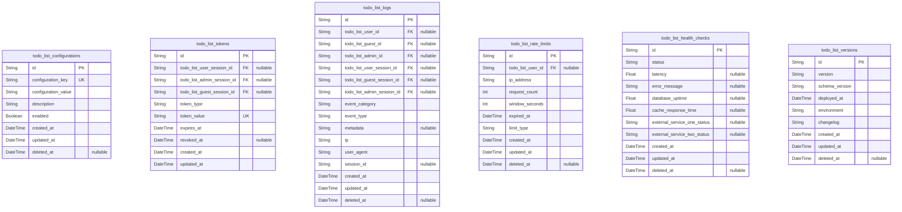
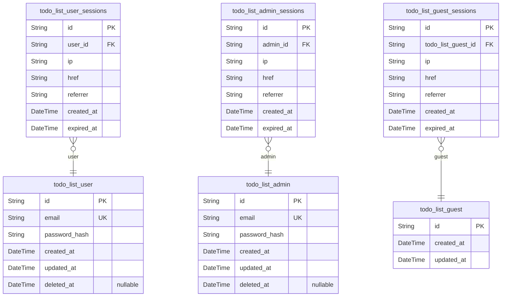
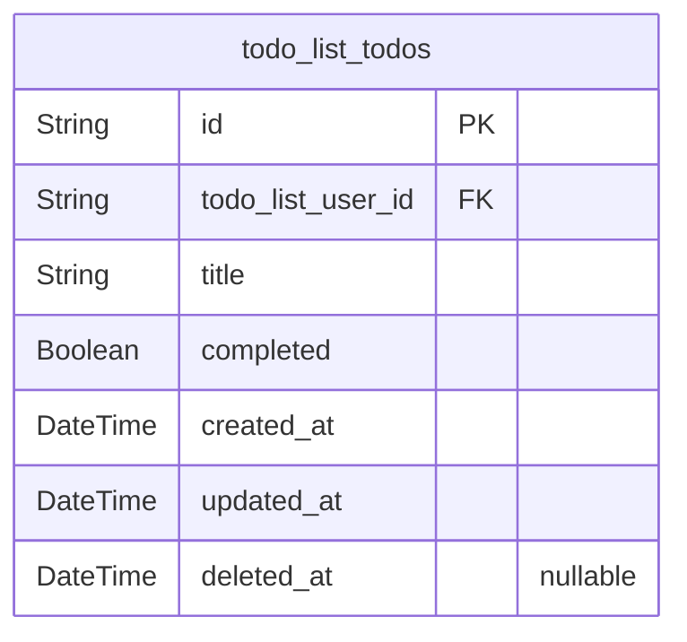

# Prisma Markdown

> Generated by [`prisma-markdown`](https://github.com/samchon/prisma-markdown)

- [Systematic](#systematic)
- [Actors](#actors)
- [Todo](#todo)

## Systematic

```mermaid
erDiagram
"todo_list_configurations" {
  String id PK
  String configuration_key UK
  String configuration_value
  String description
  Boolean enabled
  DateTime created_at
  DateTime updated_at
  DateTime deleted_at "nullable"
}
"todo_list_tokens" {
  String id PK
  String todo_list_user_session_id FK "nullable"
  String todo_list_admin_session_id FK "nullable"
  String todo_list_guest_session_id FK "nullable"
  String token_type
  String token_value UK
  DateTime expires_at
  DateTime revoked_at "nullable"
  DateTime created_at
  DateTime updated_at
}
"todo_list_logs" {
  String id PK
  String todo_list_user_id FK "nullable"
  String todo_list_guest_id FK "nullable"
  String todo_list_admin_id FK "nullable"
  String todo_list_user_session_id FK "nullable"
  String todo_list_guest_session_id FK "nullable"
  String todo_list_admin_session_id FK "nullable"
  String event_category
  String event_type
  String metadata "nullable"
  String ip
  String user_agent
  String session_id "nullable"
  DateTime created_at
  DateTime updated_at
  DateTime deleted_at "nullable"
}
"todo_list_rate_limits" {
  String id PK
  String todo_list_user_id FK "nullable"
  String ip_address
  Int request_count
  Int window_seconds
  DateTime expired_at
  String limit_type
  DateTime created_at
  DateTime updated_at
  DateTime deleted_at "nullable"
}
"todo_list_health_checks" {
  String id PK
  String status
  Float latency "nullable"
  String error_message "nullable"
  Float database_uptime "nullable"
  Float cache_response_time "nullable"
  String external_service_one_status "nullable"
  String external_service_two_status "nullable"
  DateTime created_at
  DateTime updated_at
  DateTime deleted_at "nullable"
}
"todo_list_versions" {
  String id PK
  String version
  String schema_version
  DateTime deployed_at
  String environment
  String changelog
  DateTime created_at
  DateTime updated_at
  DateTime deleted_at "nullable"
}
```

### `todo_list_configurations`

System-wide configuration settings and feature flags governing
application behavior and operational parameters.

Stores key-value pairs that control application features, operational
parameters, and behavioral settings across the entire system. These
configurations are managed by administrators through administrative
interfaces and affect system-wide behavior rather than individual user
experience.

Configuration values can control feature toggles, rate limits, timeouts,
external service endpoints, and other operational settings. The enabled
flag allows administrators to activate or deactivate configurations
without deleting them, maintaining audit trails for compliance.

This table is referenced by various system components to determine their
runtime behavior based on centralized configuration.

Properties as follows:

- `id`: Primary Key.
- `configuration_key`
  > Unique identifier for the configuration setting (e.g.,
  > "feature_toggles.new_ui", "api.rate_limit.per_minute"). Must be unique
  > across all configurations.
- `configuration_value`
  > The actual value of the configuration setting. Can represent boolean
  > ("true"/"false"), numbers, strings, JSON objects, or any other data
  > format. Stored as string to accommodate any configuration type.
- `description`
  > Detailed explanation of what this configuration controls, its expected
  > values, and its impact on system behavior. Used by administrators to
  > understand configuration purpose.
- `enabled`
  > Whether this configuration is active and affecting system behavior. When
  > false, the system should ignore this configuration regardless of its
  > value.
- `created_at`
  > Timestamp when this configuration was created. Used for audit trail and
  > debugging purposes.
- `updated_at`
  > Timestamp when this configuration was last modified. Updated
  > automatically on any change to the configuration.
- `deleted_at`
  > Timestamp when this configuration was logically deleted. Used for soft
  > deletion to maintain audit trails while allowing configurations to be
  > deactivated without permanent deletion.

### `todo_list_tokens`

Authentication tokens (access and refresh) issued to users, tracking
validity, expiration, and revocation status.

Manages the lifecycle of tokens associated with authenticated sessions.
Each token is linked to exactly one session (user, admin, or guest) and
contains either an access token or refresh token value.

Access tokens are short-lived and used for API authentication, while
refresh tokens are longer-lived and used to obtain new access tokens when
expired. The system tracks token expiration and revocation to enforce
secure authentication policies.

Tokens are automatically revoked when users log out or when sessions
expire. The revoked_at field allows for explicit revocation before
expiration and supports audit trails of security incidents.

Properties as follows:

- `id`: Primary Key.
- `todo_list_user_session_id`: Session that issued this token. [todo_list_user_sessions.id](#todo_list_user_sessions).
- `todo_list_admin_session_id`: Session that issued this token. [todo_list_admin_sessions.id](#todo_list_admin_sessions).
- `todo_list_guest_session_id`: Session that issued this token. [todo_list_guest_sessions.id](#todo_list_guest_sessions).
- `token_type`
  > Type of authentication token: 'access' for short-lived API tokens,
  > 'refresh' for long-lived token renewal tokens. Cannot be null - every
  > token must be explicitly classified.
- `token_value`
  > The actual cryptographic token value issued for authentication. Must be a
  > secure, random string that cannot be guessed. Used to authenticate API
  > requests.
- `expires_at`
  > The exact timestamp when the token expires and becomes invalid. This is a
  > required security field - sessions cannot grant unlimited access. All
  > tokens must have an expiration time.
- `revoked_at`
  > The timestamp when the token was explicitly revoked before expiration.
  > NULL means token has not been voluntarily revoked. Used for audit trails
  > when users log out or security events occur.
- `created_at`
  > The timestamp when this token was originally issued and stored in the
  > database.
- `updated_at`
  > The timestamp when this token was last modified (typically updated when
  > revoked).

### `todo_list_logs`

Audit logs for critical system operations such as authentication events,
configuration changes, and security alerts.

Tracks all significant system events for security monitoring, compliance
auditing, and system troubleshooting. Each log entry records the actor
responsible, the type of event, contextual metadata, and connection
details.

Log entries are append-only and never modified after creation. The system
uses these logs to reconstruct the sequence of operations for forensic
analysis and to enforce security policies.

Soft deletion is supported to maintain data integrity during regulatory
compliance requirements while allowing administrative cleanup of obsolete
records.

Properties as follows:

- `id`: Primary Key.
- `todo_list_user_id`: User who triggered the event. [todo_list_user.id](#todo_list_user).
- `todo_list_guest_id`: Guest session that triggered the event. [todo_list_guest.id](#todo_list_guest).
- `todo_list_admin_id`: Administrator who triggered the event. [todo_list_admin.id](#todo_list_admin).
- `todo_list_user_session_id`: User session context for the event. [todo_list_user_sessions.id](#todo_list_user_sessions).
- `todo_list_guest_session_id`: Guest session context for the event. [todo_list_guest_sessions.id](#todo_list_guest_sessions).
- `todo_list_admin_session_id`: Admin session context for the event. [todo_list_admin_sessions.id](#todo_list_admin_sessions).
- `event_category`
  > High-level category of the event. Values: 'authentication',
  > 'configuration', 'security', 'system', 'request'.
- `event_type`
  > Specific event that occurred. Examples: 'login', 'logout',
  > 'password_change', 'config_update', 'failed_login', 'access_denied'.
- `metadata`
  > JSON string containing additional context about the event (e.g., changed
  > fields, error codes, request parameters).
- `ip`: Client IP address from which the request originated.
- `user_agent`: User agent string identifying the client application/browser.
- `session_id`
  > Session identifier associated with this event (unique identifier for the
  > session, not the ID field).
- `created_at`
  > Timestamp when the log entry was created. The time at which the event
  > occurred.
- `updated_at`
  > Timestamp when the log entry was last updated. Always equal to created_at
  > as logs are immutable.
- `deleted_at`
  > Timestamp when the log entry was logically deleted by an administrator.
  > Used for compliance cleanup. Event data remains intact for audit.

### `todo_list_rate_limits`

System-wide rate limit enforcement for protecting infrastructure from abuse.

Tracks request quotas per client IP address or authenticated user to
prevent rate flooding and denial-of-service attacks. Each record
represents a specific limitation configuration that expires after a time
window, ensuring stateful counting with automatic cleanup.

Rate limits can be applied by IP address or linked to authentication by
user ID. The system automatically invalidates expired limits during
cleanup operations and allows administrators to reset limits manually for
debugging or user support.

Properties as follows:

- `id`: Primary Key.
- `todo_list_user_id`
  > The authenticated user whose requests are being rate limited. {@link
  > todo_list_user.id}.
- `ip_address`
  > Client IP address that generated the requests. Used as primary limiting
  > identifier for unauthenticated clients.
- `request_count`
  > Number of requests counted within the current time window. Resets to zero
  > upon expiration.
- `window_seconds`
  > Duration of the rate limiting window in seconds (e.g., 60 for 1-minute
  > window).
- `expired_at`
  > Timestamp when this rate limit expires and should be reset. Used for
  > automated cleanup of old limits.
- `limit_type`
  > Type of rate limit: 'ip' for IP-based limits, 'user' for authenticated
  > user limits.
- `created_at`: Timestamp when this rate limit record was created.
- `updated_at`
  > Timestamp when this rate limit record was last updated (request count
  > incremented).
- `deleted_at`
  > Soft delete timestamp for audit trails. When set, the limit is considered
  > inactive but retained for historical analysis.

### `todo_list_health_checks`

Tracks the health status of core system dependencies to ensure 99.9%
availability.

Captures point-in-time measurements of critical system components
including database connectivity, cache performance, and external service
availability. Records timestamps for all health checks to build an audit
trail of system reliability over time.

This table follows an append-only pattern where previous health states
are preserved for historical analysis and incident investigation. New
records are added periodically by system monitoring processes, and
records are never updated in place. Soft delete is supported to maintain
the integrity of historical audit trails while allowing for data
moderation policies.

Properties as follows:

- `id`: Primary Key.
- `status`
  > Current health status of the monitored component. Valid values:
  > 'healthy', 'degraded', 'unavailable'. Indicates the operational state of
  > the system dependency at the time of check.
- `latency`
  > Response latency in milliseconds observed during the health check. Null
  > indicates no latency measurement was performed or available for this
  > check.
- `error_message`
  > Detailed error message describing the failure condition when status is
  > 'degraded' or 'unavailable'. Null when status is 'healthy' or when no
  > error occurred.
- `database_uptime`
  > Database service uptime percentage during the health check. Value between
  > 0 and 100. Null when database health check not performed.
- `cache_response_time`
  > Average cache response time in milliseconds during the health check. Null
  > when cache service not monitored.
- `external_service_one_status`
  > Status of first external service dependency. Valid values: 'healthy',
  > 'degraded', 'unavailable'. Null when not monitored.
- `external_service_two_status`
  > Status of second external service dependency. Valid values: 'healthy',
  > 'degraded', 'unavailable'. Null when not monitored.
- `created_at`
  > Timestamp when the health check record was created. Represents the exact
  > moment the system state was measured.
- `updated_at`
  > Timestamp when the health check record was last updated. In this model,
  > this will typically equal created_at as records are never modified.
- `deleted_at`
  > Timestamp indicating when this health check record was logically deleted.
  > Maintained for audit trail purposes and data governance compliance.

### `todo_list_versions`

Tracks historical versions of application code, database schema, and
deployment configurations to ensure infrastructure consistency and enable
rollback capabilities.

Records exact state snapshots of system components at time of deployment,
creating an immutable audit trail of system evolution. Each version
record captures the specific code version, schema version, deployment
environment, and changelog notes for full traceability.

Used for rollback procedures, deployment verification, and infrastructure
change analysis. This is an append-only historical record that should
never be modified after creation.

Properties as follows:

- `id`: Primary Key.
- `version`
  > Application code version identifier following semantic versioning format
  > (e.g., '1.2.3'). Uniquely identifies each deployment state.
- `schema_version`
  > Database schema version identifier following semantic versioning format
  > (e.g., '2.1.0'). Tracks exact state of database structure at time of
  > deployment.
- `deployed_at`
  > Timestamp when this version was deployed in the target environment.
  > Records exact point-in-time of the deployment action.
- `environment`
  > Deployment environment identifier. Valid values: development, staging,
  > production. Specifies the target system for this version deployment.
- `changelog`
  > Detailed changelog describing changes included in this version. Contains
  > human-readable summary of code, schema, and configuration modifications.
- `created_at`
  > When this version record was created in the database. Automatically set
  > to match deployment time for audit consistency.
- `updated_at`
  > When this version record was last updated. Always equals created_at since
  > snapshot tables are immutable.
- `deleted_at`
  > Soft delete timestamp. Null indicates record is active. Used for
  > system-level data retention policies while maintaining audit trail
  > integrity.

## Actors

```mermaid
erDiagram
"todo_list_user" {
  String id PK
  String email UK
  String password_hash
  DateTime created_at
  DateTime updated_at
  DateTime deleted_at "nullable"
}
"todo_list_guest" {
  String id PK
  DateTime created_at
  DateTime updated_at
}
"todo_list_admin" {
  String id PK
  String email UK
  String password_hash
  DateTime created_at
  DateTime updated_at
  DateTime deleted_at "nullable"
}
"todo_list_user_sessions" {
  String id PK
  String user_id FK
  String ip
  String href
  String referrer
  DateTime created_at
  DateTime expired_at
}
"todo_list_admin_sessions" {
  String id PK
  String admin_id FK
  String ip
  String href
  String referrer
  DateTime created_at
  DateTime expired_at
}
"todo_list_guest_sessions" {
  String id PK
  String todo_list_guest_id FK
  String ip
  String href
  String referrer
  DateTime created_at
  DateTime expired_at
}
"todo_list_user_sessions" }o--|| "todo_list_user" : user
"todo_list_admin_sessions" }o--|| "todo_list_admin" : admin
"todo_list_guest_sessions" }o--|| "todo_list_guest" : guest
```

### `todo_list_user`

Authenticated user account with email, password hash, and profile
information.

Represents the primary identity record for users who can log in to the
system and manage personal todo lists.

Each user has a unique email address for authentication, and their
password is stored as a hashed value for security. The table maintains a
soft delete capability to preserve audit trails while allowing account
deactivation.

This actor entity has a one-to-many relationship with
todo_list_user_sessions, which tracks all login sessions for the user.

User accounts are created through registration workflow and are never
shared between users.

Properties as follows:

- `id`: Primary Key.
- `email`
  > User's unique email address used for authentication and communication.
  > Must be unique across all users.
- `password_hash`
  > Hashed password for authentication. Never stored in plain text. Generated
  > using strong hashing algorithm with salt.
- `created_at`: Timestamp when the user account was created.
- `updated_at`: Timestamp when the user account was last updated.
- `deleted_at`
  > Timestamp when the user account was soft-deleted. Null indicates account
  > is active.

### `todo_list_guest`

Represents unauthenticated visitors with no account data - used only for
system state tracking.

This actor type enables the system to track and maintain state for
anonymous users who interact with public content. Unlike authenticated
users, guest actors don't have login credentials or persistent profiles,
but still require a unique identifier and session tracking to maintain
temporary state across HTTP requests.

The guest entity provides a consistent actor pattern across all user
types in the system, allowing unified authentication flows and session
management even for anonymous access. Guest records are temporary and
typically persist only for the duration of a browsing session.

Properties as follows:

- `id`: Primary Key.
- `created_at`
  > Timestamp when this guest actor record was created. Mandatory for
  > tracking session lifecycle.
- `updated_at`
  > Timestamp when this guest actor record was last updated. Used for session
  > activity tracking.

### `todo_list_admin`

Stores administrative user accounts with elevated system access privileges.

Represents the canonical identity record for administrative users who
require elevated permissions and system access. Each admin account
contains authentication credentials and profile data necessary for secure
system administration.

This table is the source of truth for admin authentication and is
referenced by admin_sessions table for session tracking. It separates
administrative identity management from other user types following domain
separation principles. Admins have unrestricted access to system
functions and are responsible for maintaining system security and user
management.

All admin accounts are subject to audit logging and strict credential
requirements. Soft deletion is supported to maintain audit trails while
allowing administrative account deactivation.

Properties as follows:

- `id`: Primary Key.
- `email`: Unique admin email address for authentication and system notifications.
- `password_hash`
  > Securely hashed password for authentication. Never store plain text
  > passwords.
- `created_at`: Timestamp when the admin account was created.
- `updated_at`: Timestamp of the last profile update or password change.
- `deleted_at`: Timestamp when the admin account was soft-deleted (null means active).

### `todo_list_user_sessions`

Authentication sessions for authenticated todo_list_user accounts,
tracking login state, connection context, and session expiration.

Each session represents a single authenticated login event from a user.
The table captures essential connection details (IP address, request URL,
referrer) and enforces session lifetime through mandatory expiration.

Sessions are append-only - never updated or soft-deleted. Instead,
expired sessions are purged by system maintenance. Primary purpose is
security: limiting concurrent sessions and detecting suspicious access
patterns.

The user_id foreign key references todo_list_user.id, establishing
ownership. Any new login creates a new session record, preserving
historical access patterns for auditing.

Properties as follows:

- `id`: Primary Key.
- `user_id`: The authenticated user this session belongs to. [todo_list_user.id](#todo_list_user).
- `ip`: IP address from which the session was initiated.
- `href`: The full URL requested when this session was created.
- `referrer`: The website or application that referred the user to this system.
- `created_at`: Timestamp when this session was created (first login event).
- `expired_at`
  > Timestamp when this session expires and becomes invalid. Sessions must
  > expire for security - unlimited sessions are prohibited.

### `todo_list_admin_sessions`

Authentication sessions for todo_list_admin, tracking tokens and login
states.

Tracks active and expired login sessions for administrative users of the
system. Each session records the connection context (IP address, URL,
referrer) and timestamps for session lifecycle management.

Session records are append-only for audit trail purposes and do not
represent user identity information (which resides in the todo_list_admin
table). When a session expires, its expired_at field is set to the
timestamp of expiration, after which it is no longer considered valid for
authentication purposes.

Sessions are automatically created during login and terminated during
logout or automatically after a system-defined timeout period.

Properties as follows:

- `id`: Primary Key.
- `admin_id`: Admin actor's [todo_list_admin.id](#todo_list_admin).
- `ip`: Client IP address from which the session was initiated.
- `href`: Connection URL (path and query parameters) that initiated the session.
- `referrer`: Referrer URL indicating the source that redirected the user to the system.
- `created_at`: Timestamp when this session was created and validated.
- `expired_at`
  > Timestamp when this session expired. Sessions must expire for security
  > reasons. Non-null by default.

### `todo_list_guest_sessions`

Authentication sessions for todo_list_guest, tracking anonymous access
state and temporary tokens.

Tracks the connection context and temporal state of unauthenticated guest
visitors interacting with the system. Each session represents a temporary
access period during which a guest may view public content or maintain
transient preferences.

Sessions are created when a guest first interacts with the system and
expire after a defined period of inactivity or system-defined duration.
Sessions are append-only and not updated once created. Deleted sessions
are logically removed through expiration rather than hard deletion.

Properties as follows:

- `id`: Primary Key.
- `todo_list_guest_id`: Reference to the guest user's [todo_list_guest.id](#todo_list_guest).
- `ip`: Client IP address from which the session was initiated.
- `href`: The URL that was accessed during this session connection.
- `referrer`: The referrer URL that prompted the guest's access to this system.
- `created_at`: Timestamp when the guest session was created.
- `expired_at`
  > Timestamp when the guest session will expire. Sessions must expire for
  > security - unlimited sessions are not permitted.

## Todo

```mermaid
erDiagram
"todo_list_todos" {
  String id PK
  String todo_list_user_id FK
  String title
  Boolean completed
  DateTime created_at
  DateTime updated_at
  DateTime deleted_at "nullable"
}
```

### `todo_list_todos`

Individual todo items owned by authenticated users with title, completion
status, and timestamps.

Each todo item represents a discrete task that a user creates, manages,
and completes within their personal todo list. Todo items are
intrinsically linked to the user who created them through a foreign key
relationship, ensuring complete data isolation between users.

Items support full lifecycle management: creation with title, toggling
completion status, and deletion. All modifications are tracked with
precise timestamps. Soft deletion is implemented to maintain audit trails
while allowing user-initiated removal.

This table is fundamental to the Todo component's core functionality,
providing persistent storage for user-specific task data without
duplicating user authentication information.

Properties as follows:

- `id`: Primary Key.
- `todo_list_user_id`: The user who owns this todo item. [todo_list_user.id](#todo_list_user).
- `title`
  > Title of the todo item (1-500 characters). The primary identifier for the
  > task that users enter and manage.
- `completed`
  > Completion status of the todo item. True indicates the task is marked
  > complete, false indicates it is still pending.
- `created_at`
  > Timestamp when this todo item was created. Always set to current time on
  > creation and never modified afterwards.
- `updated_at`
  > Timestamp when this todo item was last modified. Updated on any change to
  > title or completion status.
- `deleted_at`
  > Timestamp when this todo item was soft-deleted by the user. NULL
  > indicates the item is still active. Used to support undelete
  > functionality and audit trails.
