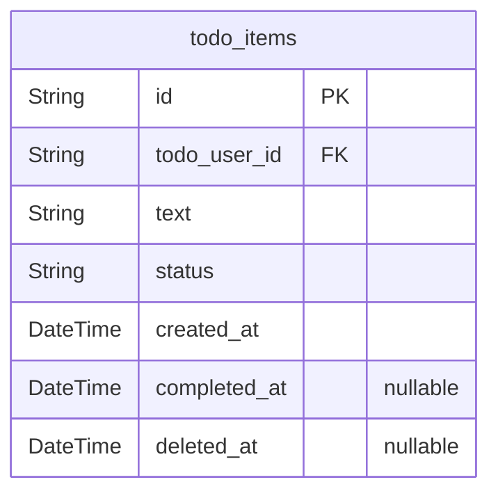

# Prisma Markdown

> Generated by [`prisma-markdown`](https://github.com/samchon/prisma-markdown)

- [Systematic](#systematic)
- [Todo](#todo)

## Systematic

```mermaid
erDiagram
"todo_users" {
  String id PK
  String email UK
  String password_hash
  DateTime created_at
  DateTime updated_at
  DateTime deleted_at "nullable"
}
"todo_user_sessions" {
  String id PK
  String todo_user_id FK
  String ip
  String href
  String referrer
  DateTime created_at
  DateTime expired_at "nullable"
}
"todo_user_sessions" }o--|| "todo_users" : user
```

### `todo_users`

Main user entity for the todo application. Each record represents a
unique authenticated user who can create, read, update, and delete their
own todo items. This table is the foundation of the authentication system
and is referenced by todo_user_sessions.

Properties as follows:

- `id`: Primary Key.
- `email`
  > Unique email address used for user authentication. Must be unique across
  > the system.
- `password_hash`
  > Cryptographic hash of the user's password. Never store plain text
  > passwords.
- `created_at`
  > Timestamp when the user account was created. Used for audit and sorting
  > purposes.
- `updated_at`
  > Timestamp when the user account was last updated. Automatically updated
  > on changes to user profile.
- `deleted_at`
  > Soft delete timestamp. When null, user account is active. When set,
  > account is marked for deletion.

### `todo_user_sessions`

Session records for authenticated todo users. Each session represents a
single active connection from a user. Sessions are managed automatically
by the authentication system and are not directly manipulated by users.

Properties as follows:

- `id`: Primary Key.
- `todo_user_id`: Reference to the user who owns this session. [todo_users.id](#todo_users).
- `ip`: The IP address from which the session was created.
- `href`: The URL of the connection that created this session.
- `referrer`: The referrer URL that led to this session.
- `created_at`: Timestamp when the session was created.
- `expired_at`
  > Timestamp when the session expires or is terminated. Null means the
  > session is still active.

## Todo

```mermaid
erDiagram
"todo_items" {
  String id PK
  String todo_user_id FK
  String text
  String status
  DateTime created_at
  DateTime completed_at "nullable"
  DateTime deleted_at "nullable"
}
```

### `todo_items`

Stores personal todo items for authenticated users. Each item represents
a discrete task with lifecycle tracking from creation to completion.
Follows strict 3NF normalization with no denormalization.

Properties as follows:

- `id`: Primary Key.
- `todo_user_id`: Owner of this todo item. [todo_users.id](#todo_users).
- `text`
  > The text content of the todo item. Maximum length is 500 characters as
  > specified in business rules.
- `status`
  > Current status of the todo item. Must be 'pending' or 'completed' as per
  > business rules.
- `created_at`
  > Timestamp when the todo item was created. Cannot be null as required by
  > system.
- `completed_at`
  > Timestamp when the todo item was marked as completed. Nullable, as items
  > start in 'pending' status and may never be completed.
- `deleted_at`
  > Soft delete timestamp for record retention policies. Allows for logical
  > deletion without data loss.
