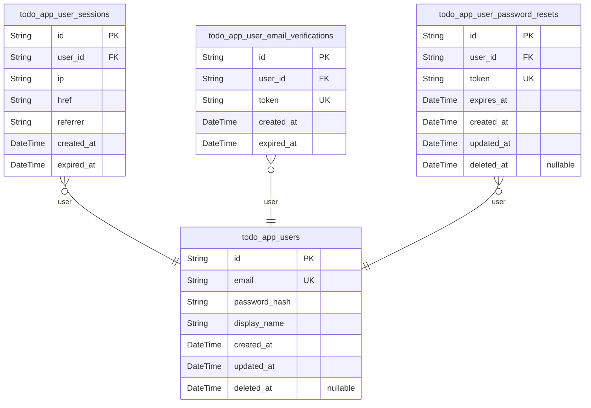
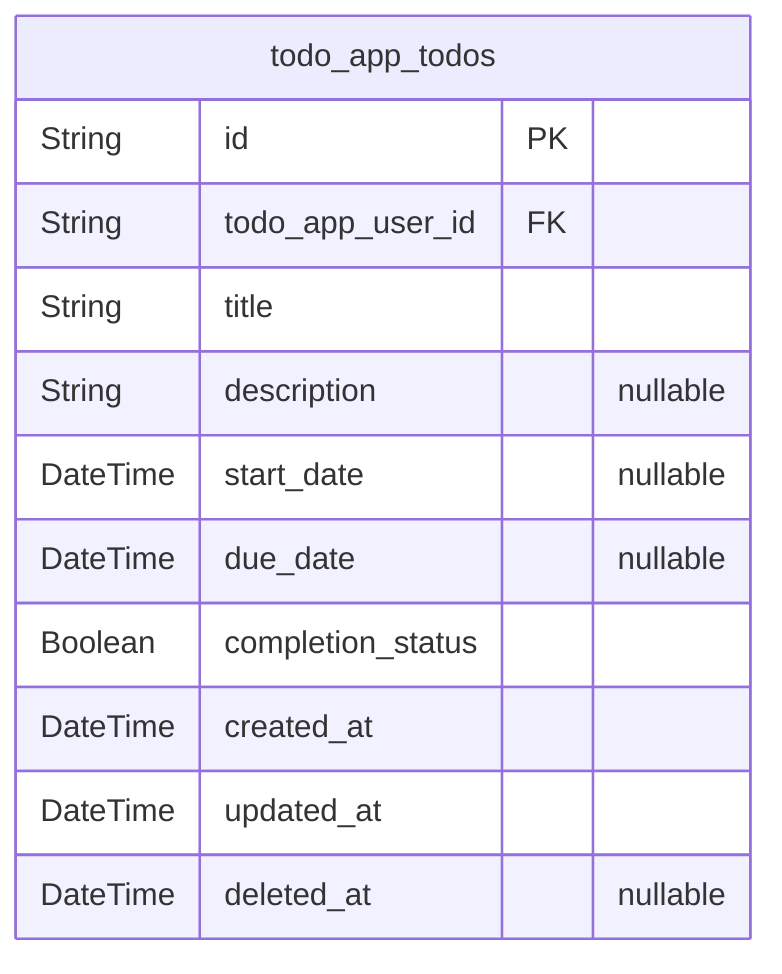

# Prisma Markdown

> Generated by [`prisma-markdown`](https://github.com/samchon/prisma-markdown)

- [Actors](#actors)
- [Todos](#todos)

## Actors

```mermaid
erDiagram
"todo_app_users" {
  String id PK
  String email UK
  String password_hash
  String display_name
  DateTime created_at
  DateTime updated_at
  DateTime deleted_at "nullable"
}
"todo_app_user_sessions" {
  String id PK
  String user_id FK
  String ip
  String href
  String referrer
  DateTime created_at
  DateTime expired_at
}
"todo_app_user_email_verifications" {
  String id PK
  String user_id FK
  String token UK
  DateTime created_at
  DateTime expired_at
}
"todo_app_user_password_resets" {
  String id PK
  String user_id FK
  String token UK
  DateTime expires_at
  DateTime created_at
  DateTime updated_at
  DateTime deleted_at "nullable"
}
"todo_app_user_sessions" }o--|| "todo_app_users" : user
"todo_app_user_email_verifications" }o--|| "todo_app_users" : user
"todo_app_user_password_resets" }o--|| "todo_app_users" : user
```

### `todo_app_users`

Registered user accounts with email/password authentication credentials
and profile information.

The primary actor entity for the TodoApp system. Each user has a private
workspace with complete data isolation. No user can access, view, or
detect the existence of another user's data under any circumstances. This
table contains the core identity information: encrypted email,
bcrypt-hashed password, and display name.

All authentication flows (registration, login, password reset) depend on
this table. All API endpoints scope queries to this user's UUID. Account
deletion triggers full data cascade soft-delete of all associated todos
and related records.

This table serves as the anchor for the entire application's privacy
architecture - every query must include user_id = authenticated_user_id
to enforce strict data isolation.

Properties as follows:

- `id`: Primary Key.
- `email`
  > Encrypted email address used for user identification and communication.
  > Must be unique across the system for authentication purposes.
- `password_hash`
  > bcrypt-hashed value of the user's password. Never stores plaintext
  > passwords. Used for authentication verification during login.
- `display_name`
  > User's display name. Defaults to email prefix (text before @) if not set
  > manually. Used in UI for identification. Max 50 characters, no HTML/JS
  > injection allowed.
- `created_at`: Timestamp when this user account was created. Immutable after creation.
- `updated_at`
  > Timestamp of the last modification to this user's profile. Updated on
  > email, password, or display name changes.
- `deleted_at`
  > Soft delete timestamp. When set, the user account is marked as deleted.
  > All associated data is soft-deleted but retained for audit. NULL
  > indicates active account.

### `todo_app_user_sessions`

Login session records for authenticated users. Each entry represents a
distinct connection session with tracking of IP, referrer, and session
duration. Append-only audit trail of user authentication events.

Properties as follows:

- `id`: Primary Key.
- `user_id`: Reference to the authenticated user account. [todo_app_users.id](#todo_app_users).
- `ip`: Client IP address from which the session was initiated.
- `href`: The URL to which the user's browser was redirected upon login.
- `referrer`
  > The previous web page the user visited before initiating the login
  > session.
- `created_at`: Timestamp when the session was created.
- `expired_at`
  > Scheduled expiration time for this session. Sessions must expire by
  > default for security reasons.

### `todo_app_user_email_verifications`

Email verification tokens with expiration for user registration
confirmation.

Stores unique, time-limited verification tokens that users receive after
registration to confirm their email addresses. Each token is generated
once per registration attempt and must be used within its expiration
window to activate the account.

The token itself is a cryptographically secure random string that
provides no information about the user's identity. Tokens are single-use
and expire after 24 hours by default. Each verification record is tightly
coupled to a specific user account through the foreign key relationship
with todo_app_users.

This table exists solely to facilitate the account verification process
and is managed automatically by the system - users never directly
interact with this table except by clicking the verification link in
their email. Once the token is used or expired, the record remains in the
database for audit purposes.

The table does not store user email addresses (already in todo_app_users)
or any other personally identifiable information beyond the token and
timestamp references.

Properties as follows:

- `id`: Primary Key.
- `user_id`
  > Reference to the user account that this verification token belongs to.
  > [todo_app_users.id](#todo_app_users).
- `token`
  > Unique cryptographic token used for email verification. Must be
  > unguessable and secure. Used to authenticate the verification request
  > when the user clicks the link in their email.
- `created_at`
  > Timestamp when this verification token was generated and sent to the
  > user. Records when the registration process initiated the verification
  > flow.
- `expired_at`
  > Timestamp when this verification token expires. After this time, the
  > token becomes invalid and cannot be used for verification. Tokens
  > typically expire after 24 hours for security.

### `todo_app_user_password_resets`

Password reset tokens with expiration for secure user password recovery
workflow.

This table stores temporary, single-use tokens that allow users to reset
their passwords when they forget their credentials. Each token is
associated with a specific user and has an expiration time to prevent
abuse. Once a token is used to reset a password, it becomes invalid and
should be marked as deleted.

The reset token is a cryptographically random value that is sent to the
user's registered email address. It must be expired within a short time
window (typically 1-2 hours) for security reasons. The table tracks when
the token was created and when it expires, allowing the system to
automatically invalidate expired tokens.

This table is not directly managed by users—it is created automatically
during password reset requests and deleted after use or expiration. It
serves as a critical security mechanism that enables password recovery
while maintaining account integrity.

Properties as follows:

- `id`: Primary Key.
- `user_id`
  > Referenced user account that requested the password reset. {@link
  > todo_app_users.id}.
- `token`
  > Unique, cryptographically-random reset token string. This token is sent
  > to the user's email and must be kept secret.
- `expires_at`
  > Expiration timestamp when this reset token becomes invalid. Must be set
  > to a time shortly after creation (e.g., 1-2 hours).
- `created_at`
  > Timestamp when this password reset token was generated and sent to the
  > user.
- `updated_at`
  > Timestamp of the last update to this record (e.g., when marked as used or
  > deleted).
- `deleted_at`
  > Soft delete timestamp. When set, indicates the token has been used,
  > expired, or revoked. Tokens with non-null deleted_at are considered
  > invalid.

## Todos

```mermaid
erDiagram
"todo_app_todos" {
  String id PK
  String todo_app_user_id FK
  String title
  String description "nullable"
  DateTime start_date "nullable"
  DateTime due_date "nullable"
  Boolean completion_status
  DateTime created_at
  DateTime updated_at
  DateTime deleted_at "nullable"
}
```

### `todo_app_todos`

A user's individual task with title, description, and optional date fields.

Each todo represents a discrete task that a user needs to complete. Users
can independently create, view, edit, complete, delete, and manage their
todos through the application interface.

Todos are owned exclusively by the authenticated user and cannot be
accessed, viewed, or even detected by other users due to strict data
isolation policies.

The title field is required and limited to 200 characters to ensure
conciseness. The description is optional and can contain up to 2,000
characters for detailed task information.

Start and due dates are optional and can be used for planning purposes.
Completion status is a toggleable boolean indicating whether the task has
been completed.

All todos have soft delete capability with deleted_at field to maintain
audit trails while allowing content removal from active views.

Every todo has mandatory temporal fields (created_at, updated_at) for
tracking creation and modification history, and is always linked to
exactly one authenticated user.

This entity follows strict 3NF normalization with no denormalized or
computed fields.

Properties as follows:

- `id`: Primary Key.
- `todo_app_user_id`: The user who owns this todo. [todo_app_users.id](#todo_app_users).
- `title`
  > The title of the todo task. Must be 1-200 characters long. Required field
  > that cannot be empty.
- `description`
  > Optional detailed description of the todo task. Maximum length is 2,000
  > characters. Can be empty.
- `start_date`
  > Optional start date for the todo in ISO 8601 format
  > (YYYY-MM-DDTHH:mm:ss.sssZ). If not provided, stores as null.
- `due_date`
  > Optional due date for the todo in ISO 8601 format
  > (YYYY-MM-DDTHH:mm:ss.sssZ). If not provided, stores as null.
- `completion_status`
  > Current completion status of the todo. true = completed, false =
  > incomplete. Default is false when created.
- `created_at`
  > The timestamp when this todo was created. Always set automatically and
  > never null.
- `updated_at`
  > The timestamp when this todo was last updated. Always updated
  > automatically on any modification and never null.
- `deleted_at`
  > The timestamp when this todo was soft-deleted. If null, the todo is still
  > active. If set, the todo is in trash and not visible in normal lists.
