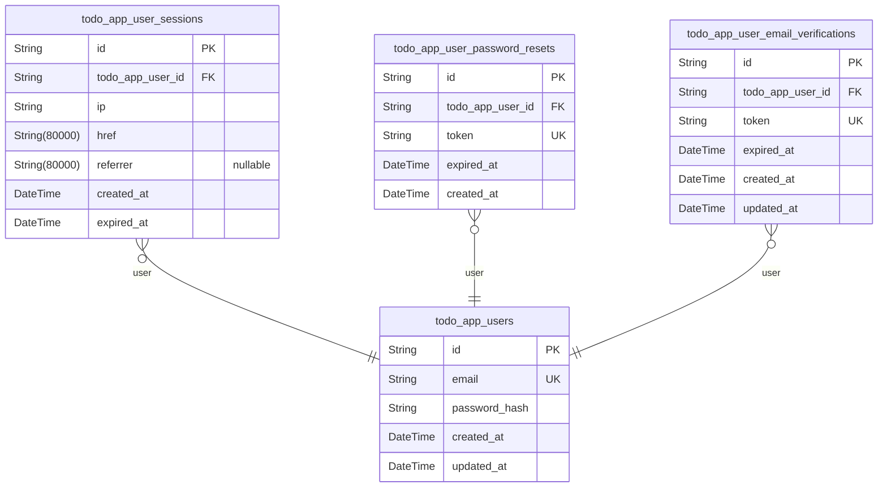
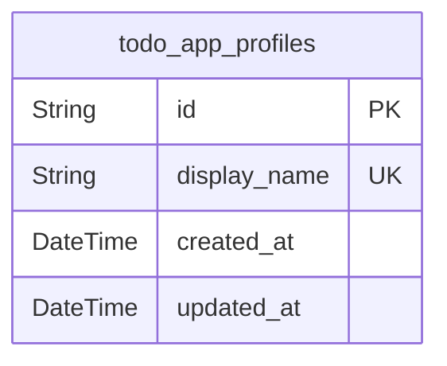
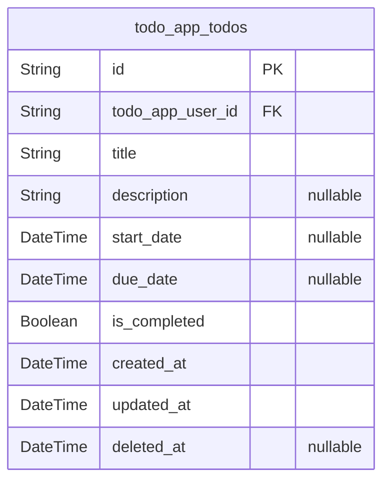
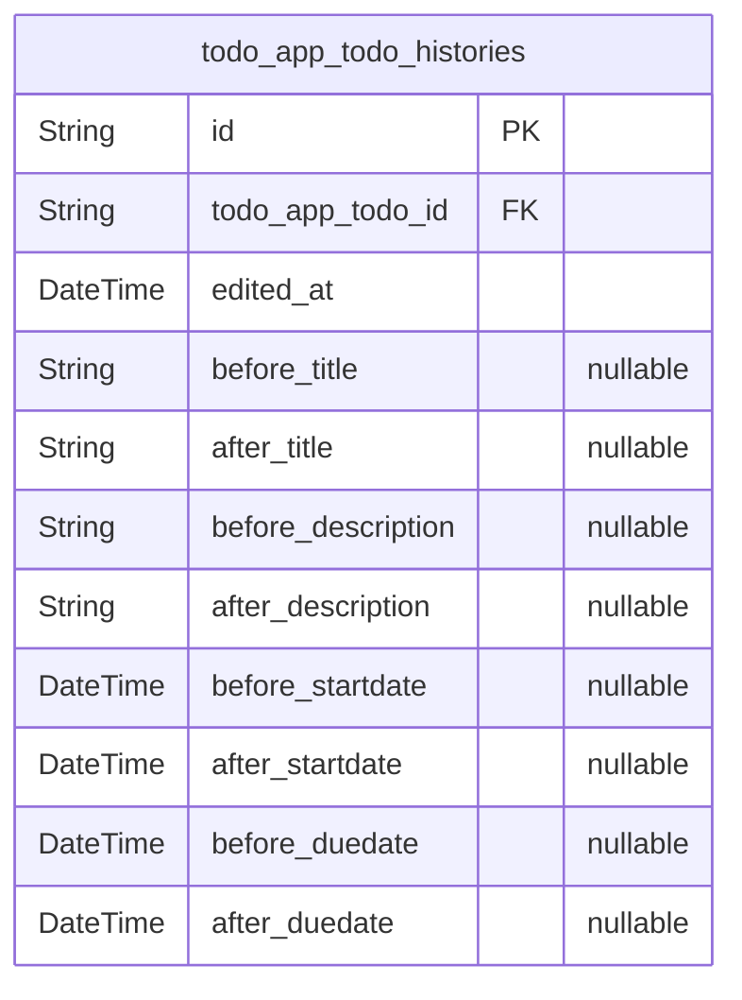

# Prisma Markdown

> Generated by [`prisma-markdown`](https://github.com/samchon/prisma-markdown)

- [Account](#account)
- [Profile](#profile)
- [Todo](#todo)
- [TodoHistory](#todohistory)

## Account

```mermaid
erDiagram
"todo_app_users" {
  String id PK
  String email UK
  String password_hash
  DateTime created_at
  DateTime updated_at
}
"todo_app_user_sessions" {
  String id PK
  String todo_app_user_id FK
  String ip
  String(80000) href
  String(80000) referrer "nullable"
  DateTime created_at
  DateTime expired_at
}
"todo_app_user_password_resets" {
  String id PK
  String todo_app_user_id FK
  String token UK
  DateTime expired_at
  DateTime created_at
}
"todo_app_user_email_verifications" {
  String id PK
  String todo_app_user_id FK
  String token UK
  DateTime expired_at
  DateTime created_at
  DateTime updated_at
}
"todo_app_user_sessions" }o--|| "todo_app_users" : user
"todo_app_user_password_resets" }o--|| "todo_app_users" : user
"todo_app_user_email_verifications" }o--|| "todo_app_users" : user
```

### `todo_app_users`

Registered user accounts with email and hashed password credentials for
authentication. Serves as the primary actor identity for the TodoApp
system. All user-specific data (todos, profiles, sessions) is owned and
linked exclusively through this entity. Strictly used for authentication
and authorization — no personal details like display name are stored here
(handled in todo_app_profiles). Must not be referenced by any non-actor
entities except through session, password reset, or email verification
tables.

Properties as follows:

- `id`: Primary Key.
- `email`
  > User's unique login email address. Must be in valid email format. Used
  > for authentication and communication.
- `password_hash`
  > bcrypt-hashed password for authentication. Never stored in plain text.
  > Used to validate login attempts.
- `created_at`: Timestamp when the user account was created. Immutable.
- `updated_at`
  > Timestamp of the last update to the user account record (e.g., password
  > change, logout). Updated on credential modifications.

### `todo_app_user_sessions`

Refresh token sessions for authenticated users. Each session records
login context (IP, referrer) and expires after 30 days of inactivity.
Strictly owned by a single user. All sessions are append-only for audit
trails.

Properties as follows:

- `id`: Primary Key.
- `todo_app_user_id`: The user this session belongs to. [todo_app_users.id](#todo_app_users).
- `ip`: Client IP address from which the session was initiated.
- `href`: Full URL of the page that initiated the login.
- `referrer`: HTTP referrer header of the login request, if available.
- `created_at`: Timestamp when the session was created.
- `expired_at`: Timestamp when the session will expire due to 30-day inactivity.

### `todo_app_user_password_resets`

Stores password reset tokens with expiration for user actors. This is a
transient session entity created during password reset flows and
automatically purged upon use or expiration. Each token is unique and
bound to a single user. Reset tokens are invalidated after use or when
expired, ensuring security and preventing replay attacks.

This table must not contain any user data beyond the actor reference. No
profile, email, or other sensitive content is stored here — only the
temporary token, its expiration, and audit timing.

[todo_app_users.id](#todo_app_users) is the sole foreign reference. This table has
no user-visible UI, no edit capability, and is managed entirely by
authentication flows.

Properties as follows:

- `id`: Primary Key.
- `todo_app_user_id`
  > Reference to the user requesting password reset. {@link
  > todo_app_users.id}.
- `token`
  > Cryptographically secure, unique token used to validate the password
  > reset request. Must be sufficiently long (e.g., 64+ random hex chars) and
  > unguessable.
- `expired_at`
  > Exact datetime when this reset token expires and becomes invalid. Must be
  > non-null and set at creation time (typically 1 hour from generation).
- `created_at`
  > Timestamp when the password reset token was issued. Required for audit
  > and TTL management.

### `todo_app_user_email_verifications`

Stores email verification tokens with expiration for user account
registration. Each record is tied to one user and expires after a finite
time. Used during account creation flow to validate that the user
controls the email address. Once verified, the record is deleted; it is
not retained for audit. Token must be unique and cannot be reused.

Properties as follows:

- `id`: Primary Key.
- `todo_app_user_id`
  > References the user account that this verification token belongs to.
  > [todo_app_users.id](#todo_app_users).
- `token`
  > Unique, randomly generated verification token. Must be sufficiently long
  > and random to prevent guessing. This value is not human-readable and is
  > sent only via secure email channels.
- `expired_at`
  > The exact timestamp when this verification token expires and becomes
  > invalid. Tokens are not reusable after this point.
- `created_at`: Timestamp when this verification record was created.
- `updated_at`
  > Timestamp when this verification record was last updated (e.g., if token
  > was refreshed).

## Profile

```mermaid
erDiagram
"todo_app_profiles" {
  String id PK
  String display_name UK
  DateTime created_at
  DateTime updated_at
}
```

### `todo_app_profiles`

Stores the user's display name and profile audit timestamps. Owned
exclusively by the authenticated user and never exposed to others. Only
accessible under user's own session. Display name is a user-presentable
identifier that can be edited at any time but remains private and
non-shareable.

Properties as follows:

- `id`: Primary Key.
- `display_name`
  > User's public-facing display name. Must be unique within user's own scope
  > (enforced by unique index). No other user can view, search, or reference
  > this field.
- `created_at`
  > Timestamp when profile was created. Records the moment the user account
  > was activated.
- `updated_at`: Timestamp when display_name was last modified. Always updated on edit.

## Todo

```mermaid
erDiagram
"todo_app_todos" {
  String id PK
  String todo_app_user_id FK
  String title
  String description "nullable"
  DateTime start_date "nullable"
  DateTime due_date "nullable"
  Boolean is_completed
  DateTime created_at
  DateTime updated_at
  DateTime deleted_at "nullable"
}
```

### `todo_app_todos`

Primary todo entity storing title, description, start date, due date,
completion status, and timestamps for each user-owned task. Each todo
belongs exclusively to one user and is completely private. Users can
create, view, toggle completion, edit, delete, restore, and permanently
delete their todos. Edit history is handled by todo_app_todo_histories to
maintain normalization.

Properties as follows:

- `id`: Primary Key.
- `todo_app_user_id`
  > Owner user's [todo_app_users.id](#todo_app_users). Required for data isolation and
  > permission enforcement.
- `title`
  > Title of the todo. Required field with minimum length constraint enforced
  > at API level.
- `description`: Optional detailed description of the todo. Can be empty.
- `start_date`
  > Optional start date for the todo in ISO 8601 format. When present, used
  > for sorting. Todos without start date appear last in ascending sort.
- `due_date`
  > Optional due date for the todo in ISO 8601 format. When present, used for
  > sorting. Todos without due date appear last in ascending sort.
- `is_completed`
  > Completion status of the todo. Default is false (incomplete). Toggle
  > operation flips this value atomically.
- `created_at`
  > Timestamp when the todo was created. Immutable. Used as default sort
  > field (newest first).
- `updated_at`
  > Timestamp when the todo was last updated (including toggle or edit).
  > Updated on every change.
- `deleted_at`
  > Soft delete timestamp. If null, todo is active and visible in main list.
  > If set, todo is in trash and hidden from main list.

## TodoHistory

```mermaid
erDiagram
"todo_app_todo_histories" {
  String id PK
  String todo_app_todo_id FK
  DateTime edited_at
  String before_title "nullable"
  String after_title "nullable"
  String before_description "nullable"
  String after_description "nullable"
  DateTime before_startdate "nullable"
  DateTime after_startdate "nullable"
  DateTime before_duedate "nullable"
  DateTime after_duedate "nullable"
}
```

### `todo_app_todo_histories`

Stores historical record of every edit made to a todo item. Each entry
captures the before and after values of changed fields (title,
description, startDate, dueDate) along with the precise timestamp of the
edit. All history entries are owned exclusively by the todo they
reference and are never visible to users other than the todo's owner.
History is accessed only through the parent todo and is automatically
purged when the associated todo is permanently deleted.

Properties as follows:

- `id`: Primary Key.
- `todo_app_todo_id`: The todo that was edited. [todo_app_todos.id](#todo_app_todos).
- `edited_at`
  > The exact timestamp when this edit occurred. Always recorded in UTC. Used
  > for sorting history from most recent to oldest.
- `before_title`: The title value before the edit. Null if title was not changed.
- `after_title`: The title value after the edit. Null if title was not changed.
- `before_description`
  > The description value before the edit. Null if description was not
  > changed.
- `after_description`: The description value after the edit. Null if description was not changed.
- `before_startdate`: The start date value before the edit. Null if start date was not changed.
- `after_startdate`: The start date value after the edit. Null if start date was not changed.
- `before_duedate`: The due date value before the edit. Null if due date was not changed.
- `after_duedate`: The due date value after the edit. Null if due date was not changed.
