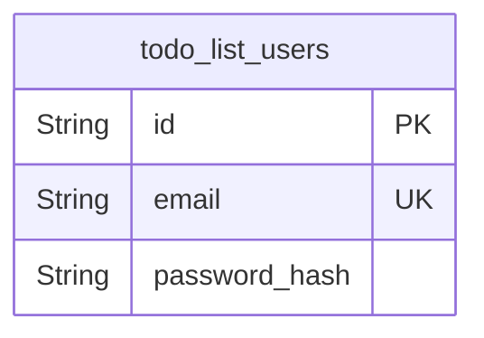
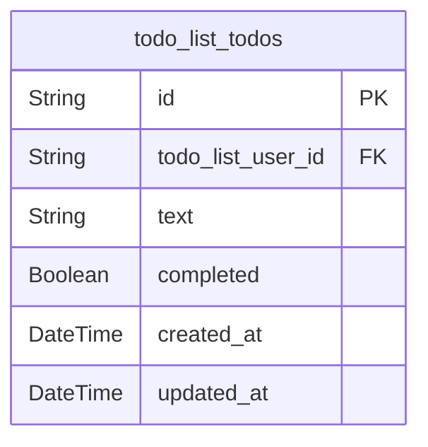

# Prisma Markdown

> Generated by [`prisma-markdown`](https://github.com/samchon/prisma-markdown)

- [Actors](#actors)
- [Todo](#todo)

## Actors

```mermaid
erDiagram
"todo_list_users" {
  String id PK
  String email UK
  String password_hash
}
```

### `todo_list_users`

User account records for authentication.

Stores credentials for individual users who create and manage their own
todo items. Each user has exclusive ownership of their todo list and
cannot access others' data. Authentication is stateless using JWT tokens,
so this table contains only the minimum required information to verify
user identity: a unique email address and a bcrypt-hashed password. No
other user metadata is stored to preserve privacy and simplicity.

Users are identified by a system-generated UUID primary key and
authenticated by email/password combination. All todo items reference
this table via user_id foreign key to enforce strict data isolation.

Properties as follows:

- `id`: Primary Key.
- `email`
  > User's unique email address used for authentication. Must be unique
  > across all users and match standard email format.
- `password_hash`
  > Bcrypt hash of the user's password. Never stored in plaintext. Required
  > for authentication and used to verify login credentials. Generated with
  > cost factor 12.

## Todo

```mermaid
erDiagram
"todo_list_todos" {
  String id PK
  String todo_list_user_id FK
  String text
  Boolean completed
  DateTime created_at
  DateTime updated_at
}
```

### `todo_list_todos`

Personal to-do items owned exclusively by authenticated users.

Represents individual tasks that a user creates, views, updates, and
deletes. Each todo item is bound to exactly one user and cannot be
shared, transferred, or accessed by any other user.

The system enforces strict ownership: a todo item can only be modified or
deleted by the user who created it. This table contains only the data
necessary for task persistence: the text content, completion status, and
timestamps. No additional metadata, tags, categories, or priorities are
stored.

All todo items are displayed in chronological order. The completion
status can be toggled between true and false any number of times. Upon
deletion, the item is permanently removed from the system with no
possibility of recovery.

This table does not support versioning, auditing, or backup features. It
serves as the single, unified source of truth for a user's personal task
list.

Properties as follows:

- `id`: Primary Key.
- `todo_list_user_id`: Owner of this todo item. [todo_list_users.id](#todo_list_users).
- `text`
  > The textual content of the todo item. Must be between 1 and 255
  > characters and cannot be empty or contain only whitespace. This
  > represents the user's task description.
- `completed`
  > The completion status of the todo item. Value is false when created, and
  > can be toggled to true by the user to mark the item as complete. Can be
  > toggled back to false if the user wants to unmark it.
- `created_at`
  > The ISO 8601 timestamp when the todo item was created. Always set on
  > insertion and never modified afterwards.
- `updated_at`
  > The ISO 8601 timestamp of the last update to the todo item. Updated
  > whenever the text or completed status change.
