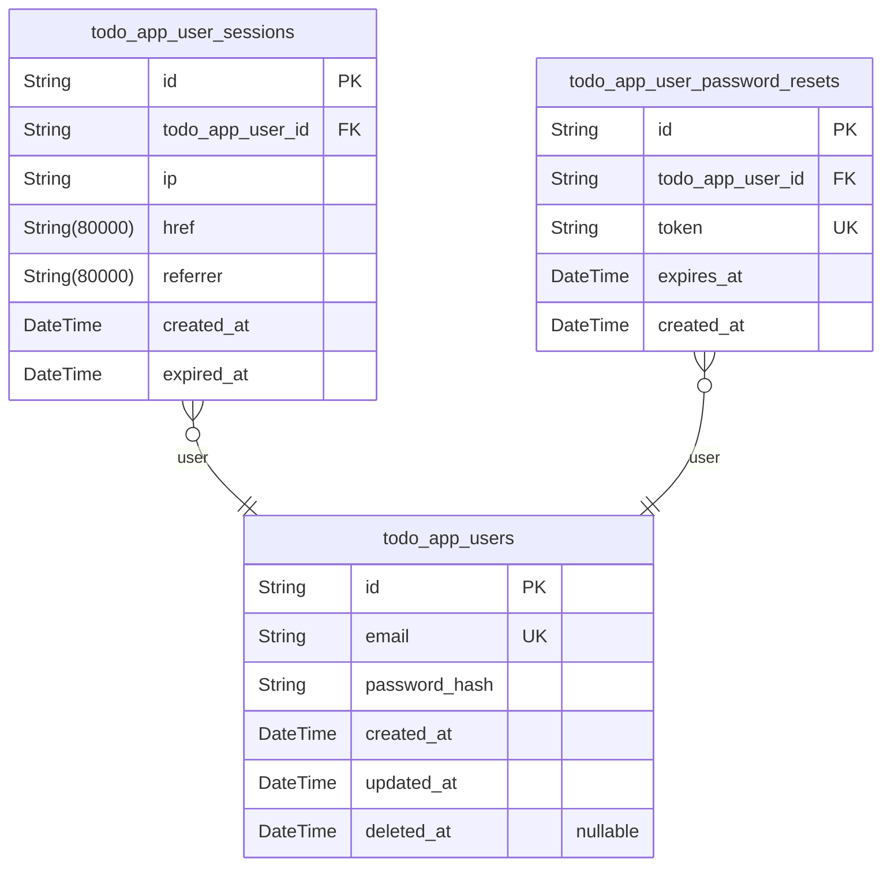
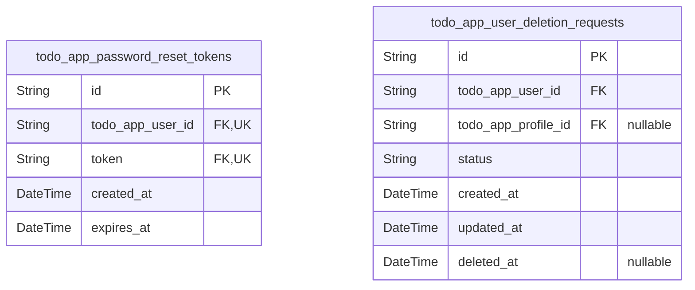
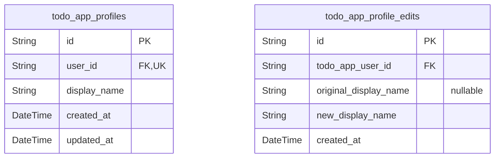
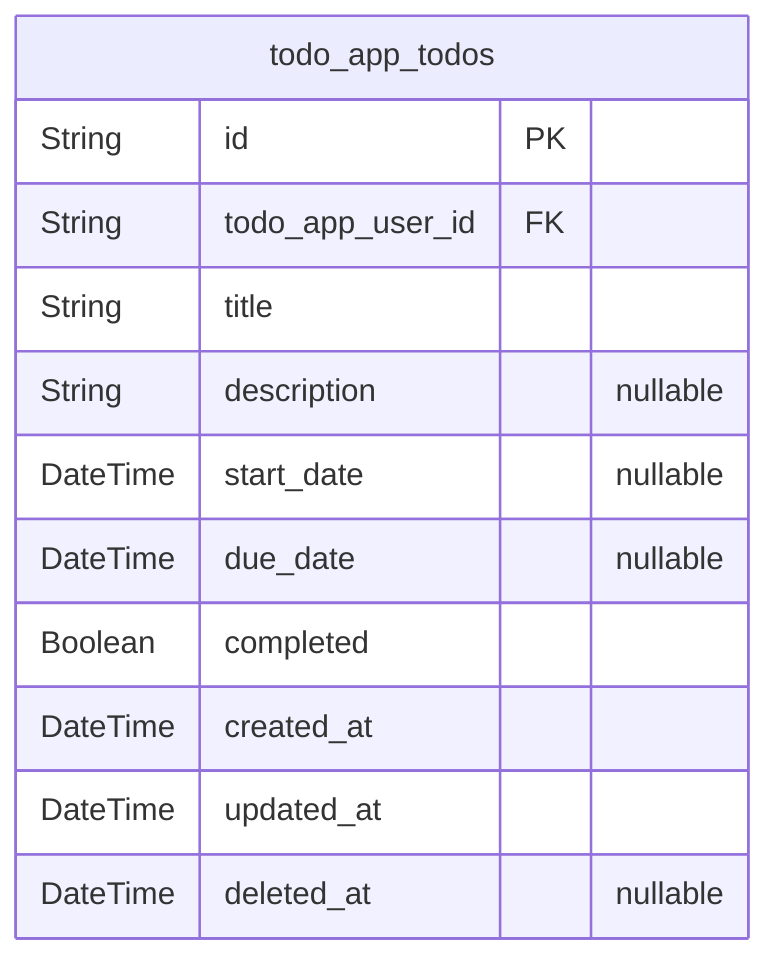

# Prisma Markdown

> Generated by [`prisma-markdown`](https://github.com/samchon/prisma-markdown)

- [Actors](#actors)
- [Systematic](#systematic)
- [Profile](#profile)
- [Trash](#trash)

## Actors

```mermaid
erDiagram
"todo_app_users" {
  String id PK
  String email UK
  String password_hash
  DateTime created_at
  DateTime updated_at
  DateTime deleted_at "nullable"
}
"todo_app_user_sessions" {
  String id PK
  String todo_app_user_id FK
  String ip
  String(80000) href
  String(80000) referrer
  DateTime created_at
  DateTime expired_at
}
"todo_app_user_password_resets" {
  String id PK
  String todo_app_user_id FK
  String token UK
  DateTime expires_at
  DateTime created_at
}
"todo_app_user_sessions" }o--|| "todo_app_users" : user
"todo_app_user_password_resets" }o--|| "todo_app_users" : user
```

### `todo_app_users`

Stores authenticated user accounts with email and password hash for login
authentication. This is the primary actor table representing a user
identity with its own authentication flow. All user data is completely
private - no access to other users' data is allowed. This table is
referenced by session and password reset tables but contains no
relationships to todos, profiles, or any other user-specific data. The
display name is managed separately in todo_app_profiles table.

Properties as follows:

- `id`: Primary Key.
- `email`
  > Unique email address used for authentication. Must be a valid email
  > format. This is the user's primary identifier for login.
- `password_hash`
  > Cryptographically hashed password for secure authentication. Generated
  > using bcrypt or equivalent algorithm upon registration.
- `created_at`: Timestamp when the user account was created. Always present and immutable.
- `updated_at`
  > Timestamp of the last update to the account. Updated on password change
  > or profile modification request.
- `deleted_at`
  > Timestamp when user initiated account deletion. Soft delete
  > implementation. If null, account is active.

### `todo_app_user_sessions`

Stores login sessions for todo_app_users. Each entry represents a
successful authentication event with connection metadata. This table is
append-only and used for audit trails and token validation. Never
directly modified by users - managed exclusively by authentication
service. [todo_app_users.id](#todo_app_users)

Properties as follows:

- `id`: Primary Key.
- `todo_app_user_id`: The authenticated user this session belongs to. [todo_app_users.id](#todo_app_users)
- `ip`: The IP address from which the user logged in. Used for security auditing.
- `href`
  > The full URL the user was accessing when initiating the session, for
  > context in authentication events.
- `referrer`
  > The referrer URL that led the user to this application, captured for
  > analytics.
- `created_at`
  > Timestamp when this session was created. Always recorded at
  > authentication.
- `expired_at`
  > Timestamp when this session expires and is no longer valid for
  > authentication. Must be set and is not nullable.

### `todo_app_user_password_resets`

Password reset token and expiration for secure account recovery. Each
token is tied to a user and expires after a defined duration. When used,
the token is invalidated and removed. Reset requests are immutable after
creation.

Properties as follows:

- `id`: Primary Key.
- `todo_app_user_id`: User who requested the password reset. [todo_app_users.id](#todo_app_users).
- `token`
  > Unique, random, cryptographic token used to reset password. Must be long,
  > random, and unguessable.
- `expires_at`
  > Timestamp when this token expires and becomes invalid. After this time,
  > the token must no longer be accepted.
- `created_at`: Timestamp when the password reset token was generated.

## Systematic

```mermaid
erDiagram
"todo_app_password_reset_tokens" {
  String id PK
  String todo_app_user_id FK,UK
  String token FK,UK
  DateTime created_at
  DateTime expires_at
}
"todo_app_user_deletion_requests" {
  String id PK
  String todo_app_user_id FK
  String todo_app_profile_id FK "nullable"
  String status
  DateTime created_at
  DateTime updated_at
  DateTime deleted_at "nullable"
}
```

### `todo_app_password_reset_tokens`

Stores password reset tokens for user authentication. Each token is a
cryptographically secure random string that grants temporary access to
reset a user's password. Tokens have a short expiration lifetime
(typically 1 hour) after which they become invalid. This table ensures
secure, time-bound password recovery without storing passwords or
exposing sensitive data. This table's stance is session because it
represents an authentication event tied directly to the user actor, not
an independent business entity.

Relationship: [todo_app_users](#todo_app_users)

Properties as follows:

- `id`: Primary Key.
- `todo_app_user_id`
  > The user to whom this password reset token belongs. {@link
  > todo_app_users.id}
- `token`
  > Unique, cryptographically secure token string used to authenticate
  > password reset requests.
- `created_at`: Timestamp when the password reset token was generated.
- `expires_at`
  > Timestamp when the password reset token expires and becomes invalid.
  > Typically set 1 hour after created_at.

### `todo_app_user_deletion_requests`

Manages pending user account deletion requests with timestamp and status,
ensuring orderly cleanup of all associated data. Each entry links to a
user_id from todo_app_users and records when the deletion was requested
and the current status of the request (e.g., "pending", "confirmed",
"completed"). No personal data is stored beyond the user_id, preserving
strict privacy. This table is critical for the account deletion workflow
and is referenced during cleanup of todos, profiles, and sessions after
confirmation.

Properties as follows:

- `id`: Primary Key.
- `todo_app_user_id`
  > Reference to the user who requested account deletion. {@link
  > todo_app_users.id}.
- `todo_app_profile_id`
  > Reference to the user's profile at time of deletion request. {@link
  > todo_app_profiles.id}.
- `status`
  > Current status of the deletion request. Must be one of: "pending",
  > "confirmed", or "completed". Tracks stage of account deletion workflow.
- `created_at`: Timestamp when the deletion request was initially submitted by the user.
- `updated_at`: Timestamp when the deletion request status was last updated.
- `deleted_at`
  > Timestamp when the deletion was fully completed and user data was purged.
  > Nullable: indicates pending or active deletion state.

## Profile

```mermaid
erDiagram
"todo_app_profiles" {
  String id PK
  String user_id FK,UK
  String display_name
  DateTime created_at
  DateTime updated_at
}
"todo_app_profile_edits" {
  String id PK
  String todo_app_user_id FK
  String original_display_name "nullable"
  String new_display_name
  DateTime created_at
}
```

### `todo_app_profiles`

Stores the current display name for each authenticated user, linked by
user_id. Includes creation and last edit timestamps. Ensures privacy by
isolating profile data from todos and authentication.

This table is the canonical source for user display names. Each user has
exactly one profile. The profile is edited independently of
authentication credentials stored in todo_app_users. All profile updates
are tracked in todo_app_profile_edits, but only the current value is
stored here. The table enforces strict privacy: no user can view another
user's display name or profile through any API endpoint.

Properties as follows:

- `id`: Primary Key.
- `user_id`: The associated authenticated user's identifier. [todo_app_users.id](#todo_app_users).
- `display_name`
  > The user's chosen display name for UI presentation. Must be 1-32
  > characters, alphanumeric and spaces only. This is the only identifier
  > visible to the user in the interface. Cannot be null, as all
  > authenticated users must have a display name.
- `created_at`
  > Timestamp when this profile was created. This records when the user first
  > set their display name upon account creation or first login.
- `updated_at`
  > Timestamp of the most recent edit to this profile (i.e., display name
  > change). This is updated by application logic whenever the user changes
  > their display name.

### `todo_app_profile_edits`

Audit log of all display name changes for each user. Records timestamp,
original display name, and new display name. Each entry is linked to a
user via user_id and maintained for history tracking. This table is
append-only and immutable - edit history entries are never updated or
deleted. Used for compliance and accountability.

@link todo_app_users.id: Reference to the user who made the display name
change.
@link todo_app_profiles.id: Represents the profile whose display name was
changed.

Properties as follows:

- `id`: Primary Key.
- `todo_app_user_id`
  > Reference to the user who made the display name change. {@link
  > todo_app_users.id}.
- `original_display_name`
  > The display name value before the change. May be empty if the display
  > name was set for the first time.
- `new_display_name`
  > The display name value after the change. Cannot be empty as profile must
  > have a display name.
- `created_at`: ISO 8601 timestamp when the display name change was recorded. Always set.

## Trash

```mermaid
erDiagram
"todo_app_todos" {
  String id PK
  String todo_app_user_id FK
  String title
  String description "nullable"
  DateTime start_date "nullable"
  DateTime due_date "nullable"
  Boolean completed
  DateTime created_at
  DateTime updated_at
  DateTime deleted_at "nullable"
}
```

### `todo_app_todos`

Represents todos that have been soft-deleted by the user and are stored
in trash. These todos retain all original data including title,
description, start date, due date, and completion status. A non-null
deleted_at indicates the todo is in trash; setting deleted_at to null
restores it. Permanent deletion purges the record entirely. All todos
belong to exactly one user and are completely private.

The todo_app_todos table serves both as the main todo entity and the
trash container. Trash is not a separate table but a state of this table,
controlled by the deleted_at field. Users can restore a todo by setting
deleted_at to null, or permanently delete it to remove the record. The
edit history of these todos is stored separately in
todo_app_todo_histories.

Linked to todo_app_users via user_id for data isolation and ownership.

This model is classified as 'primary' because users directly interact
with todos in trash: they can view, restore, and permanently delete items
from trash, making it a core part of the todo lifecycle independent of
other entities.

Properties as follows:

- `id`: Primary Key.
- `todo_app_user_id`: The user who owns this todo. [todo_app_users.id](#todo_app_users).
- `title`: Required title of the todo. Maximum length 255 characters.
- `description`: Optional detailed description of the todo. Can be empty.
- `start_date`
  > Optional start date for the todo in ISO 8601 format. If null, the todo
  > has no start date.
- `due_date`
  > Optional due date for the todo in ISO 8601 format. If null, the todo has
  > no due date.
- `completed`
  > Whether the todo is complete or incomplete. Defaults to false when
  > created.
- `created_at`: Timestamp when the todo was created. Immutable.
- `updated_at`: Timestamp when the todo was last updated. Updated on every edit.
- `deleted_at`
  > Timestamp when the todo was soft-deleted (moved to trash). If null, the
  > todo is active and not in trash. Must be non-null for todos in trash.
