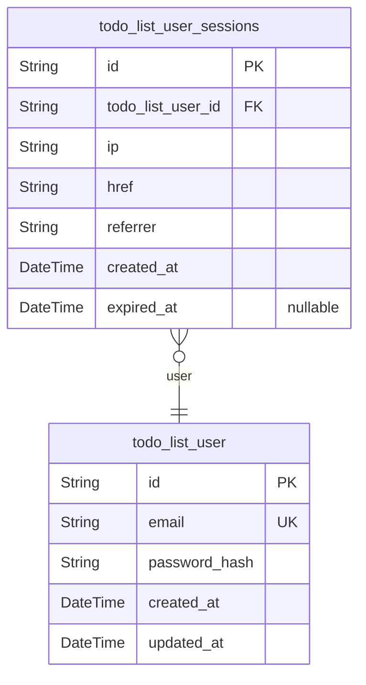
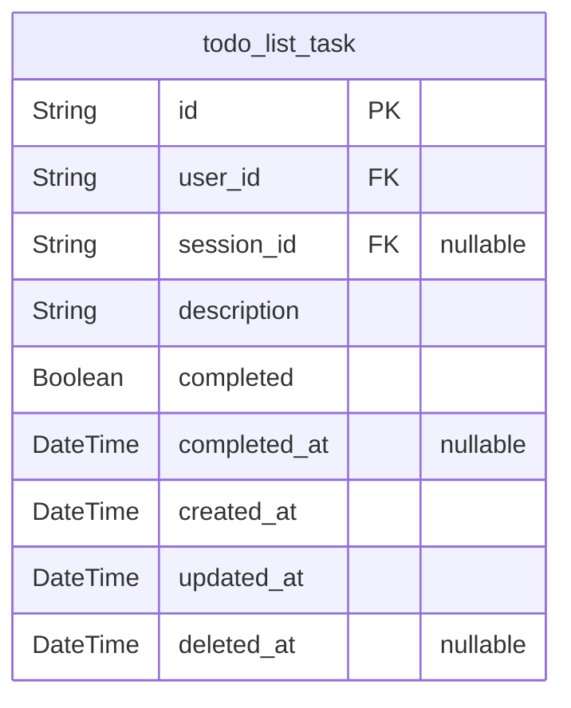

# Prisma Markdown

> Generated by [`prisma-markdown`](https://github.com/samchon/prisma-markdown)

- [Actors](#actors)
- [Tasks](#tasks)

## Actors

```mermaid
erDiagram
"todo_list_user" {
  String id PK
  String email UK
  String password_hash
  DateTime created_at
  DateTime updated_at
}
"todo_list_user_sessions" {
  String id PK
  String todo_list_user_id FK
  String ip
  String href
  String referrer
  DateTime created_at
  DateTime expired_at "nullable"
}
"todo_list_user_sessions" }o--|| "todo_list_user" : user
```

### `todo_list_user`

Primary user identity and authentication record.

Stores user credentials for authentication. Each user has a unique email
and hashed password. This entity is the foundation of access control for
the Todo List application. All task operations are bound to a user
through this identity record. User data is never shared between accounts
and is strictly private to each individual.

Properties as follows:

- `id`: Primary Key.
- `email`
  > User email address used for authentication and communication. Must be
  > unique and valid.
- `password_hash`
  > BCrypt-hashed password. Never stores plain text passwords. Required for
  > authentication.
- `created_at`
  > Timestamp when the user account was created. Records initial registration
  > time.
- `updated_at`
  > Timestamp when the user account was last updated. Automatically updated
  > on any modification to user data.

### `todo_list_user_sessions`

User session tracking for authentication.

Stores active and historical browser sessions for authenticated users.
Each session is tied to a single user and tracks connection context (IP
address, URL, referrer). Sessions are managed exclusively through
authentication flows and are referenced for security auditing. This table
supports session validation without server-side storage.

Properties as follows:

- `id`: Primary Key.
- `todo_list_user_id`: User's identity they are authenticated as. [todo_list_user.id](#todo_list_user).
- `ip`: Client's public IP address during session initiation.
- `href`: Full URL where the session was initiated.
- `referrer`: Referrer URL that led the user to this application.
- `created_at`: Time when the session was created. Records session start timestamp.
- `expired_at`
  > Time when session expires and must be re-authenticated. Nullable if
  > session never expired.

## Tasks

```mermaid
erDiagram
"todo_list_task" {
  String id PK
  String user_id FK
  String session_id FK "nullable"
  String description
  Boolean completed
  DateTime completed_at "nullable"
  DateTime created_at
  DateTime updated_at
  DateTime deleted_at "nullable"
}
```

### `todo_list_task`

User tasks managed in a simple to-do list system.

Represents individual tasks created by a user for personal productivity.
Each task has a description, completion status, and lifecycle timestamps.
Tasks are owned by a single authenticated user and associated with their
session context through the login session.

Tasks can be created, viewed, toggled between completed and pending, and
permanently deleted. The system maintains historical logs of when tasks
were created, modified, and deleted.

Each task is linked to its creator via the user_id field, ensuring data
isolation between users.

Properties as follows:

- `id`: Primary Key.
- `user_id`: The user who created this task. [todo_list_user.id](#todo_list_user).
- `session_id`
  > The session during which the task was created. {@link
  > todo_list_user_sessions.id}.
- `description`
  > The task description entered by the user, trimmed of leading and trailing
  > whitespace.
- `completed`
  > Indicates whether the task has been completed. True if completed, false
  > if pending.
- `completed_at`
  > The timestamp when the task was marked as completed. Null if task is
  > pending.
- `created_at`: The timestamp when the task was created.
- `updated_at`: The timestamp when the task was last updated.
- `deleted_at`
  > The timestamp when the task was permanently deleted. Null if not deleted.
  > Used for audit trail, though deletion is irreversible.
