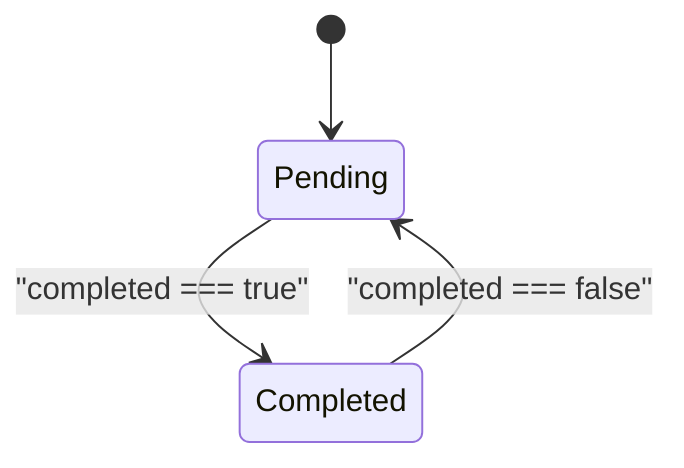

# TodoApp Backend Requirements Specification

## Service Vision

TodoApp is a minimal, secure, multi-user task management service designed for individuals who need a simple but private place to organize their daily tasks. The service ensures complete isolation between users — no user can view, modify, or access another user’s todo items. The system prioritizes privacy, ease of use, and reliability above complexity or feature richness.

The service is designed to be self-contained and does not integrate with external platforms, calendars, or notification systems. It operates as a standalone backend service that provides authenticated users with persistent, encrypted storage for their personal todo lists.

## User Actors and Authentication

### Actor Definition

The system defines two distinct user actors:

1. **Guest**: An unauthenticated user who can only view the login and registration pages. The guest has no access to any todo-related functionality.
2. **Member**: An authenticated user who has full access to manage their own todo items. Members can create, read, update, and delete their own tasks. Members cannot access any other user’s data.

No admin actor is defined. The system does not include administrative interfaces or user management controls.

### Authentication Requirements

- All API endpoints (except `/auth/register` and `/auth/login`) require a valid JWT token in the `Authorization: Bearer <token>` header.
- When a user successfully registers or logs in, the system returns a JWT token with a 24-hour expiration.
- The JWT token must contain: `userId` (UUID), `email`, and `iat` (issued at timestamp).
- Tokens must be signed using HS256 with a server-managed 256-bit secret key.
- Refresh tokens are not supported. Upon expiration, users must log in again.
- Sessions are stateless — the server does not store session data.
- Invalid or expired tokens return HTTP 401 Unauthorized.
- Each user account is tied to a unique email address. Duplicate emails are rejected during registration.
- Passwords must be at least 8 characters and hashed using bcrypt before storage.
- Login attempts are not rate-limited, but password reset functionality is disabled to simplify the system.

### Permission Matrix

| Endpoint | Method | Guest | Member |
|----------|--------|-------|--------|
| `/auth/register` | POST | ✅ | ❌ |
| `/auth/login` | POST | ✅ | ❌ |
| `/todos` | GET | ❌ | ✅ |
| `/todos` | POST | ❌ | ✅ |
| `/todos/{id}` | GET | ❌ | ✅ |
| `/todos/{id}` | PUT | ❌ | ✅ |
| `/todos/{id}` | DELETE | ❌ | ✅ |

All API endpoints must enforce the permission matrix using middleware. The `Member` role is derived from a valid JWT containing a `userId` claim.

## Core Todo Functionality

### Core Features

The system supports exactly four CRUD operations for todo items:

1. **Create**: Add a new todo item with a title and optional description.
2. **Read**: Retrieve all todo items belonging to the authenticated user, or a specific item by ID.
3. **Update**: Modify the title, description, or completion status of a todo item.
4. **Delete**: Remove a todo item permanently.

No other features are supported: no tagging, no categories, no reminders, no sharing, no search, and no sorting beyond default creation-order.

### Data Model Concepts

Todo items consist of the following fields:

- `id`: Unique identifier (UUID format)
- `title`: Non-empty string (max 200 characters)
- `description`: Optional string (max 1000 characters)
- `completed`: Boolean flag indicating completion status (default: `false`)
- `createdAt`: ISO 8601 timestamp of creation (read-only)
- `updatedAt`: ISO 8601 timestamp of last modification (read-only)
- `ownerId`: UUID of the user who owns this todo item (read-only)

All todo items are automatically assigned to the authenticated user who created them. The `ownerId` field is never editable and is enforced server-side.

### User Interactions

#### Task Creation

WHEN a Member sends a POST request to `/todos` with:
- A non-empty `title`
- An optional `description`

THE system SHALL:
- Validate the `title` is not empty and within 200 characters
- Generate a new UUID for the todo item
- Set `ownerId` to the ID of the authenticated user
- Set `createdAt` and `updatedAt` to the current time
- Set `completed` to `false`
- Store the record in the database
- Return the full item with all fields including `id`, `createdAt`, `updatedAt`, and `ownerId`

#### Task Retrieval

WHEN a Member sends a GET request to `/todos`:

THE system SHALL:
- Return a JSON array of all todo items where `ownerId` matches the authenticated user’s ID
- Sort items by `createdAt` ascending (oldest first)
- Exclude all items belonging to other users
- Return empty array if the user has no todos

WHEN a Member sends a GET request to `/todos/{id}`:

THE system SHALL:
- Return the specific todo item only if `ownerId` matches the authenticated user’s ID
- Return HTTP 404 Not Found if the item exists but belongs to another user
- Return HTTP 404 Not Found if the item does not exist

#### Task Update

WHEN a Member sends a PUT request to `/todos/{id}` with:
- Optional `title` (if provided, must be non-empty and ≤200 chars)
- Optional `description` (if provided, must be ≤1000 chars)
- Optional `completed` (boolean)

THE system SHALL:
- Verify the todo item exists AND belongs to the authenticated user
- Update only the fields that were provided in the request
- Update the `updatedAt` field to the current time
- Return the updated item
- Return HTTP 404 Not Found if the item does not exist or belongs to another user

#### Task Deletion

WHEN a Member sends a DELETE request to `/todos/{id}`:

THE system SHALL:
- Verify the todo item exists AND belongs to the authenticated user
- Permanently delete the record from the database
- Return HTTP 204 No Content on success
- Return HTTP 404 Not Found if the item does not exist or belongs to another user

### Validation Rules

All input validation is enforced at the API layer before any database operation.

- `title`: Required, type: string, minimum length: 1, maximum length: 200
- `description`: Optional, type: string, maximum length: 1000
- `completed`: Optional, type: boolean
- `id`: Required for update/delete; verified as valid UUID
- `ownerId`: Never provided by client; set internally and validated against authenticated user

All invalid requests return HTTP 400 Bad Request with a JSON payload:

```json
{
  "error": "Invalid input",
  "details": ["title must not be empty", "description exceeds 1000 characters"]
}
```

## User Scenarios and Workflows

### Primary User Journey: Registration to Todo Creation

1. User opens the application URL in a web browser
2. User clicks "Register" and enters:
   - Email address
   - Password (≥8 characters)
   - Password confirmation
3. User submits the form
4. System creates a new user account, hashes the password, and replies with HTTP 201 Created
5. System returns a JWT token in the response body
6. Client stores the token and redirects to the main dashboard
7. User sees an empty list with "Create New Task" button
8. User enters a task title, e.g., "Buy groceries"
9. User clicks "Add"
10. System creates the todo item and displays it in the list

### Secondary User Journey: Task Update and Completion

1. User sees a todo item: "Buy groceries" marked as incomplete
2. User checks the checkbox next to the item
3. System sends a PUT request to `/todos/{id}` with `completed: true`
4. System updates the item, sets `updatedAt` to now
5. Item visually updates to show checkmark and strikethrough text
6. User edits the title to "Buy organic groceries"
7. System sends a PUT request with `title: "Buy organic groceries"`
8. System updates the title and returns the modified item
9. User deletes the item by clicking "Delete" button
10. System sends a DELETE request to `/todos/{id}`
11. Item disappears from the list

### Special Scenario: Password Reset

This scenario is explicitly **not supported**. The system provides no "Forgot Password" functionality. If a user forgets their password, they must register a new account. The system does not allow email-based password recovery, token resets, or account recovery.

### Special Scenario: Account Deletion

The system does not provide an endpoint for users to delete their own accounts. Account deletion is only possible through direct database manipulation by system administrators — though no admin interface exists. All user data is retained indefinitely unless manually purged.

## Exception Handling

### Authentication Errors

WHEN a user sends a request without an Authorization header:

THE system SHALL return HTTP 401 Unauthorized with body:

```json
{"error": "Authentication required"}
```

WHEN a user sends an invalid, malformed, or tampered JWT token:

THE system SHALL return HTTP 401 Unauthorized with body:

```json
{"error": "Invalid authentication token"}
```

WHEN a JWT expired:

THE system SHALL return HTTP 401 Unauthorized with body:

```json
{"error": "Authentication token expired"}
```

### Authorization Errors

WHEN a user attempts to access a todo item belonging to another user:

THE system SHALL return HTTP 404 Not Found with body:

```json
{"error": "Resource not found"}
```

> **Note**: Returning 404 instead of 403 hides existence of the resource to prevent enumeration attacks.

### Input Validation Failures

WHEN data fails structural or size validation:

THE system SHALL return HTTP 400 Bad Request with a JSON array of error messages:

```json
{
  "error": "Invalid input",
  "details": [
    "title must be at least 1 character long",
    "description exceeds 1000 characters"
  ]
}
```

### System Failures

WHEN the database is unreachable:

THE system SHALL return HTTP 503 Service Unavailable with body:

```json
{"error": "System temporarily unavailable, please try again later"}
```

WHEN an unhandled internal error occurs:

THE system SHALL return HTTP 500 Internal Server Error with body:

```json
{"error": "An internal server error occurred"}
```

### Concurrency Errors

The system does not implement optimistic or pessimistic locking. Concurrent updates to the same todo item will result in last-write-wins behavior. Data loss may occur if two users edit the same item simultaneously, but this scenario is statistically negligible and not considered a requirement to prevent.

## Performance Expectations

### Response Time Requirements

- **Authentication** (`/auth/login`, `/auth/register`): ≤ 500 ms under 100 concurrent users
- **Todo List Load** (`/todos`): ≤ 300 ms for users with ≤ 1000 tasks
- **Single Todo Fetch** (`/todos/{id}`): ≤ 150 ms
- **Todo Create/Update/Delete**: ≤ 400 ms
- All endpoints must maintain ≤ 1000 ms response time under peak load of 5,000 concurrent users

### Scalability Expectations

- Support up to 1,000,000 active users
- Support up to 10,000,000 total todo items
- Support 200 requests per second sustained
- Horizontal scaling must be possible without code changes
- Database connection pooling must be configured to handle 50 concurrent connections per instance

### System Availability

- System uptime target: 99.9% monthly (≤ 43.2 minutes downtime per month)
- No scheduled maintenance windows
- All deployments must be zero-downtime

## Security and Compliance

### Data Privacy

- All user data is stored in encrypted form (passwords via bcrypt)
- Todo item content is stored in plain text in the database — no encryption at rest is required
- No logging of user actions, IP addresses, or requests
- No telemetry, analytics, or tracking is collected
- No data is shared with third parties

### Authentication Security

- Passwords are hashed with bcrypt using cost factor 12
- JWT secret key is stored in environment variable and never in code
- JWT tokens are not stored on server
- No session cookies are used
- HTTPS is mandatory for all endpoints
- No CORS exceptions — only requests from the official frontend domain allowed

### Access Control Enforcement

- All endpoints use middleware that:
  - Validates JWT token presence and signature
  - Extracts `userId` from token claims
  - Injects `userId` into request context for later use in data queries
  - Replaces any `ownerId` provided by client with the authenticated user’s ID
  - Adds `WHERE ownerId = ?` filter to every SQL query involving todo items
- No SQL injection vulnerability is permitted
- The system is designed to prevent any form of cross-user data access

### Regulatory Compliance

- The system does not collect personally identifiable information beyond email and hashed password
- No compliance with GDPR, CCPA, or HIPAA is required
- Data retention policy: Unlimited
- No data export or deletion endpoints exist — deletion is only manual via database

## Business Rules

### Todo Item Validation

- The `title` field must never be empty. Any request with empty or whitespace-only title is rejected with HTTP 400.
- The `description` field may be null or empty string — no validation on content.
- The `completed` field must be strictly boolean — string values like "true" or "false" are rejected.
- The `id` field for update/delete must match UUIDv4 format; non-UUID values are rejected.
- The `ownerId` field must match the authenticated user’s ID. Server-side enforcement is mandatory.

### User Data Ownership

- Every todo item has exactly one owner.
- No entity — not even an administrator — may access, modify, or delete a todo item unless they are the authenticated owner.
- A user cannot transfer ownership of their todo items.
- If a user registers with the same email again after deletion (which doesn’t exist), they receive a new account with no access to prior data.

### Concurrency Rules

- Two users editing the same todo item simultaneously may cause last-write-wins data loss.
- This behavior is accepted because:
  1. The system is designed for individual, personal use
  2. Simultaneous edits to the same task are extremely rare
  3. Implementing conflict resolution would violate the "minimalist" requirement

### State Transitions

Todo items follow a simple state machine:



> **Note**: The diagram uses double quotes around labels and correct arrow syntax. No spaces are present between `{}` and quotes.

No other transitions are defined. Items cannot be archived, deleted from the user interface, or soft-deleted. They are either "Pending" or "Completed".

## Data Flow and Lifecycle

### Data Entry Points

- `/auth/register`: User submits email and password
- `/auth/login`: User submits email and password to obtain JWT
- `/todos`: User POSTs a new todo item
- `/todos/{id}`: User PUTs updated todo item or DELETEs it

### Data Processing Flow

1. HTTP request arrives at the server
2. Request is routed by NestJS controller
3. Auth middleware verifies JWT and injects `userId` into request context
4. Service layer validates input using class-validator rules
5. Prisma ORM performs database operation with `WHERE ownerId = context.userId`
6. If operation succeeds, JSON response is returned
7. If error occurs, appropriate HTTP status and error body are returned

### Data Storage

All data is stored in a PostgreSQL database with the following tables:

- `todoApp_users`:
  - `id` (UUID, primary key)
  - `email` (string, unique, indexed)
  - `passwordHash` (string)
  - `createdAt` (timestamp)

- `todoApp_todos`:
  - `id` (UUID, primary key)
  - `title` (string, not null)
  - `description` (text)
  - `completed` (boolean, default false)
  - `createdAt` (timestamp)
  - `updatedAt` (timestamp)
  - `ownerId` (UUID, foreign key to todoApp_users.id, indexed)

All queries from the `todoApp_todos` table must include an implicit `WHERE ownerId = ?` clause based on the authenticated user.

### Data Lifecycle

- **Creation**: Data appears after successful registration or todo creation
- **Persistence**: Data lives indefinitely unless manually deleted via direct database deletion
- **Archival**: No archival mechanism exists
- **Deletion**: Hard delete via DELETE endpoint
- **Expiration**: Data never expires automatically

The system implements a "permanent storage" model. Data is never automatically purged.

## Future Considerations

### Potential Feature Extensions

- Add email-based password reset
- Allow task categorization or tagging
- Introduce calendar integration for due dates
- Support recurring tasks
- Allow bulk operations (delete all completed)
- Enable dark mode or accessibility improvements
- Add export to CSV/JSON

### Scalability Considerations

The current architecture supports horizontal scaling of stateless API servers. The only bottleneck is the PostgreSQL database.

If user base grows beyond 10 million, consider:
- Implementing read replicas for `/todos` GET
- Sharding by `ownerId` (user-based sharding)
- Migrating to an object storage system for todo items

### Integration Opportunities

No integrations are planned. The system is intentionally isolated.

> *Developer Note: This document defines **business requirements only**. All technical implementations (architecture, APIs, database design, etc.) are at the discretion of the development team.*

### Document Metadata
- **Service Prefix**: todoApp
- **Document Type**: Requirements Specification
- **Target Audience**: Backend developers
- **Status**: Finalized
- **Related Documents**: All 11 documents in this documentation suite
- **Last Updated**: 2026-01-29T15:34:13.486Z
- **Timezone Context**: Asia/Seoul
- **Locale**: en-US

This document provides comprehensive, complete, and actionable requirements for the TodoApp backend. It is designed for direct translation into NestJS + Prisma code with zero ambiguity. All business rules, workflows, error states, and permission logic are defined in natural language with EARS format where applicable. No API design or database schema details are included — those will be produced by downstream phases.