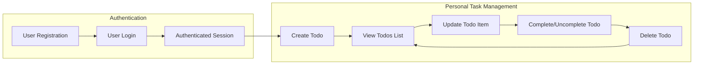

# Todo List Application – Service Overview

## Service Purpose
The Todo List Application is a focused personal productivity tool designed exclusively for individual users who need a secure, simple, and distraction-free environment to organize and manage everyday tasks. The goal is to maximize productivity and peace of mind by reducing cognitive load, eliminating unnecessary features, and ensuring user data is truly private and easily manageable.

**Business Goals:**
- Empower each user to quickly capture, review, complete, and manage daily to-dos
- Ensure all actions—adding, updating, marking as complete, and deleting—are intuitive and require a minimal learning curve
- Promote strong privacy so each user’s data is always separate, preventing any possibility of data exposure between users
- Support account deletion with complete personal data removal (GDPR compliance and user peace of mind)
- Prioritize a lightweight experience without social, collaborative, or analytics distractions

## Target Users
This application is intended for adult users who register their own accounts to keep track of personal tasks. Each person acts only on their own data, never seeing or affecting anyone else’s information. Users must register and authenticate; there is no visitor, guest, or admin access. All user data is strictly partitioned and available only within the authenticated user’s session.

**Primary Actor:**
- **User** – An authenticated individual account holder who can manage their own personal todo list. No other roles, admins, or shared access are present in any circumstance.

## Scope and Limitations
The Todo List Application represents the minimal set of features required for an effective personal todo list. All features outside this scope are explicitly excluded, ensuring focus, security, and usability.

### In-Scope (MVP)
- User registration, authentication via secure password, login and logout for account management
- Personal task management: create, view, update, delete todo items ("CRUD" for tasks) for only the logged-in user
- Toggle completion status for any personal todo (complete/incomplete)
- Each todo includes: short required title, optional text description, completion status, and auto-generated timestamps for creation and edits
- All data and actions are strictly limited to the authenticated user’s context (users may never view or affect others’ data or todo items)
- Deleting a user account completely removes all associated data (compliance with right-to-be-forgotten laws)
- Secure, stateless session authentication using JWT tokens (best-practice for backend session handling)

### Out-of-Scope (Explicit Exclusions for MVP)
- No group/shared todo lists — only personal
- No assignment to others, permissions delegation, or collaborations
- No deadlines, reminders, recurring tasks, or overdue highlighting
- No priorities, tags, labels, categories, filtering, or search
- No productivity analytics, reports, integrations, notifications, or exports
- No admin or superuser access; all data is private to the account owner
- No anonymous or guest operation

## Business Requirements (EARS Format)
- WHEN a user submits a registration request, THE system SHALL create a new user account, associate all future todos exclusively to this account, and initiate a new session.
- WHEN a user logs in with correct credentials, THE system SHALL issue a secure JWT token for stateless session management.
- WHEN a user creates a new todo, THE system SHALL store the todo (title required, description optional) and associate it only to the authenticated user, ensuring timestamped creation.
- WHEN a user views their todo list, THE system SHALL return only the user’s own todos, sorted by most recent.
- WHEN a user updates a todo (title/description/completion status), THE system SHALL only allow changes to their own items and update the ‘last updated’ timestamp.
- WHEN a user marks a todo as complete or incomplete, THE system SHALL toggle the completion status atomically, ensuring data consistency.
- WHEN a user deletes a todo, THE system SHALL remove that item from the database if and only if it belongs to them.
- WHEN a user deletes their own account, THE system SHALL remove all to-dos and all user data permanently and irrecoverably (full GDPR compliance).
- WHEN an unauthenticated request is made to any protected resource, THE system SHALL reject access with a clear error and require authentication.
- Users SHALL NOT be able to access, view, or affect any other user’s tasks or account data under any circumstances.

## Key Success Metrics
| Metric                        | Target/Standard                                                      |
|-------------------------------|---------------------------------------------------------------------|
| User Onboarding Completion    | > 95% of registered users create at least one todo item post-signup  |
| Daily/Weekly Active Users     | Matching user activity with high engagement rates (to be tracked)    |
| Task Creation Rate            | Most users actively add tasks every week                             |
| Task Completion Rate          | % of created tasks marked completed (>60%)                           |
| Data Privacy Incidents        | Zero cross-user data leakage or incidents                            |
| Simplicity/Usability Score    | Top-tier user feedback in onboarding/user tests                      |

Specific targets are refined as usage is measured. Metrics focus on privacy, engagement, ease of use, and safety.

## Application Workflow Diagram

## Integration and Context
This overview defines the foundation for all following requirements and backend implementation documents. All business logic, security rules, authentication flow, and user-actions described here represent non-negotiable minimums for delivery. Subsequent engineering documents (business model, features, actors/permissions, user scenarios, requirements/specs) draw from this specification and must not conflict with these ground rules. No functionality should be added or removed from the MVP except through this process. The primary actor is always an authenticated user, and all system access is mediated via secure authentication and user context.