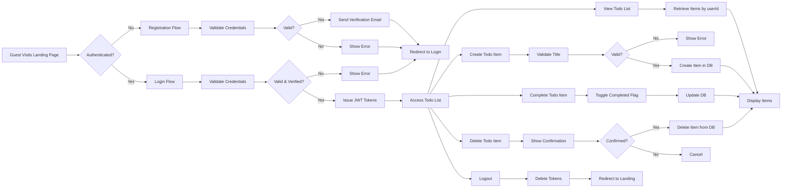

# Todo List Application - Requirements Specification

## Service Overview

### Vision

The Todo List application is designed to provide a minimal, intuitive, and private task management solution for individuals seeking to organize their daily activities. The service enables users to capture, track, and complete personal tasks with complete data isolation, ensuring that no user can access or interfere with another user's information. This service transforms the concept of a simple digital to-do list into a secure, reliable, and scalable personal productivity tool that respects user privacy above all else.

The vision is to become the simplest, most trusted platform for personal task management — where users can rely on the system to keep their private thoughts organized without fear of exposure, leakage, or unwanted cross-user interference. The service doesn't aim to compete with feature-rich productivity suites; instead, it focuses on excellence in a single, critical domain: secure, private task management.

### Problem Statement

Individuals need a simple way to manage their personal tasks, but existing solutions often suffer from critical shortcomings:

- **Privacy violations**: Many task apps store data in a way that allows potential cross-user access, data mining, or account compromise
- **Overcomplication**: Feature-rich apps introduce unnecessary complexity for users who only need basic task tracking
- **Data ownership concerns**: Users don't always control their own data, especially in free-tier services
- **Inconsistent experience**: Cross-device synchronization problems and unreliable data persistence

The absence of a truly private, minimalist task management system creates a gap in the personal productivity market. Users are forced to either use overly complex applications with bloated features or accept the risks of inadequate data isolation.

The Todo List application solves these problems by:

1. Guaranteeing absolute data isolation — each user's tasks are accessible only to them
2. Eliminating all non-essential features to provide a focused, clean experience
3. Implementing industry-standard security practices from the ground up
4. Ensuring data persistence without requiring user management of backups

This approach addresses the fundamental anxiety that users experience when managing personal tasks in systems that may unintentionally expose their information.

### Core Value Proposition

The Todo List application delivers unmatched value through three core pillars:

1. **Guaranteed Privacy** — Unlike other task applications that may share data internally, use cloud-based aggregation, or have potential for cross-user access, this system ensures every user's todo list is completely isolated. A user cannot see, access, modify, or even know about another user's tasks — not even system administrators can access individual task content.

2. **Minimalist Efficiency** — The application includes only the essential features: user registration, login, creating tasks, marking tasks as complete, deleting tasks, and logging out. There are no reminders, categories, recurring tasks, sharing features, or collaboration tools. This elimination of complexity ensures users can accomplish their goal — organizing personal tasks — without distraction.

3. **Reliable Foundation** — Built with enterprise-grade backend architecture using TypeScript, NestJS, and Prisma, the system ensures data integrity, secure authentication, and consistent performance. Users can trust that their tasks will be saved reliably and accessible exactly when needed.

The value proposition is simple: "Manage your private tasks without worry. No clutter. No exposure. Just your list."

### Business Model

#### Why This Service Exists

This service addresses a universal human need: the desire to organize personal responsibilities without exposing them to potential surveillance or data harvesting. The market is saturated with productivity apps that monetize user data through advertising, analytics, or premium feature upsells — often at the cost of privacy. This application flips that model by prioritizing privacy as a core value, not an afterthought.

The target user is an individual who:

- Values personal privacy above all
- Needs to track basic tasks: "Buy milk", "Call mom", "Finish report"
- Has been burned by apps that track behavior or require unnecessary permissions
- Doesn't need collaboration, calendar sync, or team features
- Wants to own their data without relying on cloud storage intermediaries

The competition (like Todoist, Microsoft To Do, Google Keep) offers many features users don't need. This service competes by being the opposite: intentionally minimal, focused, and private.

#### Revenue Strategy

The Todo List application follows a sustainable, privacy-first revenue model:

- **Freemium Tier (Free)**: Unlimited todo items, basic authentication, secure data storage — entirely free with no ads, no tracking, no feature restrictions.
- **Premium Tier ($2/month or $20/year)**: Offers optional enhancements that do not compromise privacy:
  - Custom themes and interface styling
  - Export tasks in CSV/JSON format (for backup and portability)
  - Advanced search within tasks (e.g., find all tasks with "meeting" in text)
  - Priority customer support (email-based)

No advertising, no data monetization, no third-party tracking. Revenue is derived exclusively from voluntary user support for a service they value.

A secondary revenue stream may be developed in the future with **enterprise licenses** for organizations that need to provide a privacy-compliant task system to employees without exposing their data to external SaaS platforms.

#### Growth Plan

User acquisition will be community-driven and reputation-based:

1. **Organic Growth via Privacy Advocates**: Target users in privacy-conscious communities (developers, journalists, activists, researchers) who value data sovereignty
2. **Content Marketing**: Publish educational content on the importance of private task management; demonstrate how common apps leak data
3. **Word-of-Mouth**: Encourage satisfied users to share the application as "the only task app I actually trust"
4. **Open Source Transparency**: Make the backend codebase available for audit (not frontend) to build trust through transparency
5. **No Paid Advertising**: Avoid performance marketing to maintain the privacy-focused ethos

The growth philosophy is "small but loyal" — prioritizing user trust over rapid scaling.

#### Success Metrics

The success of this application will be measured by qualitative and quantitative indicators aligned with its privacy-first mission:

- **User Retention Rate**: >80% of registered users active monthly (indicating satisfaction and trust)
- **Customer Satisfaction Score**: >4.8/5.0 via anonymous yearly surveys
- **Support Ticket Volume**: <3 tickets per 1000 users monthly (indicating minimal usability issues)
- **Privacy Audit Compliance**: Zero confirmed data exposure incidents
- **Premium Conversion Rate**: 3-5% of users upgrading to premium (industry standard for value-based pricing)
- **User Acquisition Cost**: < $0.50 per user via organic channels (low-cost growth)
- **Daily Active Users (DAU)/Monthly Active Users (MAU)**: Ratio > 0.6 (indicating habitual use)

Unlike competing applications, success is not measured by user count alone, but by depth of trust, retention, and ethical integrity. A service with 10,000 deeply satisfied, privacy-conscious users is more valuable than one with 1,000,000 transient users who distrust the platform.

This service’s ultimate measure of success is when a user says: "This is the only app I don’t feel guilty about using."

## User Actors and Access Control

### Actors

The Todo List application defines three distinct user actors, each with specific roles and permissions that determine their access to system functionality.

#### User
- **Primary actor** for the system
- Individual who registers and manages their personal todo lists
- Has complete control over their own data
- Cannot access or modify any data belonging to other users

#### Guest
- **Unauthenticated visitor** to the application
- Can view public landing page and application information
- Has no access to any private functionality including todo list management
- Must authenticate to access application features

#### Admin
- **System administrator** with elevated privileges
- Cannot create or manage personal todo lists
- Has access to user management and system monitoring capabilities
- Responsible for maintaining system integrity and user account health

### Authorization Model

#### Access Control Rules

WHEN a user attempts to access a todo list, THE system SHALL verify that the user's ID matches the owner ID of the requested list.

IF a user attempts to access another user's todo list, THEN THE system SHALL return HTTP 403 Forbidden status with error code ACCESS_DENIED.

THE system SHALL enforce strict isolation between user data at the database and application layer.

WHERE a user has authenticated, THE system SHALL grant access to all personal todo list functionality.

THE admin actor SHALL have read-only access to user account metadata for system monitoring purposes.

WHEN an admin attempts to view user data, THE system SHALL log the action for audit purposes.

#### Permission Matrix

| Action | User | Guest | Admin |
|--------|------|-------|-------|
| View public landing page | ✅ | ✅ | ✅ |
| Register new account | ✅ | ✅ | ❌ |
| Login to account | ✅ | ❌ | ✅ |
| View own todo lists | ✅ | ❌ | ✅ |
| Create new todo list | ✅ | ❌ | ✅ |
| Edit own todo items | ✅ | ❌ | ✅ |
| Delete own todo items | ✅ | ❌ | ✅ |
| Mark todo items as complete | ✅ | ❌ | ✅ |
| View other users' todo lists | ❌ | ❌ | ✅ |
| Manage user accounts | ❌ | ❌ | ✅ |
| View system logs | ❌ | ❌ | ✅ |
| Logout from account | ✅ | ❌ | ✅ |
| Request password reset | ✅ | ✅ | ✅ |
| Change own password | ✅ | ❌ | ✅ |
| Revoke all active sessions | ✅ | ❌ | ✅ |

### Access Control Implementation Notes

1. User identification is based on the "sub" claim from JWT token, which maps to the database user ID
2. Data isolation is enforced at the database query layer using explicit user ID filtering
3. All API endpoints validate JWT signatures and extract user identity from claims
4. Admin privileges are determined by the "role" claim in the JWT token
5. The application has no endpoint that accepts user ID parameters from request body or URL without JWT validation

> *Developer Note: This document defines **business requirements only**. All technical implementations (architecture, APIs, database design, etc.) are at the discretion of the development team.*

## Core Functionality Requirements

### Core Features Overview

The Todo List application provides a minimal, privacy-focused task management system designed for individual personal use. The system is intentionally kept simple with no complex features, focusing exclusively on enabling users to manage their own private task lists.

The core functionality revolves around the following essential activities:

- User registration and authentication to establish personal identity
- Secure access to a private todo list accessible only to the authenticated user
- Creation of individual todo items with simple text descriptions
- Status management for todo items (incomplete to complete)
- Deletion of todo items when no longer needed
- Persistent storage of user data that is completely isolated between users

All functionality is designed with single-user privacy as the primary constraint. The system enforces strict access controls to ensure that no user can access, modify, or even view another user's todo lists. This isolation is fundamental to the system's design and will be enforced at every layer of the application.

Users interact with the system through a simple workflow: register, log in, and manage their private todo list. There are no social features, no sharing capabilities, no team collaboration, and no external integrations beyond the essential authentication and persistence layers.

### Todo List Management

Every authenticated user is automatically granted a private todo list upon successful login. This list is created automatically by the system and is never shared with any other user.

#### List Structure
- The todo list is an ordered collection of todo items
- Each user has exactly one todo list
- The list has no name or title—users work with their one and only personal list
- Items in the list have no hierarchical structure (no subtasks, no categories)
- Items are ordered chronologically by creation date

#### List Access Rules
- THE system SHALL allow a user to access their own todo list only after successful authentication
- THE system SHALL prevent any user from accessing another user's todo list
- THE system SHALL return a 403 Forbidden error if a guest or unauthorized user attempts to access list data
- THE system SHALL display an empty list to new users who have not yet created any todo items

#### List Persistence
- THE system SHALL persist a user's todo list across sessions using secure data storage
- THE system SHALL restore a user's todo list automatically upon login
- THE system SHALL maintain list integrity and order during persistent storage and retrieval
- THE system SHALL NOT allow list data to be modified by any means other than the user who owns the list

### Item Creation

Users can create new todo items to track tasks they need to complete. Each item is a simple text item with no additional metadata.

#### Creation Process
- WHEN a user submits a new todo item via the API (via POST /api/todos), THE system SHALL create a new todo item with the provided text
- THE system SHALL assign a unique identifier to each created item
- THE system SHALL automatically set the item status to "incomplete" upon creation
- THE system SHALL timestamp the creation time of each item
- THE system SHALL associate the new item exclusively with the authenticated user's ID

#### Creation Constraints
- WHEN a user attempts to create a todo item with an empty or whitespace-only description, THE system SHALL reject the request with a 400 Bad Request
- IF the item description exceeds 500 characters, THEN THE system SHALL reject the request with a 400 Bad Request
- IF the request contains no description field, THEN THE system SHALL reject the request with a 400 Bad Request
- WHERE user authentication is invalid or missing, THE system SHALL reject the request with a 401 Unauthorized

### Item Status Management

Each todo item has a simple binary state: incomplete or complete. Users may toggle between these states to reflect task progress.

#### Status Change Rules
- WHEN a user marks a todo item as complete, THE system SHALL update the item's status to "complete" and record the completion timestamp
- WHEN a user marks a todo item as incomplete, THE system SHALL update the item's status to "incomplete" and remove the completion timestamp
- THE system SHALL maintain the original creation timestamp regardless of status changes
- THE system SHALL allow users to toggle status back and forth as many times as they wish

#### Status Change Process
- WHEN a user submits a PATCH request to /api/todos/{id} with a "completed" flag, THE system SHALL update the status of the specified item
- THE system SHALL validate that the user requesting the change owns the item
- IF the item ID does not exist, THEN THE system SHALL return a 404 Not Found
- IF the item ID belongs to a different user, THEN THE system SHALL return a 403 Forbidden

### Item Deletion

Users may remove todo items from their list when they are no longer relevant or have been resolved.

#### Deletion Process
- WHEN a user sends a DELETE request to /api/todos/{id}, THE system SHALL permanently remove the specified item from their list
- THE system SHALL validate that the user deleting the item is the owner of the item
- THE system SHALL NOT allow deletion of items belonging to other users
- THE system SHALL perform a hard delete—the item data will be permanently removed from storage

#### Deletion Constraints
- IF the item ID does not exist, THEN THE system SHALL return a 404 Not Found
- IF the user attempts to delete an item they do not own, THEN THE system SHALL return a 403 Forbidden
- IF the user sends a delete request without authentication, THE system SHALL return a 401 Unauthorized
- THE system SHALL NOT allow batch deletion—each item must be deleted individually

### Data Persistence

User data must be securely stored and made available across sessions.

#### Storage Requirements
- THE system SHALL store user authentication data (hashed passwords, user ID) using industry-standard cryptographic methods
- THE system SHALL store todo list items in a relational database with proper indexing
- THE system SHALL encrypt all personal data at rest
- THE system SHALL isolate each user's data using row-level security policies
- THE system SHALL never store user data in client-side cache without explicit user consent

#### Data Retention
- THE system SHALL retain user data indefinitely unless requested to be deleted
- When a user deletes their account, THE system SHALL permanently erase all associated todo list items
- THE system SHALL NOT retain any data from deleted accounts beyond the immediate session termination
- THE system SHALL maintain audit logs of data access for security compliance purposes

#### Data Integrity
- THE system SHALL ensure referential integrity between users and their todos
- THE system SHALL prevent orphaned todos by enforcing foreign key relationships
- WHEN a user is deleted, THE system SHALL cascade delete all associated todos
- THE system SHALL validate all data inputs before persistence to prevent injection attacks

### Performance Expectations

Users have clear expectations regarding system responsiveness.

#### Response Time Requirements
- WHEN a user logs in, THE system SHALL respond within 1 second in 99% of cases
- WHEN a user requests their todo list, THE system SHALL respond within 500 milliseconds in 99% of cases
- WHEN a user creates a new todo item, THE system SHALL respond within 300 milliseconds in 99% of cases
- WHEN a user updates todo status, THE system SHALL respond within 200 milliseconds in 99% of cases
- WHEN a user deletes a todo item, THE system SHALL respond within 200 milliseconds in 99% of cases

#### Load Capacity
- THE system SHALL support 10,000 concurrent users without degradation in response time
- THE system SHALL handle 1,000 requests per minute without error
- THE system SHALL maintain acceptable performance with up to 1,000 todo items per user

#### Availability
- THE system SHALL be available 99.9% of the time
- THE system SHALL have automatic failover procedures in place to ensure continuous service
- WHEN a service outage occurs, THE system SHALL return a 503 Service Unavailable with a clear message to users

### Business Rules for Security and Privacy

#### User Data Isolation
- THE system SHALL prevent any form of cross-user data access
- THE system SHALL implement strict access control at the database query level
- THE system SHALL use user-specific query filters for all database operations
- THE system SHALL never return data from one user in response to another user's request

#### Authentication Security
- THE system SHALL use JWT tokens for all authenticated requests
- THE system SHALL expire access tokens after 15 minutes
- THE system SHALL issue refresh tokens that expire after 7 days
- THE system SHALL validate token signatures strictly on every request
- THE system SHALL prohibit token reuse or token theft through secure storage practices

#### Input Validation
- THE system SHALL validate all incoming request data before processing
- THE system SHALL reject malformed JSON payloads
- THE system SHALL sanitize all string inputs to prevent XSS attacks
- THE system SHALL reject any non-text data in todo item descriptions
- WHERE an item description contains HTML content, THE system SHALL either escape it or reject it

#### Error Handling
- IF user authentication fails, THEN THE system SHALL return 401 Unauthorized without revealing why
- IF the requested resource belongs to another user, THEN THE system SHALL return 403 Forbidden without revealing existence of the resource
- IF an item ID is invalid, THEN THE system SHALL return 404 Not Found without indicating whether the identifier was syntactically correct
- WHEN an internal server error occurs, THE system SHALL log the error internally but return only a 500 Internal Server Error to the user

## User Workflows

### User Registration Flow

The registration flow enables guests to create a new user account with secure authentication credentials. This is the first interaction point for all new users.

#### Registration Process

WHEN a guest visits the application homepage, THE system SHALL display a registration form with email and password fields.

WHEN a guest submits a registration form with a valid email address and password (minimum 8 characters), THE system SHALL create a new user account with a unique userId.

WHEN a guest submits a registration form with an email address that already exists in the system, THE system SHALL return an error message "Email already registered" and prevent account creation.

WHEN a guest submits a registration form with a password shorter than 8 characters, THE system SHALL return an error message "Password must be at least 8 characters long" and prevent account creation.

WHEN a guest submits a registration form with an email address that is not in valid email format, THE system SHALL return an error message "Please enter a valid email address" and prevent account creation.

WHILE the registration request is being processed, THE system SHALL display a loading indicator to the user.

IF the system fails to create the account due to a server error, THEN THE system SHALL display a generic error message "Registration failed. Please try again later." and log the error for debugging purposes.

IF the registration is successful, THEN THE system SHALL send a verification email to the provided email address with a unique token.

IF the user attempts to register twice with the same email without verifying, THEN THE system SHALL keep the original unverified account and send a new verification email.

#### Registration Success Flow

WHEN the user receives the verification email, THE system SHALL allow them to click a unique verification link contained within.

WHEN the user clicks the verification link, THE system SHALL validate the token and activate the user account.

WHEN the user account is activated, THE system SHALL redirect the user to the login page with a success message "Your account has been verified. You can now log in."

WHILE the account remains unverified, THE system SHALL prevent the user from logging in and display a message "Please verify your email address to log in."

#### Registration Failure Scenarios

IF the email service fails to deliver the verification email, THEN THE system SHALL display a message "We couldn't send the verification email. Please try registering again or contact support." and allow the user to retry registration.

IF the user doesn't verify their email within 7 days, THEN THE system SHALL automatically delete the unverified account and allow the email to be reused for a new registration.

### User Login Flow

The login flow authenticates registered users and establishes a secure session. This workflow is the essential entry point to access personal todo lists.

#### Authentication Process

WHEN a user attempts to log in with their email and password, THE system SHALL validate the credentials against the stored hash.

WHEN the provided email and password combination is correct, THE system SHALL generate a JSON Web Token (JWT) with the following payload structure:

{
  "userId": "unique-identifier",
  "role": "user",
  "permissions": ["read_todos", "write_todos", "delete_todos"],
  "iat": 1678901234,
  "exp": 1678904834
}

WHEN the provided email or password is incorrect, THE system SHALL return an HTTP 401 error with error code AUTH_INVALID_CREDENTIALS.

WHEN the user account is not yet verified, THE system SHALL return an HTTP 401 error with error code AUTH_EMAIL_NOT_VERIFIED.

WHEN the user account has been permanently deactivated by an administrator, THE system SHALL return an HTTP 401 error with error code AUTH_ACCOUNT_DEACTIVATED.

WHILE login credentials are being validated, THE system SHALL display a loading indicator to the user.

IF the login attempt fails due to network connectivity issues, THEN THE system SHALL display a message "Unable to connect to server. Please check your internet connection and try again."

#### Session Management

THE system SHALL store the JWT access token in browser localStorage.

THE access token SHALL expire after 30 minutes of inactivity.

WHEN the access token expires, THE system SHALL redirect the user to the login page and display "Your session has expired. Please log in again."

THE system SHALL provide a refresh token mechanism:

WHEN the access token expires, THE system SHALL use the refresh token (stored separately in httpOnly cookie) to request a new access token automatically.

WHEN the refresh token is valid and not expired, THE system SHALL issue a new access token with a 30-minute expiration.

WHEN the refresh token has expired (7 days after issuance), THE system SHALL require the user to log in again with their credentials.

WHEN the user manually logs out, THE system SHALL delete both the access token from localStorage and the refresh token from the httpOnly cookie.

### Todo List Access Flow

The todo list access flow ensures that each user can only access their own private todo items. User isolation is enforced at the application layer.

#### Access Authorization

WHEN a logged-in user navigates to the todo list page, THE system SHALL retrieve all todo items associated with the userId from the JWT token.

WHEN a logged-in user attempts to access todo items belonging to another userId, THE system SHALL return an empty array and log a security event.

WHERE the user has the permission "read_todos", THE system SHALL return the user's complete todo list in chronological order (oldest first).

WHEN the user has no todo items, THE system SHALL display a message "You have no tasks yet. Create your first task above!"

WHILE the todo list is being loaded from the database, THE system SHALL display a loading state with placeholder skeletons.

IF the database connection fails during todo retrieval, THEN THE system SHALL display a message "Could not load tasks. Please check your connection and try again." and retry the request after 5 seconds.

#### Data Isolation Rules

THE system SHALL enforce strict tenant isolation so that no user can access, view, or manipulate another user's todo items.

THE system SHALL use the userId from the JWT token as the only filter for all todo data queries, even when the user manipulates URL parameters.

WHERE a user attempts to send HTTP POST/GET/PUT/DELETE requests with a different target userId in the request body or parameters, THE system SHALL ignore any userId provided by the client and use only the authenticated userId from the JWT token.

IF the JWT token is missing, malformed, or tampered with, THEN THE system SHALL return HTTP 401 Unauthorized.

### Todo Item Creation Flow

The todo item creation workflow allows users to add new tasks to their personal list. This is the primary interaction for completing objectives.

#### Task Creation Process

WHEN a user clicks the "Add Task" button, THE system SHALL display an input field with placeholder text "What needs to be done?"

WHEN a user enters text into the task input field and clicks "Save", THE system SHALL validate the input.

IF the task title is empty or contains only whitespace, THEN THE system SHALL display an error message "Task title cannot be empty" and not create the task.

IF the task title exceeds 200 characters, THEN THE system SHALL display an error message "Task title cannot exceed 200 characters" and not create the task.

WHEN the task title is valid, THE system SHALL create a new todo item with the following properties:

{
  "id": "uuid-v4",
  "title": "entered text",
  "completed": false,
  "createdAt": "ISO 8601 timestamp",
  "updatedAt": "ISO 8601 timestamp",
  "userId": "authenticated user id from JWT"
}

WHEN the todo item is successfully created, THE system SHALL add the new item to the top of the todo list and clear the input field.

WHEN the todo item creation request fails due to a server error, THE system SHALL display a message "Failed to create task. Please try again." and retain the input in the field for the user to try again.

WHEN the user enters special characters (including emoji, non-Latin scripts, and unicode), THE system SHALL accept and store them unchanged.

WHEN the user presses Enter while typing in the task input field, THE system SHALL behave identically to clicking "Save".

### Todo Item Completion Flow

The completion workflow allows users to mark tasks as finished, providing a sense of accomplishment and organization.

#### Status Management

WHEN a user clicks the checkbox next to a todo item, THE system SHALL toggle the "completed" property of that item.

WHEN the item status changes from incomplete to complete, THE system SHALL update the "updatedAt" field to the current timestamp.

WHEN the item status changes from complete to incomplete, THE system SHALL update the "updatedAt" field to the current timestamp.

WHEN a todo item has been completed, THE system SHALL visually display it with strikethrough text and a subtle gray color.

WHILE the completion status change is being processed, THE system SHALL show a small loading spinner next to the checkbox.

IF the status update fails due to network issues, THEN THE system SHALL revert the checkbox to its previous state and display a message "Could not update task status. Please try again.".

WHEN the user refreshes the page, THE system SHALL restore the completion status of all items as they were before the refresh.

THE system SHALL preserve the completion status of todo items across device restarts and browser sessions.

### Todo Item Deletion Flow

The delete workflow removes unwanted tasks from a user's personal list. This provides a way to clean up completed items or tasks that are no longer relevant.

#### Deletion Process

WHEN a user clicks the "Delete" button next to a todo item, THE system SHALL display a confirmation dialog with text "Are you sure you want to delete this task? This action cannot be undone."

WHEN the user confirms deletion in the dialog, THE system SHALL remove the todo item from the database permanently.

WHEN the deletion is successful, THE system SHALL remove the todo item from the UI immediately.

WHEN the deletion fails due to network issues, THE system SHALL display a message "Failed to delete task. Please try again." and retain the item in the list.

WHEN the user clicks "Cancel" in the confirmation dialog, THE system SHALL do nothing and close the dialog.

IF the user attempts to delete a todo item that does not belong to their userId, THEN THE system SHALL return HTTP 403 Forbidden and log a security alert.

IF the deletion request contains a malformed taskId or invalid format, THEN THE system SHALL return HTTP 400 Bad Request.

### User Logout Flow

The logout flow terminates the user's authenticated session and returns them to the anonymous guest state.

#### Session Termination

WHEN a user clicks the "Logout" button in the navigation menu, THE system SHALL delete the access token from localStorage.

WHEN the access token is deleted from localStorage, THE system SHALL delete the refresh token from the httpOnly cookie.

WHEN both tokens are removed, THE system SHALL redirect the user to the landing page.

WHEN the user is redirected to the landing page after logout, THE system SHALL display a message "You have been logged out."

WHEN a user attempts to navigate directly to the todo list page after logout, THE system SHALL redirect the user to the landing page and display "Please log in to access your tasks.".

WHILE the logout request is being processed, THE system SHALL display a loading indicator in the navigation menu.

IF the logout request fails due to server connectivity issues, THEN THE system SHALL display a message "Could not log out. Please refresh the page." and retain the user's login session.

## System Context

This document covers all user workflows for the todo list application as defined in the authentication and authorization requirements. All flows are designed around the user actor model with three actors: guest (unauthenticated), user (authenticated), and admin (system administrator with special privileges).

All business rules and functional requirements have been expressed using EARS format with English keywords to ensure clarity for backend developers implementing these flows.

The authentication system follows industry-standard JWT practices with refresh token rotation to maintain security and usability.

All user data isolation is enforced at the application layer using the userId from the authenticated JWT token as the only source of truth for data queries.

No other workflows, features, or user interactions beyond these seven core flows are required for this minimal application.

## User Workflows Diagram

### Diagram Legend

- **A**: Guest interaction start point
- **B**: Authentication state check
- **C**: Registration workflow
- **D**: Login workflow
- **E, J**: Credential validation
- **F, K**: Validation outcome checks
- **G**: Email verification process
- **H**: Login page redirect
- **L**: Token issuance
- **N**: Dashboard access
- **O, P, Q, R**: Core todo management actions
- **S**: Logout initiation
- **AF**: Token removal
- **AG**: Landing page return
- **T**: Input validation
- **U**: Validation check
- **V**: Data creation
- **W**: Error display
- **X**: Data retrieval
- **Y**: UI display
- **Z**: Status toggle
- **AA**: Database update
- **AB, AC, AD, AE**: Delete confirmation logic
- **AF, AG**: Logout completion

All paths lead back to a consistent user experience where users can only interact with their own data.

> *Developer Note: This document defines **business requirements only**. All technical implementations (architecture, APIs, database design, etc.) are at the discretion of the development team.*