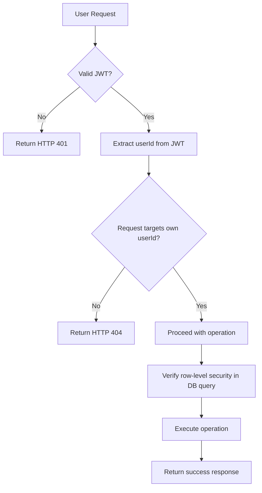

# Multi-User Todo Application - Requirements Specification

## Service Overview

This application enables individual users to manage personal todo lists with full lifecycle control, including creation, editing, deletion, filtering, and recovery of deleted items. All data is isolated per user, with no cross-user visibility or access permitted. The system enforces strict privacy and data ownership through authenticated sessions, JWT validation, and row-level database security.

## User Authentication and Authorization

### Authentication Flow

WHEN a user attempts to sign up, THE system SHALL accept a valid email address and password that meets minimum complexity requirements (minimum 8 characters, containing letters and numbers).

WHEN a user attempts to log in, THE system SHALL validate the provided email and password against the stored hashed credentials.

WHILE a user is authenticated, THE system SHALL maintain a secure, server-side session with an associated JWT access token and refresh token.

IF the user provides invalid credentials during login or signup, THEN THE system SHALL return HTTP 401 with error code AUTH_INVALID_CREDENTIALS.

IF the user attempts to sign up with an email that already exists, THEN THE system SHALL return HTTP 409 with error code AUTH_EMAIL_ALREADY_USED.

WHEN a user successfully logs in, THE system SHALL generate a JWT access token (expiration: 20 minutes) and a refresh token (expiration: 30 days).

WHEN a user requests to change their password, THE system SHALL require current password verification and enforce new password policy.

WHEN a user deletes their account, THE system SHALL immediately revoke all active tokens and permanently delete all associated user data including todos and edit history.

### User Actor Definition (member)

THE system SHALL have exactly one user actor type: member.

THE member actor SHALL be an authenticated user who can:
- Create, view, edit, complete, and delete their own todos
- View and manage their own edit history
- Edit their display name profile
- View and manage their own trash
- Sign up, log in, change password, and delete their account

THE member actor SHALL NOT be able to:
- View, access, or interact with any data belonging to other users
- Access administrative functions or system configuration
- Create guest accounts or delegate access
- Modify system-wide settings or global configurations

THE system SHALL enforce strict data isolation at both API and database levels so that member actors can ONLY query and modify records that belong to their own userId.

### JWT Payload Structure

THE system SHALL use JSON Web Tokens (JWT) for all authentication sessions.

WHEN generating a JWT access token, THE system SHALL include the following payload fields:
- sub: string (userId as UUIDv4)
- role: string (always "member")
- permissions: Array<string> (always ["read:todos", "write:todos", "delete:todos", "read:profile", "write:profile", "delete:profile", "read:history", "write:history", "read:trash", "write:trash"])
- iat: number (UNIX timestamp of issuance)
- exp: number (UNIX timestamp of expiration, 20 minutes after iat)

WHEN generating a refresh token, THE system SHALL be a separate, cryptographically secure string stored server-side with a 30-day expiration.

### Token Expiration Policy

WHILE a user is actively using the system, THE system SHALL extend access token validity to 20 minutes.

WHEN a user's access token expires, THE system SHALL allow refreshing the token using a valid refresh token.

WHEN a refresh token is used, THE system SHALL issue a new access token and a new refresh token (rotating refresh token).

WHILE a user is inactive for more than 30 days, THEN THE system SHALL expire the refresh token and require re-authentication.

WHEN a user logs out, THEN THE system SHALL immediately revoke the current refresh token and mark it as invalid.

WHEN a user deletes their account, THEN THE system SHALL permanently delete all refresh tokens associated with that userId.

### Sessions and Refresh Tokens

THE system SHALL store refresh tokens in a secure, encrypted database table linked to userId.

WHEN a refresh token is used, THE system SHALL rotate it - invalidating the old one and generating a new one.

WHEN a refresh token is not found or is marked invalid, THEN THE system SHALL require the user to log in again.

THE system SHALL invalidate all refresh tokens when a user changes their password.

THE system SHALL invalidate all refresh tokens when a user deletes their account.

### Secret Key Management

THE system SHALL use a cryptographically secure 256-bit HS256 secret key for JWT signing.

THE system SHALL store the JWT secret key as an environment variable (JWT_SECRET) on the server.

THE system SHALL NEVER commit or log the JWT secret key in source code, logs, or version control.

WHEN the JWT secret key is rotated, THE system SHALL support backward compatibility for active tokens for up to 1 hour.

### Data Scope Isolation

WHILE a user makes any API request, THE system SHALL validate that all requested resources belong to the userId in the JWT payload.

IF a user attempts to access a todo, edit history entry, or trash item that does not belong to their userId, THEN THE system SHALL return HTTP 404 NOT FOUND - not any form of 403.

THE system SHALL implement row-level security at the database level so that all queries to todos, edit history, and trash tables use userId as an implicit filter.

WHERE a database query does not contain userId in the WHERE clause, THEN THE system SHALL reject the request as a potential security vulnerability.

THE system SHALL NEVER expose userId in API responses unless it is the authenticated user's own userId.

THE system SHALL ensure all API endpoints automatically enforce data isolation as a core requirement - no exceptions.

## User Profile Management

### Profile Creation

WHEN a user signs up, THE system SHALL automatically create a profile record with the following initial values:
- displayName: the email address up to the @ symbol (e.g., "johndoe" for "johndoe@example.com")
- createdAt: current timestamp
- updatedAt: current timestamp

WHEN a user's profile is created, THE system SHALL link it to the user's userId in the database.

### Display Name Edit

WHEN a user requests to change their display name, THE system SHALL accept a string input between 1 and 50 characters.

THE system SHALL validate that the new display name does not contain only whitespace characters.

WHEN the display name is updated successfully, THE system SHALL update the profile record's displayName and set updatedAt to the current timestamp.

IF the display name is empty or contains only whitespace, THEN THE system SHALL return HTTP 400 with error code PROFILE_INVALID_DISPLAY_NAME.

IF the display name exceeds 50 characters, THEN THE system SHALL return HTTP 400 with error code PROFILE_DISPLAY_NAME_TOO_LONG.

### Privacy Enforcement

THE system SHALL NOT allow any user to view another user's profile.

WHEN a request is made to read a profile that does not match the authenticated user's userId, THEN THE system SHALL return HTTP 404 NOT FOUND.

WHEN a request is made to update a profile that does not match the authenticated user's userId, THEN THE system SHALL return HTTP 404 NOT FOUND.

### Data Accessibility

THE user's profile data (displayName, createdAt, updatedAt) SHALL be accessible ONLY to the authenticated user via the GET /profile endpoint.

THE user's profile data SHALL NOT be exposed in any other API responses, including todo lists or trash listings.

### Input Validation Rules

THE system SHALL enforce the following validation rules for display name:
- Must be between 1 and 50 characters
- Must not be only whitespace
- Must not contain control characters
- Must be non-empty after trimming

## Todo Creation

### Todo Creation Process

WHEN a user creates a todo, THE system SHALL require a title field.

WHEN a user creates a todo, THE system SHALL accept an optional description field.

WHEN a user creates a todo, THE system SHALL accept an optional startDateTime field in ISO 8601 format.

WHEN a user creates a todo, THE system SHALL accept an optional dueDateTime field in ISO 8601 format.

WHEN a todo is created, THE system SHALL set completed to false by default.

WHEN a todo is created, THE system SHALL set createdAt to the current timestamp.

WHEN a todo is created, THE system SHALL set updatedAt to the current timestamp.

WHEN a todo is created, THE system SHALL link it to the authenticated user's userId.

IF the title is empty or consists only of whitespace, THEN THE system SHALL return HTTP 400 with error code TODO_TITLE_REQUIRED.

IF the title exceeds 200 characters, THEN THE system SHALL return HTTP 400 with error code TODO_TITLE_TOO_LONG.

IF the description exceeds 1000 characters, THEN THE system SHALL return HTTP 400 with error code TODO_DESCRIPTION_TOO_LONG.

IF the startDateTime is provided but is not a valid ISO 8601 timestamp, THEN THE system SHALL return HTTP 400 with error code TODO_INVALID_START_DATE.

IF the dueDateTime is provided but is not a valid ISO 8601 timestamp, THEN THE system SHALL return HTTP 400 with error code TODO_INVALID_DUE_DATE.

IF the dueDateTime is provided and is earlier than the startDateTime, THEN THE system SHALL return HTTP 400 with error code TODO_DUE_BEFORE_START.

### Title Requirements

THE title SHALL be a required string of 1 to 200 characters.

THE title SHALL be trimmed of leading and trailing whitespace before storage.

THE title SHALL be stored exactly as trimmed (no further normalization).

### Description Handling

THE description SHALL be an optional string up to 1000 characters.

THE description SHALL be stored as provided, with no automatic formatting.

IF description is not provided, THE system SHALL store it as NULL.

### Start Date & Due Date Rules

THE startDateTime SHALL be a valid ISO 8601 timestamp (YYYY-MM-DDTHH:mm:ss.sssZ).

THE dueDateTime SHALL be a valid ISO 8601 timestamp (YYYY-MM-DDTHH:mm:ss.sssZ).

THE startDateTime and dueDateTime SHALL be stored as UTC timestamps.

WHEN startDateTime or dueDateTime is null, THE system SHALL treat it as "not set".

### Default Completion Status

WHEN a todo is created, THE system SHALL set the completed flag to false by default.

THE completed flag SHALL NOT be settable during creation.

THE completed flag SHALL only be modified through the toggle endpoint.

### Validation Rules

THE system SHALL validate all fields according to the rules above before creating a todo.

THE system SHALL return appropriate HTTP 400 errors for invalid inputs.

THE system SHALL NOT create a todo record if any validation rule fails.

## Todo Viewing and List Retrieval

### List Retrieval Process

WHEN a user requests their todo list, THE system SHALL return all todos owned by the authenticated user where deletedAt is NULL.

WHEN a user requests their todo list, THE system SHALL apply pagination based on the offset and limit parameters.

WHEN a user requests their todo list, THE system SHALL apply filtering based on the completed parameter.

WHEN a user requests their todo list, THE system SHALL apply sorting based on the sortBy and sortOrder parameters.

THE system SHALL return the count of all matching todos in the response header (X-Total-Count).

THE list SHALL include the following fields for each todo:
- id: UUIDv4
- title: string
- completed: boolean
- startDateTime: ISO 8601 timestamp or null
- dueDateTime: ISO 8601 timestamp or null
- createdAt: ISO 8601 timestamp

### Pagination Parameters

THE list SHALL be paginated with a default limit of 20 and default offset of 0.

THE maximum allowed limit SHALL be 100.

WHEN the limit exceeds 100, THE system SHALL return HTTP 400 with error code TODO_LIST_LIMIT_TOO_HIGH.

WHEN the offset is negative, THE system SHALL return HTTP 400 with error code TODO_LIST_OFFSET_NEGATIVE.

### Completion Status Filtering

THE system SHALL support three states for the completed filter:

- "all": Return all todos regardless of completion status
- "true": Return only todos where completed is true
- "false": Return only todos where completed is false

WHEN the completed filter is not provided, THE system SHALL default to "all".

WHEN the completed filter is invalid, THE system SHALL return HTTP 400 with error code TODO_LIST_FILTER_INVALID.

### Sorting Options

THE system SHALL support the following sort fields:

- createdAt
- startDateTime
- dueDateTime

THE system SHALL support the following sort orders:

- "asc": ascending (oldest first)
- "desc": descending (newest first)

WHEN the sortBy parameter is not provided, THE system SHALL default to "createdAt".

WHEN the sortOrder parameter is not provided, THE system SHALL default to "desc".

WHEN the sortBy parameter is invalid, THE system SHALL return HTTP 400 with error code TODO_LIST_SORT_BY_INVALID.

WHEN the sortOrder parameter is invalid, THE system SHALL return HTTP 400 with error code TODO_LIST_SORT_ORDER_INVALID.

### Date Handling for Missing Values

WHEN sorting by startDateTime:
- Todos with null startDateTime SHALL appear at the end of the list
- Both ascending and descending orders SHALL treat null as the highest value

WHEN sorting by dueDateTime:
- Todos with null dueDateTime SHALL appear at the end of the list
- Both ascending and descending orders SHALL treat null as the highest value

### Response Structure

THE list response SHALL be a JSON array of todo objects with the fields specified above.

THE total count of matching todos SHALL be included in the HTTP response header X-Total-Count.

THE link to the next page SHALL be included in the HTTP response header Link.

## Todo Toggle (Complete/Incomplete)

### Toggle Mechanism

WHEN a user toggles a todo, THE system SHALL invert the completed status (false → true, true → false).

THE toggle operation SHALL be atomic and transactional.

WHEN a toggle is performed, THE system SHALL update the updatedAt field to the current timestamp.

THE operation SHALL be idempotent - performing the same toggle multiple times SHALL have the same effect as performing it once.

### State Transition Rules

THE system SHALL allow toggling todos regardless of their current state.

THE system SHALL allow toggling todos even if they are in the trash.

THE system SHALL NOT allow toggling todos that belong to other users.

IF the todo does not exist or does not belong to the authenticated user, THEN THE system SHALL return HTTP 404 NOT FOUND.

### Atomic Operation Requirement

THE toggle operation SHALL be performed within a single database transaction.

THE system SHALL ensure that the completed state and updatedAt fields are updated atomically.

### Event Logging

THE system SHALL NOT create a history entry for toggle operations.

Toggle operations SHALL NOT be recorded in the edit history.

### Response Structure

THE toggle response SHALL be a 200 OK with the updated todo object in the response body:
{
  "id": "uuid",
  "title": "string",
  "completed": boolean,
  "startDateTime": "ISO 8601 or null",
  "dueDateTime": "ISO 8601 or null",
  "createdAt": "ISO 8601",
  "updatedAt": "ISO 8601"
}

## Todo Editing and History Tracking

### Editable Fields

THE system SHALL allow editing of the following fields:
- title
- description
- startDateTime
- dueDateTime

THE system SHALL NOT allow editing of:
- id
- completed
- createdAt
- updatedAt
- deletedAt

### Edit Submission Process

WHEN a user edits a todo, THE system SHALL accept a partial update with any combination of the editable fields.

WHEN an editable field is provided in the request, THE system SHALL update that field to the new value.

WHEN an editable field is not provided in the request, THE system SHALL leave it unchanged.

THE system SHALL require the user to be authenticated and own the todo.

### History Entry Creation

WHEN a todo is edited, THE system SHALL create a new history entry.

THE history entry SHALL record the following information:
- todoId: the id of the edited todo
- editedAt: timestamp of the edit
- changes: object containing only fields that were modified
  - title: old value → new value (if title changed)
  - description: old value → new value (if description changed)
  - startDateTime: old value → new value (if startDateTime changed)
  - dueDateTime: old value → new value (if dueDateTime changed)

THE history entry SHALL NOT record unchanged fields.

THE history entry SHALL NOT record createdAt, updatedAt, deletedAt, or completed fields, even if they change.

### Field Change Detection

THE system SHALL detect changes by comparing the current database state with the request payload.

THE system SHALL only record actual changes - if a field's value does not change, it SHALL NOT appear in the history entry.

THE system SHALL compare date fields by their ISO 8601 string representation.

### History Versioning

THE system SHALL maintain an ordered list of edit history entries for each todo.

Edit history entries SHALL be ordered by editedAt descending (most recent first).

There SHALL be no hard limit on the number of history entries per todo, but the system SHALL ensure performance is maintained.

IF a todo has more than 1000 history entries, THE system SHALL log a warning but SHALL NOT prevent further edits.

## Todo Deletion and Soft Delete

### Soft Delete Process

WHEN a user deletes a todo, THE system SHALL set the deletedAt field to the current timestamp.

WHEN a todo is soft-deleted, THE system SHALL NOT remove the todo from the database.

WHEN a todo is soft-deleted, THE system SHALL keep all todo data, including edit history, intact.

WHEN a todo is soft-deleted, THE system SHALL immediately remove it from the normal todo list.

### Visibility in Main List

WHEN retrieving the todo list, THE system SHALL exclude todos where deletedAt is not null.

WHEN retrieving a single todo by id, THE system SHALL exclude todos where deletedAt is not null.

IF a user requests a todo that has been soft-deleted, THE system SHALL return HTTP 404 NOT FOUND.

### Trash Access

WHEN a todo is soft-deleted, THE system SHALL make it available in the trash.

THE trash SHALL contain all todos where deletedAt is not null.

### Data Retention Policy

TODO data SHALL be retained even after deletion.

Edit history SHALL be retained even after deletion.

All data SHALL be permanently deleted only when a user permanently deletes from trash.

### Isolation Guarantee

WHEN a todo is soft-deleted, THE system SHALL ensure that no other user can access it.

THE system SHALL enforce userId ownership at all levels for deleted todos.

### Cascading Effects

Soft deleting a todo SHALL NOT affect:
- Other todos
- Edit history entries
- Trash entries for other todos
- Any other part of the system

## Trash Management

### Trash View Interface

WHEN a user requests their trash, THE system SHALL return all todos owned by the authenticated user where deletedAt is not null.

THE trash view SHALL support pagination with the same parameters as the main list.

THE trash view SHALL support the same sorting options as the main list.

THE trash view SHALL include the same fields as the main list:
- id
- title
- completed
- startDateTime
- dueDateTime
- createdAt
- deletedAt

THE system SHALL return the count of all matching trash items in the response header X-Total-Count.

### Restoration Process

WHEN a user restores a todo from the trash, THE system SHALL set deletedAt to null.

WHEN a todo is restored, THE system SHALL update updatedAt to the current timestamp.

WHEN a todo is restored, THE system SHALL move it back to the main todo list.

WHEN a todo is restored, THE system SHALL NOT recreate edit history - the existing history SHALL remain linked.

IF the todo being restored does not belong to the authenticated user, THEN THE system SHALL return HTTP 404 NOT FOUND.

### Permanent Deletion

WHEN a user permanently deletes a todo from the trash, THE system SHALL delete the todo record AND its entire edit history.

WHEN a todo is permanently deleted, THE system SHALL remove the todo record from the database.

WHEN a todo is permanently deleted, THE system SHALL delete all associated edit history entries.

WHEN a todo is permanently deleted, THE system SHALL not leave orphaned records.

### History Deletion on Permanent Delete

WHEN a todo is permanently deleted from the trash, THE system SHALL delete ALL edit history entries associated with that todo's id.

The deletion of history entries SHALL be atomic with the deletion of the todo record.

### Purge Requirements

There SHALL be no automated purge mechanisms.

All trash items SHALL be retained until explicitly permanently deleted by the user.

## Filtering and Sorting

### Status Filters

THE system SHALL provide the following filters for todo lists:

- "all": show all todos (default)
- "true": show only completed todos
- "false": show only incomplete todos

WHEN no filter is specified, THE system SHALL default to "all".

WHEN an invalid filter is provided, THE system SHALL return HTTP 400 with error code FILTER_INVALID.

### Sorting Fields

THE system SHALL provide the following fields for sorting:

- createdAt
- startDateTime
- dueDateTime

WHEN no sort field is specified, THE system SHALL default to "createdAt".

WHEN an invalid sort field is provided, THE system SHALL return HTTP 400 with error code SORT_BY_INVALID.

### Default Sort Order

THE system SHALL use "desc" (descending) as the default sort order.

WHEN no sort order is specified, THE system SHALL default to "desc".

WHEN an invalid sort order is provided, THE system SHALL return HTTP 400 with error code SORT_ORDER_INVALID.

### Missing Date Handling

WHEN sorting by startDateTime:
- All todos with startDateTime set SHALL be sorted first
- All todos with startDateTime null SHALL appear at the end
- For todos with startDateTime set, sort ascending (earliest first) or descending (latest first) as specified
- For todos with startDateTime null, they shall be treated as having the highest possible date value

WHEN sorting by dueDateTime:
- All todos with dueDateTime set SHALL be sorted first
- All todos with dueDateTime null SHALL appear at the end
- For todos with dueDateTime set, sort ascending (earliest first) or descending (latest first) as specified
- For todos with dueDateTime null, they shall be treated as having the highest possible date value

### Sort Priority

WHEN multiple sort fields are requested (future extensibility), THE system SHALL apply them in order of specification.

The first sort field SHALL have highest priority, second will be secondary, etc.

### Combined Filters

WHEN filters and sorting are used together, THE system SHALL apply filters first, then sorting.

The filter SHALL reduce the result set, then the sorting SHALL order the filtered results.

Example:
- Filter: completed=false
- Sort: dueDateTime asc
- Result: All incomplete todos sorted by dueDateTime (earliest first), todos with no dueDateTime at the end

## Authentication and Authorization Flow Diagram

## Business Model and Privacy Enforcement Summary

This is a private todo application where each user's data is completely isolated.

All data is owned by the authenticated user and is never accessible to others.

There is no concept of sharing, collaboration, or public data.

Data is never shared, transmitted, or exposed beyond the authenticated user's session.

Authentication is mandatory for any operation.

All API endpoints implicitly enforce userId filtering.

The system is designed to be privacy-first with no data leakage possible even through bugs.

Security is not an afterthought - it is built into every layer.

Users have full control over their data, including the ability to permanently delete everything.

No data retention beyond user control.

User data is never used for profiling, analytics, or advertising.

The application exists solely to serve individual productivity needs.
