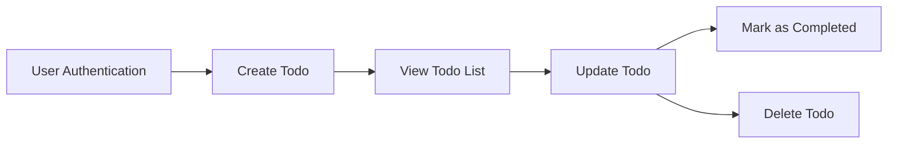

# Minimum Todo List Application Requirements

## 1. Introduction
A Todo list service enables individual users to manage their personal tasks efficiently and securely. The system emphasizes user privacy, ownership, and only the minimal functions required to maintain and organize a personal task list. All requirements are written in business terms, free from implementation detail, and serve as authoritative guidance for backend engineers.

## 2. Business Goals & Scope
- WHEN a user wants to remember and track personal tasks, THE system SHALL provide a secure environment to record, view, update, and manage those tasks without unnecessary features.
- THE system SHALL ensure that only features required for a personal todo list are included, with NO sharing, reminders, tags, or advanced task management tools outside of core requirements.

## 3. Actor and Permission Model
### Actors 
- **user**: A registered customer who manages their own tasks and has exclusive, private access to their information.

### Permissions
- WHEN a user is authenticated, THE system SHALL allow them to create, view, update, mark as completed, and delete their own todo items.
- IF a user is NOT authenticated, THEN THE system SHALL deny access to todo data and modification features.
- WHEN a user attempts to access, update, or delete a todo item, THE system SHALL check that the user is the owner before allowing any action.

## 4. Authentication & Session Management
- WHEN a new user registers, THE system SHALL require a unique email address and password as authentication credentials.
- WHEN a registered user logs in with valid credentials, THE system SHALL create a session granting access to the user's personal todo list only.
- WHEN a user logs out or if authentication fails, THE system SHALL immediately revoke access to all authenticated features and data.
- THE system SHALL enforce that all todo operations (create, view, update, mark as completed, delete) are performed within an active, authenticated session.
- IF a session expires or is invalid, THEN THE system SHALL prompt the user to re-authenticate and block access.

## 5. Feature Requirements
### 5.1 User Registration & Login
- WHEN a user creates an account, THE system SHALL store credentials securely and prevent duplicate registration with the same identifier.
- WHEN a user attempts to log in, THE system SHALL validate the credentials and establish a secure session on success.
- IF authentication fails, THEN THE system SHALL prevent access and provide a clear user-facing error message.

### 5.2 Create Todo
- WHEN an authenticated user enters a new task title (and optional description), THE system SHALL store the todo item and associate it with the user's account.
- IF required fields (such as title) are missing, THEN THE system SHALL reject the request with an explanatory message.

### 5.3 View Todo List
- WHEN an authenticated user requests their todo list, THE system SHALL retrieve and display all todo items associated with that user, including completed and uncompleted tasks.
- IF a user has no todo items, THEN THE system SHALL return an empty list and a clear message indicating there are no results.

### 5.4 Update Todo
- WHEN an authenticated user modifies an existing todo item they own, THE system SHALL allow updates for editable fields: title and (if supported) description.
- IF a user attempts to update a todo not owned by them, THEN THE system SHALL deny the request, display an error message, and log the attempt.

### 5.5 Mark Todo as Completed
- WHEN an authenticated user indicates a todo is complete, THE system SHALL persist this state and reflect it in all future queries for the user.
- IF a user tries to mark a completed state for a todo that does not exist or does not belong to them, THEN THE system SHALL refuse the operation.

### 5.6 Delete Todo
- WHEN an authenticated user requests deletion of one of their todos, THE system SHALL permanently remove it if and only if the item belongs to them.
- IF a user attempts to delete a todo they do not own, THEN THE system SHALL deny the request and show a clear error message.

## 6. Non-Functional Requirements
- THE system SHALL respond to all operations within 2 seconds under normal load.
- THE system SHALL use strong encryption for password storage.
- THE system SHALL ensure all data is stored privately and is inaccessible to any other users or external parties.
- THE system SHALL comply with data retention and privacy best practices applicable for personal productivity tools.
- THE system SHALL display all user-facing messages in clear, simple English; all server logs and internals in English.

## 7. Error Handling & Edge Cases
- WHEN any request is malformed or missing required data, THE system SHALL reject it and provide an actionable error message for the end user.
- IF a user attempts any operation outside their session or permission scope, THEN THE system SHALL prevent it and clearly inform the user.
- WHEN the server encounters unexpected errors, THE system SHALL display a generic failure message (without exposing internal details), and log the error for investigation.
- WHEN a user requests to update or delete a todo that does not exist, THE system SHALL indicate this in the response.
- WHEN a user session expires, THE system SHALL require login before resuming access.

## 8. Visual Model

# End of Requirements