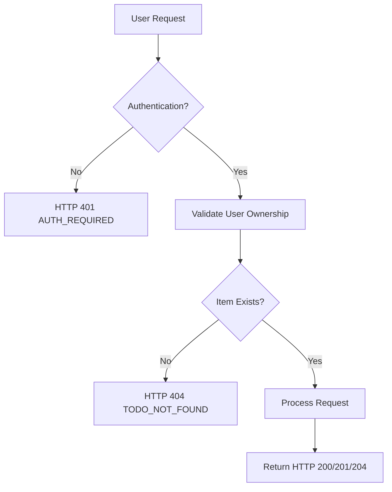

# Todo List Application - Business Requirements Specification

## Service Overview

The Todo List application is a minimal, user-centric productivity tool that enables authenticated members to create, view, update, and delete personal to-do items. The system does not support shared lists, collaboration, or team features. All data is strictly private and owned by the authenticated user. The application is designed for simplicity, reliability, and mobile accessibility.

## Business Model

The Todo List application follows a freemium business model with no monetary transactions in v1. The primary value proposition is providing users with a fast, reliable, and privacy-focused personal task manager. Future monetization may include optional premium features like reminders, recurring tasks, or cross-device synchronization, but these are explicitly out of scope for this version.

The system generates no revenue, collects no advertising data, and does not share user information with third parties.

## User Actors and Permissions

Two distinct user actors are defined for this system:

- **guest**: An unauthenticated visitor to the application. Guests may view the login page and register for an account but cannot interact with todo items in any way. This actor has zero access to the core todo functionality.
- **member**: An authenticated user who has successfully registered and logged in. Members can create, retrieve, update, and delete their own todo items. No member can access, modify, or delete another member's todo items under any circumstance.

All permission logic is enforced server-side. Client-side visibility or UI concealment is not sufficient for security.

## Core Functional Requirements

### Todo Item Creation

WHEN a member attempts to create a new todo item, THE system SHALL validate that the title is provided and not empty. 

WHEN a member attempts to create a new todo item, THE system SHALL validate that the title contains at least one non-whitespace character. 

WHEN a member attempts to create a new todo item, THE system SHALL validate that the title does not exceed 1000 characters in length. 

WHEN a member attempts to create a new todo item, THE system SHALL validate that the description, if provided, does not exceed 5000 characters in length. 

WHEN a member successfully provides a valid title and optional description, THE system SHALL create a new todo item with the following default properties: status set to "pending", createdAt set to the current timestamp, and updatedAt set to the same value as createdAt. 

WHEN a member successfully creates a todo item, THE system SHALL assign the item to the authenticated user's account and ensure other users cannot access it. 

WHEN a guest attempts to create a todo item, THE system SHALL deny the request and return HTTP 401 with error code AUTH_REQUIRED. 

IF the title is empty or contains only whitespace characters, THEN THE system SHALL return HTTP 400 with error code TODO_TITLE_REQUIRED. 

IF the title exceeds 1000 characters, THEN THE system SHALL return HTTP 400 with error code TODO_TITLE_TOO_LONG. 

IF the description exceeds 5000 characters, THEN THE system SHALL return HTTP 400 with error code TODO_DESCRIPTION_TOO_LONG. 

### Todo Item Retrieval

WHEN a member requests to retrieve their todo items, THE system SHALL return all todo items belonging to that user, sorted by createdAt in descending order (newest first). 

WHEN a member requests to retrieve a specific todo item by ID, THE system SHALL validate that the item exists and belongs to the authenticated user. 

WHEN a member requests to retrieve a specific todo item by ID, THE system SHALL return the item's full details including: id, title, description, status, createdAt, and updatedAt. 

WHEN a member requests to retrieve their todo items, THE system SHALL return at most 100 items per page. 

WHEN a member requests to retrieve their todo items with pagination parameters (page and limit), THE system SHALL return the requested page of results, respecting the limit parameter up to 100. 

IF the requested todo item ID does not exist or does not belong to the authenticated user, THEN THE system SHALL return HTTP 404 with error code TODO_NOT_FOUND. 

IF the page parameter is less than 1, THEN THE system SHALL return HTTP 400 with error code PAGINATION_INVALID_PAGE. 

IF the limit parameter is less than 1 or greater than 100, THEN THE system SHALL return HTTP 400 with error code PAGINATION_INVALID_LIMIT. 

WHILE a member is authenticated, THE system SHALL always enforce ownership checks before returning any todo item data. 

### Todo Item Updates

WHEN a member attempts to update an existing todo item, THE system SHALL validate that the item exists and belongs to the authenticated user. 

WHEN a member updates a todo item's title, THE system SHALL validate that the new title is not empty and contains at least one non-whitespace character. 

WHEN a member updates a todo item's title, THE system SHALL validate that the new title does not exceed 1000 characters in length. 

WHEN a member updates a todo item's description, THE system SHALL validate that the new description does not exceed 5000 characters in length. 

WHEN a member updates any field of a todo item, THE system SHALL update the updatedAt timestamp to the current time. 

WHEN a member updates a todo item, THE system SHALL allow partial updates (e.g., updating title without touching description). 

WHEN a member successfully updates a todo item, THE system SHALL return the updated item with all current properties. 

IF the requested todo item ID does not exist or does not belong to the authenticated user, THEN THE system SHALL return HTTP 404 with error code TODO_NOT_FOUND. 

IF the new title is empty or contains only whitespace characters, THEN THE system SHALL return HTTP 400 with error code TODO_TITLE_REQUIRED. 

IF the new title exceeds 1000 characters, THEN THE system SHALL return HTTP 400 with error code TODO_TITLE_TOO_LONG. 

IF the new description exceeds 5000 characters, THEN THE system SHALL return HTTP 400 with error code TODO_DESCRIPTION_TOO_LONG. 

### Todo Item Deletion

WHEN a member requests to delete a todo item, THE system SHALL validate that the item exists and belongs to the authenticated user. 

WHEN a member successfully deletes a todo item, THE system SHALL remove the item from the database permanently. 

WHEN a member requests to delete a todo item, THE system SHALL return HTTP 204 No Content upon successful deletion. 

IF the requested todo item ID does not exist or does not belong to the authenticated user, THEN THE system SHALL return HTTP 404 with error code TODO_NOT_FOUND. 

IF a member attempts to delete a todo item that is not theirs, THEN THE system SHALL return HTTP 404 with error code TODO_NOT_FOUND (to prevent enumeration of other users' items). 

### Todo Item Status Management

WHEN a member marks a todo item as completed, THE system SHALL change the status from "pending" to "completed". 

WHEN a member marks a todo item as pending, THE system SHALL change the status from "completed" to "pending". 

WHEN a member attempts to set a todo item's status to any value other than "pending" or "completed", THE system SHALL return HTTP 400 with error code TODO_INVALID_STATUS. 

WHEN a todo item's status is updated, THE system SHALL update the updatedAt timestamp to the current time. 

WHEN a todo item's status is updated, THE system SHALL preserve all other properties unchanged (title, description, createdAt). 

WHILE a todo item's status is "pending", THE system SHALL consider the item as active and visible in standard lists. 

WHILE a todo item's status is "completed", THE system SHALL consider the item as archived and not included in active task counts by default. 

### Bulk Operations

WHEN a member requests to delete multiple todo items in one operation, THE system SHALL validate that each item ID exists and belongs to the authenticated user. 

WHEN a member requests to delete multiple todo items in one operation, THE system SHALL delete only those items that belong to the authenticated user and ignore any IDs belonging to other users. 

WHEN a member requests to update the status of multiple todo items to "completed" in one operation, THE system SHALL validate that each item ID exists and belongs to the authenticated user. 

WHEN a member requests to update the status of multiple todo items to "completed" in one operation, THE system SHALL update only those items that belong to the authenticated user and ignore any IDs belonging to other users. 

WHEN a member requests to update the status of multiple todo items to "completed" in one operation, THE system SHALL update the updatedAt timestamp for each successfully updated item. 

WHEN a member requests to update the status of multiple todo items to "completed" in one operation, THE system SHALL return the count of successfully updated items. 

WHEN a member requests to update the status of multiple todo items to "pending" in one operation, THE system SHALL validate that each item ID exists and belongs to the authenticated user. 

WHEN a member requests to update the status of multiple todo items to "pending" in one operation, THE system SHALL update only those items that belong to the authenticated user and ignore any IDs belonging to other users. 

WHEN a member requests to update the status of multiple todo items to "pending" in one operation, THE system SHALL update the updatedAt timestamp for each successfully updated item. 

WHEN a member requests to update the status of multiple todo items to "pending" in one operation, THE system SHALL return the count of successfully updated items. 

IF any item ID in a bulk operation does not exist or belongs to another user, THE system SHALL NOT fail the entire operation but shall process all valid items and return a success response with the count of items processed. 

### Data Persistence

WHEN a todo item is created, THE system SHALL persist it in a durable storage system with atomic write operations. 

WHEN a todo item is updated, THE system SHALL persist the changes with atomic write operations ensuring data consistency. 

WHEN a todo item is deleted, THE system SHALL permanently remove it from storage with no possibility of recovery. 

WHILE the system is running, THE system SHALL ensure that all todo items are completely and correctly persisted to storage. 

WHERE a user deletes their account, THE system SHALL also delete all todo items associated with that user's account. 

WHEN a system backup is performed, THE system SHALL include all todo items in the backup data with full fidelity. 

WHERE a system restore is performed from backup, THE system SHALL restore all todo items with their original attributes (title, description, status, createdAt, updatedAt, userId). 

WHEN a todo item is created, THE system SHALL assign a globally unique identifier (UUID v4) as the item's id. 

WHEN a todo item is retrieved, THE system SHALL return the id as a string in UUID v4 format (36 characters with hyphens). 

WHEN a todo item's createdAt or updatedAt timestamp is returned, THE system SHALL use ISO 8601 format (YYYY-MM-DDTHH:mm:ss.SSSZ). 

WHEN a todo item's status is returned, THE system SHALL use one of two exact string values: "pending" or "completed". 

WHERE a todo item's title or description is omitted in a request, THE system SHALL retain the existing value during updates. 

IF a network interruption occurs during a todo item write operation, THEN THE system SHALL ensure no partial or corrupted data is persisted. 

IF a database failure occurs, THEN THE system SHALL return HTTP 500 with error code DB_ERROR and maintain all existing data integrity. 

IF a concurrent update is attempted on the same todo item by the same user, THEN THE system SHALL allow and process the update without conflict (no optimistic locking required). 

WHERE a user creates a todo item with the exact same title and description as another of their existing items, THE system SHALL permit the creation without duplication prevention. 

IF a user attempts to create a todo item with a null or undefined title, THEN THE system SHALL return HTTP 400 with error code TODO_TITLE_REQUIRED. 

IF a user attempts to create a todo item with a null or undefined description, THE system SHALL accept the request and store the description as null (not an empty string). 

IF a user attempts to update a todo item with a null title, THEN THE system SHALL return HTTP 400 with error code TODO_TITLE_REQUIRED. 

IF a user attempts to update a todo item with a null description, THE system SHALL accept the request and set the description to null. 

IF a user attempts to update a todo item's status to an empty string, THEN THE system SHALL return HTTP 400 with error code TODO_INVALID_STATUS. 

IF a user attempts to update a todo item's status to a non-allowed string (e.g., "in-progress"), THEN THE system SHALL return HTTP 400 with error code TODO_INVALID_STATUS. 

WHEN a member retrieves their todo items, THE system SHALL only return items with status either "pending" or "completed". 

WHEN a member retrieves their todo items, THE system SHALL not return deleted items under any circumstances. 

WHERE a todo item's id is used in a request, THE system SHALL validate that it is a valid UUID v4 format before proceeding. 

IF a todo item id in a request is not a valid UUID v4 format, THEN THE system SHALL return HTTP 400 with error code TODO_INVALID_ID_FORMAT. 

IF a todo item id in a request is not a valid string (e.g., a number or object), THEN THE system SHALL return HTTP 400 with error code TODO_INVALID_ID_FORMAT. 

IF a todo item id in a request is missing, THEN THE system SHALL return HTTP 400 with error code TODO_ID_REQUIRED. 

IF a todo item id in a bulk operation is not a valid string, THE system SHALL ignore it and continue processing valid IDs. 

IF the system is under heavy load and cannot process a request within 5 seconds, THEN THE system SHALL return HTTP 504 with error code TIMEOUT. 

WHERE a todo item is created through the API, THE system SHALL generate the UUID v4 id server-side and never accept it from the client. 

WHERE a todo item's status is changed by the user, THE system SHALL never allow the status to be updated to any value outside of "pending" or "completed". 

WHERE a todo item's status is changed by the system (e.g., via automation), THE system SHALL never allow the status to be updated to any value outside of "pending" or "completed". 

IF the user attempts to update a todo item's createdAt timestamp, THEN THE system SHALL ignore the provided value and retain the original timestamp. 

IF the user attempts to update a todo item's updatedAt timestamp, THE system SHALL ignore the provided value and set it to the current server time. 

IF the user attempts to include userId in a create or update request, THE system SHALL ignore the provided value and use only the authenticated user's id. 

IF a user attempts to set createdAt or updatedAt to a value that is not an ISO 8601 string, THEN THE system SHALL return HTTP 400 with error code INVALID_TIMESTAMP_FORMAT. 

IF a request contains malformed JSON, THEN THE system SHALL return HTTP 400 with error code INVALID_JSON. 

IF the request headers are malformed or missing required authentication tokens, THEN THE system SHALL return HTTP 401 with error code AUTH_INVALID_TOKEN. 

IF a request includes content-type other than application/json, THEN THE system SHALL return HTTP 415 with error code UNSUPPORTED_MEDIA_TYPE. 

IF a user attempts to make a POST, PUT, or DELETE request without authorization, THE system SHALL return HTTP 401 with error code AUTH_REQUIRED. 

IF a user makes a GET request without a valid session, THE system SHALL return HTTP 401 with error code AUTH_REQUIRED. 

IF a user makes any request to the API without a valid origin header (CORS), THE system SHALL return HTTP 403 with error code CORS_VIOLATION.

## User Scenarios

### Guest Journey: First Visit to Registration

1. The user opens the web application URL in their browser
2. The user sees a landing page with a "Sign Up" button
3. The user clicks the "Sign Up" button
4. The user enters a valid email address and password
5. The user confirms their password
6. The user clicks "Create Account"
7. The system sends a verification email to the provided address
8. The user clicks the verification link in the email
9. The system redirects the user to the login page with a success message
10. The user logs in using their email and password
11. The user is taken to the Todo List dashboard

### Member Journey: Logging In

1. The user opens the application URL
2. The user sees the login form
3. The user enters their registered email address
4. The user enters their password
5. The user clicks "Log In"
6. The system validates credentials against the database
7. The system generates a JWT token and stores it in an HTTP-only secure cookie
8. The system redirects the user to the Todo List dashboard

### Member Journey: Creating a Todo Item

1. The user is on the Todo List dashboard
2. The user sees an input field labeled "Add a new todo..."
3. The user types "Buy groceries" into the field
4. The user presses Enter or clicks the "Add" button
5. The system sends a POST request to /api/todos with { title: "Buy groceries" }
6. The server validates the title length and non-empty status
7. The server verifies the user is authenticated
8. The server creates a new todo record with status "pending", generated UUID, and current timestamps
9. The server returns HTTP 201 with the created todo object
10. The client renders the new todo item in the list with "pending" status

### Member Journey: Marking Todo as Completed

1. The user sees a todo item "Buy groceries" in the list with "pending" status
2. The user clicks the checkbox next to "Buy groceries"
3. The system sends a PATCH request to /api/todos/{id} with { status: "completed" }
4. The server validates that the todo exists and belongs to the authenticated user
5. The server updates the status field to "completed" and sets updatedAt to current time
6. The server responds with HTTP 200 and the updated todo object
7. The client visually updates the todo item (e.g., strikethrough, gray color)

### Member Journey: Editing an Existing Todo

1. The user sees a todo item "Buy groceries" in the list
2. The user clicks the edit icon (pencil) next to the item
3. The title field becomes editable
4. The user changes "Buy groceries" to "Buy organic groceries and beer"
5. The user clicks "Save"
6. The system sends a PATCH request to /api/todos/{id} with { title: "Buy organic groceries and beer" }
7. The server validates the new title length (≤1000 chars)
8. The server updates the title and sets updatedAt to current time
9. The server responds with HTTP 200 and the updated todo object
10. The client updates the displayed title

### Member Journey: Deleting a Todo

1. The user sees a todo item "Buy groceries" in the list
2. The user hovers over the item
3. The user clicks the delete icon (trash bin)
4. The system displays a confirmation dialog "Are you sure you want to delete this item?"
5. The user clicks "Delete"
6. The system sends a DELETE request to /api/todos/{id}
7. The server validates the todo exists and belongs to the authenticated user
8. The server permanently removes the todo item from the database
9. The server responds with HTTP 204 No Content
10. The client removes the todo item from the list

### Member Journey: Logging Out

1. The user clicks their profile avatar in the top-right corner
2. The user clicks "Log Out" from the dropdown menu
3. The system sends a POST request to /api/auth/logout
4. The server invalidates the JWT token in memory
5. The server clears the HTTP-only secure cookie
6. The system redirects the user to the landing page
7. The "Log In" button is now visible again
8. Any attempt to access API endpoints returns HTTP 401 until login

## Error Handling

### Authentication Failures

- HTTP 401 AUTH_REQUIRED: No authentication token was provided
- HTTP 401 AUTH_INVALID_TOKEN: Token is malformed, expired, or tampered
- HTTP 403 CORS_VIOLATION: Request origin is not in allowed list

### Validation Errors

- HTTP 400 TODO_TITLE_REQUIRED: Title is empty or only whitespace
- HTTP 400 TODO_TITLE_TOO_LONG: Title exceeds 1000 characters
- HTTP 400 TODO_DESCRIPTION_TOO_LONG: Description exceeds 5000 characters
- HTTP 400 TODO_INVALID_STATUS: Status value not "pending" or "completed"
- HTTP 400 TODO_INVALID_ID_FORMAT: ID is not a valid UUID v4
- HTTP 400 TODO_ID_REQUIRED: ID parameter is missing
- HTTP 400 PAGINATION_INVALID_PAGE: Page number is less than 1
- HTTP 400 PAGINATION_INVALID_LIMIT: Limit is outside 1-100 range
- HTTP 400 INVALID_TIMESTAMP_FORMAT: Timestamp is not ISO 8601
- HTTP 400 INVALID_JSON: Request body is not valid JSON
- HTTP 415 UNSUPPORTED_MEDIA_TYPE: Content-Type is not application/json

### Resource Not Found

- HTTP 404 TODO_NOT_FOUND: Todo item does not exist or doesn't belong to user

### System Failures

- HTTP 500 DB_ERROR: Database connection error or write failure
- HTTP 504 TIMEOUT: Request processing exceeded 5-second limit

### Error Response Structure

All error responses include exact format:

```json
{
  "error": {
    "code": "TODO_TITLE_REQUIRED",
    "message": "Todo title is required and cannot be empty or contain only whitespace.",
    "details": []
  }
}
```

## Performance Expectations

- Login response time: ≤500ms under 100 concurrent users
- Todo item creation latency: ≤300ms
- Todo list loading speed: ≤800ms for 100 items (95th percentile)
- Todo update response: ≤400ms
- Network conditions: Must maintain acceptable performance on 3G connections (≤500ms latency)
- System scalability: Must handle 10,000 concurrent users with 99.9% uptime SLA
- Mobile performance: Minimal DOM elements; ≤100ms interactive delay on low-end devices

## Security and Compliance

### Data Privacy

- All todo items are stored encrypted at rest
- No user data is shared with third-party services
- No tracking, analytics, or cookies are used except for HTTP-only authenticated session
- All deletion operations are permanent and irreversible

### Authentication Security

- JWT tokens are signed with HS256 using a 256-bit secret key rotated monthly
- Access tokens expire in 15 minutes; refresh tokens expire in 7 days
- All API endpoints except /auth/login and /auth/register require authentication
- Passwords are hashed with Argon2id, salted per user, and never stored in plain text

### Password Management

- Minimum password length: 8 characters
- Maximum password length: 256 characters
- Passwords must contain at least one uppercase letter, one lowercase letter, one digit, and one special character
- Password reset tokens expire after 1 hour
- Five consecutive failed login attempts lock the account for 15 minutes
- Account lockouts are cleared after successful login

### Session Security

- Authentication cookies are HTTP-only, Secure, SameSite=Strict
- Each session has a unique session ID bound to IP address and user agent
- Sessions are terminated on logout and after inactivity of 30 minutes
- No session persistence across browser restarts

### Data Retention Policy

- Todo items are retained indefinitely until explicitly deleted by the user
- User accounts are retained indefinitely unless explicitly deleted
- Deleted items are permanently removed from the database with no backups preserved
- Backup snapshots are retained for 30 days, then purged

### Regulatory Compliance

- GDPR compliant: Users can download, request deletion, and export their data
- CCPA compliant: California residents may opt out of data processing
- No data is transferred outside the EU/US region
- Users are informed of data practices via a privacy policy link on login screen

## Future Considerations

### Feature Expansion Possibilities

- Recurring tasks (daily, weekly, monthly)
- Due dates and reminders
- Priority levels (low, medium, high)
- Tags and categories for organization
- Search and filter for todo items
- Bulk export/import in CSV or JSON format

### Integration Opportunities

- Calendar sync (iCal link or Google Calendar API)
- Email reminders (scheduled task notifications)
- Browser extension for quick addition from any page
- Keyboard shortcuts for power users

### User Experience Enhancements

- Dark mode toggle
- Item sorting by due date, priority, or completion status
- Keyboard navigation (arrows, enter, delete)
- Mobile swipe gestures to complete/delete
- Animation feedback on status changes

### Scalability Considerations

- Database sharding by user ID if user base exceeds 1 million
- Read replicas for high-volume list retrieval
- CDN caching of static assets
- Connection pooling to prevent database exhaustion

### Monetization Pathways

- Premium tier: Recurring tasks, priority support, advanced search ($3/month)
- Organization accounts: Team collaboration features
- API access for developers: Paid usage tiers
- White-label solution for businesses

## Document References

- 00-toc.md: Main Table of Contents for service overview
- 01-service-overview.md: Detailed business context and vision
- 02-authentication-requirements.md: Full authentication and session design
- 03-functional-requirements.md: This document - core functional logic
- 04-user-journey.md: Detailed user scenarios and flow diagrams
- 05-error-handling.md: Complete error code list and handling procedures
- 06-performance-requirements.md: Specific performance metrics and SLA
- 07-security-compliance.md: Security controls and regulatory alignment
- 08-business-rules.md: Additional business logic not captured in EARS
- 09-actor-responsibilities.md: Role-based access control matrix
- 10-future-considerations.md: Strategic roadmap beyond v1


## Mermaid Diagram: Todo Item Status Flow

```mermaid
stateDiagram-v2
    [*] --> "pending"
    "pending" --> "completed": Mark as complete
    "completed" --> "pending": Mark as incomplete
```

```mermaid
stateDiagram-v2
    [*] --> "guest"
    "guest" --> "member": Register and verify email
    "member" --> "guest": Delete account
```



> **NOTE**: All Mermaid labels use double quotes. No spaces exist between brackets and quotes. All syntax conforms to strict Mermaid grammar.

---

This document is complete, self-contained, and implementation-ready for the backend development team. No further enhancement is required.