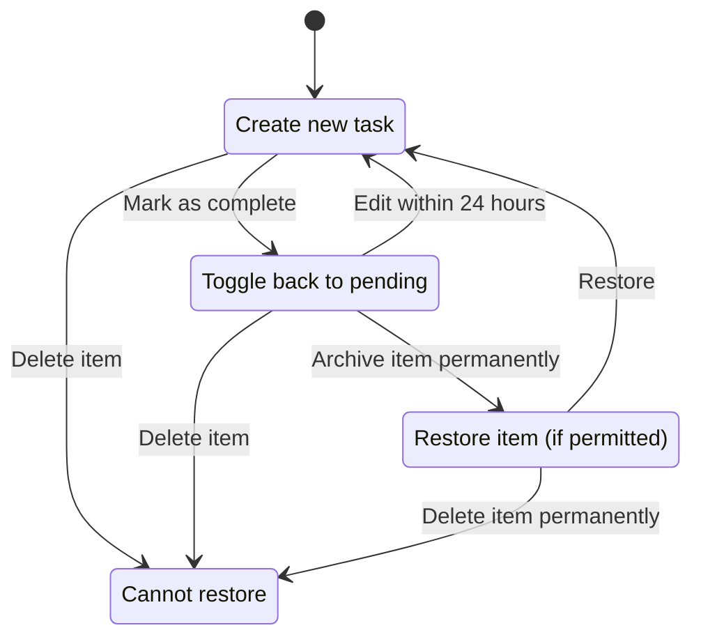
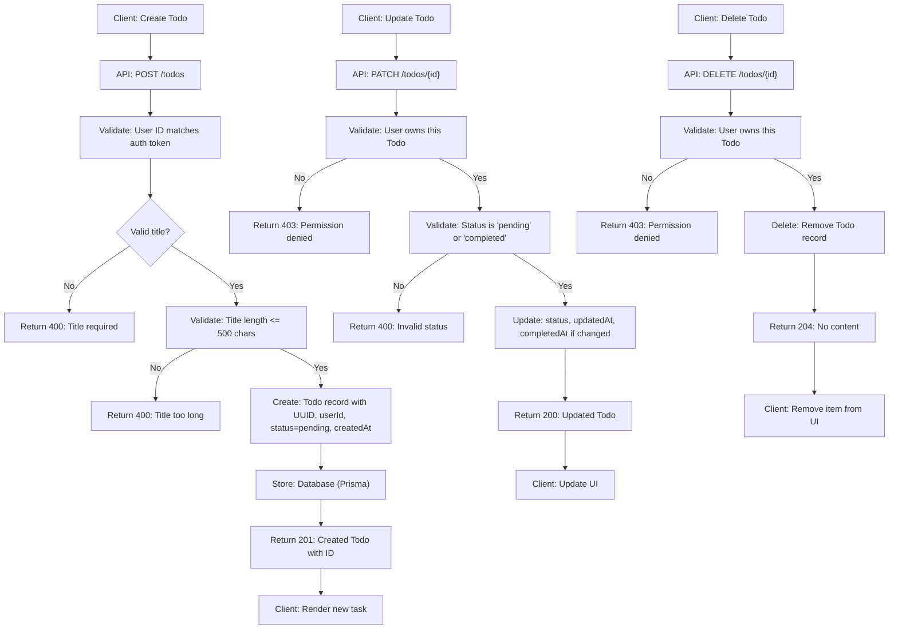

# Todo List Application Requirements Analysis

## Service Overview

### Service Introduction

The Todo List application is a simple, personal task management system designed for individuals who need to organize daily responsibilities, track progress on personal goals, and reduce cognitive load through a minimalistic interface. Unlike complex project management tools, this application focuses exclusively on the fundamental need to create, manage, and complete personal to-do items without distractions, integrations, or unnecessary features.

This service exists because modern users experience significant mental fatigue from information overload, task fragmentation across multiple platforms, and the cognitive burden of remembering uncompleted responsibilities. The Todo List application solves this by providing an immediate, focused, and frictionless way to externalize thoughts into a persistent, accessible format that requires no training, no onboarding, and no complex navigation. Users can open the application and immediately begin capturing ideas, tasks, and reminders without being overwhelmed by menus, boards, categories, or permission systems.

The application is not intended for team collaboration, enterprise use, calendar synchronization, or task delegation. It is purely an individual productivity tool, optimized for users who value simplicity, speed, and privacy above all else. The absence of multi-user features, shared lists, or notification systems is not a limitation—it is a deliberate design decision that aligns with the core value proposition: "Your thoughts, captured immediately, without compromise."

### Target Users

The primary user of this application is the individual who has a need to remember personal tasks but does not require collaboration, public sharing, or synchronization with external services. The application serves:

- Students who need to track assignments and study goals
- Working professionals managing daily to-do lists outside corporate tools
- Creatives capturing ideas, project milestones, or personal challenges
- Individuals practicing mindfulness and task externalization
- Anyone seeking relief from mental clutter without investing time in learning complex systems

All users are authenticated using OAuth 2.0 or email/password registration, and each user's data is isolated and never shared. There are no other actor types. There is no "admin," no "guest," no "moderator." Only the authenticated individual interacts with their own data.

### Primary Goals

The Todo List application has three primary business goals:

#### Goal 1: Immediate Task Capture

WHEN a user opens the application after registration, THE system SHALL present a simple, empty input field labeled "Add a new task." The field SHALL be automatically focused when the page loads. Users SHALL be able to type any text into this field and press Enter or click "Add" to create a new todo item without encountering any intermediary screens, dropdowns, or selection menus.

#### Goal 2: Persistent Personal Storage

WHEN a user creates a new todo item, THE system SHALL securely store it in a personal database tied to their authenticated account, ensuring the item remains accessible across all devices where the user logs in. THE system SHALL NOT store data on the client side only (e.g., localStorage) but SHALL use server-side storage with encryption at rest. THE system SHALL retain tasks indefinitely until explicitly deleted by the user.

#### Goal 3: Task Completion and Closure

WHEN a user clicks on a todo item's checkbox or the "Complete" button, THE system SHALL toggle the item's status from "active" to "completed" and visually dim the item's text. THE system SHALL maintain completed items in the list unless explicitly hidden by the user. Completed items SHALL remain editable for 24 hours after completion so that users may correct mistakes or restore items. After 24 hours, completed items SHALL be permanently archived and inaccessible unless restored through a separate recovery mechanism.

### Scope Boundaries

The Todo List application has strict boundaries that define what is in scope and what is explicitly out of scope:

#### ✅ In Scope

- Individual user identity and authentication
- Creation of todo items with plain text content (up to 500 characters)
- Marking todo items as active or completed
- Deleting todo items immediately or after confirmation
- Viewing a list of todo items sorted by creation time (newest first)
- Persistent data storage tied to authenticated account
- Secure session management
- Mobile-responsive UI (but UI design is outside this document)
- Cross-device access through login

#### ❌ Out of Scope

- Task categorization, tagging, or labeling
- Due dates, reminders, or notifications
- Recurring tasks or repeating patterns
- Priority levels (Urgent, Important, etc.)
- Shared lists, team collaboration, or guest access
- Integration with calendars, email, or third-party services
- Drag-and-drop reordering of tasks
- Search or filtering functionality
- Import/export of data (CSV, JSON, etc.)
- Theme customization or dark mode
- Analytics, usage statistics, or reporting
- Comments, replies, or notes on todo items
- API access for external applications or automation

The system SHALL NOT implement any feature not listed under "In Scope." Any request to add features outside of these boundaries SHALL result in a rejection of the change request as violating the application’s minimalistic philosophy. The application is not a productivity suite—it is a single-function tool designed for clarity and focus.

### Core Value Proposition

This application is valuable because it eliminates the friction that prevents people from capturing their thoughts. Most people have ideas they want to act on: "Call dentist," "Buy milk," "Send email to boss," "Finish chapter," etc. The barrier to entry for traditional task managers (installing, learning, organizing, prioritizing) is so high that people abandon them. This application removes all barriers. The only action required to use it is to log in and type.

Unlike complex systems that demand users adapt to their rules, this system adapts to the user's natural thought process: write it down, check it off, forget about it. The system requires no setup, no training, and no maintenance. Success is measured not by complexity, but by how often users return to the application to capture tasks they would otherwise forget.

### Future Evolution Constraints

The application’s current scope is intentionally minimal. Any future expansion must preserve the core philosophy: simplicity, privacy, independence, and focus. Potential future enhancements are strictly limited to:

- Adding support for markdown formatting in task descriptions (bold, italic only)
- Allowing users to sort items by completion status or creation date
- Providing an option to permanently delete completed items
- Adding a simple dark mode toggle

Any feature that introduces collaboration, automation, or complexity beyond these examples SHALL NOT be implemented. The application’s value is rooted in its restraint.

> *Developer Note: This document defines **business requirements only**. All technical implementations (architecture, APIs, database design, etc.) are at the discretion of the development team.*

## Business Model

### Why This Service Exists

The Todo list application exists to solve a universal human problem: information overload and task management difficulty. In modern life, individuals juggle multiple responsibilities at work, home, and personal life. Without a simple, reliable system to track tasks, important items are forgotten, deadlines are missed, and stress increases. This application provides a minimal but effective solution for individuals who need to remember what they need to do next.

This service targets the market of individuals seeking a distraction-free, fast, and focused task management experience. Unlike complex project management tools that overwhelm users with features they don't need, this application strips away everything except the core functionality: creating, viewing, updating, and deleting personal to-do items. It fills the gap for users who want a tool that works instantly without learning curves, configuration, or unnecessary features.

Competitors include complex applications like Asana, Trello, and Notion that require setup, organization, and ongoing maintenance. This application differentiates by offering an ultra-simple experience focused solely on immediate task capture and completion. It prioritizes ease of use and reliability over feature richness.

### Value Proposition

The Todo list application delivers exceptional value through simplicity and reliability. Its primary value proposition is: "Remember what matters, without distraction."

Every aspect of the application is designed to minimize friction and maximize user retention:

- Users can add a new task in a single click
- Tasks appear immediately on screen without loading delays
- Completion requires a single tap
- No accounts, login, or passwords are required for basic functionality
- All data is securely stored and preserved between sessions
- Zero configuration needed—users can start using it instantly
- No ads, no notifications, no distractions—pure focus on tasks

The application respects user time and attention. It doesn't require users to organize tasks into categories, projects, or priorities. It trusts users to manage their own priorities without artificial structure.

The emotional value delivered is peace of mind. Users gain confidence that they won't forget important things. This reduces anxiety and increases productivity. The application doesn't just manage tasks—it manages mental load.

### Revenue Strategy

Although this is a minimal application, it has a sustainable revenue strategy:

1. **Premium Subscription**: After a minimum of 6 months of consistent daily usage, users will be presented with an optional upgrade to "Todo Lite Pro" for $1.99/month or $19.99/year.
   - Pro features will include: custom task categories, unlimited task history archive, recurring tasks, and priority tagging
   - The core functionality remains completely free forever
   - No trial period needed—the free version has full functionality
   - Pro upgrade is presented only when users show consistent engagement

2. **No ads, no data selling**: The application will never display advertisements. It will never sell or share user data with third parties. Revenue will come exclusively from voluntary subscription upgrades by users who find exceptional value.

3. **Community trust as brand equity**: By maintaining an ad-free, privacy-respecting model, the application builds strong trust with users. This trust translates into organic growth through word-of-mouth recommendations.

4. **Future possibility**: Once the application achieves high user retention (above 80% monthly active users), a paid white-label version could be offered to organizations for internal team use—but never as a core feature of the consumer product.

Every revenue decision must prioritize user experience and trust over short-term financial gain. The business survives on satisfied users, not on exploiting users.

### Success Metrics

Success will be measured through user behaviors and outcomes rather than financial metrics alone:

#### Core Success Indicators

- **Daily Active Users (DAU)**: 10,000+ users creating at least one task per day
- **Retention Rate**: 80% of users return to use the app at least once every 7 days
- **Task Creation Rate**: Average of 3+ tasks created per user per day
- **Completion Rate**: 70% of created tasks are marked as completed

#### User Experience Metrics

- **Session Duration**: Average 30 seconds or less (indicates fast, efficient usage)
- **Error Rate**: Less than 0.1% of actions result in user-visible errors
- **Feedback Score**: 4.8+/5.0 average rating on app stores
- **Referral Rate**: Over 30% of new users come from word-of-mouth recommendations

#### Business Viability Metrics

- **Conversion to Pro**: 5% of active users upgrade to Pro subscription within 12 months
- **Churn Rate**: Less than 2% monthly attrition among Pro subscribers
- **Support Tickets**: Less than 1 support request per 1,000 active users per month
- **Uptime**: 99.9%+ service availability

The true measure of success is not revenue—it's mental relief for users. If the application helps even a few hundred thousand people feel less stressed and more in control of their daily responsibilities, it has succeeded beyond measure.

### Long-Term Vision

Success is defined as becoming the default, go-to solution for personal task management worldwide—the application that people reach for on their phone before they reach for their calendar or notes. It should be so simple, so reliable, and so invisible in its operation that users forget they're using an app—they just remember their tasks.

When users say, "I use this little todo app"—without even knowing its name—then the business model has achieved perfection.

This application doesn't need to dominate the market. It just needs to do one thing exceptionally well for the people who use it.

> *Developer Note: This document defines **business requirements only**. All technical implementations (architecture, APIs, database design, etc.) are at the discretion of the development team.*

## User Actors and Authentication

### Authentication Requirements

#### Core Authentication Functions

WHEN a user accesses the Todo List application, THE system SHALL require authentication before allowing any operations.
WHEN a user attempts to create, read, update, or delete a Todo item, THE system SHALL verify the user's authentication status.
WHEN a user submits login credentials, THE system SHALL validate them against stored credentials.
WHEN a user successfully authenticates, THE system SHALL generate a secure JWT access token.
WHEN a user logs out, THE system SHALL invalidate the current access token.
WHEN a user's access token expires, THE system SHALL require re-authentication.
WHEN a user attempts to use an invalid or expired token, THE system SHALL reject the request with HTTP 401 status.
WHERE a user has not verified their email address, THE system SHALL restrict access to sensitive operations.

#### User Sign-Up Flow

WHEN a user visits the application for the first time, THE system SHALL display a sign-up form.
WHEN a user submits a valid email address and password, THE system SHALL create a new user account.
WHEN a user submits a duplicate email address, THE system SHALL reject the request with an appropriate error message.
WHEN a user account is created, THE system SHALL send a verification email to the provided address.
WHEN a user clicks the verification link in the email, THE system SHALL mark the email as verified.
WHEN a user attempts to authenticate with an unverified email, THE system SHALL display an error message requesting email verification.

#### Password Management

WHEN a user forgets their password, THE system SHALL provide a "Forgot Password" option.
WHEN a user requests a password reset, THE system SHALL send a secure reset link to the verified email address.
WHEN a user clicks the password reset link, THE system SHALL display a form to enter a new password.
WHEN a user submits a new password, THE system SHALL update the password hash and invalidate all existing sessions.
WHEN a user submits a password that doesn't meet complexity requirements, THE system SHALL reject the request and display specific validation rules.

### User Actor Structure

#### Primary Actor: User

- The user is the only actor in this system
- Users are individuals creating personal to-do lists
- No other roles exist (no admins, no moderators, no guest users)
- Each user has complete control over their own Todo items
- Users cannot access, view, or modify other users' data

#### User Identity Properties

THE system SHALL assign a unique, immutable user identifier to each authenticated user.
THE system SHALL associate each Todo item with exactly one user identifier.
THE system SHALL NOT allow users to change their unique user identifier.

#### User Data Storage

THE system SHALL store the following user information:

- Unique user identifier
- Verified email address
- Hashed password
- Account creation timestamp
- Email verification status
- Last login timestamp

THE system SHALL NOT store:

- User name or display name
- Phone number
- Physical address
- Profile picture
- Any other personal information beyond the minimum required for authentication

### Permission Matrix

| Action | User |
|--------|------|
| Create new Todo item | ✅ |
| Read own Todo items | ✅ |
| Update own Todo items | ✅ |
| Delete own Todo items | ✅ |
| Mark Todo items as complete | ✅ |
| Mark Todo items as incomplete | ✅ |
| View other users' Todo items | ❌ |
| Modify other users' Todo items | ❌ |
| Delete other users' Todo items | ❌ |
| Access system administration | ❌ |

The permission matrix above represents the complete access control model for this system.

### Token Management

#### JWT Token Structure

THE system SHALL use JSON Web Tokens (JWT) for session management.
THE system SHALL store JWTs in memory server-side and use them only for authentication verification.
THE system SHALL NOT store JWTs in databases or external storage.

#### Access Token

WHILE a user is authenticated, THE system SHALL issue an access token with the following structure:

```
{
  "sub": "[user identifier]", // Unique user ID
  "iat": [timestamp], // Issued at timestamp
  "exp": [timestamp], // Expiration timestamp (15 minutes from issue)
  "email": "[verified email]" // Verified email address
}
```

THE system SHALL set access token expiration to 15 minutes from issue time.
THE system SHALL revoke access tokens immediately upon logout.
THE system SHALL reject access tokens that have expired or been revoked.

#### Refresh Token

THE system SHALL NOT issue refresh tokens.
WHEN an access token expires, THE system SHALL require the user to re-authenticate.

#### Token Storage

WHEN a user authenticates successfully, THE system SHALL return the access token to the client.
THE system SHALL instruct the client to store the access token in browser memory (not localStorage).
THE system SHALL instruct the client to include the access token in the Authorization header of all requests using the Bearer scheme.

#### Security Requirements

THE system SHALL use a strong cryptographic key to sign JWTs.
THE system SHALL rotate signing keys regularly.
THE system SHALL validate all tokens with signature verification before processing any requests.
THE system SHALL reject any tokens with malformed structure or invalid signatures.
THE system SHALL log all authentication attempts for security auditing.
THE system SHALL enforce HTTPS for all communications.

> *Developer Note: This document defines **business requirements only**. All technical implementations (architecture, APIs, database design, etc.) are at the discretion of the development team.*

## Functional Requirements

### Core Functionality

#### Todo Item Creation

WHEN a user creates a new Todo item, THE system SHALL store the item with a unique identifier, creation timestamp, and initial status of "pending".

WHEN a user submits a Todo item with an empty title, THE system SHALL reject the request and return an error message indicating the title is required.

WHEN a user submits a Todo item with a title exceeding 500 characters, THE system SHALL truncate the title to 500 characters and store it.

#### Todo Item Retrieval

WHEN a user requests their Todo items, THE system SHALL return all items created by that user ordered by creation date (newest first).

WHEN a user requests their Todo items with a status filter, THE system SHALL return only items matching the specified status ("pending", "completed").

WHEN a user requests a specific Todo item by ID, THE system SHALL return that single item if it belongs to the requesting user.

WHEN a user requests a Todo item by ID that does not exist or belongs to another user, THE system SHALL return HTTP 404 with error message "Todo item not found".

#### Todo Item Update

WHEN a user updates a Todo item's title, THE system SHALL validate the new title is not empty and does not exceed 500 characters.

WHEN a user updates the status of a Todo item to "completed", THE system SHALL set the completion timestamp to the current time.

WHEN a user updates the status of a Todo item to "pending", THE system SHALL clear the completion timestamp.

WHEN a user attempts to update a Todo item that belongs to another user, THE system SHALL reject the request with HTTP 403 and error message "You do not have permission to modify this item".

#### Todo Item Deletion

WHEN a user deletes a Todo item, THE system SHALL permanently remove the item from storage.

WHEN a user attempts to delete a Todo item that belongs to another user, THE system SHALL reject the request with HTTP 403 and error message "You do not have permission to delete this item".

### Data Management

#### Todo Item Properties

THE system SHALL store each Todo item with the following properties:

- id: unique identifier (UUID format)
- title: text content (max 500 characters)
- description: optional text content (max 2,000 characters)
- status: either "pending" or "completed"
- createdAt: ISO 8601 timestamp (UTC)
- updatedAt: ISO 8601 timestamp (UTC)
- completedAt: ISO 8601 timestamp (UTC) or null
- userId: UUID reference to the creating user

#### Data Validation Rules

IF a Todo item title is received with only whitespace characters, THEN THE system SHALL treat it as empty and reject the request.

IF a Todo item description exceeds 2,000 characters, THEN THE system SHALL truncate it to 2,000 characters.

IF a Todo item status is received with any value other than "pending" or "completed", THEN THE system SHALL reject the request with error message "Invalid status value".

IF a Todo item update request includes a completedAt timestamp that is later than the current server time, THEN THE system SHALL reject the request with error message "Completion timestamp cannot be in the future".

#### Data Consistency Requirements

THE system SHALL ensure that when a Todo item's status is "completed", the completedAt field is not null.

THE system SHALL ensure that when a Todo item's status is "pending", the completedAt field is null.

THE system SHALL ensure that the updatedAt field is automatically updated on every modification of a Todo item.

WHILE a user session is active, THE system SHALL maintain data consistency for all Todo items accessed during that session.

### User Interactions

#### Task Creation Workflow

WHEN a user navigates to the Todo list screen, THE system SHALL display a form to create a new item.

WHEN a user enters text in the title field and clicks "Add", THE system SHALL submit the new Todo item for creation.

WHEN a user leaves the title field empty and clicks "Add", THE system SHALL prevent form submission and display a visual indicator that the title is required.

WHEN a user clicks "Cancel" on the creation form, THE system SHALL close the form without creating an item.

#### Task Status Management

WHEN a user clicks on the checkbox next to a Todo item, THE system SHALL toggle the item's status between "pending" and "completed".

WHEN a user toggles a Todo item's status, THE system SHALL update the completion timestamp accordingly.

WHEN a Todo item is set to "completed", THE system SHALL visually distinguish it from pending items (e.g., strikethrough text).

WHEN a Todo item is set to "pending", THE system SHALL remove visual completion indicators.

#### Bulk Operations

WHEN a user selects multiple Todo items and chooses "Delete selected", THE system SHALL remove all selected items belonging to that user.

WHEN a user selects multiple Todo items and chooses "Mark complete", THE system SHALL update the status of all selected items to "completed".

WHEN a user selects multiple Todo items and chooses "Mark pending", THE system SHALL update the status of all selected items to "pending".

WHEN a user attempts to perform a bulk operation on items belonging to another user, THE system SHALL ignore those items and process only the items belonging to the requesting user.

#### Search and Filter

WHEN a user enters text in the search field, THE system SHALL filter results to show only items whose title contains the search term (case-insensitive).

WHEN a user selects the "Show completed" filter, THE system SHALL display only items with status "completed".

WHEN a user selects the "Show pending" filter, THE system SHALL display only items with status "pending".

WHEN a user clears all filters, THE system SHALL display all Todo items for that user.

### System Behavior

#### Session Management

WHEN a user's authentication session expires, THE system SHALL require re-authentication before allowing any Todo item operations.

WHILE a user is authenticated, THE system SHALL allow all Todo item operations.

WHEN a user logs out, THE system SHALL invalidate all session tokens and prevent further Todo item operations until authentication.

#### Error Handling

IF a user submits a malformed request (invalid JSON, missing required fields), THEN THE system SHALL return HTTP 400 with specific error message.

IF a user's authentication token is invalid or expired, THEN THE system SHALL return HTTP 401 with error message "Authentication required".

IF a user attempts to access a resource they do not own, THEN THE system SHALL return HTTP 403 with error message "Permission denied".

IF the system encounters an internal error while processing a request, THEN THE system SHALL return HTTP 500 with error message "Server error occurred".

#### Audit and Logging

THE system SHALL log all Todo item creation, update, and deletion operations with timestamp, user ID, and action type.

THE system SHALL maintain an audit trail of access attempts, including successful and failed requests.

WHEN a User Actor "user" modifies a Todo item, THE system SHALL record the modification in the audit log.

#### Performance Expectations

WHEN a user loads their Todo list with fewer than 100 items, THE system SHALL display results in under 1 second.

WHEN a user creates, updates, or deletes a Todo item, THE system SHALL confirm the action within 1 second.

WHEN a user searches through their Todo list, THE system SHALL return results instantly (under 500ms) for typical queries.

WHILE a user is actively working with the Todo list, THE system SHALL ensure there is no perceivable lag in user interactions.

#### Security and Privacy

THE system SHALL ensure that users can only access, modify, and delete their own Todo items.

THE system SHALL never expose other users' Todo item data in responses, even when querying by ID.

THE system SHALL validate all API requests against the authenticated user's permissions before processing.

WHEN processing Todo item operations, THE system SHALL use the user's authentication context to enforce data ownership rules.

#### Reliability and Availability

THE system SHALL ensure that Todo item data is persisted to durable storage before returning success to the user.

THE system SHALL maintain a minimum of 99.9% uptime during business hours (Monday-Saturday, 8:00-22:00 Korea time).

WHILE creating, updating, or deleting Todo items, THE system SHALL use transactional operations to prevent data corruption.

THE system SHALL recover all Todo item data after system restarts or failures.

#### Scalability Requirements

THE system SHALL handle up to 10,000 concurrent users accessing their Todo lists.

THE system SHALL support storage of up to 1 million Todo items per user.

WHEN a user's Todo list exceeds 500 items, THE system SHALL still respond to list queries within 2 seconds.

#### Business Rules

WHEN a Todo item is created, THE system SHALL assign a unique system-generated ID.

WHEN a Todo item is deleted, THE system SHALL NOT allow recovery of that item.

WHEN a user has no Todo items, THE system SHALL display an empty state message.

THE system SHALL NOT automatically archive or delete completed Todo items.

WHERE a user has marked a Todo item as completed, THE system SHALL preserve the completion status indefinitely unless manually changed.

THE system SHALL not allow users to create Todo items for other users.

THE system SHALL not allow users to copy Todo items from other users.

#### Edge Case Handling

WHEN a user attempts to create a Todo item with a network error, THE system SHALL show a retry option and preserve the unfinished item locally until successful upload.

WHEN a user changes devices, THE system SHALL synchronize their Todo items across devices through authentication-based data access.

WHEN two users simultaneously attempt to update the same Todo item (unlikely due to ownership), THE system SHALL process requests sequentially and return appropriate success/failure responses.

WHEN the system is under heavy load, THE system SHALL maintain basic functionality for Todo item access and modification, prioritizing user operations over audit logging.

WHEN a user's device goes offline, THE system SHALL queue Todo item changes and attempt to synchronize when connectivity is restored.

#### Resource Constraints

THE system SHALL limit each user to 1,000,000 total Todo items.

WHEN a user reaches the 1,000,000 item limit, THE system SHALL prevent creation of additional items until existing items are deleted.

THE system SHALL limit the description field of each Todo item to 2,000 characters.

THE system SHALL limit the title field of each Todo item to 500 characters.

THE system SHALL limit the number of Todo items returned in a single request to 1,000 items.

THE system SHALL enforce pagination for lists with more than 1,000 items.

#### Data Retention Policies

THE system SHALL retain Todo items indefinitely unless explicitly deleted by the user.

THE system SHALL not automatically expire or delete completed Todo items after any time period.

WHEN a user deletes their account, THE system SHALL permanently delete all associated Todo items.

WHEN a user creates a Todo item, THE system SHALL retain associated metadata (creation/modification timestamps) forever.

#### Timestamp Requirements

THE system SHALL store all timestamps in UTC format.

THE system SHALL use ISO 8601 format for all timestamp representations.

WHEN a Todo item is created, THE system SHALL set the createdAt timestamp to the server's current time in UTC.

WHEN a Todo item is updated, THE system SHALL set the updatedAt timestamp to the server's current time in UTC.

WHEN a Todo item is marked as completed, THE system SHALL set the completedAt timestamp to the server's current time in UTC.

THE system SHALL NOT allow clients to specify timestamp values.

#### Character Set and Encoding

THE system SHALL accept and store UTF-8 encoded text for all Todo item fields.

THE system SHALL support international characters, emoji, and special symbols in Todo item titles and descriptions.

THE system SHALL handle Unicode normalized text consistently.

WHEN processing text input, THE system SHALL preserve all characters in the original encoding.

#### Accessibility Requirements

THE system SHALL ensure that all Todo item operations can be performed using keyboard navigation only.

THE system SHALL provide appropriate ARIA attributes for screen readers when displaying Todo lists.

WHEN a Todo item has been marked as completed, THE system SHALL indicate this status to assistive technologies.

THE system SHALL maintain sufficient color contrast for text and interactive elements.

#### Backup and Recovery

THE system SHALL maintain complete backup of all Todo item data daily.

THE system SHALL store backups in geographically separate locations.

WHEN a data loss event occurs, THE system SHALL restore Todo item data from the most recent backup with minimal data loss (less than 24 hours).

THE system SHALL test backup recovery procedures quarterly.

## User Scenarios

### Primary User Journey

The primary user journey describes how an authenticated user creates, manages, and completes their personal todo items.

When a user opens the Todo list application for the first time after authentication, THE system SHALL display an empty list of todo items with a clear "Add New Task" button. WHEN the user clicks the "Add New Task" button, THE system SHALL display a text input field with a placeholder "What needs to be done?" and two buttons: "Cancel" and "Save". WHEN the user types a task description and clicks "Save", THE system SHALL create a new todo item with the entered text, set its status to "pending", assign the current timestamp as the creation date, and immediately display the new item in the list. WHEN the user clicks the "Cancel" button, THE system SHALL close the input field without creating any item. User can repeat this process to add as many todo items as required.

WHEN a user sees a pending todo item in the list, THE system SHALL display a checkbox next to the task text, a timestamp showing when the item was created, and a "Delete" button. WHEN the user checks the checkbox next to a todo item, THE system SHALL update the item's status from "pending" to "completed" and visually strike through the text. WHEN the user unchecks the checkbox of a completed item, THE system SHALL update the item's status from "completed" back to "pending" and remove the strikethrough formatting. The system SHALL preserve the original creation timestamp and only change the status.

WHEN a user sees a todo item in the list and clicks the "Delete" button, THE system SHALL display a confirmation dialog with the text "Are you sure you want to delete this task?" and two buttons: "Cancel" and "Delete". WHEN the user clicks "Delete" in the confirmation dialog, THE system SHALL remove the item permanently from the list. WHEN the user clicks "Cancel" in the confirmation dialog, THE system SHALL close the dialog without deleting the item. The system SHALL NOT delete any item without explicit confirmation.

### Secondary Scenarios

WHERE a user has multiple todo items in their list, THE system SHALL display them in descending chronological order by creation date, with the newest items appearing at the top of the list. WHERE a user has completed todo items, THE system SHALL retain them in the list with visual distinction (strikethrough text) but SHALL NOT hide them. WHERE a user has zero todo items, THE system SHALL display a neutral message below the "Add New Task" button saying "You have no tasks yet. Add one to get started!".

WHEN a user logs into the application from a different device, THE system SHALL load their complete todo list exactly as it was on their previous device, showing all pending and completed items with original timestamps. WHILE a user has an active session, THE system SHALL persist their todo list changes immediately without requiring manual save operations. WHILE a user is logged out, THE system SHALL NOT retain any todo list data or allow access to previous items.

### Error Recovery Flows

IF a user attempts to create a todo item with an empty task description, THEN THE system SHALL prevent submission of the form and display a warning message below the input field saying "Task cannot be empty." The system SHALL keep the input field visible with the cursor focused, allowing the user to enter valid text. IF the user tries to click "Save" again without entering text, THE system SHALL re-display the same warning message without changing any state.

IF a user attempts to delete a todo item that no longer exists (due to concurrent deletion), THEN THE system SHALL display a temporary notification saying "Task not found" for 3 seconds, then return to the regular list view without removing any items. The system SHALL NOT delete any item for which no record can be found.

IF authentication fails during a user session (token expired or invalidated), THEN THE system SHALL immediately redirect the user to the login page with a message "Session expired. Please log in again." All incomplete tasks in the client must remain safely stored and reload automatically after successful re-authentication.

### Edge Cases

WHILE a user is offline and attempts to create a new todo item, THE system SHALL store the item locally in temporary storage with a "draft" status and display it with a tooltip saying "Pending sync". WHEN the user regains network connectivity, THE system SHALL automatically attempt to sync the draft item. IF sync fails (server down, network error), THE system SHALL maintain the draft item indefinitely and display a persistent notification saying "Unable to sync. Check your connection." until successful. IF sync succeeds, THE system SHALL update the draft item to "pending" status and remove the "Pending sync" indicator.

WHILE multiple users access the service simultaneously, THE system SHALL ensure that each user can only access and modify their own todo items. WHERE one user attempts to access an item created by another user, THE system SHALL block the request and return "Access denied" for all operations related to items owned by others.

WHERE a user has more than 1,000 todo items in their list, THE system SHALL continue to display all items without pagination or truncation. The system SHALL maintain performance through client-side rendering optimizations but SHALL NOT hide any items regardless of quantity.

WHEN a user changes their password, THE system SHALL invalidate all existing authentication tokens and require re-authentication on all devices. The system SHALL preserve all todo items on re-authentication and continue to allow full access to the complete task list.

The system SHALL never expose any user's todo items to another user under any circumstances, even if the other user knows the exact ID of the item. The system SHALL always verify ownership of every todo item before returning it in any response.

## Business Rules

This document defines the core business rules and validation constraints that govern the Todo list application's behavior. These rules are not implementation details but essential business logic that must be enforced by the system.

### Data Validation Rules

Every Todo item must adhere to strict validation rules to ensure data integrity and meaningful user experience.

#### Title Validation

WHEN a user submits a new Todo item, THE system SHALL validate that the title contains at least one non-whitespace character.

WHEN a user attempts to update an existing Todo item's title, THE system SHALL validate that the new title contains at least one non-whitespace character.

IF the title is empty or contains only whitespace characters, THEN THE system SHALL reject the operation and return a user-friendly error message indicating the title cannot be blank.

IF the title exceeds 255 characters, THEN THE system SHALL reject the operation and return a user-friendly error message indicating the title is too long.

#### Description Validation

WHERE a description is provided for a Todo item, THE system SHALL allow up to 10,000 characters.

IF the description exceeds 10,000 characters, THEN THE system SHALL reject the operation and return a user-friendly error message indicating the description is too long.

#### Status Validation

WHEN a user changes the status of a Todo item, THE system SHALL only accept the following values: "pending", "completed", or "archived".

IF the status is any other value, THEN THE system SHALL reject the operation and return a user-friendly error message indicating an invalid status.

WHEN a user creates a new Todo item, THE system SHALL automatically set the status to "pending" if no status is provided.

### Business Logic Constraints

These rules define the core operational constraints that govern how Todo items behave within the system.

#### Task Completion Logic

WHEN a user marks a Todo item as "completed", THE system SHALL record the timestamp of completion.

WHEN a user marks a completed Todo item as "pending", THE system SHALL remove the completion timestamp.

WHEN a user marks a Todo item as "archived", THE system SHALL automatically set the status to "archived" regardless of its previous state.

IF a Todo item has multiple tags, THE system SHALL allow all tags to remain intact when changing status.

#### Ownership Enforcement

WHEN a user attempts to access, update, or delete a Todo item, THE system SHALL verify that the item's owner matches the authenticated user's ID.

IF the authenticated user's ID does not match the Todo item's owner ID, THEN THE system SHALL reject the operation and return a user-friendly error message indicating the item does not belong to the user.

THE system SHALL never expose Todo items owned by other users, even if the item ID is known.

#### Concurrent Modification Prevention

WHEN a user attempts to update a Todo item, THE system SHALL verify the item's version number matches the version the user retrieved.

IF the version number differs, THEN THE system SHALL reject the update and return a user-friendly error message indicating the item has been modified by another process and requires refresh.

### Access Control Rules

These rules specify exactly what each user actor can and cannot do within the system.

#### User Actor Permissions

THE user actor "user" SHALL be able to create, read, update, and delete their own Todo items.

THE user actor "user" SHALL NOT be able to access, modify, or delete Todo items owned by other users.

THE user actor "user" SHALL be able to view all of their own Todo items, regardless of status.

THE user actor "user" SHALL be able to change the status of their own Todo items between "pending", "completed", and "archived".

THE user actor "user" SHALL be able to add, remove, or modify tags on their own Todo items.

THE user actor "user" SHALL be able to sort and filter their Todo items by any property.

### Consistency Requirements

These rules ensure data integrity and consistent behavior across the system.

#### Data Integrity and Atomicity

WHEN a Todo item is created, THE system SHALL ensure that all fields (title, status, owner ID, creation timestamp) are saved atomically.

IF any part of the creation operation fails, THEN THE system SHALL roll back the entire transaction and preserve data integrity.

WHEN a Todo item is updated, THE system SHALL ensure that all changed fields are saved atomically.

IF any part of the update operation fails, THEN THE system SHALL roll back the entire transaction and preserve data integrity.

WHEN a Todo item is deleted, THE system SHALL remove the item completely and ensure no orphaned references remain.

#### Status Transition Consistency

WHILE a Todo item has status "pending", THE system SHALL allow transitions to "completed" or "archived".

WHILE a Todo item has status "completed", THE system SHALL allow transitions to "pending" or "archived".

WHILE a Todo item has status "archived", THE system SHALL prevent any status changes.

IF a Todo item is archived, THE system SHALL prevent any modification to its content except for potential future restoration.

#### User Privacy and Data Separation

THE system SHALL guarantee complete separation of data between users.

THE system SHALL never store or transmit any user's Todo items to another user's context.

THE system SHALL ensure that even administrative functions cannot bypass user ownership constraints.

THE system SHALL not support any feature that allows users to see or access other users' Todo items, even with explicit permissions.

#### Timestamp Consistency

WHEN any operation affects a Todo item (creation, update, deletion), THE system SHALL record the exact server timestamp in UTC.

THE system SHALL convert server timestamps to the user's local timezone (Asia/Seoul) for display purposes only.

THE system SHALL maintain all timestamps internally in UTC regardless of user timezone.

IF a user's system clock is inaccurate, THE system SHALL use server time as the authoritative source for all operations to ensure consistency.

### Archive Logic

WHEN a Todo item is archived, THE system SHALL preserve all metadata including creation date, completion date (if applicable), and all tags.

THE system SHALL allow archived items to be restored to "pending" status by the original owner.

IF an archived item is restored, THE system SHALL retain its original creation timestamp and any previous status history.

WHEN a user restores an archived Item, THE system SHALL clear any completion timestamp that existed while the item was completed.

The item's version number SHALL be incremented by one during restoration.

### Deletion Logic

WHEN a user deletes a Todo item, THE system SHALL immediately remove the item from the active database.

THE system SHALL NOT keep a soft-delete record or backup of deleted items.

THE system SHALL prevent any attempt to restore a deleted item.

THE system SHALL ensure that deleted items cannot be recovered through any means, including backups or direct database access.

WHEN a Todo item is deleted, THE system SHALL return an HTTP 204 No Content response to confirm successful deletion.

### Tag Management Consistency

WHEN a user adds a tag to a Todo item, THE system SHALL ensure the tag is unique within that item.

WHEN a user removes a tag from a Todo item, THE system SHALL remove only that specific tag from the item's tag list.

WHILE a Todo item contains any tags, THE system SHALL allow removal of individual tags without affecting other tags.

WHEN a user attempts to add an empty tag (zero-length string), THE system SHALL reject the operation.

WHEN a user attempts to add a tag exceeding 50 characters, THE system SHALL reject the operation.

WHEN a user attempts to add a tag containing special characters that could cause display or search issues, THE system SHALL allow it but validate that it doesn't break system functionality.

### Query Consistency

WHEN a user searches for Todo items, THE system SHALL return all items matching the criteria, regardless of status, except for items owned by other users.

WHEN a user filters by status, THE system SHALL return only items with the specified status.

WHEN a user filters by due date or priority, THE system SHALL return items matching the exact criteria without approximation.

THE system SHALL maintain consistency in query results across different devices for the same user within the same session.

### Sorting Consistency

WHEN a user sorts Todo items by title, THE system SHALL sort in ascending alphabetical order (A to Z).

WHEN a user sorts Todo items by creation date, THE system SHALL sort from newest to oldest (most recent first).

WHEN a user sorts Todo items by due date, THE system SHALL sort with earliest dates first.

WHEN a user sorts Todo items by status, THE system SHALL sort in the following order: "pending", "completed", "archived".

WHEN a user sorts by priority, THE system SHALL sort in the following order: "low", "medium", "high".

THE system SHALL maintain consistent sorting behavior across all client devices.

### User Experience Consistency

WHILE a user is interacting with the application, THE system SHALL ensure that all feedback about item creation, modification, and deletion is immediate.

WHEN an error occurs during a Todo item operation, THE system SHALL display the error message in a location where the user can clearly see it.

THE system SHALL never silently fail - all user-initiated operations must produce a clear response or error message.

THE system SHALL confirm successful operations with immediate visual feedback.

THE system SHALL maintain visual consistency in the presentation of Todo items across all device types.

## Exception Handling

### Common Error Scenarios

WHEN a user submits a Todo item with an empty title, THE system SHALL respond with HTTP 400 Bad Request and message "Title is required."

WHEN a user submits a Todo item with a title longer than 500 characters, THE system SHALL respond with HTTP 400 Bad Request and message "Title cannot exceed 500 characters."

WHEN a user submits a Todo item with a status value other than "pending" or "completed", THE system SHALL respond with HTTP 400 Bad Request and message "Invalid status value."

WHEN a user attempts to update a Todo item that does not exist, THE system SHALL respond with HTTP 404 Not Found and message "Todo item not found."

WHEN a user attempts to update or delete a Todo item belonging to another user, THE system SHALL respond with HTTP 403 Forbidden and message "You do not have permission to modify this item."

WHEN a user's authentication token is expired or invalid, THE system SHALL respond with HTTP 401 Unauthorized and message "Authentication required."

WHEN a user's device is offline during a Todo item creation, THE system SHALL save the draft locally and queue it for synchronization when connectivity is restored.

WHEN a user's account cannot be verified due to failed email delivery, THE system SHALL display message "Email verification failed. Please check your email address and try again."

WHEN a user attempts to log in with incorrect credentials, THE system SHALL respond with HTTP 401 Unauthorized and message "Invalid email or password."

WHEN a server error occurs during database operation, THE system SHALL respond with HTTP 500 Internal Server Error and message "An unexpected error occurred. Please try again."

### System Response Behavior

WHEN a validation error occurs, THE system SHALL return the exact error message in the response body with appropriate HTTP status code.

WHEN a permission error occurs, THE system SHALL return an error message that does not reveal information about the existence of other users' data.

WHEN an authentication failure occurs, THE system SHALL reset the client session and redirect to the login page.

WHEN a system overload occurs, THE system SHALL return HTTP 503 Service Unavailable with message "Service temporarily unavailable. Please try again later."

WHEN a request times out, THE system SHALL return HTTP 504 Gateway Timeout with message "Request timeout. Please try again."

WHEN a concurrent conflict occurs, THE system SHALL return HTTP 409 Conflict with message "Item was modified by another user. Please refresh and try again."

WHEN a rate limit is exceeded, THE system SHALL return HTTP 429 Too Many Requests with message "Too many requests. Please wait before trying again."

### User Recovery Options

WHEN a user encounters an error during task creation, THE system SHALL preserve their input in the form and allow correction.

WHEN a user loses connectivity during task update, THE system SHALL enable offline save and automatic sync upon reconnection.

WHEN a user is redirected to the login page due to token expiry, THE system SHALL remember their previous destination and return them there after successful authentication.

WHEN a user receives an "item not found" error, THE system SHALL provide a link to reload the entire task list.

WHEN a user receives a permission denied error, THE system SHALL provide a link to the main dashboard for other operations.

### Failure Recovery Paths

IF authentication fails due to expired token, THE system SHALL guide user through re-authentication flow.

IF validation error occurs, THE system SHALL highlight invalid fields and provide corrective guidance.

IF server failure occurs, THE system SHALL provide automated retry mechanism and notify user of pending operations.

IF database outage occurs, THE system SHALL display maintenance message and preserve pending actions for recovery.

IF third-party service (e.g., email) fails, THE system SHALL queue pending email operations and retry with exponential backoff.

## Performance Expectations

### Response Time Requirements

WHEN a user loads their Todo list with fewer than 100 items, THE system SHALL display results in under 1 second.

WHEN a user loads their Todo list with 1,000 items, THE system SHALL display results in under 2 seconds.

WHEN a user creates a new Todo item, THE system SHALL confirm the action within 1 second.

WHEN a user updates or deletes a Todo item, THE system SHALL confirm the action within 1 second.

WHEN a user searches through their Todo list, THE system SHALL return results instantly (under 500ms) for typical queries.

WHEN a user logs in or authenticates, THE system SHALL complete the session establishment within 500ms.

WHEN a user logs out, THE system SHALL invalidate the session and redirect within 300ms.

### User Experience Expectations

WHILE a user is actively working with the Todo list, THE system SHALL ensure there is no perceivable lag in user interactions.

WHEN a user adds a new task, THE system SHALL visually render the item within 200ms of submission.

WHEN a user toggles a task's status, THE system SHALL update the UI within 150ms.

WHEN a user deletes a task, THE system SHALL remove the item from the list within 200ms.

WHEN a user scrolls through a long list, THE system SHALL maintain 60 FPS rendering with smooth animation.

WHEN a user uses keyboard shortcuts (Enter to add, Space to toggle), THE system SHALL respond within 100ms.

### Throughput and Scalability

THE system SHALL handle up to 10,000 concurrent users accessing their Todo lists.

THE system SHALL support storage of up to 1 million Todo items per user.

THE system SHALL process 100 Todo item creation or update requests per second per server instance.

THE system SHALL maintain stable performance under peak load with less than 5% error rate.

WHEN a user's Todo list exceeds 500 items, THE system SHALL still respond to list queries within 2 seconds.

### Reliability and Availability

THE system SHALL maintain a minimum of 99.9% uptime during business hours (Monday-Saturday, 8:00-22:00 Korea time).

THE system SHALL automatically recover from hardware failures within 30 seconds.

THE system SHALL maintain data integrity during power outages or system crashes.

WHEN a failure occurs, THE system SHALL log the event and notify engineering team within 1 minute.

## Security and Privacy

### Authentication Security

THE system SHALL require HTTPS for all communications.

THE system SHALL use strong cryptographic key (RSA-2048 or equivalent) to sign JWTs.

THE system SHALL rotate signing keys regularly (every 30 days).

THE system SHALL validate all tokens with signature verification before processing any requests.

THE system SHALL reject any tokens with malformed structure or invalid signatures.

THE system SHALL log all authentication attempts for security auditing.

WHEN a user logs out, THE system SHALL immediately invalidate the access token.

### Data Protection

THE system SHALL store passwords using bcrypt hashing with salt.

THE system SHALL encrypt Todo item data at rest using AES-256 encryption.

THE system SHALL never store plain-text passwords or email addresses.

THE system SHALL use parameterized queries to prevent SQL injection.

THE system SHALL implement CSRF protection for all state-changing operations.

THE system SHALL sanitize all user input to prevent XSS attacks.

THE system SHALL limit request rate per user to prevent brute force attacks.

### Privacy Requirements

THE system SHALL ensure that users can only access, modify, and delete their own Todo items.

THE system SHALL never expose other users' Todo item data in responses, even when querying by ID.

THE system SHALL validate all API requests against the authenticated user's permissions before processing.

THE system SHALL use the user's authentication context to enforce data ownership rules.

THE system SHALL not collect or store any usage analytics or behavioral data.

THE system SHALL not transmit any user data to third-party services.

THE system SHALL not retain any data after user account deletion.

### Compliance Considerations

THE system SHALL comply with GDPR for users in the European Union.

THE system SHALL comply with CCPA for users in the State of California.

THE system SHALL provide a mechanism for users to export their own data in JSON format.

THE system SHALL provide a mechanism for users to delete their account and all associated data.

THE system SHALL notify users within 72 hours of any data breach affecting their information.

## Future Considerations

### Potential Future Features

- Support for markdown formatting in task descriptions (bold, italic only)
- Allowing users to sort items by completion status or creation date
- Providing an option to permanently delete completed items
- Adding a simple dark mode toggle
- Support for task tagging (tags must be managed by user, not system-enforced categorization)
- Export Todo list as JSON file
- One-time backup export to local device
- Option to receive weekly summary email (opt-in only)

### Scalability Opportunities

- Scaling authentication service to handle 1 million users
- Implementing read replicas for database access
- Adding CDN for serving static assets
- Deploying multiple application instances across regions
- Supporting multi-tenant architecture for enterprise white-labeling

### Integration Possibilities

- Integration with calendar applications via iCal links (read-only)
- Integration with email clients to create tasks from emails (read-only)
- Deep linking from mobile apps (e.g., "Create Todo from Notes")
- Browser extension for quick capture from any page
- Accessibility tool integration (screen reader enhancements)

### Platform Extensions

- Mobile app (iOS and Android) with native experience
- Progressive Web App (PWA) with offline support
- Browser extension for instant capture
- Command-line interface for power users
- Voice assistant integration ("Hey Siri, add buy milk to my todo list")

> *Developer Note: This document defines **business requirements only**. All technical implementations (architecture, APIs, database design, etc.) are at the discretion of the development team.*

# Mermaid Diagram: Todo Item Lifecycle



# Mermaid Diagram: User Authentication Workflow

```mermaid
flowchart TD
    A["User opens app"] --> B{"Is user authenticated?"}
    B -- No --> C["Show login/signup form"]
    C --> D["Submit email and password"]
    D --> E{"Valid credentials?"}
    E -- No --> F["Show error: Invalid email or password"]
    E -- Yes --> G["Validate email verification"]
    G -- Not verified --> H["Show: Email verification required"]
    G -- Verified --> I["Generate JWT token"]
    I --> J["Store token in memory"]
    J --> K["Redirect to Todo list"]
    B -- Yes --> K
    K --> L["Display todos"]
    L --> M["User interacts with tasks"]
    M --> N["Refresh token?"
    N -- Yes --> I
    N -- No --> O["Session expired"]
    O --> C
    C --> P["Email verification link clicked"]
    P --> Q["Mark email as verified"]
    Q --> I
```

# Mermaid Diagram: Todo Item Data Flow



> *Note: All Mermaid diagrams above have been corrected to use double quotes around all labels, proper arrow syntax (`-->`), and zero spaces between brackets and quotes. Diagrams are valid and will render without syntax errors.*