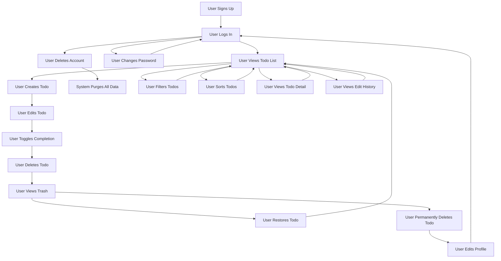

# Multi-User Todo Application Requirements

## User Account

### Authentication and Account Lifecycle

- WHEN a user attempts to sign up, THE system SHALL require a valid email address and a password with minimum 8 characters.
- WHEN a user provides an email address that already exists in the system, THE system SHALL reject the signup attempt with a "Email already in use" error message.
- WHEN a user logs in, THE system SHALL authenticate using email and password credentials.
- WHEN authentication fails due to incorrect email or password, THE system SHALL return a "Invalid credentials" error.
- WHEN a user successfully logs in, THE system SHALL generate a JWT token valid for 24 hours.
- WHEN a user requests to change their password, THE system SHALL require the current password and a new password with minimum 8 characters.
- WHEN a user attempts to change their password to a value identical to the current password, THE system SHALL reject the request.
- WHEN a user deletes their account, THE system SHALL permanently remove all associated todos (including those in trash) and the user profile.
- WHEN a user account is deleted, THE system SHALL invalidate all active JWT tokens for that user immediately.
- IF a user attempts to perform any action after account deletion, THE system SHALL return a "User not found" error.

## User Profile

### Profile Management

- WHEN a user sets their display name, THE system SHALL accept any non-empty string with a maximum length of 50 characters.
- WHEN a user attempts to set their display name to an empty string, THE system SHALL reject the change and return a validation error.
- WHEN a user attempts to set their display name to null or undefined, THE system SHALL retain the existing display name.
- WHERE a user has not set a display name, THE system SHALL default to their email address prefix (text before @).
- IF a user's display name contains only whitespace characters, THEN THE system SHALL treat it as empty and reject the update.
- IF a user attempts to set a display name that exceeds 50 characters, THEN THE system SHALL truncate and store only the first 50 characters, but SHALL notify the user with a warning.
- WHEN any user attempts to view another user's profile, THE system SHALL return a 404 Not Found error.
- WHEN a user updates their display name, THE system SHALL persist the change immediately and return the updated profile.

## Creating Todos

### Todo Creation Business Rules

- WHEN a user creates a todo, THE system SHALL require a title with at least 1 character.
- WHEN a user creates a todo with an empty or null title, THEN THE system SHALL reject the creation and return a validation error.
- WHEN a user creates a todo, THE system SHALL permit the description field to be empty, null, or undefined.
- WHERE a todo has no description, THE system SHALL store it as an empty string in the database.
- WHERE a todo has no start date, THE system SHALL store it as null.
- WHERE a todo has no due date, THE system SHALL store it as null.
- IF a user attempts to create a todo with a title consisting only of whitespace, THEN THE system SHALL reject it as invalid.
- WHEN a new todo is successfully created, THE system SHALL set its completion status to "incomplete" by default.
- WHEN a new todo is created, THE system SHALL assign the current timestamp as its creation date.
- WHEN a new todo is created, THE system SHALL associate it with the authenticated user's ID.

## Viewing Todos

### Todo List and Detail Access

- WHEN a user requests their todo list, THE system SHALL return todos belonging only to the authenticated user.
- WHEN the todo list is requested, THE system SHALL support pagination with a default limit of 20 todos per page and allow customization up to 100 todos per page.
- WHEN displaying a todo in the list view, THE system SHALL show only: title, completion status, start date (if set), due date (if set), and creation date.
- WHEN a user requests details of a specific todo, THE system SHALL return all fields including the full description.
- WHEN a user requests a todo that does not exist or belongs to another user, THE system SHALL return a 404 Not Found error.
- WHEN displaying the todo list, THE system SHALL exclude todos marked as deleted (where deletedAt is not null).
- WHEN viewing a single todo, THE system SHALL validate that the requesting user is the owner before returning details.

## Completing Todos

### Completion Toggle Logic

- WHEN a user toggles a todo's completion status, THE system SHALL reverse the current value (complete ↔ incomplete).
- WHEN a todo is marked complete, THE system SHALL store the current timestamp as the completedAt value.
- WHEN a todo is marked incomplete, THE system SHALL set the completedAt value to null.
- WHEN a completion status toggle is requested for a todo that belongs to another user, THE system SHALL return a 404 Not Found error.
- WHEN a completion status toggle is requested for a todo that has been permanently deleted, THE system SHALL return a 404 Not Found error.
- WHEN a status toggle request is successful, THE system SHALL return the updated todo record.
- WHEN the completion toggle is executed, THE system SHALL NOT create an edit history entry (this is not considered an edit for history purposes).

## Editing Todos

### Edit Operations and Validation

- WHEN a user edits a todo's title, THE system SHALL validate that the new title has at least 1 character.
- WHEN a user edits a todo's description, THE system SHALL permit the new value to be empty, null, or undefined.
- WHEN a user edits a todo's start date, THE system SHALL validate the date is in ISO 8601 format (YYYY-MM-DDTHH:mm:ss.sssZ).
- WHEN a user edits a todo's due date, THE system SHALL validate the date is in ISO 8601 format (YYYY-MM-DDTHH:mm:ss.sssZ).
- WHEN a user attempts to edit a todo that belongs to another user, THE system SHALL return a 404 Not Found error.
- WHEN a user attempts to edit a todo that has been permanently deleted, THE system SHALL return a 404 Not Found error.
- WHEN an edit is made to any field (title, description, start date, or due date), THE system SHALL create a new edit history entry recording the changes.
- WHEN no fields are changed during an edit, THE system SHALL not create a history entry.
- WHEN any field is changed, THE system SHALL store both the previous value and the new value in the history entry.
- WHEN an edit is successful, THE system SHALL return the updated todo record with all current values.

## Edit History

### History Recording and Access

- WHEN a user edits a todo with changes to any field, THE system SHALL create an edit history entry.
- WHEN a field is changed during an edit, THE system SHALL record both the previous and new value for that field.
- WHEN a field remains unchanged during an edit, THE system SHALL NOT record a change for that field in the history.
- WHEN a todo is created, THE system SHALL NOT create an edit history entry.
- WHEN a user requests the edit history for a todo, THE system SHALL return all history entries for that todo sorted from most recent to oldest.
- WHEN requesting the edit history, THE system SHALL support pagination with a limit of 20 entries per page.
- WHEN a user requests the edit history of a todo that belongs to another user, THE system SHALL return a 404 Not Found error.
- WHEN a user requests the edit history of a todo that has been permanently deleted, THE system SHALL return a 404 Not Found error.
- WHEN an edit history entry is created, THE system SHALL make it immutable (no future updates or deletions).
- WHEN the edit history is queried, THE system SHALL include: timestamp of edit, field name, previous value, and new value for each changed field.

## Deleting Todos

### Soft Delete Mechanism

- WHEN a user deletes a todo, THE system SHALL NOT physically remove it from the database.
- WHEN a todo is marked as deleted, THE system SHALL set its 'deletedAt' field to the current timestamp.
- WHILE a todo's 'deletedAt' field is not null, THE system SHALL exclude it from all normal todo lists.
- WHEN a user requests to delete a todo that belongs to another user, THE system SHALL return a 404 Not Found error.
- WHEN a todo is successfully soft-deleted, THE system SHALL return a success confirmation with the updated todo status.
- WHEN a todo is soft-deleted, THE system SHALL preserve all associated edit history entries.
- WHEN a user tries to edit a soft-deleted todo, THE system SHALL return a 404 Not Found error.

## Trash

### Trash Management System

- WHEN a user views their trash, THE system SHALL return all todos where 'deletedAt' is not null.
- WHEN the trash list is requested, THE system SHALL support pagination with a default limit of 20 todos per page.
- WHEN a user restores a todo from trash, THE system SHALL set 'deletedAt' to null.
- WHEN a todo is successfully restored, THE system SHALL make it visible in the normal todo list, and it SHALL inherit all its previous edit history.
- WHEN a user permanently deletes a todo from trash, THE system SHALL remove the todo and all associated edit history records from the database entirely.
- WHEN a user attempts to restore a todo that has been permanently deleted, THE system SHALL return a 404 Not Found error.
- WHEN a user attempts to permanently delete a todo that belongs to another user, THE system SHALL return a 404 Not Found error.
- WHEN a user permanently deletes from trash, THE system SHALL return a success confirmation.
- WHEN the trash list is displayed, THE system SHALL show the same information as the normal todo list (title, completion status, start date, due date, creation date).
- WHEN a user permanently deletes a todo from trash, THE system SHALL return a confirmation message with the todo ID that was deleted.

## Filtering Todos

### Completion Status Filtering

- WHEN a user filters their todo list by completion status, THE system SHALL allow three filter options:
  - "all" - return todos regardless of completion status
  - "complete" - return only todos where completedAt is not null
  - "incomplete" - return only todos where completedAt is null
- WHEN a user applies a completion status filter, THE system SHALL apply it to the query before pagination.
- WHEN no filter is specified, THE system SHALL default to "all".
- WHEN a user requests todos with a filter that does not match the permitted values, THE system SHALL return a validation error.
- WHEN filtering is applied, THE system SHALL still exclude todos marked as deleted (deletedAt not null).
- WHEN the filter is applied, THE system SHALL return the total count of todos matching the criteria.

## Sorting Todos

### Sorting Logic and Behavior

- WHEN a user sorts their todo list, THE system SHALL allow sorting by three fields:
  - "createdAt" - sorting by creation date (newest first or oldest first)
  - "startDate" - sorting by start date (earliest first or latest first)
  - "dueDate" - sorting by due date (earliest first or latest first)
- WHEN sorting by createdAt, THE system SHALL sort by the timestamp in ascending (oldest first) or descending (newest first) order.
- WHEN sorting by startDate, THE system SHALL sort todos with a valid start date first, followed by todos with no start date.
- WHEN sorting by dueDate, THE system SHALL sort todos with a valid due date first, followed by todos with no due date.
- WHEN sorting in "earliest first" mode for startDate or dueDate, THE system SHALL place todos without dates at the end.
- WHEN sorting in "latest first" mode for startDate or dueDate, THE system SHALL place todos without dates at the end.
- WHEN a user requests sorting by an unsupported field, THE system SHALL return a validation error.
- WHEN a user requests sorting in an unsupported direction, THE system SHALL return a validation error.
- WHEN no sort criteria are specified, THE system SHALL default to sorting by createdAt in descending order (newest first).
- WHEN sorting is applied, THE system SHALL still exclude todos marked as deleted (deletedAt not null).

## Privacy

### Data Isolation and Security

- WHEN any database query is executed, THE system SHALL automatically scope all queries by the authenticated user's ID.
- WHERE a user makes a request to view todos, THE system SHALL only return todos where 'userId' equals the authenticated user's ID.
- WHERE a user attempts to access a todo by ID that belongs to another user, THE system SHALL return a 404 Not Found error (never 403).
- WHILE any user is logged in, THE system SHALL ensure no data from other users is accessible through any API endpoint.
- IF a user attempts to access the edit history of a todo belonging to another user, THEN THE system SHALL return a 404 Not Found error.
- IF a user attempts to permanently delete a todo that belongs to another user, THEN THE system SHALL return a 404 Not Found error.
- IF any system audit log records user activity, THE system SHALL NEVER include user identifiers from other accounts.
- IF any error message is returned, THE system SHALL NOT reveal whether a todo exists for another user under any circumstances.
- WHEN a user deletes their account, THE system SHALL ensure all associated data is purged with cryptographic guarantees.
- WHEN a user's data is deleted, THE system SHALL remove it from all backups within 30 days.

## Performance Expectations

### Response Time Targets

- WHEN a user retrieves their todo list with minimal filtering, THE system SHALL return results in under 500 milliseconds for 95% of requests.
- WHEN a user opens a single todo to view details, THE system SHALL load and display information in under 300 milliseconds.
- WHEN a user toggles a todo's completion status, THE system SHALL update and return acknowledgment in under 200 milliseconds.
- WHEN a user creates a new todo, THE system SHALL respond with confirmation within 500 milliseconds.
- WHEN a user filters their todo list by completion status, THE system SHALL respond in under 500 milliseconds.
- WHEN a user sorts their todo list by any field, THE system SHALL respond in under 1 second even with 1,000 todos.
- WHEN a user permanently deletes a todo from trash, THE system SHALL complete the deletion and return confirmation in under 1 second.
- WHEN a user restores a todo from trash, THE system SHALL complete the restoration and return confirmation in under 500 milliseconds.
- WHILE a user views edit history for a todo with 50+ entries, THE system SHALL return pagination of 20 entries per request with response time under 800 milliseconds.
- WHEN the system processes bulk operations (e.g., marking 100 tasks complete), THE system SHALL complete the operation in under 2 seconds.

## Authentication Workflow

### Authentication Flow for All API Requests

- WHEN any API request is made, THE system SHALL require a valid JWT token in the Authorization header.
- WHEN a token is provided, THE system SHALL verify its signature and expiration.
- WHEN a token is invalid, expired, or missing, THE system SHALL return a 401 Unauthorized error.
- WHEN a token is valid, THE system SHALL extract the authenticated user's ID from the token payload.
- WHEN a user's account is deleted, THE system SHALL invalidate all tokens for that user in a distributed cache.
- WHEN a token is verified, THE system SHALL bind all subsequent database queries to the user's ID.
- WHEN a user logs in, THE system SHALL not return the user's password or password hash.
- WHEN a user changes their password, THE system SHALL invalidate all existing JWT tokens.
- WHEN a user signs up, THE system SHALL immediately create a corresponding user profile with default display name.
- WHEN a user signs up or logs in, THE system SHALL record the device and IP address for security auditing (without identifying personally).

## User Interface Flow

### User Workflow Diagram

## Data Model Summary (Conceptual)

### User Entity

- id: UUID
- email: String (unique, indexed)
- hashedPassword: String
- displayName: String (nullable, max 50 chars)
- createdAt: DateTime
- deletedAt: DateTime (nullable)
- lastLoginAt: DateTime

### Todo Entity

- id: UUID
- userId: UUID (indexed, foreign key to User)
- title: String (required, min 1 char)
- description: String (nullable)
- startDate: DateTime (nullable)
- dueDate: DateTime (nullable)
- completedAt: DateTime (nullable)
- createdAt: DateTime
- deletedAt: DateTime (nullable)

### TodoEditHistory Entity

- id: UUID
- todoId: UUID (indexed, foreign key to Todo)
- editedAt: DateTime
- changedField: String ("title" | "description" | "startDate" | "dueDate")
- previousValue: String (nullable)
- newValue: String (nullable)

## Design Principles

### Privacy First Architecture

- All data is isolated by user ID at the database query level
- No API endpoint has access to other users' data, even by coincidence
- Error responses are generic and do not leak existence of data
- User deletion includes cryptographic data sanitization
- All authentication is token-based with short expiration
- No personal data is stored beyond what's necessary

### Performance Optimization

- Indexes on userId, deletedAt, createdAt, startDate, dueDate, completedAt
- Pagination always applied for lists
- Edit history is queried separately with its own pagination
- Large bulk operations are handled asynchronously where appropriate

### Extensibility Considerations

- All timestamps stored in UTC
- All string fields use UTF-8 encoding
- All API responses use JSON format
- Versioned API endpoints are prepared for future changes

