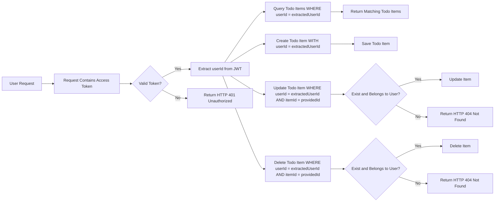

# Todo Application Requirements Specification

## Core Functionality

The todo application is a privacy-focused personal task manager designed with absolute user data isolation as its foundational principle. Every user can only access and manage their own todo items. No cross-user data visibility or interaction is permitted under any circumstances.

### User-Centric Todo Operations

WHEN a user is logged in, THE system SHALL allow the creation of new todo items.

WHEN a user creates a new todo item, THE system SHALL assign a unique identifier (UUID) to the item.

WHEN a user creates a new todo item, THE system SHALL associate the item with the authenticated user's account using the userId from the authentication token.

WHEN a user creates a new todo item, THE system SHALL set the initial status to "pending".

WHEN a user creates a new todo item, THE system SHALL set the creation timestamp (createdAt) to the current system time in UTC.

WHEN a user attempts to create a todo item while not authenticated, THE system SHALL immediately deny the request and return an HTTP 401 Unauthorized response.

WHEN a user is logged in, THE system SHALL allow viewing of all their own todo items.

WHEN a user requests their todo items, THE system SHALL return only items associated with their authenticated user ID, filtering out all items from other users.

WHEN a user requests their todo items, THE system SHALL sort items by creation timestamp in descending order (newest first) in the response.

WHEN a user requests their todo items, THE system SHALL return a list of todos with the following fields: id, title, description, status, createdAt, and updatedAt.

WHEN a user is logged in, THE system SHALL allow updating of any of their own todo items.

WHEN a user updates a todo item, THE system SHALL validate that the item's userId field matches the authenticated user's ID before allowing any modifications.

WHEN a user updates a todo item, THE system SHALL update the item's updatedAt timestamp to the current system time in UTC to indicate that a change has occurred.

WHEN a user updates a todo item title, THE system SHALL validate that the title is not empty or consists only of whitespace.

WHEN a user updates a todo item title, THE system SHALL limit the title to a maximum of 255 characters without truncating during update; if exceeded, the system SHALL reject the update request with an appropriate error message.

WHEN a user updates a todo item description, THE system SHALL allow a maximum of 10,000 characters without truncation; if exceeded, the system SHALL reject the update request with an appropriate error message.

WHEN a user updates a todo item status, THE system SHALL only accept one of the following three valid values: "pending", "completed", or "archived". Any other values SHALL be rejected.

WHEN a user attempts to update a todo item that does not belong to them, THE system SHALL deny the request and return an HTTP 404 Not Found response (to prevent information disclosure about the existence of items belonging to others).

WHEN a user is logged in, THE system SHALL allow deletion of any of their own todo items.

WHEN a user deletes a todo item, THE system SHALL verify that the item's userId field matches the authenticated user's ID before performing the deletion.

WHEN a user deletes a todo item, THE system SHALL permanently remove the item from the database with no possibility of recovery.

WHEN a user attempts to delete a todo item that does not belong to them, THE system SHALL deny the request and return an HTTP 404 Not Found response (to prevent information disclosure about the existence of items belonging to others).

WHEN a user attempts to access any todo item without being authenticated, THE system SHALL deny access to all operations (create, read, update, delete) and return an HTTP 401 Unauthorized response.

## Data Model Structure

The todo data model is designed to ensure absolute user data isolation through strict access control and ownership verification. The model does not support shared items, collaborations, or any form of cross-user data exposure.

### Todo Item Structure

THE system SHALL represent each todo item with the following attributes:

- An auto-generated unique identifier (UUID): The primary key, generated by the system upon creation.
- A title field (required): Non-empty string with a minimum of 1 character and a maximum of 255 characters.
- A description field (optional): String with a maximum length of 10,000 characters; may be null or empty.
- A status field (required): Restricted to exactly one of the three values: "pending", "completed", or "archived".
- A createdAt field (required): A timestamp in UTC format, automatically set at the time of item creation.
- A updatedAt field (required): A timestamp in UTC format, updated automatically upon any modification to the item (excluding field-value changes that do not alter the item state).
- A userId field (required): A foreign key that links the todo item directly to the authenticated user, stored as a UUID string.

### Data Ownership Enforcement

WHEN any todo item is created, THE system SHALL associate it with the authenticated user's unique identifier from the JWT token payload.

WHEN any todo item is queried, THE system SHALL filter all database results exclusively by the authenticated user's unique identifier, ensuring zero leakage of other users' data.

WHEN any todo item is updated, THE system SHALL validate that the authenticated user's identifier matches the todo item's userId field before permitting the update operation.

WHEN any todo item is deleted, THE system SHALL verify that the authenticated user's identifier matches the todo item's userId field before permitting the deletion operation.

THE system SHALL NEVER store, expose, or process any reference to other users' todo items in response to any API request, regardless of the request's authenticity or intent.

THE system SHALL NEVER allow search, filter, list, or aggregation operations that could expose items from multiple users, even if the API endpoint is intended for "viewing all items."

## User Interactions and Workflows

### Primary User Journey: Registration to Todo Creation

WHEN a user visits the application for the first time, THE system SHALL present a login/signup interface.

WHEN a user selects "Sign Up", THE system SHALL display a form requesting a valid email address and a password that meets minimum security requirements (minimum 12 characters).

WHEN a user submits the signup form, THE system SHALL create a new user account with the provided email and a cryptographically hashed password.

WHEN a user signs up, THE system SHALL automatically log them in and issue a JWT access token with a 15-minute expiration.

WHEN a user logs in, THE system SHALL verify the email and password combination against the stored credentials.

WHEN a user logs in successfully, THE system SHALL generate a JWT access token that includes the user's unique userId as a claim in the payload.

WHEN a user logs in successfully, THE system SHALL redirect the user to their personal todo list dashboard.

WHEN a user is redirected to the todo list dashboard, THE system SHALL display an empty list if the user has no existing todo items.

WHEN a user clicks the "Add New Task" button, THE system SHALL open a modal or form with two fields: "Title" and "Description" (optional).

WHEN a user completes the title field and clicks "Save", THE system SHALL create a new todo item with status "pending".

WHEN a user fills the description field, THE system SHALL include it in the todo item (if provided), respecting the 10,000-character limit.

WHEN a user has more than 50 todo items displayed, THE system SHALL implement pagination with a limit of 20 items per page.

WHEN a user clicks on a todo item in the list, THE system SHALL allow in-line editing of the item's title and description.

WHEN a user clicks the "Toggle Status" button on a todo item, THE system SHALL change the status between "pending" and "completed" only.

WHEN a user clicks the "Archive" button on a completed todo item, THE system SHALL change the status to "archived".

WHEN a user clicks "Delete" on any todo item in the list, THE system SHALL display a confirmation dialog with the text: "Are you sure you want to delete this task? This action cannot be undone."

WHEN a user confirms deletion in the dialog, THE system SHALL immediately remove the item from the database and update the UI to reflect the deletion.

WHEN a user navigates to different pages of the application (e.g., Profile, Settings), THE system SHALL preserve their login state and continue to show only their personal todo items.

WHEN a user logs out, THE system SHALL delete the local access token and redirect the user to the login screen.

WHEN a user returns after logout, THE system SHALL require re-authentication before any todo actions are permitted.

## Validation Rules

### Todo Item Validation

WHEN a user attempts to create a todo item with an empty title or a title containing only whitespace, THE system SHALL reject the request and return an error message: "Title cannot be empty."

WHEN a user attempts to create a todo item with a title longer than 255 characters, THE system SHALL reject the request and return an error message: "Title cannot exceed 255 characters."

WHEN a user attempts to create a todo item with a description longer than 10,000 characters, THE system SHALL reject the request and return an error message: "Description cannot exceed 10,000 characters."

WHEN a user attempts to update a todo item status to an invalid value (anything other than "pending", "completed", or "archived"), THE system SHALL reject the request and return an error message: "Invalid status value. Allowed values: pending, completed, archived."

WHEN a user attempts to update a todo item with no changes to any fields (i.e., all values are unchanged), THE system SHALL NOT update the updatedAt timestamp to reflect that no actual modification has occurred.

### User Context Validation

WHEN a user attempts to access any todo functionality (create, read, update, delete) without being authenticated, THE system SHALL return HTTP 401 Unauthorized without exposing any details about the nature of the requested resource.

WHEN a guest user (unauthenticated) attempts to view any existing todo items, THE system SHALL return an empty array [] (not an error, not a 404).

WHEN a user attempts to access a todo item by its ID that belongs to another user, THE system SHALL return HTTP 404 Not Found (not HTTP 403 Forbidden) to prevent information disclosure about the existence of items belonging to others.

WHEN a user attempts to update a todo item that has been deleted, THE system SHALL return HTTP 404 Not Found.

WHEN a user attempts to delete a todo item that has been deleted, THE system SHALL return HTTP 404 Not Found.

WHEN a user attempts to update or delete a todo item with a malformed UUID (invalid format), THE system SHALL return HTTP 400 Bad Request with message: "Invalid item ID format."

### Authentication and Session Validation

WHEN a user logs in, THE system SHALL verify their credentials using bcrypt password hashing and comparison with the stored hash.

WHEN a user logs in, THE system SHALL generate a JWT access token with an expiration of exactly 15 minutes.

WHEN a user logs in, THE system SHALL include their unique userId as a claim in the JWT payload, encoded in base64url format.

WHEN a user uses an expired JWT access token, THE system SHALL return HTTP 401 Unauthorized with message: "Access token has expired. Please log in again."

WHEN a user uses a JWT token with an invalid signature (tampered), THE system SHALL return HTTP 401 Unauthorized with message: "Invalid authentication token."

WHEN a user refreshes their access token using a valid refresh token, THE system SHALL validate the refresh token against the user's stored refresh token record, then issue a new access token with a 15-minute expiration.

WHEN a user refreshes their access token using an invalid, expired, or revoked refresh token, THE system SHALL return HTTP 401 Unauthorized.

WHEN a user logs out, THE system SHALL immediately invalidate the current access token (add to a short-term revocation list)

WHEN a user changes their password, THE system SHALL automatically invalidate all existing sessions and refresh tokens for that user.

WHEN a user revokes access from all devices, THE system SHALL invalidate all refresh tokens for that user and force re-authentication on all devices.

WHEN a user signs up, THE system SHALL create a new user account with the provided email address and a cryptographically hashed password using bcrypt.

WHEN a user signs up, THE system SHALL immediately log them in and issue an access token without requiring a separate login step.

WHEN a user attempts to register with an email address that already exists in the system, THE system SHALL return an error message: "This email is already registered. Please log in or use a different email."

WHEN a user attempts to reset their password with an invalid or malformed reset token, THE system SHALL return an error message: "Invalid password reset token."

WHEN a user attempts to reset their password with an expired reset token, THE system SHALL return an error message: "Password reset token has expired. Request a new reset link."

WHEN a user successfully resets their password, THE system SHALL immediately invalidate all existing sessions and refresh tokens for that user.

## Data Flow and Access Control

All todo item operations follow a strict data isolation pattern based on authenticated user identity and ownership verification. The system does not rely on client-side filtering or any other security-through-obscurity practices—all data access decisions are made server-side.

Mermaid Diagram:

The diagram above demonstrates the complete access control workflow for todo operations. Every interaction requires:

1. A valid authentication token (JWT) with signature verification
2. Extraction of the authenticated user's unique identifier (userId) from the token payload
3. Strict server-side filtering of all database queries by the user's ID
4. Verification of ownership for all modification operations (update/delete)
5. Always returning HTTP 404 Not Found for unauthorized access attempts to specific items (to prevent enumeration attacks)

This design ensures that even if a malicious user guesses a todo item ID, they cannot access it unless they are the owner. The system prevents data leakage through both direct queries and error message design.

The system guarantees complete data separation: no user can ever see, modify, or delete another user's todo items. This isolation is implemented at multiple levels:

- Database query level (WHERE userId = X)
- Application logic level (ownership validation)
- API response level (no metadata about other users' items)
- Error response level (404 instead of 403 to obscure existence)

The todo system is designed to be minimal but complete. Every feature is implemented with strict security and privacy principles at the core.

## Summary of Business Requirements

The todo application is a privacy-focused personal task manager where:

- User data isolation is absolute
- No user can access another user's information
- Authentication is mandatory for any task management operations
- Authorization is enforced via JWT tokens with userId claims
- All operations are filtered by the user's authenticated identity
- Error messages are designed to prevent information leakage
- The system is minimal by design - no advanced features (sharing, collaboration, reminders, categories) are included

This ensures a simple, secure, and trustworthy application that users can depend on for personal task management.