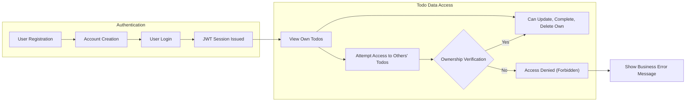

# User Actors and Permissions

## Actor List

### Primary Actor: User
- **Name**: User
- **Description**: An authenticated individual who manages their personal Todo items using the application.
- **Responsibilities:**
    - Create new Todo tasks for themselves
    - View personal Todo list
    - Update details or status of their Todos
    - Mark Todos as complete/incomplete
    - Delete their personal Todos
- **Restrictions:**
    - SHALL NOT view, edit, or delete any Todo belonging to other users
    - SHALL NOT use the system without being authenticated
    - SHALL NOT access any administrative, system-level, or multi-role features (strictly minimum viable permissions only)

## Authentication Flow

### Registration
- WHEN an individual wants to use the application, THE system SHALL require them to register using a unique email and password.
- WHEN registration form is submitted with valid data, THE system SHALL create a new account for that user with no further user roles or permissions.

### Login and Logout
- WHEN a registered user submits correct email/password credentials, THE system SHALL authenticate them and issue a session token using JWT technology, including claims for userId and session timing.
- WHEN an authenticated user logs out, THE system SHALL invalidate the session immediately.

### Session Management
- THE system SHALL automatically expire an authenticated session after 30 days of inactivity.
- WHEN an expired or invalid session is used for any action, THE system SHALL require the user to re-authenticate.

### Password Reset and Security
- WHEN a user forgets their password, THE system SHALL require email-based ownership verification before permitting a reset.
- WHEN verification is successful, THE system SHALL allow new password creation and restore account access.
- All user credentials SHALL be stored using industry standard practices for password security and not retrievable after creation (password hash only).

### Data Ownership / Data Isolation
- WHEN an authenticated user requests access to Todo data, THE system SHALL allow access only to data owned by that authenticated account, and SHALL deny all attempts to access any Todo items created by others.
- IF an unauthenticated request is made to any Todo endpoint, THEN THE system SHALL deny the request and instruct the user to log in.
- WHEN a user attempts to access or manipulate a Todo item not owned by their account, THE system SHALL deny the operation and respond with a business-level error stating 'access forbidden to other users' data'.

## Permission Matrix

| Action                                    | User |
|-------------------------------------------|:----:|
| Register for an account                   |  ✅  |
| Log in                                    |  ✅  |
| Log out                                   |  ✅  |
| View their own Todo items                 |  ✅  |
| Create their own Todo items               |  ✅  |
| Update their own Todo items               |  ✅  |
| Mark their own Todo items as complete     |  ✅  |
| Delete their own Todo items               |  ✅  |
| Access Todo items owned by other users    |  ❌  |
| Change account roles or permissions       |  ❌  |
| Access administrative or system settings  |  ❌  |

### Key Permission Rules (EARS Format)
- WHEN a user submits a registration form with a unique email and password, THE system SHALL create a new user account.
- WHEN a user logs in with correct credentials, THE system SHALL allow access to all features relating to their own Todos.
- IF a user attempts to access, edit, or delete a Todo item they do not own, THEN THE system SHALL deny this operation and return a clear error response per business rules.
- IF any unauthenticated user requests access to any Todo functionality, THEN THE system SHALL respond with an error requiring authentication.
- WHEN a user requests to list, update, or delete a Todo item, THE system SHALL first verify ownership matches the authenticated account before permitting the action.
- IF a user submits a request using an expired, invalid, or tampered session token, THEN THE system SHALL deny access and require the user to log in again.

### Data Isolation
- The system SHALL strictly enforce that user accounts, authentication, and all Todo items are isolated per account. Each user's data is only accessible and modifiable by themselves with no exceptions, regardless of endpoint or feature.

### Business Process Flow Diagram

## Implementation Guidance
- All account and permission logic SHALL be based exclusively on per-user data and basic JWT session management (no social/phone/multi-factor, no escalation or role levels).
- Strict use of EARS format and business language is required so future developers can implement authentication, session, and data isolation logic directly from these requirements for a minimum viable Todo List backend.
