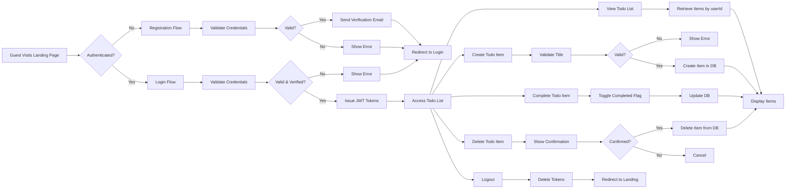

# Multi-User Todo List Application - Business Requirements

## Service Overview

This application provides a secure, private todo list system for individual users. Each user maintains their own isolated list of tasks that cannot be accessed, viewed, or modified by any other user. The system enforces strict user separation through authentication and authorization mechanisms, ensuring complete privacy and data protection.

The application follows a minimalist design philosophy, focusing exclusively on core functionality: user registration and login, task creation, task status management, task deletion, and secure session handling. No additional features such as tagging, categorization, sharing, or collaboration are included, maintaining the simplicity requested by the user.

## User Actors

The system recognizes three distinct user actors:

### Guest

A guest is an unauthenticated user who has not yet create an account. Guests can view the application landing page and initiate the registration process, but cannot access any personal todo lists or perform any task management operations.

### User

A user is an authenticated individual who has successfully registered and verified their email address. Users have full权限 to create, view, complete, and delete their own todo items. Each user's data is completely isolated from other users, with no capability to access or interact with anyone else's todo list.

### Admin

An admin is a system-level actor with permissions beyond regular users. The admin can view system metrics, manage user accounts (deactivate, delete, or verify accounts), and monitor system health. Admin actions are logged for security audit purposes. In this minimal implementation, admin functionality is not exposed to end users but is available to maintainers.

## Authentication Requirements

### Registration Process

WHEN a guest visits the application homepage, THE system SHALL display a registration form with email and password fields.

WHEN a guest submits a registration form with a valid email address and password (minimum 8 characters), THE system SHALL create a new user account with a unique userId.

WHEN a guest submits a registration form with an email address that already exists in the system, THE system SHALL return an error message "Email already registered" and prevent account creation.

WHEN a guest submits a registration form with a password shorter than 8 characters, THE system SHALL return an error message "Password must be at least 8 characters long" and prevent account creation.

WHEN a guest submits a registration form with an email address that is not in valid email format, THE system SHALL return an error message "Please enter a valid email address" and prevent account creation.

WHILE the registration request is being processed, THE system SHALL display a loading indicator to the user.

IF the system fails to create the account due to a server error, THEN THE system SHALL display a generic error message "Registration failed. Please try again later." and log the error for debugging purposes.

IF the registration is successful, THEN THE system SHALL send a verification email to the provided email address with a unique token.

IF the user attempts to register twice with the same email without verifying, THEN THE system SHALL keep the original unverified account and send a new verification email.

### Registration Success Flow

WHEN the user receives the verification email, THE system SHALL allow them to click a unique verification link contained within.

WHEN the user clicks the verification link, THE system SHALL validate the token and activate the user account.

WHEN the user account is activated, THE system SHALL redirect the user to the login page with a success message "Your account has been verified. You can now log in."

WHILE the account remains unverified, THE system SHALL prevent the user from logging in and display a message "Please verify your email address to log in."

### Registration Failure Scenarios

IF the email service fails to deliver the verification email, THEN THE system SHALL display a message "We couldn't send the verification email. Please try registering again or contact support." and allow the user to retry registration.

IF the user doesn't verify their email within 7 days, THEN THE system SHALL automatically delete the unverified account and allow the email to be reused for a new registration.

### Login Process

WHEN a user attempts to log in with their email and password, THE system SHALL validate the credentials against the stored hash.

WHEN the provided email and password combination is correct, THE system SHALL generate a JSON Web Token (JWT) containing:

{
  "userId": "unique-identifier",
  "role": "user",
  "permissions": ["read_todos", "write_todos", "delete_todos"],
  "iat": 1678901234,
  "exp": 1678904834
}

WHEN the provided email or password combination is incorrect, THE system SHALL return an HTTP 401 error with error code AUTH_INVALID_CREDENTIALS.

WHEN the user account is not yet verified, THE system SHALL return an HTTP 401 error with error code AUTH_EMAIL_NOT_VERIFIED.

WHEN the user account has been permanently deactivated by an administrator, THE system SHALL return an HTTP 401 error with error code AUTH_ACCOUNT_DEACTIVATED.

WHILE login credentials are being validated, THE system SHALL display a loading indicator to the user.

IF the login attempt fails due to network connectivity issues, THEN THE system SHALL display a message "Unable to connect to server. Please check your internet connection and try again."

### Session Management

THE system SHALL store the JWT access token in browser localStorage.

THE access token SHALL expire after 30 minutes of inactivity.

WHEN the access token expires, THE system SHALL redirect the user to the login page and display "Your session has expired. Please log in again."

THE system SHALL provide a refresh token mechanism:

WHEN the access token expires, THE system SHALL use the refresh token (stored separately in an httpOnly cookie) to request a new access token automatically.

WHEN the refresh token is valid and not expired, THE system SHALL issue a new access token with a 30-minute expiration.

WHEN the refresh token has expired (7 days after issuance), THE system SHALL require the user to log in again with their credentials.

WHEN the user manually logs out, THE system SHALL delete both the access token from localStorage and the refresh token from the httpOnly cookie.

## Authorization Requirements

### Data Isolation Principle

THE system SHALL enforce strict tenant isolation so that no user can access, view, or manipulate another user's todo items.

THE system SHALL use the userId from the JWT token as the only filter for all todo data queries, even when the user manipulates URL parameters or request body content.

WHERE a user attempts to send HTTP POST/GET/PUT/DELETE requests with a different target userId in the request body or parameters, THE system SHALL ignore any userId provided by the client and use only the authenticated userId from the JWT token.

IF the JWT token is missing, malformed, or tampered with, THEN THE system SHALL return HTTP 401 Unauthorized.

### Permission Matrix

| Actor | Access Todo List | Create Todo Item | Complete Todo Item | Delete Todo Item | Logout | Register | View Other Users |
|-------|------------------|------------------|--------------------|------------------|--------|----------|------------------|
| Guest | No               | No               | No                 | No               | No     | Yes      | No               |
| User  | Yes              | Yes              | Yes                | Yes              | Yes    | No       | No               |
| Admin | Yes              | Yes              | Yes                | Yes              | Yes    | Yes      | Yes              |

## Core Functionality

### Todo Item Creation

WHEN a user clicks the "Add Task" button, THE system SHALL display an input field with placeholder text "What needs to be done?"

WHEN a user enters text into the task input field and clicks "Save", THE system SHALL validate the input.

IF the task title is empty or contains only whitespace, THEN THE system SHALL display an error message "Task title cannot be empty" and not create the task.

IF the task title exceeds 200 characters, THEN THE system SHALL display an error message "Task title cannot exceed 200 characters" and not create the task.

WHEN the task title is valid, THE system SHALL create a new todo item with the following properties:

{
  "id": "uuid-v4",
  "title": "entered text",
  "completed": false,
  "createdAt": "ISO 8601 timestamp",
  "updatedAt": "ISO 8601 timestamp",
  "userId": "authenticated user id from JWT"
}

WHEN the todo item is successfully created, THE system SHALL add the new item to the top of the todo list and clear the input field.

WHEN the todo item creation request fails due to a server error, THE system SHALL display a message "Failed to create task. Please try again." and retain the input in the field for the user to try again.

WHEN the user enters special characters (including emoji, non-Latin scripts, and unicode), THE system SHALL accept and store them unchanged.

WHEN the user presses Enter while typing in the task input field, THE system SHALL behave identically to clicking "Save".

### Todo Item Completion

WHEN a user clicks the checkbox next to a todo item, THE system SHALL toggle the "completed" property of that item.

WHEN the item status changes from incomplete to complete, THE system SHALL update the "updatedAt" field to the current timestamp.

WHEN the item status changes from complete to incomplete, THE system SHALL update the "updatedAt" field to the current timestamp.

WHEN a todo item has been completed, THE system SHALL visually display it with strikethrough text and a subtle gray color.

WHILE the completion status change is being processed, THE system SHALL show a small loading spinner next to the checkbox.

IF the status update fails due to network issues, THEN THE system SHALL revert the checkbox to its previous state and display a message "Could not update task status. Please try again.".

WHEN the user refreshes the page, THE system SHALL restore the completion status of all items as they were before the refresh.

THE system SHALL preserve the completion status of todo items across device restarts and browser sessions.

### Todo Item Deletion

WHEN a user clicks the "Delete" button next to a todo item, THE system SHALL display a confirmation dialog with text "Are you sure you want to delete this task? This action cannot be undone."

WHEN the user confirms deletion in the dialog, THE system SHALL remove the todo item from the database permanently.

WHEN the deletion is successful, THE system SHALL remove the todo item from the UI immediately.

WHEN the deletion fails due to network issues, THE system SHALL display a message "Failed to delete task. Please try again." and retain the item in the list.

WHEN the user clicks "Cancel" in the confirmation dialog, THE system SHALL do nothing and close the dialog.

IF the user attempts to delete a todo item that does not belong to their userId, THEN THE system SHALL return HTTP 403 Forbidden and log a security alert.

IF the deletion request contains a malformed taskId or invalid format, THEN THE system SHALL return HTTP 400 Bad Request.

### Todo List Access

WHEN a logged-in user navigates to the todo list page, THE system SHALL retrieve all todo items associated with the userId from the JWT token.

WHEN a logged-in user attempts to access todo items belonging to another userId, THE system SHALL return an empty array and log a security event.

WHERE the user has the permission "read_todos", THE system SHALL return the user's complete todo list in chronological order (oldest first).

WHEN the user has no todo items, THE system SHALL display a message "You have no tasks yet. Create your first task above!"

WHILE the todo list is being loaded from the database, THE system SHALL display a loading state with placeholder skeletons.

IF the database connection fails during todo retrieval, THEN THE system SHALL display a message "Could not load tasks. Please check your connection and try again." and retry the request after 5 seconds.

### User Logout

WHEN a user clicks the "Logout" button in the navigation menu, THE system SHALL delete the access token from localStorage.

WHEN the access token is deleted from localStorage, THE system SHALL delete the refresh token from the httpOnly cookie.

WHEN both tokens are removed, THE system SHALL redirect the user to the landing page.

WHEN the user is redirected to the landing page after logout, THE system SHALL display a message "You have been logged out."

WHEN a user attempts to navigate directly to the todo list page after logout, THE system SHALL redirect the user to the landing page and display "Please log in to access your tasks.".

WHILE the logout request is being processed, THE system SHALL display a loading indicator in the navigation menu.

IF the logout request fails due to server connectivity issues, THEN THE system SHALL display a message "Could not log out. Please refresh the page." and retain the user's login session.

## Error Handling

### Authentication Errors

| Error Condition | HTTP Status | Error Code | User Message | System Action |
|----------------|-------------|------------|--------------|---------------|
| Invalid credentials | 401 | AUTH_INVALID_CREDENTIALS | "Invalid email or password" | Log failed login attempt |
| Email not verified | 401 | AUTH_EMAIL_NOT_VERIFIED | "Please verify your email to log in" | Do not log as security threat |
| Account deactivated | 401 | AUTH_ACCOUNT_DEACTIVATED | "This account has been deactivated" | Log for admin auditing |
| Invalid JWT token | 401 | AUTH_INVALID_TOKEN | "Invalid authentication token" | Log for security monitoring |
| Expired token | 401 | AUTH_TOKEN_EXPIRED | "Session expired. Please log in again" | Do not log as error - normal operation |

### Authorization Errors

| Error Condition | HTTP Status | Error Code | User Message | System Action |
|----------------|-------------|------------|--------------|---------------|
| Access other user's data | 403 | AUTH_NOT_AUTHORIZED | "You are not authorized to view this content" | Log as security event |

### Validation Errors

| Error Condition | HTTP Status | Error Code | User Message | System Action |
|----------------|-------------|------------|--------------|---------------|
| Empty task title | 400 | TASK_TITLE_EMPTY | "Task title cannot be empty" | Return to form with error |
| Task title too long | 400 | TASK_TITLE_TOO_LONG | "Task title cannot exceed 200 characters" | Return to form with error |
| Invalid taskId format | 400 | TASK_ID_INVALID | "Invalid task identifier format" | Log for debugging |

### System Errors

| Error Condition | HTTP Status | Error Code | User Message | System Action |
|----------------|-------------|------------|--------------|---------------|
| Database connection failure | 503 | DB_CONNECTION_FAILED | "Could not load tasks. Please check your connection and try again." | Retry after 5 seconds (3 attempts max) |
| Email service failure | 503 | EMAIL_SERVICE_FAILURE | "We couldn't send the verification email. Please try registering again or contact support." | Allow retry |
| Server error | 500 | SERVER_ERROR | "Something went wrong. Please try again later." | Log complete error details |

### Network Errors

| Error Condition | User Message | System Action |
|----------------|--------------|---------------|
| Network timeout during registration | "Unable to connect to server. Please check your internet connection and try again." | Retry registration after 5 seconds (3 attempts max) |
| Network timeout during login | "Unable to connect to server. Please check your internet connection and try again." | Retry login after 5 seconds (3 attempts max) |
| Network timeout during task creation | "Failed to create task. Please try again." | Retain user input and allow retry |
| Network timeout during task update | "Could not update task status. Please try again." | Revert UI state and allow retry |
| Network timeout during deletion | "Failed to delete task. Please try again." | Retain item in list and allow retry |
| Network timeout during logout | "Could not log out. Please refresh the page." | Retain session and display notification |

## Performance Expectations

### Response Time Targets

| Operation | Target Time | Acceptable Maximum |
|----------|-------------|-------------------|
| User registration | < 1.5s | < 3s |
| User login | < 1s | < 2s |
| Todo list retrieval | < 500ms | < 1s |
| Todo item creation | < 400ms | < 1s |
| Todo item update | < 300ms | < 750ms |
| Todo item deletion | < 400ms | < 1s |
| User logout | < 200ms | < 500ms |

### Load Capacity

The system shall support:
- Up to 10,000 concurrent active users under normal load
- Peak load of 500 registration attempts per minute
- Peak load of 1,000 login attempts per minute
- Peak load of 2,000 todo item operations (create/read/update/delete) per minute

### Availability Requirements

The system shall maintain 99.9% uptime. Planned maintenance windows shall be scheduled during off-peak hours and users shall be notified 48 hours in advance.

### Scalability Considerations

The architecture shall be designed to allow horizontal scaling of authentication and API services to accommodate growth in user base. Database connections shall use connection pooling to handle increased concurrent requests efficiently.

## Data Persistence

### Todo Item Data Structure

Each todo item shall be stored with the following properties:

- id: UUID v4 (string)
- title: String (max 200 characters)
- completed: Boolean (default: false)
- createdAt: ISO 8601 timestamp (UTC)
- updatedAt: ISO 8601 timestamp (UTC)
- userId: UUID v4 (string, foreign key to users table)

All data shall be stored in a relational database with proper indexing on userId and createdAt fields for efficient retrieval.

### User Data Structure

Each user account shall be stored with the following properties:

- id: UUID v4 (string)
- email: String (unique, case-insensitive)
- passwordHash: String (bcrypt hash)
- isVerified: Boolean (default: false)
- verificationToken: String (nullable, expires in 7 days)
- isActive: Boolean (default: true)
- createdAt: ISO 8601 timestamp (UTC)
- updatedAt: ISO 8601 timestamp (UTC)
- lastLoginAt: ISO 8601 timestamp (UTC)

Password hashes shall be generated using bcrypt with 12 rounds of salting. No plaintext passwords are ever stored.

### Security and Privacy

- All data shall be transmitted via HTTPS
- JWT tokens shall be signed with HMAC SHA-256
- Refresh tokens shall be stored in httpOnly, secure cookies
- Database shall be encrypted at rest
- No personally identifiable information shall be logged in audit trails
- All data shall be backed up daily

## User Workflows Diagram

### Diagram Legend

- **A**: Guest interaction start point
- **B**: Authentication state check
- **C**: Registration workflow
- **D**: Login workflow
- **E, J**: Credential validation
- **F, K**: Validation outcome checks
- **G**: Email verification process
- **H**: Login page redirect
- **L**: Token issuance
- **N**: Dashboard access
- **O, P, Q, R**: Core todo management actions
- **S**: Logout initiation
- **AF**: Token removal
- **AG**: Landing page return
- **T**: Input validation
- **U**: Validation check
- **V**: Data creation
- **W**: Error display
- **X**: Data retrieval
- **Y**: UI display
- **Z**: Status toggle
- **AA**: Database update
- **AB, AC, AD, AE**: Delete confirmation logic
- **AF, AG**: Logout completion

All paths lead back to a consistent user experience where users can only interact with their own data.

> This document defines **business requirements only**. All technical implementations (architecture, APIs, database design, etc.) are at the discretion of the development team.