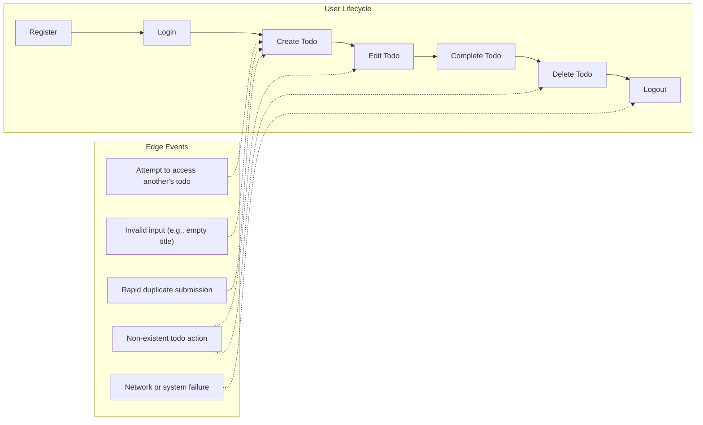

# User Scenarios and Journeys for Todo List Application

## Scenario Summaries

This section details the minimum user journeys and system guarantees for a simple Todo list service. Only the essential flows required for individual task management are included, ensuring the application is easy to use and focused on core needs. All scenarios assume a single, authenticated user managing their own tasks, with robust handling of authentication, input validation, data integrity, and user experience.

| Scenario Number | Scenario Name         | Brief Description                                                                     |
|-----------------|----------------------|---------------------------------------------------------------------------------------|
| 1               | Register and Login   | User creates an account and authenticates to begin managing their todos               |
| 2               | Create Todo Item     | User adds a new task to their list                                                    |
| 3               | View Todos           | User checks the full list of current (and completed) todo items                       |
| 4               | Edit Todo Item       | User updates the content or status (e.g., marking as completed) of a todo task        |
| 5               | Complete Todo Item   | User marks a todo task as finished                                                    |
| 6               | Delete Todo Item     | User removes a specific todo from their list                                          |
| 7               | Session/Logout       | User logs out or their session expires                                                |
| 8               | Edge Scenarios       | Attempts to access or modify someone else’s data, invalid actions, or error responses |

## Step-by-Step User Journeys

### 1. Register and Login
- WHEN a user navigates to registration and submits valid email and password, THE system SHALL create a new unique user account, returning confirmation upon success.
- IF registration information is already registered, THEN THE system SHALL reject registration and present a clear error describing the conflict.
- WHEN a user submits valid credentials to login, THE system SHALL authenticate and establish a secure session tied to their identity.
- IF submitted credentials are invalid, THEN THE system SHALL reject login and display a specific authentication error message.

### 2. Create Todo Item
- WHEN an authenticated user submits a new todo item with required details (title; notes optional), THE system SHALL add the todo to that user's list and respond with confirmation including the todo's details.
- IF todo creation is attempted with invalid or incomplete data (e.g., missing title, excessive length), THEN THE system SHALL reject the creation and return a descriptive error.

### 3. View Todos
- WHEN an authenticated user requests their todo list, THE system SHALL return all todos (both active and completed) owned by the user, sorted by status and creation date.
- WHERE the user provides filter parameters (such as showing only completed tasks), THE system SHALL apply filters before returning results.

### 4. Edit Todo Item
- WHEN an authenticated user submits changes to one of their own todos (such as editing title, notes, or due date), THE system SHALL update the todo with the requested fields and respond with confirmation.
- IF a user attempts to edit a todo not owned by them, THEN THE system SHALL deny the request and explain insufficient permission.

### 5. Complete Todo Item
- WHEN an authenticated user marks their todo as complete, THE system SHALL change its status to completed and confirm the update.
- IF a user tries to complete a todo that does not exist, or is already completed, THEN THE system SHALL respond with a clear error indicating the problem.

### 6. Delete Todo Item
- WHEN an authenticated user deletes their own todo, THE system SHALL completely remove the todo from their list and confirm deletion.
- IF a user tries to delete a todo they do not own, THEN THE system SHALL deny the request and log the attempt for auditing.

### 7. Session/Logout
- WHEN a user logs out, THE system SHALL immediately end their session and require login for further actions.
- WHILE a user's session is expired, THE system SHALL deny all requests requiring authentication until the user logs in again.

## Alternate/Edge Case Scenarios

### Access Control Violation
- WHEN a user attempts to view or modify a todo belonging to another user, THE system SHALL deny permission and return a clear authorization error message.

### Input Validation Failure
- WHEN a user submits a todo with empty or invalid value for any required field, THE system SHALL reject the input and return a validation error, specifically mentioning the violated rule (e.g., "title is required and must be under 255 characters").

### Non-existent Resource
- WHEN a user attempts to edit or delete a todo that does not exist, THE system SHALL return a not-found error and may suggest refreshing the user's todo list to resync data.

### Duplicate Submission
- WHEN the system detects rapid duplicate submissions for the same todo from the same user (such as double-click or network retry), THE system SHALL save only a single unique todo instance and inform user about the duplicate prevention.

### Network or System Error
- IF a user action fails due to a network or system error, THEN THE system SHALL return a generic error, prompt the user to retry, and make best effort to avoid loss of valid user data.

## Minimal Authentication and Authorization Principles

- All todo listing, creation, edition, completion, and deletion require a valid authenticated session.
- All todos are owned exclusively by the creating user; no sharing or delegation features exist in the minimum app.
- Only the owner of a todo may read, edit, complete, or delete it. All access control enforcement and permission checks SHALL be implemented at the business logic layer.
- The system SHALL return clear and actionable errors for all authentication and authorization failures.

## Process Flow Visualization

## Summary of Minimal Functional Guarantees

Every requirement is expressed in EARS format where applicable, providing clarity and testability. The backend SHALL enforce strict authentication, single-user ownership on all todos, comprehensive input validation, and clear error reporting for all user actions, edge cases, and system failures. This specification represents the absolute minimum for a usable Todo application focused on secure, robust, and user-friendly task management for a single individual per account.