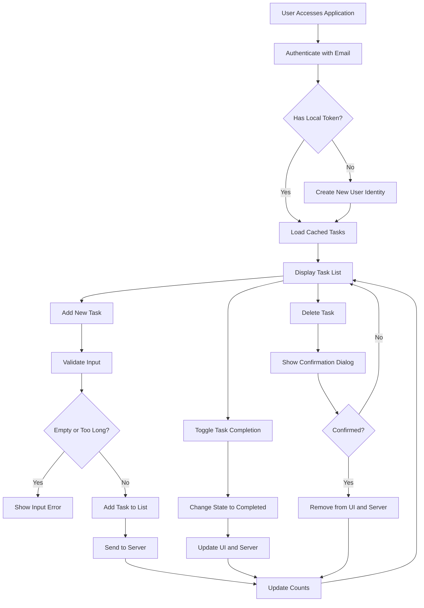

# Todo List Application Requirements Analysis

## Service Overview

The Todo List application provides a minimal, focused task management experience for individuals seeking to organize daily tasks without complexity. Unlike feature-heavy competitors, this application delivers only essential functionality with an intuitive interface, enabling users to quickly capture, track, and complete tasks with minimal friction. The service is designed for personal productivity with zero learning curve and immediate usability.

## Business Model

This application exists to solve the fundamental human need for simple, reliable task organization. The target user is an individual who needs to remember and complete daily tasks but is overwhelmed by complex productivity tools that require configuration and learning. The core value proposition is radical simplicity: users can start using the application in under 10 seconds with no onboarding, no settings, and no distractions.

The service will be sustained through voluntary donations from users who find significant value in the simplicity and reliability of the application. Growth will occur through word-of-mouth referrals from satisfied users who appreciate the clean, ad-free experience. Success will be measured by user retention, daily active usage, and positive feedback from users describing the application as "just works".

## User Actors

- **User**: An individual who creates, views, completes, and deletes personal tasks. The only actor in this system. All functionality is designed for this single user role.

## Primary User Flow

1. User accesses the application through a web browser
2. User sees the task list interface with all their pending tasks at the top and completed tasks below
3. User types a new task description in the input field and presses Enter or clicks the Add button
4. User clicks the checkbox next to a task to mark it as completed
5. User clicks the delete icon (×) next to a task to permanently remove it
6. User closes the browser window or navigates away—session ends automatically when the tab is closed

## Functional Requirements

### Task Creation Requirements

WHEN a user enters text in the task input field and submits it, THE system SHALL create a new pending task with the provided description.

WHEN a user submits an empty task description, THE system SHALL NOT create a task and SHALL display an error message: "Please enter a task description."

WHEN a user submits a task description exceeding 500 characters, THE system SHALL NOT create a task and SHALL display an error message: "Task description cannot exceed 500 characters."

WHEN a task is successfully created, THE system SHALL immediately add the new task to the top of the pending tasks list with a visual loading spinner for 300ms, then render the final task with its description and a checkmark icon.

WHEN a task creation fails due to network error, THE system SHALL display an error notification: "Failed to save task. Please check your internet connection and try again."

### Task Display Requirements

THE Todo List application SHALL display all tasks owned by the authenticated user in a single list interface.

THE system SHALL show each task with its description text and current state (pending or completed).

THE system SHALL update the displayed task list instantly whenever a task is created, completed, or deleted.

THE system SHALL ensure the task list is always synchronized with the server state and never shows stale data.

### Sorting Rules

WHEN the task list is first displayed, THE system SHALL sort tasks with pending tasks appearing above completed tasks.

WHILE a user is viewing the task list, THE system SHALL maintain the sort order of pending tasks above completed tasks.

THE system SHALL sort pending tasks in chronological order, with the oldest tasks appearing first.

THE system SHALL sort completed tasks in reverse chronological order, with the most recently completed tasks appearing first.

### Filtering Rules

WHERE a user selects the "Show All" filter, THE system SHALL display all tasks: both pending and completed.

WHERE a user selects the "Show Active" filter, THE system SHALL display only pending tasks.

WHERE a user selects the "Show Completed" filter, THE system SHALL display only completed tasks.

WHILE the "Show Active" filter is selected, THE system SHALL automatically update the displayed list when a task's state changes from completed to pending.

WHILE the "Show Completed" filter is selected, THE system SHALL automatically update the displayed list when a new task is completed.

### Visual Cues and Indicators

WHEN a task is pending, THE system SHALL display the task description in regular text weight and color.

WHEN a task is completed, THE system SHALL display the task description with a strikethrough.

WHEN a task is completed, THE system SHALL display a checkmark icon immediately to the left of the task description.

WHILE a task is being saved after a state change, THE system SHALL display a loading spinner next to the task to indicate processing.

WHEN the task list is empty, THE system SHALL display a message: "You have no tasks. Create one to get started!".

THE system SHALL display the count of pending tasks in the application header in the format: "Pending (N)" where N is the number of pending tasks.

THE system SHALL display the count of completed tasks in the application header in the format: "Completed (N)" where N is the number of completed tasks.

WHEN there are more than 100 tasks visible, THE system SHALL enable vertical scrolling within the task list area.

WHEN a task description is too long to fit on a single line, THE system SHALL wrap the text to multiple lines without truncating.

THE system SHALL ensure text wrapping occurs naturally based on available screen width and font size, without forcing line breaks at inappropriate word boundaries.

THE system SHALL use a consistent font size and line height across all task items to ensure visual harmony.

THE system SHALL not use any color to represent task state beyond the strikethrough for completed tasks.

THE system SHALL not use icons or indicators other than the checkmark for completed tasks, to maintain visual simplicity.

WHEN the task list is loaded, THE system SHALL ensure the user sees the top of the list without requiring manual scrolling.

THE system SHALL maintain a minimum spacing of 12 pixels between each task item for visual clarity.

THE system SHALL ensure task list items are uniformly aligned to the left edge of the display area.

### Task Completion Requirements

WHEN a user clicks the checkmark icon next to a pending task, THE system SHALL change the task state from pending to completed.

WHEN a task's state changes to completed, THE system SHALL immediately update the visual appearance to include strikethrough and a permanent checkmark.

WHEN a completed task is clicked, THE system SHALL NOT change its state back to pending.

WHEN a task is successfully marked as completed, THE system SHALL update the task count in the application header within 200ms.

WHEN task completion fails due to network error, THE system SHALL display an error notification: "Failed to update task. Please check your internet connection and try again."

WHEN a task is successfully marked as completed, THE system SHALL send an analytics event: "task_completed" with the task ID.

### Task Deletion Requirements

WHEN a user clicks the delete icon (×) next to a task, THE system SHALL display a confirmation dialog: "Are you sure you want to delete this task? This cannot be undone."

WHEN the user confirms deletion, THE system SHALL immediately remove the task from the display and send a request to delete it from the server.

WHEN deletion is successful, THE system SHALL update the task count in the application header within 200ms and display a confirmation message: "Task deleted."

WHEN the user cancels deletion, THE system SHALL not modify the task and keep its current state.

WHEN task deletion fails due to network error, THE system SHALL display an error notification: "Failed to delete task. Please check your internet connection and try again."

WHEN a task is successfully deleted, THE system SHALL send an analytics event: "task_deleted" with the task ID.

### Authentication Requirements

WHEN a user first accesses the application, THE system SHALL prompt them to authenticate using their email address.

THE system SHALL accept any valid email format and treat each unique email as a unique user identity.

WHEN a user enters their email and clicks "Continue", THE system SHALL generate a temporary authentication token and store it in the browser's localStorage.

WHEN a user returns to the application, THE system SHALL check for an existing token in localStorage and automatically authenticate the user if present.

THE system SHALL not collect or store any personal identifiers beyond the email address.

THE system SHALL not use password-based authentication—email is the only credential required.

THE system SHALL ensure session persistence across browser sessions via localStorage storage.

## Error Handling Requirements

### Authentication Errors

WHEN the user enters an invalid email format (e.g., "test" instead of "test@example.com"), THE system SHALL display an error: "Please enter a valid email address."

WHEN the email field is left empty, THE system SHALL display an error: "Please enter your email address to continue."

WHEN the authentication API fails to respond (network timeout or server error), THE system SHALL display an error: "Unable to authenticate. Please check your internet connection and try again."

### Input Validation Errors

WHEN the task description is empty, THE system SHALL display error: "Please enter a task description."

WHEN the task description exceeds 500 characters, THE system SHALL display error: "Task description cannot exceed 500 characters."

WHEN a task update fails (due to API error), THE system SHALL display a persistent notification with: "Failed to update task. Please check your internet connection and try again."

### Business Logic Error Cases

WHEN the user attempts to delete a task that does not exist, THE system SHALL NOT perform any action and SHALL display a generic feedback: "Task not found."

WHEN the user attempts to complete a task that is already completed, THE system SHALL NOT perform any action and SHALL display a feedback message: "Task is already completed."

### System-Level Errors

WHEN no internet connection is detected, THE system SHALL enter an offline mode and display a banner: "You are offline. Changes will be saved when connection is restored."

WHEN the browser localStorage is full or unavailable, THE system SHALL display an error: "Your browser settings are preventing task storage. Please enable localStorage to use this application."

### User-Facing Error Messages

All error messages SHALL be:
- Written in clear, conversational language
- Free of technical jargon
- Actionable (contain guidance on how to resolve the issue)
- No longer than 150 characters
- Always visible at the top of the task list interface
- Auto-dismiss after 5 seconds unless the user manually closes them

## Performance Expectations

### Task Creation Response Time

WHEN a user submits a new task, THE system SHALL display the task in the UI within 300ms from the time the user clicks "Add".

WHEN the server response takes longer than 1.2 seconds, THE system SHALL continue showing the loading spinner with progressive enhancement (fade animation) until a response is received.

### Task List Loading Time

WHEN the application is first loaded, THE system SHALL display the user's task list within 1 second when connected to the internet.

WHEN the application loads with cached data, THE system SHALL display the task list instantly with a visual "syncing" animation to indicate data is being refreshed from the server.

### Task Status Update Speed

WHEN a user toggles a task's completion status, THE system SHALL update the visual representation (strikethrough, checkmark) within 100ms.

THE system SHALL send the state update to the server within 200ms of the visual change.

### Deletion Response Time

WHEN a user confirms task deletion, THE system SHALL remove the task from the UI within 200ms, regardless of whether the server response has been received.

THE system SHALL then display a success message if deletion succeeds, or an error message if it fails.

### Overall App Responsiveness

THE system SHALL ensure that all user interactions (typing, clicking, scrolling) feel instant and responsive, even when network connectivity is slow.

THE system SHALL prioritize UI responsiveness over network persistence—always update the UI immediately and sync data in the background.

THE application shall never freeze or become unresponsive for more than 300ms during any user interaction.

## Mermaid Diagram: Todo List User Interaction Flow

## System Constraints

- The application MUST NOT require any account creation or password login
- The application MUST NOT collect personally identifiable information beyond a single email address
- The application MUST NOT include any advertising or tracking scripts
- The application MUST function offline with local storage fallback
- The application MUST not use third-party libraries beyond a minimal frontend framework
- The application MUST be accessible without JavaScript (progressive enhancement)
- The application MUST be deployable as a static single-page application with no server dependencies
- The application MUST have a maximum file size of 150KB for initial load

## Data Model Requirements

- Each task SHALL have a unique identifier (UUID)
- Each task SHALL have a description (string, max 500 characters)
- Each task SHALL have a creation timestamp (ISO 8601)
- Each task SHALL have a completion status (boolean)
- Each task SHALL have a completion timestamp (ISO 8601, nullable)
- Each task SHALL be associated with a user email (string)

## User Session Management

- User authentication SHALL persist across browser sessions via localStorage
- Authentication token SHALL be stored in localStorage as: `todo-app-user-<email-hash>`
- When user clears browser data, THEIR TASKS SHALL BE PERMANENTLY DELETED
- There SHALL be no account recovery mechanism
- The application SHALL not provide a logout button
- Session SHALL end when the browser tab is closed or when localStorage is cleared
- The user SHALL have no ability to transfer tasks between devices

## Success Metrics

- % of users who add at least one task within 10 seconds of loading the app
- Average number of tasks created per session
- Session duration for users who complete at least one task
- Ratio of completed tasks to created tasks
- User feedback score from embedded survey: "How satisfied are you with how simple this app is?"
- Number of shares of the application URL via social media
- Return visit rate after 7 days

## Future Considerations (Not Required)

- Task categories or tags
- Task due dates
- Recurring tasks
- Multiple lists
- Sharing or collaboration features
- Cross-device syncing
- Dark mode

All future features are explicitly out of scope for this minimal implementation. The application SHALL deliver ONLY the core functionality defined above.