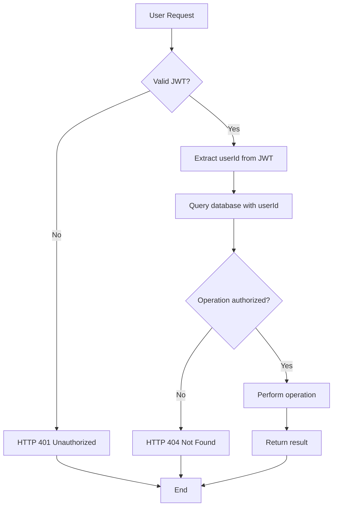
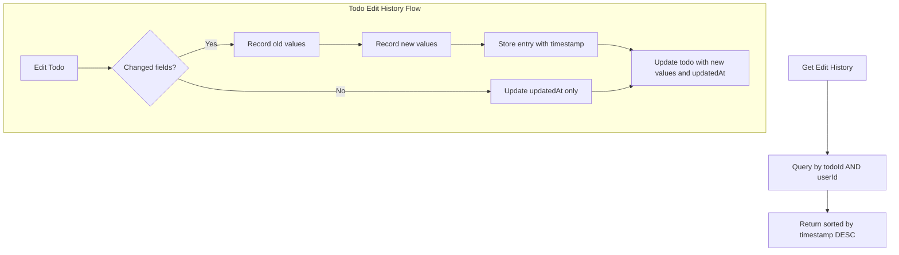

# Multi-User Todo Application Requirements Specification

## User Authentication System

WHEN a user attempts to sign up, THE system SHALL accept a valid email address and a password that meets the following criteria:
- Minimum 8 characters
- Contains at least one uppercase letter
- Contains at least one lowercase letter
- Contains at least one digit
- Contains at least one special character

WHEN a user attempts to sign up with an email that already exists, THE system SHALL return HTTP 409 Conflict with error code AUTH_EMAIL_ALREADY_USED.

WHEN a user successfully signs up, THE system SHALL create a user account and a corresponding profile with display name initialized to the email address (before the @ symbol).

WHEN a user attempts to log in, THE system SHALL validate the provided email and password against the stored hashed credentials.

IF the user provides invalid credentials, THEN THE system SHALL return HTTP 401 Unauthorized with error code AUTH_INVALID_CREDENTIALS.

WHEN a user successfully logs in, THE system SHALL generate a JWT access token with a 20-minute expiration and a refresh token with a 30-day expiration.

WHEN a user requests to change their password, THE system SHALL require the current password for verification and then apply the new password with the same policy requirements.

WHEN a user changes their password, THE system SHALL immediately revoke all active refresh tokens and issue a new refresh token with the rotation applied.

WHEN a user deletes their account, THE system SHALL immediately revoke all active tokens and permanently delete all associated data including todos, edit history, and trash entries.

THE system SHALL implement row-level security such that all database queries filter by the userId from the JWT payload when accessing any user-specific resource.

THE system SHALL never expose userId in API responses unless it matches the authenticated user's userId.

WHEN a request is made with an invalid or expired JWT, THE system SHALL return HTTP 401 Unauthorized.

## User Profile Management

WHEN a user's profile is created during registration, THE system SHALL initialize the display name to the portion of the email before the @ symbol.

WHEN a user submits a new display name, THE system SHALL validate that the input:
- Is not null
- Is a non-empty string
- Contains at least one non-whitespace character
- Is between 1 and 100 characters in length
- Does not contain forbidden characters: <, >, &, ", ', \\, /, *, ?, |, :

IF validation fails, THEN THE system SHALL reject the update with HTTP 400 Bad Request and error code PROFILE_INVALID_DISPLAY_NAME.

WHEN a display name is successfully updated, THE system SHALL record the change in an audit log with timestamp, old value, and new value.

THE system SHALL ensure that profile information is never visible to any other user.

WHEN any endpoint accesses profile data, THE system SHALL verify that the requested userId matches the authenticated user's userId.

IF a user attempts to access another user's profile data, THEN THE system SHALL return HTTP 403 Forbidden without revealing existence of the resource.

WHEN a user retrieves their own profile, THE system SHALL return:
- userId (internal, immutable)
- display name (editable)
- createdAt (ISO 8601 timestamp)
- updatedAt (ISO 8601 timestamp)

THE system SHALL NOT return email address, password hash, or any authentication credentials in the profile response.

## Todo Creation

WHEN a user creates a new todo, THE system SHALL require a title field.

IF the title is missing, empty, or contains only whitespace, THEN THE system SHALL return HTTP 400 Bad Request with error code TODO_INVALID_TITLE.

WHEN a todo is created, THE system SHALL:
- Set the title to the provided value (trimmed)
- Set the description to the provided value (or null if not provided)
- Set the startDate to the provided value (or null if not provided)
- Set the dueDate to the provided value (or null if not provided)
- Set isComplete to false
- Set createdAt to the current timestamp (ISO 8601)
- Set updatedAt to the current timestamp (ISO 8601)

WHEN a todo is created, THE system SHALL enforce strict data isolation so that only the authenticated user's todos are created.

## Todo Viewing

WHEN a user requests their todo list, THE system SHALL return todos only belonging to the authenticated user.

WHEN a user retrieves their todo list, THE system SHALL default to a page size of 20 if no size is specified.

WHERE the user specifies a page size, THE system SHALL honor values between 1 and 100 (inclusive).

WHEN a user requests a specific page number, THE system SHALL return the corresponding page based on the specified page size.

IF the requested page exceeds the total number of pages, THEN THE system SHALL return an empty array with pagination metadata indicating total pages.

WHEN a user requests a single todo by ID, THE system SHALL return the complete todo details including title, description, start date, due date, completion status, creation date, and update date.

IF the requested todo ID does not exist or does not belong to the authenticated user, THEN THE system SHALL return HTTP 404 Not Found.

THE system SHALL always apply the userId filter at the database query level to ensure data isolation.

## Todo Completion State Management

WHEN a user toggles a todo's completion status, THE system SHALL:
- If the todo is currently incomplete, set isComplete to true
- If the todo is currently complete, set isComplete to false

WHEN a todo's completion status is toggled, THE system SHALL update the updatedAt field to the current timestamp.

WHEN a todo's completion status is toggled, THE system SHALL persist the new state immediately.

WHEN a todo is retrieved for display, THE system SHALL reflect the current completion status only, ignoring historical states.

THE system SHALL treat the toggle operation as atomic - it must succeed completely or fail entirely without partial updates.

## Todo Editing

WHEN a user edits a todo, THE system SHALL allow updates to:
- Title
- Description
- Start date
- Due date

IF a user attempts to edit a todo that does not exist or does not belong to them, THE system SHALL return HTTP 404 Not Found.

WHEN a todo is edited, THE system SHALL:
- Record the previous values of any field that changed
- Record the new values of any field that changed
- Record the timestamp of the edit
- Update the updatedAt field to the current timestamp
- Create a new edit history entry with the change details

WHEN edit history is created, THE system SHALL store:
- timestamp (ISO 8601)
- changes object with:
  - title (string | null)
  - description (string | null)
  - startDate (string | null)
  - dueDate (string | null)

WHEN a field is unchanged during editing, THE system SHALL NOT include it in the change record.

WHEN a todo has multiple edits, THE system SHALL preserve each history entry indefinitely.

WHEN a todo is restored from trash, THE system SHALL preserve its entire edit history.

## Edit History Management

WHEN a user requests the edit history of a todo, THE system SHALL return entries sorted from most recent to oldest.

WHEN a user requests edit history for a todo that does not exist or does not belong to them, THE system SHALL return HTTP 404 Not Found.

WHEN edit history is retrieved, THE system SHALL return an array of history entries with:
- timestamp
- changes object containing only fields that were modified

THE system SHALL ensure that edit history entries can only be accessed by the owner of the todo.

WHEN a todo's edit history is requested, THE system SHALL verify that the todo's userId matches the authenticated user's userId.

## Todo Deletion

WHEN a user deletes a todo, THE system SHALL:
- Set the isDeleted flag to true
- Update the updatedAt field
- Exclude the todo from normal todo list queries
- Keep the todo and its edit history in the system

WHEN a todo is soft-deleted, THE system SHALL maintain all associated data including edit history.

WHEN a user requests a list of todo IDs, THE system SHALL never return IDs of deleted todos.

## Trash Management

WHEN a user requests their trash list, THE system SHALL return all todos for which isDeleted = true.

WHEN a user requests their trash list, THE system SHALL respect pagination parameters (page size, page number).

WHEN a user requests a specific todo from trash by ID, THE system SHALL return the todo details if it exists and belongs to the user.

WHEN a user restores a todo from trash, THE system SHALL:
- Set isDeleted to false
- Update updatedAt
- Make the todo visible again in the normal todo list

WHEN a user permanently deletes a todo from trash, THE system SHALL:
- Delete all edit history entries associated with the todo
- Delete the todo record entirely
- Make all data unrecoverable

WHEN a todo is permanently deleted from trash, THE system SHALL remove all database records related to that todo.

WHEN a user permanently deletes a todo from trash, THE system SHALL not be able to restore it under any circumstances.

## Filtering Todos

WHEN a user requests to filter todos by completion status, THE system SHALL support the following values:
- "all" (default): return all todos
- "complete": return todos where isComplete = true
- "incomplete": return todos where isComplete = false

WHEN the filter parameter is empty or not provided, THE system SHALL use "all" as the default.

IF an unsupported filter value is provided, THE system SHALL treat it as "all" and log a warning for audit purposes.

WHEN filtering is applied, THE system SHALL use the current isComplete value of each todo without considering historical states.

## Sorting Todos

WHEN a user requests to sort todos, THE system SHALL support the following sort fields:
- "createdAt": sort by creation timestamp
- "startDate": sort by start date
- "dueDate": sort by due date

WHEN a user requests to sort by creation date, THE system SHALL use the createdAt field as the sort key.

WHEN a user requests to sort by start date, THE system SHALL use the startDate field as the sort key.

WHEN a user requests to sort by due date, THE system SHALL use the dueDate field as the sort key.

WHEN a user requests to sort by any field, THE system SHALL support the following sort orders:
- "asc": ascending order (oldest/earliest first)
- "desc": descending order (newest/latest first)

WHEN no sort order is specified, THE system SHALL default to "desc".

IF an unsupported sort field is provided, THE system SHALL use "createdAt" as the default and log a warning for audit purposes.

IF an unsupported sort order is provided, THE system SHALL use "desc" as the default and log a warning for audit purposes.

## Date Handling for Missing Values

WHEN sorting by startDate and a todo has no startDate set, THE system SHALL treat it as having the latest possible start date:
- In ascending order: placed at the end
- In descending order: placed at the beginning

WHEN sorting by dueDate and a todo has no dueDate set, THE system SHALL treat it as having the latest possible due date:
- In ascending order: placed at the end
- In descending order: placed at the beginning

WHEN displaying todos in lists, THE system SHALL show "null" or equivalent placeholder for missing dates.

## Response Structure

WHEN a user retrieves their todo list, THE system SHALL return a structured response containing:
- todos: array of todo objects with complete details
- pagination: object with current page, page size, total count, and total pages
- filters: object with completionStatus property
- sort: object with field and order properties

THE todo object MUST include the following fields:
- id (string)
- title (string)
- description (string | null)
- isComplete (boolean)
- startDate (string | null) - ISO 8601 format
- dueDate (string | null) - ISO 8601 format
- createdAt (string) - ISO 8601 format
- updatedAt (string) - ISO 8601 format

THE pagination object MUST include the following fields:
- currentPage (number)
- pageSize (number)
- totalCount (number)
- totalPages (number)

THE filters object MUST contain:
- completionStatus (string)

THE sort object MUST contain:
- field (string)
- order (string)

WHEN a user's todo list is empty, THE system SHALL return an empty todos array with totalCount = 0 and totalPages = 0.

## Data Privacy and Isolation

THE system SHALL enforce data isolation at the application and database layers.

WHEN any API request is processed, THE system SHALL validate that the requested resource belongs to the authenticated user's userId.

IF a user attempts to access, edit, view, delete, or restore any todo that does not belong to them, THE system SHALL return HTTP 404 Not Found regardless of the operation type.

THE system SHALL never expose user IDs, emails, or profile information through any API endpoint, search, filter, or listing function.

WHERE a database query is constructed, THE system SHALL include userId as a mandatory WHERE clause condition.

IF any database query is detected without userId filtering, THE system SHALL flag it as a security vulnerability.

## Performance Requirements

THE system SHALL return todo list queries within 500 milliseconds for queries with typical parameters (page size 20, no complex filtering).

THE system SHALL maintain response times under 1 second even with maximum pagination (100 items per page) and when users have large numbers of todos (10,000+).

WHILE sorting by creation date with 10,000+ todos, THE system SHALL maintain response times under 2 seconds.

THE system SHALL ensure database queries use appropriate indexes on userId, createdAt, startDate, dueDate, and isComplete fields.

## Error Handling

WHEN a database connection fails, THE system SHALL return HTTP 503 Service Unavailable.

WHEN an internal error occurs during query execution, THE system SHALL return HTTP 500 Internal Server Error with a generic error message.

WHEN a user provides malformed JSON in the request body, THE system SHALL return HTTP 400 Bad Request.

WHEN a user provides non-integer values for page or page size parameters, THE system SHALL return HTTP 400 Bad Request with a clear error message.

WHEN a user attempts to use an invalid filter value (e.g., "pending"), THE system SHALL treat it as "all" and log a warning for audit purposes.

WHEN a user attempts to use an invalid sort field (e.g., "priority"), THE system SHALL use "createdAt" as the default sort field and log a warning.

WHEN a user attempts to use an invalid sort order (e.g., "reverse"), THE system SHALL use "desc" as the default sort order and log a warning.

WHEN a page size parameter is not a number, THE system SHALL use the default page size of 20 and log a warning.

WHEN a page number parameter is not a positive integer, THE system SHALL use page 1 and log a warning.

## Workflow Diagrams

```mermaid
sequenceDiagram
    participant User
    participant API
    participant Database
    participant JWT

    User->>API: Sign up (email, password)
    API->>Database: Check if email exists
    alt Email exists
        Database-->>API: Email exists (409)
        API-->>User: HTTP 409 Conflict
    else Email available
        Database->>Database: Create user account
        Database->>Database: Create profile with default display name
        Database-->>API: Success
        API->>JWT: Generate JWT access and refresh tokens
        JWT-->>API: Tokens generated
        API-->>User: HTTP 201 Created with tokens
    end

    User->>API: Log in (email, password)
    API->>Database: Validate credentials
    alt Credentials valid
        Database-->>API: User found
        API->>JWT: Generate JWT access and refresh tokens
        JWT-->>API: Tokens generated
        API-->>User: HTTP 200 OK with tokens
    else Credentials invalid
        Database-->>API: Invalid credentials
        API-->>User: HTTP 401 Unauthorized
    end

    User->>API: Create todo (title, description?, startDate?, dueDate?)
    API->>Database: Create todo with userId from JWT
    Database-->>API: Todo created
    API-->>User: HTTP 201 Created with todo object

    User->>API: Get todo list
    API->>Database: Query todos by userId, apply filters and sorting
    Database-->>API: Todos returned with pagination
    API-->>User: HTTP 200 OK with todos, pagination, filters, sort

    User->>API: Toggle todo completion
    API->>Database: Update isComplete and updatedAt
    Database-->>API: Todo updated
    API-->>User: HTTP 200 OK with updated todo

    User->>API: Edit todo (id, title?, description?, startDate?, dueDate?)
    API->>Database: Get todo by id and userId
    alt Todo found
        Database-->>API: Todo found
        API->>Database: Create edit history entry with changes
        Database->>Database: Update todo with new values and updatedAt
        Database-->>API: Success
        API-->>User: HTTP 200 OK with updated todo
    else Todo not found or not authorized
        Database-->>API: Todo not found
        API-->>User: HTTP 404 Not Found
    end

    User->>API: Delete todo
    API->>Database: Set isDeleted = true and update updatedAt
    Database-->>API: Todo soft-deleted
    API-->>User: HTTP 204 No Content

    User->>API: View trash
    API->>Database: Query todos where isDeleted = true
    Database-->>API: Deleted todos returned with pagination
    API-->>User: HTTP 200 OK with trash items

    User->>API: Restore todo from trash
    API->>Database: Set isDeleted = false and update updatedAt
    Database-->>API: Todo restored
    API-->>User: HTTP 200 OK with restored todo

    User->>API: Permanently delete from trash
    API->>Database: Delete todo and all edit history
    Database-->>API: Data permanently removed
    API-->>User: HTTP 204 No Content

    User->>API: Get edit history for todo
    API->>Database: Query edit history for todoId and userId
    Database-->>API: History entries returned sorted by timestamp descending
    API-->>User: HTTP 200 OK with history array

    User->>API: Change password
    API->>Database: Validate current password
    alt Password valid
        Database-->>API: Password verified
        API->>Database: Update password hash
        API->>JWT: Revoke all existing refresh tokens
        JWT-->>API: Tokens revoked
        API->>JWT: Generate new refresh token
        JWT-->>API: New token generated
        API-->>User: HTTP 200 OK
    else Password invalid
        Database-->>API: Password invalid
        API-->>User: HTTP 401 Unauthorized
    end

    User->>API: Delete account
    API->>Database: Delete todo, edit history, trash, profile, and account
    Database-->>API: All data deleted
    API->>JWT: Revoke all tokens
    JWT-->>API: Tokens revoked
    API-->>User: HTTP 204 No Content
```







```mermaid
flowchart TD
    direction LR
    A[Filtering] --> B[All]
    A --> C[Complete]
    A --> D[Incomplete]
    B --> E[Return todos with isComplete IN (true, false)]
    C --> F[Return todos where isComplete = true]
    D --> G[Return todos where isComplete = false]

    H[Sorting] --> I[createdAt]
    H --> J[startDate]
    H --> K[dueDate]
    I --> L[Sort by createdAt ASC/DESC]
    J --> M[Sort by startDate ASC/DESC, nulls last]
    K --> N[Sort by dueDate ASC/DESC, nulls last]
```

## Authentication and Authorization Summary

THE system SHALL have exactly one actor type: member.

THE member actor SHALL have the following permissions:
- read:todos
- write:todos
- delete:todos
- read:profile
- write:profile
- delete:profile
- read:history
- write:history
- read:trash
- write:trash

THE system SHALL use JWT with a 20-minute access token and 30-day refresh token.

THE system SHALL implement data isolation via userId-based database filtering at the query level.

THE system SHALL not expose userId in any response unless it matches the authenticated user.

All data access shall be scoped to the authenticated user.

## Data Retention and Persistence

WHEN a user deletes their account, THE system SHALL permanently and irreversibly delete:
- All user todos
- All edit history entries
- All trash entries
- The user profile
- Authentication tokens

WHEN a user permanently deletes a todo from trash, THE system SHALL permanently and irreversibly delete:
- The todo record
- All associated edit history

WHEN a todo is removed from the todo list by deletion, THE system SHALL retain its data in trash and edit history until permanently deleted.

ALL changes shall be persisted immediately.

## Business Logic and Validation Summary

- All title fields are required and trimmed on input
- All other fields are optional and accept null
- All user actions are scoped to authenticated userId
- All data isolation is enforced at the database layer
- All date sorts place nulls at the end (ascending) or beginning (descending)
- All filtering and sorting apply only to current state, never historical
- All edit history preserves exact pre-change and post-change values
- All responses follow the specified structure exactly
- All API operations follow strict CRUD and state transition rules
- All error handling provides user-friendly messages without technical details
- All performance targets are met with optimized database queries

## Implementation Notes for Developers

- Use Prisma ORM for data access with automatic userId filtering
- Use JWT for authentication with HS256 signature and environment-variable secrets
- Use UUIDv4 for all primary keys
- Use ISO 8601 for all date/time representations
- Implement soft deletion via isDeleted boolean flag
- Implement pagination with offset and limit
- Implement sort and filter on database side, not in application layer
- Validate all inputs with Zod or similar schema validator
- Log invalid requests for security monitoring
- Use database indexes on userId, isDeleted, createdAt, startDate, dueDate
- Use database constraints for required fields
- Use null values for missing optional fields, not empty strings
- Implement row-level security in the database layer to ensure data isolation
- Never construct database queries without userId filter
- Always validate JWT and extract userId before any data access
- Always use the same response structure for todo lists across all endpoints
- Do not create separate endpoints for trash - use isDeleted flag with filters