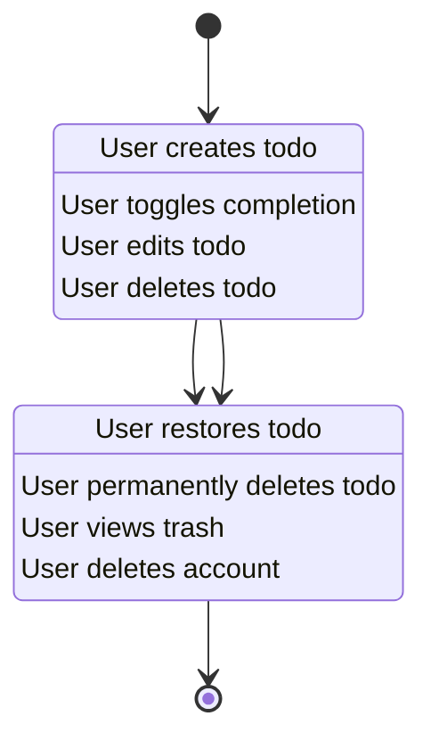
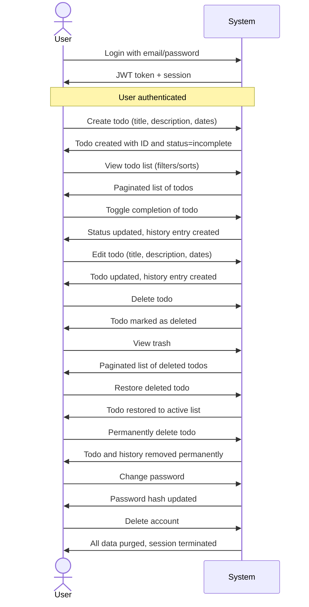

# Multi-User Todo Application Requirements Specification

## Overview

This document defines the complete functional and business requirements for a multi-user Todo application. The system enables individual users to create, manage, and organize personal task lists with full data isolation between accounts. All user data is private, ephemeral, and subject to strict permission controls.

The application is designed as a personal productivity tool where users own their data entirely. No sharing, collaboration, or cross-user visibility is permitted. Authentication, authorization, and data isolation form the core architectural pillars.

## User Authentication

WHEN a user registers with an email and password, THE system SHALL create a new user account with a unique identifier, securely hash the password, and store only the hash value.

WHEN a user attempts to log in with valid email and password credentials, THE system SHALL validate the credentials against the stored hash and issue a signed JWT access token containing the user ID and role.

WHEN a user's access token expires, THE system SHALL automatically refresh it using a secure, HTTP-only refresh token stored in a cookie, provided the refresh token is still valid.

WHEN a user requests to change their password, THE system SHALL require authentication with the current password, validate the new password meets minimum security requirements (8+ characters), and replace the password hash.

WHEN a user triggers a password reset, THE system SHALL generate a time-limited, cryptographically secure reset token and send it via email to the registered address.

WHEN a user submits a valid password reset token and new password, THE system SHALL update the password hash and immediately invalidate the reset token.

IF a user provides incorrect login credentials, THE system SHALL respond with a generic authentication failure ("Invalid email or password.") without indicating whether the email exists.

IF a user attempts to register with an email already in use, THE system SHALL respond with a generic conflict message ("An account with this email already exists.") without confirming or denying any specific account details.

IF a password reset token is expired, malformed, or not found, THE system SHALL respond with a generic failure message ("Invalid or expired reset link.") without revealing the token's status.

WHEN a user logs out, THE system SHALL immediately invalidate the current access and refresh tokens and clear them from the client.

## User Profile Management

WHEN a user updates their display name, THE system SHALL validate that the display name is not empty and does not exceed 50 characters.

WHEN a user updates their display name, THE system SHALL store the new value and update the profile record with the current timestamp.

WHEN a user views their own profile, THE system SHALL return the display name and account creation date.

IF a user attempts to view another user's profile, THE system SHALL return HTTP 404 Not Found without revealing that the profile exists or does not exist.

IF a user submits a display name that is empty or contains only whitespace, THE system SHALL reject the update with error code PROFILE_INVALID_NAME.

IF a user submits a display name exceeding 50 characters, THE system SHALL reject the update with error code PROFILE_NAME_TOO_LONG.

WHERE a user has not set a display name, THE system SHALL default to the username portion of the email address (text before @) for display purposes.

## Todo Creation

WHEN a user creates a todo, THE system SHALL require a title field with at least 1 character and no more than 200 characters.

WHEN a user creates a todo, THE system SHALL allow an optional description field with a maximum of 2,000 characters.

WHEN a user creates a todo, THE system SHALL allow optional start date and due date fields in ISO 8601 format (YYYY-MM-DDTHH:mm:ss.sssZ).

WHEN a user creates a todo, THE system SHALL set the completion status to false (incomplete) by default.

WHEN a user creates a todo, THE system SHALL record the exact timestamp of creation as part of the entity metadata.

WHEN a user provides an empty or null title during creation, THE system SHALL reject the request with error code TODO_MISSING_TITLE.

WHEN a user provides a title longer than 200 characters during creation, THE system SHALL reject the request with error code TODO_TITLE_TOO_LONG.

WHEN a user provides an invalid date format in start date or due date, THE system SHALL reject the request with error code TODO_INVALID_DATE.

WHEN a user submits a todo with a start date after the due date, THE system SHALL accept it but log the inconsistency internally (not visible to user).

WHERE a user omits the description field during creation, THE system SHALL store an empty string as the description.

WHERE a user omits the start date during creation, THE system SHALL store null for the start date.

WHERE a user omits the due date during creation, THE system SHALL store null for the due date.

## Todo Viewing

WHEN a user requests their todo list, THE system SHALL return only todos belonging to the authenticated user.

WHEN a user requests their todo list, THE system SHALL paginate results using a default page size of 20 items per page.

WHEN a user requests their todo list, THE system SHALL include for each todo: title, completion status, creation date, start date (if not null), due date (if not null).

WHEN a user requests a single todo by ID, THE system SHALL return the full details including title, description, completion status, creation date, start date (if not null), due date (if not null), and last updated date.

WHEN a user requests a todo by ID that belongs to another user, THE system SHALL return HTTP 404 Not Found.

WHEN a user requests a non-existent todo by ID, THE system SHALL return HTTP 404 Not Found.

## Todo Completion Toggle

WHEN a user marks a todo as complete, THE system SHALL set the completion status to true.

WHEN a user marks a todo as incomplete, THE system SHALL set the completion status to false.

WHEN a user toggles a todo's completion status, THE system SHALL update the last updated timestamp.

IF a user attempts to toggle a todo that belongs to another user, THE system SHALL return HTTP 404 Not Found.

IF a user attempts to toggle a todo that does not exist, THE system SHALL return HTTP 404 Not Found.

## Todo Editing

WHEN a user edits a todo's title, THE system SHALL validate the new title is between 1 and 200 characters.

WHEN a user edits a todo's description, THE system SHALL validate the new description is no longer than 2,000 characters.

WHEN a user edits a todo's start date, THE system SHALL validate the date is in ISO 8601 format.

WHEN a user edits a todo's due date, THE system SHALL validate the date is in ISO 8601 format.

WHEN a user edits any field of a todo, THE system SHALL create a new history entry.

WHEN a user attempts to edit a todo that belongs to another user, THE system SHALL return HTTP 404 Not Found.

WHEN a user attempts to edit a todo that does not exist, THE system SHALL return HTTP 404 Not Found.

WHEN a user submits an empty title during edit, THE system SHALL reject the edit with error code TODO_MISSING_TITLE.

WHEN a user submits a title longer than 200 characters during edit, THE system SHALL reject the edit with error code TODO_TITLE_TOO_LONG.

WHEN a user submits an invalid date format during edit, THE system SHALL reject the edit with error code TODO_INVALID_DATE.

## Edit History

WHEN a todo is edited, THE system SHALL create a new history entry.

WHEN a history entry is created, THE system SHALL record the exact timestamp of the edit.

WHEN a history entry is created, THE system SHALL record the previous title value if and only if the title was changed.

WHEN a history entry is created, THE system SHALL record the previous description value if and only if the description was changed.

WHEN a history entry is created, THE system SHALL record the previous start date value if and only if the start date was changed.

WHEN a history entry is created, THE system SHALL record the previous due date value if and only if the due date was changed.

WHEN a user requests the edit history of a todo, THE system SHALL return only history entries for that todo.

WHEN a user requests the edit history of a todo, THE system SHALL sort the entries from most recent to oldest.

WHEN a user requests the edit history of a todo they do not own, THE system SHALL return HTTP 404 Not Found.

WHEN a user requests the edit history of a non-existent todo, THE system SHALL return HTTP 404 Not Found.

WHEN a todo is created, THE system SHALL NOT create an edit history entry.

WHEN a history entry is created, THE system SHALL ensure it is immutable — no future updates or deletions to individual history records are permitted.

## Todo Deletion

WHEN a user deletes a todo, THE system SHALL set the soft-delete flag (deletedAt) to the current timestamp.

WHEN a todo is marked as deleted, THE system SHALL update the last updated timestamp.

WHEN a todo is marked as deleted, THE system SHALL exclude it from all standard todo list views.

WHEN a user attempts to delete a todo that belongs to another user, THE system SHALL return HTTP 404 Not Found.

WHEN a user attempts to delete a todo that does not exist, THE system SHALL return HTTP 404 Not Found.

## Trash Management

WHEN a user requests the trash list, THE system SHALL return only todos marked as deleted (deletedAt is not null) that belong to the authenticated user.

WHEN a user requests the trash list, THE system SHALL paginate results with a default page size of 20 items.

WHEN a user restores a todo from trash, THE system SHALL set the deletedAt field back to null, restoring the todo to the active list.

WHEN a user permanently deletes a todo from trash, THE system SHALL remove the todo and all associated edit history records from the database entirely.

WHEN a user attempts to restore a todo from trash that belongs to another user, THE system SHALL return HTTP 404 Not Found.

WHEN a user attempts to permanently delete a todo from trash that belongs to another user, THE system SHALL return HTTP 404 Not Found.

WHEN a user attempts to restore or permanently delete a non-existent todo (already deleted from database), THE system SHALL return HTTP 404 Not Found.

WHERE a user restores a todo, THE system SHALL preserve all original property values (title, description, start date, due date) exactly as they were at the time of deletion.

WHERE a todo is permanently deleted from trash, THE system SHALL guarantee that no trace of the todo or its edit history remains in the system.

## Filtering

WHEN a user applies a filter for "all todos", THE system SHALL return todos regardless of completion status.

WHEN a user applies a filter for "complete todos", THE system SHALL return only todos where completion status is true.

WHEN a user applies a filter for "incomplete todos", THE system SHALL return only todos where completion status is false.

WHEN a user applies a filter, THE system SHALL return only todos belonging to that user.

IF a user submits an invalid filter parameter (e.g. "archived"), THE system SHALL default to "all todos".

## Sorting

WHEN a user sorts by creation date (newest first), THE system SHALL order todos by creation timestamp descending.

WHEN a user sorts by creation date (oldest first), THE system SHALL order todos by creation timestamp ascending.

WHEN a user sorts by start date (earliest first), THE system SHALL order todos by start date ascending, with null values appearing after all non-null values.

WHEN a user sorts by start date (latest first), THE system SHALL order todos by start date descending, with null values appearing after all non-null values.

WHEN a user sorts by due date (earliest first), THE system SHALL order todos by due date ascending, with null values appearing after all non-null values.

WHEN a user sorts by due date (latest first), THE system SHALL order todos by due date descending, with null values appearing after all non-null values.

WHEN a user applies a sort order, THE system SHALL return only todos belonging to that user.

IF a user submits an invalid sort parameter (e.g. "priority"), THE system SHALL default to sorting by creation date (newest first).

## Privacy and Access Control

WHEN any database query is executed, THE system SHALL automatically scope all queries by the authenticated user's ID.

WHERE a user makes a request to view, edit, delete, or restore any todo, THE system SHALL only return or affect todos where userId equals the authenticated user's ID.

WHERE a user attempts to access a todo by ID that belongs to another user, THE system SHALL return HTTP 404 Not Found.

WHILE any user is logged in, THE system SHALL ensure no data from other users is accessible through any API endpoint.

IF a user attempts to access the edit history of a todo belonging to another user, THE system SHALL return HTTP 404 Not Found.

IF a user attempts to permanently delete a todo that belongs to another user, THE system SHALL return HTTP 404 Not Found.

IF any system audit log records user activity, THE system SHALL NEVER include user identifiers from other accounts.

IF any error message is returned, THE system SHALL NOT reveal whether a todo exists for another user under any circumstances.

WHEN a user deletes their account, THE system SHALL:
- Delete the user record and its unique identifier
- Remove all associated todos from the database
- Permanently delete all edit history records related to the user's todos
- Expire any existing tokens
- Redirect the user to the registration page with message: "Your account has been permanently deleted. Thank you for using TodoApp."

## Performance Expectations

WHEN a user retrieves their todo list with minimal filtering, THE system SHALL return results in under 500 milliseconds for 95% of requests.

WHEN a user opens a single todo to view details, THE system SHALL load and display information in under 300 milliseconds.

WHEN a user toggles a todo's completion status, THE system SHALL update and return acknowledgment in under 200 milliseconds.

WHEN a user creates a new todo, THE system SHALL respond with confirmation within 500 milliseconds.

WHEN a user filters their todo list by completion status, THE system SHALL respond in under 500 milliseconds.

WHEN a user sorts their todo list by any field, THE system SHALL respond in under 1 second even with 1,000 todos.

WHEN a user permanently deletes a todo from trash, THE system SHALL complete the deletion and return confirmation in under 1 second.

WHEN a user restores a todo from trash, THE system SHALL complete the restoration and return confirmation in under 500 milliseconds.

WHILE a user views edit history for a todo with 50+ entries, THE system SHALL return pagination of 20 entries per request with response time under 800 milliseconds.

## State Diagram

## User Interaction Flow

## Authentication Architecture

WHEN a user authenticates, THE system SHALL issue a JWT access token with the following claims:
- sub: user UUID (string)
- role: "user" (string)
- iat: issued at timestamp (number)
- exp: expiration timestamp (number)

WHEN a user's access token expires, THE system SHALL attempt to refresh it using an HTTP-only refresh token stored in a cookie, validated against the user's active session record.

WHEN a refresh token is invalid or expired, THE system SHALL reject the request, clear all tokens, and require full re-authentication.

WHEN a user logs out, THE system SHALL immediately invalidate the refresh token in the database and clear the JWT from the client.

WHEN a user changes their password, THE system SHALL immediately invalidate all existing refresh tokens and access tokens for that user.

WHEN a user deletes their account, THE system SHALL permanently remove all associated authentication tokens and session records.

## Business Rule Summary

### Profile Rules

- Display name: 1-50 characters, not empty, not whitespace-only
- Default display name: email prefix (text before @)

### Todo Rules

- Title: required, 1-200 characters
- Description: optional, max 2,000 characters
- Dates: ISO 8601 format, nullable
- Start date > due date: allowed but flagged internally

### History Rules

- History created on any edit (title, description, start date, due date)
- Only changed fields recorded
- History entries immutable
- History deleted with todo during permanent deletion

### Trash Rules

- Todos preserved with soft-delete flag
- Restore resets deletedAt to null
- Permanent delete removes todo and history entirely
- No recovery after permanent delete

### Privacy Rules

- All queries scoped by authenticated user ID
- No cross-user visibility under any circumstance
- Access denied responses always return 404 Not Found (never 403)
- Error messages reveal nothing about existence of other users' data

## Error Handling

### Authentication Errors

- Invalid credentials: "Invalid email or password."
- Duplicate registration: "An account with this email already exists."
- Expired session: "Your session has expired. Please log in again to continue."
- Invalid password reset token: "Invalid or expired reset link."

### Validation Errors

- Missing title: "Title is required. Please enter a title for your todo."
- Title too long: "Title cannot exceed 200 characters. Please shorten your title."
- Invalid date: "Date must be in ISO 8601 format (YYYY-MM-DDTHH:mm:ss.sssZ)."
- Start date after due date: "Start date cannot be after the due date. Please adjust your dates."

### Access Denied

- Unauthorized access attempt: "You do not have permission to access this todo."

### Traffic Limit Errors

- Too many requests: "Too many requests. Please wait a moment before trying again."
- Too many failed logins: "Too many failed login attempts. Please wait 30 minutes before trying again."

### System Failure

- Internal error: "Something went wrong on our end. We've been notified and are working to fix it. Please try again later."
- Service unavailable: "The service is temporarily unavailable. Please try again in a few moments."

## Recovery Procedures

- Authentication error: Provide "Forgot password?" and "Sign up" links
- Validation error: Highlight field and retain user input
- Access denied: Redirect to user's own todo list
- Traffic limit: Display estimated wait time
- System failure: Provide "Report this issue" button (anonymous)

## Summary

This document defines a complete, production-ready specification for a private multi-user Todo application. All requirements are expressed in EARS format, fully scoped to the authenticated user, and designed for zero-cross-user data exposure.

The system is characterized by:
- Strict privacy and data isolation
- Immutable edit history
- Soft delete with trash functionality
- Comprehensive filtering and sorting
- Clear, actionable error handling
- Explicit, measurable performance targets

All specifications are implementation-ready and free of technical implementation details. Database schema, API endpoints, and code structure will be generated by downstream phases.

## Document Metadata

- **Service Prefix**: todoApp
- **User Actor**: user (unprivileged)
- **Document Type**: requirement
- **Document Reason**: Full specification of feature set for backend implementation
- **Audience**: Backend developers
- **Detail Level**: Detailed specification
- **Related Documents**: 03-functional-requirements.md, 04-business-rules.md, 05-user-flows.md, 06-error-handling.md
- **Constraints**: No database schemas or API specifications allowed, all in natural language, all EARS formatted