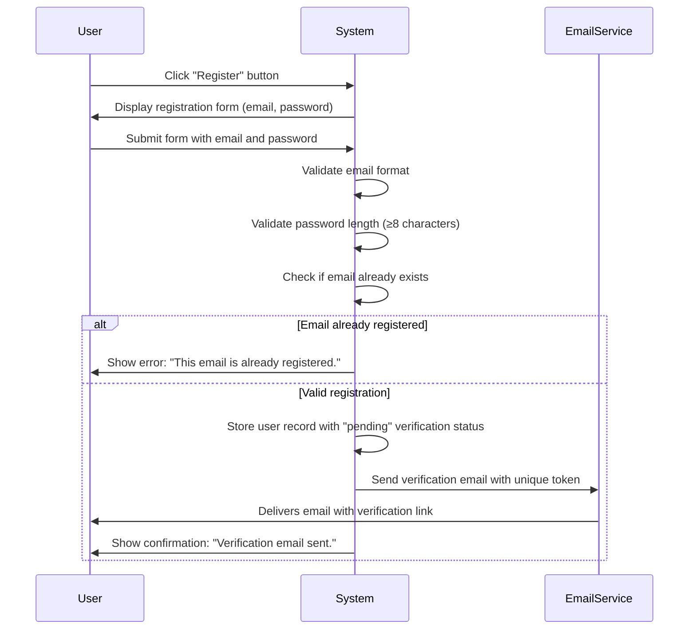
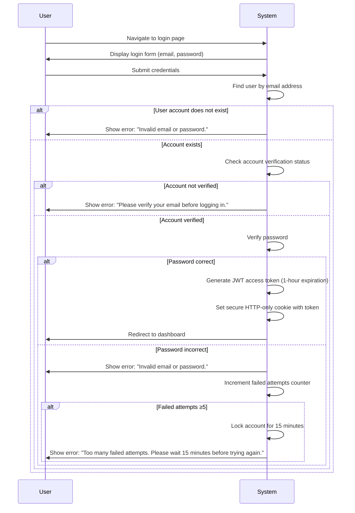
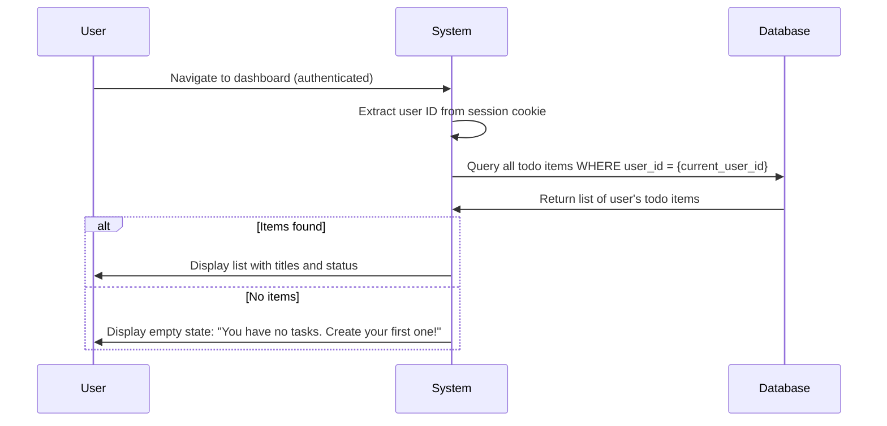
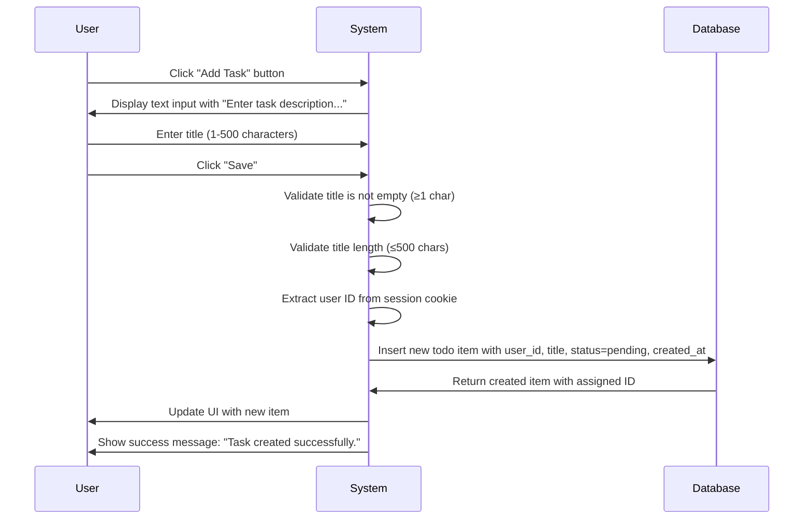
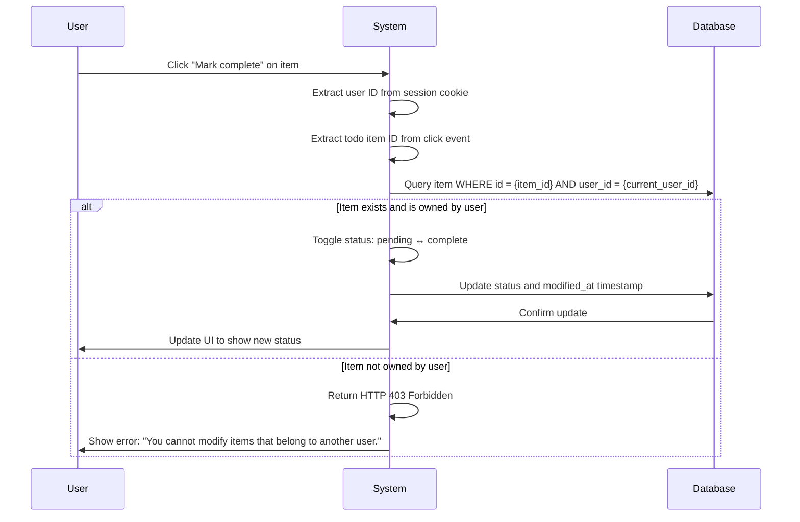
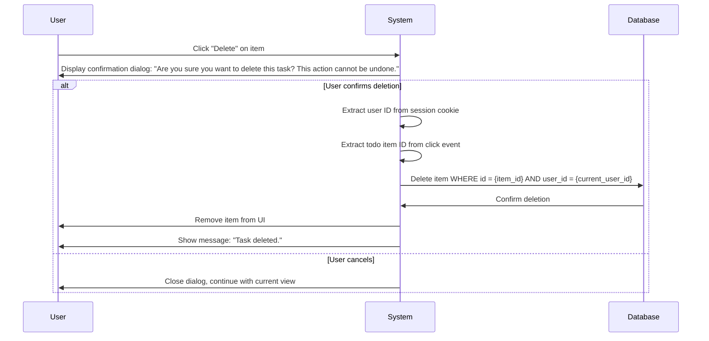
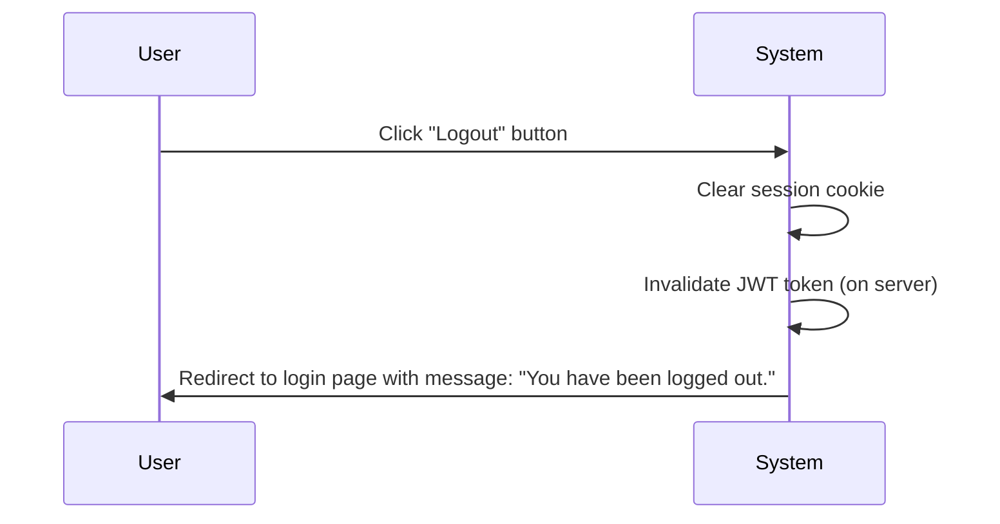

# Multi-User Todo List Application Requirements Specification

## 1. Service Overview

The Todo List Application is a secure, personal productivity tool that enables users to manage their individual tasks with complete privacy. The service is designed for individuals who need a simple, reliable way to track their to-do items without the complexity of team collaboration features.

This application solves the problem of scattered task management by providing a centralized, always-accessible digital space where users can create, view, edit, and delete personal tasks. Users can access their todo lists from any device with a modern web browser.

The core proposition is that of privacy and simplicity: each user's todo list is completely isolated from all other users, ensuring no accidental exposure of personal or sensitive tasks. The application eliminates the need for paper-based to-do lists, sticky notes, or insecure third-party note-taking apps.

The business model is free-to-use with a focus on user growth and retention. No payment information is collected. In future iterations, premium features like due date reminders, categorization, or cross-device synchronization may be added, but these are not part of the current scope.

The application will be deployed as a web service accessible via modern browsers and will not require any desktop installation or mobile app downloads.

## 2. User Actors

The system defines three distinct user roles with clearly separated permissions:

### Guest
A guest is an unauthenticated user who is visiting the application. Guests have no access to any todo list functionality. They can only view the public landing page and initiate registration or login processes. All attempts to access private todo features will be redirected to the authentication flow.

### Member
A member is an authenticated user who has successfully registered and verified their email address. Members have full access to their own personal todo list, including the ability to create, read, update, and delete their own todo items. Members cannot access or influence any other user's data under any circumstances.

### Admin
An admin is a system administrator with elevated privileges for managing user accounts and system configuration. Admins can create, view, modify, or delete user accounts, but they have no access to individual user todo lists. Admin permissions are designed for system maintenance only, not for content auditing or snooping.

The user separation model ensures that even system administrators cannot view or manipulate user tasks, creating a strong trust model where users know their private information is completely inaccessible to anyone except themselves.

## 3. Core Functionality

The application provides a minimal set of essential features focused exclusively on personal task management with robust authentication and authorization.

### User Registration

WHEN a new user visits the application AND selects the registration option, THEN THE system SHALL:
- Present a registration form with email and password fields
- Accept email addresses in standard format (user@domain.com)
- Accept passwords with a minimum length of 8 characters
- Send a verification email to the provided email address
- Store the user record with a "pending verification" status
- Display confirmation message: "A verification email has been sent to your inbox. Please verify your email address before logging in."

WHEN a user attempts to register with an existing email address, THE system SHALL:
- Prevent account creation
- Display error message: "This email address is already registered. Please use a different email or log in if this is your account."

WHEN a user attempts to register with an invalid email format, THE system SHALL:
- Validate the email format before submission
- Display error message: "Please enter a valid email address (e.g., user@example.com)."

WHEN a user attempts to register with a password less than 8 characters, THE system SHALL:
- Validate password length before submission
- Display error message: "Password must be at least 8 characters long."

### User Authentication

WHEN a user attempts to log in with valid credentials, THE system SHALL:
- Verify email exists and is verified
- Verify password matches the stored hash
- Generate a signed JSON Web Token (JWT)
- Set a secure, HTTP-only session cookie with the token
- Redirect to the user's personal dashboard

WHEN a user attempts to log in with incorrect credentials, THE system SHALL:
- Reject the login attempt
- Display error message: "Invalid email or password. Please check your credentials and try again."
- Increment failed attempt counter for the email
- Enforce lockout after 5 consecutive failures for 15 minutes

WHEN a user attempts to log in with an unverified email account, THE system SHALL:
- Reject the login attempt
- Display error message: "Please verify your email address before logging in. Check your inbox for the verification email or request a new verification link."

WHEN a user requests a password reset, THE system SHALL:
- Accept email address input
- If the email exists in the system, generate a time-limited reset token
- Send an email with a secure reset link containing the token
- Display message: "If this email address is registered, a password reset link has been sent to your inbox."
- If the email doesn't exist, display same message (security through ambiguity)

WHEN a user accesses the password reset link, THE system SHALL:
- Validate the token's existence and expiration
- Present a form to set a new password
- Require password to be at least 8 characters
- Upon successful reset, destroy the token
- Log the user in automatically after successful password change

### Todo List Management

WHEN a member accesses their dashboard, THE system SHALL:
- Load only todo items belonging to the authenticated user
- Display items sorted by creation date (newest first)
- Show each item with its title and status (pending/complete)
- Provide interface buttons to create, edit, and delete items

WHEN a member creates a new todo item, THE system SHALL:
- Present a form for entering a title
- Accept titles up to 500 characters
- Set initial status to "pending"
- Associate the item with the authenticated user's ID
- Save to the database with timestamp
- Display success message: "Task created successfully."

WHEN a member updates a todo item's title, THE system SHALL:
- Allow editing of the text content
- Enforce maximum 500-character limit
- Prevent empty title submissions (minimum 1 character)
- Update the modified timestamp
- Preserve the item's status

WHEN a member updates a todo item's status, THE system SHALL:
- Allow switching between "pending" and "complete" only
- Reject any other status values
- Update the modified timestamp
- Preserve the item's title and other metadata

WHEN a member deletes a todo item, THE system SHALL:
- Present a confirmation dialog: "Are you sure you want to delete this task? This action cannot be undone."
- Upon confirmation, permanently remove the item from the database
- Return HTTP 404 for any subsequent requests to the item's ID
- Preserve the item's ID in audit logs (for debugging) but make it unavailable to users

WHEN a member attempts to access a todo item that doesn't exist, THE system SHALL:
- Return HTTP 404 Not Found
- Display message: "The specified todo item does not exist or has already been deleted."

When a member attempts to manipulate the URL or API request to access items belonging to other users, THE system SHALL:
- Reject all such requests with HTTP 403 Forbidden
- Return the message: "You do not have permission to access this todo list."
- Never confirm nor deny the existence of items owned by other users

## 4. User Workflows

### Registration Flow

### Login Flow

### Todo List Access Flow

### Todo Item Creation Flow

### Todo Item Status Update Flow

### Todo Item Deletion Flow

### Logout Flow

## 5. Business Rules

### Data Validation Rules

WHEN a user attempts to create a todo item with an empty title, THE system SHALL return HTTP 400 Bad Request with the message: "Todo item title cannot be empty. Please enter a task description."

WHEN a user attempts to create a todo item with a title longer than 500 characters, THE system SHALL return HTTP 400 Bad Request with the message: "Todo item title cannot exceed 500 characters. Please shorten your task description."

WHEN a user attempts to update a todo item title to an empty value, THE system SHALL return HTTP 400 Bad Request with the message: "Todo item title cannot be empty. Please enter a task description."

WHEN a user attempts to update a todo item title to a value longer than 500 characters, THE system SHALL return HTTP 400 Bad Request with the message: "Todo item title cannot exceed 500 characters. Please shorten your task description."

WHEN a user attempts to change the status of a todo item to an invalid value, THE system SHALL return HTTP 400 Bad Request with the message: "Invalid status value. Status must be either 'pending' or 'complete'."

WHEN a user sends a malformed JSON request body to any todo endpoint, THE system SHALL return HTTP 400 Bad Request with the message: "Invalid request format. Please ensure your request body is valid JSON."

WHEN a user sends a request with missing required fields, THE system SHALL return HTTP 400 Bad Request with the message: "Missing required fields. Please ensure all required fields are provided."

### Access Control Rules

WHEN a user attempts to access another user's todo list by manipulating URLs or API requests, THE system SHALL return HTTP 403 Forbidden with the message: "You do not have permission to access this todo list."

WHEN a user attempts to modify a todo item that belongs to another user, THE system SHALL return HTTP 403 Forbidden with the message: "You cannot modify items that belong to another user."

WHEN a user attempts to delete a todo item that belongs to another user, THE system SHALL return HTTP 403 Forbidden with the message: "You cannot delete items that belong to another user."

WHEN a guest user attempts to access any private todo functionality, THE system SHALL redirect to the login page with the message: "You must be logged in to access your todo list."

WHEN an admin user attempts to access other users' todo lists, THE system SHALL return HTTP 403 Forbidden with the message: "Admins can manage users but cannot access individual todo lists."

### Concurrent Access Rules

WHEN multiple users access the system simultaneously, THE system SHALL:
- Handle each user's requests independently
- Maintain complete data isolation between user sessions
- Not allow any form of cross-user data leakage
- Support up to 10,000 concurrent users with response times under 1 second

### Data Integrity Rules

WHEN a user attempts to delete a todo item, THE system SHALL:
- Permanently remove the item from the database
- Never return the item in subsequent queries
- Preserve no trace of the item's data that can be reconstructed by users
- Maintain database referential integrity with no orphaned records

WHEN a user adds or modifies a todo item, THE system SHALL:
- Save the item with a creation timestamp
- Update a modification timestamp on any edit
- Ensure timestamps are recorded in UTC

### Error Handling Rules

All error conditions shall be handled to protect user privacy and provide clear guidance:

- Never confirm or deny the existence of an account
- Never reveal whether a specific todo item exists for another user
- Return generic error messages that prevent information leaks
- Log detailed error information server-side for debugging purposes
- Use consistent error message templates across all components

## 6. Error Handling

### Authentication Errors

WHEN a user attempts to register with an email address that is already in use, THE system SHALL display the error message: "This email address is already registered. Please use a different email or log in if this is your account."

WHEN a user attempts to log in with incorrect credentials, THE system SHALL display the error message: "Invalid email or password. Please check your credentials and try again."

WHEN a user attempts to log in with an unverified email account, THE system SHALL display the error message: "Please verify your email address before logging in. Check your inbox for the verification email or request a new verification link."

WHEN a user requests a password reset for an email address that does not exist in the system, THE system SHALL display the error message: "If this email address is registered, a password reset link has been sent to your inbox."

WHEN a user attempts to register with an invalid email format, THE system SHALL display the error message: "Please enter a valid email address (e.g., user@example.com)."

WHEN a user attempts to register with a password less than 8 characters, THE system SHALL display the error message: "Password must be at least 8 characters long."

WHEN a user's session expires due to inactivity, THE system SHALL display the error message: "Your session has expired due to inactivity. Please log in again to continue."

### Authorization Errors

WHEN a user attempts to access another user's todo list by manipulating URLs or API requests, THE system SHALL return HTTP 403 Forbidden with the message: "You do not have permission to access this todo list."

WHEN a user attempts to modify a todo item that belongs to another user, THE system SHALL return HTTP 403 Forbidden with the message: "You cannot modify items that belong to another user."

WHEN a user attempts to delete a todo item that belongs to another user, THE system SHALL return HTTP 403 Forbidden with the message: "You cannot delete items that belong to another user."

WHEN a guest user attempts to access any private todo functionality, THE system SHALL redirect to the login page with the message: "You must be logged in to access your todo list."

WHEN an admin user attempts to access other users' todo lists, THE system SHALL return HTTP 403 Forbidden with the message: "Admins can manage users but cannot access individual todo lists."

### Validation Errors

WHEN a user attempts to create a todo item with an empty title, THE system SHALL return HTTP 400 Bad Request with the message: "Todo item title cannot be empty. Please enter a task description."

WHEN a user attempts to create a todo item with a title longer than 500 characters, THE system SHALL return HTTP 400 Bad Request with the message: "Todo item title cannot exceed 500 characters. Please shorten your task description."

WHEN a user attempts to update a todo item title to an empty value, THE system SHALL return HTTP 400 Bad Request with the message: "Todo item title cannot be empty. Please enter a task description."

WHEN a user attempts to update a todo item title to a value longer than 500 characters, THE system SHALL return HTTP 400 Bad Request with the message: "Todo item title cannot exceed 500 characters. Please shorten your task description."

WHEN a user attempts to change the status of a todo item to an invalid value, THE system SHALL return HTTP 400 Bad Request with the message: "Invalid status value. Status must be either 'pending' or 'complete'."

WHEN a user attempts to delete a todo item with an invalid or non-existent ID, THE system SHALL return HTTP 404 Not Found with the message: "The specified todo item does not exist or has already been deleted."

WHEN a user sends a malformed JSON request body to any todo endpoint, THE system SHALL return HTTP 400 Bad Request with the message: "Invalid request format. Please ensure your request body is valid JSON."

WHEN a user sends a request with missing required fields, THE system SHALL return HTTP 400 Bad Request with the message: "Missing required fields. Please ensure all required fields are provided."

### System Errors

WHEN the application's database connection fails unexpectedly, THE system SHALL return HTTP 503 Service Unavailable with the message: "The system is currently experiencing technical difficulties. Please try again in a few minutes."

WHEN the application encounters an unhandled exception during request processing, THE system SHALL return HTTP 500 Internal Server Error with the message: "An unexpected error occurred. Our team has been notified and is working to resolve the issue. Please try again later."

WHEN the authentication service is temporarily unavailable, THE system SHALL return HTTP 503 Service Unavailable with the message: "Authentication services are temporarily unavailable. Please try again later."

WHEN the system fails to send a verification email due to email service errors, THE system SHALL display the message: "We encountered an issue sending your verification email. Please try requesting another verification link."

WHEN the system fails to send a password reset email, THE system SHALL display the message: "We encountered an issue sending your password reset email. Please try requesting another reset link."

### Network Errors

WHEN a user experiences a lost network connection while performing an action, THE system SHALL display the error message: "Network connection lost. Please check your internet connection and try again."

WHEN a request times out due to slow network conditions, THE system SHALL display the error message: "Request timed out. Please check your network connection and try again."

WHEN a user submits a request that exceeds the maximum allowed size (100KB), THE system SHALL return HTTP 413 Payload Too Large with the message: "Request is too large. Please reduce the size of your data and try again."

### Recovery Procedures

IF a user encounters an authentication error, THEN THE system SHALL provide clear instructions to:
- Verify their email address
- Reset their password if forgotten
- Contact support if issues persist

IF a user encounters an authorization error, THEN THE system SHALL:
- Not reveal which items exist but are inaccessible
- Guide the user to their own dashboard
- Provide a link to manage their account

IF a user encounters a validation error, THEN THE system SHALL:
- Highlight specific fields that need correction
- Provide clear examples of acceptable formats
- Allow the user to correct and resubmit without losing other form data

IF a user encounters a system error, THEN THE system SHALL:
- Display a friendly, non-technical message
- Provide an estimated time for service restoration
- Offer a restart button for non-critical operations
- Log detailed error information for debugging

IF a user encounters a network error, THEN THE system SHALL:
- Detect network connectivity changes
- Queue pending actions locally (if appropriate)
- Automatically retry failed requests when connectivity is restored
- Provide clear guidance on re-connecting

IF a user is locked out after multiple failed login attempts, THEN THE system SHALL:
- Display a temporary lockout message: "Too many failed attempts. Please wait 15 minutes before trying again."
- Offer a password reset option
- Not disclose whether an account exists with the provided email

IF a user's todo list becomes inaccessible due to server maintenance, THEN THE system SHALL:
- Display a maintenance notice with estimated resolution time
- Preserve all data during downtime
- Automatically restore access when maintenance is complete

If any error persists, users can contact support at support@todolist.com for assistance.

## 7. Performance

### Response Time Expectations

WHEN a user performs any CRUD operation on their todo list (create, read, update, delete), THE system SHALL complete the request within 1 second under normal load conditions.

WHEN a user loads their todo list with up to 100 items, THE system SHALL render the interface within 800 milliseconds.

WHEN a user logs in with valid credentials, THE system SHALL complete authentication and redirect to the dashboard within 600 milliseconds.

WHEN a user registers a new account, THE system SHALL complete the registration process within 2 seconds (including email queue latency).

### Load Capacity Estimates

THE system SHALL support 10,000 concurrent users without degradation in performance.

THE system SHALL handle 50 requests per second per server instance.

THE system SHALL scale horizontally by adding additional server instances during peak usage periods.

### Availability Requirements

THE system SHALL provide 99.9% uptime measured monthly.

THE system SHALL have scheduled maintenance windows only on weekends between 2:00 AM and 4:00 AM (Asia/Seoul timezone).

THE system SHALL notify users of planned maintenance 72 hours in advance if it affects functionality.

### Scalability Considerations

THE system SHALL be designed to scale to accommodate 100,000+ users with minimal architectural changes.

THE system SHALL use stateless authentication with JWT tokens to enable simple horizontal scaling.

THE system SHALL prioritize database indexing on frequently queried fields (user_id, created_at) to maintain performance at scale.

## 8. Security

### Authentication Security

THE system SHALL use JSON Web Tokens (JWT) for session management with 1-hour expiration.

THE system SHALL store JWT tokens in secure, HTTP-only, SameSite=Strict cookies.

THE system SHALL use strong password hashing with bcrypt (cost factor 12+).

THE system SHALL implement rate limiting on authentication endpoints (5 attempts per email per 15 minutes).

THE system SHALL track and log authentication failures for security monitoring.

### Data Protection

THE system SHALL encrypt all user passwords using bcrypt.

THE system SHALL use HTTPS/TLS 1.3 for all communications.

THE system SHALL store all user data in a PostgreSQL database with proper access controls.

THE system SHALL never store passwords in plaintext or reversible encryption.

THE system SHALL implement request validation and sanitization to prevent XSS and SQL injection.

### Privacy Requirements

THE system SHALL ensure complete isolation of data between users.

THE system SHALL never expose user email addresses to other users.

THE system SHALL never reveal the existence of user accounts to unauthorized parties.

THE system SHALL not collect or store any personal information beyond email address and password hash.

THE system SHALL honor user requests to delete their account and all associated data.

### Compliance Standards

THE system SHALL comply with principle of data minimization (GDPR).

THE system SHALL provide users with the ability to download their data upon request.

THE system SHALL provide users with the ability to delete their account permanently.

THE system SHALL maintain audit logs of all account deletions for compliance purposes.

### Data Retention Policy

THE system SHALL retain user data indefinitely while the account remains active.

THE system SHALL permanently delete all data associated with an account upon user-initiated deletion.

THE system SHALL retain audit logs of deleted accounts for a maximum of 1 year for security and compliance purposes.

THE system SHALL not retain any data for inactive accounts beyond 2 years of inactivity.

## 9. External Integrations

### Email Service Integration

THE system SHALL integrate with a third-party email service (e.g., SendGrid, Mailgun, or equivalent) to send:
- Registration verification emails
- Password reset emails

THE system SHALL use a dedicated email address (noreply@todolist.com) for automated messages.

THE system SHALL store the email service API key in environment variables, never in source code.

THE system SHALL implement retry logic for failed email deliveries (up to 3 attempts).

THE system SHALL monitor email service delivery rates and alert admins if rates fall below 95%.

## 10. Roadmap

### Version 1.0 Goals

THE immediate goals for this release are:
- Complete implementation of core functionality as specified
- Comprehensive error handling and security
- Full user data isolation and privacy
- Clean, responsive web interface
- Complete documentation

### Version 1.1 Feature Wishlist

Potential future features include:
- Due dates for todo items
- Recurring task functionality
- Tagging or categorization of tasks
- Priority levels (low, medium, high)
- Search and filter capabilities
- Mobile responsive design improvements
- Dark mode toggle
- Export todo list as CSV

### Version 2.0 Future Possibilities

Long-term possibilities for future iterations:
- Shared list collaboration with permission controls
- Team-based task management
- Integration with calendar systems
- Notification system (email or in-app)
- AI-powered task suggestions
- Time tracking for completed tasks

### Technical Debt Considerations

To deliver Version 1.0 on time, we may defer the following:
- Advanced filtering and sorting functionality
- User preference storage (theme, default view, etc.)
- Bulk operations on todo items
- Advanced search capabilities
- Detailed analytics or usage statistics

These features can be added in future iterations without architectural changes.

## 11. System Context

### System Boundaries

THE Todo List Application's system boundaries are:

EXTERNALLY:
- Client: Web browser (Chrome, Safari, Firefox, Edge)
- API: RESTful endpoints over HTTPS
- Third-party: Email delivery service
- Users: Individual members with personal email addresses

INTERNALLY:
- Authentication server (JWT issuance/validation)
- API gateway (REST endpoints)
- Data store (PostgreSQL database)
- Email queue manager
- Logging and monitoring service

THE application does NOT interact with:
- Social media platforms
- Cloud storage services
- Payment processors
- Mobile apps (native or hybrid)
- External calendar applications
- Third-party authentication (Google, Facebook, etc.)

### Architecture Assumptions

THE system is assumed to follow a three-tier architecture:
- Presentation Layer: Browser-based frontend with HTML, CSS, JavaScript
- Application Layer: NestJS backend with TypeScript
- Data Layer: PostgreSQL database with Prisma ORM

THE system assumes:
- Stateless authentication with JWT tokens
- Database-first design with migration scripts
- Cloud deployment on a modern infrastructure (AWS, Google Cloud, or Azure)
- HTTPS with valid SSL certificates
- Regular automated backups

### Technology Choices

THE system will utilize the following technology stack:
- Backend: Node.js with NestJS framework
- Language: TypeScript
- ORM: Prisma
- Database: PostgreSQL
- Authentication: JWT (JSON Web Tokens)
- Deployment: Docker containers managed by orchestration platform
- Hosting: Cloud provider (AWS, Google Cloud, or Azure)
- Email Service: SendGrid, Mailgun, or equivalent

### Deployment Scenarios

THE system will be deployed as follows:

- **Development Environment**: Local Docker containers with SQLite database
- **Staging Environment**: Cloud-hosted Docker containers with PostgreSQL database and isolated data
- **Production Environment**: Production-grade cloud hosting with auto-scaling, load balancing, and monitoring

THE deployment pipeline will use GitHub Actions for CI/CD:
- Code push triggers automated tests
- Successful tests trigger Docker image build
- Image pushed to container registry
- Deployment triggered to respective environment
- Health checks verify successful deployment

THE database will be periodically backed up to cloud storage, and restore processes will be tested quarterly.

---

**Document Version**: 1.0
**Generated**: 2026-01-22T06:46:36.335Z (Asia/Seoul timezone)
**Audience**: Backend development team
**Status**: Production-ready requirements specification

**End