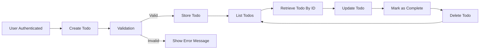

# Functional Requirements for Todo List Application (Minimal Viable Product)

## Requirements Overview

A backend Todo list Minimum Viable Product (MVP) serves individual authenticated users and allows management of their own todo items. The system’s only goal is to provide the least number of features required for a personal todo workflow. Collaboration, metadata, reminders, notifications, and any advanced features are strictly excluded from scope. The only permissible actions are:
- User registration, login, and logout to acquire a token for authentication
- User creation, viewing, updating, completion, and deletion of personal todo items
- All interactions require authentication; no endpoint is accessible for unauthenticated users

Requirements herein are in EARS (Easy Approach to Requirements Syntax) format to ensure precision, testability, and clarity for the development team. Only business-facing requirements are included — no technical, schema, or API details.

## Detailed Functional Requirements (EARS format)

### General Principles
- THE system SHALL require valid user authentication for ALL API requests.
- THE system SHALL enforce that every operation always accesses or modifies ONLY the authenticated user’s own todo data.

### Todo Creation
- WHEN a user is authenticated, THE system SHALL allow the creation of a new todo item with these fields:
  - title (required, string, max 100 characters)
  - description (optional, string, max 1000 characters)
- IF a title is missing or exceeds 100 characters, THEN THE system SHALL reject the request with a precise error message indicating the problem.
- IF the description is provided and exceeds 1000 characters, THEN THE system SHALL reject the request with a precise error message indicating the problem.

### Todo Listing & Retrieval
- WHEN a user is authenticated, THE system SHALL return a list of all todo items owned by the user, sorted with the most recently created first.
- THE system SHALL NEVER show todo items that belong to any other user under any circumstance.
- WHEN a user requests a specific todo item by unique identifier, THE system SHALL return it IF AND ONLY IF it belongs to that user.
- IF a todo item does not exist or is not owned by the user, THEN THE system SHALL return a clear not found or forbidden error.

### Todo Update
- WHEN a user is authenticated, THE system SHALL allow updating only the user’s own todo items (title and/or description fields).
- IF the update payload is invalid (missing title, title too long, description too long), THEN THE system SHALL reject it with a detailed error message.
- IF a user attempts to update any todo item not owned by them, THEN THE system SHALL return a forbidden error.

### Todo Completion & Completion State
- WHEN a user is authenticated, THE system SHALL allow marking any of their own todos as complete.
- WHEN a todo is marked as complete, THE system SHALL record a completion timestamp associated with it.
- WHEN a completed todo is reverted to incomplete, THE system SHALL clear the completion timestamp.
- THE system SHALL support filtering the todo list on completion state (completed or not completed).

### Todo Deletion
- WHEN a user is authenticated, THE system SHALL allow deletion of any of their own todos, removing the item permanently and irreversibly.
- IF a deletion is attempted for a todo not owned by the user or nonexistent, THEN THE system SHALL return a forbidden or not found error as appropriate.

### Input Validation Rules
- THE system SHALL validate all incoming data for required presence, correct type, and maximum length on all fields.
- IF any field violates a constraint, THEN THE system SHALL provide a clear, specific error for the user.

### Data Ownership, Access Control, and Security
- THE system SHALL authenticate users via secure authentication, e.g., JWT-based schemes (actual mechanism specified in auth docs).
- THE system SHALL store and use only the authenticated user’s unique identifier for all data queries and modifications.
- THE system SHALL enforce strict access control for every endpoint based on user identity to prevent exposure of any data between users.

### Error Handling & Response
- IF any unauthenticated request is received, THEN THE system SHALL return an authentication error and no other data.
- IF a forbidden or not-found situation occurs, THEN THE system SHALL return a user-friendly standardized error message and never any data about other users' records or system internals.
- IF a user sends duplicate or rapid consecutive requests, THEN THE system SHALL either process idempotently or return a clear error about request duplication/rate limits.

### Minimal System Flow Diagram

### Explicitly Excluded Features
- THE system SHALL NOT implement sharing or collaboration of any kind
- THE system SHALL NOT provide reminders, alarms, or notifications
- THE system SHALL NOT implement comments, recurring tasks, attachments, labels, tags, priorities, or due dates
- THE system SHALL NOT implement any functionality not described above

### Performance Expectations
- WHEN a user performs any action (CRUD or completion), THE system SHALL respond within 1 second 95% of the time under normal usage
- THE system SHALL provide immediate consistency: all changes by a user SHALL be reflected in their data with no delay

### Completion Criteria
- Implementation of the backend is only considered complete when ALL requirements above are met AND all forbidden features are absent