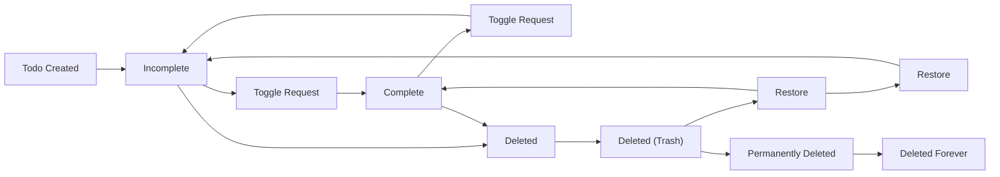

# Multi-User Todo Application Requirements Specification

## User Authentication and Authorization

WHEN a user attempts to sign up, THE system SHALL require a valid email address and a password with minimum 8 characters.

WHEN a user attempts to log in, THE system SHALL authenticate using email and password credentials and return a JWT token for subsequent requests.

WHEN a user changes their password, THE system SHALL validate the current password and require the new password to meet the same minimum length requirements.

WHEN a user deletes their account, THE system SHALL permanently delete all associated todos, edit history, and trash entries in a single atomic transaction.

WHEN a user makes any request to an API endpoint, THE system SHALL validate the JWT token and verify that the userId in the token matches the requested resource's owner.

WHEN a user tries to access another user's resources, THE system SHALL return HTTP 404 Not Found (never HTTP 403) to prevent information leakage.

WHILE a user session is active, THE system SHALL validate the JWT token on every request and refresh the token if it is within 5 minutes of expiration.

## User Profile Management

WHEN a user creates their profile, THE system SHALL initialize it with the email as the default display name.

WHEN a user updates their display name, THE system SHALL allow any non-empty string up to 100 characters and preserve the previous value in audit logs.

WHEN a user attempts to view another user's profile, THE system SHALL return HTTP 404 Not Found.

THE system SHALL NOT expose user profile information in any API responses except the calling user's own profile.

## Todo Creation

WHEN a user creates a todo, THE system SHALL require a non-empty title of 1 to 200 characters.

WHEN a user provides a description, THE system SHALL accept up to 10,000 characters.

WHEN a user provides a start date, THE system SHALL accept valid ISO 8601 dates (YYYY-MM-DDTHH:mm:ss.sssZ).

WHEN a user provides a due date, THE system SHALL accept valid ISO 8601 dates (YYYY-MM-DDTHH:mm:ss.sssZ).

WHEN a todo is created, THE system SHALL initialize its completion status as false (incomplete).

WHEN a todo is created, THE system SHALL set createdAt to the current server time in ISO 8601 format.

WHEN a todo is created, THE system SHALL set updatedAt to the same value as createdAt.

WHEN a todo is created, THE system SHALL set deletedAt to null.

WHEN a todo creation request lacks a title, THE system SHALL return HTTP 400 Bad Request with error message "Title is required".

WHEN a todo creation request has a title longer than 200 characters, THE system SHALL return HTTP 400 Bad Request with error message "Title must not exceed 200 characters".

WHEN a todo creation request has a start date in the future, THE system SHALL accept it.

WHEN a todo creation request has a due date before the start date, THE system SHALL accept it.

## Todo Listing

WHEN a user requests their todo list, THE system SHALL return todos sorted by updatedAt in descending order by default.

WHEN a user requests pagination, THE system SHALL support page sizes from 1 to 100 todos per page.

WHEN a user requests page 1, THE system SHALL return the first N todos ordered by the specified sort field.

WHEN a user requests page X where X > totalPageCount, THE system SHALL return an empty array and HTTP 200 OK.

WHEN a user requests filtering by completion status, THE system SHALL support three values: "all", "complete", "incomplete".

WHEN a user requests filtering by "complete", THE system SHALL return only todos where completed = true.

WHEN a user requests filtering by "incomplete", THE system SHALL return only todos where completed = false.

WHEN a user requests sorting by creation date, THE system SHALL sort by createdAt in ascending or descending order.

WHEN a user requests sorting by start date, THE system SHALL sort by startAt in ascending or descending order, with todos having null startAt appearing last in both orders.

WHEN a user requests sorting by due date, THE system SHALL sort by dueAt in ascending or descending order, with todos having null dueAt appearing last in both orders.

WHEN a user requests a sort field that does not exist, THE system SHALL default to sorting by updatedAt in descending order.

## Todo Toggle

WHEN a user requests to toggle a todo's completion status, THE system SHALL reverse the current completion status of the todo.

THE system SHALL accept exactly one action: "toggle" for completion status change.

WHEN the todo is currently incomplete, THE system SHALL mark it as complete.

WHEN the todo is currently complete, THE system SHALL mark it as incomplete.

THE system SHALL NOT accept any other state values (e.g., "complete", "incomplete") for this endpoint.

WHEN a toggle request is received, THE system SHALL perform the following operations as a single, atomic transaction:
- Read current completion status
- Invert the status value
- Update the todo record in the database
- Preserve the original creation timestamp
- Log the toggle event in audit trail

THE system SHALL NOT allow concurrent toggle operations on the same todo.

WHEN a toggle operation fails at any stage, THE system SHALL roll back the entire operation and return an error.

WHEN a todo is toggled, THE system SHALL record an audit log entry with the following fields:
- timestamp (ISO 8601)
- userId (of the actor performing the toggle)
- todoId
- previousStatus ("complete" or "incomplete")
- newStatus ("complete" or "incomplete")
- operationType ("toggle")

THE system SHALL store toggle events separately from edit history entries.

WHILE a todo has an edit history, THE system SHALL maintain separate audit trails for toggle events and edit events.

WHEN a toggle operation succeeds, THE system SHALL return HTTP 200 OK with the following JSON body:

{
  "id": "string (UUID)",
  "title": "string",
  "description": "string | null",
  "startAt": "string (ISO 8601) | null",
  "dueAt": "string (ISO 8601) | null",
  "completed": "boolean",
  "createdAt": "string (ISO 8601)",
  "updatedAt": "string (ISO 8601)",
  "deletedAt": "string (ISO 8601) | null"
}

WHEN a todo does not exist or belongs to another user, THE system SHALL return HTTP 404 Not Found.

WHEN the requester is not authenticated, THE system SHALL return HTTP 401 Unauthorized.

IF the todo ID provided in the request is malformed (not a valid UUID), THEN THE system SHALL return HTTP 400 Bad Request.

IF the todo ID exists but is associated with a different user, THEN THE system SHALL return HTTP 404 Not Found (to prevent enumeration attacks).

WHEN a user toggles a todo that was previously permanently deleted, THE system SHALL return HTTP 404 Not Found.

WHEN the todo's completion status is already in sync with the requested toggle, THE system SHALL still process the toggle and return the updated state.

THE system SHALL preserve the original creation timestamp (createdAt) of the todo regardless of how many times status is toggled.

WHEN toggling a completed todo to incomplete, THE system SHALL NOT reset the createdAt field or any other original metadata fields.

THE system SHALL NOT modify updatedAt timestamp for toggle operations

THE system SHALL populate updatedAt only when other fields (title, description, dates) are edited.

## Todo Edit

WHEN a user edits a todo, THE system SHALL allow modification of title, description, startAt, and dueAt fields.

WHEN a user edits a todo, THE system SHALL create a new entry in the edit history with the previous values of all modified fields.

WHEN a field is not changed during an edit, THE system SHALL NOT include it in the history entry.

WHEN the title is changed, THE system SHALL record the previous title value.

WHEN the description is changed, THE system SHALL record the previous description value.

WHEN the startAt is changed, THE system SHALL record the previous startAt value.

WHEN the dueAt is changed, THE system SHALL record the previous dueAt value.

WHEN an edit request is received, THE system SHALL update the todo's updatedAt field to the current server time.

WHEN an edit request contains invalid data (e.g., title longer than 200 characters), THE system SHALL return HTTP 400 Bad Request and NOT update the todo.

WHEN an edit request modifies a todo that has been deleted, THE system SHALL return HTTP 404 Not Found.

WHEN an edit request is made to a todo owned by another user, THE system SHALL return HTTP 404 Not Found.

WHEN the edit history for a todo reaches 1,000 entries, THE system SHALL begin overwriting the oldest entries to preserve space.

## Edit History

WHEN a user requests the edit history for a todo, THE system SHALL return all history entries sorted by createdAt (most recent first).

WHEN a history entry is returned, THE system SHALL include:
- id (UUID)
- todoId
- updatedAt (timestamp of edit)
- changes (object with fields that were modified)
- changes.title (string | null)
- changes.description (string | null)
- changes.startAt (string (ISO 8601) | null)
- changes.dueAt (string (ISO 8601) | null)

WHEN there is no edit history for a todo, THE system SHALL return an empty array.

WHEN a user requests history for a todo they do not own, THE system SHALL return HTTP 404 Not Found.

WHEN a todo is permanently deleted, THE system SHALL delete its edit history entries along with it.

## Todo Deletion

WHEN a user deletes a todo, THE system SHALL set deletedAt to the current server time in ISO 8601 format.

WHEN a todo is deleted, THE system SHALL NOT remove it from the database.

WHEN a todo is deleted, THE system SHALL remove it from the user's active todo list.

WHEN a todo is deleted, THE system SHALL preserve all edit history and metadata.

WHEN a user attempts to delete a non-existent todo, THE system SHALL return HTTP 404 Not Found.

WHEN a user attempts to delete a todo that belongs to another user, THE system SHALL return HTTP 404 Not Found.

WHEN a user attempts to delete a todo that was already permanently deleted, THE system SHALL return HTTP 404 Not Found.

## Trash Management

WHEN a user views their trash, THE system SHALL return todos where deletedAt is not null.

WHEN a user requests trash pagination, THE system SHALL support page sizes from 1 to 100 todos per page.

WHEN a user requests sorting in trash, THE system SHALL support the same sort fields as the active todo list: createdAt, startAt, dueAt.

WHEN a user restores a todo from trash, THE system SHALL set deletedAt to null.

WHEN a todo is restored from trash, THE system SHALL return the todo to the active todo list with its original completion status preserved.

WHEN a user permanently deletes a todo from trash, THE system SHALL delete the todo record and all its edit history entries in a single atomic transaction.

WHEN a user permanently deletes a todo from trash, THE system SHALL ensure it cannot be restored.

WHEN a user requests to permanently delete a non-existent todo from trash, THE system SHALL return HTTP 404 Not Found.

WHEN a user requests to permanently delete a todo owned by another user from trash, THE system SHALL return HTTP 404 Not Found.

## Privacy and Data Isolation

WHEN any user performs any action, THE system SHALL ensure that all operations are scoped strictly to the user's own data.

WHEN a user queries for todo data, THE system SHALL apply userId = requestedUserId as an implicit WHERE clause on every database query.

WHEN a user tries to access another user's todo via direct URL or ID, THE system SHALL return HTTP 404 Not Found regardless of the todo's existence.

WHEN a user deletes their account, THE system SHALL remove all related data, including todos, trash, and edit history.

THE system SHALL NOT expose any metadata about other users, including existence of their todos.

THE system SHALL NEVER allow cross-user data access even through API manipulation.

## State Machine

## Business Requirement Summary

- All user data is strictly isolated
- Todos have binary state: complete or incomplete
- Toggle is the only mechanism to change state
- Status changes are audited and preserved
- Soft delete and trash mechanisms ensure data recoverability
- Edit history accurately preserves change history
- Authentication and authorization are enforced at every layer
- No API endpoint allows cross-user data access
- Error responses follow privacy-first principles (404 instead of 403)
- All operations are atomic and consistent
- Data is never deleted permanently until explicitly requested
- System maintains full integrity of lifecycle events
- Complete traceability from creation to final deletion