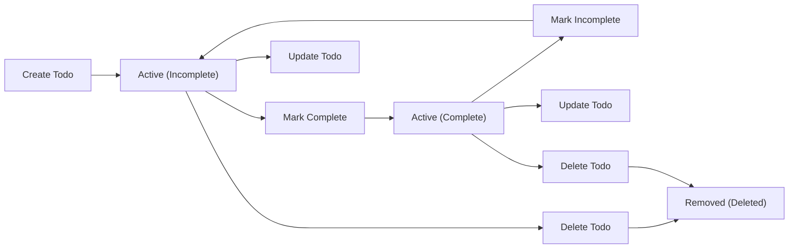

# Business Rules and Validation Logic for Todo List Application

## Introduction
All business rules and validation criteria for the minimal functional Todo list system backend are defined here. This specification eliminates ambiguity for developers and QA, covering every aspect of data control, security, workflow, state management, and feedback. EARS format is used where applicable to ensure requirements are specific and testable. This document is implementation-ready and must be followed without exception.

## Business Rules

### General Principles
- THE system SHALL allow each user to manage only their own todo items.
- THE system SHALL enforce complete data isolation between users. No data—either in-transit or at rest—may be shared, queried, or accessed by other users under any circumstances.
- WHEN a user is not authenticated, THEN THE system SHALL deny all attempts to view, create, update, or delete todo items and respond with a proper authentication error.

### Ownership and Access Control
- THE user SHALL have permission to create, view, update, complete, or delete only their own todo items and no others.
- IF a user attempts to access or modify another user's todo item, THEN THE system SHALL deny the action and return an appropriate error response indicating resource access is forbidden.
- THE system SHALL associate each todo item with exactly one user (its creator/owner) and SHALL NOT allow shared or group ownership. All ownership and access checks must be enforced for all API routes at the business logic layer. No admin functionality or elevated roles exist for this minimal system.

### Task Lifecycle Rules
- WHEN a todo item is created, THEN THE system SHALL record the creation timestamp as immutable; it cannot be edited by any user or system process.
- WHEN a todo item is updated, THEN THE system SHALL update a last-modified timestamp and record the time of all successful modifications.
- THE completion status of a todo item SHALL always be one of: incomplete (default state on create), or complete (settable at any time).
- WHEN a todo item is marked as complete, THEN THE system SHALL record the completion timestamp; when marked incomplete, completion timestamp SHALL be cleared.
- THE system SHALL permit the user to toggle completion status freely with no restriction on number of state changes.
- WHEN a todo item is deleted, THEN THE system SHALL permanently and irreversibly delete all associated data and SHALL remove it from all system records and user views.

## Validation Logic

### Field-Level Validation
- WHEN creating or updating a todo item, THE system SHALL require a non-empty, non-whitespace title and SHALL enforce a maximum title length of 255 characters.
- WHEN creating or updating a todo item, THE system SHALL permit an optional description up to 1,000 characters; if description is provided and exceeds this length, THE system SHALL reject the request.
- WHEN creating, updating, or completing a todo item, THE system SHALL require the completion status value to be a boolean (true or false).
- IF any provided title is empty, only whitespace, or exceeds 255 characters, THEN THE system SHALL return a validation error and SHALL NOT modify data.
- IF a provided description is longer than 1,000 characters, THEN THE system SHALL return a validation error with explicit field indication.
- WHEN any required todo item field is missing from a request, THEN THE system SHALL return a validation error indicating all missing field names.

### State Transition Validation
- WHEN a user attempts to update or complete a deleted todo item, THEN THE system SHALL return an error indicating the item does not exist.
- IF a user requests deletion of a todo item that does not exist, THEN THE system SHALL return an error specifying that the item was not found.
- WHEN changing completion status, THE system SHALL permit any number of toggles, with no restrictions on frequency or state history.
- THE system SHALL NOT allow modification of the creation timestamp after initial creation.
- THE system SHALL prevent the creation of duplicate todo items by title and timestamp for any user.

## Examples of Business Rules and Validation Logic (EARS)

- WHEN a user submits a create request with only whitespace in the title, THEN THE system SHALL deny creation and return an error stating that the title cannot be empty.
- IF a user attempts to mark another user's todo item as complete, THEN THE system SHALL return a forbidden error and SHALL NOT alter any data.
- WHEN a user updates a todo item omitting the "completed" field, THEN THE system SHALL retain the previous completion status without error.
- WHEN a user submits two create requests with the same title and identical timestamps, THEN THE system SHALL reject the second request with a duplication error.
- IF a user submits a deletion request with an invalid or non-existent item ID, THEN THE system SHALL return an error stating item not found or access is denied.

## Task Lifecycle Reference Diagram

## Performance and Error Feedback
- THE system SHALL provide validation errors specifying field names and reasons for rejection within 1 second of receiving any invalid todo creation, update, or deletion request.
- THE system SHALL use clear and actionable error messages for all denied actions or input validation failures, providing precise cause to the end user for all failures.

## Summary Table: Field Validation Rules

| Field             | Required | Max Length | Value Type | Special Constraints                |
|-------------------|----------|------------|------------|------------------------------------|
| title             | Yes      | 255        | String     | Must not be empty or whitespace    |
| description       | No       | 1,000      | String     | Optional, truncated if too long    |
| completed         | Yes      | N/A        | Boolean    | Default: false                     |
| creationTimestamp | Auto     | N/A        | DateTime   | Immutable, set on creation only    |
| lastModified      | Auto     | N/A        | DateTime   | Updated on modification            |
| completedAt       | Auto     | N/A        | DateTime   | Set on complete, cleared otherwise |

## Additional Examples
- WHEN a user tries to create a todo without a title, THEN THE system SHALL reject the request and clearly indicate that the title is required.
- WHEN a user updates the description to exceed 1,000 characters, THEN THE system SHALL reject the update and specify that the description is too long.
- WHEN a user changes only completion status on a todo item, THEN THE system SHALL update only that state and keep all other values unchanged.

## Closing Notes
All rules and logic stated above are mandatory and must be enforced by the backend for every request, user, and scenario. Each requirement uses business language only; no database schema or internal API details are provided. Diagrams and tables illustrate valid workflow and state management. This document is the sole foundation for backend logic implementation and test development.