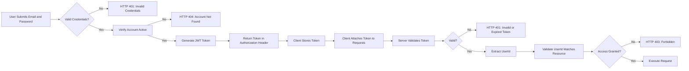
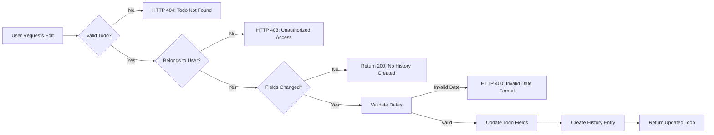
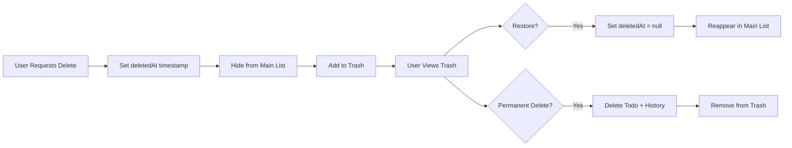

# Multi-User Todo Application Requirements Specification

## Overview

The Multi-User Todo Application is a secure private task management system where each user owns and manages their own todo items without visibility into other users' data. The system enforces strict data isolation, personal autonomy, and full privacy. Users can create, view, edit, complete, delete, and restore todos with full edit history tracking. All operations are scoped exclusively to the authenticated user.

## User Account Management

### User Registration

WHEN a new user signs up, THE system SHALL require the following:
- An email address that conforms to standard email format (local-part@domain)
- A password that is at least 8 characters long
- The email address SHALL be unique across the system; duplicate registrations SHALL be rejected

WHEN registration is successful, THE system SHALL:
- Create a new user record with status "active"
- Generate a unique user ID
- Store only a cryptographically hashed version of the password
- Do not store, display, or expose the original password under any circumstances
- Immediately log the user in and return a valid authentication token

### User Login

WHEN a user attempts to log in, THE system SHALL:
- Accept the user's email and password as credentials
- Validate that an active user exists with the provided email
- Verify that the submitted password matches the stored hashed value
- Reject login attempts for inactive or deleted account records
- Return a JSON Web Token (JWT) bearer token valid for 24 hours
- Record the login attempt timestamp and IP address for security auditing

IF the submitted credentials are invalid:
- THE system SHALL reject the login with HTTP 401 and error code "AUTH_INVALID_CREDENTIALS"
- THE system SHALL NOT disclose whether the email does not exist or the password is incorrect

### Password Change

WHEN a user requests to change their password, THE system SHALL:

1. Authenticate the request with a valid, non-expired JWT
2. Validate that the current password provided matches the stored hash
3. Validate that the new password meets security requirements:
   - Minimum 8 characters
   - No maximum length
4. Confirm the new password matches the confirmation field
5. Hash the new password using the same cryptographic algorithm and salt
6. Replace the stored password hash with the new value
7. Invalidate all existing JWT tokens for this user
8. Issue a new JWT token

IF any validation fails:
- THE system SHALL respond with HTTP 400 and appropriate error code
- THE system SHALL NOT change the password if any condition is unmet
- THE system SHALL log all password change attempts for security monitoring

### Account Deletion

WHEN a user initiates account deletion, THE system SHALL:

1. Authenticate the request with a valid, non-expired JWT
2. Request explicit confirmation (yes/no) from the user
3. Verify that the user is not a system administrator (if any)
4. Initiate a cascade delete operation:
   - Delete all todos belonging to the user (including those marked as deleted)
   - Delete all edit history entries associated with the user's todos
   - Delete the user's profile record (display name)
   - Remove the user's authentication record
5. Return HTTP 204 No Content upon successful deletion
6. Invalidate all authentication tokens associated with this user immediately

IF deletion is requested but the user cannot be authenticated:
- THE system SHALL respond with HTTP 401 and error code "AUTH_MISSING_TOKEN"

IF deletion is requested but the user account is already deleted:
- THE system SHALL respond with HTTP 404 and error code "USER_ACCOUNT_NOT_FOUND"

## User Profile

### Profile Creation

WHEN a new user registers successfully, THE system SHALL automatically create a profile with:
- The user's unique ID (system-generated)
- A default display name (derived from the first part of the email before @)
- No other profile fields

WHEN a user first accesses their profile:
- THE system SHALL display the generated display name
- THE system SHALL allow immediate editing of the display name

### Display Name Edit

WHEN a user edits their display name, THE system SHALL:
- Accept a string input of 1 to 50 characters in length
- Allow alphanumeric characters, spaces, hyphens, underscores, and basic punctuation
- Reject any input that is empty, null, or exceeds 50 characters
- Reject any input containing HTML, script tags, or executable code
- Validate that the display name does not match any reserved system names

WHEN the display name is successfully updated:
- THE system SHALL immediately update the profile record
- THE system SHALL NOT affect any todo items or their metadata
- THE system SHALL NOT expose the new display name to any other user

IF the display name change fails validation:
- THE system SHALL respond with HTTP 400 and error code "PROFILE_INVALID_DISPLAY_NAME"

### Privacy Enforcement

THE system SHALL guarantee that user profiles are completely private by:

- Never exposing user profile data (display name, email, ID) to other users
- Never allowing any listing, searching, or querying of user profiles by any other user
- Never including profile data in responses to any API request unless explicitly for the authenticated user
- Preventing any indirect detection of user profiles through timing attacks, ID enumeration, or metadata leakage
- Ensuring that all profile-related API endpoints (GET /profile, PUT /profile) are gated by the authenticated user ID

WHEN a user attempts to access another user's profile:
- THE system SHALL respond with HTTP 403 and error code "PROFILE_ACCESS_DENIED"

## Todo Creation

### Todo Creation Process

WHEN a user requests to create a new todo, THE system SHALL:

1. Authenticate the user with a valid JWT
2. Validate that the request body contains a title field of type string
3. Validate that the title is not empty or composed only of whitespace
4. Validate that the title does not exceed 200 characters
5. Accept an optional description field of type string (max 10,000 characters)
6. Accept an optional startDate field of type date (ISO 8601 format), with valid year range 1900–2100
7. Accept an optional dueDate field of type date (ISO 8601 format), with valid year range 1900–2100
8. Validate that if startDate is provided, it is not after dueDate if dueDate is also provided
9. Set the completion status to false (incomplete) by default
10. Set the creation timestamp to the current server time
11. Assign the todo to the authenticated user's ID
12. Store all submitted fields in the database
13. Return the created todo object with its full attributes and ID

### Field Requirements

- **Title**: Required. Minimum 1 character, maximum 200 characters. Trimmed and validated.
- **Description**: Optional. Maximum 10,000 characters. Accepts markdown-compatible text.
- **Start Date**: Optional. Must be valid ISO 8601 date string (e.g., "2026-03-15"). Cannot be blank.
- **Due Date**: Optional. Must be valid ISO 8601 date string (e.g., "2026-03-20"). Cannot be blank.

IF any field exceeds character limits:
- THE system SHALL respond with HTTP 400 and error code "TODO_TITLE_TOO_LONG" or "TODO_DESCRIPTION_TOO_LONG"

IF start date is provided but invalid:
- THE system SHALL respond with HTTP 400 and error code "TODO_INVALID_START_DATE"

IF due date is provided but invalid:
- THE system SHALL respond with HTTP 400 and error code "TODO_INVALID_DUE_DATE"

IF start date is after due date:
- THE system SHALL respond with HTTP 400 and error code "TODO_START_AFTER_DUE"

### Default Behavior

WHEN no value is provided for a field:
- title: THROWS error (required)
- description: stored as null
- startDate: stored as null
- dueDate: stored as null
- completed: set to false

### Error Scenarios

- **Invalid Token**: HTTP 401 with code "AUTH_INVALID_TOKEN"
- **No Authentication**: HTTP 401 with code "AUTH_MISSING_TOKEN"
- **Missing Title**: HTTP 400 with code "TODO_TITLE_REQUIRED"
- **Empty Title**: HTTP 400 with code "TODO_TITLE_EMPTY"

## Todo Viewing

### List Retrieval

WHEN a user retrieves their todo list, THE system SHALL:

1. Authenticate the user
2. Query all todos where userId equals the authenticated user ID
3. Filter out todos that are permanently deleted
4. Apply pagination parameters if provided (page: integer ≥ 1, limit: integer 1–50)
5. Apply filters (see Filtering section)
6. Apply sorting (see Sorting section)
7. Return a paginated response with:
   - List of todo items with fields: id, title, completed, startDate (if set), dueDate (if set), createdAt
   - Total count of matching todos
   - Current page number
   - Number of items on current page
   - Total number of pages

IF any pagination parameter is outside allowed range:
- THE system SHALL default to page=1, limit=25

### Single Todo Retrieval

WHEN a user retrieves a single todo by ID, THE system SHALL:

1. Authenticate the user
2. Validate that the todo ID exists and belongs to the authenticated user
3. Verify that the todo has not been permanently deleted
4. Return the full todo object including:
   - id
   - title
   - description
   - startDate
   - dueDate
   - completed
   - createdAt
   - updatedAt
   - deletedAt (if applicable)

IF the todo does not exist or belongs to another user:
- THE system SHALL respond with HTTP 404 and error code "TODO_NOT_FOUND"

IF the todo is permanently deleted:
- THE system SHALL respond with HTTP 404 and error code "TODO_PERMANENTLY_DELETED"

## Todo Toggle

### Status Change

WHEN a user toggles a todo's completion status, THE system SHALL:

1. Authenticate the user
2. Validate that the todo exists and belongs to the authenticated user
3. Verify that the todo has not been permanently deleted
4. Flip the completion status from true to false or false to true
5. Set the updatedAt timestamp to the current time
6. Return the updated todo object
7. Log the toggle event in audit logs with timestamp and user ID

WHEN a todo is toggled from incomplete to complete:
- THE system SHALL preserve all other fields unchanged
- THE system SHALL NOT modify startDate or dueDate

WHEN a todo is toggled from complete to incomplete:
- THE system SHALL preserve all other fields unchanged
- THE system SHALL NOT modify or reset any date fields

### Error Handling

- **Unauthorized Access**: HTTP 403 with code "TOGGLE_UNAUTHORIZED"
- **Todo Not Found**: HTTP 404 with code "TOGGLE_TODO_NOT_FOUND"
- **Todo Permanently Deleted**: HTTP 404 with code "TOGGLE_PERMANENTLY_DELETED"

## Todo Editing

### Editable Fields

Users may edit all of the following fields of any todo they own:
- Title
- Description
- Start Date
- Due Date

Users MAY NOT edit:
- Completion status
- Creation timestamp
- ID
- Deletion status
- Edit history

### Edit Submission Process

WHEN a user submits an edit to a todo:

1. THE system SHALL validate that the todo exists and belongs to the requesting user
2. THE system SHALL validate that the todo is not permanently deleted
3. THE system SHALL validate that all provided fields conform to their defined data types and formats
4. THE system SHALL compare the submitted values to the current values stored in the database
5. THE system SHALL create an edit history entry ONLY if at least one field has changed
6. THE system SHALL update the todo with the new values
7. THE system SHALL return the updated todo object with the modified fields
8. THE system SHALL NOT allow editing of a todo that has been permanently deleted from trash

### Edit History Creation

Each time a todo is edited and at least one field has changed, THE system SHALL create a new edit history entry with the following structure:

- timestamp: ISO 8601 datetime of the edit
- title: the previous value of the title field (or null if unchanged)
- description: the previous value of the description field (or null if unchanged)
- startDate: the previous value of the start date field (or null if unchanged)
- dueDate: the previous value of the due date field (or null if unchanged)
- editorId: the ID of the user who performed the edit

History entries are stored in chronological order with the most recent entry appearing first in retrieval queries.

### Field Change Detection

THE system SHALL detect changes to each field independently and record the previous value only if it differs from the submitted value.

Changes SHALL be detected as follows:

- Title: Changes when the submitted string differs from the current string
- Description: Changes when the submitted string differs from the current string
- Start date: Changes when:
  - A date is submitted where none existed before
  - A date is submitted that differs from the existing date
  - A null value is submitted where a date existed before
- Due date: Changes when:
  - A date is submitted where none existed before
  - A date is submitted that differs from the existing date
  - A null value is submitted where a date existed before

All comparisons SHALL be case-sensitive for string fields and exact for date fields.

### History Versioning

Each edit history entry represents one version of the todo state. The total number of history entries for any single todo SHALL be limited only by storage constraints, with no artificial cap applied.

When a todo is restored from trash, its complete edit history SHALL be restored with it, preserving the chronological sequence of all edits.

When a todo is permanently deleted from trash, ALL associated edit history entries SHALL be deleted simultaneously in a single atomic transaction.

THE system SHALL NOT trim, archive, or compress history entries. Every edit that creates a change SHALL result in a full, complete version entry.

THE system SHALL ensure that the edit history is never exposed to any user other than the owner of the todo.

### Business Rules

#### Editing Completed Todos

WHEN a todo is marked as complete, THE system SHALL allow the user to edit its title, description, start date, and due date.

WHEN a todo is edited while complete, THE system SHALL preserve its complete status and SHALL NOT automatically mark it as incomplete.

#### Date Handling

WHEN a user submits a date field in an invalid format, THE system SHALL reject the edit with HTTP 400 and an error code of EDIT_INVALID_DATE_FORMAT.

WHEN a user submits a date field with a value prior to the year 1900, THE system SHALL reject the edit with HTTP 400 and an error code of EDIT_INVALID_DATE_RANGE.

WHEN a user submits a date field with a value beyond the year 2100, THE system SHALL reject the edit with HTTP 400 and an error code of EDIT_INVALID_DATE_RANGE.

WHILE a todo has no due date set, THE system SHALL continue to store a null value for the dueDate field, and it SHALL be treated as "unset" in all sorting and filtering operations.

### Error Scenarios

#### Unauthorized Edit

IF a user requests to edit a todo that does not belong to them, THEN THE system SHALL respond with HTTP 403 and error code: EDIT_UNAUTHORIZED_ACCESS.

#### Todo Not Found

IF a user requests to edit a todo with an ID that does not exist in the database, THEN THE system SHALL respond with HTTP 404 and error code: EDIT_TODO_NOT_FOUND.

#### Invalid Date Format

IF a user submits a date field with an invalid ISO 8601 format, THEN THE system SHALL respond with HTTP 400 and error code: EDIT_INVALID_DATE_FORMAT.

#### Date Range Violation

IF a user submits a date field with a value outside the valid range (1900-2100), THEN THE system SHALL respond with HTTP 400 and error code: EDIT_INVALID_DATE_RANGE.

#### No Changes Detected

IF all submitted values are identical to the current values of the todo, THEN THE system SHALL return HTTP 200 with the current todo data and SHALL NOT create a history entry.

### Performance Requirements

THE system SHALL update todo data and create an edit history entry in under 200 milliseconds for 99% of requests under normal load conditions.

WHEN editing a todo with a history of 1000+ entries, THE system SHALL still respond within 500 milliseconds.

WHEN querying the edit history of a todo with 1000+ entries, THE system SHALL return the first page (25 entries) within 300 milliseconds.

### Access Control

THE system SHALL ensure that all edits, history retrievals, and validation checks are scoped to the authenticated user's ID.

WHEN a request is made to edit a todo, THE system SHALL authenticate the user and verify that the todo's userId field matches the authenticated user's ID.

IF no valid authentication token is provided, THEN THE system SHALL respond with HTTP 401 and error code: AUTH_MISSING_TOKEN.

IF the authentication token is invalid, expired, or tampered with, THEN THE system SHALL respond with HTTP 401 and error code: AUTH_INVALID_TOKEN.

### Data Isolation

WHERE a user edits a todo, THE system SHALL guarantee complete isolation of data.

THE system SHALL NEVER allow access to another user's todos through any indirect method, including:
- Guessing todo IDs
- Manipulating API parameters
- Querying shared resources
- Accessing database directly

THE system SHALL enforce data isolation at both the application layer and the database query layer.

## Delete Todo

### Soft Delete Process

WHEN a user deletes a todo, THE system SHALL:

1. Authenticate the user
2. Verify that the todo belongs to the authenticated user
3. Set the deletedAt timestamp to the current server time
4. Do NOT remove the todo from the database
5. Ensure the todo is no longer visible in the main todo list
6. Add the todo to the users' trash list
7. Return an HTTP 204 No Content response

THE system SHALL NOT delete or modify the todo's edit history during soft delete.

### Visibility in Main List

WHEN retrieving a todo list, THE system SHALL exclude all todos with a non-null deletedAt timestamp.

WHEN any user attempts to access a todo that has been soft-deleted:
- If accessed via /todos/:id → HTTP 404
- If accessed via /trash → accessible

### Trash Access

THE system SHALL maintain a separate trash view accessible at /trash endpoint.

THE system SHALL permit only the owner of a todo to access its trash.

WHEN a user retrieves their trash list:
- THE system SHALL return todos with deletedAt not null
- THE system SHALL return TODOS ordered by deletedAt descending (latest deleted first)
- THE system SHALL support pagination, filtering, and sorting

### Data Retention Policy

THE system SHALL retain all soft-deleted todos indefinitely until:
- They are restored, OR
- They are permanently deleted

No automatic purging of trash shall occur.

### Isolation Guarantee

THE system SHALL ensure that a user cannot view another user's soft-deleted todos, even indirectly.

### Cascading Effects

- Restoring a todo restores its edit history
- Permanently deleting a todo deletes its edit history
- Editing a todo is disabled while it’s in trash

## Trash

### Trash View Interface

WHEN a user accesses the trash, THE system SHALL:

1. Authenticate the user
2. Query all todos where deletedAt is not null AND userId matches authenticated user ID
3. Return paginated results (default page=1, limit=25)
4. Return each todo with:
   - id
   - title
   - completed
   - startDate (if set)
   - dueDate (if set)
   - createdAt
   - deletedAt
   - count of edit history entries

### Restoration Process

WHEN a user restores a todo from trash:

1. THE system SHALL authenticate the user
2. THE system SHALL validate that the todo is in trash (deletedAt not null)
3. THE system SHALL validate that the todo belongs to the authenticated user
4. THE system SHALL set deletedAt to null
5. THE system SHALL update the updatedAt timestamp
6. THE system SHALL return HTTP 200 with the restored todo
7. THE system SHALL make the todo reappear in the main todo list
8. THE system SHALL preserve all edit history entries

### Permanent Deletion

WHEN a user permanently deletes a todo from trash:

1. THE system SHALL authenticate the user
2. THE system SHALL validate the todo exists in trash AND belongs to the user
3. THE system SHALL initiate a cascade removal:
   - Permanently delete todo record from database
   - Permanently delete all associated edit history entries
4. THE system SHALL return HTTP 204 No Content

IF attempted by another user:
- THE system SHALL respond with HTTP 404 and error code "PERMANENT_DELETE_UNAUTHORIZED"

### Purge Requirements

THE system SHALL NOT support bulk trash purge operations.

THE system SHALL NOT auto-purge trash based on age.

THE system SHALL NOT allow restoration after permanent deletion.

## Filtering Todos

### Status Filters

Users may apply the following filter options to their todo list:

- **All**: Return todos regardless of completion status (default)
- **Completed**: Return only todos where completed=true
- **Incomplete**: Return only todos where completed=false

WHEN a filter is applied:
- THE system SHALL return only todos matching the filter criteria
- THE system SHALL apply the filter before pagination
- THE system SHALL respect the current sort order

RFILTERS ARE MERGED with sorting options.

### Filter Parameter

The filter SHALL be passed as a string parameter "filter" in query string:

- /todos?filter=all
- /todos?filter=completed
- /todos?filter=incomplete

IF an unsupported filter value is provided:
- THE system SHALL default to "all"

## Sorting Todos

### Allowed Sort Fields

Users may sort todo lists by the following fields:
- createdAt
- startDate
- dueDate

Each field supports two directions: ascending (oldest first) and descending (newest first)

### Default Sort Order

THE system SHALL apply the following default sort order if no other sort is specified:
- Field: createdAt
- Direction: descending (newest first)

### Available Sort Parameters

SORT parameters are passed via query string:
- /todos?sortBy=createdAt&sortOrder=desc
- /todos?sortBy=dueDate&sortOrder=asc

Valid values for sortBy: "createdAt", "startDate", "dueDate"

Valid values for sortOrder: "asc", "desc"

IF an invalid sortBy or sortOrder is provided:
- THE system SHALL default to "createdAt" for sortBy
- THE system SHALL default to "desc" for sortOrder

### Missing Date Handling

WHEN sorting by startDate:
- Todos with no startDate SHALL appear AFTER todos with a startDate
- Among todos with no startDate, sort by createdAt descending

WHEN sorting by dueDate:
- Todos with no dueDate SHALL appear AFTER todos with a dueDate
- Among todos with no dueDate, sort by createdAt descending

### Sort Priority

If multiple todos have the same value for the sort field:
- Sort by createdAt descending as secondary criteria

### Combined Filters and Sort

FILTERS and SORTING SHALL be applied in this order:

1. Apply filter
2. Apply sort
3. Apply pagination

## Authentication and Authorization

### Authentication Flow

WHEN a user logs in, THE system SHALL:

1. Accept email and password
2. Verify user exists and is active
3. Validate password hash
4. Generate JWT with:
   - Subject: userId
   - Issuer: "todo-auth-service"
   - Expiration: 24 hours
   - Algorithm: HS256
5. Return token in Authorization header as "Bearer <token>"

WHEN a request is made to any protected endpoint:

1. Extract Bearer token from Authorization header
2. Validate signature and expiry
3. Validate token issuer
4. Extract user ID from subject
5. Load user record
6. If invalid → return 401 Unauthorized

### JWT Payload Structure

The JWT payload SHALL contain:

{
  "sub": "string", // user ID
  "iss": "todo-auth-service",
  "iat": number, // issued at
  "exp": number  // expiration
}

### Token Expiration Policy

- All tokens expire after 24 hours
- No refresh tokens are issued
- Users must re-authenticate after token expiry
- Sessions are single-device only

### Secret Key Management

- Secret key SHALL be stored encrypted at rest
- Key SHALL be rotated quarterly
- Previously issued tokens SHALL be invalidated upon key rotation
- Access to secret key SHALL be restricted to deployment service

### Data Scope Isolation

THE system SHALL enforce strict data isolation across all endpoints:

- Every database query SHALL include a userId = ? filter
- Every API endpoint SHALL validate request user ID against authenticated user
- Every search, sort, filter SHALL be scoped to the authenticated user
- Cache keys SHALL be prefixed with userId
- Audit logs SHALL record userId for all data access

WHEN a user attempts to access data via direct URL manipulation:
- THE system SHALL block all attempts to access another user's data
- THE system SHALL return 404 for unowned resources

## Access Control Matrix

| Feature | userRA | userRB | userRC | admin (if any) |
|---------|--------|--------|--------|----------------|
| Create Todo | ✅ | ✅ | ✅ | ✅ |
| View Own Todo List | ✅ | ✅ | ✅ | ✅ |
| View Other's Todo List | ❌ | ❌ | ❌ | ❌ |
| View Own Todo Detail | ✅ | ✅ | ✅ | ✅ |
| View Other's Todo Detail | ❌ | ❌ | ❌ | ❌ |
| Toggle Todo | ✅ | ✅ | ✅ | ✅ |
| Edit Todo | ✅ | ✅ | ✅ | ✅ |
| View Edit History | ✅ | ✅ | ✅ | ✅ |
| Delete Todo | ✅ | ✅ | ✅ | ✅ |
| View Trash | ✅ | ✅ | ✅ | ✅ |
| Restore Todo | ✅ | ✅ | ✅ | ✅ |
| Permanently Delete | ✅ | ✅ | ✅ | ✅ |
| Edit Profile | ✅ | ✅ | ✅ | ✅ |
| Change Password | ✅ | ✅ | ✅ | ✅ |
| Delete Account | ✅ | ✅ | ✅ | ✅ |
| View User List | ❌ | ❌ | ❌ | ❌ |
| View System Logs | ❌ | ❌ | ❌ | ❌ |

## Mermaid Diagrams

### Authentication Flow



### Todo Edit Flow



### Edit History Versioning

```mermaid
graph LR
  A[Original Todo] --> B[Edit 1: Title Changed]
  B --> C[Edit 2: Description Changed]
  C --> D[Edit 3: Due Date Set]
  D --> E[Edit 4: Start Date Cleared]
  E --> F[Edit 5: Title Changed Again]

  subgraph "Edit History"
    B --> H1["{\"title\": \"Original Title\", \"description\": null, \"startDate\": null, \"dueDate\": null, \"editorId\": \"user1\"}"]
    C --> H2["{\"title\": \"Title After Edit 1\", \"description\": \"Original Description\", \"startDate\": null, \"dueDate\": null, \"editorId\": \"user1\"}"]
    D --> H3["{\"title\": \"Title After Edit 2\", \"description\": \"Description After Edit 2\", \"startDate\": null, \"dueDate\": \"2026-03-15\", \"editorId\": \"user1\"}"]
    E --> H4["{\"title\": \"Title After Edit 3\", \"description\": \"Description After Edit 2\", \"startDate\": \"2026-03-10\", \"dueDate\": \"2026-03-15\", \"editorId\": \"user1\"}"]
    F --> H5["{\"title\": \"Title After Edit 4\", \"description\": \"Description After Edit 2\", \"startDate\": \"2026-03-10\", \"dueDate\": \"2026-03-15\", \"editorId\": \"user1\"}"]
  end
```

### Soft Delete and Trash Flow



### Filter and Sort Combined Flow

```mermaid
graph LR
  A[User Requests Todo List] --> B{Filter?}
  B -->|Yes| C[Apply Filter: completed/incomplete/all]
  B -->|No| D[Apply "all" filter]
  C --> E[Apply Sort: createdAt/startDate/dueDate]
  D --> E
  E --> F[Apply Pagination: page/limit]
  F --> G[Return Paginated List]
```

## Business Rules Summary

- Every user’s data is completely isolated
- No user can ever see, access, or infer another user’s data
- Users control their own experience: create, edit, delete, restore, sort, filter
- Edit history is preserved as immutable audit log
- All operations happen in real-time with no caching of user-specific data
- System provides clear, specific error messages for validation
- Performance targets are strictly defined
- No auto-expiry, auto-purge, or default behaviors beyond those defined
- Stone-sharp: All requirements are absolute, unambiguous, and testable

## Developer Notes

This document defines **business requirements only**. All technical implementations (architecture, APIs, database design, etc.) are at the discretion of the development team.

This document defines **business requirements only**. All technical implementations (architecture, APIs, database design, etc.) are at the discretion of the development team.

This document defines **business requirements only**. All technical implementations (architecture, APIs, database design, etc.) are at the discretion of the development team.