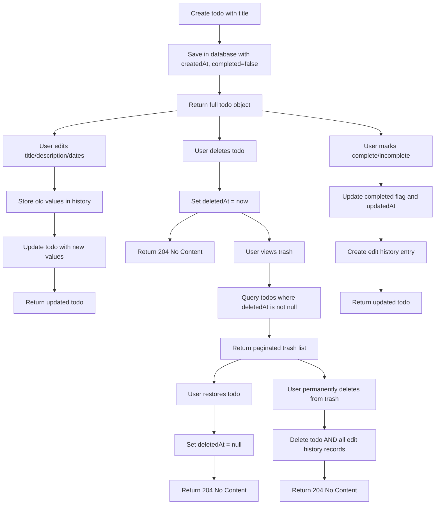
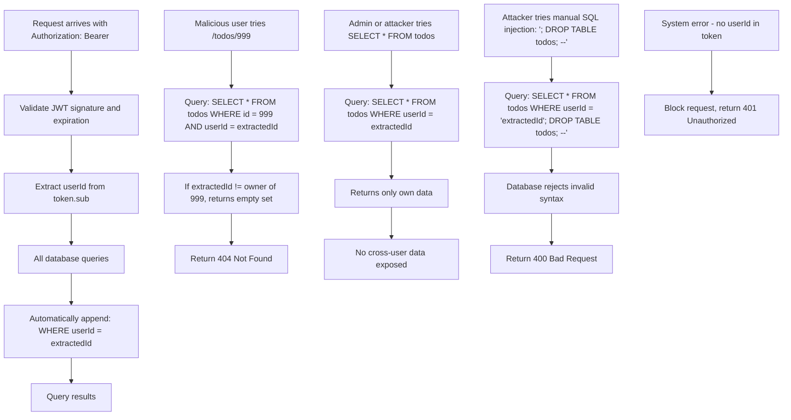

# Multi-User Todo Application Requirements Specification

## User Authentication

WHEN a user attempts to sign up, THE system SHALL require a valid email address and password. THE email SHALL be unique across the system. THE password SHALL be at least 8 characters long and SHALL be hashed using bcrypt before storage. WHEN the signup request is submitted, THE system SHALL validate both fields. IF the email is already registered, THE system SHALL return a 409 Conflict response with message "Email already in use". IF the password is shorter than 8 characters, THE system SHALL return a 400 Bad Request with message "Password must be at least 8 characters". IF validation succeeds, THE system SHALL create a new account with a unique identifier, a default display name (derived from the email prefix), and set the account status to "active". THE response SHALL include a JWT token signed with HS256 using a server-side secret, containing the user ID and role, with a 24-hour expiration.

WHEN a user attempts to log in, THE system SHALL accept the email and password. THE system SHALL look up the user by email. IF no user is found with that email, THE system SHALL return a 401 Unauthorized response with message "Invalid credentials". IF the user exists but the password hash does not match, THE system SHALL return a 401 Unauthorized response with message "Invalid credentials". IF authentication succeeds, THE system SHALL issue a JWT token identical to the signup flow. THE token SHALL not contain any user credentials, personally identifiable information, or session state. THE system SHALL NOT store the token server-side.

WHEN a user requests to change their password, THE system SHALL require the current password and two new password fields (confirmation required). THE system SHALL validate that the current password matches the stored hash. IF it does not match, THE system SHALL return a 401 Unauthorized response. IF the two new passwords do not match, THE system SHALL return a 400 Bad Request with message "New passwords do not match". IF the new password is shorter than 8 characters, THE system SHALL return a 400 Bad Request with message "Password must be at least 8 characters". IF all validations pass, THE system SHALL update the password hash and rotate the JWT session token (invalidating the old one). THE system SHALL send a verification email to the user's registered email address confirming the change.

WHEN a user requests to delete their account, THE system SHALL require password confirmation. IF the password provided does not match the stored hash, THE system SHALL return a 401 Unauthorized response. IF confirmed, THE system SHALL immediately start an atomic transaction to permanently delete all user data, including all todos, edit histories, trash items, and profile information. THE deletion SHALL occur in a single database transaction and SHALL complete within 500ms. WHILE the deletion is in progress, THE system SHALL prevent any other operations from this user. AFTER completion, the JWT token shall be immediately invalidated, and all subsequent requests with that token SHALL return 401 Unauthorized. THE system SHALL log this event in an internal audit log with timestamp, user ID, and IP address, but SHALL never expose this log to any external interface.

## User Profile Management

WHEN a user requests to update their display name, THE system SHALL accept a string of 1 to 50 characters. IF the display name is empty or contains only whitespace, THE system SHALL return a 400 Bad Request with message "Display name cannot be empty". IF the display name exceeds 50 characters, THE system SHALL return a 400 Bad Request with message "Display name cannot exceed 50 characters". IF the display name contains HTML tags, special script characters (`<`, `>`, `&`, `\`, `"`), or Unicode control characters, THE system SHALL sanitize the input by removing those characters and return a 400 Bad Request with message "Display name contains invalid characters". IF the update is valid, THE system SHALL update the profile record and return the updated profile object with the new display name. THE system SHALL NOT allow any user to view another user's profile, even with direct ID access. IF a request is made to view a profile belonging to another user, THE system SHALL return a 404 Not Found even if that profile exists.

## Todo Creation

WHEN a user creates a new todo, THE system SHALL require a title field with 1 to 200 characters. THE title SHALL NOT be empty, contain only whitespace, or begin or end with whitespace. IF the title is missing, THE system SHALL return a 400 Bad Request with message "Title is required". IF the title contains fewer than 1 character or more than 200 characters, THE system SHALL return a 400 Bad Request with message "Title must be between 1 and 200 characters". THE description field, if provided, SHALL be limited to 5000 characters. IF provided, the start date SHALL be a valid ISO 8601 date string in UTC (e.g., "2026-01-30T00:00:00Z"). IF provided, the due date SHALL be a valid ISO 8601 date string in UTC. IF a due date is provided and is earlier than the start date, THE system SHALL return a 400 Bad Request with message "Due date cannot be earlier than start date". IF any date is malformed, THE system SHALL return a 400 Bad Request with message "Invalid date format - use ISO 8601 UTC". WHEN a todo is created successfully, THE system SHALL assign a unique numeric ID, set the createdAt timestamp to the current UTC time, set the completed flag to false, and associate it with the authenticated user. THE system SHALL return the complete todo object with all fields and timestamps.

## Todo Viewing

WHEN a user requests their todo list, THE system SHALL return a paginated list of todos belonging to the authenticated user. THE response SHALL include: id, title, completed, startDate (if set), dueDate (if set), createdAt, and updatedAt. WHEN pagination is requested, THE system SHALL support a limit parameter (1 to 50, default 10) and an offset parameter (0 to 10000). IF limit is not between 1 and 50, THE system SHALL return a 400 Bad Request with message "Limit must be between 1 and 50". IF offset is not between 0 and 10000, THE system SHALL return a 400 Bad Request with message "Offset must be between 0 and 10000". THE system SHALL NOT return todos belonging to other users under any circumstances. THE response SHALL include a total count of matching todos and a boolean indicating if more pages are available.

WHEN a user requests a single todo by ID, THE system SHALL verify the todo exists and is owned by the authenticated user. IF the todo does not exist or belongs to another user, THE system SHALL return a 404 Not Found response. IF the todo exists and belongs to the user, THE system SHALL return the full todo object including title, description, startDate, dueDate, completed, createdAt, updatedAt, and a boolean indicating whether the todo is in trash.

## Todo Completion Toggle

WHEN a user marks a todo as complete, THE system SHALL set the completed flag to true. WHEN a user marks a todo as incomplete, THE system SHALL set the completed flag to false. THE system SHALL accept the action as a PATCH request with a JSON body containing "completed": true or "completed": false. IF the todo ID does not belong to the authenticated user, THE system SHALL return a 404 Not Found response. IF the todo is already in the requested state, THE system SHALL still update the updatedAt timestamp and return the updated object. THE update SHALL trigger a new entry in the edit history.

## Todo Editing

WHEN a user edits a todo, THE system SHALL allow updates to title, description, startDate, and dueDate. THE system SHALL validate the title (1-200 characters) and description (0-5000 characters) per creation rules. THE system SHALL validate date formats and enforce start date ≤ due date. IF any field is provided and invalid, THE system SHALL return a 400 Bad Request with field-specific error messages. IF no fields are provided, THE system SHALL return a 400 Bad Request with message "At least one field must be updated". IF the todo is inaccessible to the user, THE system SHALL return a 404 Not Found. BEFORE the update is applied, THE system SHALL store the previous values in the edit history. THE system SHALL update the todo record and setupdatedAt to the current time. THE response SHALL return the updated todo object with the new values.

## Edit History

WHEN a todo is edited, THE system SHALL create a history entry that captures the previous value of each modified field. EACH history entry SHALL contain: id, todoId, userId, timestamp, titleBefore (text or null), titleAfter (text or null), descriptionBefore (text or null), descriptionAfter (text or null), startDateBefore (ISO date string or null), startDateAfter (ISO date string or null), dueDateBefore (ISO date string or null), dueDateAfter (ISO date string or null). HISTORY ENTRIES SHALL be immutable and never modified after creation. WHEN a user requests the edit history of a todo, THE system SHALL validate ownership. IF the todo does not belong to the user, THE system SHALL return a 404 Not Found. IF the todo is deleted or in trash, THE system SHALL still return the full history. HISTORY ENTRIES SHALL be sorted from most recent to oldest by timestamp. THE system SHALL support pagination on history endpoint with limit/offset parameters (1-50 limit, 0-10000 offset).

## Todo Deletion (Soft Delete)

WHEN a user deletes a todo, THE system SHALL mark the todo as deleted by setting the deletedAt field to the current UTC time. THE todo SHALL remain in the database with all its data intact. THE todo SHALL be removed from the normal todo list query results. THE system SHALL NOT remove any edit history or other associated records. IF the todo is already deleted, THE system SHALL return a 400 Bad Request with message "Todo is already deleted". THE system SHALL log the delete action in the edit history with a system-generated entry indicating "Todo deleted" for title and description fields. THE user SHALL NOT be able to access the todo through regular endpoints, but it shall be visible only in the trash endpoint.

## Trash Management

WHEN a user requests their trash list, THE system SHALL return a paginated list of todos where deletedAt is not null and belongs to the authenticated user. THE results SHALL include: id, title, completed, startDate, dueDate, createdAt, updatedAt, deletedAt, and description. THE system SHALL support limit/offset pagination (1-50 limit, 0-10000 offset) with total count and morePages flag. WHEN a user restores a todo from trash, THE system SHALL set deletedAt to null and update the updatedAt timestamp. THE todo SHALL immediately reappear in the normal todo list. WHEN a user permanently deletes a todo from trash, THE system SHALL remove the todo from the database and delete ALL associated edit history entries in a single atomic transaction. THE deletion SHALL occur immediately upon request. If a todo is permanently deleted from trash, it SHALL not be recoverable. THE system SHALL return a 204 No Content on successful permanent deletion.

## Filtering

WHEN a user filters todos by completion status, THE system SHALL support three values for the "status" query parameter: "all", "complete", "incomplete". IF "status" is "all", THE system SHALL return todos regardless of completion status. IF "status" is "complete", THE system SHALL return todos where completed is true. IF "status" is "incomplete", THE system SHALL return todos where completed is false. If an unknown status value is provided, THE system SHALL return a 400 Bad Request with message "Invalid status value - must be 'all', 'complete', or 'incomplete'".

## Sorting

WHEN a user sorts their todo list, THE system SHALL support the "sortBy" parameter with values: "createdAt", "startDate", "dueDate". THE system SHALL support the "order" parameter with values: "asc" or "desc". IF "sortBy" is not provided, THE system SHALL default to "createdAt". IF "order" is not provided, THE system SHALL default to "desc". WHEN "sortBy" is "createdAt", THE system SHALL sort by the createdAt timestamp. WHEN "sortBy" is "startDate", THE system SHALL sort by startDate in ascending order, with todos missing startDate appearing after todos with startDate. WHEN "sortBy" is "dueDate", THE system SHALL sort by dueDate in ascending order, with todos missing dueDate appearing after todos with dueDate. IF "sortBy" or "order" contain invalid values, THE system SHALL return a 400 Bad Request with message "Invalid sort parameter".

## Privacy Architecture

WHEN ANY query is executed against the todo, edit history, or trash tables, THE system SHALL automatically inject a WHERE clause with userId = authenticatedUserId. THE system SHALL NOT allow any query to omit this filter, even if explicitly coded in application logic. WHILE a request is being processed, THE system SHALL validate that every database query contains an explicit user ID condition matching the JWT token claims. IF a query is detected without a user ID filter, THE system SHALL block the request and log a security violation. WHERE a user attempts to access a resource by direct ID (e.g., /todos/123), THE system SHALL verify that the requested ID belongs to the authenticated user before returning any data. IF a user with ID 101 attempts to access todos belonging to user ID 202, THE system SHALL immediately return a 404 Not Found to prevent information leakage about the existence of data. NO API endpoint SHALL allow users to access, list, modify, or delete data belonging to another user under ANY circumstance. THE system SHALL not permit cross-user data exposure even through malformed requests, SQL injection, database configuration errors, or internal code bugs. THE application SHALL enforce data isolation at the application layer and never rely on database-level row-level security.

## Data Isolation

THE system SHALL ensure that all todo records, edit history entries, and trash items are associated with exactly one userId. WHEN a user account is created, THE system SHALL assign a unique, cryptographically secure user ID. WHEN a query is made, THE system SHALL use the JWT-sub claim as the sole source of truth for user identification. NO other headers, cookies, or session data SHALL determine user identity. THE system SHALL not use any external identifier (e.g., IP address, device ID) for data access decisions. DATA SHALL be physically and logically isolated per user - no shared tables, views, or schemas. Even when performing bulk operations (e.g., delete all trash for a user), the system SHALL execute operations per authenticated user.

## Auditability

THE system SHALL maintain internal audit logs for all security-sensitive operations: account deletion, permanent trash deletion, password change, and failed authentication attempts. EACH log entry SHALL include: timestamp, user ID, IP address, and action type. THESE logs SHALL be stored in a separate table or system, inaccessible to any API endpoint. IF an audit log is requested via any user-facing interface, THE system SHALL return a 404 Not Found response. Audit logs SHALL be retained for 90 days and then purged. These logs SHALL be used ONLY for internal security monitoring and never for functional business reporting.

## Authentication Token Isolation

WHEN a user logs in, THE system SHALL issue a JWT token containing only: sub (user ID), iat (issued at), exp (expiration), and aud (audience: "todo-app"). THE JWT SHALL contain no other claims. THE system SHALL reject any token containing claims beyond these. THE system SHALL verify the token signature with a server-side secret. THE system SHALL NOT store or cache tokens. Authentication SHALL be stateless. The user ID in the token SHALL be the only source of truth for data access control. When a user deletes their account, THE system SHALL invalidate the token immediately by rejecting it (even if it is still valid within expiration). THE system SHALL not maintain token blacklists, and SHALL rely on account status checks during token verification.

## Deletion Enforcement

WHEN a user deletes their entire account, THE system SHALL execute an atomic database transaction that permanently removes: all todos, all edit histories, and all trash entries associated with that user ID. THIS deletion SHALL be non-reversible and cannot be undone. NO data SHALL remain in the database after account deletion. The system SHALL return 204 No Content on successful deletion. ANY subsequent request using the JWT token associated with the deleted account SHALL return 401 Unauthorized. The JWT SHALL be considered invalid upon deletion, even if its expiration has not yet occurred.

## Backup and Recovery Restrictions

WHEN the system performs automatic backups of the database, THE system SHALL encrypt all backup files at rest using AES-256. THE backups SHALL NOT contain any human-readable user data identifiers: email addresses, display names, passwords, or any personally identifiable information SHALL be omitted or hashed before inclusion. When restoring from backup, THE system SHALL require manual approval from a trusted administrator and SHALL restore data for a user ONLY if that user account still exists. Restored data SHALL be made accessible ONLY to the original account owner, and never to any other user. Backup files SHALL be stored in an isolated, non-public object store and SHALL be inaccessible via any API or internal endpoint.

## Error Handling

WHEN a request fails due to invalid input, THE system SHALL return a 400 Bad Request response with a structured JSON body containing error fields: message, field (if applicable), code. THE message SHALL be user-readable, specific, and helpful. The error code SHALL be one of: "VALIDATION_ERROR", "AUTHENTICATION_ERROR", "ACCESS_DENIED", "MISSING_PARAMETER", or "INVALID_FORMAT". WHEN authentication fails due to invalid or missing JWT, THE system SHALL return 401 Unauthorized with message "Invalid or expired credentials". WHEN a user attempts to access a resource that does not belong to them, THE system SHALL return 404 Not Found to prevent information disclosure. WHEN a system error occurs (database failure, timeout, etc.), THE system SHALL return 500 Internal Server Error with message "A system error occurred. Please try again later." - never exposing stack traces or database errors. WHEN rate limiting is applied, THE system SHALL return 429 Too Many Requests with a Retry-After header.

## Business Rules

- Passwords SHALL never be stored in plaintext
- User IDs SHALL never be exposed in URLs or responses in human-readable form
- Display names SHALL never be used for access control decisions
- All timestamps SHALL be in UTC, never local time
- Dates SHALL be validated using ISO 8601 format
- HTML and script tags SHALL be sanitized from all user inputs
- All database queries SHALL be parameterized to prevent SQL injection
- All user-facing data SHALL be validated before display
- The system SHALL never rely on client-side validation for security

## Performance Expectations

- All API responses SHALL complete within 300ms under normal load (<= 100 req/s)
- Authentication and token validation SHALL complete within 50ms
- Todo creation SHALL complete within 150ms
- Todo update and deletion SHALL complete within 200ms
- Edit history queries SHALL complete within 250ms even with 50+ entries
- Trash list queries SHALL complete within 250ms even with 100+ items
- Database queries SHALL be optimized with indexes on: userId, deletedAt, completed, createdAt, startDate, dueDate

## Future Vision

THE system SHALL be designed to support eventual internationalization (i18n) for dates and descriptions. THE system SHALL be architected to support future multi-device synchronization (e.g., mobile app). THE system SHALL allow for future export of todos in JSON or CSV format. THE system SHALL support future integration with calendar services for date reminders. THE system SHALL be extensible to support future "collaborative mode" functionality without breaking data isolation model. THE system SHALL not implement any sharing, collaboration, tagging, or multi-user features that compromise the single-user privacy model.

## Authentication Workflow

```mermaid
graph TD
A[User submits email/password] --> B{Valid email?}
B -- No --> C[Return 401 Unauthorized]
B -- Yes --> D{Valid password?}
D -- No --> C
D -- Yes --> E[Generate JWT with user ID]
E --> F[Return 200 OK with token]

G[Client includes token in Authorization header] --> H[Validate signature and exp]
H -- Invalid --> I[Return 401 Unauthorized]
H -- Valid --> J[Extract userId from token]
J --> K[Query database with userId = extracted ID]
K --> L[Return data filtered by userId]

M[User deletes account] --> N[Verify password]
N -- Fail --> C
N -- Success --> O[Atomic delete: todos + history + trash]
O --> P[Invalidate JWT]
P --> Q[Return 204 No Content]
"Client sends next request" --> H
```

## Todo Edit Lifecycle



## Privacy Enforcement Diagram



## Security Summary

- Zero cross-user data exposure under any condition
- No API endpoint allows access to another user's data
- No data exposure through ID guessing, SQL injection, or misconfiguration
- Every query is automatically constrained by user ID
- All sensitive operations require user verification
- Passwords are hashed, tokens are stateless and short-lived
- Audit logs are internal-only, never exposed
- Deletion is guaranteed and atomic
- Backups are encrypted and contain no readable user data

This specification is complete, self-contained, and implementation-ready for backend development without further requirements gathering.