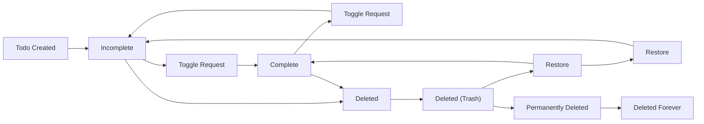
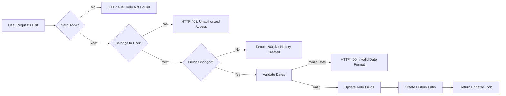
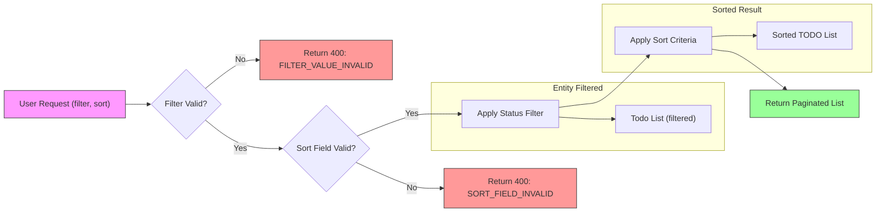

# Multi-User Todo Application Requirements Specification

## Service Overview

TodoApp is a private, secure, multi-user to-do application designed for individuals who need a personal task management system with strict data isolation. Unlike collaborative task tools, TodoApp operates on the principle that **each user's data is completely private and inaccessible to all others**, even within the same system instance. This is not a group productivity tool — it is a personal, private, and secure to-do manager with enterprise-grade data isolation.

The system serves one primary user group: **authenticated users** who create, manage, and track their own personal tasks. No guest accounts, no administrators, and no shared data exist within the system.

The scope includes:
- User account lifecycle (registration, login, password reset, account deletion)
- Profile management (display name edit)
- Todo lifecycle (creation, viewing, editing, completion, soft-deletion, restoration, permanent deletion)
- Edit history tracking
- Trash management
- Filtering and sorting of todo lists
- API-mediated data access with strict ownership validation

The system deliberately excludes:
- User-to-user interaction or visibility
- Shared folders or groups
- Public or semi-public tasks
- Commenting, tagging, or collaboration features
- Administrative dashboards or user management

## User Actors and Authentication

THE system SHALL have exactly one user actor type: member.

THE member actor SHALL be an authenticated user who can:
- Create, view, edit, complete, and delete their own todos
- View and manage their own edit history
- Edit their display name profile
- View and manage their own trash
- Sign up, log in, change password, and delete their account

THE member actor SHALL NOT be able to:
- View, access, or interact with any data belonging to other users
- Access administrative functions or system configuration
- Create guest accounts or delegate access
- Modify system-wide settings or global configurations

THE system SHALL enforce strict data isolation at both API and database levels so that member actors can ONLY query and modify records that belong to their own userId.

WHEN a user attempts to sign up, THE system SHALL accept a valid email address and password policy-compliant secret.

WHEN a user attempts to log in, THE system SHALL validate the provided email and password against the stored hashed credentials.

WHILE a user is authenticated, THE system SHALL maintain a secure, server-side session with an associated JWT token.

IF the user provides invalid credentials, THEN THE system SHALL return HTTP 401 with error code AUTH_INVALID_CREDENTIALS.

IF the user attempts to sign up with an email that already exists, THEN THE system SHALL return HTTP 409 with error code AUTH_EMAIL_ALREADY_USED.

WHEN a user successfully logs in, THE system SHALL generate a JWT access token and refresh token.

WHEN a user requests to change their password, THE system SHALL require current password verification and enforce new password policy.

WHEN a user deletes their account, THE system SHALL immediately revoke all active tokens and permanently delete all associated user data including todos and edit history.

WHEN generating a JWT access token, THE system SHALL include the following payload fields:
- sub: string (userId as UUIDv4)
- role: string (always "member")
- permissions: Array<string> (always ["read:todos", "write:todos", "delete:todos", "read:profile", "write:profile", "delete:profile", "read:history", "write:history", "read:trash", "write:trash"])
- iat: number (UNIX timestamp of issuance)
- exp: number (UNIX timestamp of expiration, 20 minutes after iat)

WHEN generating a refresh token, THE system SHALL be a separate, cryptographically secure string stored server-side with a 30-day expiration.

WHILE a user is actively using the system, THE system SHALL extend access token validity to 20 minutes.

WHEN a user's access token expires, THE system SHALL allow refreshing the token using a valid refresh token.

WHEN a refresh token is used, THE system SHALL issue a new access token and a new refresh token (rotating refresh token).

WHILE a user is inactive for more than 30 days, THEN THE system SHALL expire the refresh token and require re-authentication.

WHEN a user logs out, THEN THE system SHALL immediately revoke the current refresh token and mark it as invalid.

WHEN a user deletes their account, THEN THE system SHALL permanently delete all refresh tokens associated with that userId.

THE system SHALL store refresh tokens in a secure, encrypted database table linked to userId.

WHEN a refresh token is used, THE system SHALL rotate it - invalidating the old one and generating a new one.

WHEN a refresh token is not found or is marked invalid, THEN THE system SHALL require the user to log in again.

THE system SHALL invalidate all refresh tokens when a user changes their password.

THE system SHALL invalidate all refresh tokens when a user deletes their account.

THE system SHALL use a cryptographically secure 256-bit HS256 secret key for JWT signing.

THE system SHALL store the JWT secret key as an environment variable (JWT_SECRET) on the server.

THE system SHALL NEVER commit or log the JWT secret key in source code, logs, or version control.

WHEN the JWT secret key is rotated, THE system SHALL support backward compatibility for active tokens for up to 1 hour.

WHILE a user makes any API request, THE system SHALL validate that all requested resources belong to the userId in the JWT payload.

IF a user attempts to access a todo, edit history entry, or trash item that does not belong to their userId, THEN THE system SHALL return HTTP 404 NOT FOUND - not any form of 403.

THE system SHALL implement row-level security at the database level so that all queries to todos, edit history, and trash tables use userId as an implicit filter.

WHERE a database query does not contain userId in the WHERE clause, THEN THE system SHALL reject the request as a potential security vulnerability.

THE system SHALL NEVER expose userId in API responses unless it is the authenticated user's own userId.

THE system SHALL ensure all API endpoints automatically enforce data isolation as a core requirement - no exceptions.

## User Profile Management

WHEN a user successfully registers with email and password, THE system SHALL create a default profile with:
- A display name initialized to the user's email address (before the @ symbol)
- No additional profile fields populated
- Creation timestamp recorded
- No profile data shared with other users

WHILE a profile exists, THE system SHALL ensure the user's display name is never automatically overwritten unless explicitly edited by the user.

WHEN a user submits a new display name, THE system SHALL update the profile display name.

THE user SHALL be allowed to edit their display name at any time after account creation.

IF the submitted display name is empty, THE system SHALL reject the update and return validation error.

IF the submitted display name exceeds 100 characters, THE system SHALL reject the update and return validation error.

IF the submitted display name contains only whitespace characters, THE system SHALL reject the update and return validation error.

WHEN a display name is successfully updated, THE system SHALL record the edit in the user's audit log with:
- Timestamp of change
- Original display name value
- New display name value

WHILE a profile is active, THE system SHALL prevent any automatic or system-generated display name changes unless initiated by the user themselves.

THE TodoApp SHALL ensure that user profile information, including display name, is never visible to any other user.

WHEN any endpoint is accessed, THE system SHALL enforce strict data isolation such that:
- No profile data from one user can be retrieved by another user
- No API response includes profile information belonging to users other than the authenticated requester
- No search, filter, or listing function returns profile information beyond the requester's own data

IF any request attempts to access another user's profile data, THE system SHALL return HTTP 403 Forbidden without revealing that the requested resource exists.

WHERE profile data is stored, THE system SHALL ensure that data isolation is enforced at the database query layer, not merely at the application layer.

WHEN a user requests their own profile, THE system SHALL return a response containing:
- User ID (internal, immutable)
- Display name (editable)
- Account creation timestamp
- Last profile update timestamp

THE user SHALL be able to view their profile information at any time through their account settings interface.

WHEN a profile is requested, THE system SHALL NOT return email address, password hash, or any authentication credentials.

THE system SHALL return profile data only to the authenticated user matching the requested user ID.

WHEN a display name is submitted for update, THE system SHALL validate:
- The input is not null
- The input is a non-empty string
- The input contains at least one non-whitespace character
- The input length is between 1 and 100 characters inclusive
- The input does not contain forbidden characters: <, >, &, ", ', \, /, *, ?, |, :, 

IF validation fails, THE system SHALL return HTTP 400 Bad Request with error code PROFILE_INVALID_DISPLAY_NAME and a user-friendly message that does not reveal system implementation details.

THE system SHALL NOT allow the display name to ever be set to an empty string, null, or default value that matches another user's display name.

WHEN a display name is submitted, THE system SHALL trim leading and trailing whitespace before validation.

THE system SHALL maintain case sensitivity in display names to preserve user intent.

WHERE profile updates fail due to validation, THE system SHALL NOT modify the existing profile data under any circumstance.

## Todo Creation Requirements

WHEN a user submits a new todo request, THE system SHALL validate input fields, assign default values, and create a persisted todo record with a unique identifier linked to the authenticated user.

THE title of a todo SHALL be a non-empty string with a minimum length of 1 character and a maximum length of 255 characters.

WHEN a todo creation request is submitted with a null, empty, or whitespace-only title, THE system SHALL reject the request with HTTP 400 Bad Request and error code TODO_TITLE_MISSING.

WHEN a todo title exceeds 255 characters, THE system SHALL truncate it to 255 characters and log the truncation event for audit purposes.

THE description of a todo SHALL be an optional string with a maximum length of 10,000 characters.

IF a description is not provided in the request, THE system SHALL store it as a null value in the database.

IF a description exceeds 10,000 characters, THE system SHALL reject the request with HTTP 400 Bad Request and error code TODO_DESCRIPTION_TOO_LONG.

WHEN a start date is provided, THE system SHALL validate it is in ISO 8601 date or datetime format (YYYY-MM-DD or YYYY-MM-DDTHH:mm:ss.sssZ).

WHEN a due date is provided, THE system SHALL validate it is in ISO 8601 date or datetime format (YYYY-MM-DD or YYYY-MM-DDTHH:mm:ss.sssZ).

IF a start date is provided but is invalid, THE system SHALL reject the request with HTTP 400 Bad Request and error code TODO_START_DATE_INVALID.

IF a due date is provided but is invalid, THE system SHALL reject the request with HTTP 400 Bad Request and error code TODO_DUE_DATE_INVALID.

WHEN both start date and due date are provided, THE system SHALL validate that the due date is not earlier than the start date.

IF the due date is earlier than the start date, THE system SHALL reject the request with HTTP 400 Bad Request and error code TODO_DUE_DATE_BEFORE_START.

IF a date field is provided with invalid timezone information, THE system SHALL reject the request with HTTP 400 Bad Request and error code TODO_DATE_TIMEZONE_INVALID.

WHEN a new todo is created, THE system SHALL set the completion status to false (incomplete) by default, regardless of any provided value.

IF a completion status field is included in the creation request, THE system SHALL ignore it and always use false as the initial state.

WHEN a todo creation request is submitted, THE system SHALL perform the following validations in sequence:

1. Authenticate the user session
2. Validate user has permission to create todos (always yes for authenticated users)
3. Validate title exists and is not empty
4. Validate description length (if provided)
5. Validate start date format and semantics (if provided)
6. Validate due date format and semantics (if provided)
7. Validate due date is not before start date (if both provided)
8. Validate that no additional unrecognized fields are included in the request

IF any validation fails, THE system SHALL:
- Return HTTP 400 Bad Request status
- Include an error object in the response with a machine-readable code (e.g., TODO_TITLE_MISSING)
- Include a human-readable message in English
- Not create any todo record

WHERE the request contains unrecognized fields (e.g., "priority", "category", "tags"), THE system SHALL reject the request with HTTP 400 Bad Request and error code TODO_INVALID_FIELD.

WHEN a todo is successfully created, THE system SHALL:
- Generate a UUID as the todo's id
- Set createdAt to the current server time (Asia/Seoul timezone)
- Set updatedAt to the same value as createdAt
- Set completed to false
- Set userId to the authenticated user's ID
- Set description to null if not provided
- Set startDate and dueDate to null if not provided
- Return HTTP 201 Created status
- Return the complete created todo object in the response body including all fields

WHEN the database fails to persist the todo record, THE system SHALL return HTTP 503 Service Unavailable with error code TODO_PERSISTENCE_FAILURE.

THE system SHALL ensure that no todo can be created with a userId different from the authenticated user's ID.

IF the authentication token contains a userId different from the userId field in the request body, THE system SHALL reject the request with HTTP 403 Forbidden and error code TODO_USER_MISMATCH.

WHILE a todo record is being created, THE system SHALL enforce strict data isolation: todos are only writable by the authenticated owner and cannot be associated with any other user.

## Todo List Retrieval Requirements

WHEN a user requests their todo list, THE system SHALL retrieve all todos belonging to that user with the specified pagination, filtering, and sorting parameters.

WHEN a user retrieves their todo list, THE system SHALL default to a page size of 20 todos if no page size is specified.

WHERE the user specifies a page size, THE system SHALL honor page sizes between 1 and 100 (inclusive).

WHEN a user requests a specific page number, THE system SHALL return the corresponding page of todos based on the specified page size.

IF the requested page number exceeds the total number of available pages, THEN THE system SHALL return an empty array with page metadata indicating the total number of pages available.

WHERE the page number is less than 1, THEN THE system SHALL return the first page of results.

WHEN a user applies a completion status filter, THE system SHALL filter todos according to the specified filter value.

WHEN the filter value is "all", THE system SHALL return all todos regardless of completion status.

WHEN the filter value is "complete", THE system SHALL return only todos with completion status = true.

WHEN the filter value is "incomplete", THE system SHALL return only todos with completion status = false.

IF the filter parameter is empty or not provided, THEN THE system SHALL use "all" as the default filter value.

WHEN a user specifies a sort field, THE system SHALL sort todos according to the specified field.

THE system SHALL support the following sort fields:
- "createdAt" - Creation date of the todo
- "startDate" - Start date of the todo
- "dueDate" - Due date of the todo

WHEN the sort field is "createdAt", THE system SHALL sort by the todo's creation timestamp.

WHEN the sort field is "startDate", THE system SHALL sort by the todo's start date.

WHEN the sort field is "dueDate", THE system SHALL sort by the todo's due date.

WHEN a sort order is specified, THE system SHALL sort in ascending or descending order according to the specified value.

THE system SHALL support the following sort orders:
- "asc" - Ascending order (oldest/earliest first)
- "desc" - Descending order (newest/latest first)

IF no sort order is specified, THE system SHALL use "desc" as the default sort order.

WHILE sorting by "startDate", WHERE a todo has no start date defined, THE system SHALL treat that todo as having the latest possible start date (placing it at the end of ascending sort and beginning of descending sort).

WHILE sorting by "dueDate", WHERE a todo has no due date defined, THE system SHALL treat that todo as having the latest possible due date (placing it at the end of ascending sort and beginning of descending sort).

WHEN a user successfully retrieves their todo list, THE system SHALL return a structured response containing:
- An array of todo objects with complete details for each item
- Pagination metadata including current page, page size, total count, and total pages
- The applied filter value
- The applied sort field and sort order

THE todo object MUST include the following fields:
- id (string)
- title (string)
- description (string | null)
- isComplete (boolean)
- startDate (string | null) - ISO 8601 format
- dueDate (string | null) - ISO 8601 format
- createdAt (string) - ISO 8601 format
- updatedAt (string) - ISO 8601 format

THE pagination metadata object MUST include the following fields:
- currentPage (number)
- pageSize (number)
- totalCount (number)
- totalPages (number)

THE response object MUST include the following fields:
- todos (array of todo objects)
- pagination (pagination metadata object)
- filters (object with completionStatus property)
- sort (object with field and order properties)

THE filter object MUST contain:
- completionStatus (string)

THE sort object MUST contain:
- field (string)
- order (string)

WHEN a user's todo list is empty, THE system SHALL return an empty todos array with pagination metadata showing 0 total count and 0 total pages.

THE todo list retrieval system SHALL maintain consistency with all other todo operations:

WHERE a todo was created using the create-todo specification, THE system SHALL include that todo in list retrieval results according to the user's filters and sorting.

WHERE a todo's completion status was toggled using the toggle-todo specification, THE system SHALL reflect the updated status immediately in list retrieval results.

WHERE a todo was edited using the edit-todo specification, THE system SHALL include the updated title, description, startDate, and dueDate in list retrieval results.

WHERE a todo was deleted using the delete-todo specification, THE system SHALL exclude it from normal list retrieval results but include it in trash view.

WHERE a todo was restored from trash using the trash specification, THE system SHALL include it in normal list retrieval results immediately.

WHEN filtering by completion status, THE system SHALL consider only the current completion status of each todo (as defined by the toggle-todo specification), ignoring historical states.

WHEN sorting by date fields, THE system SHALL use the current values of startDate and dueDate (as defined by the edit-todo specification), not historical values from edit history.

THE system SHALL return todo lists within 500 milliseconds for queries with typical parameters (page size 20, no complex filtering).

THE system SHALL maintain response times under 1 second even with maximum pagination (100 items per page) and when users have large numbers of todos.

WHILE sorting by creation date with 10,000+ todos, THE system SHALL maintain response times under 2 seconds.

WHILE applying complex filters and sorting combinations, THE system SHALL ensure that database queries are optimized to use appropriate indexes.

IF the user ID in the request does not correspond to any existing user, THEN THE system SHALL return a 401 Unauthorized response, even if the request contains valid pagination, filtering, or sorting parameters.

IF the user attempts to use an unsupported filter value (e.g., "pending"), THEN THE system SHALL treat it as "all" and log a warning for audit purposes.

IF the user attempts to use an unsupported sort field (e.g., "priority"), THEN THE system SHALL use "createdAt" as the default sort field and log a warning for audit purposes.

IF the user attempts to use an unsupported sort order (e.g., "reverse"), THEN THE system SHALL use "desc" as the default sort order and log a warning for audit purposes.

IF the page size parameter is not a number, THE system SHALL use the default page size of 20 and log a warning for audit purposes.

IF the page number parameter is not a positive integer, THE system SHALL use page 1 and log a warning for audit purposes.

THE system SHALL ensure that each retrieved todo belongs exclusively to the authenticated user requesting the data.

IF a user attempts to access another user's todos through any means (including direct database queries or API manipulations), THEN THE system SHALL return a 403 Forbidden response.

WHEN retrieving a todo list, THE system SHALL verify the user's authentication token and validate that all todos returned match the authenticated user's ID.

WHEN implementing the database query for todo list retrieval, THE system SHALL use user ID as a mandatory WHERE clause condition, and NEVER include todos unrelated to the authenticated user.

IF the database fails to return results due to connection issues, THEN THE system SHALL return a 503 Service Unavailable response with appropriate error message.

IF an internal error occurs during query execution, THEN THE system SHALL return a 500 Internal Server Error response with a generic error message (no technical details).

IF a user provides malformed JSON in the request body, THEN THE system SHALL return a 400 Bad Request response.

IF a user provides non-integer values for page or page size parameters, THEN THE system SHALL return a 400 Bad Request response with a clear error message indicating expected data types.

IF the user has exceeded the maximum number of todos (100,000), THEN THE system SHALL return a 429 Too Many Requests response with instructions to use more specific filters.

## Todo Completion Toggle Requirements

WHEN a user requests to toggle a todo's completion status, THE system SHALL reverse the current completion status of the todo.

THE system SHALL accept exactly one action: "toggle" for completion status change.

WHEN the todo is currently incomplete, THE system SHALL mark it as complete.

WHEN the todo is currently complete, THE system SHALL mark it as incomplete.

THE system SHALL NOT accept any other state values (e.g., "complete", "incomplete") for this endpoint.

WHILE a todo exists in the system, THE system SHALL maintain exactly one of two possible states: complete or incomplete.

THE system SHALL NOT allow any intermediate, ambiguous, or partial completion states.

WHEN a todo is first created, THE system SHALL initialize its completion status as incomplete.

WHEN a todo is restored from trash, THE system SHALL restore its original completion status as it was at the time of deletion.

IF a todo has never been toggled since creation, THEN THE system SHALL consider it to be in its initial incomplete state.

WHEN a toggle request is received, THE system SHALL perform the following operations as a single, atomic transaction:
- Read current completion status
- Invert the status value
- Update the todo record in the database
- Preserve the original creation timestamp
- Log the toggle event in audit trail

THE system SHALL NOT allow concurrent toggle operations on the same todo.

WHEN a toggle operation fails at any stage, THE system SHALL roll back the entire operation and return an error.

WHEN a todo is toggled, THE system SHALL record an audit log entry with the following fields:
- timestamp (ISO 8601)
- userId (of the actor performing the toggle)
- todoId
- previousStatus ("complete" or "incomplete")
- newStatus ("complete" or "incomplete")
- operationType ("toggle")

THE system SHALL store toggle events separately from edit history entries.

WHILE a todo has an edit history, THE system SHALL maintain separate audit trails for toggle events and edit events.

WHEN a toggle operation succeeds, THE system SHALL return HTTP 200 OK with the following JSON body:

{
  "id": "string (UUID)",
  "title": "string",
  "description": "string | null",
  "startAt": "string (ISO 8601) | null",
  "dueAt": "string (ISO 8601) | null",
  "completed": "boolean",
  "createdAt": "string (ISO 8601)",
  "updatedAt": "string (ISO 8601)",
  "deletedAt": "string (ISO 8601) | null"
}

WHEN a todo does not exist or belongs to another user, THE system SHALL return HTTP 404 Not Found.

WHEN the requester is not authenticated, THE system SHALL return HTTP 401 Unauthorized.

WHERE a todo has been edited multiple times in its history, THE system SHALL preserve the original value of the completion status at the moment of creation even when restoring from edit history rollback.

WHILE a todo is in trash, THE system SHALL preserve its completion status exactly as it was at the moment of deletion.

WHEN a todo is restored from trash, THE system SHALL restore both its content and its completion status precisely as recorded at deletion time.

IF the requesting user ID does not match the owner of the todo, THEN THE system SHALL return HTTP 404 Not Found.

WHILE the system maintains edit history, THE system SHALL NOT expose completion status change events to users other than the todo's owner.

THE system SHALL NOT allow any external system or API to modify completion status except via the authenticated user's toggle request.

IF the todo ID provided in the request is malformed (not a valid UUID), THEN THE system SHALL return HTTP 400 Bad Request.

IF the todo ID exists but is associated with a different user, THEN THE system SHALL return HTTP 404 Not Found (to prevent enumeration attacks).

WHEN a user toggles a todo that was previously permanently deleted, THE system SHALL return HTTP 404 Not Found.

WHEN the todo's completion status is already in sync with the requested toggle, THE system SHALL still process the toggle and return the updated state.

THE system SHALL preserve the original creation timestamp (createdAt) of the todo regardless of how many times status is toggled.

WHEN toggling a completed todo to incomplete, THE system SHALL NOT reset the createdAt field or any other original metadata fields.

THE system SHALL NOT modify updatedAt timestamp for toggle operations

THE system SHALL populate updatedAt only when other fields (title, description, dates) are edited.

## Edit Todo Requirements

Users may edit the following fields of any todo they own:

- Title
- Description
- Start date
- Due date

Editing any of these fields triggers the creation of a new edit history entry. Users cannot edit the todo's completion status, creation timestamp, deletion status, or ID through the edit operation. These properties are managed exclusively through other dedicated operations (toggle-todo, delete-todo).

The edit operation is designed to capture intentional changes to a todo's metadata while preserving immutability of its core lifecycle properties.

WHEN a user submits an edit to a todo:

1. THE system SHALL validate that the todo exists and belongs to the requesting user
2. THE system SHALL validate that the todo is not permanently deleted
3. THE system SHALL validate that all provided fields conform to their defined data types and formats
4. THE system SHALL compare the submitted values to the current values stored in the database
5. THE system SHALL create an edit history entry only if at least one field has changed
6. THE system SHALL update the todo with the new values
7. THE system SHALL return the updated todo object with the modified fields
8. THE system SHALL NOT allow editing of a todo that has been permanently deleted from trash

The edit process must be atomic and transactional to prevent partial updates or data inconsistencies.

Each time a todo is edited and at least one field has changed, THE system SHALL create a new edit history entry with the following structure:

- timestamp: ISO 8601 datetime of the edit
- title: the previous value of the title field (or null if unchanged)
- description: the previous value of the description field (or null if unchanged)
- startDate: the previous value of the start date field (or null if unchanged)
- dueDate: the previous value of the due date field (or null if unchanged)
- editorId: the ID of the user who performed the edit

History entries are stored in chronological order with the most recent entry appearing first in retrieval queries.

THE system SHALL detect changes to each field independently and record the previous value only if it differs from the submitted value.

Changes SHALL be detected as follows:

- Title: Changes when the submitted string differs from the current string
- Description: Changes when the submitted string differs from the current string
- Start date: Changes when:
  - A date is submitted where none existed before
  - A date is submitted that differs from the existing date
  - A null value is submitted where a date existed before
- Due date: Changes when:
  - A date is submitted where none existed before
  - A date is submitted that differs from the existing date
  - A null value is submitted where a date existed before

All comparisons SHALL be case-sensitive for string fields and exact for date fields.

Each edit history entry represents one version of the todo state. The total number of history entries for any single todo SHALL be limited only by storage constraints, with no artificial cap applied.

WHEN a todo is restored from trash, its complete edit history SHALL be restored with it, preserving the chronological sequence of all edits.

WHEN a todo is permanently deleted from trash, ALL associated edit history entries SHALL be deleted simultaneously in a single atomic transaction.

THE system SHALL ensure that the edit history is never exposed to any user other than the owner of the todo.

WHEN a todo is marked as complete, THE system SHALL allow the user to edit its title, description, start date, and due date.

WHEN a todo is edited while complete, THE system SHALL preserve its complete status and SHALL NOT automatically mark it as incomplete.

WHEN a user submits a date field in an invalid format, THE system SHALL reject the edit with HTTP 400 and an error code of EDIT_INVALID_DATE_FORMAT.

WHEN a user submits a date field with a value prior to the year 1900, THE system SHALL reject the edit with HTTP 400 and an error code of EDIT_INVALID_DATE_RANGE.

WHEN a user submits a date field with a value beyond the year 2100, THE system SHALL reject the edit with HTTP 400 and an error code of EDIT_INVALID_DATE_RANGE.

WHILE a todo has no due date set, THE system SHALL continue to store a null value for the dueDate field, and it SHALL be treated as "unset" in all sorting and filtering operations.

IF a user requests to edit a todo that does not belong to them, THEN THE system SHALL respond with HTTP 403 and error code: EDIT_UNAUTHORIZED_ACCESS.

IF a user requests to edit a todo with an ID that does not exist in the database, THEN THE system SHALL respond with HTTP 404 and error code: EDIT_TODO_NOT_FOUND.

IF a user submits a date field with an invalid ISO 8601 format, THEN THE system SHALL respond with HTTP 400 and error code: EDIT_INVALID_DATE_FORMAT.

IF a user submits a date field with a value outside the valid range (1900-2100), THEN THE system SHALL respond with HTTP 400 and error code: EDIT_INVALID_DATE_RANGE.

IF all submitted values are identical to the current values of the todo, THEN THE system SHALL return HTTP 200 with the current todo data and SHALL NOT create a history entry.

THE system SHALL update todo data and create an edit history entry in under 200 milliseconds for 99% of requests under normal load conditions.

WHEN editing a todo with a history of 1000+ entries, THE system SHALL still respond within 500 milliseconds.

WHEN querying the edit history of a todo with 1000+ entries, THE system SHALL return the first page (25 entries) within 300 milliseconds.

THE system SHALL ensure that all edits, history retrievals, and validation checks are scoped to the authenticated user's ID.

WHEN a request is made to edit a todo, THE system SHALL authenticate the user and verify that the todo's userId field matches the authenticated user's ID.

IF no valid authentication token is provided, THEN THE system SHALL respond with HTTP 401 and error code: AUTH_MISSING_TOKEN.

IF the authentication token is invalid, expired, or tampered with, THEN THE system SHALL respond with HTTP 401 and error code: AUTH_INVALID_TOKEN.

WHERE a user edits a todo, THE system SHALL guarantee complete isolation of data.

THE system SHALL NEVER allow access to another user's todos through any indirect method, including:
- Guessing todo IDs
- Manipulating API parameters
- Querying shared resources
- Accessing database directly

THE system SHALL enforce data isolation at both the application layer and the database query layer.

THIS DOCUMENT DEPENDS ON:
- The soft delete mechanism defined in [Delete Todo](./08-delete-todo.md)
- The edit history structure defined in [Edit Todo](./07-edit-todo.md) to ensure restoration preserves full fidelity
- The fields specified in [Create Todo](./04-create-todo.md) to ensure restored todos re-establish exact original state

## Soft Delete Process

WHEN a user requests deletion of a todo item, THE system SHALL mark the todo as deleted by setting the `isDeleted` boolean flag to `true` while retaining all data in the database.

THE system SHALL NOT physically remove any todo records or associated edit history entries from the database.

WHEN a todo is soft-deleted, THE system SHALL preserve:
- The original todo title
- The original description
- The original start date (if set)
- The original due date (if set)
- The original completion status
- The original creation timestamp
- All edit history entries associated with the todo
- The deletion timestamp

WHILE the todo is soft-deleted, THE system SHALL continue to maintain referential integrity for all relationships and audit trails.

WHEN a user retrieves their list of todos, THE system SHALL filter out all todos where `isDeleted` equals `true`.

THE system SHALL NOT include any soft-deleted todos in response to any request to the main todo list endpoint.

IF a user attempts to access a specific todo by ID and the todo is soft-deleted, THE system SHALL return HTTP 404 Not Found with error code "TODO_NOT_FOUND".

WHERE the `isDeleted` flag exists in the todo model, THE system SHALL treat it as a hidden state, never exposing it in API responses to clients.

## Trash Feature Specification

### Access Control
WHEN a user accesses the trash interface, THE system SHALL only display todos that were deleted by that specific user.
WHILE a user is viewing the trash, THE system SHALL NOT display any todos belonging to other users, even if those todos were originally shared or copied.

### Data Display
WHEN displaying a todo in the trash list, THE system SHALL show:
- Title of the todo
- Completion status (complete/incomplete) at time of deletion
- Date when the todo was deleted
- Start date (if set at time of deletion)
- Due date (if set at time of deletion)

### Pagination
WHEN the trash list contains more than 20 todos, THE system SHALL paginate the results with a default page size of 20 items and allow users to navigate to subsequent pages.

### Sorting
WHILE a user is viewing the trash list, THE system SHALL default to sorting todos by deletion date (newest first).

WHEN sorting by deletion date, THE system SHALL show most recently deleted todos at the top.

WHEN retrieving the trash count, THE system SHALL return the total number of soft-deleted todos belonging to the authenticated user.

### Restoration Process
WHEN a user selects a todo in the trash and initiates restoration, THE system SHALL restore the todo to its original active state.

WHEN a todo is restored from trash, THE system SHALL restore:
- Title (exact value at deletion)
- Description (exact value at deletion)
- Start date (exact value at deletion, or null if unset at deletion)
- Due date (exact value at deletion, or null if unset at deletion)
- Completion status (exact value at deletion)
- Creation timestamp (original creation timestamp)
- Edit history (all entries preserved intact)

WHEN a todo is restored from trash, THE system SHALL return it to the active todo list and remove it from the trash list.
WHEN restored, THE system SHALL NOT preserve the restoration timestamp as a separate field.

### Permanent Deletion
WHEN a user selects a todo in the trash and permanently deletes it, THE system SHALL remove the todo and all associated data from the system.

WHEN permanent deletion is triggered, THE system SHALL:
- Remove the todo from the database
- Remove all entries in the edit history associated with that todo
- Remove all audit logs tied exclusively to that todo
- Release all storage resources associated with the todo record

IF a todo has been permanently deleted, THEN THE system SHALL NOT allow restoration under any circumstances.
IF a user attempts to restore a permanently deleted todo, THEN THE system SHALL return HTTP 404 with error code TODO_NOT_FOUND.

### History Deletion on Permanent Delete
WHEN a todo is permanently deleted from trash, THE system SHALL automatically and permanently delete all associated edit history entries.

IF a todo has 15 edit history entries, THEN WHEN permanently deleted, THE system SHALL delete all 15 entries, not just the most recent.

WHILE removing edit history, THE system SHALL ensure that no metadata, timestamps, or field values from those editions remain accessible, traceable, or recoverable.

### Data Retention
WHILE a todo remains in trash, THE system SHALL retain all data and edit history indefinitely until permanent deletion is requested.

THE system SHALL NOT auto-purge soft-deleted todos based on time thresholds or usage patterns.

### Purge Requirements
IF a todo is permanently deleted from trash, THEN THE system SHALL guarantee that no trace of the todo, its content, or its edit history can be recovered through any means, including database backups or audit logs.

### Edge Case Handling
IF a user restores a todo, then later deletes it again, THEN THE system SHALL treat this as a new deletion event with a new deletion timestamp.

WHEN applying a status filter (e.g., "only incomplete"), THE system SHALL apply this filter to the active todo list as usual and SHALL NOT filter the trash list by completion status.

WHEN a user attempts to permanently delete a todo while another user is viewing the trash list, THEN THE system SHALL ensure that the pending restorable state is not affected and the API response is consistent with user permissions.

### Data Integrity
WHEN restoring or permanently deleting a todo, THE system SHALL guarantee that the operation is atomic, ensuring file system and database state remain consistent.

WHEN deleting a todo permanently, THE system SHALL ensure no PII, timestamps, edit values, or metadata related to the todo remain in any database, cache, or backup.

## Filtering and Sorting Requirements

THE todo list SHALL support three status filters:
- "all" - shows all todos regardless of completion status
- "complete" - shows only todos with completion status = true
- "incomplete" - shows only todos with completion status = false

WHEN a user applies a status filter, THE system SHALL return only todos matching the selected status.

WHERE filter = "complete", THE system SHALL exclude todos with completion status = false.

WHERE filter = "incomplete", THE system SHALL exclude todos with completion status = true.

WHEN no filter is specified, THE system SHALL default to "all".

THE system SHALL support sorting by four fields:
- "createdAt" - when the todo was originally created
- "startDate" - the start date field set by the user
- "dueDate" - the due date field set by the user
- "updatedAt" - when the todo was last edited

WHEN sorting by "createdAt", THE system SHALL arrange todos by creation timestamp.

WHEN sorting by "startDate", THE system SHALL arrange todos by start date field value.

WHEN sorting by "dueDate", THE system SHALL arrange todos by due date field value.

WHEN sorting by "updatedAt", THE system SHALL arrange todos by last edit timestamp.

WHEN no sort field is specified, THE system SHALL sort by "createdAt" in descending order (newest first).

WHEN no sort direction is specified, THE system SHALL default to descending order (newest first, latest first).

WHILE sorting by "startDate", THE system SHALL place todos with null or undefined start date at the end of the list.

WHILE sorting by "dueDate", THE system SHALL place todos with null or undefined due date at the end of the list.

WHEN todos have identical values for the sorting field, THE system SHALL use "createdAt" as a secondary sort criterion in descending order to ensure deterministic ordering.

WHEN multiple sort criteria are applied, THE system SHALL execute them in the order specified by the user.

THE system SHALL NOT apply any automatic priority override to sorting fields.

WHEN both a status filter and a sort direction are applied, THE system SHALL evaluate the filter first, then apply sorting to the filtered result set.

THE system SHALL NOT apply sorting before filtering - filters must reduce the dataset first.

WHEN a user applies multiple sort criteria (e.g., "sort by dueDate then createdAt"), THE system SHALL sort primarily by the first field, then use subsequent fields as tiebreakers.

WHEN a sort field contains identical values across multiple todos, THE system SHALL break ties using the next specified sort field in sequence.

WHEN no further sort fields remain and tie exists, THE system SHALL maintain stable sorting using todo ID order to preserve consistent pagination.

WHEN sorting by "updatedAt" and "createdAt", THE system SHALL treat both fields as absolute timestamps with millisecond precision.

FOR todos without any date field set (no startDate, no dueDate), THE system SHALL display the date field as empty in responses, but sort them as null values during filtering and sorting operations.

WHEN a user toggles between sorting directions (ascending/descending), THE system SHALL maintain the same sort field and only reverse the order.

THE system SHALL NOT allow sorting by fields that are not in the permitted list: "createdAt", "startDate", "dueDate", "updatedAt".

IF a user requests an invalid sort field, THE system SHALL return HTTP 400 with error code SORT_FIELD_INVALID.

IF a user requests an invalid filter value, THE system SHALL return HTTP 400 with error code FILTER_VALUE_INVALID.

WHEN restoring a todo from trash, THE system SHALL preserve its original "createdAt" timestamp.

WHEN editing a todo, THE system SHALL update "updatedAt" but never modify "createdAt".

WHEN creating a todo, THE system SHALL assign "createdAt" at timestamp of creation and "updatedAt" to the same value.

ISSUES:
- When two todos have identical createdAt, updatedAt, startDate, and dueDate, the order between them must remain stable across requests

HOW TO RESOLVE:
- Use internal unique todo ID as final tiebreaker to ensure deterministic results

LOOP:
- Sorting is always applied after filtering, never before
- Safe defaults: "createdAt" descending is always the fallback
- Missing dates are always sorted last, never first

## Privacy

Privacy is the foundational and non-negotiable principle of TodoApp.

**ALL** user data is owned exclusively by the user who created it. Data isolation is enforced:
- At the API layer: every request must include and validate a user ID; no data from another user is ever returned.
- At the database layer: all queries include a WHERE clause matching the authenticated user ID; no queries can bypass this filter.
- At the application layer: no shared caches, no user-identifiable metadata leaked in responses, no audit logs exposing cross-user information.

Users cannot view others' profiles. Users cannot view others' todos, in main list or trash. Users cannot view others' edit history. No export, import, or data-sharing features exist or will be added.

Fault tolerance and logging are designed to preserve privacy: error messages do not reveal existence or non-existence of another user's data. System diagnostics never expose user identifiers or data relationships across accounts.