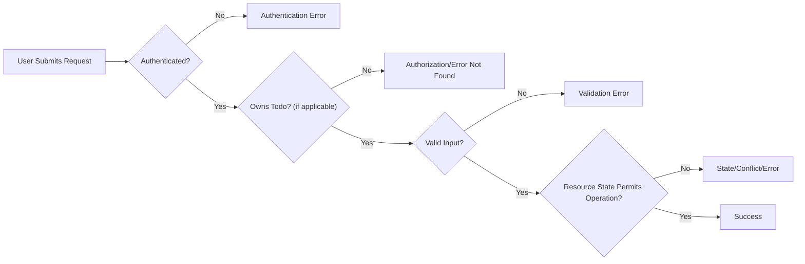

# Error Handling and Edge Case Requirements for Todo List Application

## Introduction and Scope
Effective error and edge case handling is essential for delivering a predictable, user-friendly, and robust Todo list application. This specification outlines all critical error scenarios and edge cases the backend must address, using only the minimum functionality necessary for a reliable experience. All requirements are specified in EARS format, ensuring precision and clarity for backend implementation.

## Authentication and Authorization Error Handling
- WHEN any protected API endpoint is accessed by a non-authenticated user, THE system SHALL return an error with code "authentication_failed" and status 401, explaining that authentication is required to proceed.
- WHEN an authenticated user attempts an operation (retrieve, update, delete) on a todo item not belonging to them, THE system SHALL deny access with code "authorization_denied", status 403, and a message that clearly states the user lacks permission for the requested resource.

## Input Validation Error Cases
- WHEN a user submits a new todo with missing mandatory fields such as title, THE system SHALL return an error with code "validation_failed", status 400, and an explicit message indicating which fields require correction.
- WHEN a todo’s title exceeds the business-imposed character limit, THE system SHALL return a validation error specifying the allowed and provided lengths.
- WHEN any input field (due date, completion status, etc.) is of the wrong type or malformed (e.g., non-boolean completion status), THE system SHALL respond with a validation error, referencing the specific invalid field and its required format or type.

## Resource Not Found Scenarios
- WHEN a user requests, updates, or deletes a todo item using a non-existent or unauthorized ID, THE system SHALL return a status 404 error with code "resource_not_found", stating the resource either does not exist or is inaccessible to the requesting user.
- IF a requested resource has been previously deleted, THEN THE system SHALL return a message confirming permanent removal and the unavailability of the todo item.
- WHEN a user attempts to delete a non-existent or already deleted todo, THE system SHALL return a "resource_not_found" response without exposing historical data.

## State Transition and Idempotency
- IF a user attempts to mark an already completed todo as complete, THEN THE system SHALL respond with a successful, no-op message or clearly indicate the item is already completed; this SHALL NOT cause a server error.
- IF an operation is attempted on a deleted todo item, THEN THE system SHALL reject the action and return an error indicating the item is permanently removed.
- WHEN multiple identical requests are received in rapid succession for creating or updating a todo (e.g., from double-submitted forms), THE system SHALL ensure operations are idempotent and prevent creation of duplicate records, returning either a single success or a clear idempotency/duplicate warning.

## User-Facing Error Responses
- THE system SHALL provide clear, actionable, and human-friendly error messages for every business-level error, avoiding technical jargon.
- THE system SHALL always include a unique error code (e.g., "authentication_failed", "validation_failed", "resource_not_found", "operation_not_allowed") and appropriate HTTP status for each error response.
- WHEN presenting errors, THE system SHALL provide brief, meaningful suggestions for resolution (e.g., "Please log in", "Check todo fields for errors").
- THE system SHALL ensure error messages never leak sensitive implementation details or data about resources owned by other users. Generic, non-descriptive errors MUST be used when resource ownership is in question.

## Edge Cases Handling
### Concurrency and Data Races
- WHEN multiple update or delete requests occur for the same todo item at the same time, THE system SHALL process only one successfully and respond to subsequent conflicting requests with a conflict or staleness error (code "operation_not_allowed", status 409).
- THE system SHALL prevent race conditions that may lead to duplicate todos, lost data, or task state inconsistency.

### Large Data Volume
- WHEN a user attempts to create more todos than the business-imposed maximum (e.g., 100 per user), THE system SHALL return an error with code "operation_not_allowed" and a message indicating that the user has reached their allowed limit.
- WHEN retrieving large todo lists, THE system SHALL enforce pagination and never overload single responses.

### Data Isolation and Security
- WHEN querying, modifying, or deleting todos, THE system SHALL always verify that the current user has ownership of the requested item and SHALL avoid error messages that reveal the existence or details of other users' todos.

### Duplicate and Rapid Submissions
- IF duplicate creation requests for the same todo are received in quick succession, THEN THE system SHALL allow only one instance to be created and return an idempotent response or duplicate warning for others.

### Data Integrity and Recovery
- IF a user attempts to access or modify a todo that has been deleted or never existed, THEN THE system SHALL clearly indicate the resource is unavailable and, where feasible, suggest recreating the todo if desired.

## EARS Format Requirements Table

| Scenario                                       | EARS Requirement Example                                                                                                                                                  |
|------------------------------------------------|---------------------------------------------------------------------------------------------------------------------------------------------------------------------------|
| Authentication required                        | WHEN a non-authenticated user submits a request, THE system SHALL return an authentication error.                                                                          |
| Invalid input on create                        | WHEN a user submits a todo with missing title, THE system SHALL return a validation error indicating which field is missing.                                                |
| Accessing another user’s todo                  | WHEN an authenticated user requests another user’s todo, THE system SHALL return an authorization error.                                                                   |
| Deleting a non-existent todo                   | WHEN a user attempts to delete a non-existent todo, THE system SHALL return a resource not found error.                                                                    |
| Re-completing an already completed todo        | IF a user marks a completed todo as complete, THEN THE system SHALL indicate the task is already complete, without error.                                                  |
| Too many todos                                | IF a user exceeds the maximum allowed todos, THEN THE system SHALL return an error informing the user of the limit.                                                        |
| Concurrent modification                       | WHEN multiple updates are received for the same todo, THE system SHALL process the first and reject subsequent conflicting requests.                                       |
| Data isolation breach attempted                | WHEN a user attempts to access a todo not owned by them, THE system SHALL return a generic not-found error, never confirming the existence of the resource for other users. |

## Mermaid Diagram: Error and Edge Case Event Flow

## Conclusion and Implementation Guidance
These requirements define the minimum error and edge case handling necessary to deliver a robust, user-centric Todo list backend. Every stated scenario is directly actionable by backend engineers and written in EARS format for maximum clarity. Error and edge case handling is pivotal to user trust, safety, and the integrity of the system. Implementers SHALL ensure that all system responses are accurate, consistent, and maintain strict business-level data isolation at all times.