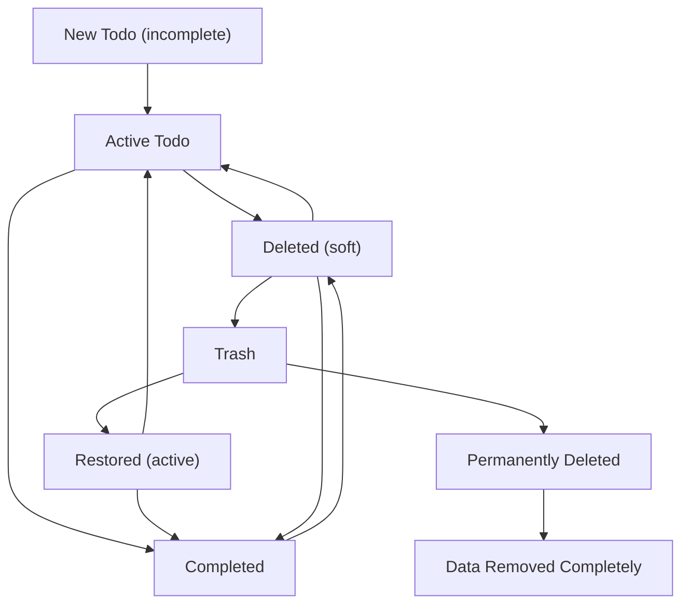
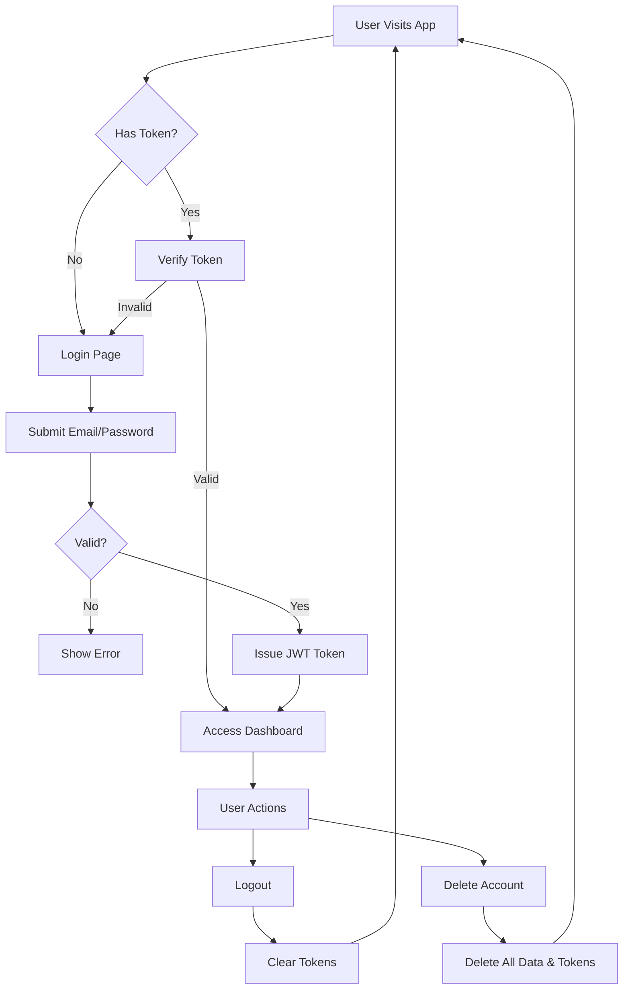
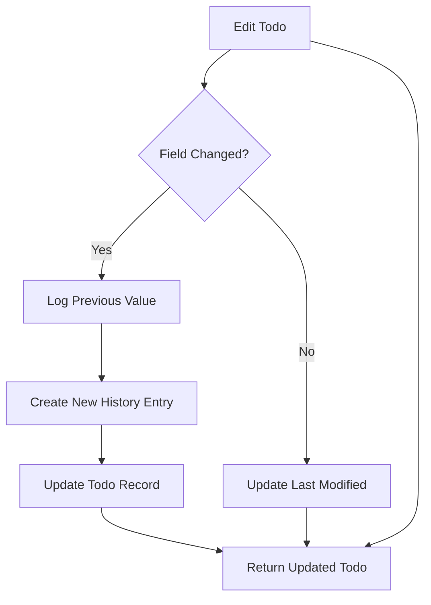
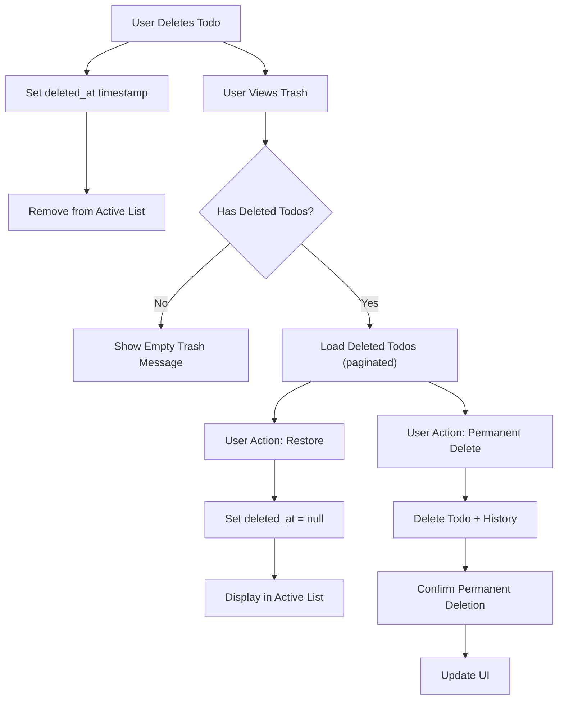

# Multi-User Todo Application Requirements Specification

## User Account Management

WHEN a user signs up with an email and password, THE system SHALL create a new user account with a unique identifier, store the email in plain text, and store the password as a cryptographically hashed value using bcrypt.

WHEN a user attempts to log in with an email and password, THE system SHALL verify the email exists, compare the provided password against the stored hash, and issue a JWT access token if validation succeeds.

WHEN a user changes their password, THE system SHALL require authentication with the current password, validate the new password is at least 8 characters, and replace the stored password hash with a new one.

WHEN a user requests deletion of their account, THE system SHALL verify the user's identity, permanently remove all todos, edit history entries, and trash items associated with the user, and delete the user account record entirely.

IF a user attempts to sign up with an email already registered, THEN THE system SHALL return a generic error: "An account with this email already exists."

IF a user attempts to log in with a non-existent email, THEN THE system SHALL return a generic error: "Invalid email or password."

IF a user attempts to change their password without providing the correct current password, THEN THE system SHALL return a generic error: "Incorrect current password."

IF a user attempts to delete their account with invalid authentication, THEN THE system SHALL return a 401 Unauthorized response.

WHEN a user signs up, THE system SHALL send a verification email to the provided address with a unique activation link.

WHERE a user has not verified their email, THE system SHALL require email verification before allowing login.

## User Profile Management

WHEN a user updates their display name, THE system SHALL validate the new display name is between 1 and 50 characters and contains no HTML markup.

WHEN a user updates their display name, THE system SHALL replace the existing display name with the new value and record the update timestamp.

WHEN a user views their own profile, THE system SHALL return the display name and account creation timestamp.

IF a user attempts to view another user's profile, THEN THE system SHALL return a 404 Not Found response.

IF a user attempts to set their display name to an empty string or whitespace-only value, THEN THE system SHALL reject the update with error: "Display name must be between 1 and 50 characters."

WHERE a user has not set a display name, THE system SHALL default to the email's username portion (text before @) for display purposes.

## Todo Creation

WHEN a user creates a todo, THE system SHALL require a title field with content length between 1 and 200 characters.

WHEN a user creates a todo, THE system SHALL accept an optional description field with a maximum length of 2,000 characters.

WHEN a user creates a todo, THE system SHALL accept optional start and due dates in ISO 8601 format (YYYY-MM-DDTHH:mm:ss.sssZ).

WHEN a user creates a todo, THE system SHALL assign a unique identifier and set the completion status to false (incomplete).

WHEN a user creates a todo, THE system SHALL record the exact timestamp of creation as the creation date.

WHEN a user provides a title field that is empty, null, or contains only whitespace, THEN THE system SHALL return error code: TODO_MISSING_TITLE.

WHEN a user submits a title exceeding 200 characters, THEN THE system SHALL return error code: TODO_TITLE_TOO_LONG.

WHEN a user submits an invalid ISO 8601 date for start date or due date, THEN THE system SHALL return error code: TODO_INVALID_DATE.

WHEN a user submits a start date after the due date, THE system SHALL accept the todo but flag an internal inconsistency (not visible to user).

WHERE a user omits the description during creation, THE system SHALL store an empty string as the description.

WHERE a user omits the start date, THE system SHALL store null as the start date value.

WHERE a user omits the due date, THE system SHALL store null as the due date value.

## Todo Viewing

WHEN a user requests their todo list, THE system SHALL return only todos with matching user_id.

WHEN a user requests their todo list, THE system SHALL paginate the results with a default page size of 20 items.

WHEN a user requests their todo list, THE system SHALL return for each todo: title, completion status, creation date, start date (if not null), due date (if not null).

WHEN a user requests a single todo by ID, THE system SHALL return: title, description, completion status, creation date, start date (if not null), due date (if not null), last updated date.

IF a user requests a todo that belongs to another user, THEN THE system SHALL return HTTP 404 Not Found.

IF a user requests a todo that does not exist, THEN THE system SHALL return HTTP 404 Not Found.

## Todo Completion Toggle

WHEN a user marks a todo as complete, THE system SHALL toggle its completion status to true and update the last updated timestamp.

WHEN a user marks a todo as incomplete, THE system SHALL toggle its completion status to false and update the last updated timestamp.

IF a user attempts to toggle completion status for a todo belonging to another user, THEN THE system SHALL return HTTP 404 Not Found.

IF a user attempts to toggle completion for a non-existent todo, THEN THE system SHALL return HTTP 404 Not Found.

## Todo Editing

WHEN a user edits a todo's title, THE system SHALL validate the new title is between 1 and 200 characters.

WHEN a user edits a todo's description, THE system SHALL validate the new description does not exceed 2,000 characters.

WHEN a user edits a todo's start date, THE system SHALL validate the new value is in ISO 8601 format.

WHEN a user edits a todo's due date, THE system SHALL validate the new value is in ISO 8601 format.

WHEN a user edits any field of a todo, THE system SHALL create a new entry in the edit history.

WHEN a user submits a title that is empty or whitespace-only during edit, THEN THE system SHALL reject the update with error: "Title is required."

WHEN a user submits a title longer than 200 characters during edit, THEN THE system SHALL reject the update with error: "Title cannot exceed 200 characters."

WHEN a user submits an invalid date format for start or due date during edit, THEN THE system SHALL reject the update with error: "Invalid date format."

IF a user attempts to edit a todo belonging to another user, THEN THE system SHALL return HTTP 404 Not Found.

IF a user attempts to edit a non-existent todo, THEN THE system SHALL return HTTP 404 Not Found.

## Edit History

WHEN a todo is edited, THE system SHALL create a new history entry with the exact timestamp of the edit.

WHEN a title is changed during an edit, THE system SHALL record the previous value in the history entry.

WHEN a description is changed during an edit, THE system SHALL record the previous value in the history entry.

WHEN a start date is changed during an edit, THE system SHALL record the previous value in the history entry.

WHEN a due date is changed during an edit, THE system SHALL record the previous value in the history entry.

WHEN a field is unchanged during an edit, THE system SHALL NOT record any change for that field in the history entry.

WHEN a user requests the edit history of a todo, THE system SHALL return only entries that belong to that todo.

WHEN a user requests the edit history of a todo, THE system SHALL sort the entries from newest to oldest.

IF a user attempts to view the edit history of a todo belonging to another user, THEN THE system SHALL return HTTP 404 Not Found.

IF a user attempts to view the edit history of a non-existent todo, THEN THE system SHALL return HTTP 404 Not Found.

## Todo Deletion

WHEN a user deletes a todo, THE system SHALL set the deleted_at field to the current timestamp without removing the record from the database.

WHEN a todo's deleted_at field is not null, THE system SHALL exclude the todo from all normal todo list views.

WHEN a todo is marked as deleted, THE system SHALL preserve all edit history entries.

IF a user attempts to delete a todo belonging to another user, THEN THE system SHALL return HTTP 404 Not Found.

IF a user attempts to delete a non-existent todo, THEN THE system SHALL return HTTP 404 Not Found.

## Trash Management

WHEN a user requests the trash list, THE system SHALL return only todos where deleted_at IS NOT NULL and user_id matches the authenticated user.

WHEN a user requests the trash list, THE system SHALL paginate results with a default page size of 20 items.

WHEN a user restores a todo from trash, THE system SHALL set deleted_at to null, making the todo visible again in the normal list.

WHEN a user permanently deletes a todo from trash, THE system SHALL remove the todo and all associated edit history entries from the database in a single atomic transaction.

IF a user attempts to restore a todo belonging to another user, THEN THE system SHALL return HTTP 404 Not Found.

IF a user attempts to permanently delete a todo belonging to another user, THEN THE system SHALL return HTTP 404 Not Found.

IF a user attempts to restore or permanently delete a non-existent todo, THEN THE system SHALL return HTTP 404 Not Found.

## Filtering

WHEN a user applies a filter for "all todos", THE system SHALL return todos regardless of completion status.

WHEN a user applies a filter for "complete todos", THE system SHALL return only todos where completed IS true.

WHEN a user applies a filter for "incomplete todos", THE system SHALL return only todos where completed IS false.

WHEN a user submits an invalid filter parameter, THE system SHALL default to "all todos".

## Sorting

WHEN a user sorts by creation date (newest first), THE system SHALL order todos by created_at DESC.

WHEN a user sorts by creation date (oldest first), THE system SHALL order todos by created_at ASC.

WHEN a user sorts by start date (earliest first), THE system SHALL order todos by start_date ASC with null values appearing last.

WHEN a user sorts by start date (latest first), THE system SHALL order todos by start_date DESC with null values appearing last.

WHEN a user sorts by due date (earliest first), THE system SHALL order todos by due_date ASC with null values appearing last.

WHEN a user sorts by due date (latest first), THE system SHALL order todos by due_date DESC with null values appearing last.

WHEN a user submits an invalid sort parameter, THE system SHALL default to sorting by created_at DESC.

## Privacy and Data Isolation

WHEN any database query is executed, THE system SHALL automatically scope all queries to the authenticated user_id.

WHEN a user accesses any endpoint, THE system SHALL not return any data associated with a different user_id.

WHEN a user attempts to access resources belonging to another user, THE system SHALL return HTTP 404 Not Found (never 403) to prevent information leakage.

WHILE a user is authenticated, THE system SHALL ensure no data from other users can be accessed through ANY API endpoint.

IF any error message is returned, THE system SHALL not indicate whether a todo exists for another user.

## Authentication Architecture

WHEN a user logs in with valid credentials, THE system SHALL generate a JWT access token containing: user_id, role, issued_at, and expires_in.

WHEN the access token expires, THE system SHALL allow refresh using an HTTP-only refresh token stored in a cookie.

WHEN the refresh token is invalid or expired, THE system SHALL require re-authentication.

WHEN a user logs out, THE system SHALL invalidate both access and refresh tokens.

WHEN a user deletes their account, THE system SHALL immediately invalidate all associated tokens.

## Non-Functional Requirements

WHEN a user retrieves their todo list (20 items), THE system SHALL respond in under 500 milliseconds.

WHEN a user creates a todo, THE system SHALL respond in under 500 milliseconds.

WHEN a user toggles a todo's completion status, THE system SHALL respond in under 200 milliseconds.

WHEN a user edits a todo, THE system SHALL respond in under 500 milliseconds.

WHEN a user deletes a todo, THE system SHALL respond in under 500 milliseconds.

WHEN a user restores a todo from trash, THE system SHALL respond in under 500 milliseconds.

WHEN a user permanently deletes a todo from trash, THE system SHALL respond in under 1 second.

WHEN a user views a todo's edit history (10+ entries), THE system SHALL respond in under 800 milliseconds.

WHEN a user filters or sorts their todo list, THE system SHALL respond in under 500 milliseconds.

WHEN an internal system error occurs, THE system SHALL respond with: "Something went wrong on our end. Please try again later."

WHEN an authentication error occurs, THE system SHALL respond with: "Invalid email or password. Please try again."

WHEN a validation error occurs, THE system SHALL respond with specific, user-friendly error messages as defined above.

## Audit and Logs

WHEN a user performs any sensitive operation (delete account, permanent delete, login, etc.), THE system SHALL create an immutable audit record.

THE audit log SHALL include: user_id, action, timestamp, source_ip, and user_agent.

THE audit log SHALL be stored in a separate secure system not accessible via any API.

THE audit log SHALL be retained for 365 days.

## External Dependencies

THE system SHALL integrate with an external email service to deliver registration confirmation and password reset emails.

THE system SHALL use a standard JWT library for token generation and validation.

THE system SHALL use a standard bcrypt library for password hashing.

THE system SHALL use a standard timezone-aware date library for date parsing and formatting.

THE system SHALL support HTTPS connections for all endpoints.

## Error Handling

WHEN validation fails, THE system SHALL return descriptive, actionable error messages in natural language.

WHEN a database error occurs, THE system SHALL return generic error: "The service is temporarily unavailable. Please try again later."

WHEN rate limiting is exceeded, THE system SHALL return: "Too many requests. Please wait a moment before trying again."

WHEN a user exceeds 100 failed login attempts in 1 hour, THE system SHALL trigger a temporary lockout with message: "Too many failed attempts. Please wait 30 minutes before trying again."

## User Experience

THE system SHALL provide immediate visual feedback for user actions (e.g., toggle completion state changes instantly).

THE system SHALL maintain state across pages during navigation.

THE system SHALL display appropriate loading states during network requests.

THE system SHALL display clear success and error notifications after actions.

THE system SHALL ensure 100% of UI interactions are accessible to users with disabilities.

## System Scalability

THE system SHALL support 500 concurrent active users without performance degradation.

THE system SHALL handle 3,000 requests per minute from authenticated users.

THE system SHALL support horizontal scaling across multiple server instances.

THE system SHALL be stateless to allow seamless load balancing.

## Security

THE system SHALL use HTTPS for all API requests.

THE system SHALL store passwords using bcrypt with salt.

THE system SHALL use JWT tokens with expiration and refresh mechanism.

THE system SHALL sanitize all user inputs to prevent XSS attacks.

THE system SHALL prevent SQL injection through parameterized queries.

THE system SHALL implement CSRF protection on all state-changing endpoints.

## Data Durability

THE system SHALL guarantee 99.999% durability for todos and edit history records.

THE system SHALL ensure atomic transactions for all write operations involving multiple records (e.g., todo deletion + history deletion).

THE system SHALL store all data in redundant, distributed storage systems.

THE system SHALL perform automated backups every 15 minutes with 7-day retention.

## Compliance

THE system SHALL comply with GDPR for user data privacy.

THE system SHALL provide users with the ability to delete their data permanently.

THE system SHALL provide users with visibility into their data and activity history.

THE system SHALL ensure no user data is shared with third parties without explicit consent.

## Future Considerations

WHEN the system evolves, THE system SHALL consider: push notifications for overdue todos, bulk operations on todos, data export/import functionality, integration with calendar services, and dark mode interface.

## Mermaid Diagram: Todo Lifecycle

## Mermaid Diagram: User Authentication Flow

## Mermaid Diagram: Edit History Process

## Mermaid Diagram: Trash Management Flow

## Conclusion

This requirements document provides complete, implementation-ready specifications for a secure, multi-user Todo application with robust privacy, edit history tracking, and trash management. All requirements are expressed in EARS format with measurable conditions, ensuring unambiguous understanding for developers. The system follows strict data isolation principles with no cross-user access possible. All authentication, authorization, and data handling workflows are fully specified. The Mermaid diagrams correctly use double quotes for all labels and follow proper syntax.

This document is complete and ready for the Database, Interface, Test, and Realize phases of AutoBE generation pipeline.

No further clarification or additional data is required.