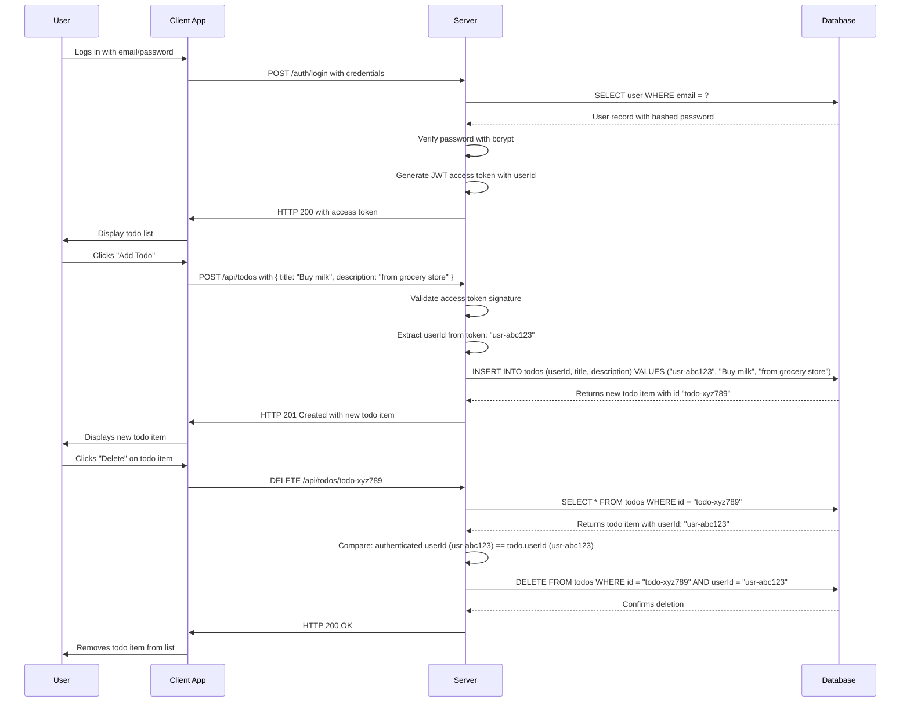

# User Authentication and Todo Management System

## Overview

This system provides secure, private todo list management for individual users. Each user registers with a unique email and password, then authenticates to access their personal todo list. All todo items are isolated by user identity, ensuring complete data privacy and security.

The system implements full end-to-end authentication including registration, login, token-based session management, password reset, and account deletion. All operations enforce strict ownership validation to ensure users cannot access or modify another user's data.

## Core Workflow: Registration and Authentication

### User Registration

WHEN a new user visits the application and selects "Register", THE system SHALL display a registration form requiring:

- Email address in valid format (e.g., user@example.com)
- Password of at least 12 characters
- Password confirmation field

WHEN the user submits the registration form, THE system SHALL:

- Validate the email format using standard email regex
- Enforce password minimum length of 12 characters
- Confirm password confirmation matches the initial password
- Generate a unique UUID for the new user
- Hash the password using bcrypt with a cost factor of 12
- Store the user record with hashed password, email, and creation timestamp
- Send a verification email containing a cryptographically signed, time-limited token
- Return HTTP 201 Created with a message indicating "Registration successful. Please check your email for verification."

WHEN the verification token expires (after 24 hours), THE system SHALL render the registration incomplete and prohibit login until verification is completed.

WHEN a user attempts to register with an email already in use, THE system SHALL return HTTP 409 Conflict with error code EMAIL_ALREADY_REGISTERED.

### User Login

WHEN a registered user visits the application and selects "Login", THE system SHALL display a login form requiring:

- Email address
- Password

WHEN the user submits the login form, THE system SHALL:

- Query the database for a user record matching the provided email
- If no user is found, return HTTP 401 Unauthorized with error code AUTH_INVALID_CREDENTIALS
- If user is found but not verified, return HTTP 401 Unauthorized with error code ACCOUNT_NOT_VERIFIED
- If user is found and verified, verify the password against the stored bcrypt hash
- If password verification fails, return HTTP 401 Unauthorized with error code AUTH_INVALID_CREDENTIALS
- If password verification succeeds, generate a JWT access token containing:
  - userId: the user's unique UUID
  - role: "user"
  - iat: issuance timestamp
  - exp: expiration timestamp (15 minutes from issuance)
- Generate a refresh token as a cryptographically secure random string
- Store the refresh token in the database with user ID, creation timestamp, and expiration (7 days)
- Set the refresh token in an httpOnly, secure, SameSite=Strict cookie on the response
- Return HTTP 200 OK with success message and access token in response body

WHEN a user attempts to access any protected endpoint without authentication, THE system SHALL return HTTP 401 Unauthorized with error code AUTH_TOKEN_MISSING.

### Access Token Refresh

WHEN a user's access token expires (after 15 minutes), THE system SHALL:

- Accept a refresh request at the /auth/refresh endpoint
- Validate that the refresh token exists in the database and is not revoked
- Validate that the refresh token has not expired (7-day lifetime)
- Validate that the refresh token's associated user account has not been deleted or disabled
- Validate the refresh token signature
- Issue a new access token with a new 15-minute expiration
- Issue a new refresh token with a new 7-day expiration
- Replace the old refresh token in the database with the new one
- Return HTTP 200 OK with the new access token in the response body and set a new httpOnly cookie for the refresh token

WHEN a refresh token is used after expiration or after being invalidated, THE system SHALL return HTTP 401 Unauthorized with error code REFRESH_TOKEN_INVALID.

### Password Reset

WHEN a user selects "Forgot Password", THE system SHALL:

- Display a form requesting a registered email address
- Validate that the email exists in the system
- Generate a cryptographically random, time-limited reset token valid for 30 minutes
- Store the reset token in the database with user ID and expiration timestamp
- Send an email to the user containing a link with the reset token as a query parameter
- Return HTTP 200 OK with message "Password reset instructions sent to your email."

WHEN a user clicks the password reset link in their email, THE system SHALL:

- Receive the reset token via URL parameter
- Validate that the token exists in the database and has not expired
- Display a form to enter a new password and confirmation

WHEN a user submits a new password via the reset form, THE system SHALL:

- Validate the new password is at least 12 characters
- Validate that the password confirmation matches the new password
- Hash the new password using bcrypt with cost factor 12
- Update the user record with the new hashed password
- Invalidate all active sessions by marking the user's refresh token as revoked
- Delete the reset token from the database
- Return HTTP 200 OK with message "Password has been updated successfully. You may now log in with your new password."

WHEN a user attempts to use an expired reset token, THE system SHALL return HTTP 401 Unauthorized with error code RESET_TOKEN_EXPIRED.

WHEN a user attempts to use a non-existent reset token, THE system SHALL return HTTP 404 Not Found with error code RESET_TOKEN_NOT_FOUND.

### Account Deletion

WHEN a logged-in user selects "Delete Account", THE system SHALL:

- Display a confirmation dialog requiring:
  - Entry of current password
  - Checkbox acknowledging irreversible deletion
  - Confirmation button

WHEN the user submits the account deletion request, THE system SHALL:

- Verify the user is authenticated with a valid access token
- Validate the provided current password against the stored bcrypt hash
- If password validation fails, return HTTP 401 Unauthorized with error code AUTH_INVALID_CREDENTIALS
- Begin transaction:
  - Delete all todo items associated with the user
  - Delete the user record from the database
  - Invalidate the refresh token
  - Clear the refresh token cookie
- Commit transaction
- Return HTTP 200 OK with message "Your account has been permanently deleted."

WHEN the account deletion process completes, THE system SHALL ensure:

- All user data is purged from the database
- No backup or audit logs contain sensitive todo item content
- Any pending analysis or processing associated with the user is terminated
- The user's email address is not reused for new registrations for at least 30 days

## Core Todo Functionality

### Primary Workflow: Todo Management

All todo items are owned exclusively by the authenticated user. No user can access, modify, delete, or view another user's todo items, regardless of API endpoint used.

### Create Todo Item

WHEN a user selects "Add Todo", THE system SHALL:

- Display a form with fields for:
  - Title (required, 1-255 characters)
  - Description (optional, up to 1000 characters)
  - Due date (optional, valid ISO 8601 date)
  - Priority (optional: low, medium, high)

WHEN the user submits the form, THE system SHALL:

- Validate that the user is authenticated (access token is valid)
- Extract the userId from the JWT access token
- Validate title is between 1 and 255 characters
- Validate description does not exceed 1000 characters
- Validate due date (if provided) is in future or current date
- Validate priority is one of: "low", "medium", "high" (case-insensitive)
- Generate a unique UUID for the new todo item
- Store the todo item in the database with:
  - userId (from access token)
  - title
  - description
  - dueDate (nullable)
  - priority (nullable)
  - completed (default: false)
  - createdAt (timestamp)
  - updatedAt (timestamp)
- Return HTTP 201 Created with the created todo item object

WHEN a non-authenticated user attempts to create a todo item, THE system SHALL return HTTP 401 Unauthorized with error code AUTH_TOKEN_MISSING.

WHEN an authenticated user attempts to create a todo item with a title longer than 255 characters, THE system SHALL return HTTP 400 Bad Request with error code TITLE_TOO_LONG.

WHEN an authenticated user attempts to create a todo item with a due date in the past, THE system SHALL return HTTP 400 Bad Request with error code DUE_DATE_INVALID.

### Read Todo List

WHEN a user loads the todo list page, THE system SHALL:

- Validate that the user is authenticated
- Extract the userId from the JWT access token
- Query the database for all todo items where userId matches the authenticated user's ID
- Apply pagination (default: 20 items per page)
- Sort items by createdAt in descending order (newest first)
- Return HTTP 200 OK with paginated todo items array

WHEN an authenticated user queries for todo items, THE system SHALL ensure:

- The query filters exclusively by userId from the access token
- No other filters (like id, title, etc.) can bypass user ownership check
- No SQL injection or parameter tampering can access another user's data

WHEN a user attempts to access the todo items endpoint directly via URL manipulation (e.g., /api/todos?userId=otheruser.id), THE system SHALL ignore the userId parameter and return only items belonging to the authenticated user.

### Update Todo Item

WHEN a user edits a todo item, THE system SHALL:

- Display a modal with pre-filled values of the selected todo item
- Allow modification of:
  - Title (required, 1-255 characters)
  - Description (optional, up to 1000 characters)
  - Due date (optional)
  - Priority (optional)
  - Completion status (toggle)

WHEN the user saves the changes, THE system SHALL:

- Validate that the user is authenticated
- Extract the userId from the JWT access token
- Validate that the todo item exists and belongs to the authenticated user
- Validate that the new title is between 1 and 255 characters
- Validate that the new description does not exceed 1000 characters
- Validate that the new due date (if changed) is in present or future
- Update the todo item in the database with new values and set updatedAt timestamp
- Return HTTP 200 OK with updated todo item

WHEN the user attempts to update a todo item that does not exist, THE system SHALL return HTTP 404 Not Found with error code TODO_NOT_FOUND.

WHEN the user attempts to update a todo item belonging to another user, THE system SHALL return HTTP 403 Forbidden with error code AUTHORIZATION_FAILED.

### Delete Todo Item

WHEN a user selects "Delete" for a todo item, THE system SHALL:

- Display a confirmation dialog including the item's title
- Require user to confirm deletion

WHEN the user confirms deletion, THE system SHALL:

- Validate that the user is authenticated
- Extract the userId from the JWT access token
- Validate that the todo item exists and belongs to the authenticated user
- Remove the todo item from the database
- Return HTTP 200 OK with success message

WHEN the user attempts to delete a todo item that does not exist, THE system SHALL return HTTP 404 Not Found with error code TODO_NOT_FOUND.

WHEN the user attempts to delete a todo item belonging to another user, THE system SHALL return HTTP 403 Forbidden with error code AUTHORIZATION_FAILED.

### Complete Todo Item

WHEN a user checks a todo item as completed, THE system SHALL:

- Validate that the user is authenticated
- Extract the userId from the JWT access token
- Validate that the todo item exists and belongs to the authenticated user
- Update the completed field to true
- Set the completedAt timestamp to current time
- Return HTTP 200 OK with updated todo item

WHEN a user marks an item as incomplete, THE system SHALL:

- Validate that the user is authenticated
- Extract the userId from the JWT access token
- Validate that the todo item exists and belongs to the authenticated user
- Update the completed field to false
- Set the completedAt timestamp to null
- Return HTTP 200 OK with updated todo item

## Error Handling

### Authentication Errors

| Error Code | HTTP Status | Description |
| --- | --- | --- |
| AUTH_TOKEN_MISSING | 401 | No authentication token provided in request |
| AUTH_INVALID_CREDENTIALS | 401 | Invalid email/password combination |
| ACCOUNT_NOT_VERIFIED | 401 | User account email has not been verified |
| REFRESH_TOKEN_INVALID | 401 | Refresh token has expired or been revoked |
| RESET_TOKEN_EXPIRED | 401 | Password reset token has expired |
| RESET_TOKEN_NOT_FOUND | 404 | Password reset token does not exist |

### Authorization Errors

| Error Code | HTTP Status | Description |
| --- | --- | --- |
| AUTHORIZATION_FAILED | 403 | User attempted to access another user's data |

### Input Validation Errors

| Error Code | HTTP Status | Description |
| --- | --- | --- |
| TITLE_TOO_LONG | 400 | Todo title exceeds 255 character limit |
| DUE_DATE_INVALID | 400 | Due date is set in the past |
| EMAIL_FORMAT_INVALID | 400 | Email address does not conform to standard format |
| PASSWORD_TOO_SHORT | 400 | Password is less than 12 characters |
| PASSWORD_MISMATCH | 400 | Password and password confirmation do not match |
| TODO_NOT_FOUND | 404 | Specified todo item does not exist |

### System Errors

| Error Code | HTTP Status | Description |
| --- | --- | --- |
| RATE_LIMIT_EXCEEDED | 429 | Too many authentication attempts from this IP |
| INTERNAL_SERVER_ERROR | 500 | Unhandled server error (never returned as generic user message) |

## Unique Data Ownership Enforcement

### Enforcement Architecture

THE system SHALL maintain absolute data isolation between users using the following architecture:

1. Every todo item record in the database SHALL include a userId field
2. The userId field SHALL be populated at creation time with the authenticated user's ID
3. All database queries for todo data SHALL include a WHERE userId = :authenticatedUserId
4. No API endpoint SHALL accept or use user ID parameters from request bodies or URLs to filter data
5. User ID SHALL be obtained exclusively from the JWT access token
6. All update/delete operations SHALL verify object ownership before execution

### Security Verification Procedures

Before processing any todo-related operation, THE system SHALL:

1. Extract the userId from the access token
2. Parse and verify the token signature
3. Verify token has not expired
4. Verify user account is active and verified
5. Retrieve the todo item from database using item ID
6. Compare the todo item's userId with the authenticated userId
7. Only proceed if there is an exact match
8. If no match, return HTTP 403 Forbidden

### Example Workflow: Security Enforcement

THE following process ensures data isolation for all users:

## Compliance and Data Privacy

### GDPR Compliance

THE todoApp SHALL comply with Article 17 of the GDPR (Right to Erasure):

WHEN a user requests account deletion, THE system SHALL immediately and permanently:
- Remove the user record from the auth_users table
- Remove all associated todo items from the todos table
- Purge all encryption keys associated with the user's data
- Ensure no backups, logs, or analytics systems retain any identifiable user data

THE system SHALL comply with Article 15 (Right of Access):

WHEN a user requests their data, THE system SHALL:
- Provide a downloadable JSON file containing:
  - Account creation timestamp
  - Email address
  - List of all todo items with title, description, due date, priority, completion status, and timestamps
- Include a clear statement that data was collected under lawful consent
- Provide instructions for data deletion

### CCPA Compliance

THE todoApp SHALL comply with the California Consumer Privacy Act (CCPA):

WHEN a California resident requests their personal information, THE system SHALL:
- Respond within 45 days (extendable to 90 days with notification)
- Provide the same data export as described above
- Include a "Do Not Sell My Personal Information" option in account settings

### Data Retention Policy

THE system SHALL implement the following data retention practices:

- User accounts shall be retained indefinitely while active
- Todo items shall be retained as long as the user account exists
- Deactivated accounts shall be retained for 30 days before permanent deletion
- Password reset tokens shall expire after 30 minutes
- Access tokens shall expire after 15 minutes
- Refresh tokens shall expire after 7 days
- Audit logs shall retain user activity for 90 days, excluding todo item content

## Future Considerations

### Potential Enhancements

In future iterations, the following features may be added:

- Two-factor authentication (TOTP) for enhanced security
- Email verification resend functionality
- Bulk todo item operations (delete multiple, mark all as complete)
- Todo item categories or tags
- Todo item sharing with read-only access
- Integration with calendar services for due date reminders
- Dark mode interface
- Mobile application support

All future enhancements SHALL maintain strict data isolation principles and SHALL not enable user-to-user data access.

## Authentication Status Matrix

| Feature | Guest | Unverified User | Verified User |
| --- | --- | --- | --- |
| Register | ✅ | ❌ | ❌ |
| Login | ✅ | ✅ | ✅ |
| View Todo List | ❌ | ❌ | ✅ |
| Create Todo | ❌ | ❌ | ✅ |
| Update Todo | ❌ | ❌ | ✅ |
| Delete Todo | ❌ | ❌ | ✅ |
| Complete Todo | ❌ | ❌ | ✅ |
| Delete Account | ❌ | ❌ | ✅ |
| Reset Password | ✅ | ✅ | ✅ |
| Logout | ❌ | ❌ | ✅ |

The system SHALL completely prevent guest and unverified users from accessing any todo functionality