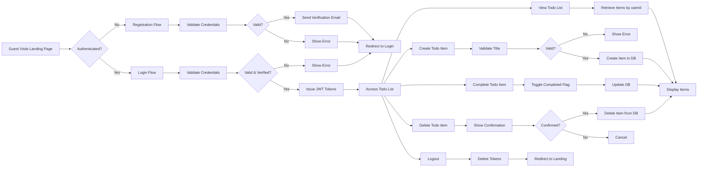

# Multi-User Todo List Application Requirements Specification

## Service Overview

The Multi-User Todo List application is a privacy-first task management system designed for individual users who need to track personal tasks securely. The system ensures complete data isolation between users, where each user's todo lists are completely invisible and inaccessible to all other users. Authentication is mandatory to access any functionality, and users must verify their email addresses before gaining full access to their personal task lists.

This minimal application focuses exclusively on core productivity: registration, authentication, and management of personal todo lists. There are no social features, no task sharing, no collaboration tools, and no external integrations. The system's success is measured by its ability to provide a simple, secure environment where users can trust that their private tasks remain exactly that—private.

## User Actors

The system defines three distinct user actors with clearly defined roles and permissions:

### User

The primary actor for the system. This represents an individual who has successfully registered and authenticated with the system. A User:

- Can only access and modify their own personal todo list
- Cannot view, edit, or delete any todos belonging to any other user
- Has full control over their own todo items (create, update, delete, mark complete)
- Automatically receives a personal todo list upon successful authentication
- Cannot manage or view any system-level administrative functions

### Guest

An unauthenticated visitor to the application. A Guest:

- Can only access public-facing pages (landing page, application information)
- Cannot view any todo lists, even empty ones
- Cannot access any protected API endpoints
- Must authenticate to gain access to any private functionality
- Is redirected to the authentication flow when attempting to access restricted content

### Admin

A system administrator with elevated privileges for system maintenance and monitoring. An Admin:

- Has valid authentication credentials and can log in to the system
- Has read-only access to user account metadata for auditing and support purposes
- Cannot access, modify, or view any todo list items belonging to users
- Has no ability to create, update, or delete any user's todo items
- Can perform system-wide operations such as viewing user registration statistics or deactivating compromised accounts
- Cannot interfere with user task data in any way

## Authentication Requirements

### Core Authentication Functions

WHEN a guest attempts to access any protected resource, THE system SHALL redirect them to the authentication endpoint.

THE system SHALL allow users to register with a valid email address and secure password.

WHEN a user submits valid registration credentials, THE system SHALL create a new user account with an active status.

THE system SHALL require users to verify their email address before completing registration.

WHEN a user attempts to log in with valid credentials, THE system SHALL authenticate the user and establish a secure session.

THE system SHALL reject login attempts with invalid credentials and return a standardized error response.

WHEN a user successfully authenticates, THE system SHALL generate a JSON Web Token (JWT) containing essential user information.

THE system SHALL allow users to log out, which immediately invalidates their current session token.

WHEN a user attempts to log in from a new device or location, THE system SHALL require email verification confirmation.

### Authentication Workflow

The authentication process follows a strict workflow to ensure security and user verification:

1. A Guest navigates to the application and is presented with a public landing page
2. To access todo functionality, the Guest must select "Sign Up" or "Log In"
3. On registration, the user provides a valid email address and password
4. The system validates the email format and password complexity, then creates an unverified account
5. The system sends a verification email with a unique, time-limited token
6. The user must click the verification link to activate their account
7. Once verified, the user can log in with their credentials
8. Upon successful login, an access token is issued and stored securely
9. The user can now access their personal todo list
10. All subsequent API requests must include the valid access token
11. When the user selects "Log Out", the token is revoked and the session is terminated

### JWT Configuration

THE system SHALL use JWT tokens for all authentication and authorization purposes.

THE JWT payload SHALL contain the following mandatory claims:

| Claim | Type | Description |
|-------|------|-------------|
| sub | string | User ID (UUID format) |
| email | string | User's verified email address |
| role | string | Actor role ("user", "admin") |
| exp | number | Expiration timestamp (UNIX epoch) |
| iat | number | Issued at timestamp (UNIX epoch) |

THE access token SHALL expire after 15 minutes of inactivity.

THE system SHALL issue a refresh token with a 14-day expiration for use in token renewal cycles.

THE refresh token SHALL be stored in an httpOnly, Secure, SameSite=Strict cookie.

THE access token SHALL not be stored persistently on the client-side (no localStorage/IndexedDB).

WHEN an access token expires, THE system SHALL require use of the refresh token to obtain a new access token.

IF a refresh token is invalid, expired, or tampered with, THEN THE system SHALL require full re-authentication.

THE system SHALL use HMAC-SHA256 algorithm with a cryptographically secure secret key to sign all JWT tokens.

## Authorization Model

### Access Control Rules

WHEN a user attempts to access a todo list, THE system SHALL verify that the user's ID matches the owner ID of the requested list.

IF a user attempts to access another user's todo list, THEN THE system SHALL return HTTP 403 Forbidden status with error code ACCESS_DENIED.

THE system SHALL enforce strict isolation between user data at the database and application layer.

WHERE a user has authenticated, THE system SHALL grant access to all personal todo list functionality.

THE admin actor SHALL have read-only access to user account metadata for system monitoring purposes.

WHEN an admin attempts to view user data, THE system SHALL log the action for audit purposes.

### Data Isolation Enforcement

The system implements multi-layered data isolation to ensure complete privacy:

1. **Application Layer**: All API endpoints extract the user ID from the JWT token and use it as the exclusive filter for database queries
2. **Database Layer**: All data tables include a user_id foreign key that references the users table
3. **Query Layer**: All database queries include WHERE user_id = ? clause using the JWT-identified user ID
4. **Validation Layer**: All incoming requests with userId parameters in request body or URL are ignored—the system only uses the JWT-sourced user ID

No endpoint exists that accepts user ID information from the client side as a basis for data access. The authentication token is the only source of truth for identity.

### Permission Matrix

| Action | User | Guest | Admin |
|--------|------|-------|-------|
| View public landing page | ✅ | ✅ | ✅ |
| Register new account | ✅ | ✅ | ❌ |
| Login to account | ✅ | ❌ | ✅ |
| View own todo lists | ✅ | ❌ | ✅ |
| Create new todo list | ✅ | ❌ | ✅ |
| Edit own todo items | ✅ | ❌ | ✅ |
| Delete own todo items | ✅ | ❌ | ✅ |
| Mark todo items as complete | ✅ | ❌ | ✅ |
| View other users' todo lists | ❌ | ❌ | ✅ |
| Manage user accounts | ❌ | ❌ | ✅ |
| View system logs | ❌ | ❌ | ✅ |
| Logout from account | ✅ | ❌ | ✅ |
| Request password reset | ✅ | ✅ | ✅ |
| Change own password | ✅ | ❌ | ✅ |
| Revoke all active sessions | ✅ | ❌ | ✅ |

## Core Functionality

### Todo List Management

Every authenticated user is automatically granted a private todo list upon successful login. This list is created automatically by the system and is never shared with any other user.

### List Structure

- The todo list is an ordered collection of todo items
- Each user has exactly one todo list
- The list has no name or title—users work with their one and only personal list
- Items in the list have no hierarchical structure (no subtasks, no categories)
- Items are ordered chronologically by creation date

### List Access Rules

WHEN a user attempts to access a todo list, THE system SHALL ensure the authenticated user's ID matches the owner of the requested list.

THE system SHALL prevent any user from accessing another user's todo list.

THE system SHALL return a 403 Forbidden error if a guest or unauthorized user attempts to access list data.

THE system SHALL display an empty list to new users who have not yet created any todo items.

### List Persistence

WHILE a user is logged in, THE system SHALL maintain their todo list state.

THE system SHALL persist a user's todo list across sessions using secure data storage.

THE system SHALL restore a user's todo list automatically upon login.

THE system SHALL maintain list integrity and order during persistent storage and retrieval.

THE system SHALL NOT allow list data to be modified by any means other than the user who owns the list.

## Item Creation

Users can create new todo items to track tasks they need to complete. Each item is a simple text item with no additional metadata.

### Creation Process

WHEN a user submits a new todo item via the API (via POST /api/todos), THE system SHALL create a new todo item with the provided text.

THE system SHALL assign a unique identifier to each created item.

THE system SHALL automatically set the item status to "incomplete" upon creation.

THE system SHALL timestamp the creation time of each item.

THE system SHALL associate the new item exclusively with the authenticated user's ID.

### Creation Constraints

WHEN a user attempts to create a todo item with an empty or whitespace-only description, THE system SHALL reject the request with a 400 Bad Request.

IF the item description exceeds 500 characters, THEN THE system SHALL reject the request with a 400 Bad Request.

IF the request contains no description field, THEN THE system SHALL reject the request with a 400 Bad Request.

WHERE user authentication is invalid or missing, THE system SHALL reject the request with a 401 Unauthorized.

## Item Status Management

Each todo item has a simple binary state: incomplete or complete. Users may toggle between these states to reflect task progress.

### Status Change Rules

WHEN a user marks a todo item as complete, THE system SHALL update the item's status to "complete" and record the completion timestamp.

WHEN a user marks a todo item as incomplete, THE system SHALL update the item's status to "incomplete" and remove the completion timestamp.

THE system SHALL maintain the original creation timestamp regardless of status changes.

THE system SHALL allow users to toggle status back and forth as many times as they wish.

### Status Change Process

WHEN a user submits a PATCH request to /api/todos/{id} with a "completed" flag, THE system SHALL update the status of the specified item.

THE system SHALL validate that the user requesting the change owns the item.

IF the item ID does not exist, THEN THE system SHALL return a 404 Not Found.

IF the item ID belongs to a different user, THEN THE system SHALL return a 403 Forbidden.

## Item Deletion

Users may remove todo items from their list when they are no longer relevant or have been resolved.

### Deletion Process

WHEN a user sends a DELETE request to /api/todos/{id}, THE system SHALL permanently remove the specified item from their list.

THE system SHALL validate that the user deleting the item is the owner of the item.

THE system SHALL NOT allow deletion of items belonging to other users.

THE system SHALL perform a hard delete—the item data will be permanently removed from storage.

### Deletion Constraints

IF the item ID does not exist, THEN THE system SHALL return a 404 Not Found.

IF the user attempts to delete an item they do not own, THEN THE system SHALL return a 403 Forbidden.

IF the user sends a delete request without authentication, THE system SHALL return a 401 Unauthorized.

THE system SHALL NOT allow batch deletion—each item must be deleted individually.

## Data Persistence

User data must be securely stored and made available across sessions.

### Storage Requirements

THE system SHALL store user authentication data (hashed passwords, user ID) using industry-standard cryptographic methods.

THE system SHALL store todo list items in a relational database with proper indexing.

THE system SHALL encrypt all personal data at rest.

THE system SHALL isolate each user's data using row-level security policies.

THE system SHALL never store user data in client-side cache without explicit user consent.

### Data Retention

THE system SHALL retain user data indefinitely unless requested to be deleted.

When a user deletes their account, THE system SHALL permanently erase all associated todo list items.

THE system SHALL NOT retain any data from deleted accounts beyond the immediate session termination.

THE system SHALL maintain audit logs of data access for security compliance purposes.

## Business Rules for Security and Privacy

### User Data Isolation

THE system SHALL prevent any form of cross-user data access.

THE system SHALL implement strict access control at the database query level.

THE system SHALL use user-specific query filters for all database operations.

THE system SHALL never return data from one user in response to another user's request.

### Authentication Security

THE system SHALL use JWT tokens for all authenticated requests.

THE system SHALL expire access tokens after 15 minutes.

THE system SHALL issue refresh tokens that expire after 14 days.

THE system SHALL validate token signatures strictly on every request.

THE system SHALL prohibit token reuse or token theft through secure storage practices.

### Input Validation

THE system SHALL validate all incoming request data before processing.

THE system SHALL reject malformed JSON payloads.

THE system SHALL sanitize all string inputs to prevent XSS attacks.

THE system SHALL reject any non-text data in todo item descriptions.

WHERE an item description contains HTML content, THE system SHALL either escape it or reject it.

### Error Handling

IF user authentication fails, THEN THE system SHALL return 401 Unauthorized without revealing why.

IF the requested resource belongs to another user, THEN THE system SHALL return 403 Forbidden without revealing existence of the resource.

IF an item ID is invalid, THEN THE system SHALL return 404 Not Found without indicating whether the identifier was syntactically correct.

WHEN an internal server error occurs, THE system SHALL log the error internally but return only a 500 Internal Server Error to the user.

## User Workflows

### User Registration Flow

WHEN a guest visits the application homepage, THE system SHALL display a registration form with email and password fields.

WHEN a guest submits a registration form with a valid email address and password (minimum 8 characters), THE system SHALL create a new user account with a unique userId.

WHEN a guest submits a registration form with an email address that already exists in the system, THE system SHALL return an error message "Email already registered" and prevent account creation.

WHEN a guest submits a registration form with a password shorter than 8 characters, THE system SHALL return an error message "Password must be at least 8 characters long" and prevent account creation.

WHEN a guest submits a registration form with an email address that is not in valid email format, THE system SHALL return an error message "Please enter a valid email address" and prevent account creation.

WHILE the registration request is being processed, THE system SHALL display a loading indicator to the user.

IF the system fails to create the account due to a server error, THEN THE system SHALL display a generic error message "Registration failed. Please try again later." and log the error for debugging purposes.

IF the registration is successful, THEN THE system SHALL send a verification email to the provided email address with a unique token.

IF the user attempts to register twice with the same email without verifying, THEN THE system SHALL keep the original unverified account and send a new verification email.

### Registration Success Flow

WHEN the user receives the verification email, THE system SHALL allow them to click a unique verification link contained within.

WHEN the user clicks the verification link, THE system SHALL validate the token and activate the user account.

WHEN the user account is activated, THE system SHALL redirect the user to the login page with a success message "Your account has been verified. You can now log in."

WHILE the account remains unverified, THE system SHALL prevent the user from logging in and display a message "Please verify your email address to log in."

### Registration Failure Scenarios

IF the email service fails to deliver the verification email, THEN THE system SHALL display a message "We couldn't send the verification email. Please try registering again or contact support." and allow the user to retry registration.

IF the user doesn't verify their email within 7 days, THEN THE system SHALL automatically delete the unverified account and allow the email to be reused for a new registration.

### User Login Flow

WHEN a user attempts to log in with their email and password, THE system SHALL validate the credentials against the stored hash.

WHEN the provided email and password combination is correct, THE system SHALL generate a JSON Web Token (JWT) with the payload structure as defined in the JWT Configuration section.

WHEN the provided email or password is incorrect, THE system SHALL return an HTTP 401 error with error code AUTH_INVALID_CREDENTIALS.

WHEN the user account is not yet verified, THE system SHALL return an HTTP 401 error with error code AUTH_EMAIL_NOT_VERIFIED.

WHEN the user account has been permanently deactivated by an administrator, THE system SHALL return an HTTP 401 error with error code AUTH_ACCOUNT_DEACTIVATED.

WHILE login credentials are being validated, THE system SHALL display a loading indicator to the user.

IF the login attempt fails due to network connectivity issues, THEN THE system SHALL display a message "Unable to connect to server. Please check your internet connection and try again."

### Session Management

THE system SHALL store the JWT access token in browser localStorage.

THE access token SHALL expire after 30 minutes of inactivity.

WHEN the access token expires, THE system SHALL redirect the user to the login page and display "Your session has expired. Please log in again."

THE system SHALL provide a refresh token mechanism:

WHEN the access token expires, THE system SHALL use the refresh token (stored separately in httpOnly cookie) to request a new access token automatically.

WHEN the refresh token is valid and not expired, THE system SHALL issue a new access token with a 30-minute expiration.

WHEN the refresh token has expired (14 days after issuance), THE system SHALL require the user to log in again with their credentials.

WHEN the user manually logs out, THE system SHALL delete both the access token from localStorage and the refresh token from the httpOnly cookie.

### Todo List Access Flow

WHEN a logged-in user navigates to the todo list page, THE system SHALL retrieve all todo items associated with the userId from the JWT token.

WHEN a logged-in user attempts to access todo items belonging to another userId, THE system SHALL return an empty array and log a security event.

WHERE the user has the permission "read_todos", THE system SHALL return the user's complete todo list in chronological order (oldest first).

WHEN the user has no todo items, THE system SHALL display a message "You have no tasks yet. Create your first task above!"

WHILE the todo list is being loaded from the database, THE system SHALL display a loading state with placeholder skeletons.

IF the database connection fails during todo retrieval, THEN THE system SHALL display a message "Could not load tasks. Please check your connection and try again." and retry the request after 5 seconds.

### Todo Item Creation Flow

WHEN a user clicks the "Add Task" button, THE system SHALL display an input field with placeholder text "What needs to be done?"

WHEN a user enters text into the task input field and clicks "Save", THE system SHALL validate the input.

IF the task title is empty or contains only whitespace, THEN THE system SHALL display an error message "Task title cannot be empty" and not create the task.

IF the task title exceeds 500 characters, THEN THE system SHALL display an error message "Task title cannot exceed 500 characters" and not create the task.

WHEN the task title is valid, THE system SHALL create a new todo item with the following properties:

{
  "id": "uuid-v4",
  "title": "entered text",
  "completed": false,
  "createdAt": "ISO 8601 timestamp",
  "updatedAt": "ISO 8601 timestamp",
  "userId": "authenticated user id from JWT"
}

WHEN the todo item is successfully created, THE system SHALL add the new item to the top of the todo list and clear the input field.

WHEN the todo item creation request fails due to a server error, THE system SHALL display a message "Failed to create task. Please try again." and retain the input in the field for the user to try again.

WHEN the user enters special characters (including emoji, non-Latin scripts, and unicode), THE system SHALL accept and store them unchanged.

WHEN the user presses Enter while typing in the task input field, THE system SHALL behave identically to clicking "Save".

### Todo Item Completion Flow

WHEN a user clicks the checkbox next to a todo item, THE system SHALL toggle the "completed" property of that item.

WHEN the item status changes from incomplete to complete, THE system SHALL update the "updatedAt" field to the current timestamp.

WHEN the item status changes from complete to incomplete, THE system SHALL update the "updatedAt" field to the current timestamp.

WHEN a todo item has been completed, THE system SHALL visually display it with strikethrough text and a subtle gray color.

WHILE the completion status change is being processed, THE system SHALL show a small loading spinner next to the checkbox.

IF the status update fails due to network issues, THEN THE system SHALL revert the checkbox to its previous state and display a message "Could not update task status. Please try again.".

WHEN the user refreshes the page, THE system SHALL restore the completion status of all items as they were before the refresh.

THE system SHALL preserve the completion status of todo items across device restarts and browser sessions.

### Todo Item Deletion Flow

WHEN a user clicks the "Delete" button next to a todo item, THE system SHALL display a confirmation dialog with text "Are you sure you want to delete this task? This action cannot be undone."

WHEN the user confirms deletion in the dialog, THE system SHALL remove the todo item from the database permanently.

WHEN the deletion is successful, THE system SHALL remove the todo item from the UI immediately.

WHEN the deletion fails due to network issues, THE system SHALL display a message "Failed to delete task. Please try again." and retain the item in the list.

WHEN the user clicks "Cancel" in the confirmation dialog, THE system SHALL do nothing and close the dialog.

IF the user attempts to delete a todo item that does not belong to their userId, THEN THE system SHALL return HTTP 403 Forbidden and log a security alert.

IF the deletion request contains a malformed taskId or invalid format, THEN THE system SHALL return HTTP 400 Bad Request.

### User Logout Flow

WHEN a user clicks the "Logout" button in the navigation menu, THE system SHALL delete the access token from localStorage.

WHEN the access token is deleted from localStorage, THE system SHALL delete the refresh token from the httpOnly cookie.

WHEN both tokens are removed, THE system SHALL redirect the user to the landing page.

WHEN the user is redirected to the landing page after logout, THE system SHALL display a message "You have been logged out."

WHEN a user attempts to navigate directly to the todo list page after logout, THE system SHALL redirect the user to the landing page and display "Please log in to access your tasks.".

WHILE the logout request is being processed, THE system SHALL display a loading indicator in the navigation menu.

IF the logout request fails due to server connectivity issues, THEN THE system SHALL display a message "Could not log out. Please refresh the page." and retain the user's login session.

## Business Rules

### Data Validation Rules

- WHEN a user attempts to create a new todo item, THE system SHALL validate that the title field is not empty and has a minimum length of 1 character.
- WHEN a user attempts to create a new todo item, THE system SHALL validate that the title field does not exceed 500 characters in length.
- WHEN a user attempts to update an existing todo item, THE system SHALL validate that the title field follows the same length requirements as creation.
- WHEN a user attempts to mark a todo item as complete, THE system SHALL validate that the isCompleted boolean value is strictly true or false, rejecting any other values.
- WHEN a user attempts to delete a todo item, THE system SHALL validate that the item ID is a valid UUID format.
- WHEN a user attempts to retrieve their todo list, THE system SHALL validate that the user has a valid, non-expired authentication token.
- WHEN a user attempts to perform any operation on a todo item, THE system SHALL validate that the item ID exists within the database and was created by the authenticated user.
- IF a todo item title contains only whitespace characters, THEN THE system SHALL reject the request with validation error.
- IF a todo item ID format is malformed or not a valid UUID, THEN THE system SHALL reject the request with validation error.
- WHERE a todo item has an empty title, THE system SHALL treat it as invalid and prevent persisting the item.

### Access Control Rules

- WHEN any user attempts to access a todo item, THE system SHALL verify that the item's userId matches the authenticated user's userId.
- WHILE a user is authenticated, THE system SHALL allow access only to todo items created by that specific user.
- IF a user attempts to access a todo item that belongs to another user, THEN THE system SHALL return HTTP 403 Forbidden with error code ACCESS_DENIED.
- IF a user attempts to update a todo item that belongs to another user, THEN THE system SHALL return HTTP 403 Forbidden with error code ACCESS_DENIED.
- IF a user attempts to delete a todo item that belongs to another user, THEN THE system SHALL return HTTP 403 Forbidden with error code ACCESS_DENIED.
- IF a user attempts to mark a todo item as complete that belongs to another user, THEN THE system SHALL return HTTP 403 Forbidden with error code ACCESS_DENIED.
- WHILE a user is not authenticated, THE system SHALL block all access to todo list functionality and redirect to authentication page.
- THE system SHALL never expose any todo item metadata (creation date, modification date, status) to users not owner of the item.
- WHERE a user logs in, THE system SHALL return only the todo items belonging to that user in response to list requests.
- WHERE a user performs any operation on a todo item, THE system SHALL ensure the operation is performed only on items where userId equals the authenticated user's userId.

### Concurrent Access Rules

- WHILE multiple users access the system simultaneously, THE system SHALL ensure operations on todo items are isolated per user.
- WHEN two users attempt to perform operations on the same todo item simultaneously, THE system SHALL ensure no interaction occurs because items belong exclusively to individual users.
- WHILE a user modifies a todo item, THE system SHALL use database-level locking to prevent race conditions for that item's update.
- WHEN a user updates a todo item, THE system SHALL use optimistic concurrency control by checking the item's version number against the stored version.
- IF two users attempt to update the same todo item with the same version number, THEN THE system SHALL reject the second update with error code CONCURRENT_UPDATE.
- WHERE updates to todo items occur, THE system SHALL increment the item's version number after each successful modification.
- IF a user refreshes their todo list, THE system SHALL always return the most recent version of each item as stored in the database.

### Data Integrity Rules

- WHEN a user creates a new todo item, THE system SHALL automatically assign the item's userId to match the authenticated user's userId.
- WHEN a user creates a new todo item, THE system SHALL set the createdAt timestamp to the current server time in ISO 8601 format.
- WHEN a user updates a todo item, THE system SHALL update the updatedAt timestamp to the current server time in ISO 8601 format.
- WHEN a user marks a todo item as complete, THE system SHALL set the completedAt timestamp to the current server time in ISO 8601 format.
- WHEN a user marks a todo item as incomplete, THE system SHALL clear the completedAt timestamp.
- IF a todo item is deleted, THE system SHALL permanently remove the item from the database with no possibility of recovery.
- IF a user account is deleted, THE system SHALL cascade delete all todo items associated with that user.
- WHERE a todo item exists, THE system SHALL guarantee that the userId field always references a valid existing user in the system.
- WHERE a todo item exists, THE system SHALL guarantee that the title field is never null or undefined.
- WHERE a todo item exists, THE system SHALL guarantee that the isCompleted field is always a boolean value.
- WHERE a todo item exists, THE system SHALL guarantee that the createdAt and updatedAt fields are valid ISO 8601 timestamps.

### Error Handling Rules

- IF validation of a todo item title fails, THEN THE system SHALL respond with HTTP 400 Bad Request and error code VALIDATION_TITLE_REQUIRED.
- IF validation of a todo item ID fails, THEN THE system SHALL respond with HTTP 400 Bad Request and error code VALIDATION_ID_INVALID.
- IF authentication token is missing or malformed, THEN THE system SHALL respond with HTTP 401 Unauthorized and error code AUTH_TOKEN_MISSING.
- IF authentication token has expired, THEN THE system SHALL respond with HTTP 401 Unauthorized and error code AUTH_TOKEN_EXPIRED.
- IF a user attempts to access a non-existent todo item, THEN THE system SHALL respond with HTTP 404 Not Found and error code ITEM_NOT_FOUND.
- IF a user attempts an unauthorized operation on another user's todo item, THEN THE system SHALL respond with HTTP 403 Forbidden and error code ACCESS_DENIED.
- IF a user attempts a concurrent update on a todo item, THEN THE system SHALL respond with HTTP 409 Conflict and error code CONCURRENT_UPDATE.
- IF the database fails to connect or responds with error, THEN THE system SHALL respond with HTTP 500 Internal Server Error and error code DATABASE_ERROR.
- IF the system encounters an unexpected internal error, THEN THE system SHALL respond with HTTP 500 Internal Server Error and error code SYSTEM_ERROR.
- IF a user's authentication session is terminated by the system, THEN THE system SHALL respond with HTTP 401 Unauthorized and error code SESSION_TERMINATED.
- IF a request exceeds the rate limit of 100 requests per minute from a single IP, THEN THE system SHALL respond with HTTP 429 Too Many Requests and error code RATE_LIMIT_EXCEEDED.

## Security Requirements

### Authentication Security

#### Core Authentication Mechanism
- THE system SHALL use JWT (JSON Web Tokens) for all authenticated session management.
- THE system SHALL reject all requests without valid authentication tokens.
- THE system SHALL validate JWT signature, expiration, and issuer for every protected request.
- THE system SHALL store JWT secret keys in environment variables with key rotation enabled.

#### Token Structure
- THE system SHALL include the following claims in all JWT tokens:
  - "userId": the unique identifier of the authenticated user (UUID format)
  - "role": the actor type ("user", "admin")
  - "iat": issuance timestamp in seconds
  - "exp": expiration timestamp in seconds (15 minutes from issuance)
- THE system SHALL encode JWT claims using HS256 algorithm.
- THE system SHALL never include sensitive user data (passwords, emails) in JWT payload.

#### Login and Session Management
- WHEN a user submits valid credentials, THE system SHALL generate a JWT access token with 15-minute expiration and return it in HTTP response headers.
- WHEN a user logs out, THE system SHALL invalidate the current session by removing the token from client storage.
- WHEN a token expires, THE system SHALL return HTTP 401 Unauthorized status.
- WHEN a user attempts to access protected resources with an invalid token, THE system SHALL return HTTP 401 Unauthorized status.
- WHEN a user attempts to access protected resources with an expired token, THE system SHALL return HTTP 401 Unauthorized status.
- WHEN system detects a compromised token signature, THE system SHALL invalidate all sessions for that user and return HTTP 401 Unauthorized status.
- THE system SHALL NOT implement token refresh mechanism in version 1.0.

#### Password Security
- WHEN a user registers with a password, THE system SHALL hash the password using bcrypt with cost factor of 12.
- WHEN a user resets a password, THE system SHALL verify the current password or validate password reset token.
- THE system SHALL require passwords to be at least 12 characters long and contain at least one uppercase letter, one lowercase letter, one number, and one special character.
- THE system SHALL prevent password reuse by storing the last 5 hashed passwords and rejecting matches.
- IF a user submits a password under 12 characters, THEN THE system SHALL return HTTP 400 Bad Request with error code PASSWORD_TOO_SHORT.
- IF a user submits a password that doesn't meet complexity requirements, THEN THE system SHALL return HTTP 400 Bad Request with error code PASSWORD_INVALID_COMPLEXITY.

### Data Protection

#### Data Encryption
- WHEN user data is stored in the database, THE system SHALL encrypt all todo items, titles, and descriptions using AES-256-GCM encryption.
- THE system SHALL use per-user encryption keys derived from user's password hash with HKDF-SHA256.
- THE system SHALL store encryption keys separately from the encrypted data, in a dedicated key management service.
- WHEN data is transmitted over networks, THE system SHALL use TLS 1.3 encryption for all communication.
- THE system SHALL require HTTPS for all API endpoints with HSTS header enforcement.

#### Data Isolation
- WHEN a user requests their todo list, THE system SHALL query the database using the authenticated user's ID as a filter condition.
- IF a user attempts to access a todo list belonging to another user, THEN THE system SHALL return HTTP 403 Forbidden with error code ACCESS_DENIED.
- THE system SHALL implement row-level security in the database to prevent cross-user data access.
- THE system SHALL validate all database queries for proper user context before execution.
- THE system SHALL NOT allow any SQL queries that do not include user context filtering.

#### API Security
- THE system SHALL apply rate limiting to all authentication endpoints (5 attempts per minute per IP).
- THE system SHALL implement CSRF protection for all state-changing operations.
- THE system SHALL log all failed authentication attempts with timestamp, IP address, and user ID (if available).
- THE system SHALL never return detailed error messages that reveal system internals (e.g., "Invalid username" vs "Invalid credentials").
- WHEN an API endpoint receives malformed JSON payload, THE system SHALL return HTTP 400 Bad Request without exposing parsing details.
- WHEN an API endpoint receives unsupported HTTP method, THE system SHALL return HTTP 405 Method Not Allowed.

#### Secure Storage
- THE system SHALL store all user data in encrypted form at rest in the database.
- THE system SHALL store sensitive configuration values (API keys, database credentials) in environment variables, never in code.
- THE system SHALL avoid logging any PII (Personally Identifiable Information) or sensitive data.
- THE system SHALL encrypt all backup files and rotate encryption keys periodically.
- THE system SHALL implement secure deletion of any temporary files created during file uploads or processing.

### Privacy Requirements

#### Data Minimization
- THE system SHALL collect only the minimum user data required for authentication and todo management: email, username, password hash, and todo list items.
- THE system SHALL NOT collect any additional user metadata (location, device info, IP address for profiling).
- THE system SHALL NOT track user behavior or usage patterns beyond security logging.
- THE system SHALL NOT use user data for advertising or third-party marketing purposes.
- THE system SHALL provide users with a way to view and export their data upon request.

#### User Rights
- WHEN a user requests deletion of their account, THE system SHALL permanently erase all personal data and todo items within 72 hours.
- WHEN a user requests access to their data, THE system SHALL provide a downloadable JSON file containing all their todo items and account information.
- WHEN a user requests correction of their data, THE system SHALL allow updates to their email and username.
- THE system SHALL inform users of their data rights in the privacy policy.
- WHERE a user has requested data deletion, THE system SHALL confirm deletion completion via email.

#### Anonymization
- THE system SHALL anonymize user data in analytics and monitoring systems by using pseudonymous identifiers.
- THE system SHALL NOT associate server logs with individual users except for security investigations.
- THE system SHALL ensure that error reporting does not include user identifiers unless specifically requested by the user.
- THE system SHALL remove user identifiers from any data shared with external debugging or monitoring services.

### Compliance Standards

#### Regulatory Requirements
- THE system SHALL comply with the General Data Protection Regulation (GDPR) for users in the European Union.
- THE system SHALL comply with the California Consumer Privacy Act (CCPA) for users in California.
- THE system SHALL comply with the Children's Online Privacy Protection Act (COPPA) by not collecting data from users under 13.
- THE system SHALL implement data protection impact assessments for any new processing activities.
- THE system SHALL designate a Data Protection Officer as required by GDPR.

#### Security Frameworks
- THE system SHALL follow OWASP Top 10 security practices for web applications.
- THE system SHALL implement NIST Cybersecurity Framework controls for authentication and data protection.
- THE system SHALL conduct quarterly security audits of code and infrastructure.
- THE system SHALL use only approved libraries and dependencies with known secure versions.
- THE system SHALL require 2-factor authentication for admin account access.

#### Audit and Monitoring
- THE system SHALL maintain an audit log of all security-relevant events: login attempts, password changes, data exports, account deletions.
- THE system SHALL retain audit logs for at least 90 days.
- THE system SHALL alert administrators of suspicious activity patterns (e.g., multiple failed logins from different locations).
- THE system SHALL support export of audit logs for regulatory compliance requests.
- THE system SHALL implement intrusion detection monitoring on all backend services.

### Data Retention Policy

#### Todo List Data
- WHEN a user account is active, THE system SHALL retain all todo list data indefinitely.
- WHEN a user account is deleted, THE system SHALL permanently delete all associated todo lists and items immediately.
- THE system SHALL NOT archive or backup deleted user data under any circumstances.
- IF a user temporarily disables their account, THE system SHALL preserve all data for up to 180 days before permanent deletion.
- WHERE a user reactivates a disabled account, THE system SHALL restore all previously saved todo lists and items.

#### Authentication Data
- THE system SHALL store user account information (email, hashed password) for as long as the account exists.
- THE system SHALL erase authentication data immediately upon account deletion.
- THE system SHALL retain email verification tokens for 24 hours and then delete them.
- THE system SHALL retain password reset tokens for 1 hour and then delete them.

#### System Logs
- THE system SHALL retain server access logs for 90 days.
- THE system SHALL retain security audit logs for 180 days.
- THE system SHALL retain application error logs for 30 days.
- THE system SHALL automatically purge logs older than retention periods without manual intervention.

#### Data Backup Retention
- THE system SHALL create daily encrypted backups of database content.
- THE system SHALL retain daily backups for 30 days.
- THE system SHALL retain weekly backups for 12 weeks.
- THE system SHALL retain monthly backups for 12 months.
- THE system SHALL store all backup files in encrypted form in geographically separate locations.

#### Data Deletion Procedures
- WHEN a user requests data deletion, THE system SHALL:
  1. Mark account for deletion
  2. Schedule deletion for within 72 hours
  3. Notify user of scheduled deletion
  4. Execute complete deletion of all data including backups
  5. Send confirmation email of completion
- WHEN system performs automatic data purging, THE system SHALL:
  1. Verify data age meets retention policy
  2. Validate encryption status of data
  3. Perform secure erasure using NIST 800-88 standards
  4. Log deletion event for audit purposes
  5. Update storage metrics accordingly

## User Interaction Diagram

### Diagram Legend

- **A**: Guest interaction start point
- **B**: Authentication state check
- **C**: Registration workflow
- **D**: Login workflow
- **E, J**: Credential validation
- **F, K**: Validation outcome checks
- **G**: Email verification process
- **H**: Login page redirect
- **L**: Token issuance
- **N**: Dashboard access
- **O, P, Q, R**: Core todo management actions
- **S**: Logout initiation
- **AF**: Token removal
- **AG**: Landing page return
- **T**: Input validation
- **U**: Validation check
- **V**: Data creation
- **W**: Error display
- **X**: Data retrieval
- **Y**: UI display
- **Z**: Status toggle
- **AA**: Database update
- **AB, AC, AD, AE**: Delete confirmation logic
- **AF, AG**: Logout completion

All paths lead back to a consistent user experience where users can only interact with their own data.

## System Constraints

The application has been intentionally designed with minimal functionality to ensure simplicity, maintainability, and security:

- No task sharing or collaboration features
- No categories, tags, or priorities
- No reminders or notifications
- No search or filtering of todo items
- No recurring tasks
- No drag-and-drop reordering
- No import/export of todo data (beyond user-initiated data export)
- No third-party integrations
- No webhooks or APIs for external systems

This minimalist approach ensures that the application remains focused on its core purpose: providing users with a private, secure, and reliable way to track personal tasks without unnecessary complexity that could introduce security vulnerabilities or maintenance overhead.

> *Developer Note: This document defines **business requirements only**. All technical implementations (architecture, APIs, database design, etc.) are at the discretion of the